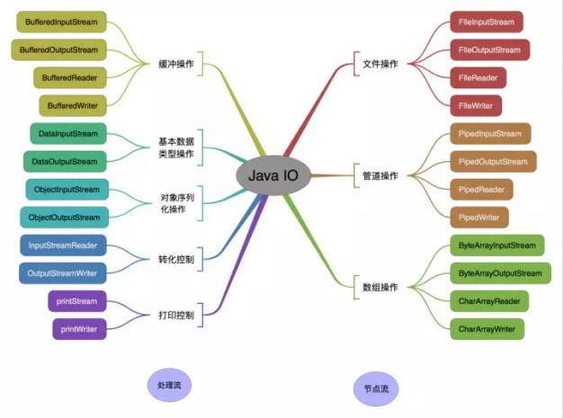
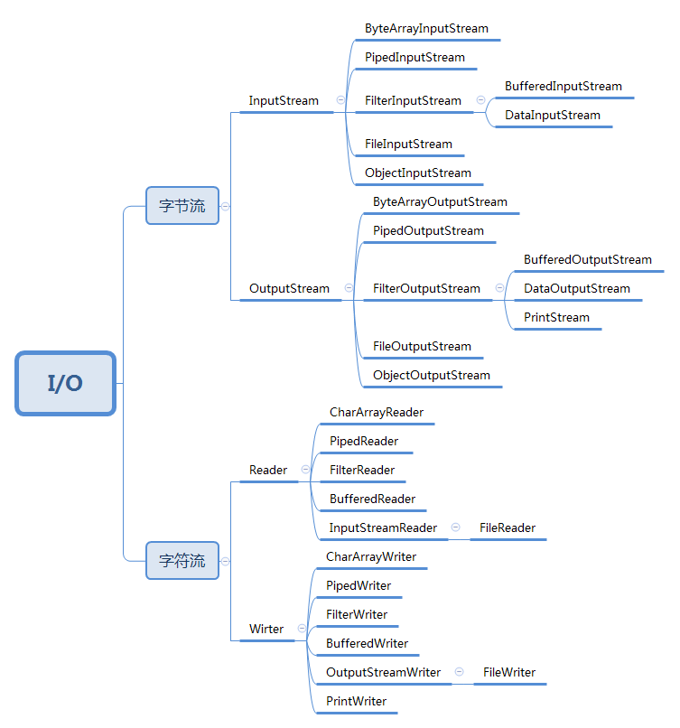

## 1、IO体系

Java IO 体系看起来类很多，感觉很复杂，但其实是 IO 涉及的因素太多了。在设计 IO 相关的类时，编写者也不是从同一个方面考虑的，所以会给人一种很乱的感觉，并且还有设计模式的使用，更加难以使用这些 IO 类，所以特地对 Java 的 IO 做一个总结。

IO 类设计出来，肯定是为了解决 IO 相关的操作的，想一想哪里会有 IO 操作？网络、磁盘。网络操作相关的类是在 java.net 包下，不在本文的总结范围内。提到磁盘，你可能会想到文件，文件操作在 IO 中是比较典型的操作。在 Java 中引入了 “流” 的概念，它表示任何有能力产生数据源或有能力接收数据源的对象。数据源可以想象成水源，海水、河水、湖水、一杯水等等。数据传输可以想象为水的运输，古代有用桶运水，用竹管运水的，现在有钢管运水，不同的运输方式对应不同的运输特性。

**从数据来源或者说是操作对象角度看，IO 类可以分为：**

- 1、文件（file）：FileInputStream、FileOutputStream、FileReader、FileWriter
- 2、数组（[]）： 
  - 2.1、字节数组（byte[]）：ByteArrayInputStream、ByteArrayOutputStream
  - 2.2、字符数组（char[]）：CharArrayReader、CharArrayWriter
- 3、管道操作：PipedInputStream、PipedOutputStream、PipedReader、PipedWriter
- 4、基本数据类型：DataInputStream、DataOutputStream
- 5、缓冲操作：BufferedInputStream、BufferedOutputStream、BufferedReader、BufferedWriter
- 6、打印：PrintStream、PrintWriter
- 7、对象序列化反序列化：ObjectInputStream、ObjectOutputStream
- 8、转换：InputStreamReader、OutputStreWriter
- 9、~~字符串（String）~~**Java8中已废弃**：~~StringBufferInputStream、StringBufferOutputStream、StringReader、StringWriter~~ 

数据源节点也可以再进行二次处理，使数据更加容易使用，所以还可以划分成节点流和处理流，这里涉及到设计模式，后面会有专门的文章说。



按操作对象划分.jpg

从数据传输方式或者说是运输方式角度看，可以将 IO 类分为：


- 1、字节流
- 2、字符流

字节流是以一个字节单位来运输的，比如一杯一杯的取水。而字符流是以多个字节来运输的，比如一桶一桶的取水，一桶水又可以分为几杯水。

**字节流和字符流的区别：**

字节流读取单个字节，字符流读取单个字符（一个字符根据编码的不同，对应的字节也不同，如 UTF-8 编码是 3 个字节，中文编码是 2 个字节。）字节流用来处理二进制文件（图片、MP3、视频文件），字符流用来处理文本文件（可以看做是特殊的二进制文件，使用了某种编码，人可以阅读）。简而言之，字节是个计算机看的，字符才是给人看的。

字节流和字符流的划分可以看下面这张图。



按字节和字符划分.png

不可否认，Java IO 相关的类确实很多，但我们并不是所有的类都会用到，我们常用的也就是文件相关的几个类，如文件最基本的读写类 File 开头的、文件读写带缓冲区的类 Buffered 开头的类，对象序列化反序列化相关的类 Object 开头的类。

## 2、IO类和相关方法

IO 类虽然很多，但最基本的是 4 个抽象类：InputStream、OutputStream、Reader、Writer。最基本的方法也就是一个读 read() 方法、一个写 write() 方法。方法具体的实现还是要看继承这 4 个抽象类的子类，毕竟我们平时使用的也是子类对象。这些类中的一些方法都是（Native）本地方法、所以并没有 Java 源代码，这里给出笔者觉得不错的 Java IO 源码分析 [传送门](https://blog.csdn.net/panweiwei1994/article/details/78046000)，按照上面这个思路看，先看子类基本方法，然后在看看子类中还新增了那些方法，相信你也可以看懂的，我这里就只对上后面说的常用的类进行总结。

先来看 InputStream 和 OutStream 中的方法简介，因为都是抽象类、大都是抽象方法、所以就不贴源码喽！**注意这里的读取和写入，其实就是获取（输入）数据和输出数据。**

**InputStream 类**

| 方法                                         | 方法介绍                                                     |
| -------------------------------------------- | ------------------------------------------------------------ |
| public abstract int read()                   | 读取数据                                                     |
| public int read(byte b[])                    | 将读取到的数据放在 byte 数组中，该方法实际上是根据下面的方法实现的，off 为 0，len 为数组的长度 |
| public int read(byte b[], int off, int len)  | 从第 off 位置读取 len 长度字节的数据放到 byte 数组中，流是以 -1 来判断是否读取结束的（注意这里读取的虽然是一个字节，但是返回的却是 int 类型 4 个字节，这里当然是有原因，这里就不再细说了，推荐这篇文章，[链接](https://blog.csdn.net/congwiny/article/details/18922847)） |
| public long skip(long n)                     | 跳过指定个数的字节不读取，想想看电影跳过片头片尾             |
| public int available()                       | 返回可读的字节数量                                           |
| public void close()                          | 读取完，关闭流，释放资源                                     |
| public synchronized void mark(int readlimit) | 标记读取位置，下次还可以从这里开始读取，使用前要看当前流是否支持，可以使用 markSupport() 方法判断 |
| public synchronized void reset()             | 重置读取位置为上次 mark 标记的位置                           |
| public boolean markSupported()               | 判断当前流是否支持标记流，和上面两个方法配套使用             |

**OutputStream 类**

| 方法                                          | 方法介绍                                                     |
| --------------------------------------------- | ------------------------------------------------------------ |
| public abstract void write(int b)             | 写入一个字节，可以看到这里的参数是一个 int 类型，对应上面的读方法，int 类型的 32 位，只有低 8 位才写入，高 24 位将舍弃。 |
| public void write(byte b[])                   | 将数组中的所有字节写入，和上面对应的 read() 方法类似，实际调用的也是下面的方法。 |
| public void write(byte b[], int off, int len) | 将 byte 数组从 off 位置开始，len 长度的字节写入              |
| public void flush()                           | 强制刷新，将缓冲中的数据写入                                 |
| public void close()                           | 关闭输出流，流被关闭后就不能再输出数据了                     |

再来看 Reader 和 Writer 类中的方法，你会发现和上面两个抽象基类中的方法很像。

**Reader 类**

| 方法                                                    | 方法介绍                                                     |
| ------------------------------------------------------- | ------------------------------------------------------------ |
| public int read(java.nio.CharBuffer target)             | 读取字节到字符缓存中                                         |
| public int read()                                       | 读取单个字符                                                 |
| public int read(char cbuf[])                            | 读取字符到指定的 char 数组中                                 |
| abstract public int read(char cbuf[], int off, int len) | 从 off 位置读取 len 长度的字符到 char 数组中                 |
| public long skip(long n)                                | 跳过指定长度的字符数量                                       |
| public boolean ready()                                  | 和上面的 available() 方法类似                                |
| public boolean markSupported()                          | 判断当前流是否支持标记流                                     |
| public void mark(int readAheadLimit)                    | 标记读取位置，下次还可以从这里开始读取，使用前要看当前流是否支持，可以使用 markSupport() 方法判断 |
| public void reset()                                     | 重置读取位置为上次 mark 标记的位置                           |
| abstract public void close()                            | 关闭流释放相关资源                                           |

**Writer 类**

| 方法                                                       | 方法介绍                                                     |
| ---------------------------------------------------------- | ------------------------------------------------------------ |
| public void write(int c)                                   | 写入一个字符                                                 |
| public void write(char cbuf[])                             | 写入一个字符数组                                             |
| abstract public void write(char cbuf[], int off, int len)  | 从字符数组的 off 位置写入 len 数量的字符                     |
| public void write(String str)                              | 写入一个字符串                                               |
| public void write(String str, int off, int len)            | 从字符串的 off 位置写入 len 数量的字符                       |
| public Writer append(CharSequence csq)                     | 追加吸入一个字符序列                                         |
| public Writer append(CharSequence csq, int start, int end) | 追加写入一个字符序列的一部分，从 start 位置开始，end 位置结束 |
| public Writer append(char c)                               | 追加写入一个 16 位的字符                                     |
| abstract public void flush()                               | 强制刷新，将缓冲中的数据写入                                 |
| abstract public void close()                               | 关闭输出流，流被关闭后就不能再输出数据了                     |

下面我们就直接使用他们的子类，在使用中再介绍下面没有的新方法。

**1、读取控制台中的输入**

至于控制台的输出，我们其实一直都在使用呢，`System.out.println()` ，out 其实是 PrintStream 类对象的引用，PrintStream 类中当然也有 write() 方法，但是我们更常用 print() 方法和 println() 方法，因为这两个方法可以输出的内容种类更多，比如一个打印一个对象，实际调用的对象的 toString() 方法。

**2、二进制文件的写入和读取**

注意这里文件的路径，可以根据自己情况改一下，虽然这里的文件后缀是txt，但该文件却是一个二进制文件，并不能直接查看。

```java
@Test
    public void test04() throws IOException {
        byte[] bytes = {12,21,34,11,21};
        FileOutputStream fileOutputStream = new FileOutputStream(new File("").getAbsolutePath()+"/io/test.txt");
        // 写入二进制文件，直接打开会出现乱码
        fileOutputStream.write(bytes);
        fileOutputStream.close();
    }

    @Test
    public void test05() throws IOException {
        FileInputStream fileInputStream = new FileInputStream(new File("").getAbsolutePath()+"/io/test.txt");
        int c;
        // 读取写入的二进制文件，输出字节数组
        while ((c = fileInputStream.read()) != -1) {
            System.out.print(c);
        }
    }
```

**3、文本文件的写入和读取**

write() 方法和 append() 方法并不是像方法名那样，一个是覆盖内容，一个是追加内容，append() 内部也是 write() 方法实现的，也非说区别，也就是 append() 方法可以直接写 null，而 write() 方法需要把 null 当成一个字符串写入，所以两者并无本质的区别。**需要注意的是这里并没有指定文件编码，可能会出现乱码的问题。**

```java
@Test
    public void test06() throws IOException {
        FileWriter fileWriter = new FileWriter(new File("").getAbsolutePath()+"/io/test.txt");
        fileWriter.write("Hello，world！\n欢迎来到 java 世界\n");
        fileWriter.write("不会覆盖文件原本的内容\n");
//        fileWriter.write(null); 不能直接写入 null
        fileWriter.append("并不是追加一行内容，不要被方法名迷惑\n");
        fileWriter.append(null);
        fileWriter.flush();
        System.out.println("文件的默认编码为" + fileWriter.getEncoding());
        fileWriter.close();
    }

    @Test
    public void test07() throws IOException {
        FileWriter fileWriter = new FileWriter(new File("").getAbsolutePath()+"/io/test.txt", false); // 关闭追加模式，变为覆盖模式
        fileWriter.write("Hello，world！欢迎来到 java 世界\n");
        fileWriter.write("我来覆盖文件原本的内容");
        fileWriter.append("我是下一行");
        fileWriter.flush();
        System.out.println("文件的默认编码为" + fileWriter.getEncoding());
        fileWriter.close();
    }

    @Test
    public void test08() throws IOException {
        FileReader fileReader = new FileReader(new File("").getAbsolutePath()+"/io/test.txt");
        BufferedReader bufferedReader = new BufferedReader(fileReader);
        String str;
        while ((str = bufferedReader.readLine()) != null) {
            System.out.println(str);
        }
        fileReader.close();
        bufferedReader.close();
    }

    @Test
    public void test09() throws IOException {
        FileReader fileReader = new FileReader(new File("").getAbsolutePath()+"/io/test.txt");
        int c;
        while ((c = fileReader.read()) != -1) {
            System.out.print((char) c);
        }
    }
```

使用字节流和字符流的转换类 InputStreamReader 和 OutputStreamWriter 可以指定文件的编码，使用 Buffer 相关的类来读取文件的每一行。

```java
@Test
    public void test10() throws IOException {
        FileOutputStream fileOutputStream = new FileOutputStream(new File("").getAbsolutePath()+"/io/test2.txt");
        OutputStreamWriter outputStreamWriter = new OutputStreamWriter(fileOutputStream, "GBK"); // 使用 GBK 编码文件
        outputStreamWriter.write("Hello，world！\n欢迎来到 java 世界\n");
        outputStreamWriter.append("另外一行内容");
        outputStreamWriter.flush();
        System.out.println("文件的编码为" + outputStreamWriter.getEncoding());
        outputStreamWriter.close();
        fileOutputStream.close();
    }

    @Test
    public void test11() throws IOException {
        FileInputStream fileInputStream = new FileInputStream(new File("").getAbsolutePath()+"/io/test2.txt");
        InputStreamReader inputStreamReader = new InputStreamReader(fileInputStream, "GBK"); // 使用 GBK 解码文件
        BufferedReader bufferedReader = new BufferedReader(inputStreamReader);
        String str;
        while ((str = bufferedReader.readLine()) != null) {
            System.out.println(str);
        }
        bufferedReader.close();
        inputStreamReader.close();
    }
```

**4、复制文件**

这里笔者做了一些测试，不使用缓冲对文件复制时间的影响，文件的复制实质还是文件的读写。缓冲流是处理流，是对节点流的装饰。

注：这里的时间是在我这台华硕笔记本上测试得到的，只是为了说明使用缓冲对文件的读写有好处。

```java
@Test
    public void  test12() throws IOException {
        // 输入和输出都使用缓冲流
        FileInputStream in = new FileInputStream("E:\\视频资料\\大数据原理与应用\\1.1大数据时代.mp4");
        BufferedInputStream inBuffer = new BufferedInputStream(in);
        FileOutputStream out = new FileOutputStream("1.1大数据时代.mp4");
        BufferedOutputStream outBuffer = new BufferedOutputStream(out);
        int len = 0;
        byte[] bs = new byte[1024];
        long begin = System.currentTimeMillis();
        while ((len = inBuffer.read(bs)) != -1) {
            outBuffer.write(bs, 0, len);
        }
        System.out.println("复制文件所需的时间：" + (System.currentTimeMillis() - begin)); // 平均时间约 200 多毫秒
        inBuffer.close();
        in.close();
        outBuffer.close();
        out.close();
    }


    @Test
    public void  test13() throws IOException {
        // 只有输入使用缓冲流
        FileInputStream in = new FileInputStream("E:\\视频资料\\大数据原理与应用\\1.1大数据时代.mp4");
        BufferedInputStream inBuffer = new BufferedInputStream(in);
        FileOutputStream out = new FileOutputStream("1.1大数据时代.mp4");
        int len = 0;
        byte[] bs = new byte[1024];
        long begin = System.currentTimeMillis();
        while ((len = inBuffer.read(bs)) != -1) {
            out.write(bs, 0, len);
        }
        System.out.println("复制文件所需时间：" + (System.currentTimeMillis() - begin)); // 平均时间约 500 多毫秒
        inBuffer.close();
        in.close();
        out.close();
    }

    @Test
    public void test14() throws IOException {
        // 输入和输出都不使用缓冲流
        FileInputStream in = new FileInputStream("E:\\视频资料\\大数据原理与应用\\1.1大数据时代.mp4");
        FileOutputStream out = new FileOutputStream("1.1大数据时代.mp4");
        int len = 0;
        byte[] bs = new byte[1024];
        long begin = System.currentTimeMillis();
        while ((len = in.read(bs)) != -1) {
            out.write(bs, 0, len);
        }
        System.out.println("复制文件所需时间：" + (System.currentTimeMillis() - begin)); // 平均时间 700 多毫秒
        in.close();
        out.close();
    }

    @Test
    public void test15() throws IOException {
        // 不使用缓冲
        FileInputStream in = new FileInputStream("E:\\视频资料\\大数据原理与应用\\1.1大数据时代.mp4");
        FileOutputStream out = new FileOutputStream("1.1大数据时代.mp4");
        int len = 0;
        long begin = System.currentTimeMillis();
        while ((len = in.read()) != -1) {
            out.write(len);
        }
        System.out.println("复制文件所需时间：" + (System.currentTimeMillis() - begin)); // 平均时间约 160000 毫秒，约 2 分多钟
        in.close();
        out.close();
    }
```

