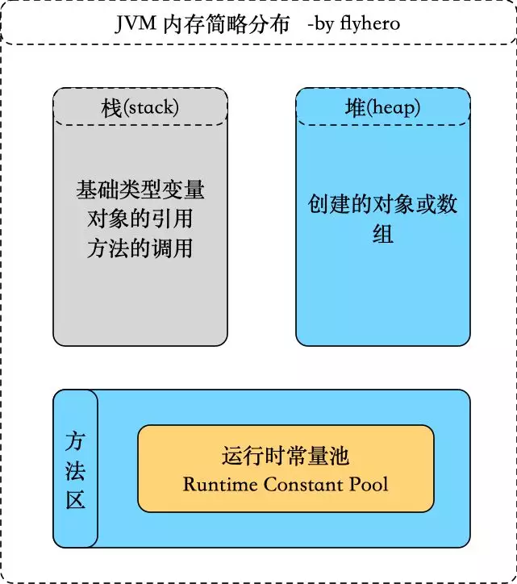
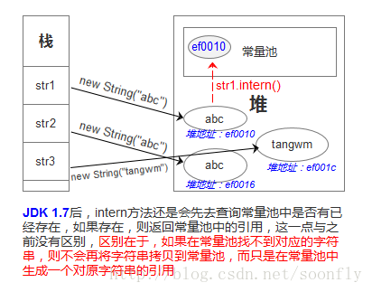

# 一片文章撸完和String相关知识点

### String 简介

**String定义:**

```
public final class Stringimplements java.io.Serializable,Comparable<String>,CharSequence{}
```

### **为什么设计为不可变类呢？**

String设计为不可变类主要考虑到：**效率和安全**。

- **效率：**

  1.在早期的JVM实现版本中，被final修饰的方法会被转为内嵌调用以提升执行效率。而从Java SE5/6开始，就渐渐摈弃这种方式了。因此在现在的Java SE版本中，不需要考虑用final去提升方法调用效率。只有在确定不想让该方法被覆盖时，才将方法设置为final。

  2.缓存hashcode，String不可变，所以hashcode不变，这样缓存才有意义，不必重新计算。

- **安全：**String常被作为网络连接，文件操作等参数类型，倘若可改变，会出现意想不到的结果。

测试掌握程度

为了不浪费你的时间，请看下面的题目，若你一目了然，可以跳过本文了。

```
public class StringTest {    
	public static void main(String[] args) {        
        String str1 = "HelloFlyapi";        
        String str2 = "HelloFlyapi";        
        String str3 = new String("HelloFlyapi");        
        String str4 = "Hello";        
        String str5 = "Flyapi";        
        String str6 = "Hello" + "Flyapi";        
        String str7 = str4 + str5;
        System.out.println("str1 == str2 result: " + (str1 == str2));
        System.out.println("str1 == str3 result: " + (str1 == str3));
        System.out.println("str1 == str6 result: " + (str1 == str6));
        System.out.println("str1 == str7 result: " + (str1 == str7));
        System.out.println("str1 == str7.intern() result: " + (str1 == str7.intern()));
        System.out.println("str3 == str3.intern() result: " + (str3 == str3.intern()));    		}
}
```


## String 的创建方式

从上面的题中你会知道，String的创建方式有两种：

​	  **直接赋值**

- 此方式在方法区中字符串常量池中创建对象

  ```
  String str = "flyapi";
  ```

  **构造器**

- 此方式在堆内存创建对象

  ```
  String str = new String("value");
  ```


## 分析

要理解String，那么要了解JVM内存中的栈(stack)、堆(heap)和方法区。JDK1.6简要图如下（JDK1.7之后，常量区移到了堆里面，这个在jvm部分会有讲解）：



**str1 == str2**

```
String str1 = "HelloFlyapi"; 
String str2 = "HelloFlyapi";
System.out.println(str1 == str2); // true
```

当执行第一句时，JVM会先去常量池中查找是否存在HelloFlyapi，当存在时直接返回常量池里的引用；当不存在时，会在字符创常量池中创建一个对象并返回引用。

当执行第二句时，同样的道理，由于第一句已经在常量池中创建了，所以直接返回上句创建的对象的引用。

**str1 == str3**

```
  String str1 = "HelloFlyapi";  
  String str3 = new String("HelloFlyapi");
  System.out.println(str1 == str3); // false
```

执行第一句，同上第一句。

执行第二句时，会在堆（heap）中创建一个对象，当字符创常量池中没有‘HelloFlyapi’时，会在常量池中也创建一个对象；当常量池中已经存在了，就不会创建新的了。

**str1 == str6**

```
 String str1 = "HelloFlyapi";  
 String str6 = "Hello" + "Flyapi";
 System.out.println(str1 == str6); // true
```

由于”Hello”和”Flyapi”都是常量，**编译时**，第二句会被自动编译为‘String str6 = “HelloFlyapi”;

**str1 == str7**

```
String str1 = "HelloFlyapi";  
String str4 = "Hello";  
String str5 = "Flyapi";  
String str7 = str4 + str5;
System.out.println(str1 == str7); // false
```

其中前三句变量存储的是常量池中的引用地址。

第四句执行时，JVM会在堆（heap）中创建一个以str4为基础的**一个StringBuilder对象**，然后调用StringBuilder的append()方法完成与str5的合并，之后会调用toString()方法在堆（heap）中创建一个String对象，并把这个String对象的引用赋给str7。

## 常用方法

下面是 String 类支持的方法，更多详细，参看 Java String API 文档:

| 方法                                           | 描述                                                         |
| ---------------------------------------------- | ------------------------------------------------------------ |
| char charAt(int index)                         | 返回指定索引处的 char 值。                                   |
| int compareTo(Object o)                        | 把这个字符串和另一个对象比较。                               |
| int compareTo(String anotherString)            | 按字典顺序比较两个字符串。                                   |
| boolean endsWith(String suffix)                | 测试此字符串是否以指定的后缀结束。                           |
| boolean equals(Object anObject)                | 将此字符串与指定的对象比较。                                 |
| boolean equalsIgnoreCase(String anotherString) | 将此 String 与另一个 String 比较，不考虑大小写。             |
| byte[] getBytes()                              | 使用平台的默认字符集将此 String 编码为 byte 序列，并将结果存储到一个新的 byte 数组中。 |
| byte[] getBytes(String charsetName)            | 使用指定的字符集将此 String 编码为 byte 序列，并将结果存储到一个新的 byte 数组中。 |
| int indexOf(int ch)                            | 返回指定字符在此字符串中第一次出现处的索引。                 |
| int indexOf(int ch, int fromIndex)             | 返回在此字符串中第一次出现指定字符处的索引，从指定的索引开始搜索。 |
| int indexOf(String str)                        | 返回指定子字符串在此字符串中第一次出现处的索引。             |
| int indexOf(String str, int fromIndex)         | 返回指定子字符串在此字符串中第一次出现处的索引，从指定的索引开始。 |
| String intern()                                | 返回字符串对象的规范化表示形式。                             |
| int lastIndexOf(int ch)                        | 返回指定字符在此字符串中最后一次出现处的索引。               |
| int lastIndexOf(String str)                    | 返回指定子字符串在此字符串中最右边出现处的索引。             |
| int length()                                   | 返回此字符串的长度。                                         |
| boolean matches(String regex)                  | 告知此字符串是否匹配给定的正则表达式。                       |
| String replace(char oldChar, char newChar)     | 返回一个新的字符串，它是通过用 newChar 替换此字符串中出现的所有 oldChar 得到的。 |
| String[] split(String regex)                   | 根据给定正则表达式的匹配拆分此字符串。                       |
| boolean startsWith(String prefix)              | 测试此字符串是否以指定的前缀开始。                           |
| String substring(int beginIndex)               | 返回一个新的字符串，它是此字符串的一个子字符串。             |
| String substring(int beginIndex, int endIndex) | 返回一个新字符串，它是此字符串的一个子字符串。               |
| char[] toCharArray()                           | 将此字符串转换为一个新的字符数组。                           |
| String toLowerCase()                           | 使用默认语言环境的规则将此 String 中的所有字符都转换为小写。 |
| String toUpperCase()                           | 使用默认语言环境的规则将此 String 中的所有字符都转换为大写。 |
| String trim()                                  | 返回字符串的副本，忽略前导空白和尾部空白。                   |

## String相关

由于String的不可变性导致，字符串变更时效率低下，在之后得JDK版本中出现了StringBuilder和StringBuffer 。

| 类            | 可变性 | 线程安全 |
| ------------- | ------ | -------- |
| String        | 不可变 | 安全     |
| StringBuffer  | 可变   | 安全     |
| StringBuilder | 可变   | 非安全   |


**使用选择**

1、当有少量连接操作时，使用String

2、当单线程下有大量连接操作时，使用StringBuilder

3、当多线程下有大量连接操作时，使用StringBuffer

## 难点-intern方法

```
String s1="String";
String s2="test";
	    	
String test1 = s1+s2;
System.out.println(test1.intern() == test1);
```

这段程序在jdk1.6 下执行会得到 false 的结果

在jdk1.7以及之后的版本中执行会得到 true的结果


JDK1.6中，当调用 intern() 方法时，编译器会将字符串添加到常量池中（stringTable维护），并返回指向该常量的引用。 通过字面量赋值创建字符串（如：String str=”String”）时，会先在常量池中查找是否存在相同的字符串，若存在，则将栈中的引用直接指向该字符串；若不存在，则在常量池中生成一个字符串，再将栈中的引用指向该字符串。

所以，在jdk1.6-环境下调用 test1.intern()执行过程是查看常量池中是否有“Stringtest”的常量，没有，于是在常量中创建一个字符串常量“Stringtest”,并且返回地址。所以test1.intern() == test1进行判断得到的是false。



JDK 1.7后，intern方法还是会先去查询常量池中是否有已经存在，如果存在，则返回常量池中的引用，这一点与之前没有区别，区别在于，如果在常量池找不到对应的字符串，则不会再将字符串拷贝到常量池，而只是在常量池中生成一个对原字符串的引用。简单的说，就是往常量池放的东西变了：原来在常量池中找不到时，复制一个副本放到常量池，1.7后则是将在堆上的地址引用复制到常量池。 

所以，在jdk1.7+环境下调用 test1.intern()执行过程是查看常量池中是否有“Stringtest”的常量，没有，于是在常量中创建了一个到堆中“Stringtest”对象的地址ef0010。所以test1.intern() == test1进行判断得到的是true。

在JDK1.7环境下执行如下代码得到的结果是： false false

```
    	String s1="String";
	    String s2="test";
	    	
	    String test1 = s1+s2;
	    String test11="Stringtest";
	    System.out.println(test1.intern() == test1);
```

这是因为调动test1.intern（）方法的时候，发现常量池中已经存在改常量（test11定义生成的），所以返回的是test11内存地址，当然与test1 内存地址不同了。


但是有一个非常奇怪的问题就是：

```
 			String s1="String";
	    	String s2="test";
	    	
	        String test1 = s1+s2;
	        System.out.println(test1.intern() == test1);
	      
	        String s3="ja";
	        String s4="va";

	        String test2 = s3+s4;
	        System.out.println(test2.intern() == test2);
```

结果打印出的结果是true false。第一个true非常好理解了。但是第二个false就完全没法理解。当时猜测在常量区可能是关键字的常量，尝试把java换成其他关键字如 final，class等，打印的结果都是true。

这里有清楚的同学可以指正一下。


