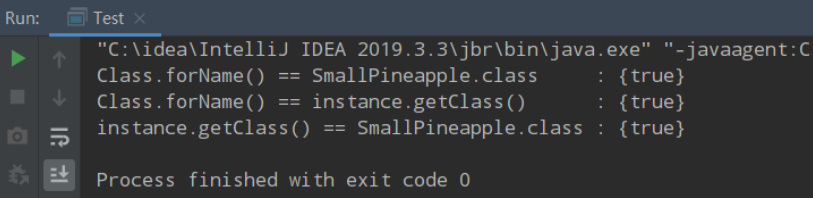
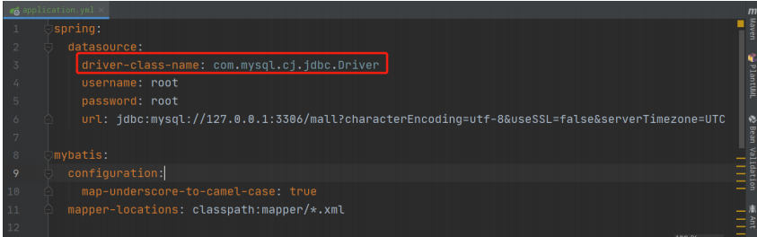
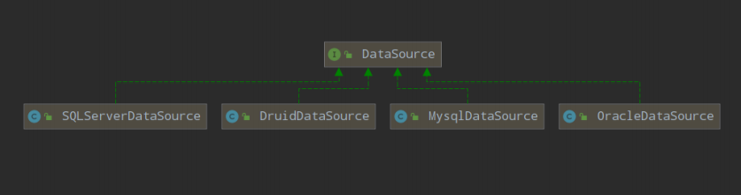

# 反射的思想及作用

反射式一个非常重要的知识点，在学习Spring框架时，Bean的初始化用到了反射，在破坏单例模式时也用到了反射，在获得标注的注解时也会用到反射……

在学习反射之前，先了解正射是什么，我们平时用的最多的new方式实例化的方式就是一种正射的体现。加入我需要实例化一个HashMap

~~~java
Map<Integer, Integer> map = new HashMap<>();
map.put(1,1);
~~~

某一天发现，该段程序不适合用HashMap存储键值对，更倾向于用LinkedHashMap存储，重新编写代码后变成下面这个样子

~~~java
Map<Integer, Integer> map = new LinkedHashMap<>();
map.put(1,1);
~~~

> 我们每次改变一种需求，都要去重新修改源码，然后对源码进行编译，打包，再到JVM上重启项目。这些步骤下来，效率非常低

对于这种**需求频繁变更但变更不大**的场景，频繁地更改源码肯定是一种不允许地操作，我们可以使用一个==开关==，判断什么时候使用哪一种数据结构

~~~java
public Map<Integer, Integer> getMap(String param) {
    Map<Integer, Integer> map = null;
    if (param.equals("HashMap")) {
        map = new HashMap<>();
    } else if (param.equals("LinkedHashMap")) {
        map = new LinkedHashMap<>();
    } else if (param.equals("WeakHashMap")) {
        map = new WeakHashMap<>();
    }
    return map;
}
~~~

通过传入参数param决定使用哪一种数据结构，可以再项目运行时，通过动态传入参数决定使用哪一个数据结构

如果某一天还想用TreeMap，还是避免不了修改源码，重新编译执行地弊端。这个时候，反射就派上用场了

在代码运行之前，我们不确定将来会使用哪一种数据结构，只有在程序运行时才决定使用哪一个数据类，而反射可以在程序运行过程中动态获取类信息和调用类方法。通过反射构造类实例，代码会演变成下面这样

~~~java
public Map<Integer, Integer> getMap(String className) {
	Class clazz = Class.forName(className);
    Constructor con = clazz.getConstructor();
    return (Map<Integer, Integer>)con.newInstance();
}
~~~

无论使用什么Map，只要实现了Map接口，就可以使用==全类名路径==传入到方法中，获得对应地Map实例

我们来回顾一下如何从==new==一个对象引出使用==反射==的

- 在不使用反射时，构造对象使用new方式实现，这种方式在编译期就可以把对象的类型确定下来
- 如果需求发生变更，需要构造另一个对象，则需要修改源码，非常不优雅，所以我们通过使用开关，在程序运行时判断需要构造哪一个对象，在运行时可以变更开关来实例化不同的数据结构
- 如果还有其他扩展的类可能被使用，就会创建出更多的分支，且在编码时不知道有什么其他的类被使用到，假如日后==Map==接口下多了一个集合类是==xxxHashMap==，还得创建分支，此时引出了反射：可以在==运行时==才确定使用哪一个数据类，在切换类时，无需修改源码、编译程序

第一章总结：

- 反射的思想：在程序运行过程中确定和解析数据类的类型
- 反射的作用：对于在==编译器==无法确定使用哪种数据类的场景，通过==反射==可以在程序运行时**构造出不同的数据类实例**

## 反射的基本使用

Java反射的主要组成部分有4个：

- ==Class==：任何运行在内存中的所有类都是该Class类的实例对象，每个Class类对象内部都包含了本来的所有信息。记着一句话，通过反射干任何事，先找Class准没错！
- ==Filed==：描述一个类的**属性**，内部包含了该属性的所有信息，例如**数据类型，属性名，访问修饰符……**
- ==Constructor==：描述一个类的构造方法，内部包含了构造方法的所有信息，例如**参数类型，参数名字，访问修饰符……**
- ==Method==：描述一个类的所有方法（包括抽象方法），内部包含了该方法的所有信息，与==Constructor==类似，不同之处事Method拥有**返回值类型**信息，因为构造方法事没有返回值的

如果用到了反射，离不开这4个类

- Java反射相关类
  - Class类
    - 正在运行内存中的所有类都是该类的实例对象，每个Class类都包含本类的所有信息
    - 类内部主要信息
      - Field：所有属性
      - Method：所有方法
      - Constructor：所有构造方法
  - Field类
    - 通过反射获取到一个Field对象时，其内部包含了某个类总其中一个属性的所有信息
    - 类内部主要信息
      - 标注在属性上的注解
      - 属性名
      - 属性的数据类型（boolean/double/int/String……）
      - 属性访问修饰符（public/private/protected……）
  - Construcor类
    - 描述Class类中的构造方法的一个类，该类提供了关于所有描述构造方法的信息
    - 类内部主要信息
      - 构造方法的访问修饰符（public/private/protected……）
      - 构造方法的参数
        - 参数的数据类型（int/double……）
        - 参数名字
        - 标注在参数上的注解
  - Method类
    - 描述Class类中所有方法（不包括构造方法）的类，包括描述方法
    - 类内部主要信息
      - Constructor类内部主要信息相同
      - 方法返回值类型（int/double……）

我们在学习反射的基本使用时，会用一个==SmallPineapple==类作为模板进行说明。首先我们先来熟悉这个类的基本组成：属性，构造函数和方法

~~~java
public class SmallPineapple {
    public String name;
    public int age;
    private double weight; //体重只有自己知道
    
    public SmallPineapple() {}
    
    public SmallPineapple(String name, int age) {
        this.name = name;
        this.age = age;
    }
    
    public void getInfo() {
        System.out.print("[" + name + "的年龄是：" + age + "]");
    }
}
~~~

反射中的用法有非常非常多，常见的功能有以下这几个：

- 在运行时获取一个类的**Class对象**
- 在运行时构造一个类的**实例化对象**
- 在运行时获取一个类的所有信息：**变量、方法、构造器、注解**

### 获取类的Class对象

在Java中，每一个类都会有专属于注解的Class对象，当我们编写完 ==.java==文件后，使用 ==javac==编译后，就会产生一个字节码文件 ==.class==，在字节码文件中包含类的所有信息，如==属性==，==构造方法==，==方法==……当字节码文件被装载进虚拟机执行时，会在内存中生成Class对象，它包含了该类北部的所有信息，在程序运行时可以获取这些信息

获取Class对象的方法有3种：

- ==类名.class==：这种获取方式只有在编译前已经声明了该类的类型才能获取到Class对象

  ~~~java
  Class clazz = SamllPineapple.class;
  ~~~

- ==实例 .getClass()==：通过实例化对象获取该实例的Class对象

  ~~~java
  SmallPineapple sp = new SmallPineapple();
  Class clazz = sp.getClass();
  ~~~

- ==Class.forName(className)==：通过类的全限定名获取该类的Class对象

  ~~~java
  Class claszz = Class.forName("com.bean.smallpineapple");
  ~~~

拿到==Class==对象就可以对它为所欲为了：剥开它的皮（获取**类信息**）、指挥它做事（调用它的**方法**），看透它的一切（获取**属性**）

不够再程序中，每个类的Class对象之一一个，也就是说你只有这一个==奴隶==。我们用上面三种方式测试，通过三种方式打印各个==Class==对象都是相同的

~~~java
Class clazz1 = Class 。forName("com.bean.SmallPineapple");
Class clazz2 = SmallPineapple.class;
SmallPineapple instance = new SmallPineapple();
Class clazz3 = instance.getClass();
//比较三个对象是否互相相等
~~~

> 内存中只有一个Class对象的原因要牵扯到==JVM类加载机制==的==双全委派机制==，它保证了程序运行时，==加载类==时每个类在内存中仅会产生一个==Class对象==。可是简单地理解为JVM帮我们保证了一个类在内存至多存在一个Class对象

### 构造类的实例化对象

通过反射构造一个类的实例化方式有2种：

- Class对象调用==newInstance()==方法

  ~~~java
  Class clazz = Class.forName("com.bean.SmallPineapple");
  SmallPineapple smallPineapple = (Smallpineapple) clazz.newInstance();
  smallPineapple.getInfo();
  ~~~

即使SMallPineapple已经显式定义了构造方法，通过newInstance()创建的实例中，所有属性值都是对应类型的==初始值==，因为newInstance()构造实例会**调用默认无参构造**

- Constructor构造器调用==newInstance()==方法

  ~~~java
  Class clazz = Class.forName("com.bean.SmallPineapple");
  Constructor constructor = clazz.getConstructor(String.class,int.class);
  constructor.setAccessible(true);
  SmallPineapple smallPineapple2 = (SmallPineapple) constructor.newInstance("小菠萝",21);
  smallPineapple2.getIndo();
  ~~~

通过getConstructor(Object ... paramTypes)方法获取**指定参数类型**的Constructor，Constructor调用newInstance(Object ... paramValues)时传入构造方法的值，同样可以构造一个实例，且内部属性已经被赋值

通过==Class==对象调用newInstance()会走**默认无参构造方法**，如果想通过显式构造方法构造实例，需要提前从Class中调用==getConstructor()==方法获取对应的构造器，通过构造器区实例化对象

### 获取一个类的所有信息

Class对象中包含了该类的所有信息，在编译期我们能看到信息就是该类的变量、方法、构造体，在运行时最常被获取的也是这些信息

- Class类内部主要信息
  - Field类（变量）
    - 包括public和非类public修饰的构造器
    - 注意获取不了父类的被protected修饰的变量
  - Constructor类（构造器）
    - 包括public和非public修饰的构造器
    - 可以通过setAccessible()方法强制访问该构造器，实例化对象，这是破坏饿汉式和懒汉式单例模式的途径
  - Method类（普通方法）
    - 包括public和非public修饰的方法，且可获取继承下来的方法
    - 注意无法获取父类的被protected关键字修饰的方法

### 获取类中的变量（Field）

- FIeld[] getFilds()：获取类中所有被==public==修饰的所有变量
- Field getField(String name)：根据**变量名**获取类中的一个变量，该**变量必须被public修饰**
- Field[] getDeclareFields()：获取类中所有的变量，但**无法获取继承下来的变量**
- Field getDeclaredField(String name)：根据姓名获取类中的某个变量，**无法获取继承下来的变量**

### 获取类中的方法（Method）

- Method[] getMethods()：获取类中被==public==修饰的所有方法
- Method getMethod(String name,  Class...<?>  paramTypes)：根据名字和参数类型获取对应方法，**该方法必须被==public==修饰**
- Method[] getDeclaredMethods()：获取所有方法，但**无法获取继承下来的方法**
- Method getDeclareMethod(String name, Class...<?>paramTypes)：根据**名字和参数类型获取对应方法，无法获取继承下来的方法**

### 获取类的构造器（Constructor）

- Constructor[] getConstructiors()：获取类中所有被==public==修饰的构造器
- onstructor getConstructor(Class...<?>paramTypes)：根据==参数类型==获取类中某个构造器，该构造器必须被==public==修饰
- Constructor[] getDeclaredConstructors()：获取类中所有构造器
- Constructor getDeclaredConstructor(class...<?>paramTypes)：根据==参数类型==获取对应的构造器

每种功能内部以Declared细分为2类：

> 有Declared修饰的方法：可以获取该类内部的所有变量、方法和构造器，但是无法获取继承下来的信息
>
> 无Declared修饰的方法：可以获取该类中public修饰的变量、方法和构造器，可获取继承下来的信息

如果想获取类中**所有的（包括继承）**变量、方法和构造器，则需要同时调用==getXXXs()==和==getDeclaredXXXs()==两个方法，用==Set==集合存储它们获得的变量、构造器和方法，以防两个方法获取到相同的东西

例如：要获取SmallPineapple获取类中的所有变量，代码应该是下面这样写

~~~java
Class clazz = Class.forName("com.bean.SmallPineapple");
//
Field[] fields1 = clazz.getFields();
//
Field[] fields2 = clazz.getDeclaredFields();
//
Set<Field> allFields = new HashSet<>();
allFields.addAll(Arrays.asList(fields1));
allFields.addAll(Arrays.asLIst(fields2));
~~~

如果父类的属性用==protected==修饰，利用反射是**无法取到**的

protected修饰符的作用范围：值允许==同一个包下==或者==子类==访问，可以继承到子类

getFields()：只能获取到本类的public属性的变量值

getDeclaredFields()：只能获取到==本类的所有属性==，不包括继承的；无论如何都获取不到父类的protected属性修饰的变量，但是它的确存在于子类中

### 获取注解

- Annotation[] getAnnotations()：获取对象上所有注解
- Annotation getAnnotation(Class annotationClass)：传入==注解类型==，获取该对象上的特定一个注解
- Annotation[] getDeclaredAnnotations()：获取该对象上的显式标注的所有注解，无法获取继承下来的注解
- Annotation getDeclaredAnnotation(Class annotationClass)：根据注解类型，获取该对象上的特定一个注解，无法获取继承下来的注解

只有注解的==@Retension==标注为==RUNTIME==时，才能够通过反射获取到该浙江，@Retension有3种保存策略：

- ==SOURCE==：只有在**源文件（.java）**中保存，即该注解只会保留在源文件中，**编译时编译器会忽略该注解**，例如@Override注解
- ==CLASS==：保存在**字节码（.class）**中，注解会随着编译器跟随字节码文件中，但是**运行时**不会对该注解进行解析
- ==RUNTIME==：一直保存到**运行时，用得最多的一种保存策略**，在运行时可以获取到该注解的所有信息

### 通过反射调用方法

通过反射获取到某个Method类对象后，可以通过调用==ivoke==方法执行

- ==invoke(Object obj, Object... args)==：参数1指定调用该方法的对象，参数2是方法的参数列表值

如果调用的方法是静态方法，参数1只需要传入null，因为静态方法不与某个对象有关，只与某个类有关

可以像下面这种做法，通过反射实例化一个对象，然后获取Method方法对象，调用invoke()指定SmallPineapple的getInfo()方法

~~~java
Class clazz = Class.forName("com.bean.SmallPineapple");
Constructor constructor = clazz.getConsructor(String.class, int.class);
constructor.setAccessible(true);
SmallPineapple sp = (SmallPineapple) constructor.newInstance("abc",21);
Method method = clazz.getMethod("getInfo");
if (method != null) {
    method.invoke(sp,null);
}
~~~

## 反射的应用场景

反射常见的应用场景这里介绍3个：

- Spring实例化对象：当程序启动时，Spring会读取配置文件applicationContext.xml并解析出里面所有的标签实例化到IOC容器中
- 反射 + 工厂模式：通过反射消除工厂中的多个分支，如果需要生产新的类，无需关注工厂类，工厂类可以应对各种新增的类，反射可以使得程序更加健壮
- JDBC连接数据库：使用JDBC连接数据库时，指定连接数据库的驱动类时用到反射加载驱动类

### Spring的IOC容器

在Spring中，经常会编写一个上下文配置文件==applicationContext.xml==，里面就是关于==bean==的配置，程序启动时会读取该xml文件，解析出所有的==\<bean>==标签，并实例化对象放入==IOC==容器

~~~xml
<?xml version="1.0" encoding="UTF-8"?>
<beans xmlns="http://www.springframework.org/schema/beans"
       xmlns:xsi="http://www.w3.org/2001/XMLSchema-instance"
       xsi:schemaLocation="http://www.springframework.org/schema/beans
                           http://www.springframework.org/schema/beans/spring-beans.xsd">
    <bean id="smallpineapple" class="com.bean.SmallPineapple">
        <constructor-arg type="java.lang.String" value="a"/>
        <constructor-arg type="int" value="21"/>
    </bean>
</beans>
~~~

在定义好上面的文件后，通过==ClassPathXmlApplicationContext==加载该配置文件，程序启动时，Spring会将该配置文件中的所有bean都实例化，放入IOC容器中，==IOC容器本质上就是一个工厂==，==通过该工厂传入\<bean>标签的id属性获取到对应的实例==

~~~java
public class Main {
    public static void main(String args) {
        ApplicationContext ac = new ClassPathXmlApplicationContext("applicationContext.xml");
        SmallPineapple smallPineapple = (SmallPineapple) ac.getBean("smallpineapple");
        smallPineapple.getInfo();
    }
}
~~~

Spring在实例化对象的过程经过简化之后，可以理解为反射实例化对象的步骤：

- 获取Class对象的==构造器==
- 通过构造器调用==newInstance()实例化对象==

当然Spring在实例化对象时，做了非常多额外的操作，才能够让现在的开发足够的便捷且稳定

### 反射 + 抽象工厂模式

传统的工厂模式，如果需要产生新的子类，**需要修改工厂类，在工厂类中增加新的分支**

~~~java
public class MapFactory {
    public Map<Object, object> produceMap(String name) {
        if ("HashMap".equals(name)) {
            return new HashMap<>();
        } else if ("TreeMap".equals(name)) {
            return new TreeMap<>();
        } // ...
    }
}
~~~

利用反射和工厂模式相结合，在产生新的子类时，==工厂类不用修改任何东西==，可以专注于子类的实现，**当子类确认下来时，工厂也就可以生产该子类了**

反射 + 抽象工厂的**核心思想**是：

- **在运行是通过参数传入不同的全限定名获取到不同的Class对象，调用newInstance()方法返回不同的子类。**反射 + 抽象工厂模式，一般会用于有**继承**或者**接口实现**关系

例如，在运行是才确定使用哪一种Map结构，我们可以利用反射传入某个具体Map的全限定名，实例化一个特定的子类

~~~java
public class MapFactory {
    public Map<Object, Object> produceMap(String className) {
        Class clazz = Class.forName(className);
        Map<Object, Object> map = clazz.newInstance();
        return map;
    }
}
~~~

==className==可以指定为java.util.HashMap，或者java.util.TreeMap等等，根据业务场景来定

### JDBC加载数据库驱动类

在导入第三方库时，JVM不会主动去加载外部的类，而是**等到真正使用时，才会加载需要的类，**正是如此，我们可以在获取数据库连接时传入驱动类的全限定名，交给JVM加载该类

~~~java
public class DBConnectionUtil {
 /** 指定数据库的驱动类 */
 private static final String DRIVER_CLASS_NAME = "com.mysql.jdbc.Driver";

 public static Connection getConnection() {
 Connection conn = null;
 // 加载驱动类
 Class.forName(DRIVER_CLASS_NAME);
 // ឴获取数据库连接对象
 conn = DriverManager.getConnection("jdbc:mysql://···", "root", "root");
 return conn;
 }
}
~~~

这里的driver-class-name，和我们一开始加载的类是不是相似，这里因为**MySQL**版本不同引起的**驱动类不同**，这体现使用反射的好处：不需要修改源码，**仅加载配置文件就可以完成驱动类的替换**

## 反射的优势及缺陷

反射的**优点**：

- 增加程序的灵活性：面对需求变更时，可以灵活地实例化不同对象

但是，有得必有失，一项技术不可能只有优点没有缺点，反射也有**两个比较隐患的缺点**：

- **破坏类的封装性**：可以强制访问private修饰的信息
- **性能损耗**：反射相比直接实例化、调用对象、访问变量，中间需要非常多的**检查步骤和解析步骤**，JVM无法对它们优化

**增加程序的灵活性**

- 利用反射连接数据库，**涉及到数据库的数据源**。在SpringBoot中一切约定大于配置，想要**定制配置**时，使用`application.properties`配置文件指定数据源

**角色1 - Java的设计者**：我们设计好==DataSource==接口，你们其他数据库厂商想要开发者用==你们的数据源==监控数据库，就得实现==我的这个接口==

**角色2 - 数据库厂商**：

- MySQL数据库厂商：我们提供了**com.mysql.cj.jdbc.MysqlDataSource**数据源，开发者可以使用它连接MySQL
- 阿里巴巴厂商：我们提供**com.albaba.druid.pool.DruidDataSource**数据源，具有**页面监控、慢SQL日志记录**等功能
- SQLServer厂商：我们提供了**com.microsoft.sqlserver.jdbc.SQLServerDataSource**数据源

**角色3 - 开发者**：我们可以用==配置文件==指定使用==DruidDataSource==数据源

~~~xml
spring.datasource.type = com.alibaba.druid.pool.DruidDataSource
~~~

**需求变更**：

~~~xml
spring.datasource.type = com.mysql.cj.jdbc.MysqlDataSource
~~~

在改变连接数据库的数据源时，只需要改变配置文件即可，无需修改任何代码，原因是：

- **Spring Boot 底层封装好了连接数据库的数据源配置，利用反射，适配各个数据源**

==Class==对象指定了泛型上界==DataSource==

**无论指定使用哪一种数据源，我们都只需要于配置文件打交道，而无需更改源码，这就是反射的灵活性**

**破坏类的封装性**

很明显的一个特点，反射可以获取类中的==private==修饰的变量、方法和构造器，这**违反了面向对象的封装特性**，因为被private修饰意外着不想对外暴露，只允许本类访问，而==setAccessable(true)==可以无视访问修饰符的限制，外界可以强制访问

**性能损耗**

**在直接new对象并调用对象方法和访问属性是，编译器会在编译器提前检查可访问性，如果尝试进行不正确的访问，IDE会提前提示错误，例如参数传递类型不匹配，非法访问private属性和方法**

> 而在利用反射操作对象时，编译器无法提前得知对象的类型，访问是否合法，参数传递是否匹配。只有在程序允许时调用反射的代码时才会从头开始检查、调用、返回结果，JVM也无法对反射的代码进行优化

虽然反射具有性能损耗的特点，但是我们不能一概而论，产生了使用反射就会性能下降的思想，反射的慢，需要同时调用上100W次才可能体现出来，在几次、几十次的调用，并不能体现反射的性能低下。**在单词调用反射的过程中，性能损耗可以忽略不计。如果程序的性能要求很高，那么尽量不用使用反射**