# 集合

## 集合与数组区别

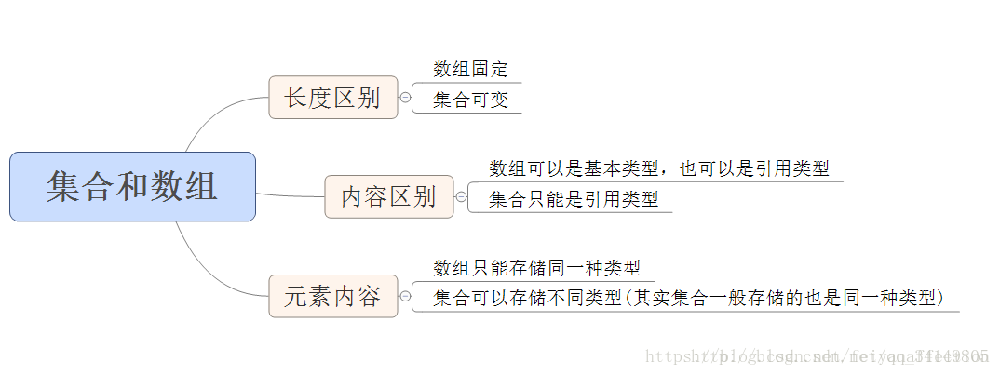


## 集合的结构关系：

Collection 接口的接口 对象的集合（单列集合）
├——-List 接口：元素按进入先后有序保存，可重复
│—————-├ LinkedList 接口实现类， 链表， 插入删除， 没有同步， 线程不安全
│—————-├ ArrayList 接口实现类， 数组， 随机访问， 没有同步， 线程不安全
│—————-└ Vector 接口实现类 数组， 同步， 线程安全
│ ———————-└ Stack 是Vector类的实现类
└——-Set 接口： 仅接收一次，不可重复，并做内部排序
├—————-└HashSet 使用hash表（数组）存储元素
│————————└ LinkedHashSet 链表维护元素的插入次序
└ —————-TreeSet 底层实现为二叉树，元素排好序

Map 接口 键值对的集合 （双列集合）
├———Hashtable 接口实现类， 同步， 线程安全
├———HashMap 接口实现类 ，没有同步， 线程不安全-
│—————–├ LinkedHashMap 双向链表和哈希表实现
│—————–└ WeakHashMap
├ ——–TreeMap 红黑树对所有的key进行排序
└———IdentifyHashMap集合框架组成部分


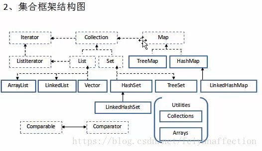

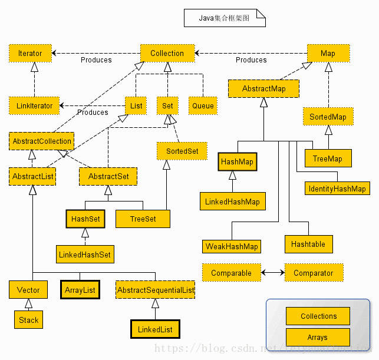


## 集合常见的操作

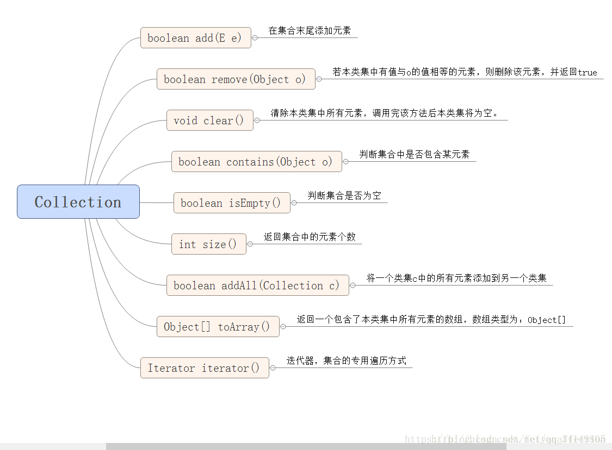


1. 集合框架提供了两个遍历接口：`Iterator`和`ListIterator`，其中后者是前者的优化版，支持在任意一个位置进行前后双向遍历。
2. 整个集合框架分为两个门派：`Collection`和`Map`，前者是一个容器，存储一系列的对象；后者是键值对`<key,value>`，存储一系列的键值对
3. 四种具体的集合类型：Map、Set、List、Queue
4. Map存储`<key,value>`键值对，查找元素时通过`key`查找`value`
5. `Set`内部存储一系列不可重复的对象， 且时一个无序集合，对象排列顺序不一
6. `List`内部存储一系列可重复的对象，是一个有序集合，对象按插入顺序排序
7. `Queue`是一个队列容器，其特性与`List`相同，但只能从队头和队尾操作元素
8. 两个工具类`Collection`和`Arrays`

> Set的操作本质是对Map的操作

## Iterator Iterable Listlterator

`Iterator`接口

```java
public interface Iterator<E> {
    boolean hasNext();
    E next();
    void remove();
}
```

 提供的API接口含义如下:

- hasNext():判断集合是否存在下一个对象
- next():返回集合中的下一个对象,并将访问指针移动一位
- remove():删除集合中调用next()方法返回的对象

在早期, 遍历集合的方式只有一种, 通过`Iterator`迭代器操作

~~~java
List<Integer> list = new ArrayList<>();
list.add(1);
list.add(2);
list.add(3);
Iterator iter = list.iterator();
while (iter.hasNext()) {
    Integer next = iter.next();
    System.out.println(next);
    if (next == 2) {iter.remove();}
}
~~~

`Iterable`接口

~~~java
public interface Iterable<T> {
    Iterator<T> iterator();
    //JDK 1.8
    default void forEach(Consumer<? super T> action) {
        Objects.requireNonNull(action);
        for (T t : this) {
            action.accept(t);
        }
    }
}
~~~

本质上还是调用Iterator去遍历

> 为什么要设计两个接口Iterable和Iterator,而不是保留其中一个就可用了?
>
> 简单讲解:Iterator的保留可用让子类去实现之间的迭代器,而Iterable接口更加关注于for-each的增强语法

小结重点:

1. `Iterator`是提供集合操作内部对象的一个迭代器,它可用遍历和移除对象,且只能单向移动
2. `Iterable`是对`Iterator`的封装,在JDK 1.8时,实现了`Iterable`接口的集合可以使用增强for循环遍历集合对象,我们通过反编译后发现底层还是使用`Iterator`迭代器进行遍历

`ListIterator`,它继承Iterator接口,在遍历`List`集合时可用从任意索引下标开始遍历,而且支持双向遍历.

ListIterator存在于List集合之中,通过调用方法可用返回起始下标为index的迭代器

~~~java
List<Integer> list = new ArrayList<>();
//返回下标为0的迭代器
ListIterator<Integer> listIter1 = list.listIterator();
//返回下标为5的迭代器
ListIterator<Integer> listIter2 = list.listIterator(5);
~~~

~~~java
public interface ListIterator<E> extends Iterator<E> {
    boolean hasNext();
    E next();
    boolean hasPrevious();
    E previous();
    int nextIndex();
    int previousIndex();
    void remove();
    //替换当前下标的元素,即访问过的最后一个元素
    void set(E e);
    void add(E e);
}
~~~

## Map  和 Collection 接口

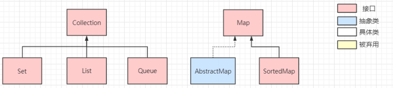

`Map`接口定义了存储的数据结构时`<key, value>`形式,根据`key`映射到`value`,一个key对应一个value,所有`key`不可重复,而`value`可重复

在Map接口下会将存储的方式细分为不同的种类:

- `SortedMap`接口:该类映射可用对`<key, value>`按照自己的规则进行排序,具体实现有TreeMap
- `AbstractMap`:它为子类提供好一些通用的API实现,所有的具体Map如`HashMap`都会继承它而`Collection`接口提供了所有集合的通用方法
- 添加方法:`add(E e)/addAll(Collection<? extends E> var1)`
- 删除方法:`remove(Object var1)/removeAll(Collection<?> var1)`
- 查找方法:`contains(Object var1)/containsAll(Collection<?> var1)`
- 查询集合自身信息:`size()/isEmpty()`
- ...

在`Collection`接口下,同样会将集合细分为不同的种类:

- Set接口:一个不允许存储重复元素的无序集合,具体实现有`HashSet/TreeSet...`
- List接口:一个可存储重复元素的有序集合,具体实现有`ArrayList/LinkedList...`
- Queue接口:一个可存储重复元素的队列,具体实现有`PriorityQueue/ArrayQueue...`

## Collection集合体系详解

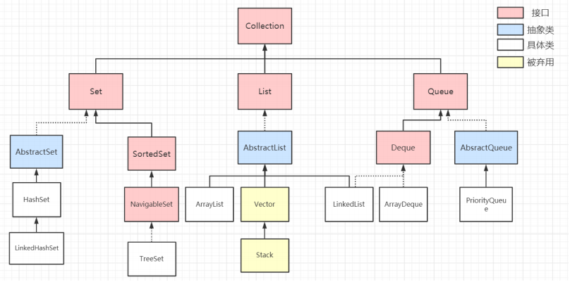

### **Set接口**

Set接口继承了Collection接口, 是一个不包括重复元素的集合, 更确切地说, Set中任意两个元素不会出现o1.equals(o2), 而且Set至多只能存储一个NULL值元素, Set集合的组成部分

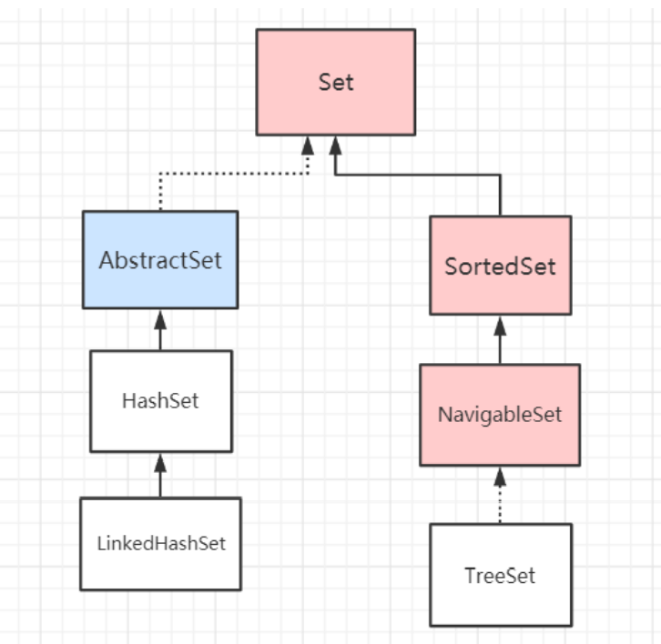

在Set集合体系中,我们需要着重关注两点:

- 存入可变元素时, 必须非常小心, 因为任意时候元素状态的改变都有可能使得Set内部出现两个相等的元素, 即  `o1.euqals(o2) = true`, 所以一般不要更改存入Set中的元素, 否则将会破坏了`euqals()` 的作用
- Set的最大作用就是判重,在项目中最大的作用也是判重

Set有它的实现类和子类: `AbstractSet`和`SortedSet`

### **AbstractSet抽象类**

`AbstractSet`时一个实现Set的一个抽象类, 定义在这里可以将所有具体Set集合的相同行为在这里实现, 避免子类包含大量的重复代码

所有的Set也应该要有相同的`hashCode()`和`equals()`方法, 所以使用抽象类把该方法重写后, 子类无需关心这两个方法.

~~~java
public abstract class AbstractSet<E> implements Set<E> {
    //判断两个Set是否相等
    public boolean equals(Object o) {
    	if (o == this) {
            //集合本身
            return true;
        } else if (!(o instanceof Set)) {
			//集合不是set
            return false;
        } else {
            //比较两个集合的元素是否全部相同
        }
    }
    //计算所有元素的hashcode总和
    public int hashCode() {
        int h = 0;
        Iterator i = this.iterator();
        while (i.hasNext()) {
            E obj = i.next();
            if (obj != null) {
                h += obj.hashCode();
            }
        }
        return h;
    }
}
~~~

### **SortedSet接口**

`SortedSet`是一个接口, 它在Set的基础上扩展了排序的行为, 所以所有实现它的子类都会拥有排序功能

~~~java
public interface SortedSet<E> extends Set<E> {
    //元素的比较器,决定元素的排列顺序
    Comparator<? super E> comparator();
    //获取[var1, var2]之间的set
    SortedSet<E> subSet(E var1, E var2);
    //获取以var1开头的set
    SortedSet<E> headSet(E var1);
    //获取以var1结尾的set
    SortedSet<E> tailSet(E var1);
    //获取首个元素
    E first();
    //获取最后一个元素
    E last();
}
~~~

### **HashSet**

HashSet底层借助HashMap实现,可以观察它的多个构造方法,本质上都是new一个HashMap

~~~java
public class HashSet<E> extends AbstractSet<E> implements Set<E>, Cloneable, Serializable {
    public HashSet() {
        this.map = new HashMap();
    }
    public HashSet(int initialCapacity, float loadFactor) {
        this.map = new HashMap(initalCapacity, loadFactor);
    }
    public HashSet(int initialCapacity) {
        this.map = new HashMap(initialCapacity);
    }
}
~~~

HashSet在HashMap基础上实现, 所以很多地方可以联系到HashMap:

- 底层数据结构: HashSet也是采用`数组 + 链表 + 红黑树`实现
- 线程安全性: 由于采用HashMap实现, 而HashMap本身线程不安全, 在HashSet中没有添加额外的同步策略, 所以HashSet也`线程不安全`
- 存入HashSet 的对象的状态最好不要发生变化,因为可能改变状态后, 在集合内部出现两个元素`o1.equals(o2)`, 破坏了equals()的语义

### **LinkedHashSet**

LinedHashSet继承了HashSet

HashSet中map的实现采用LinkedHashMap, 而LinkedHashMap底层又瞎用HashMap + 双向链表实现的, 所以本质上LinkedHashSet还是使用HashMap实现的

> LinkedHashSet -> LinkedHashMap -> HashMap + 双向链表

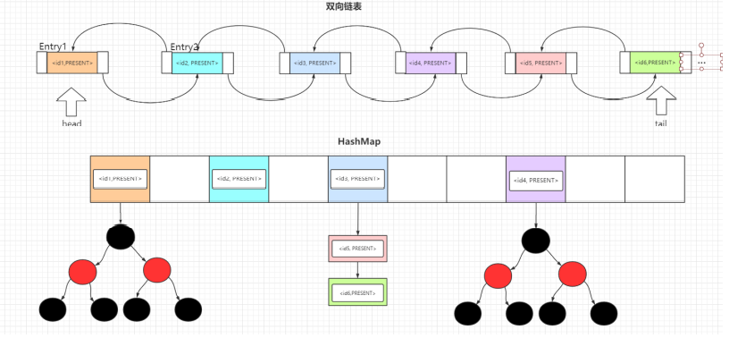

而LinkedHashMap是采用HashMap和双向链表实现的, 这条双向链表中保存了元素的插入顺序, 所以LinkedHashSet可以按照元素的插入顺序遍历元素

LinkedHashSet小结

- 它继承了HashSet, 而HashSet默认是采用HashMap存储数据的, 但是LinkedHashSet调用父类构造方法初始化map时是LinkedHashMap而不是HashMap
- 由于LinkedHashMap不是线程安全的, 且在LinkedHashSet中没有添加额外的同步策略, 所以LinkedHashSet集合也不是线程安全的

### **TreeSet**

TreeSet是基于TreeMap实现, 所以存储的元素是有序的, 底层的数据结构是`数组 + 红黑树`


和TreeMap相同, 有2种排序, 自然排序和定制排序.

~~~java
public TreeSet() {
    this(new TreeMap<E, Object>());
}
public TreeSet(Comparator<? super E> comparator) {
    this(new TreeMap<>(comparator));
}
~~~

TreeSet小结

- TreeSet的所有操作都会转换为对TreeMap的操作, TreeMap采用红黑树实现, 任意操作的平均时间复杂度为O(logN)
- TreeSet是一个线程不安全的集合
- TreeSet常应用于对不重复的元素定制排序

> 注意: TreeSet判断元素是否重复的方法是判断compareTo()方法是否返回0, 而不是调用hashcode() 和equals()方法, 如果返回0则认为集合内已经存在相同的元素, 不会再加入到集合当中

### **List接口**


List接口直接继承Collection接口, 它定义为可以存储重复元素的集合, 并且元素按照插入顺序有序排列, 且可以通过索引访问指定位置的元素. 常见的实现由: ArrayList LinkedList Vector和Stack

### **AbstractList 和 AbstractSequentialList**

AbstractList抽象类实现了List接口, 其内部实现了所有的List都具备的功能, 子类可以专注于实现直接具体的操作逻辑

~~~java
//查找元素 o 第一次出现的索引位置
public int indexOf(Object o)
//查找元素 0 最后一次出现的索引位置
public int lastIndexOf(Object o)
~~~

AbstractSequentialList抽象类继承了AbstractList, 再原基础上限制了访问元素的顺序只能够按照顺序访问, 而不支持随机访问.

如果需要满足随机访问的特性, 则继承了AbstractList. 子类LinkedList使用链表实现, 所以仅能顺序访问, 故继承了AbstractSequentialList而不是AbstractList

### **Vector**

Vector是一种过时的集合了, 性能低下

在线程安全的情况下, 不需要选用Vector集合, 取而代之的是ArrayList集合; 在并法环境下, 出现了`CopyOnWriteArrayList`, 完全弃用Vector

### **Stack**

Stack是一种后入先出(LIFO)型的集合容器

Stack继承了Vector类, 提供了栈顶的压入元素操作(push) 和弹出元素操作(pop), 以及查看栈顶元素的方法(peek)等等, 但由于继承了Vector, 所有慢慢也被淘汰了

取而代之的是Deque接口, 现有ArrayDeque, 该数据结构更加完善, 可靠性更好, 依靠队列也可以实现LIFO的栈操作, 所以优先选择ArrayDeque实现栈

~~~java
Deque<Integer> stack = new ArrayDeque<Integer>();
~~~

ArrayDeque的数据结构是: 数组, 并提供头尾指针下标对数组元素进行操作

### **ArrayList**

ArrayList以数组作为存储结构, 它是线程不安全的集合; 具有查询快, 在数组中间或头部增删慢的特点

ArrayLIst小结:

- 具备随机访问特点, 访问元素的效率比较高, ArrayList在频繁插入, 删除集合元素的场景下效率较低
- 底层数据结构: ArrayList底层使用数组作为存储结构, 具备查找快, 增删慢的特点
- 线程安全性: ArrayList是线程不安全的集合
- ArrayList首次扩容后的长度为**10**, 调用add()时需要计算容器的最小容量. 可以看到如果数组elementData为空数组, 会将最小容量设置为10, 之后会将数组长度完成首次扩容到10
- 集合从第二次扩容开始, 数组长度将扩容为原来的1.5倍, 即: newLength = oldLength * 1.5

### **LinkedList**

LinkedLlist底层采用==双向链表==数据结构存储元素, 由于链表的内存地址==非连续==, 所以它并不具备随机访问的特点, 但由于它利用指针连接各个元素, 所以插入, 删除元素只需要操作指针, 不需要移动元素, 故具有增删快, 查询慢的特点. 它也是一个==非线程安全==的集合

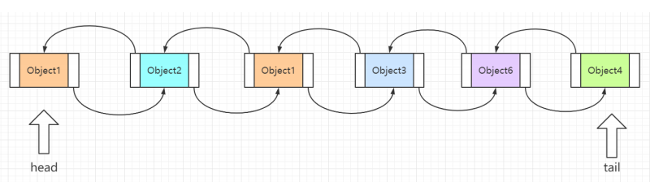

LinkedList小结

- 优势: LinkedList底层没有扩容机制, 使用双向链表存储元素, 所以插入和删除元素效率较高, 适用于频繁操作元素的场景

- 劣势: LinkedList不具备`随机访问`的特点, 查找某个元素只能从head或tail指针一个一个比较, 所以查找中间的元素时效率很低

- 查找优化: LinkedList查找某个下标index的元素时做了优化, 若`index > (size/2)`, 则从head往后查找, 否则从tail开始往前查找

  ~~~java
  LinkedList.Node<E> node(int index) {
      LinkedList.Node x;
      int i;
      if (index < this.size >> 1) {
          //查找的下标处于链表前半部分则从头找
          x = this.first;
          for (i = 0; i < index; ++i) {
              x = x.next;
          }
          return x;
      } else {
          //查找的下标处于数组的后半部分则从尾开始找
          x = this.last;
          for (i = this.siez - 1; i > index; --i) {
              x = x.prev;
          }
          return x;
      }
  }
  ~~~

- 双端队列: 使用双端链表实现, 并且实现了Deque接口, 使得LinkedList可以用作双端队列

### **Queue接口**

Queue队列, 由单向队列(AbstractQueue) 和 双端队列(Deque)

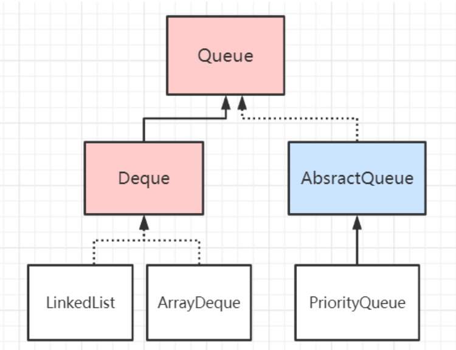

Queue中提供了两套增加, 删除元素的API, 当插入或删除元素失败时, 会有两种失败处理策略

| 方法及失败策略 | 插入方法 | 删除方法 | 查找方法 |
| -------------- | -------- | -------- | -------- |
| 抛出异常       | add()    | remove() | get()    |
| 返回失败默认值 | offer()  | poll()   | peek()   |

### **Deque接口**

Deque 接口的实现非常好理解: 从单向队列演变为双向队列, 内部额外提供双向队列的操作方法即可:

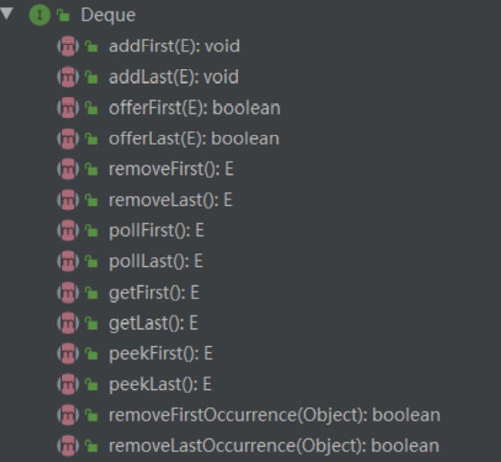

**AbstractQueue抽象类**

AbstractQueue类中提供了各个API的基本实现, 主要针对各个不同的处理策略给出基本的方法实现, 定义在这里的作用是让**子类**根据其**方法规划**(操作失败时抛出异常还是返回默认值)实现具体的业务逻辑

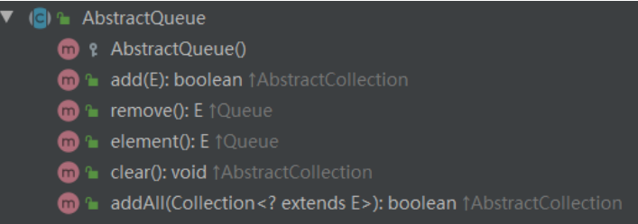

**LinkedList**

它实现了Deque接口，提供了针对头节点和尾结点的操作，并且每个节点都有前驱和后续指针，具备了双向队列的所有特性

**ArrayDeque**

使用数组实现的双端队列，它时无界的双端队列

`ArrayDeque`在日常使用得不多，与`LinkedList`的对比：`LinkedList`采用链表实现双端队列，而`ArrayDeque`使用数组实现双端队列

> ArrayDeque作为栈时比Stack性能好，作为队列比LinkedList好

| 数组类型      | 插入、删除时间复杂度 | 查询时间复杂度 | 底层数据结构     | 是否线程安全 |
| ------------- | -------------------- | -------------- | ---------------- | ------------ |
| Vector        | O(N)                 | O(1)           | 数组             | 是           |
| ArrayList     | O(N)                 | O(1)           | 数组             | 否           |
| LinkedList    | O(1)                 | O(N)           | 双向链表         | 否           |
| HashSet       | O(1)                 | O(1)           | 数组+链表+红黑树 | 否           |
| TreeSet       | O(logN)              | O(logN)        | 红黑树           | 否           |
| ArrayDeque    | O(N)                 | O(1)           | 数组             | 否           |
| PriorityQueue | O(logN)              | O(logN)        | 堆（数组实现）   | 否           |

## Map集合体系详解

Map接口时由<key, value>组成的集合,由key映射到唯一的value,所以不能包含重复的key,每个键至多映射一个值

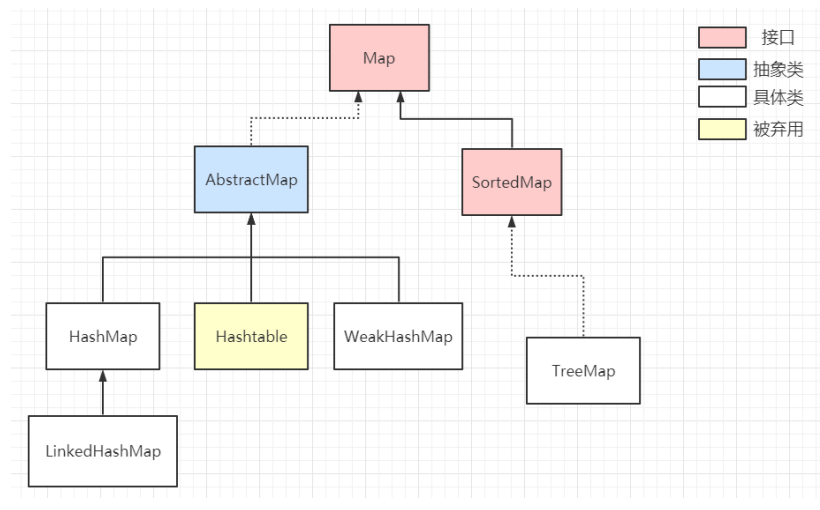

### **HashMap**

HashMap是一个最通用的利用哈希表存储元素的集合,将元素放入HashMap时,将`key`的哈希值转为数组的`索引`下标确定存放位置,查找时,根据`key`的哈希值转换成数组的`索引`下标确定查找位置

HashMap底层时用数组 + 链表 + 红黑树这三种数据结构发现,它时**非线程安全**的集合

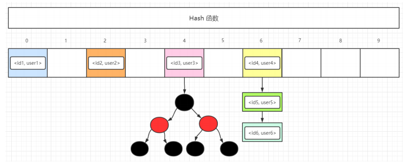

发送哈希冲突时,HashMap的解决方法是将相同映射地址的元素连成一条`链表`,如果链表的长度大于`8`时,且数组的长度大于`64`则会转换成`红黑树`数据结构

关于HashMap的简要总结:

1. 它是集合中最常见的==Map==集合类型,底层由==数组 + 链表 + 红黑树==组成
2. HashMap不是线程安全的
3. 插入元素时,通过计算元素的==哈希值==,通过哈希映射函数转换为==数组下标==;查找元素时,同样通过哈希映射函数得到数组下标==定位元素的位置==

### **LinkedHashMap**

LinkedHashMap可用看作是==HashMap==和==LinkedList==的结合:它在HashMap的基础上添加了一条双向链表,==默认==存储各个元素的插入顺序,但由于这条双向链表,使得LinkedHashMap可用实现==LRU==缓存淘汰策略,因为我们可用设置这条双向链表按照==元素的访问次序==进行排序

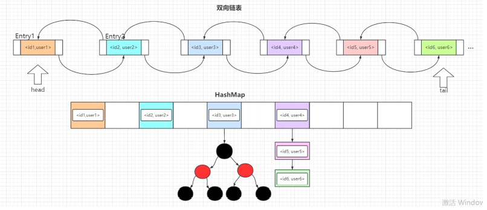

LinkedHashMap时HashMap的子类,送一它具备HashMap的所有特点,其次,它在HashMap的基础上维护了一条==双向链表==,该链表存储了所有元素,默认元素的顺序与插入顺序一致.若==accessOrder==属性为==true==,则遍历顺序按元素的访问次序进行排序

~~~java
//头节点
transient LinkedHashMap.Entry<K, V> head;
//尾结点
transient LinkedHashMap.Entry<K, V> tail;
~~~

关于LinkedHashMap主要介绍两点

1. 它底层维护了一条双向链表,因为继承了HashMap, 所以它也不是线程安全的
2. LinkedHashMap可实现LRU缓存淘汰策略, 其原理时通过设置accessOrder为true并重写removeEldestEntry方法定义淘汰元素时需满足的条件

### **TreeMap**

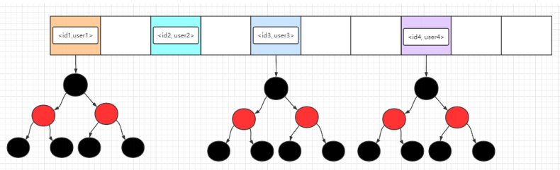

TreeMap是SortedMap的子类, 所以它具有排序功能, 它是基于红黑树数据结构实现的, 每一个键值对<key, value>都是一个节点, 默认情况下按照key自然排序, 另一种是可以通过传入定制的Comparator进行自定义规则排序

关于自然排序与定制排序

- 自然排序: 要求key必须实现Comparable接口

由于Integer类实现了Comparable接口, 按照自然排序是按照key从小到大排序

~~~java
TreeMap<Integer, String> treeMap = new TreeMap();
treeMap.put(2, "two");
treeMap.put(1, "one");
System.out.print(treeMap);
//{1=one, 2=two}
~~~

- 定制排序: 在初始化TreeMap时传入新的Comparator, 不要求key实现Comparable接口

~~~java
TreeMap<Integer, String> treeMap = new TreeMap<>((o1, o2) -> Integer.compare(o2, o1));
treeMap.put(1, "one");
treeMap.put(2, "two");
treeMap.put(4, "four");
treeMap.put(3, "three");
//{4=four,3=tree,2=two,1=one}
~~~

TreeMap主要介绍了三点:

1. 它底层时由红黑树这种数据结构实现的, 所以操作的时间复杂度恒为O(logN)
2. TreeMap可以对key进行自然排序或者自定义排序, 自定义排序时需要传入Comparator, 人自然排序要求key实现了Comparable接口
3. TreeMap不是线程安全的
