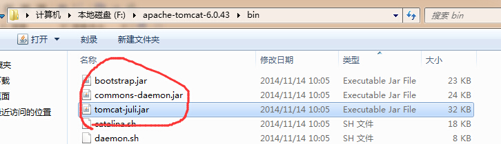
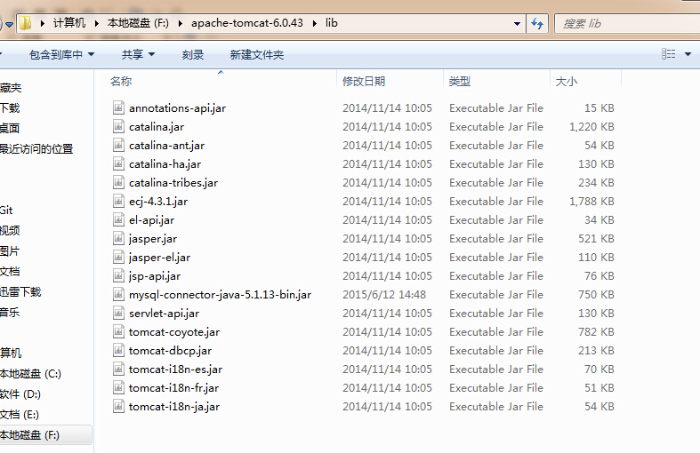

# java中的类加载机制

# 目录


目录

------

# 一、类加载机制

### 1、类加载？

##### 1.1 什么是类加载机制？

首先，在代码被编译器编译后生成的二进制字节流(.class)文件；
然后，JVM把Class文件加载到内存，并进行验证、准备、解析、初始化；
最后，能够形成被JVM直接使用的Java类型的过程。
--**这就是类加载机制**

> *类加载器并不需要等到某个类被“首次主动使用”时才加载它，JVM规范允许类加载器在预料某个类将要被使用时就预先加载。如果预先加载的过程中遇到了.class文件缺失或者存在错误，类加载器不会马上报告错误；类加载器必须在程序【首次主动使用】该类时才报告错误（LinkageError错误）。*

##### 1.2 加载.class 文件的方式

- 从本地系统中直接加载
- 通过网络下载.class文件
- 从zip、jar等文件中加载
- 从专有数据库中提取.class文件
- 将Java远文件动态编译为.class文件

### 2、类加载流程图


类加载机制

# 二、类加载机制阶段详解

### 1、类的加载

类的加载是类加载机制过程的第一个阶段，该阶段主要完成三件任务：

- ①. 通过类的全限定名来获取类的二进制字节流。
- ②. 将字节流中所有代表的静态存储结构转化为【方法区】的运行时数据结构。
- ③. 在内存Java堆中生成一个代表这个类的`Java.lang.Class`对象，作为方法区中这个类的各种数据的访问入口。

### 2、连接

在经历类的加载过程后，生成了类的java.lang.Class对象，接着会进入连接阶段。连接阶段负责将类的二进制数据合并如JRE（Java运行时环境）中。类的连接大致分为三个阶段。

#### 2.1 验证阶段

验证：确保被加载的类符合JVM规范和安全。
验证是连接阶段的第一步，这一阶段的目的是为了确保Class文件的字节流中包含的信息符合当前虚拟机的要求，并且不会危害虚拟机自身的安全。验证阶段大致会完成4个阶段的检验动作：

- 文件格式验证：
  验证字节流是否符合Class文件格式的规范；例如：是否以`0xCAFEBABE`开头、主次版本号是否在当前虚拟机的处理范围之内、常量池中的常量是否有不被支持的类型。
- 元数据验证：
  对字节码描述的信息进行语义分析（注意：对比javac编译阶段的语义分析），以保证其描述的信息符合Java语言规范的要求；例如：这个类是否有父类，除了java.lang.Object之外。
- 字节码验证：通过数据流和控制流分析，确定程序语义是合法的、符合逻辑的。
- 符号引用验证：确保解析动作能正确执行。

**验证阶段是非常重要的，但不是必须的，它对程序运行期没有影响**，如果所引用的类经过反复验证，那么可以考虑采用`-Xverifynone`参数来关闭大部分的类验证措施，以缩短虚拟机类加载的时间。

#### 2.2 准备

准备阶段：为类的`静态变量（static filed）`在【方法区】**分配内存**，并**附上默认初始值**（0或者null值）。

- 静态变量在方法区分配内存
- 静态变量在分配内存后，附上初始值。

静态常量（static final filed）会在准备阶段直接将程序设定的值附上。
例如：

```java
static final int a = 10; 
// 该静态常量a 会在【准备阶段】直接将10赋值。
static int b = 11;
// 该静态变量b 在【准备阶段】只会赋值初始值0，等到了【初始化】阶段会将真正的11赋值给静态变量b。
```

#### 2.3 解析

解析：把类中的符号引用转换为直接引用。

解析阶段是虚拟机将常量池内的符号引用替换为直接引用的过程，解析动作主要针对类或接口、字段、类方法、接口方法、方法类型、方法句柄和调用点限定符7类符号引用进行。

- 符号引用，就是一组符号来描述目标，可以是任何字面量。
- 直接引用，就是直接指向目标的指针、相对偏移量或一个间接定位到目标的句柄。

### 3、初始化

初始化，为类的静态变量赋予正确的初始值。
初始化阶段是执行类构造器`<clinit>()`方法。

###### 3.1 在Java中堆类变量进行初始值设定有两种方式：

- ①声明类**静态**变量是指定初始值。
- ②使用**静态**代码块为类静态变量制定初始值。

###### 3.2 JVM初始化步骤

① 如果这个类还没有被加载和连接，则程序先加载并连接该类。（其实就是执行上面的类加载、连接两步骤）

② 如果的直接父类还没有被初始化，则先初始化其直接父类。

③ 如果这个类中有初始化语句，则系统会一次执行这些初始化语句。

###### 3.3 类初始化时机

类初始化时机，有且只有主动引用时才会触发类的初始化。
被动引用则不会触发类初始化。
类初始化时间后面单独详细说明。

### 4、使用

类的正常使用。

### 5、卸载

类的卸载需要根据【该类对象不再被引用+GC回收 】来判断何时被卸载。

- ①由Java虚拟机自带的类加载器所加载的类，在虚拟机的生命周期中，始终不会被卸载。因为一直被引用着。
- ②由用户自定义的类加载器加载的类是可以被卸载。

# 三、类的加载时机与初始化时机

### （一）类的加载时机

> 当应用程序启动的时候，所有的类都会被一次性加载吗？
> 答案是否定的。不能，因为如果一次性加载，内存资源有限，可能会影响应用程序的正常运行。

JVM 规范没有强制约束类加载过程的第一阶段（加载）什么时候开始，但对于“初始化”阶段，有着严格的规定。

我们可以分析类的初始化过程来分析类是什么时候进行加载的。

### （二）类的初始化时机（重点）

##### 主动引用

有且仅有 5 种情况必须立即对类进行“初始化”：

1.在遇到 new、putstatic、getstatic、invokestatic 字节码指令时，如果类尚未初始化，则需要先触发初始化。（**注意static操作中不包括final类型**）
2.对类进行反射调用时，如果类还没有初始化，则需要先触发初始化。
3.初始化一个类时，如果其父类还没有初始化，则需要先初始化父类。
4.虚拟机启动时，用于需要指定一个包含 main() 方法的主类，虚拟机会先初始化这个主类。
5.当使用 JDK 1.7 的动态语言支持时，如果一个 java.lang.invoke.MethodHandle 实例最后的解析结果为 REF_getStatic、REF_putStatic、REF_invokeStatic 的方法句柄，并且这个方法句柄所对应的类还没初始化，则需要先触发初始化。

这 5 种场景中的行为称为对一个类进行**主动引用**，除此之外，其它所有引用类的方式都不会触发初始化，称为**被动引用**。因此，结合上文中的3.2我们可以分析出，类应该是在初始化过程中，如果发现类没有加载，进行加载。


##### 被动引用

被动引用，不会发生类的初始化过程。
被动引用又分为三种方式：

- 当访问一个类的静态变量时（该静态变量是父类所持有），只有真正声明这个变量的类才会初始化。
  子类调用父类的静态变量，只有父类初始化，而子类不会进行初始化。

  - 代码示例：

    ```csharp
    public class SuperClass { // 父类
        public static int A = 7; // 父类静态变量
    
        static { // 静态代码块在初始化时执行
            System.out.println("super class static ...");
        }
    }
    
    public class SubClass extends SuperClass { // 子类继承父类
        static { // 静态代码块在初始化时执行
            System.out.println("sub class static ...");
        }
    }
    
    public class TestStatic2 {
        public static void main(String[] args) {
            System.out.println("A =" + SubClass.A);  // 调用子类继承的父类静态变量
        }
    }
    ```

    输出内容：

    ```java
    super class static ...
    A =7
    ```

- 通过数据定义引用类，不会触发类的初始化。
  因为是数据进行new，而对应的应用类没有被new，所以该类没有触发任何主动引用。

  ```csharp
public class TestStatic3 {
      public static void main(String[] args) {
          SuperClass[] superClasses = new SuperClass[3];
          System.out.println(superClasses);
      }
  }
  ```
  
  - 输出内容：

  ```ruby
[Lcom.jx.SuperClass;@193b845
  ```
  
- final 常量不会触发类的初始化，因为编译阶段就存储在常量池中。

  ```java
  //常量类
  public class ConstClass {
      static{
          System.out.println("常量类初始化！");
      }
      
      public static final String HELLOWORLD = "hello world!";
  }
   
  //主类、测试类
  public class NotInit {
      public static void main(String[] args){
          System.out.println(ConstClass.HELLOWORLD);
      }
  }
  ```

# 四、类生命周期与JVM生命周期

### （一） 类的生命周期

当一个类被加载、连接、初始化后，它的生命周期就开始了。

Class作为JVM中的一个特殊对象，也会被GC回收卸载。Class的卸载就是清空方法区中Class的信息和堆区中的java.lang.Class对象。这时Class的声明周期就结束了。

​        SUN的原话：“class or interface may be unloaded if andonly if its class loader isunreachable. Classesloaded by the BootstrapClassLoadermay not be unloaded”。

Class被回收要满足以下三个条件:

a)        No **Instance**：该类所有的实例都已经被GC;该类所有的实例都已经被回收，也就是java堆中不存在该类的任何实例。

b)        No **ClassLoader**：加载该类的ClassLoader实例已经被GC;加载该类的ClassLoader已经被回收。

c)        No **Reference**：该类的java.lang.Class对象没有被引用。(XXX.class,静态变量/方法),该类对应的java.lang.Class对象没有任何地方被引用，无法在任何地方通过反射访问该类的方法。

如果以上三个条件全部满足，jvm就会在方法区垃圾回收的时候对类进行卸载，类的卸载过程其实就是在方法区中清空类信息，java类的整个生命周期就结束了。

### （二）JVM生命周期

Java虚拟机结束生命周期的情况：

- 1.执行了`System.exit()`方法.
- 1. 程序正常执行结束。
- 1. 程序在执行过程中遇到了异常或错误而并未处理，导致异常终止。
- 1. 由于依赖的操作系统出现错误，而导致Java虚拟机进程终止。

# 五、双亲委派机制

## 1. ClassLoader的继承关系

jvm提供了三种系统加载器：

1. 启动类加载器（Bootstrap ClassLoader）：C++实现，在java里无法获取，**负责加载/lib**下的类。

2. 扩展类加载器（Extension ClassLoader）： Java实现，可以在java里获取，**负责加载/lib/ext**下的类。

3. 系统类加载器/应用程序类加载器（Application ClassLoader）：加载当前应用的classpath的所有类。他是与我们接触对多的类加载器，我们写的代码默认就是由它来加载，ClassLoader.getSystemClassLoader返回的就是它。

   


那么在java中，加载器的继承关系是什么样的？ClassLoader继承关系如下：


AppClassLoader+ExtClassLoader


URLClassLoader


SecureClassLoader


ClassLoader

## 2. ClassLoader重要方法loadclass()代码解读

直接上代码，代码上注释有说明。特别需要注意的是，代码中的parent 不是父类，而是持有的一个父加载器

**重点：**需要注意的是AppClassLoader的父加载器（parent）是ExtClassLoader，ExtClassLoader的父加载器（parent）是空，但是ExtClassLoader 是由Bootstrap CLassLoader 加载起来的。但是因为Bootstrap CLassLoader 是由C++写的，不能成为一个java对象在ExtClassLoader 里面直接引用。

~~~java
public Class<?> loadClass(String name) throws ClassNotFoundException {
    return loadClass(name, false);
}

//resolve字段表示是否进行【连接】阶段处理
protected Class<?> loadClass(String name, boolean resolve) throws ClassNotFoundException
{
    synchronized (getClassLoadingLock(name)) {
        // First, check if the class has already been loaded
        // 首先，判断该类是否已经加载过了。
        Class<?> c = findLoadedClass(name);
        if (c == null) {
            long t0 = System.nanoTime();
            try {
                if (parent != null) { //如果父类存在
                    // 如果未加载过，则委派给父类进行加载。
                    c = parent.loadClass(name, false);
                } else {
                    // 如果父类不存在，则交给BootstrapClassLoader来加载。 什么时候父类不存在呢？其实就是ExtClassLoader不存在父类的情况。
                    c = findBootstrapClassOrNull(name);
                }
            } catch (ClassNotFoundException e) {
                // ClassNotFoundException thrown if class not found
                // from the non-null parent class loader
                // 如果父类通过缓存+加载都无法找到，并抛出ClassNotFoundException异常时，则捕获异常但不处理。
            }

            if (c == null) {
                // If still not found, then invoke findClass in order
                // to find the class.                   
                long t1 = System.nanoTime();
                // 如果委托的父类们都无法找到该类，则本加载器自己亲自动手去查找。
                c = findClass(name);
                // this is the defining class loader; record the stats
                sun.misc.PerfCounter.getParentDelegationTime().addTime(t1 - t0);
                sun.misc.PerfCounter.getFindClassTime().addElapsedTimeFrom(t1);
                sun.misc.PerfCounter.getFindClasses().increment();
            }
        }
        if (resolve) {
            resolveClass(c);
        }
        return c;
    }
}
~~~

代码中有几个关键调用需要注意：

**① `Class<?> c = findLoadedClass(name)`通过缓存查找判断是否存在该类。**

~~~java
  进一步查看该方法实现，又调用了native findLoadedClass0方法。

    protected final Class<?> findLoadedClass(String name) {
        if (!checkName(name))
            return null;
        return findLoadedClass0(name);
    }

    private native final Class<?> findLoadedClass0(String name);
~~~

**② 当parent != null时，`c = parent.loadClass(name, false);`。如果父加载器不为空，则委派给父加载器的loadClass()方法执行。**

```jsx
当 parent == null时，
c = findBootstrapClassOrNull(name)；父加载器如果为空时，则委派给BootstrapClassLoader来查找。
这里就是双亲委派模型出现了。
```

**③ 当在经过父加载器们缓存查找和加载后，仍然未找到该类，则本加载器会亲自进行查找`c = findClass(name);`这个方法很关键。**

~~~java
    protected Class<?> findClass(String name) throws ClassNotFoundException {
            throw new ClassNotFoundException(name);
        }
~~~

## 3. 双亲委派模型的验证

```csharp
    public static void main(String[] args) {
        ClassLoader loader = TestStatic3.class.getClassLoader();
        System.out.println(loader);
        System.out.println(loader.getParent());
        System.out.println(loader.getParent().getParent());
    }
```

输出结果：

```ruby
sun.misc.Launcher$AppClassLoader@b4aac2
sun.misc.Launcher$ExtClassLoader@193b845
null
```

## 4. 双亲委派模型的优点

这里补充下几个双亲委派模型的特点。

- 系统类防止内存中出现多份同样的字节码
  因为Java类随着它的类加载器一起具备了一种带有优先级的层次关系。双亲委派模型很好的解决了各个类加载器的基础类的统一问题（越基础的类由越上层的加载器进行加载）。
- 保证Java程序安全稳定运行
  使用双亲委派模型来组织类加载器之间的关系，有一个显而易见的好处就是Java类随着它的类加载器一起具备了一种带有优先级的层次关系。例如，类java.lang.Object，它存放在rt.jar中，无论哪一个类加载器要加载这个了类，最终都是委派给模型最顶端的启动类加载器进行加载，因此Object类在程序的各个类加载器环境中都是同一个类。
  相反，如果没有使用双亲委派模型，由各个类加载器自行去加载的话，如果用户自己编写了一个称为java.lang.Object的类，并放在程序的ClassPath中，那系统中将会出现多个不同的Object类，Java类型体系中最基本的行为也就无法保证，应用程序也会变得一片混乱。

# 六：自定义类加载器


# 七：分析Tomcat类加载机制

## 1：tomat为什么破坏双亲委派机制

首先，我们分析下Tomcat 如果使用默认的类加载机制行不行？ 
答案是不行的。为什么？我们看，第一个问题，如果使用默认的类加载器机制，那么是无法加载两个相同类库的不同版本的，默认的累加器是不管你是什么版本的，只在乎你的全限定类名，并且只有一份。第二个问题，默认的类加载器是能够实现的，因为他的职责就是保证唯一性。第三个问题和第一个问题一样。我们再看第四个问题，我们想我们要怎么实现jsp文件的热修改（楼主起的名字），jsp 文件其实也就是class文件，那么如果修改了，但类名还是一样，类加载器会直接取方法区中已经存在的，修改后的jsp是不会重新加载的。那么怎么办呢？我们可以直接卸载掉这jsp文件的类加载器，所以你应该想到了，每个jsp文件对应一个唯一的类加载器，当一个jsp文件修改了，就直接卸载这个jsp类加载器。重新创建类加载器，重新加载jsp文件。

Tomcat是个web容器，一定程度上打破了双亲委派加载机制， 那么它要解决了哪些问题： 

1. 一个web容器可能需要部署两个应用程序，不同的应用程序可能会依赖同一个第三方类库的不同版本，不能要求同一个类库在同一个服务器只有一份，因此要保证每个应用程序的类库都是独立的，保证相互隔离。 

2. 部署在同一个web容器中相同的类库相同的版本可以共享。否则，如果服务器有10个应用程序，那么要有10份相同的类库加载进虚拟机，这是不合理的。 

3. web容器也有自己依赖的类库，不能于应用程序的类库混淆。基于安全考虑，应该让容器的类库和程序的类库隔离开来。 

4. web容器要支持jsp的修改，我们知道，jsp 文件最终也是要编译成class文件才能在虚拟机中运行，但程序运行后修改jsp已经是司空见惯的事情，否则要你何用？ 所以，web容器需要支持 jsp 修改后不用重启。

   

## 2：Tomcat 如何实现自己独特的类加载机制


我们看到，前面3个类加载和默认的一致，CommonClassLoader、CatalinaClassLoader、SharedClassLoader和WebappClassLoader则是Tomcat自己定义的类加载器，它们分别加载`/common/*`、`/server/*`、`/shared/*`（在tomcat 6之后已经合并到根目录下的lib目录下）和`/WebApp/WEB-INF/*`中的Java类库。其中WebApp类加载器和Jsp类加载器通常会存在多个实例，每一个Web应用程序对应一个WebApp类加载器，每一个JSP文件对应一个Jsp类加载器。

- commonLoader：Tomcat最基本的类加载器，加载路径中的class可以被Tomcat容器本身以及各个Webapp访问；

- catalinaLoader：Tomcat容器私有的类加载器，加载路径中的class对于Webapp不可见；

- sharedLoader：各个Webapp共享的类加载器，加载路径中的class对于所有Webapp可见，但是对于Tomcat容器不可见；

- WebappClassLoader：各个Webapp私有的类加载器，加载路径中的class只对当前Webapp可见；

  
## 3：Tomcat类加载过程

  

  

当tomcat启动时，会创建几种类加载器：

　　**1 Bootstrap 引导类加载器** 

　　加载JVM启动所需的类，以及标准扩展类（位于jre/lib/ext下）

　　**2 System 系统类加载器** 

　　加载tomcat启动的类，比如bootstrap.jar，通常在catalina.bat或者catalina.sh中指定。位于CATALINA_HOME/bin下。



　　**3 Common 通用类加载器** 

　　加载tomcat使用以及应用通用的一些类，位于CATALINA_HOME/lib下，比如servlet-api.jar



　　**4 webapp 应用类加载器**

　　每个应用在部署后，都会创建一个唯一的类加载器。该类加载器会加载位于 WEB-INF/lib下的jar文件中的class 和 WEB-INF/classes下的class文件。

 　　**当应用需要到某个类时，则会按照下面的顺序进行类加载**：

　　1 使用bootstrap引导类加载器加载

　　2 使用system系统类加载器加载

　　3 使用应用类加载器在WEB-INF/classes中加载

　　4 使用应用类加载器在WEB-INF/lib中加载

　　5 使用common类加载器在CATALINA_HOME/lib中加载

# 参考

其中，双亲委派机制讲的比较透彻的文章:

<https://blog.csdn.net/briblue/article/details/54973413>

<https://www.cnblogs.com/aspirant/p/8991830.html>


http://blog.csdn.net/xyang81/article/details/7292380
http://blog.csdn.net/irelandken/article/details/7048817
https://docs.oracle.com/javase/7/docs/api/java/net/URLClassLoader.html


