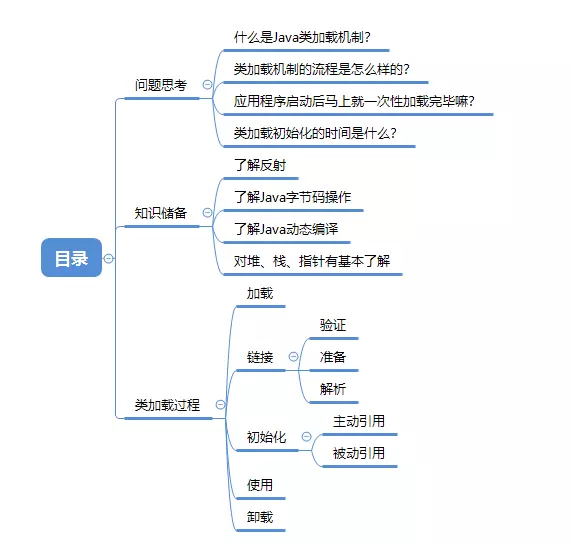
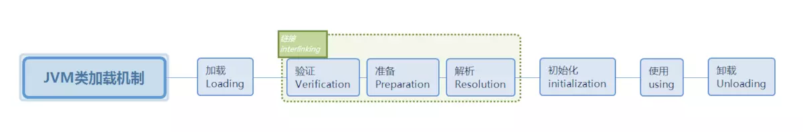
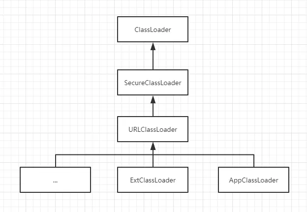
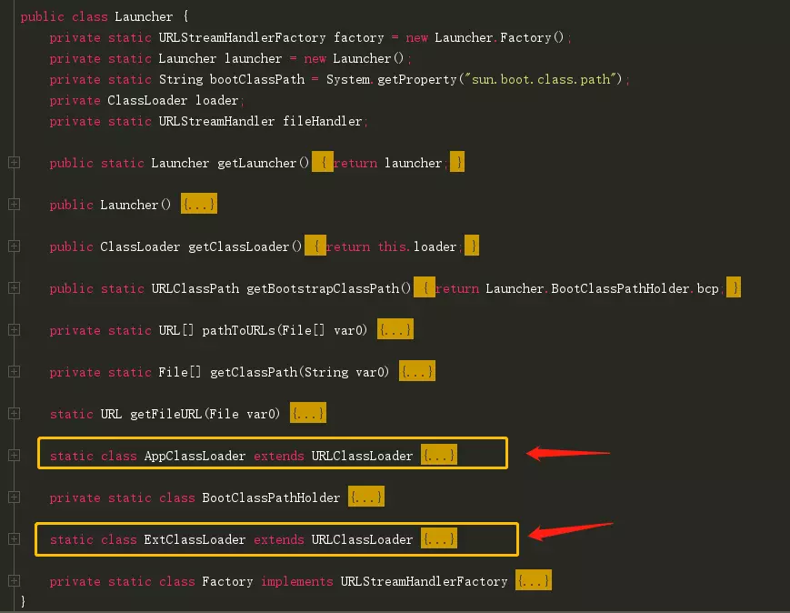
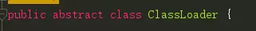

# java中的类加载机制

# 目录




目录

------

# 一、类加载机制

### 1、类加载？

##### 1.1 什么是类加载机制？

首先，在代码被编译器编译后生成的二进制字节流(.class)文件；
然后，JVM把Class文件加载到内存，并进行验证、准备、解析、初始化；
最后，能够形成被JVM直接使用的Java类型的过程。
--**这就是类加载机制**

> *类加载器并不需要等到某个类被“首次主动使用”时才加载它，JVM规范允许类加载器在预料某个类将要被使用时就预先加载。如果预先加载的过程中遇到了.class文件缺失或者存在错误，类加载器不会马上报告错误；类加载器必须在程序【首次主动使用】该类时才报告错误（LinkageError错误）。*

##### 1.2 加载.class 文件的方式

- 从本地系统中直接加载
- 通过网络下载.class文件
- 从zip、jar等文件中加载
- 从专有数据库中提取.class文件
- 将Java远文件动态编译为.class文件

### 2、类加载流程图




类加载机制

# 二、类加载机制阶段详解

### 1、类的加载

类的加载是类加载机制过程的第一个阶段，该阶段主要完成三件任务：

- ①. 通过类的全限定名来获取类的二进制字节流。
- ②. 将字节流中所有代表的静态存储结构转化为【方法区】的运行时数据结构。
- ③. 在内存Java堆中生成一个代表这个类的`Java.lang.Class`对象，作为方法区中这个类的各种数据的访问入口。

### 2、连接

在经历类的加载过程后，生成了类的java.lang.Class对象，接着会进入连接阶段。连接阶段负责将类的二进制数据合并如JRE（Java运行时环境）中。类的连接大致分为三个阶段。

#### 2.1 验证阶段

验证：确保被加载的类符合JVM规范和安全。
验证是连接阶段的第一步，这一阶段的目的是为了确保Class文件的字节流中包含的信息符合当前虚拟机的要求，并且不会危害虚拟机自身的安全。验证阶段大致会完成4个阶段的检验动作：

- 文件格式验证：
  验证字节流是否符合Class文件格式的规范；例如：是否以`0xCAFEBABE`开头、主次版本号是否在当前虚拟机的处理范围之内、常量池中的常量是否有不被支持的类型。
- 元数据验证：
  对字节码描述的信息进行语义分析（注意：对比javac编译阶段的语义分析），以保证其描述的信息符合Java语言规范的要求；例如：这个类是否有父类，除了java.lang.Object之外。
- 字节码验证：通过数据流和控制流分析，确定程序语义是合法的、符合逻辑的。
- 符号引用验证：确保解析动作能正确执行。

**验证阶段是非常重要的，但不是必须的，它对程序运行期没有影响**，如果所引用的类经过反复验证，那么可以考虑采用`-Xverifynone`参数来关闭大部分的类验证措施，以缩短虚拟机类加载的时间。

#### 2.2 准备（重点！！）

准备阶段：为类的`静态变量（static filed）`在【方法区】**分配内存**，并**附上默认初始值**（0或者null值）。

- 静态变量在方法去分配内存
- 静态变量在分配内存后，附上初始值。

静态常量（static final filed）会在准备阶段直接将程序设定的值附上。
例如：

```java
static final int a = 10; 
// 该静态常量a 会在【准备阶段】直接将10赋值。
static int b = 11;
// 该静态变量b 在【准备阶段】只会赋值初始值0，等到了【初始化】阶段会将真正的11赋值给静态变量b。
```

#### 2.3 解析

解析：把类中的符号引用转换为直接引用。

解析阶段是虚拟机将常量池内的符号引用替换为直接引用的过程，解析动作主要针对类或接口、字段、类方法、接口方法、方法类型、方法句柄和调用点限定符7类符号引用进行。

- 符号引用，就是一组符号来描述目标，可以是任何字面量。
- 直接引用，就是直接指向目标的指针、相对偏移量或一个间接定位到目标的句柄。

### 3、初始化（重点！！）

初始化，为类的静态变量赋予正确的初始值。
初始化阶段是执行类构造器`<clinit>()`方法。

###### 3.1 在Java中堆类变量惊喜初始值设定有两种方式：

- ①声明类静态变量是制定初始值。
- ②使用静态代码块为类静态变量制定初始值。

###### 3.2 JVM初始化步骤

- ① 如果这个类还没有被加载和连接，则程序先加载并连接该类。（其实就是执行上面的类加载、连接两步骤）
- ② 如果的直接父类还没有被初始化，则先初始化其直接父类。
- ③ 如果这个类中有初始化语句，则系统会一次执行这些初始化语句。

###### 3.3 类初始化时机

类初始化时机，有且只有主动引用时才会触发类的初始化。
被动引用则不会触发类初始化。
类初始化时间后面单独详细说明。

### 4、使用

类的正常使用。

### 5、卸载

类的卸载需要根据【该类对象不再被引用+GC回收 】来判断何时被卸载。

- ①由Java虚拟机自带的类加载器所加载的类，在虚拟机的生命周期中，始终不会被卸载。因为一直被引用着。
- ②由用户自定义的类加载器加载的类是可以被卸载。

# 三、类的加载时机与初始化时机

### （一）类的加载时机

> 当应用程序启动的时候，所有的类都会被一次性加载吗？
> 答案是否定的。不能，因为如果一次性加载，内存资源有限，可能会影响应用程序的正常运行。

类是什么时候i被加载的呢？
当一个类真正被加载的时机是在创建对象的时候，才会执行类加载。
例如：`A a= new A();`该类的加载，只有在创建对象的时候才加载类。
其中，最先加载拥有main方法的主线程所在的类。

### （二）类的初始化时机（重要！！）

引用方式主要分为两种：**主动引用**和**被动引用**。
`有且只有主动引用才会触发类初始化的过程。被动引用不会触发类初始化过程。`

##### 主动引用

有且只有主动引用才会触发类初始化的过程。触发主动引用的方式有以下五种：

- 1. 创建类的实例。即通过new的方式，new一个对象。
     例如：

  ```cpp
  A a = new A();
  ```

- 1. 调用类的静态变量(非final修饰的常量) 和静态方法。
     代码示例：

  - Test3.class代码如下

  ```csharp
  public class Test3 {
      public static final int A = 10;// 静态常量， 不会触发初始化，该代码在连接准备阶段已赋值。
      public static int B = 11;// 静态变量， 在被外界调用时，会主动触发类的初始化。
  
      static{//静态代码块，如果类初始化，则一定会执行该代码块
          System.out.println("test3..print~~~");
      }
  
      public void fun() {//实例方法，只有实例化后代码才能调用此方法
          System.out.println("test3..fun~~~");
      }
  
      public static void fun2() {//静态方法，在被外界调用时，会主动触发类的初始化。
          System.out.println("test3..static fun2...");
      }
  }
  ```

  - mian()方法测试代码：

  ```csharp
  public class TestStatic {
      public static void main(String[] ags) {
  //        申明类时,不会主动触发初始化流程.
          Test3 test3;
  
  //        类的静态常量,不会触发初始化，该代码在连接准备阶段已赋值。
          System.out.println("test3 A "+Test3.A);
  
  //        类的静态变量,在被外界调用时，会主动触发类的初始化。【注意，此时会初始化Test3】
          System.out.println("test3 B " + Test3.B);
  
  //      直接调用test3的静态方法fun()，也会主动触发类的初始化工作。
          test3.fun();
      }
  }
  ```

  - 输出内容：

  ```css
  test3 A 10
  test3..print~~~
  test3 B 11
  ```

  ```cpp
  错误：这里会发现，static静态代码块先执行，然后再执行static变量初始化。(@油炸小居崽 的指正)
  正确：static静态代码块不会比static变量初始化优先执行，可以采用静态代码块中输出静态变量验证。
  ```

- 1. 通过反射对类进行调用。
     例如：`Class.forName("com.jx.Test2");`

  - Test3.class示例代码：

    ```csharp
    public class Test3 {
        public static final int A = 10;// 静态常量， 不会触发初始化，该代码在连接准备阶段已赋值。
        public static int B = 11;// 静态变量， 在被外界调用时，会主动触发类的初始化。
    
        static{//静态代码块，如果类初始化，则一定会执行该代码块
            System.out.println("test3..print~~~");
        }
    
        public void fun() {//实例方法，只有实例化后代码才能调用此方法
            System.out.println("test3..fun~~~");
        }
    
        public static void fun2() {//静态方法，在被外界调用时，会主动触发类的初始化。
            System.out.println("test3..static fun2...");
        }
    }
    ```

    - mian()方法类，测试代码：

    ```csharp
    public class TestStatic {  
        public static void main(String[] ags) {
            try {
                Class<?> aClass = Class.forName("com.jx.Test3");//调用此代码，则类会初始化。
                System.out.println("aClass " + aClass);
            } catch (ClassNotFoundException e) {
                e.printStackTrace();
            }
        }
    }
    ```

    - 输出内容：

    ```css
    test1..print~~~
    aClass class com.jx.Test1
    ```

- 1. 初始化某个类的子类，则父类也会被初始化。

  - Test4.class示例代码：

  ```java
      public class Test4 extends Test3 { // 继承了Test3
          public void fun4() {
              System.out.println("test4...fun4...");
          }
      }
  ```

  - 测试代码：

  ```cpp
      public class TestStatic {
          public static void main(String[] ags) {
              Test4 test4 = new Test4();
              test4.fun4();
          }
      }
  ```

  - 输出内容：

  ```css
  test3..print~~~
  test4...fun4...
  ```

- 1. Java虚拟机启动时，指定的main方法所在的类，需要被提前初始化。

  - 测试代码：

  ```csharp
      public class TestStatic {
          static {
              System.out.println("test static ...");
          }
          public static void main(String[] ags) {
              Test4 test4 = new Test4();
              test4.fun4();
          }
      }
  ```

  - 输出内容：

  ```css
  test static ...
  test3..print~~~
  test4...fun4...
  ```

##### 被动引用

被动引用，不会发生类的初始化过程。
被动引用又分为三种方式：

- 1. 当访问一个类的静态变量时（该静态变量是父类所持有），只有真正声明这个变量的类才会初始化。
     子类调用父类的静态变量，只有父类初始化，而子类不会进行初始化。

  - 代码示例：

    ```csharp
    public class SuperClass { // 父类
        public static int A = 7; // 父类静态变量
    
        static { // 静态代码块在初始化时执行
            System.out.println("super class static ...");
        }
    }
    
    public class SubClass extends SuperClass { // 子类继承父类
        static { // 静态代码块在初始化时执行
            System.out.println("sub class static ...");
        }
    }
    
    public class TestStatic2 {
        public static void main(String[] args) {
            System.out.println("A =" + SubClass.A);  // 调用子类继承的父类静态变量
        }
    }
    ```

  - 输出内容：

    ```java
    super class static ...
    A =7
    ```

- 1. 通过数据定义引用类，不会触发类的初始化。
     因为是数据进行new，而对应的应用类没有被new，所以该类没有触发任何主动引用。

  - 代码示例

    ```csharp
    public class TestStatic3 {
        public static void main(String[] args) {
            SuperClass[] superClasses = new SuperClass[3];
            System.out.println(superClasses);
        }
    }
    ```

  - 输出内容：

  ```ruby
  [Lcom.jx.SuperClass;@193b845
  ```

- 1. final 常量不会触发类的初始化，因为编译阶段就存储在常量池中。

     ```csharp
     //常量类
     public class ConstClass {
         static{
             System.out.println("常量类初始化！");
         }
         
         public static final String HELLOWORLD = "hello world!";
     }
      
     //主类、测试类
     public class NotInit {
         public static void main(String[] args){
             System.out.println(ConstClass.HELLOWORLD);
         }
     }
     ```

# 四、类生命周期与JVM生命周期

### （一） 类的生命周期

当一个类被加载、连接、初始化后，它的生命周期就开始了。
当这个类的class对象**不再被引用**，即类不可触及时，Class对象就会结束生命周期。这个类在方法区的数据也会被卸载，从而结束这个类的生命周期。
所以，`一个类结束生命周期，取决于代表它的Class对象何时结束生命周期。`

### （二）JVM生命周期

Java虚拟机结束生命周期的情况：

- 1.执行了`System.exit()`方法.
- 1. 程序正常执行结束。
- 1. 程序在执行过程中遇到了异常或错误而并未处理，导致异常终止。
- 1. 由于依赖的操作系统出现错误，而导致Java虚拟机进程终止。

# 五、双亲委派机制

### 1. ClassLoader的继承关系

ClassLoader是什么鬼？为什么我们要如此大费周章的讲解这个？
还记得AppClassLoader、ExtClassLoader么？他们与ClassLoader之间的关系是什么？




ClassLoader继承关系




AppClassLoader+ExtClassLoader


URLClassLoader


SecureClassLoader




ClassLoader

### 2. ClassLoader重要方法loadclass()代码解读。

直接上代码，代码上注释有说明。

~~~java
```
public Class<?> loadClass(String name) throws ClassNotFoundException {
    return loadClass(name, false);
}

protected Class<?> loadClass(String name, boolean resolve) //resolve字段表示是否进行【连接】阶段处理
    throws ClassNotFoundException
{
    synchronized (getClassLoadingLock(name)) {
        // First, check if the class has already been loaded
        // 首先，判断该类是否已经加载过了。
        Class<?> c = findLoadedClass(name);
        if (c == null) {
            long t0 = System.nanoTime();
            try {
                if (parent != null) { //如果父类存在
                    // 如果未加载过，则委派给父类进行加载。
                    c = parent.loadClass(name, false);
                } else {
                    // 如果父类不存在，则交给BootstrapClassLoader来加载。 什么时候父类不存在呢？其实就是ExtClassLoader不存在父类的情况。
                    c = findBootstrapClassOrNull(name);
                }
            } catch (ClassNotFoundException e) {
                // ClassNotFoundException thrown if class not found
                // from the non-null parent class loader
                // 如果父类通过缓存+加载都无法找到，并抛出ClassNotFoundException异常时，则捕获异常但不处理。
            }

            if (c == null) {
                // If still not found, then invoke findClass in order
                // to find the class.                   
                long t1 = System.nanoTime();
                // 如果委托的父类们都无法找到该类，则本加载器自己亲自动手去查找。
                c = findClass(name);
                // this is the defining class loader; record the stats
                sun.misc.PerfCounter.getParentDelegationTime().addTime(t1 - t0);
                sun.misc.PerfCounter.getFindClassTime().addElapsedTimeFrom(t1);
                sun.misc.PerfCounter.getFindClasses().increment();
            }
        }
        if (resolve) {
            resolveClass(c);
        }
        return c;
    }
}
```
~~~

代码中有几个关键调用需要注意：

##### ① `Class<?> c = findLoadedClass(name)`通过缓存查找判断是否存在该类。

~~~java
  进一步查看该方法实现，又调用了native findLoadedClass0方法。
    ```
    protected final Class<?> findLoadedClass(String name) {
        if (!checkName(name))
            return null;
        return findLoadedClass0(name);
    }

    private native final Class<?> findLoadedClass0(String name);
    ```
~~~

##### ② 当parent != null时，`c = parent.loadClass(name, false);`。如果父类不为空，则委派给父类的loadClass()方法执行。

```jsx
当 parent == null是，```c = findBootstrapClassOrNull(name);```父类如果为空时，则委派给BootstrapClassLoader来查找。
这里就是双亲委派模型出现了。
```

##### ③ 当在经过父类们缓存查找和加载后，仍然未找到该类，则本加载器会亲自进行查找`c = findClass(name);`。这个方法很关键。

~~~java
    ```
    protected Class<?> findClass(String name) throws ClassNotFoundException {
            throw new ClassNotFoundException(name);
        }
    ```
~~~

### 3. 双亲委派模型的验证

```csharp
    public static void main(String[] args) {
        ClassLoader loader = TestStatic3.class.getClassLoader();
        System.out.println(loader);
        System.out.println(loader.getParent());
        System.out.println(loader.getParent().getParent());
    }
```

输出结果：

```ruby
sun.misc.Launcher$AppClassLoader@b4aac2
sun.misc.Launcher$ExtClassLoader@193b845
null
```

### 4. 双亲委派模型的优点

这里补充下几个双亲委派模型的特点。

- 系统类防止内存中出现多份同样的字节码
  因为Java类随着它的类加载器一起具备了一种带有优先级的层次关系。双亲委派模型很好的解决了各个类加载器的基础类的统一问题（越基础的类由越上层的加载器进行加载）。
- 保证Java程序安全稳定运行
  使用双亲委派模型来组织类加载器之间的关系，有一个显而易见的好处就是Java类随着它的类加载器一起具备了一种带有优先级的层次关系。例如，类java.lang.Object，它存放在rt.jar中，无论哪一个类加载器要加载这个了类，最终都是委派给模型最顶端的启动类加载器进行加载，因此Object类在程序的各个类加载器环境中都是同一个类。
  相反，如果没有使用双亲委派模型，由各个类加载器自行去加载的话，如果用户自己编写了一个称为java.lang.Object的类，并放在程序的ClassPath中，那系统中将会出现多个不同的Object类，Java类型体系中最基本的行为也就无法保证，应用程序也会变得一片混乱。


### 参考

<http://www.ityouknow.com/jvm/2017/08/19/class-loading-principle.html>
<https://blog.csdn.net/xorxos/article/details/80490240>
<https://www.cnblogs.com/qiuyong/p/6407418.html?utm_source=itdadao&utm_medium=referral>