# 一、在理解GC之前，先了解下JVM体系结构

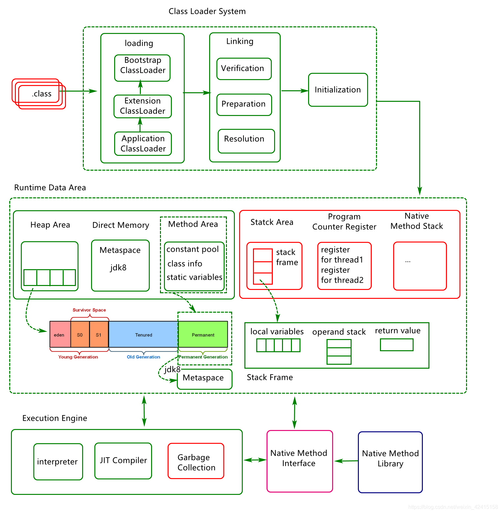

## 1.1什么是GC

GC可以理解为在追踪仍然使用的所有对象，并将其余对象标记为垃圾然后进行回收，这样的一个过程称之为GC，所有的GC系统可以从如下几个方面进行实现

1.GC判断策略（例如引用计数，对象可达）

2.GC收集算法（标记清除法，标记清除整理法，标记复制清除法，分带法）

3.GC收集器（例如Serial，Parallel，CMS，G1）

## 1.2手动GC

什么是手动GC呢？即是手动为对象分配内存并回收内存

如下这是一个简单的手动内存管理C编写的示例

```java
int send_request() {
    size_t n = read_size();
    int *elements = malloc(n * sizeof(int));
 
    if(read_elements(n, elements) < n) {
        // elements not freed!
        return -1;
    }
 
    // …
 
    free(elements)
    return 0;
}
```

手动GC忘记释放内存是常有的事情。这样的话会直接导致内存泄露。

## 1.3自动GC

什么是自动GC呢？

自动GC一般是由系统自动对内存进行管理

### 引用计数法

 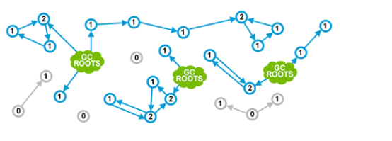

其中：

1、绿色云表示它们指向的对象仍然由程序员使用。

2、蓝色圆圈是内存中的活动对象，其中的数字表示其引用计数

3、灰色圆圈是未从任何明确使用的对象引用的对象

对于引用计数法，有一个很大的缺陷就是循环引用，例如：

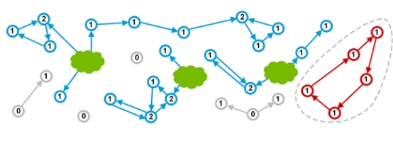

其中红色对象实际上是应用程序不使用的垃圾。但是由于引用计数的限制，它们不符合垃圾回收原理，所以仍然存在内存中，导致内存泄露。

### 标记清除法

标记清除通常有两个步骤：

1.标记正在遍历所有可达的对象

2.清除不可达对象占用的内存地址

 

这种方法就完美解决了对象之间循环依赖的问题，但是存在短时间的线程暂停。

# 二、JAVA中的GC分析

## 2.1、碎片与压缩

JVM在垃圾回收过程中可能会产生大量碎片，为了提供其读写性能，需要对碎片进行压缩

例如：

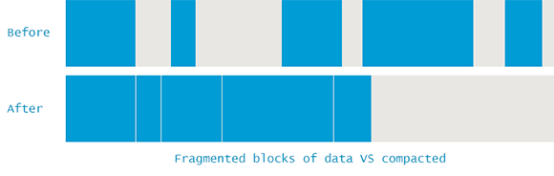

## 2.2、分代设想

我们知道垃圾收集要停止应用程序的运行，那么如果这个收集过程需要的时间很长，就会对应用程序产生很大的性能问题，如何解决这个问题呢？通过实验发现内存中的对象可以将其分为两大类：

1.存活时间较短（这样的对象比较大）

2.存活时间较长（这样的对象量比较小）

基于对如上问题的分析，通过了解科学家提出了分代回收思路（年轻代，老年代，永久代），同时缩小垃圾回收范围。

例如：

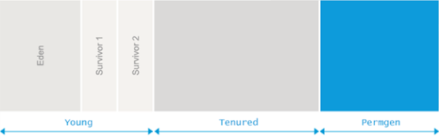

## 2.3、GC模式分析

垃圾收集事件(Garbage Collection events)通常分为：

1.Minor GC (小型GC)：年轻代GC事件

2.Major GC（大型GC）：老年代GC事件

3.Full GC (完全GC)：整个堆的GC事件

# 三.GC算法基础

## 3.1、标记可达对象

现在的GC算法基本都是要从标记可达对象开始（Marking Reachable Objects）

例如：

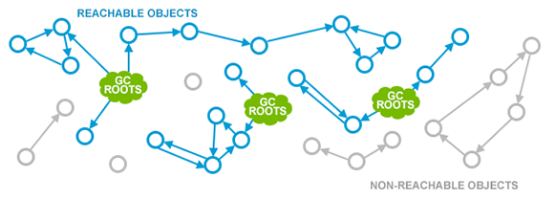

GC一般会设置一些特定对象为GC的根对象，例如：

1.栈中的变量

2.常量池中的引用

.....

GC基于根对象标记可访问对象（蓝色表示），对于不可达对象GC会认为是垃圾回收对象。

## 3.2、移除不可达对象

移除不可达对象（Removing Unused Objects）时会因GC算法的不同而不同，但是所有的GC操作一般都可以分为三组：清除（Sweep），压缩（Compact），复制（Copy）

 

清除（Sweep）

 

压缩（Compact）

 

复制（Copy）

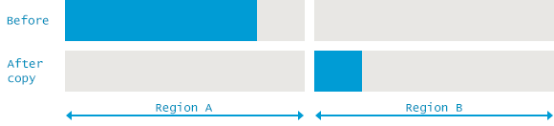

复制算法会基于标记清除压缩算法，创建新的内存空间用于存储幸存对象，同时可以复制与标记同时并发执行。这样可以较少GC时系统的暂停时间，提高系统性能


# 四、GC算法实现

现在对于JVM中的GC算法两大类：一类负责收集年轻代，一类负责收集老年代。假如没有显式指定垃圾回收算法，一般会采用系统平台默认算法，当然也可以自己指定，下面是JDK8中的一些垃圾回收算法应用组合如下：

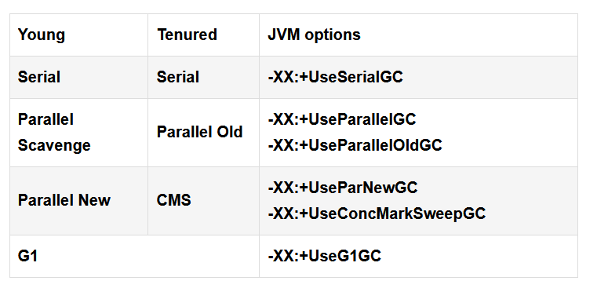

以上四种GC组合是现阶段最突出的几种方式。

## 4.1、Serial GC

Serial GC(串行收集器)应用特点：

1.内部只使用一个线程去回收（不能充分利用CPU的多核特性），无法并行化

2.GC过程可能会产生较长的时间停顿
3.Serial GC（串行收集器）算法应用：

- 新生代复制算法（新生代存活对象较少）
- 老年代标记-压缩算法（老年代对象回收较少，容易产生碎片）
  **Serial GC(串行收集器)场景应用：**

- a.应用在具体几百兆字节大小的JVM

- b.应用在知有单个CPU的环境中
  **Serial GC（串行收集器）应用参数实践：**

java -xx:+UseSerialGC com.mypackages.MyExecutableClass
Serial GC模式分析：

1.Minor GC

 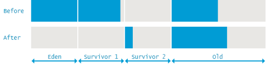

2.Full GC

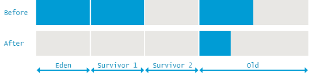

## 4.2、Parallel GC

并行收集器应用特点：

1.可利用cpu的多核特性，可并行化执行GC操作。

2.在GC期间，所有cpu内核都在并行清理垃圾，所以暂停时间较短。

 

Parallel GC (并行收集器)算法应用：

1.在年轻代使用 标记-复制（mark-copy）算法：

1.在老年代使用 标记清除整理（mark-sweep-compact）算法

 

Parallel GC（并行收集器）场景应用：

1.应用于多核处理器，执行并行收集提高吞吐量。

2.GC操作仍需暂停应用程序，所以不适合低延迟场景

 

Parallel GC（并行收集器）模式分析：（事件分析）

1.Minor GC

 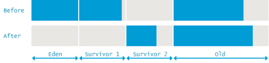

2.Full GC

 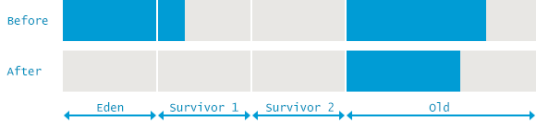

## 4.3、Concurrent Mark and Sweep (CMS)

即 标记-清除-垃圾收集器

CMS收集器特点：（避免在老年代垃圾收集时出现长时间卡顿）

1.使用空闲列表管理内存空间的回收，不对老年代进行整理

2在标记-清除阶段大部分工作和应用线程一起并发执行。

 

CMS算法应用：

1.年轻代采用并行STW方式的mark-copy（标记-复制）算法

2老年代主要使用并发 mark-sweep（标记-清除）算法。

 

CMS场景应用

1.应用于多核处理器，目标降低延迟，缩短停顿时间

2.cpu受限场景下，会与应用线程竞争cpu，吞吐量会减少

 

CMS关键阶段可以分为4个步骤：

1.初始标记 （CMS initial mark）

2.并发标记  ( CMS concurrent mark)

3.重新标记  ( CMS remark)

4.并发清除  (CMS concurrent sweep)

其中初始标记，重新标记这连个步骤仍然需要 "Stop The World" 初始标记仅仅只是标记GC Roots或yong gen能够直接关联到的对象，速度很快。

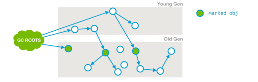

并发标记阶段就是进行GC Roots Tracin的过程，在此阶段，垃圾收集器遍历老年代，标记所有的存活对象，从前一阶段InitialMark找到的root根开始算起。

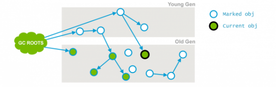

并发预清理（重新标记）阶段则是为了修正并发标记期间，因用户程序继续运作而导致冰机产生变动的那一部分的标记记录，这个阶段的停顿时间一般会比初始标记阶段长一些，但远比并发标记时间短。

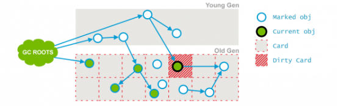

在预清理阶段，这些脏对象会被统计出来，从他们可达对象也被标记下来，此阶段完成后，用标记的card也就会被清空。

 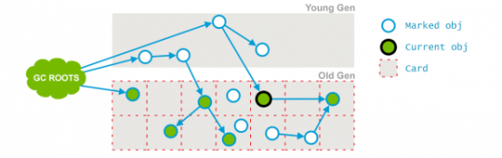

并发清除此阶段与应用程序并发执行，不需要STW停顿。目的是删除未使用的对象，并回收他们占用的空间

 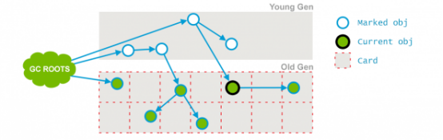

由于整个过程中耗时最长的并发标记和并发清除过程中，收集器线程都可以与用户线程一起工作，所以总体上来说，CMS收集器的内存回收过程是与用户线程一起并发执行

## 4.4、G1-Gbage First

1.空间整理

 

2.可预测停顿