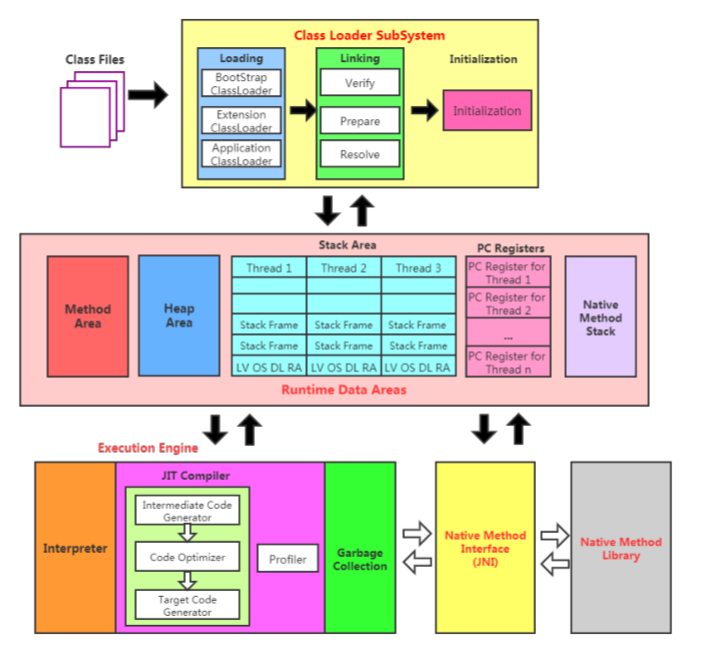
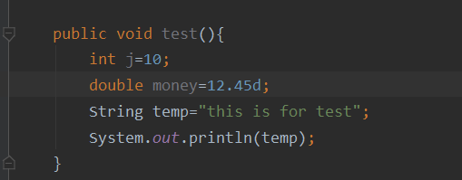
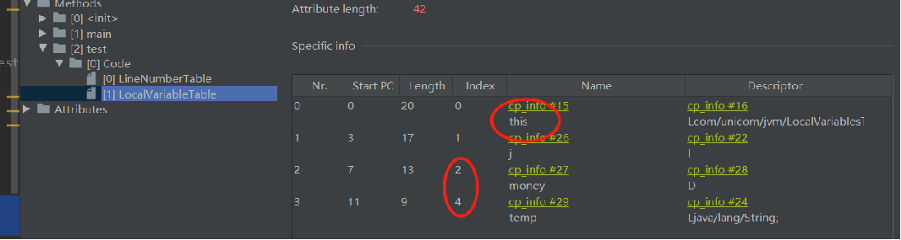
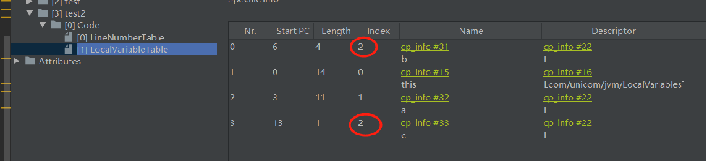

环境：阅读软件使用的是 Typora version 0.9.83(bate)

------


[TOC]

------


# 〇、概述

1. 内存与垃圾回收篇

2. 字节码与类的加载篇

3. 性能监控与调优篇

4. 大厂面试篇


------


# 第一篇、内存与垃圾回收篇


# 第一章  JVM与Java体系结构

## 1.1  前言

（1）OOM（OutOfMemory，翻译成中文就是“内存用完了”，即内存溢出）。

（2）SSM、微服务等属于上层框架技术

（3）计算机语言


（4）为什么要学习 JVM？

- 面试的需要（BATJ、TMD、PKQ等面试都爱问)
- 中高级程序员必备技能（项目管理、、调优需要）
- 追求极客精神（比如垃圾回收算法、JIT、底层原理）

| 摘自《深入拆解 Java 虚拟机》——00 开篇词 为什么我们要学习 Java 虚拟机？ |
| ------------------------------------------------------------ |
| 把核心类库的 API 比做数学公式的话，那么 Java 虚拟机的知识就好比公式的推导过程。掌握数学公式固然可以应付考试，但是了解背后的推导过程更加有助于记忆和理解。并且，在遇到那些没法套公式的情况下，我们也能知道如何解决。 |


## 1.2  面向人群及参考书目

### 1.2.1  本课程面向的人群

- 拥有一定开发经验的 Java 平台开发人员
- 软件设计师、架构师
- 系统调优人员
- 有一定的 Java 编程基础并希望进一步理解 Java 的程序员
- 虚拟机爱好者，JVM 实践者


### 1.2.2  参考书目

​	《Java 虚拟机规范（Java SE 8版）》

​	《深入理解 Java 虚拟机》

​	《实战 Java 虚拟机》

​	《Java 虚拟机精讲》

​	《码出高效 Java开发手册》


## 1.3 Java及JVM简介

TIOBE语言热度排行榜：https://www.tiobe.com/tiobe-index/	

世界上没有最好的编程语言，只有最适用于具体应用场景的编程语言。


- 概念：字节码

		我们平时说的 Java 字节码，指的是用 Java 语言编译成的字节码。准确的说，任何能在uJVM 平台式执行的字节码格式都是一样的，所以应该统称为：**JVM 字节码**。

	
	
	| 摘自《深入拆解 Java 虚拟机》—— 01 Java代码是怎么运行的？     |
	| ------------------------------------------------------------ |
	| Java 字节码，之所以这么取名，是因为 Java 字节码指令的操作码（opcode）被固定为一个字节 |
	
	
	
	不同的编译器可以编译出相同的字节码文件，字节码文件也可以在不同 JVM 上运行。
	
	
	
	Java 虚拟机与 Java 语言并没有必然的联系，它只与特定的二进制文件格式（即Class 文件格式）所关联，Class文件中包含了 Java 虚拟机指令集（或者成为字节码、Bytecodes）和符号表，还有一些其它辅助信息。
	
	

> 注：书籍《自己动手写Java虚拟机》


## 1.4  Java发展的重大事件

​	略


## 1.5  虚拟机与Java虚拟机

### 1.5.1  虚拟机

​	虚拟机（Virtual Machine）就是一台虚拟的计算机。它是一款软件，用来执行一系列虚拟计算机指令。大体上分为系统虚拟机和程序虚拟机。

​	系统虚拟机：完全对物理计算机的方针，例如 Visual Box、VMware

​	程序虚拟机：专门为执行单个计算机程序而设计，例如 Java 虚拟机


### 1.5.2  Java 虚拟机

#### 1.5.2.1  定义

​	Java 虚拟机是一台执行 Java 字节码的虚拟计算机，它拥有独立的运行机制，其运行的 Java 字节码也未必由 Java语言编译而成。

​	Java 技术的核心就是 Java 虚拟机（JVM，Java Virtual Machine）

#### 1.5.2.2  作用	

​	Java 虚拟机就是二进制字节码的运行环境，负责装载字节码到其内部，解释/编译为对应平台上的机器指令执行。

#### 1.5.2.3 特点

- 一次编译，到处运行

- 自动内存管理

- 自动垃圾回收功能

#### 1.5.2.4  JDK 构成


## 1.6  JVM的整体结构

- ​	HotSpot VM是目前市面上高性能虚拟机的代表作之一
	 ​	采用解释器与即时编译器并存的架构
	 ​	当前，Java 程序的运行性能已经达到了可以和 C/C++ 程序一较高下的独步


### 1.6.1  JVM 结构简图


| 摘自《深入拆解 Java 虚拟机》—— 01 Java代码是怎么运行的？     |
| ------------------------------------------------------------ |
| Java 虚拟机将栈细分为面向 Java 方法的 Java 方法栈，面向本地方法（用 C++ 写的 native 方法）的本地方法栈，以及存放各个线程执行位置的 PC 寄存器。 |


### 1.6.2  JVM 结构详细图


## 1.7  Java代码执行流程


```shell
# 字节码反编译
javap -v 字节码文件名
```


| 摘自《深入拆解 Java 虚拟机》—— 01 Java代码是怎么运行的？     |
| ------------------------------------------------------------ |
| 从虚拟机视角来看，执行 Java 代码首先需要将它编译而成的 class 文件加载到 Java 虚拟机中。加载后的 Java 类会被存放于方法区（Method Area）中。实际运行时，虚拟机会执行方法区内的代码。 |
| 从硬件视角来看，Java 字节码无法直接执行。因此，Java 虚拟机需要将字节码翻译成机器码。 |
| 在 HotSpot 里面，上述翻译过程有两种形式：第一种是解释执行，即逐条将字节码翻译成机器码并执行；第二种是即时编译（Just-In-Time compilation，JIT），即将一个方法中包含的所有字节码编译成机器码后再执行 |
| 前者的优势在于无需等待编译，而后者的优势在于实际运行速度更快。HotSpot 默认采用混合模式，综合了解释执行和即时编译两者的优点。它会先解释执行字节码，而后将其中反复执行的热点代码，以方法为单位进行即时编译。 |
| 虚方法是用来实现面向对象语言多态性的。对于一个虚方法调用，尽管它有很多个目标方法，但在实际运行过程中它可能只调用其中的一个。 |


## 1.8  JVM的架构模型

​	Java 编译器输入的指令流基本上是一种基于栈的指令集架构，另外一种指令集架构则是基于寄存器的指令集架构。

​	具体来说两种架构之间的区别

- 基于栈式架构的特点
  - 设计和实现更简单，适用于资源受限的系统
  - 避开了寄存器的分配难题：使用零地址指令方式分配
  - 指令流中的指令大部分是零地址指令，其执行过程依赖于操作栈。指令集更小，编译器容易实现
  - 不需要硬件支持，可移植性更好，更好实现跨平台

- 基于寄存器架构的特点
  - 典型的应用是 x86 的二进制指令集，比如传统的PC 以及 Android 的 Davlik 虚拟机
  - 指令集架构则完全依赖硬件，可移植性差
  - 性能优秀和执行更高效
  - 花费更少的指令去完成一项操作
  - 在大部分情况下，基于寄存器架构的指令集往往都以一地址指令、二地址指令和三地址指令为主

> 例子：StackStruTest.java


Java 的指令都是根据栈来设计的

​	优点：跨平台，指令集小，编译器容易实现

​	缺点：性能下降，实现同样的功能需要更多的指令


## 1.9  JVM的生命周期

### 1.9.1  虚拟机的启动

​	Java 虚拟机的启动是通过引导类加载器（bootstrap class loader）创建一个初始类（initial class）来完成，这个类是由虚拟机的具体实现指定的。 [来自官方规范]


### 1.9.2  虚拟机的执行

- ​	一个运行中的 Java 虚拟机有着一个清晰的任务：执行 Java 程序
	 ​	程序开始执行时它才运行，程序结束时它就停止	
	 ​	执行一个所谓的 Java 程序的时候， 真真正正在执行的是一个叫做 Java 虚拟机的进程


> 例子：StackStruTest.java

```shell
# java中查看当前进程
jps
>15696 Launcher
14948 StackStruTest
1864 Launcher
20360
23464 Jps

jps
>15696 Launcher
23284 Jps
1864 Launcher
20360
```


### 1.9.3  虚拟机的退出

​	① 程序正常执行结束

​	② 程序在执行的过程中遇到了异常或错误而异常终止

​	③ 由于操作系统出现错误而导致 Java 虚拟机进程终止

​	④ 某线程调用 Runtime 类或 System 类的 exit() 方法，或 Runtime 类的 halt() 方法，并且 Java 安全管理器也允许这次 exit() 或 halt() 操作

​	⑤ 除此之外，JNI（Java Native Interface）规范描述了用 JNI Invocation API 来加载或卸载 Java 虚拟机时， Java虚拟机的退出情况

​	

```java
public class Runtime {
	
	// 单例模式-饿汉式
	private static Runtime currentRuntime = new Runtime();

    public static Runtime getRuntime() {
        return currentRuntime;
    }

    /** Don't let anyone else instantiate this class */
    private Runtime() {}
    
    public void exit(int status) {
        SecurityManager security = System.getSecurityManager();
        if (security != null) {
            security.checkExit(status);
        }
        Shutdown.exit(status);
    }
}
```


## 1.10  JVM的发展历程

### 1.10.1  Sun Classic VM

（1）世界上第一款商用Java虚拟机：Sun Classic VM 【该虚拟机内部只提供了解释器，JDK 1.4 时完全淘汰】

解释器：主要负责程序的响应时间

JIT编译器（确定某些反复执行的代码为热点代码）：主要负责执行性能

现在 HotSpot 内置了此虚拟机


### 1.10.2  Exact VM

Exact Memory Management：准确式内存管理

### 1.10.3  HotSpot VM

最初由一家小公司设计：Longview Technologies

1997年被Sun公司收购，2009年Sun公司被Oracle公司收购

JDK 1.3 时成为默认虚拟机

### 1.10.4  JRockit VM

全部代码都是靠即时编译器编译后执行，无解释器。

JRockit VM是世界上最快的JVM。

**MissionControl 服务套件**，是一组以极低的开销来监控、管理和分析生产环境中的应用程序的工具。


### 1.10.5  IBM J9

全称：IBM Technology for Java Virtual Machine

简称：IT4J

内部代号：J9

号称世界上最快的Java虚拟机


注：三大主要商用虚拟机，HotSpot VM、JRockit（BEA公司，已被Oracle收购）、IBM J9 VM


### 1.10.6  Taobao JVM

由 Ali JVM 团队发布。


**注：本套课程主要以Oracle HotSpot VM为默认虚拟机**


------


# 第二章  JVM架构

## 2.1 内存结构概述




​    Stack Area （栈区域）

​	Method Area （方法区）

​	Heap Area （堆区域）


- 问题：如果自己手写一个 Java 虚拟机的话，主要考虑哪些结构呢？

		答：类加载器子系统、执行引擎


## 2.2  类加载器与类的加载过程

### 2.2.1  类加载子系统的结构


Class Loader SubSystem 【类加载器子系统】

​	loading： Bootstrap ClassLoader 【引导类加载器】、

​			 Extension ClassLoader【扩张类加载器】、

​			Application ClassLoader 【系统类加载器】

​	Linking： Verify【验证】、Prepare【准备】、Resolve【解析】

​	Initialization【初始化】


### 2.2.2  类加载子系统的作用

​	（1）负责从文件系统或网络中加载 Class 文件， Class 文件在文件开头有特定的文件标识；

​	（2）ClassLoader 只负责 Class 文件的加载，至于它是否可以运行，则由 Execution Engine 决定；

​	（3）加载的类信息存放于一块称为方法区的内存空间。除了类的信息外，方法区中还会存放运行时常量池信息，可能还包括字符串字面量和数字常量（这部分常量信息时Class文件中常量池部分的内存映射）


### 2.2.3 类的加载过程


> 例子：ClassLoader01_HelloLoader.java


类的加载过程分为三个环节

#### 2.2.3.1  Loading

第一环节：Loading【加载】

| 摘自《深入拆解 Java 虚拟机》—— 03 Java虚拟机是如何加载Java类的? |
| ------------------------------------------------------------ |
| 加载，是指查找字节流，并且据此创建类的过程。对于数组类来说，它并没有对应的字节流，而是由 Java 虚拟机直接生成的。对于其他的类来说，Java 虚拟机则需要借助类加载器来完成查找字节流的过程。 |

（1）通过一个类的全限定名获取定义此类的二进制字节流

（2）将这个字节流所代表的静态存储结构转化为方法区（JDK 7 之前[含]叫永久代，JDK 7 之后叫元空间）的运行时数据结构

（3）在内存中生成一个代表这个类的 java.lang.Class 对象，作为方法区这个类的各种数据的访问入口


> - 补充：加载 .class 文件的方式
>
> 1. 从本地系统中直接加载
> 2. 通过网络获取，典型场景： Web Applet
> 3. 从 zip 压缩包中读取，成为日后 jar、war 格式的基础
> 4. 运算时计算生成，使用最多的是：动态代理技术
> 5. 由其它文件生成，典型场景：JSP 应用
> 6. 从专有数据库中提取 .class 文件，比较少见
> 7. 从加密文件中获取，典型的防 Class 文件被反编译的保护错误


#### 2.2.3.2  Linking

第二环节：Linking 【链接】	

​	链接，是指将创建成的类合并至 Java 虚拟机中，使之能够执行的过程。它可分为验证、准备以及解析三个阶段。

​	① 验证（Verify）

​	目的在于确保 class 文件的字节流中包含信息符合当前虚拟机要求，保证被加载的类的正确性，不会危害虚拟机自身的安全。

​	**主要包含四种验证：文件格式验证，元数据验证，字节码验证，符号引用验证**

```java
// Class文件 文件开头的特定文件标识【读音：caffee baby】
CA FE BA BE
```

软件：

​	Binary Viewer【下载地址：https://binary-viewer.en.softonic.com/】

​	JClassLib

​	② 准备（Prepare）

​	目的是为类变量（即静态字段）分配内存并设置该类变量的默认初始值，即零值。（Java 代码中对静态字段的具体初始化，则会在稍后的初始化阶段中进行。）

​	不包含 final 修饰的 static，因为 final 在编译的时候就会分配了，准备阶段会显示初始化。

​	不会为实例变量分配初始化，类变量会分配在方法区中，而实例变量是会随着对象一起分配到 Java 堆中。

> 例子：ClassLoader02_HelloApp.java


​	③ 解析（Resolve）

​	解析阶段的目的，是将常量池内的符号引用转换为直接引用的过程（将常量池内的符号引用解析成为实际引用）。如果符号引用指向一个未被加载的类，或者未被加载类的字段或方法，那么解析将触发这个类的加载（但未必触发这个类的链接以及初始化。）

​	事实上，解析器操作往往会伴随着 JVM 在执行完初始化之后再执行。

​	符号引用就是一组符号来描述所引用的目标。符号引用的字面量形式明确定义在《Java 虚拟机规范》的Class文件格式中。直接引用就是直接指向目标的指针、相对偏移量或一个间接定位到目标的句柄。

​	解析动作主要针对类、接口、字段、类方法、接口方法、方法类型等。对应常量池中的 CONSTANT_Class_info、CONSTANT_Fieldref_info、CONSTANT_Methodref_info等。


#### 2.2.3.3  initialization

第三环节：initialization【初始化】

- 初始化阶段就是执行**类构造器方法** <clinit>() 的过程
- 此方法不需要定义，是 javac 编译器自动收集类中的所有类变量的赋值动作和静态代码块中的语句合并而来
- 构造器方法中的指令按语句在源文件中出现的顺序执行
- <clinit>() 不同于类的构造器。（关联：构造器是虚拟机视角下的<init>() ）
- 若该类具有父类，JVM 会保证子类的<clinit>() 执行前，父类的<clinit>() 已经执行完毕
- 虚拟机必须保证一个类的 <clinit>() 方法在多线程下被同步加锁

> 【例子：ClassLoader06_DeadThreadTest.java】


| 摘自《深入拆解 Java 虚拟机》—— 03 Java虚拟机是如何加载Java类的? |
| ------------------------------------------------------------ |
| 如果直接赋值的静态字段被 final 所修饰，并且它的类型是基本类型或字符串时，那么该字段便会被 Java 编译器标记成常量值（ConstantValue），其初始化直接由 Java 虚拟机完成。除此之外的直接赋值操作，以及所有静态代码块中的代码，则会被 Java 编译器置于同一方法中，并把它命名为 < clinit >。 |
| 类加载的最后一步是初始化，便是为标记为常量值的字段赋值，以及执行 < clinit > 方法的过程。Java 虚拟机会通过加锁来确保类的 < clinit > 方法仅被执行一次。 |
| 类的初始化何时会被触发呢？JVM 规范枚举了下述多种触发情况：<br />1、当虚拟机启动时，初始化用户指定的主类；<br />2、当遇到用以新建目标类实例的 new 指令时，初始化 new 指令的目标类；<br />3、当遇到调用静态方法的指令时，初始化该静态方法所在的类；<br />4、当遇到访问静态字段的指令时，初始化该静态字段所在的类；<br />5、子类的初始化会触发父类的初始化；<br />6、如果一个接口定义了 default 方法，那么直接实现或者间接实现该接口的类的初始化，会触发该接口的初始化；<br />7、使用反射 API 对某个类进行反射调用时，初始化这个类；<br />8、当初次调用 MethodHandle 实例时，初始化该 MethodHandle 指向的方法所在的类。 |
|                                                              |

```java
/*
	单例模式 （对应第 4 种情况）
	由于类初始化是线程安全的，并且仅被执行一次，因此程序可以确保多线程环境下有且仅有一个 Singleton 实例
*/
public class Singleton {
    private Singleton() {
    }
    
    private static class LazyHolder {
    	static final Singleton INSTANCE = new Singleton();
    }
    
    public static Singleton getInstance() {
    	return LazyHolder.INSTANCE;
    }
    
}
```


注：任何一个类声明以后，内部至少存在一个类的构造器（可能是显示声明，也可能是默认提供）

> 例子：
>
> ​	ClassLoader03_ClassInitTest.java
>
> ​	ClassLoader04_ClinitTest.java
>
> ​	ClassLoader05_ClinitTest.java


推荐：IDEA 插件 —— jclasslib Bytecode viewer

​	【下载地址：https://plugins.jetbrains.com/plugin/9248-jclasslib-bytecode-viewer】


| 摘自《深入拆解 Java 虚拟机》—— 03 Java虚拟机是如何加载Java类的? |
| ------------------------------------------------------------ |
| Java 虚拟机将字节流转化为 Java 类的过程。这个过程可分为加载、链接以及初始化三大步骤。<br />        加载是指查找字节流，并且据此创建类的过程。加载需要借助类加载器，在 Java 虚拟机中，类加载器使用了双亲委派模型，即接收到加载请求时，会先将请求转发给父类加载器。<br />        链接，是指将创建成的类合并至 Java 虚拟机中，使之能够执行的过程。链接还分验证、准备和解析三个阶段。其中，解析阶段为非必须的。<br />         初始化，则是为标记为常量值的字段赋值，以及执行 < clinit > 方法的过程。类的初始化仅会被执行一次，这个特性被用来实现单例的延迟初始化。 |


### 2.2.4  类加载器的分类


​	JVM 支持两种类型的类加载器，分别为引导类加载器（Bootstrap ClassLoader）和自定义类加载器（User-Defined ClassLoader）。

​	将所有派生于抽象类 ClassLoader 的类加载器都划分为自定义类加载器。（**除了引导类加载器外均为自定义类加载器**）

​	Bootstrap ClassLoader	引导类加载器/启动类加载器

​	Extension ClassLoader	扩展类加载器

​	System ClassLoader		应用程序类加载器/系统类加载器


注：sun.misc.Launcher 是一个 Java 虚拟机的入口应用。


> 例子：ClassLoader07_ClassLoaderTest.java


#### 2.2.4.1  启动类加载器（引导类加载器，Bootstrap ClassLoader）

- 这个类加载器使用C/C++语言实现的，嵌套在 JVM 内部。

- 它用来加载 Java 的核心类库（JAVA_HOME/jre/lib/rt.jar、resources.jar 或 sun.boot.class.path路径下的内容），用于提供 JVM 自身需要的类。

- 并不集成自 java.lang.ClassLoader，没有父类加载器。

- 加载扩展类和应用程序类加载器，并制定为他们的父类加载器。

- 处于安全考虑，Bootstrap启动类加载器只加载包名为java、javax、sun等开头的类。


#### 2.2.4.2  扩展类加载器（Extension ClassLoader）

- Java语言编写，由sun.misc.Launcher$ExtClassLoader实现。

- 派生于ClassLoader类

- 父类加载器为启动类加载器

- 从 java.ext.dirs系统属性所指定的目录中加载类库，或从JDK的安装目录的jre/lib/ext 子目录（扩展目录）下加载类库。如果用户创建的 JAR 放在此目录下，也会自动由扩展类加载器加载。


#### 2.2.4.3  应用程序类加载器（系统类加载器，AppClassLoader）

- Java语言编写，由sun.misc.Launcher$ExtClassLoader实现。

- 派生于ClassLoader类

- 父类加载器为扩展类加载器

- 它负责加载环境变量classpath或系统属性 java.class.path 指定路径下的类库

- 该类加载是程序中默认的类加载器，一般来说，Java引用的类都是由它来完成加载

- 通过 ClassLoader#getSystemClassLoader() 方法可以获取到该类加载器。


> 例子：ClassLoader08_ClassLoaderTest1.java


#### 2.2.4.4  用户自定义类加载器

> 例子：ClassLoader09_CustomClassLoader.java

- 在 Java 的日常应用程序开发中，类的加载几乎是由上述3种类加载器相互配合执行的，在必要时，我们还可以自定义类加载器，来定制类的加载方式。


​	

​	注：① 为什么要自定义类加载器？（或：什么场景下需要自定义类加载器？）

​		隔离加载类；修改类加载的方式；扩展加载源；防止源码泄漏

​	② 用户自定义类加载器的实现步骤：

​	第一步，开发人员可以通过继承抽象类 java.lang.ClassLoader 类的方式，实现自己的类加载器，以满足一些特殊的需求。

​	第二步，在 JDK1.2 之前，在自定义类加载器时，总会去继承 ClassLoader 类并重写 loadClass() 方法，从而实现自定义的类加载类，但是在 JDK1.2 之后已不再建议用户去覆盖 loadClass() 方法，而是建议把自定义的类加载逻辑写在 findClass() 方法中。

​	第三步，在编写自定义类加载器时，如果没有太过于复杂的需求，可以直接继承 URLClassLoader 类，这样就可以避免自己去编写 findClass() 方法及其获取字节码流的方式，使自定义类加载器编写的更加简洁。


- 关于 ClassLoader


​	ClassLoader类，它是一个抽象类，其后所有的类加载器继承自 ClassLoader（不包括启动类加载器）


- 获取 ClassLoader 的途径


```java
// 方式一：获取当前类的 ClassLoader
clazz.getClassLoader()

// 方式二：获取当前线程上下文的 ClassLoader
Thread.currentThread().getContextClassLoader()

// 方式三：获取系统的 ClassLoader
ClassLoader.getSystemClassLoader()

// 方式四：获取调用者的 ClassLoader
DriverManager.getCallerClassLoader()
```

> 例子：ClassLoader10_ClassLoader.java


| 摘自《深入拆解 Java 虚拟机》—— 03 Java虚拟机是如何加载Java类的? |
| ------------------------------------------------------------ |
| 在 Java 9 之前，启动类加载器负责加载最为基础、最为重要的类，比如存放在 JRE 的 lib 目录下 jar 包中的类（以及由虚拟机参数 -Xbootclasspath 指定的类）。除了启动类加载器之外，另外两个重要的类加载器是扩展类加载器（extension class loader）和应用类加载器（application class loader），均由 Java 核心类库提供。<br />        扩展类加载器的父类加载器是启动类加载器。它负责加载相对次要、但又通用的类，比如存放在 JRE 的 lib/ext 目录下 jar 包中的类（以及由系统变量 java.ext.dirs 指定的类）。<br />        应用类加载器的父类加载器则是扩展类加载器。它负责加载应用程序路径下的类。（这里的应用程序路径，便是指虚拟机参数 -cp/-classpath、系统变量 java.class.path 或环境变量 CLASSPATH 所指定的路径。）默认情况下，应用程序中包含的类便是由应用类加载器加载的。 |
| Java 9 引入了模块系统，并且略微更改了上述的类加载器。扩展类加载器被改名为平台类加载器（platform class loader）。Java SE 中除了少数几个关键模块，比如说 java.base 是由启动类加载器加载之外，其他的模块均由平台类加载器所加载。 |


### 2.2.5 双亲委派机制/双亲委派模型

​	Java 虚拟机对 Class 文件采用的是**按需加载**的方式，也就是说当需要使用该类时才会将它的 Class 文件加载到内存生产 class 对象，而且加载某个类的 Class 文件时，Java 虚拟机采用的是双亲委派模式，即把请求交由父类处理，它是一种任务委派模式。


> 例子：ClassLoader11_StringTest.java


- 工作原理

   （1）如果一个类加载器收到了类加载请求，它并不会自己先去加载，而是把这个请求委托给父类的加载器去执行；

   （2）如果父类加载器还存在其父类加载器，则进一步向上委托，依次递归，请求最终将到达顶层的启动类加载器（即引导类加载器 Bootstrap ClassLoader）；

   （3）如果父类加载器可以完成类加载任务，就成功返回，倘若父类加载器无法完成此加载任务，子加载器才会尝试自己去加载，这就是双亲委派模式。

   

- 第三方jar包的加载方式 —— 反向委托或反向委派

  接口是由引导类加载器加载，具体接口的实现类（即第三方jar包）由线程上下文类加载器去加载。


- 优势

  （1）避免类的重复加载；

  （2）保护程序安全，防止核心 API 被随意篡改；


- 沙箱安全机制

		​	自定义 String 类，但是在加载自定义 String 类的时候会率先使用引导类加载器加载，而引导类加载器在加载的过程中会先加载 JDK 自带的文件（rt.jar 包中的 java\lang\String.class），报错信息说没有 main 方法就是因为加载的 rt.jar 包中的 String 类。这样可以保证对 Java 核心源代码的保护，这就是沙箱安全机制。


> 在 JVM 中表示两个 class 对象是否为同一个类存在的两个必要条件：
>
> ​	类的完整类名必须一致，包括包名；
>
> ​	加载这个类的 ClassLoader（指 ClassLoader 实例对象）必须相同；


> ​	换句话说，在 JVM 中，即时这两个类对象（class对象）来源同一个 Class 文件，被同一个虚拟机所加载，但只要加载它们的 ClassLoader 实例对象不通，那么这两个类对象也是不相等的。


> ​	JVM 必须知道一个类型是由启动类加载器加载的还是由用户类加载器加载的。如果一个类型是由用户类加载器加载的，那么 JVM 会将这个类加载器的一个引用作为类型信息的一部分保存在方法区中。当解析一个类型到另一个类型的引用的时候，JVM 需要保证这两个类型的类加载器是相同的。


- Java程序对类的使用方式：主动使用和被动使用


> 主动使用又分为七种情况
>
> 1. 创建类的实例
> 2. 访问某个类或者接口的静态变量，或者对静态变量赋值
> 3. 调用类的静态方法
> 4. 反射（比如：Class.forName("com.lishuai.Test")）
> 5. 初始化一个类的子类
> 6. Java 虚拟机启动时被表明为启动类的类
> 7. JDK 7 开始提供的动态语言支持：java.lang.invoke.MethodHandle 实例的解析结果、REF_getStatic、REF_putStatic、REF_invokeStatic句柄对应的类没有初始化，则初始化。

除了以上七种情况，其它使用 Java 类的方式都被看作是对类的被动使用，都不会导致类的初始化。

（1）通过子类引用父类的静态字段，为子类的被动使用，不会导致子类初始化

（2）通过数组定义类引用类，为类的被动使用，不会触发此类的初始化

（3）常量在编译阶段会存入调用方法所在的类的常量池中（这个例子存在F类的常量池中），本质上没有直接引用到定义常量的类，因此不会触发定义常量的类的初始化


------


# 第三章 运行时数据区概述及线程

## 3.1 运行时数据区概述 （Runtime Data Area）


> 【蓝色框】灰色的（程序计算器、虚拟机栈、本地方法栈）为单独线程私有的（一个进程一份），红色的（即堆、方法区）为多个线程共享的（一个线程一份）。即：
>
> ​	每个线程：独立包括程序计数器、栈、本地栈
>
> ​	线程间共享：堆、堆外内存（永久代或元空间、代码缓存）
>
> 注：方法区在JDK1.7之前叫永久代，JDK1.8 以后改叫元空间


​	内存是非常重要的系统资源，是硬盘和CPU的中间仓库及桥梁，承载着操作系统和应用程序的实际运行。 JVM 内存布局规定了 Java 在运行过程中内存申请、分配、管理的策略，保证了 JVM 的高效稳定运行。不同的 JVM 对于内存的划分方式和管理机制存在着部分差异。结合 JVM 虚拟机规范，来探讨一下经典的 JVM 内存布局。


**JVM 内存划分（JDK 8 +）**


​	Java 虚拟机定义了若干种程序运行期间会使用到的运行时数据区，其中有一些会随着虚拟机启动而创建，随着虚拟机退出而销毁。另外一些则是与线程一一对应的，这些与线程对应的数据区域会随着线程开始和结束而创建和销毁。


## 3.2 线程

- 线程是一个程序里的运行单元。JVM 允许一个应用有多个线程并行的执行。

- 在 HotSpot JVM 里，每个线程都与操作系统的本地线程直接映射。

	 ​	当一个 Java 线程准备好执行以后，此时一个操作系统的本地线程也同时创建。Java 线程执行中止后，本地先也会回收。

- 操作系统负责所有线程的安排调度到任何一个可用的 CPU 上。一旦本地线程初始化成功，它就会调用 Java 线程中的 run() 方法。


​	如果你使用 jconsole 或者任何一个调试工具，都能看到在后台有许多线程在运行。这些后台线程不包括调用 public static void main(String[] args) 的main 线程以及所有这个 main 线程自己创建的线程。


这些主要的后台系统线程在 HotSpot JVM 里主要是以下几个（了解）：

- 虚拟机线程：这种线程的操作时需要 JVM 达到安全点才会出现。这些操作必须在不同的线程中发生的原因是它们都需要 JVM 达到安全点，这样堆才不会变化。这种线程的执行类型包括“stop-the-world”的垃圾收集，线程栈收集，线程挂起以及偏向锁撤销。
- 周期任务线程：这种线程是时间周期事件的体现（比如中断开），它们一般用于周期性操作的调度执行。
- GC线程：这种线程对在 JVM 里不同种类的垃圾收集行为提供了支持。
- 编译线程：这种线程在运行时会将字节码编译成本地代码。
- 信号调度线程：这种线程接收信号并发送给 JVM，在它内部通过调用适当的方法进行处理。


# 第四章 程序计数器（PC寄存器）


## 4.1 PC Register介绍

​	JVM 中的程序计数寄存器（Program Counter Register）中，Register 的命名起源于 CPU 的寄存器，寄存器存储指令相关的现场信息。CPU 只有把数据装载到寄存器才能够运行。

​	这里，并非是广义上所指的物理寄存器，或许将其翻译为 PC计数器（或指令计数器）会更加贴切（也称为程序钩子），并且也不容易引起一些不必要的误会。 JVM 中的PC寄存器是对物理PC寄存器的一种抽象模拟。


- 作用

		**PC寄存器用来存储指向下一条指令的地址，也即将要执行的指令代码。由执行引擎读取下一条指令。**


​	它是一块很小的内存空间，几乎可以忽略不计，也是运行速度最快的存储区域。

​	在 JVM 规范中，每个线程都有它自己的程序计数器，是线程私有的，生命周期与线程的生命周期保持一致。

​	任何时间一个线程都只有一个方法在执行，也就是所谓的当前方法。程序计数器会存储当前线程正在执行的 Java 方法的 JVM 指令地址。或者，如果是在执行 native 方法，则是未指定值（undefined）。

​	它是程序控制流的指示器，分支、循环、跳转、异常处理、线程恢复等基础功能都需要依赖这个计数器来完成。

​	字节码解释器工作时就是通过改变这个计数器的值来选取下一条需要执行的字节码指令。

​	它是唯一一个在 Java 虚拟机规范中没有规定任何 OutMemoryError情况的区域。


注：GC、OOM


## 4.2 举例说明

```shell
# javap -verbose 二进制文件名
# javap -v 二进制文件名
```


第一列：指令地址（或偏移地址），具体的数值代表的含义是PC寄存器

第二列：操作指令


## 4.3 两个常见问题

- 问题1：使用PC寄存器存储字节码指令地址有什么用呢？为什么使用PC寄存器来记录当前线程的执行地址呢？

		答：因为CPU需要不停的切换各个线程，这时候切换回来以后，就得知道接着从哪开始继续执行。

		JVM 的字节码解释器就需要通过改变 PC寄存器的值来明确下一条应用执行什么样的字节码指令。


- 问题2：PC寄存器为什么会被设定为线程私有？

		答：我们都知道所谓的多线程在一个特定的时间段内只会执行其中某一个线程的方法，CPU会不停的做任务切换，这样必然导致经常中断或恢复，如何保证分毫无差呢？**为了能够准确地记录各个线程正在执行的当前字节码指令地址，最好的办法自然是为每一个线程都分配一个PC寄存器，这样一来各个线程之间便可以进行独立计算，从而不会出现相互干扰的情况。**

		由于 CPU 时间片轮限制，众多线程在并发执行过程中，任何一个确定的时刻，一个处理器或者多核处理器中的一个内核，只会执行某个线程中的一条指令。
		
		这样必然导致经常中断或恢复，如何保证分毫无差呢？每个线程在创建后，都会产生自己的程序计数器和栈帧，程序计数器在各个线程之间互不影响。


> **CPU时间片**
>
> ​	CPU 时间片即 CPU 分配给各个程序的时间，每个线程被分配一个时间段，称作它的时间片。
>
> ​	在宏观上，我们可以同时打开多个应用程序，每个程序并行不悖，同时运行。
>
> ​	在微观上，由于只有一个CPU ，一次只能处理程序要求的一部分，如何处理公平，一种方法就是引入时间片，每个程序轮流执行。
>
> 
>
> 并行： vs 穿行
>
> 并发


------

# 第五章 虚拟机栈【重要】


## 5.1 虚拟机栈概述

- 背景

  ​	由于跨平台性的设计，Java 的指令都是根据栈来设计的。不同平台 CPU 架构不同，所以不能设计为基于寄存器的。

- 优点

  ​	跨平台，指令集小，编译器容易实现

- 缺点

  ​	性能下降，实现同样的功能需要更多的指令


​	问题：有不少的 Java 开发人员一提到 Java 内存结构，就会非常粗粒度地将 JVM 中的内存去理解为仅有 Java堆（heap）和 Java栈（Stack）？为什么？


## 5.2 栈的存储单位

​	**栈是运行时的单位，而堆是存储的单位。**

​	栈解决程序的运行问题，即程序如何执行，或者说如何处理数据

​	堆解决的是数据存储的问题，即数据怎么放、放在哪儿


- Java虚拟机栈是什么？

		Java虚拟机栈（Java Virtual Machine Stack），早期也叫 Java栈。每个线程在创建时都会创建一个虚拟机栈，其内部保存一个个的栈帧（Stack Frame，栈中存储数据的基本单位），对应着一次次的 Java 方法调用。

		是线程私有的。


- Java 虚拟机的生命周期

		与线程一致

- 作用

		主管 Java 程序的运行，它保存方法的局部变量（8中基本数据类型、对象的引用地址）、部分结果，并参与方法的调用和返回。


> 局部变量 VS 成员变量（或属性）
>
> 基本数据变量 VS 引用数据变量（类、数组、接口）


- 栈的特点（优点）

（1）栈是一种快速有效的分配存储方式，访问速度仅次于程序的计数器

（2） JVM 直接对 Java 栈的操作只有两个：

​	每个方法执行，伴随着进栈（入栈、压栈）

​	执行结束后的出栈工作

（3）对于栈来说，不存在垃圾回收问题

​	GC、OOM


> FILO 先进后出
>
> LIFO 后进先出


> 面试题：开发中遇到的异常有哪些？
>
> 分析：从两个角度回答，一个是从框架层次上说；另一个就是从深度层次上说。
>
> 答：栈中可能出现的异常
>
> ​	Java 虚拟机规范允许 Java 栈的大小是动态的或者固定不变的。
>
> ​	如果采用固定大小的 Java 虚拟机栈，那每一个线程的 Java 虚拟机栈容量可以在线程创建的时候独立选定。如果线程请求分配的栈容量超过 Java 虚拟机栈允许的最大容量，Java 虚拟机将会抛出一个 StackOverflowError 异常。
>
> ​	如果 Java虚拟机栈可以动态扩展，并且在尝试扩展的时候无法申请到足够的内存，或者在创建新的线程时没有足够的内存，或者在创建新的线程时没有足够的内存去创建对应的虚拟机栈，那 Java 虚拟机将会抛出一个 OutofMemoryError 异常。


重要：设置栈内存的大小

​	我们可以使用参数 -Xss 选项来设置线程的最大栈空间，栈的大小直接决定了函数调用的最大可达深度。


栈中存储什么？

1. 每个线程都有自己的栈，栈中的数据都是以栈帧（Stack Frame）的格式存在。
2. 在这个线程上正在执行的每个方法都各自对应一个栈帧（Stack Frame）。
3. 栈帧是一个内存区块，是一个数据集，维系着方法执行过程中的各种数据信息。

## 5.3 栈运行原理

- JVM 直接对 Java 栈的操作只有两个，就是对栈帧的压栈和出栈，遵循“先进后出”/“后进先出” 原则。
- 在一条活动线程中，一个时间点上，只会有一个活动的栈帧，即只有当前正在执行的方法的栈帧（栈顶栈帧）是有效的，这个栈帧被称为当前栈帧（Current Frame），与当前栈帧相对应的方法就是当前方法（Current Method），定义这个方法的类就是当前类（Current Class）。
- 执行引擎运行的所有字节码指令只针对当前栈帧进行操作。
- 如果在该方法中调用了其它方法，对应的新的栈帧会被创建出来，放在栈的顶端，称为新的当前帧。

- 不同线程中所包含的栈帧是不允许存在相互引用的，即不可能在一个栈帧之中引用另外一个线程的栈帧。
- 如果当前方法调用了其它方法，方法返回之际，当前栈帧会传回此方法的执行结果给前一个栈帧，接着，虚拟机会丢弃当前栈帧，使得前一个栈帧重新成为当前栈帧。
- Java 方法有两种返回函数的方式，一种是正常的函数返回，使用return指令；另外一种是抛出异常。不管使用哪种方式，都会导致栈帧被弹出。


## 5.4 栈帧的内部结构


每个栈帧中存储着以下五部分：

1. **局部变量表（Local Variables）**
2. **操作数栈（Operand Stack）** 或表达式栈
3. 动态链接（Dynamic Linking）（或指向运行时常量池的方法引用）
4. 方法返回地址（Return Address）（或方法正常退出或者异常退出的定义）
5. 一些附加信息


## 5.3 局部变量表

- 局部变量表也被称为局部变量数组或本地变量表
- 定义为一个数字数组，主要用于存储方法参数和定义在方法体内的局部变量，这些数据类型包括各类基本数据类型、对象引用（reference），以及 returnAddress 类型。
- 由于局部变量表示简历在线程的栈上，是线程的私有数据，因此不存在数据的安全问题。
- 局部变量表所需要的容量大小是在编译器确定下来的，并保存在方法的 Code 属性的 maximum local variables 数据项中。在方法运行期间是不会改变局部变量表的大小的。

- 方法嵌套调用的次数由栈的大小决定。一般来说，栈越大，方法嵌套调用次数越多。对一个函数而言，它的参数和局部变量越多，使得局部变量表膨胀，它的栈帧就越大，以满足方法调用所需传递的信息增大的需求。进而函数调用就会占用更多的栈空间，导致其嵌套调用次数就会越少。

- 局部变量表中的变量只在当前方法调用中有效。在方法执行时，虚拟机通过使用局部变量表完成参数值到参数变量列表的传递过程。当方法调用结束后，随着方法栈帧的销毁，局部变量表也会随之销毁。（皮之不存，毛将焉附）


**关于 Slot 的理解**


​	参数值的存放总是在局部变量数组的 index0 开始，到数组长度-1的索引结束。

​	局部变量表，最基本的存储单元是 Slot（**变量槽**）。

​	局部变量表中存放编译期可知的各种基本数据类型（8种），引用类型（reference），returnAddress类型。

​	在局部变量表里，32位以内的类型只占用一个 slot（包括returnAddress类型），64位的类型（long和double）占用两个 Slot。

> ​	byte、short、char 在存储前被转换为 int；boolean也被转换为 int，0表示false，非0表示true。
>
> ​	long 和 double 则占据两个 Slot。


​	JVM 会为局部变量表中的每一个 Slot 都分配一个访问索引，通过这个索引即可成功访问到局部变量表中指定的局部变量。

​	当一个实例方法被调用的时候，它的方法参数和方法体内定义的局部变量将会按照顺序被复制到局部变量表中的每一个 Slot 上。

​	如果需要访问局部变量表中一个 64bit 的局部变量值时，只需要使用前一个索引即可。（比如，访问 long 或 double 类型变量）

​	如果当前帧是由构造方法或者实例方法创建的，那么该对象引用 this 将会存放在 index0 的 Slot 处，其余的参数按照参数表顺序排列。

注：Slot 的重复利用对于非静态的方法，操作数栈的0位存储的是this。这也就解释了为什么静态的方法中不能使用this。因为静态的方法中本地变量表中没有这个变量。





​	

> 注：Slot 的重复利用
>
> ​	栈帧中的局部变量表中的槽位是可以重用的，如果一个局部变量过了其作用域，那么在其作用域之后声明的局部变量就很有可能会重用过期局部变量的槽位，从而达到节省资源的目的。




上面中的b作用于很小 和c就共同使用一个变量槽。

> 补充说明
>
> ​	在栈帧中，与性能调优最为密切的部分就是前面提到的**局部变量表**。在方法执行时，虚拟机使用局部变量表完成方法的传递。
>
> ​	**局部变量表中的变量也是重要的垃圾回收根结点，只要局部变量表中直接或间接引用的对象都不会被回收。**


## 5.4 操作数栈（Operand Stack）

​	栈：可以使用数组或链表来实现。

​	每一个独立的栈帧中除了包含局部变量表以外，还包含一个后进先出（Last-In-First-Out）的操作数栈，也可以称之为表达式栈（Expression Stack）。


> 操作数栈，在方法执行过程中，根据字节码指令，往栈中写入数据或提取数据，即入栈（push）/出栈（pop）。
>
> - 某些字节码指令将值压入操作数栈（字节码指令：bipush），其余的字节码指令将操作数取出栈（字节码指令：iload）。使用它们后再把结果压入栈。
>
> - 比如：执行复制、交换、求和等操作


​	操作数栈，主要用于保存计算过程的中间结果，同时作为计算过程中变量临时的存储空间。

​	操作数栈就是 JVM 执行引擎的一个工作区，当一个方法刚开始执行的时候，一个新的栈帧也会随之被创建出来，这个方法的操作数栈是空的。

​	每一个操作数栈都会拥有一个明确的栈深度用于存储数值，其所需的最大深度在编译器就定义好了，保存在方法的 Code 属性中，为 max_stack 的值。

​	栈中的任何一个元素都是可以任务的 Java 数据类型。

​		— 32bit 的类型占用一个栈单位深度

​		— 64bit 的类型占用两个站单位深度

​	操作数栈并非采用访问索引的方式来进行数据访问的，而是只能通过标准的入栈（push）和出栈（pop）操作来完成一次数据访问。

​	如果被调用的方法带有返回值的话，其返回值将会被压入当前栈帧的操作数栈中，并更新 PC寄存器中下一条需要执行的字节码指令。

​	操作数栈中元素的数据类型必须与字节码指令的序列严格匹配，这由编译器在编译期间进行验证，同时在类加载过程中的类检验阶段的数据流分析阶段要再次验证。

​	另外，我们说 Java 虚拟机的解释引擎是基于栈的执行引擎，其中的栈指的就是操作数栈。


## 5.5 代码追踪

源代码

```java
public class Stack07_OperandStackTest {

    public void testAddOperation() {
        byte i = 15;
        int j = 8;
        int k = i + j;
        return；
    }

}
```


面试题：常见的 i++ 和 ++i 的区别，放到字节码篇章时再详细介绍。

## 5.6 栈顶缓存（Top-of-Stack Cashing）技术

​	前面提过，基于栈式架构的虚拟机所使用的零地址指令更加紧凑，但是完成一项操作的时候必然需要使用更多的入栈和出栈指令，这同时也就意味着将需要更多的指令分派（instruction dispatch）次数和内存读/写次数。

​	由于操作数是存储在内存中的，因此频繁地执行内存读/写操作必然会影响执行速度。为了解决这个问题，HotSpot JVM 的设计者们提出了栈顶缓存（ToS，Top-of-Stack Cashing）技术将栈顶元素全部缓存在物理 CPU 的寄存器中，以此降低对内存的读/写次数，提升执行引擎的执行效率。

## 5.7 动态链接（Dynamic Linking）

注：有些书上把 一些附加信息、动态链接、方法返回地址统称为帧数据区。

​	动态链接，又叫指向运行时常量池的方法引用。

​	每一个栈帧内部都包含一个指向运行时常量池中该栈帧所属方法的引用。包含这个引用的目的就是为了支持当前方法的代码能够实现动态链接（Dynamic Linking）。比如：invokedynamic指令。

​	在 Java 源文件被编译到字节码文件中时，所有的变量和方法引用都作为符号引用（Sybolic Reference）保存在 class 文件的常量池里。比如：描述一个方法调用了另外的其它方法时，就是通过常量池中指向方法的符号引用来表示的，那么动态链接的作用就是为了将这些符号引用转换为调用方法的直接引用。


问题：为什么需要常量池呢？

答：常量池的作用就是为了提供一些符号和常量，便于指令的识别。


## 5.8 方法的调用：解析和分派

​	在 JVM 中，将符号引用转换为调用方法的直接引用与方法的绑定机制相关。

> - **静态链接**
>
> 		当一个字节码文件被装载进 JVM 内部时，如果被调用的目标方法在编译器可知，且运行期保持不变时，这种情况下降调用方法的符号引用转换为直接引用的过程称之为静态链接。
>
> - **动态链接**
>
> 		如果被调用的方法在编译器无法被确定下来，也就是说，只能够在程序运行期将调用方法的符号引用转为直接引用，由于这种引用转换过具备动态性，因此也被称之为动态链接。


> ​	对应的方法的绑定机制为：早起绑定（Early Binding）和晚期绑定（Late Binding）。绑定是一个字段、方法或者类在符号引用被替换为直接引用的过程，这仅仅发生一次。
>
> - 早期绑定
>
> 		早期绑定就是指被调用的目标方法如果在编译器可知，且运行期保持不变时，即可将这个方法与所属的类型进行绑定，这样一来，由于明确了被调用的目标方法究竟是哪一个，因此也就可以使用静态链接的方式将符号引用转换为直接引用。
>
> - 晚期绑定
>
> 如果被调用的方法在编译器无法被确定下来，只能够在程序运行期根据实际的类型绑定相关的方法，这种绑定方式也被称之为晚期绑定。

​	Java 中任何一个普通的方法其实都具备虚函数的特征，它们相当于 C++ 语言中的虚函数（C++中则需要使用关键字 virtual 来显示定义）。如果 Java 程序中不希望某个方法拥有虚函数的特征时，则可以使用关键字 final 来标记这个方法。

​	

​	虚拟机中提供了一下几条方法调用指令：

> - 普通调用指令
>
>   invokestatic：调用静态方法，解析阶段确定唯一方法版本
>
>   invokespecial：调用 <init>() 方法、私有及父类方法，解析阶段确定唯一方法版本
>
>   invokevirtual：调用所有虚方法
>
>   invokeinterface：调用接口方法
>
> 
>
> - 动态调用指令
>
>   invokedynamic：动态解析处需要调用的方法，然后执行
>
> 
>
> ​	前面4条指令固话在虚拟机内部，方法的调用执行不可认为干预，而 invokedynamic 指令则支持由用户确定方法版本。其中，invokestatic 指令和 invokespecial 指令调用的方法称为非虚方法，其余的（final 修饰的除外）称为虚方法。


虚方法与非虚方法

> 非虚方法
>
> ​	如果方法在编译期就确定了具体的调用版本，这个版本在运行时是不可变的。这样的方法称为非虚方法。
>
> ​	静态方法、私有方法、final方法，实例构造器、父类方法都是非虚方法。
>
> ​	其它方法称为虚方法。
>
> 注：子类对象的多态性的使用前提是：①类的继承关系；②方法的重写。

关于 invokedynamic 指令

​	JVM 字节码指令集一直比较稳定，一直到 Java7 中才增加了一个 invokedynamic 指令，这是 Java 为了实现[动态类型语言]支持而做的一种改进。

​	但是在 Java7 中并没有提供直接生成 invokedynamic 指令的方法，需要借助 ASM 这种底层字节码工具来产生 invokedynamic 指令。直到 Java8 的 Lambda 表达式（函数式接口）的出现，invokedynamic指令的生成在 Java 中才有了直接的生成方式。

​	Java7 中增加的动态语言类型支持的本质是对 Java 虚拟机规范的修改，而不是对 Java 语言规则的修改，这一块相对来讲比较复杂，增加了虚拟机中的方法调用，最直接的受益者就是运行在 Java平台的动态语言的编译器。


动态类型语言和静态类型语言

> ​	注：① Java语言属于静态类型的语言；②Java中称为lambda表达式，而在Python中称为匿名函数。
>
> ​	二者之间的区别就在于对类型的检查是在编译器还是在运行期，满足前者就是静态类型语言，反之就是动态类型语言。
>
> ​	说的再直白一点就是，静态类型语言是判断变量自身的类型信息；动态类型语言是判断变量值的类型信息，变量没有类型信息，变量值才有类型信息，这是动态语言的一个重要特征。

方法重写的本质

> ​	Java语言中方法重写的本质：
>
> （1）找到操作数栈顶的第一个元素所执行的对象的实际类型，记作 C；
>
> （2）如果在类型 C 中找到与常量中的描述符合简单名称都相符的方法，则进行访问权限校验，如果通过则返回这个方法的直接引用，查找过程结束；如果不通过，则返回 java.lang.IllegalAccessError 异常；
>
> （3）否则，按照继承关系从下往上依次对 C 的各个父类进行第2步的搜索和验证过程；
>
> （4）如果始终没有找到合适的方法，则抛出 java.lang.AbstractMethodError 异常。


IllegaAccessError 介绍：

​	程序试图访问或修改一个属性或调用一个方法，这个属性或方法，你没有权限访问。一般的，这个会引起编译器异常。这个错误如果发生在运行时，就说明一个类发生了不兼容的改变。

虚方法表

​	在面向对象的编程中，会很频繁的使用动态分派，如果在每次动态分派的过程中都要重新在类的方法元数据中搜索合适的目标的话就可能影响到执行效率。因此，为了提高性能，JVM 采用在类的方法区建立一个虚方法表（Virtual Method Table）（非虚方法不会出现在表中）来实现。使用索引表来代替查找。


​	每个类中都有一个虚方法表，表中存放着各个方法的实际入口。


​	那么虚方法表什么时候被创建？

​	虚方法表在类加载的链接阶段被创建并开始初始化，类的变量初始值准备完成之后，JVM 会把该类的方法表也初始化完毕。


举例：


## 5.9 方法返回地址（Return Address）

​	存放调用该方法的 PC 寄存器的值

一个方法的结束，有两种方式：

​	正常执行完成

​	出现未处理的异常，非正常退出


​	无论通过哪种方式退出，在方法退出以后都返回到该方法被调用的位置。方法正常退出时，调用者的 PC计数器的值作为返回地址，即调用该方法的指令的下一条指令的地址。而通过异常退出的，返回地址是通过**异常表**来确定，栈帧中一般不会保存这部分信息。

​	当一个方法开始执行后，只有两种方式可以退出这个方法：

> （1）执行引擎遇到任意一个方法返回的字节码指令（return），会有返回值传递给上层的方法调用者，简称正常完成出口；
>
> ​	一个方法在正常调用完成之后究竟需要使用哪一个返回指令还需要根据方法返回值的实际数据类型而定。
>
> ​	在字节码指令中，返回指令包含 ireturn （当返回值是 boolean、byte、char、short 和 int 类型时使用）、lreturn、freturn、dreturn 以及 areturn ，另外还有一个 return 指令供声明为 void 的方法、实例初始化方法、类和接口的初始化方法使用。
>
> （2）在方法执行的过程中遇到了异常（Exception），并且这个异常没有在方法内进行处理，也就是只要在本方发的异常表作用没有搜索到匹配的异常处理器，就会导致方法退出，简称异常完成出口。
>
> ​	方法执行过程中排除异常时的异常处理，存储在一个异常处理表中，方便在发生异常的时候找到处理异常的代码。

​	


注：具体在字节码指令篇讲解。


​	本质上，方法的退出就是当前栈帧出栈的过程。此时，需要恢复上层方法的局部变量表、操作数栈、将返回值压入调用者栈帧的操作数栈、设置PC寄存器值等，让调用者方法继续执行下去。


​	**正常完成出口和异常完成出口的区别在于：通过异常完成出口退出的，不会给它的上层调用者产生任何的返回值。**


## 5.10 一些附加信息（可选，了解）

​	栈帧中还允许携带与 Java 虚拟机实现相关的一些附加信息。例如，对程序调试提供支持的信息。


## 5.11 五道面试题


#### 5.11.1 举例栈溢出的情况？

​	答：java.lang.StackOverflowError，可以通过 -Xss 设置栈的大小；

​	（1）局部数组过大。当函数内部的数组过大时，有可能导致堆栈溢出。

​	（2）递归调用层次太多。递归函数在运行时会执行压栈操作，当压栈次数太多时，也会导致堆栈溢出。

​	（3）指针或数组越界。这种情况最常见，例如进行字符串拷贝，或处理用户输入等等

​	解决这类问题的办法有两个：一是增大栈空间，二是改用动态分配，使用堆（heap）而不是栈（stack）。 


#### 5.11.2 调整栈大小，就能保证不出现溢出吗？

​	答：不能，若递归是死循环，则无论栈调整到多大，都会溢出。


#### 5.11.3 分配的栈内存越大越好吗？

​	答：肯定不是。

​	在同一台机器上，如果 JVM 设置的内存过大，就会导致其它程序所占用的内存小。比如elasticsearch、kafka，虽然它们都是基于 JVM 运行的程序（java和scala都是依赖于 JVM ），但是它们的数据不是放到 JVM  内存中，而是放到 os cache 中（操作系统管理的内存区域），避免了 JVM  垃圾回收的影响（ JVM 垃圾回收时会停止目前的工作进程）。原理图如下： 


​	如果在同一台机器上同时用了elasticsearch，而 JVM 分配内存过大，导致 os cache 的内存小，加载的数据量小，那么 elasticsearch 搜索的时候无法从 os cache 中获得数据，进而向磁盘中读取数据，影响了查询效率。 


#### 5.11.4 垃圾回收是否会涉及到虚拟机栈？

​	答：不会，运行时数据区（Runtime Data Area）由五部分组成：方法区（Method Area）、堆（heap）、程序计数器（Program Counter Register）、本地方法栈（Native Method Stack）、虚拟机栈（JVM Stack）。

| 运行时数据区（Runtime Data Area）     | Error |  GC  |
| :------------------------------------ | :---: | :--: |
| 程序计数器（Program Counter Register) |   ×   |  ×   |
| 虚拟机栈（JVM Stack）                 |   √   |  ×   |
| 本地方法栈（Native Method Stack）     |   √   |  ×   |
| 堆（heap）                            |   √   |  √   |
| 方法区（Method Area）                 |   √   |  √   |


#### 5.11.5 方法中定义的局部变量是否线程安全？

​	答：具体情况具体分析。

> 注：何为线程安全？
>
> 如果只有一个才可以操作此数据，则必是线程安全的。
>
> 如果有多个线程操作此数据，则此数据是共享数据。如果不考虑同步机制的话，会存在线程安全问题。


------


# 第六章 本地方法接口/库 【临时插入，有印象】


### 6.1 什么是本地方法？

​	简单地将，一个 Native Method 就是一个 Java 调用非 Java 代码的接口。一个 Native Method 是这样一个 Java 方法：该方法的实现由非 Java 语言实现，比如 C 语言。这个特征并非 Java 所特有，很多其他的编程语言都有这一机制，比如在 C++ 中，你就可以 extern "C" 告知 C++ 编译器去调用一个 C 的函数。

​	“A native method is a Java method whose implementation is priovided by non-java code.”

​	在定义一个 native method 时，并不提供实现体（有些像定义一个 Java Interface），因为其实实现体是又非 Java 语言在外面实现的。

​	本地接口的作用是融合不同的编程语言为 Java 所用，**它的初衷是融合 C/C++ 程序**。

​	**注：标识符 native 可以与所有其它的 java 标识符连用，但是 abstract 除外。**


### 6.2 为什么要使用 Native Method？

​	Java 使用起来非常方便，然而有些层次的任务用 Java 实现起来不容易，或者我们对程序的效率很在意时，问题就来了。

- **与 Java环境外交互**、	

  ​	**有时 Java 引用需要与 Java 外面的环境交互，这是本地方法存在的主要原因**。你可以想一下 Java 需要与一些底层系统，如操作系统或某些硬件交换信息的情况。本地方法正是这样一种交流机制：它为我们提供了一个非常简洁的接口，而且我们无需去了解 Java 应用之外的繁琐的细节。


- **与操作系统的交互**

  ​	JVM支持着 Java 语言本身和运行时库，它是 Java 程序赖以生存的平台，它由一个解释器（解释字节码）和一些连接到本地代码的库组成。然而不管怎么样，它毕竟不是一个完整的系统，它经常依赖于一些底层系统的支持。这些底层系统常常是强大的操作系统。通常使用本地方法，我们得以用 Java 实现了 jre 的与底层系统的交互，甚至 JVM 的一些部分就是用 C语言 写的。还有，如果我们要使用一些 Java 语言本身没有提供封装的操作系统的特性时，我们也需要使用本地方法。


- **Sun`s Java**

  ​	sun 的解释器是用 C 语言实现的，这使得它能像一些普通的 C 一样与外部交互。 jre 大部分是用 Java 实现的，它也通过一些本地方法与外界交互。例如：类 java.lang.Thread 的 setPriiority() 方法时用 Java 实现的，但是它实现调用的是该类里的本地方法 setPriority0() 。这个本地方法时用 C 实现的，并被植入 JVM 内部，在 Windows 95 的平台上，这个本地方法最终将调用 win32 setPriority() API 。这是一个本地方法的具体实现由 JVM 直接提供，更多的情况是本地方法由外部的动态链接库（external dynamic link library）提供，然后被 JVM 调用。


### 6.3 Native Method 现状

​	目前该方法使用的越来越少了，除非是与硬件有关的应用，比如通过 Java 程序驱动打印机或者 Java 系统管理生产设备，在企业级应用中已经比较少见。因为现在的异构领域间的通信很发达，比如可以使用 Socket 通信，也可以使用  Web Service 等等，不多做介绍。


------


# 第七章 本地方法栈（Native Method Stack）


- Java 虚拟机栈用于管理 Java 方法的调用，而本地方法栈用于管理本地方法（Native Method）的调用。

- 本地方法栈也是线程私有的。

- 允许被实现成固定或者可动态扩展的内存大小。（在内存溢出方面是相同的）
  - 如果线程请求分配的栈容量超过本地方法栈允许的最大容量，Java 虚拟机将会抛出一个 StackOverflowError 异常。
  - 如果本地方法栈可以动态扩展，并且在尝试扩展的时候无法申请到足够的内存，或者在创建新的线程时没有足够的内存去创建对应的本地方法栈，那么 Java 虚拟机将会抛出一个 OutofMemoryError 异常。

- 本地方法时使用 C 语言实现的。

- 它的具体做法是 Native Method Stack 中登记 native 方法，在 Execution Engine 执行时加载本地方法库。


- 当某个线程调用一个本地方法时，它就进入了一个全新的并且不再受虚拟机限制的世界，它和虚拟机拥有同样的权限。
  - 本地方法可以通过本地方法接口来访问虚拟机内部的**运行时数据区（Runtime Data Area）**
  - 它甚至可以直接使用本地处理器中的寄存器
  - 直接从本地内存的堆中分配任意数量的内存

- 并不是所有的 JVM 都支持本地方法。因为 Java 虚拟机规范并没有明确要求本地方法栈的使用语言、具体实现方法、数据结构等。如果 JVM 产品不打算支持 native 方法，也可以无需实现本地方法栈。

- 在 HotSpot JVM 中，直接将本地方法栈和虚拟机栈合二为一。


2.8 堆【重要】


2.9 方法区【重要】


2.10 直接内存


2.11 执行引擎


2.12 StringTable


2.13 垃圾回收概述


2.14 垃圾回收相关算法


2.15 垃圾回收相关概念


2.16 垃圾回收器


​	

