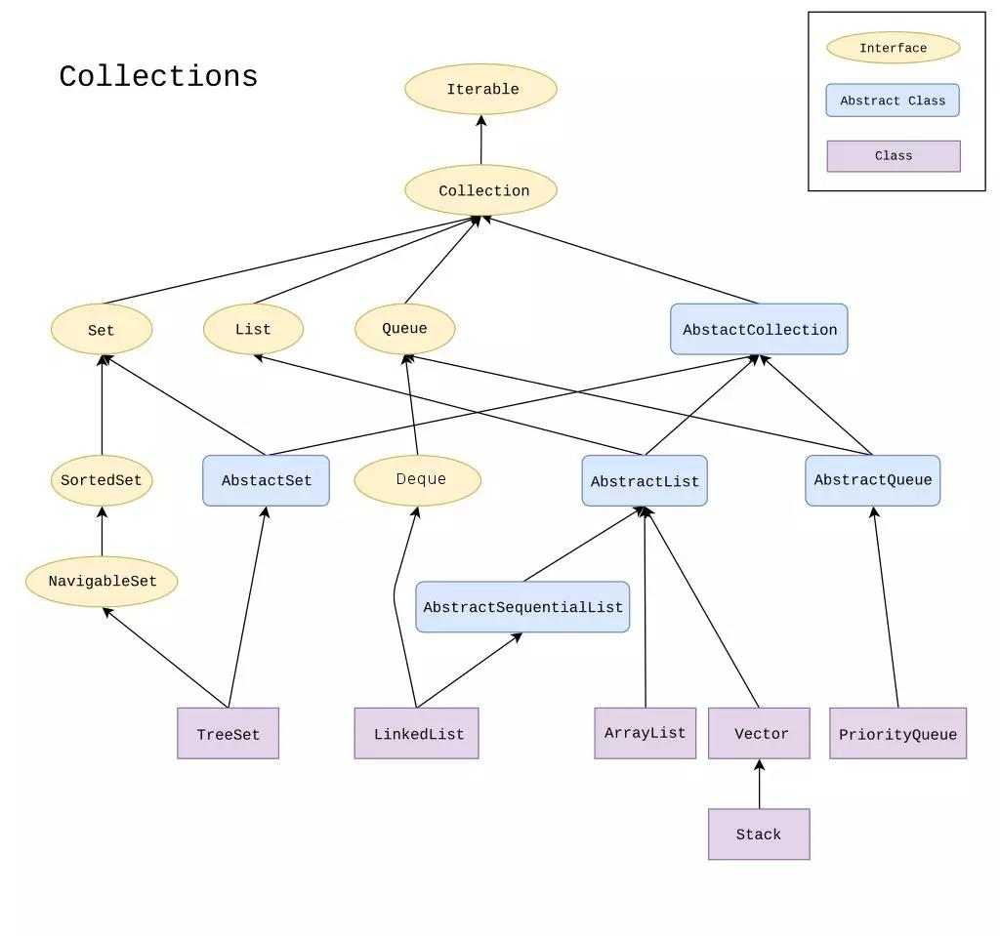
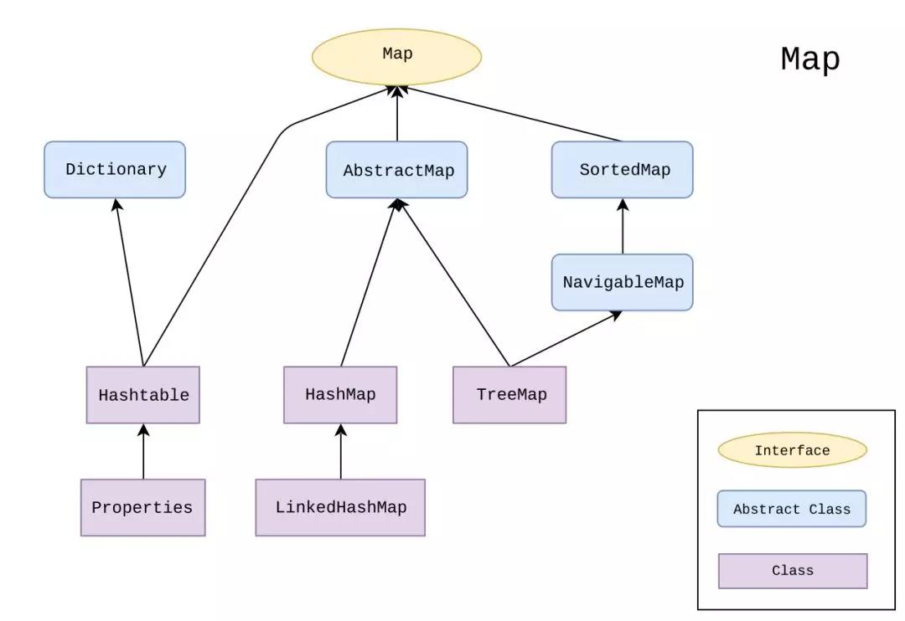
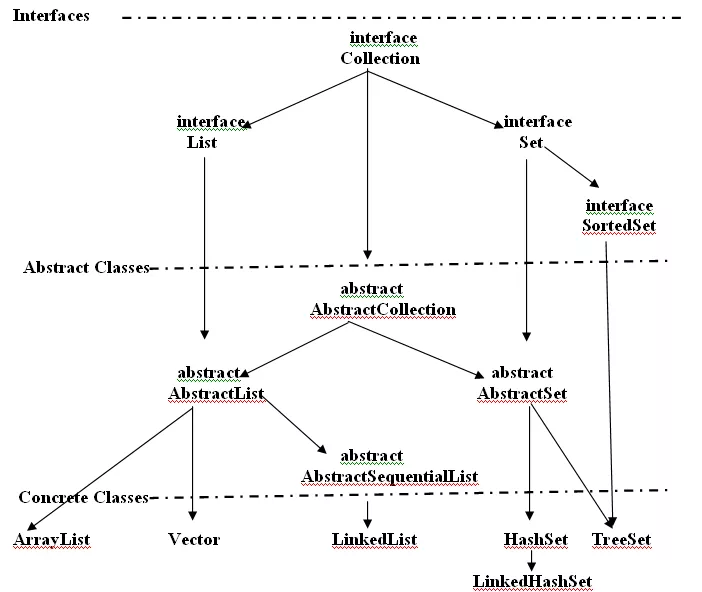

# Java 中的集合类初探

### **1. 简介**

​	JDK1.2 引入了 Java 集合框架，包含一组数据结构。与数组不同，这些数据结构的存储空间会随着元素添加动态增加。其中，一些支持添加重复元素另一些不支持，一些支持 null，一些能自动升序打印元素。

所有这些数据结构在 java.util 包里，包含了 Collection、List、Set、Map、SortedMap 接口。这些接口的实现类有 LinkedList、TreeSet、ArrayList、HashMap 等。除了这些数据结构，java.util 包还提供了 Date、GregorianCalender、StringTokenizer、Random 这样的工具类。

​																			java中的集合类全貌

###  **2. 分类**

可以按照接口、实现、算法三个方面对集合框架中的数据结构进行分类：

- 接口：Collection、List、Map 组成了集合框架中所有具体实现类的接口，它们定义了子类必须实现的方法，非常好记。比如向集合添加元素，会用到 Collection 中定义的 add() 方法
- 实现：所有实现了上述3个接口的类，都被称作集合框架，实际上就是数据结构。比如 LinkedList、TreeSet等
- 算法：集合框架提供了很多可以直接调用的算法，比如求最大最小值、排序、填充等

### **3. 优缺点**

**有以下4个优点：**

- 减少工作量的同时增加了软件的可用性：不需要每个程序员动手实现排序、查找、找出元素在数据结构中出现的次数
- 执行速度更快更持久：集合框架的底层数据结构分为两类，基于节点的和基于数组的，前者在频繁添加时效率更高，后者在频繁读取时速度更快。一些数据结构是 synchronized 线程安全的，但会影响速度有，另一些则不是线程安全的。程序员在选用数据结构前要清楚地了解这些因素
- 互操作与转换：由于实现了 Collection 接口，数据结构之间是可以相互转换的。可以 clone，可以把现有的结构转成 synchronized 版本，还可以在把基于链表的数据结构转为基于数组的结构

**有以下2个缺点：**

- 当心类型转换：在集合框架类之间进行转换时要大大地小心，尤其要考虑泛型类型的兼容性
- 运行时类型检查：集合框架在运行时会抛出异常，需要编程时多加注意

### **4. 继承体系**

java.util 中的数据结构继承体系分为两大类，一类实现了 Collection 接口，一类实现了 Map 接口。

Collection 继承体系（图片来自Wikipedia）

Map 继承体系（图片来自Wikipedia）

集合框架核心接口及实现类：

- Collection：根接口，大部分数据结构都实现了 Collection 接口中的方法
- Set：实现 Set 接口的数据结构不允许重复的元素，例如 HashSet、LinkedHashSet
- SortedSet：实现 SortedSet 接口的数据结构默认可按升序打印元素，例如 TreeSet
- List：实现 List 接口的数据结构允许重复元素，可通过 index 访问元素，例如 LinkedList、ArrayList、Vector
- Map：实现 Map 接口的数据结构存储键值对，不允许重复的 key，例如 HashMap、LinkedHashMap、Hashtable
- SortedMap：继承了 Map 接口，存储键值对，不允许重复的 key，默认可按 key 升序打印元素，例如 TreeMap

SortedSet 与 SortedMap 默认的排序是自然序，可通过 Comparator 或 Comparable 接口实现自定义排序。

在接口与具体的实现类之间还有一些抽象类，如下图：

这些抽象类为集合增加了很多功能：

- HashSet：实现 Set 接口，不允许重复的元素，底层数据结构 hash table
- LinkedHashSet：实现 Set 接口，不允许重复的元素，底层数据结构 hash table 与双链表
- TreeSet：实现 NavigableSet 接口，不允许重复的元素，底层数据结构红黑树
- ArrayList：实现 List 接口，允许重复元素，底层数据结构可变数组
- LinkedList：实现 List 接口，允许重复元素，底层数据结构双链表
- Vector：实现 List 接口，允许重复元素，底层数据结构可变数组
- HashMap：实现 Map 接口，不允许重复的 key，底层数据结构 hash table
- LinkedHashMap：实现 Map 接口，不允许重复的 key，底层数据结构 hash table 与双链表
- HashTable：实现 Map 接口，不允许重复的 key，底层数据结构 hash table
- TreeMap：实现 SortedMap 接口，不允许重复的 key，底层数据结构红黑树