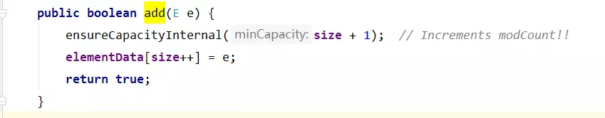
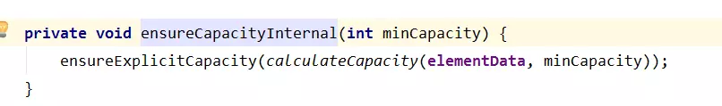
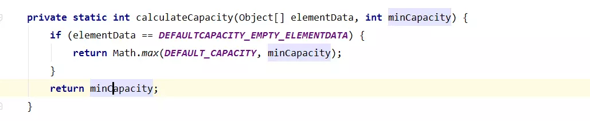
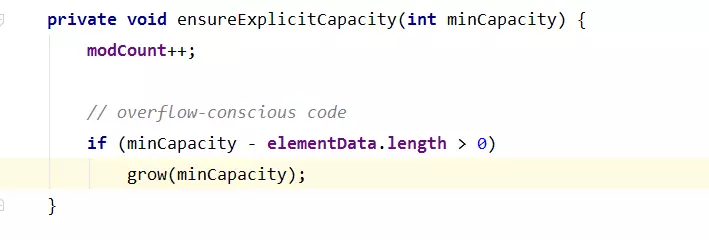
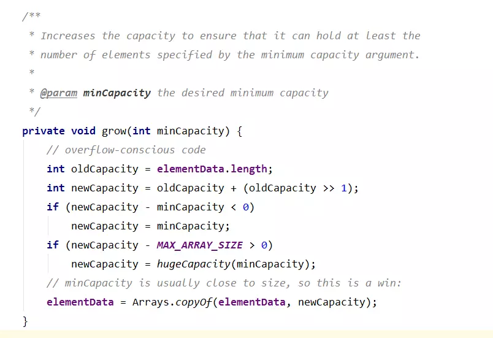
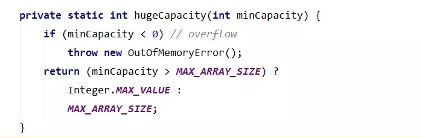
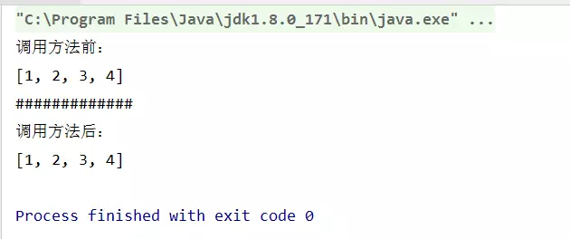

# List详解

ArrayList是基于数组实现的List类。他可以动态增长和缩减。本文就来总结一下关于ArrayList的面试题， 也是我在之前的面试经历中遇到的。

## 一、ArrayList的大小是如何自动增加的?

当我们向ArrayList的对象中增加一个对象的时候，Java会去检查ArrayList对象，确保底层的数组中有足够的容量来存储这个新的对象。如果容量不够增加新元素的话，那就会新建一个长度更长的数组（1.5倍的oldCapacity），旧的数组就会使用Arrays.copyOf方法被复制到新的数组中去，现有的数组引用指向了新的数组。

下面进入源码分析一下：




add方法

add方法中第一句调用了：
`ensureCapacityInternal(size + 1)`
注意这个size是当前数组中实际的元素个数，而ArrayList中的capacity是数组的长度。打个比方，你可以new一个长度为10的数组，那么capacity就是10，但是这个数组中你只赋值了两个位置，那么size=2。为什么这个方法要size+1呢？因为我们要添加一个新元素啊，当前有size个元素，那么必须要保证数组至少size+1大小才能容得下新添加元素。进入`ensureCapacityInternal(size + 1)`看看：




ensureCapacityInternal方法

调用了`ensureExplicitCapacity(int minCapacity)`方法，参数是`calculateCapacity(Object[] elementData, int minCapacity)`。这个方法就是计算一个为了添加新元素的最小容量：





下面是`ensureExplicitCapacity(int minCapacity)`方法：




方法名字也很好理解，就是确保显式的容量。首先增加ArrayList对象的修改次数。然后如果`minCapacity-elementData.length>0`。说明容量不够了，就调用grow方法去扩容。然后我们就看grow方法是如何扩容：




可以看到新的容量：`int newCapacity = oldCapacity + (oldCapacity >> 1);`即1.5倍的oldCapacity。然后用Arrays.copyof()方法把原数组拷贝，最后会用到native的数组拷贝方法。这里注释是overflow-conscious code，表明是考虑到溢出的代码。解释一下：

> **note:** 我们始终要记得哦，传进来的minCapacity是size+1。

1.正常情况下，每次capacity扩容1.5倍。当capacity扩大1.5倍发生int的溢出时，就每次进行最小扩容(+1)就可以了。第一个判断 `if (newCapacity - minCapacity < 0)`这个就是为这个溢出准备的。

1. 当按照1步骤不断往下走，最后也有可能达到上限值对吧。此时
   发生在第二个判断 `if (newCapacity - MAX_ARRAY_SIZE > 0)`时，其中`MAX_ARRAY_SIZE= Integer.MAX_VALUE-8`。这时候就要调用hugeCapacity方法啦：




至此添加元素之前的准备工作（验证数组大小，必要时的扩容）都做完了。

by the way，提一下几种数组赋值的效率问题：

> 1、System.arraycopy()方法
> 2、Arrays.copyOf()方法
> 3、for循环，手动复制
> 4、clone()方法（效率最低，而且是浅拷贝）

## 二、ArrayList or LinkedList如何选择

访问操作多，插入删除操作少选择 ArrayList。get元素和set元素的时间复杂度O(1)。插入操作默认在数组末尾添加元素，不考虑扩容是O(1)的时间复杂度，在指定位置添加元素，最坏O(n)的时间复杂度。

访问操作少，插入删除操作多选择LinkedList。

## 三、线程不安全

两个方面：

### 3.1 add操作

上面我们看add元素的源码时，有这么一句：

```java
elementData[size++] = e;
```

这句不是一个原子操作，可以分为如下两步执行：

```java
elementData[size] = e;
size++;
```

多线程的情况下可能会导致一个线程覆盖另一个线程的值。时序图如下：


### 3.2 扩容时

ArrayList 默认数组大小为 10。假设现在已经添加进去 9 个元素了，size = 9。

1. 线程 A 执行完 add 函数中的ensureCapacityInternal(size + 1)挂起了。
2. 线程 B 开始执行，校验数组容量发现不需要扩容。于是把 新元素E1 放在了下标为 9 的位置，且 size 自增 1。此时 size = 10。
3. 线程 A 接着执行，尝试把 E2 放在下标为 10 的位置，因为 size = 10。但因为数组还没有扩容，最大的下标才为 9，所以会抛出数组越界异常 ArrayIndexOutOfBoundsException。

### 3.3 如果使用线程安全的ArrayList

① 使用synchronize关键字加锁
② 使用Collections.synchronizedList
③ CopyOnWriteArrayList

## 四、ArrayList对象作为方法的参数。

看如下代码：

```java
import java.util.ArrayList;

public class TestList {
    public static void main(String[] args) {
        ArrayList<Integer> list = new ArrayList<>();
        list.add(1);
        list.add(2);
        list.add(3);
        list.add(4);

        System.out.println("调用方法前：");
        System.out.println(list);
        addlist(list);
        System.out.println("#############");
        System.out.println("调用方法后：");
        System.out.println(list);

    }

    public static void addlist(ArrayList<Integer> list) {
        list.add(5);
    }

}
```

输出结果：


把list作为实参传递给方法中，方法中修改list，则原来的list也会跟着改变。这个知识其实是Java的值传递和引用传递的知识点。如果不希望影响原来的，可以这么做。

```java
import java.util.ArrayList;

public class TestList {
    public static void main(String[] args) {
        ArrayList<Integer> list = new ArrayList<>();
        list.add(1);
        list.add(2);
        list.add(3);
        list.add(4);

        System.out.println("调用方法前：");
        System.out.println(list);
        addlist(list);
        System.out.println("#############");
        System.out.println("调用方法后：");
        System.out.println(list);

    }

    public static void addlist(ArrayList<Integer> list) {
        list = new ArrayList<>(list);  //重新new一个对象。
        list.add(5);
    }

}
```

此时结果如下：


