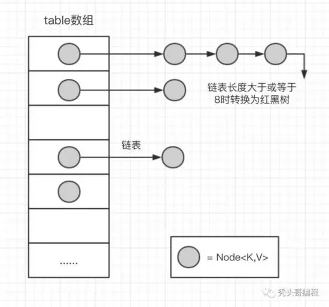

# 深入理解Map

HashMap在日常开发中基本是天天见的，而且都知道什么时候需要用HashMap，根据Key存取Value，但是存和取的时候那些操作却是很少去研究。同时在面试中也是面试官们必问的。 `以下是基于JDK1.8`

先看看HashMap的结构图：



### 1. HashMap中的成员变量

```java
// hashMap数组的初始容量 16
static final int DEFAULT_INITIAL_CAPACITY = 1 << 4;
// 负载因子 0.75f;
static final float DEFAULT_LOAD_FACTOR = 0.75f;
// 树形化阈值 8
static final int TREEIFY_THRESHOLD = 8;
// 解除树形化阈值 6
static final int UNTREEIFY_THRESHOLD = 6;
// 树形化的另一条件 Map数组的长度阈值 64
static final int MIN_TREEIFY_CAPACITY = 64
// 这个就是hashMap的内部数组了，而Node则是链表节点对象。
transient Node<K,V>[] table;
// 数组扩容阈值。
int threshold;
```

`initialCapacity` 数组的初始容量为16。可以在构造方法中指定。必须是2的幂次方。(16 → 32 → 64 ...)

`loadFactor`   加载因子 0.75f。 所谓的加载因子就是HashMap的容量达到0.75时的时候会试试扩容 `resize()` , (例：假设有一个 HashMap 的初始容量为 16 ，那么扩容的阀值就是 0.75 * 16 = 12 。也就是说，在你打算存入第 13 个值的时候，HashMap 会先执行扩容)。加载因子也能通过构造方法中指定，如果指定大于1，则数组不会扩容，牺牲了性能不过提升了内存。

`TREEIFY_THRESHOLD` 树形化阈值。当链表的节点个数大于等于这个值时，会将链表转化为红黑树。

`UNTREEIFY_THRESHOLD` 解除树形化阈值。当链表的节点个数小于等于这个值时，会将红黑树转换成普通的链表。

#### MIN_TREEIFY_CAPACITY树形化阈值的第二条件。当数组的长度小于这个值时，就算树形化阈达标，链表也不会转化为红黑树，而是优先扩容数组resize()。

`threshold` 数组扩容阈值。即：HashMap数组总容量 * 加载因子。当前容量大于或等于该值时会执行扩容** `resize()` **。扩容的容量为当前 HashMap 总容量的两倍。比如，当前 HashMap 的总容量为 16 ，那么扩容之后为 32 。

### 2. 继承关系

```java
// table 内部数组是节点类型
static class Node<K,V> implements Map.Entry<K,V> {
     final int hash; 
     final K key;
     V value;
     Node<K,V> next; //下一个节点
    //省略...
}
```

拉链法的散列表是通过链表解决碰撞问题的，所以HashMap的内部数组是节点类型。 `hash` 值是经过 `hash()` 方法处理过的hashCode，也就是 `数组的索引 bucket` ，为了使hashCode分布更加随机。

```java
java.util.HashMap<K, V>.Node<K, V>
    java.util.LinkedMap<K, V>.Entry<K, V>
        java.util.HashMap<K, V>.TreeNOde<K, V>
```

TreeNode是Node是子类，继承关系如下：Node是单向链表节点，Entry是双向链表节点，TreeNode是红黑树节点。TreeNode的代码400多行都是写的红黑树。这个有点难度..可以自行去了解。

### 3. 先对HashMap的简单总结

HashMap是基于拉链法实现的一个散列表，内部由数组和链表和红黑树实现。

1. 数组的初始容量为16，而容量是以2的次方扩充的，一是为了提高性能使用足够大的数组，二是为了能使用位运算代替取模预算(据说提升了5~8倍)。
2. 数组是否需要扩充是通过负载因子判断的，如果当前元素个数为数组容量的0.75时，就会扩充数组。这个0.75就是默认的负载因子，可由构造传入。我们也可以设置大于1的负载因子，这样数组就不会扩充，牺牲性能，节省内存。
3. 为了解决碰撞，数组中的元素是单向链表类型。当链表长度到达一个阈值时（7或8），会将链表转换成红黑树提高性能。而当链表长度缩小到另一个阈值时（6），又会将红黑树转换回单向链表提高性能，这里是一个平衡点。
4. 对于第三点补充说明，检查链表长度转换成红黑树之前，还会先检测当前数组数组是否到达一个阈值（64），如果没有到达这个容量，会放弃转换，先去扩充数组。所以上面也说了链表长度的阈值是7或8，因为会有一次放弃转换的操作。

### 4. 深入了解源码

#### 4.1 构造方法

```java
// 默认数组初始容量为16，负载因子为0.75f
public HashMap() {
    this.loadFactor = DEFAULT_LOAD_FACTOR; // all other fields defaulted
}
// 指定数组的初始容量
public HashMap(int initialCapacity) {
    this(initialCapacity, DEFAULT_LOAD_FACTOR);
}
// 指定数组的初始容量 和 负载因子
public HashMap(int initialCapacity, float loadFactor) {
    if (initialCapacity < 0)
        throw new IllegalArgumentException("Illegal initial capacity: " +
                initialCapacity);
    if (initialCapacity > MAXIMUM_CAPACITY)
        initialCapacity = MAXIMUM_CAPACITY;

    // NaN：Not a Number。例如给-1开方就会得到NaN。
    if (loadFactor <= 0 || Float.isNaN(loadFactor))
        throw new IllegalArgumentException("Illegal load factor: " +
                loadFactor);
    this.loadFactor = loadFactor;

    // 这个方法可以将任意一个整数转换成2的次方。
    // 例如输入10，则会返回16。
    // 另外，有人可能疑惑，不是说threshold是 数组容量 * loadFactor得到的吗？
    // 是的，在第一次put操作，扩充数组时，会将这个threshold作为数组容量，然后再重新计算这个值。
    this.threshold = tableSizeFor(initialCapacity);
}
```

在使用指定数组的初始容量时上面说过，数组容量必须是2的次方。所以就需要通过算法将我们给定的数值转换成2的次方。

```java
// 这个方法可以将任意一个整数转换成2的次方。
static final int tableSizeFor(int cap) {
    int n = cap - 1;
    n |= n >>> 1;
    n |= n >>> 2;
    n |= n >>> 4;
    n |= n >>> 8;
    n |= n >>> 16;
    return (n < 0) ? 1 : (n >= MAXIMUM_CAPACITY) ? MAXIMUM_CAPACITY : n + 1;
}
```

相关的位运算这里不做讲解。想了解的可以自己去查阅资料。

#### 4.2 数组的索引 bucket

HashMap采用hash算法来决定集合中元素的存储位置，每当系统初始化HashMap时，会创建一个为** `capacity` **的数组，这个数组里面可以存储元素的位置被成为** `桶(bucket)` **, 每个** `bucket`**都有其指定索引。可以根据该索引快速访问存储的元素。

```java
public V put(K key, V value) {
    // 传入的key经过了 hash(key) 方法
    return putVal(hash(key), key, value, false, true);
}
// 特殊处理的hashCode
static final int hash(Object key) {
    int h;
    return (key == null) ? 0 : (h = key.hashCode()) ^ (h >>> 16);
}
```

在Java中每个对象都会拥有一个 `hashCode()` 方法，这个就是散列函数，通过这个方法会返回一个32位的整数，使用这么大的值作为哈希值其实是为了尽量避免发生碰撞(相同)，例如两个不同对象的hashCode一样的话那就是发生了碰撞。但是如果用这么长的数字来当做索引肯定是不行的，那需要数组有多大才行？所以我们需要把这个hashCode缩小到规定数组的长度范围内。

上面的代码只是用hashCode的高16位与低16位进行异或运算。 `hash()` **方法就是将hashCode进一步的混淆，增加其** `“随机度”` `，试` **图减少插入HashMap时的hash冲突 。**

在putVal方法中，有一行这样的代码

```
if ((p = tab[i = (n - 1) & hash]) == null)
```

`i = (n - 1) & hash` ，n是数组长度，hash就是通过hash()方法进行高低位异或运算得出来的hash值。 这个表达式就是hash值的取模运算，上面已经说过当除数为2的次方时，可以用与运算提高性能。

#### 4.3 HashMap.put(k,v)

```java
public V put(K key, V value) {
    return putVal(hash(key), key, value, false, true);
}

// onlyIfAbsent：当存入键值对时，如果该key已存在，是否覆盖它的value。false为覆盖，true为不覆盖 参考putIfAbsent()方法。
// evict：用于子类LinkedHashMap。
final V putVal(int hash, K key, V value, boolean onlyIfAbsent, boolean evict) {
    HashMap.Node<K,V>[] tab; // tab：内部数组
    HashMap.Node<K,V> p;   // p：hash对应的索引位中的首节点
    int n, i;  // n：内部数组的长度    i：hash对应的索引位
    
    // 首次put时，内部数组为空，扩充数组。
    if ((tab = table) == null || (n = tab.length) == 0)
        n = (tab = resize()).length;
    // 计算数组索引，获取该索引位置的首节点，如果为null，添加一个新的节点
    if ((p = tab[i = (n - 1) & hash]) == null)
        tab[i] = newNode(hash, key, value, null);
    else {   
        HashMap.Node<K,V> e; K k;
        // 如果首节点的key和要存入的key相同，那么直接覆盖value的值。
        if (p.hash == hash && ((k = p.key) == key || (key != null && key.equals(k))))
            e = p;
        // 如果首节点是红黑树的，将键值对插添加到红黑树
        else if (p instanceof HashMap.TreeNode)
            e = ((HashMap.TreeNode<K,V>)p).putTreeVal(this, tab, hash, key, value);
        // 此时首节点为链表，如果链表中存在该键值对，直接覆盖value。
        // 如果不存在，则在末端插入键值对。然后判断链表是否大于等于7，尝试转换成红黑树。
        // 注意此处使用“尝试”，因为在treeifyBin方法中还会判断当前数组容量是否到达64，
        // 否则会放弃次此转换，优先扩充数组容量。
        else {
            // 走到这里，hash碰撞了。检查链表中是否包含key，或将键值对添加到链表末尾
            for (int binCount = 0; ; ++binCount) {
                // p.next == null，到达链表末尾，添加新节点，如果长度足够，转换成树结构。
                if ((e = p.next) == null) {
                    p.next = newNode(hash, key, value, null);
                    if (binCount >= TREEIFY_THRESHOLD - 1) // -1 for 1st
                        treeifyBin(tab, hash);
                    break;
                }
                // 检查链表中是否已经包含key
                if (e.hash == hash && ((k = e.key) == key || (key != null && key.equals(k))))
                    break;
                p = e;
            }
        }

        // 覆盖value的方法。
        if (e != null) { // existing mapping for key
            V oldValue = e.value;
            if (!onlyIfAbsent || oldValue == null)
                e.value = value;
            afterNodeAccess(e);
            return oldValue;
        }
    }
    ++modCount; // fail-fast机制
    
    // 如果元素个数大于阈值，扩充数组。
    if (++size > threshold)
        resize();
    afterNodeInsertion(evict);
    return null;
}
```

细心看注释部分，总结来说就是以下几个步骤：

1.检查数组是否为空，执行resize()扩充； 2.通过hash值计算数组索引，获取该索引位的首节点。 3.如果首节点为null** `（没发生碰撞）` **，直接添加节点到该索引位** `(bucket)` **。 4.如果首节点不为null** `（发生碰撞）` ，那么有3种情况 ① key和首节点的key相同，覆盖old value `（保证key的唯一性）` **；否则执行②或③ ② 如果首节点是红黑树节点（TreeNode），将键值对添加到红黑树。 ③ 如果首节点是链表，将键值对添加到链表。添加之后会判断链表长度是否到达TREEIFY_THRESHOLD - 1这个阈值，“尝试”将链表转换成红黑树。 5.最后判断当前元素个数是否大于threshold，扩充数组。

```java
// 把链表转换为红黑色
final void treeifyBin(Node<K,V>[] tab, int hash) {
    int n, index; Node<K,V> e;
    // 如果当前数组容量太小（小于64），放弃转换，扩充数组。
    if (tab == null || (n = tab.length) < MIN_TREEIFY_CAPACITY)
        resize(); 
    } else if ((e = tab[index = (n - 1) & hash]) != null) {
        // 将链表转成红黑树...
    }
}
```

HashMap在jdk1.8之后引入了红黑树的概念，表示若桶中链表元素超过8时，会自动转化成红黑树；若桶中元素小于等于6时，树结构还原成链表形式。

红黑树的平均查找长度是log(n)，长度为8，查找长度为log(8)=3，链表的平均查找长度为n/2，当长度为8时，平均查找长度为8/2=4，这才有转换成树的必要；链表长度如果是小于等于6，6/2=3，虽然速度也很快的，但是转化为树结构和生成树的时间并不会太短。

以6和8来作为平衡点是因为，中间有个差值7可以防止链表和树之间频繁的转换。假设，如果设计成链表个数超过8则链表转换成树结构，链表个数小于8则树结构转换成链表，如果一个HashMap不停的插入、删除元素，链表个数在8左右徘徊，就会频繁的发生树转链表、链表转树，效率会很低。

概括起来就是： 链表：如果元素小于8个，查询成本高，新增成本低，红黑树：如果元素大于8个，查询成本低，新增成本高。

#### 4.4 resize() 数组扩容

```java
final HashMap.Node<K,V>[] resize() {
    HashMap.Node<K,V>[] oldTab = table;
    int oldCap = (oldTab == null) ? 0 : oldTab.length;
    int oldThr = threshold;
    int newCap, newThr = 0;
    if (oldCap > 0) {
        // 如果数组已经是最大长度，不进行扩充。
        if (oldCap >= MAXIMUM_CAPACITY) {
            threshold = Integer.MAX_VALUE;
            return oldTab;
        }
        // 否则数组容量扩充一倍。（2的N次方）
        else if ((newCap = oldCap << 1) < MAXIMUM_CAPACITY &&
                oldCap >= DEFAULT_INITIAL_CAPACITY)
            newThr = oldThr << 1; // double threshold
    }
    // 如果数组还没创建，但是已经指定了threshold（这种情况是带参构造创建的对象），threshold的值为数组长度
    // 在 "构造函数" 那块内容进行过说明。
    else if (oldThr > 0) // initial capacity was placed in threshold
        newCap = oldThr;
    // 这种情况是通过无参构造创建的对象
    else {               // zero initial threshold signifies using defaults
        newCap = DEFAULT_INITIAL_CAPACITY;
        newThr = (int)(DEFAULT_LOAD_FACTOR * DEFAULT_INITIAL_CAPACITY);
    }
    // 可能是上面newThr = oldThr << 1时，最高位被移除了，变为0。
    if (newThr == 0) {
        float ft = (float)newCap * loadFactor;
        newThr = (newCap < MAXIMUM_CAPACITY && ft < (float)MAXIMUM_CAPACITY ?
                (int)ft : Integer.MAX_VALUE);
    }
    threshold = newThr;
  
    // 到了这里，新的数组长度已经被计算出来，创建一个新的数组。
    @SuppressWarnings({"rawtypes","unchecked"})
    HashMap.Node<K,V>[] newTab = (HashMap.Node<K,V>[])new HashMap.Node[newCap];
    table = newTab;
    
    // 下面代码是将原来数组的元素转移到新数组中。问题在于，数组长度发生变化。 
    // 那么通过hash%数组长度计算的索引也将和原来的不同。
    // jdk 1.7中是通过重新计算每个元素的索引，重新存入新的数组，称为rehash操作。
    // 这也是hashMap无序性的原因之一。而现在jdk 1.8对此做了优化，非常的巧妙。
    if (oldTab != null) {
        
        // 遍历原数组
        for (int j = 0; j < oldCap; ++j) {
            // 取出首节点
            HashMap.Node<K,V> e;
            if ((e = oldTab[j]) != null) {
                oldTab[j] = null;
                // 如果链表只有一个节点，那么直接重新计算索引存入新数组。
                if (e.next == null)
                    newTab[e.hash & (newCap - 1)] = e;
                // 如果该节点是红黑树，执行split方法，和链表类似的处理。
                else if (e instanceof HashMap.TreeNode)
                    ((HashMap.TreeNode<K,V>)e).split(this, newTab, j, oldCap);
                
                // 此时节点是链表
                else { // preserve order
                    // loHead，loTail为原链表的节点，索引不变。
                    HashMap.Node<K,V> loHead = null, loTail = null;
                    // hiHeadm, hiTail为新链表节点，原索引 + 原数组长度。
                    HashMap.Node<K,V> hiHead = null, hiTail = null;
                    HashMap.Node<K,V> next;
                    
                   // 遍历链表
                    do {
                        next = e.next;
                        // 新增bit为0的节点，存入原链表。
                        if ((e.hash & oldCap) == 0) {
                            if (loTail == null)
                                loHead = e;
                            else
                                loTail.next = e;
                            loTail = e;
                        }
                        // 新增bit为1的节点，存入新链表。
                        else {
                            if (hiTail == null)
                                hiHead = e;
                            else
                                hiTail.next = e;
                            hiTail = e;
                        }
                    } while ((e = next) != null);
                    // 原链表存回原索引位
                    if (loTail != null) {
                        loTail.next = null;
                        newTab[j] = loHead;
                    }
                    // 新链表存到：原索引位 + 原数组长度
                    if (hiTail != null) {
                        hiTail.next = null;
                        newTab[j + oldCap] = hiHead;
                    }
                }
            }
        }
    }
    return newTab;
}
```

扩充数组不单单只是让数组长度翻倍，将原数组中的元素直接存入新数组中这么简单。

因为元素的索引是通过hash&(n - 1)得到的，那么数组的长度由n变为2n，重新计算的索引就可能和原来的不一样了。

在jdk1.7中，是通过遍历每一个元素，每一个节点，重新计算他们的索引值，存入新的数组中，称为rehash操作。

而java1.8对此进行了一些优化，没有了rehash操作。因为当数组长度是通过2的次方扩充的，那么会发现以下规律：

元素的位置要么是在原位置，要么是在原位置再移动2次幂的位置。因此，在扩充HashMap的时候，不需要像JDK1.7的实现那样重新计算hash，只需要看看原来的hash值新增的那个bit是1还是0就好了，是0的话索引没变，是1的话索引变成“原索引+oldCap”。

先计算新数组的长度和新的阈值（threshold），然后将旧数组的内容迁移到新数组中，和1.7相比不需要执行rehash操作。因为以2次幂扩展的数组可以简单通过新增的bit判断索引位。

#### 4.5 HashMap.get(k)

```java
public V get(Object key) {
    Node<K,V> e;
    // 也会获取节点时也调用了hash()方法
    return (e = getNode(hash(key), key)) == null ? null : e.value;
}

final Node<K,V> getNode(int hash, Object key) {
    // tab：内部数组  first: 索引位首节点 n: 数组长度 k: 索引位首节点的key
    Node<K,V>[] tab; Node<K,V> first, e; int n; K k;
    // 数组不为null 数组长度大于0 索引位首节点不为null
    if ((tab = table) != null && (n = tab.length) > 0 &&
        (first = tab[(n - 1) & hash]) != null) {
        // 如果索引位首节点的hash==key的hash 或者 key和索引位首节点的k相同
        if (first.hash == hash && // always check first node
            ((k = first.key) == key || (key != null && key.equals(k))))
            // 返回索引位首节点(值对象)
            return first;
        if ((e = first.next) != null) {
            // 如果是红黑色则到红黑树中查找
            if (first instanceof TreeNode)
                return ((TreeNode<K,V>)first).getTreeNode(hash, key);
            do {
                // 发送碰撞 key.equals(k)
                if (e.hash == hash &&
                    ((k = e.key) == key || (key != null && key.equals(k))))
                    return e;
            } while ((e = e.next) != null);
        }
    }
    return null;
}
```

总结起来就是以下步骤 1.检查数组是否为null 和 索引位首节点** `(bucket的第一个节点)` 是否为null 2.如果索引节点的hash==key的hash 或者 key和索引节点的k相同则直接返回 `(bucket的第一个节点)` ** 3.如果是红黑色则到红黑树查找 4.如果有冲突，则通过key.equals(k)查找 5.都没找到就返回null

### 5. 总结 (面试相关)

#### 1、你用过HashMap吗？” “什么是HashMap？你为什么用到它？

呃..

#### 2、我们能否让HashMap同步？

Map m = Collections.synchronizeMap(hashMap);

#### 3、你知道HashMap的工作原理吗？

查看第序号3的总结。

#### 4、你知道HashMap的put()方法和get()方法的工作原理吗？？

put() 查看序号4.3的总结。 get() 查看序号4.5的总结。

#### 5、当两个对象的hashcode相同会发生什么？

两个对象的hashCode相同所以它们的bucket位置相同，会发生hash碰撞。HashMap使用链表存储对象，这个Entry会存储在链表中，存储时会检查链表中是否包含key **(key != null && key.equals(k)** ，或将键值对添加到链表尾部。如果链表长度大于或等于8，链表转换红黑树 ...

#### 6、如果两个键的hashcode相同，你如何获取值对象？

两个对象的hashCode相同所以它们的bucket位置相同，找到bucket位置之后，会调用keys.equals()方法去找到链表中正确的节点 **(key != null && key.equals(k)** 。

#### 7、怎么减少碰撞？

使用final修饰的对象、或不可变的对象作为键，使用(Integer、String)（是不可变、final的,而且已经重写了equals和hashCode方法）这样的wrapper类作为键是非常好的，（我们可以使用自定义的对象作为键吗？答：当然可以，只要它遵守了equals和hashCode方法定义规则，并且当对象插入到Map中之后将不会再改变。）

#### 8、如果HashMap的大小超过了负载因子(load factor)定义的容量，怎么办？

会调用** `resize()` **进行数组扩容。

#### 9、你了解重新调整HashMap大小存在什么问题吗？

当多线程的情况下，可能产生条件竞争。

因为如果两个线程都发现HashMap需要重新调整大小了，它们会同时试着调整大小。在调整大小的过程中，存储在链表中的元素的次序会反过来，因为移动到新的bucket位置的时候，HashMap并不会将元素放在链表的尾部，而是放在头部，这是为了避免尾部遍历(tail traversing)。如果条件竞争发生了，那么就死循环了。这个时候，你可以质问面试官，为什么这么奇怪，要在多线程的环境下使用HashMap呢？：）

#### 10、HashMap是非线程安全的，那么原因是什么呢？(HashMap的死锁)

由于HashMap的容量是有限的，如果HashMap中的数组的容量很小，假如只有2个，那么如果要放进10个keys的话，碰撞就会非常频繁，此时一个O(1)的查找算法，就变成了链表遍历，性能变成了O(n)，这是Hash表的缺陷。

为了解决这个问题,HashMap设计了一个阈值，其值为容量的0.75，当HashMap所用容量超过了阈值后，就会自动扩充其容量。

在多线程的情况下，当重新调整HashMap大小的时候，就会存在条件竞争，因为如果两个线程都发现HashMap需要重新调整大小了，它们会同时试着调整大小。在调整大小的过程中，存储在链表中的元素的次序会反过来，因为移动到新的bucket位置的时候，HashMap并不会将元素放在链表的尾部，而是放在头部，这是为了避免尾部遍历。如果条件竞争发生了，那么就会产生死循环了。  （又绕回了上一个问题 ：）

#### 11、影响HashMap性能的因素？

- 负载因子。
- 哈希值；理想情况是均匀的散列到各个桶。 一般HashMap使用String类型作为key，而String类重写了hashCode函数。