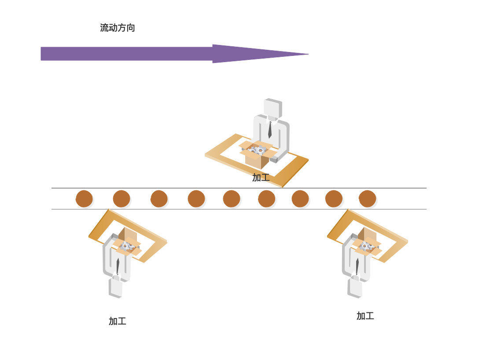
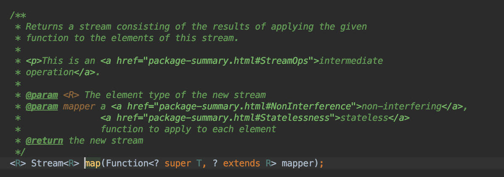
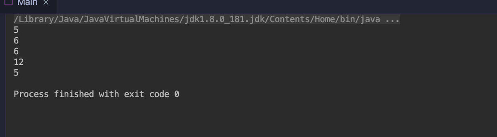
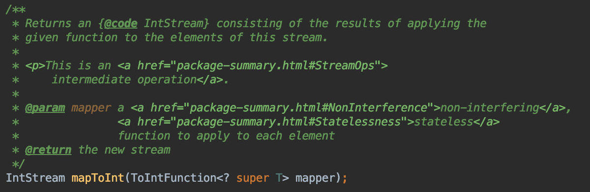
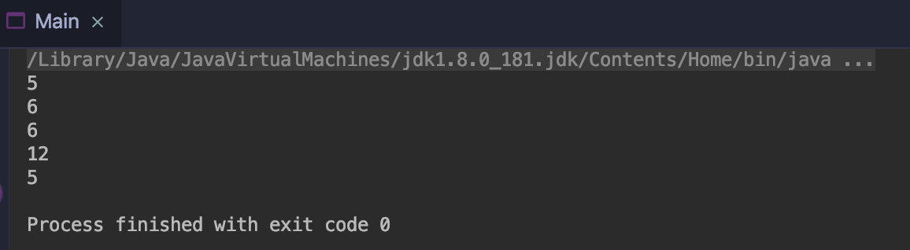

相信Java8的Stream 大家都已听说过了，但是可能大家不会用或者用的不熟，笔者将在《玩转Java8Stream》系列文章中带大家从零开始使用，循序渐进，带你走向Stream的巅峰。

## 操作符

什么是操作符呢？操作符就是对数据进行的一种处理工作，一道加工程序；就好像工厂的工人对流水线上的产品进行一道加工程序一样。



**Stream**的操作符大体上分为两种：**中间操作符**和**终止操作符**

### 中间操作符

对于数据流来说，中间操作符在执行制定处理程序后，数据流依然可以传递给下一级的操作符。

中间操作符包含8种(排除了parallel,sequential,这两个操作并不涉及到对数据流的加工操作)：

> 1. map(mapToInt,mapToLong,mapToDouble) 转换操作符，把比如A->B，这里默认提供了转int，long，double的操作符。
> 2. flatmap(flatmapToInt,flatmapToLong,flatmapToDouble) 拍平操作比如把 int[]{2,3,4} 拍平 变成 2，3，4 也就是从原来的一个数据变成了3个数据，这里默认提供了拍平成int,long,double的操作符。
> 3. limit 限流操作，比如数据流中有10个 我只要出前3个就可以使用。
> 4. distint 去重操作，对重复元素去重，底层使用了equals方法。
> 5. filter 过滤操作，把不想要的数据过滤。
> 6. peek 挑出操作，如果想对数据进行某些操作，如：读取、编辑修改等。
> 7. skip 跳过操作，跳过某些元素。
> 8. sorted(unordered) 排序操作，对元素排序，前提是实现Comparable接口，当然也可以自定义比较器。

### 终止操作符

数据经过中间加工操作，就轮到终止操作符上场了；终止操作符就是用来对数据进行收集或者消费的，数据到了终止操作这里就不会向下流动了，终止操作符只能使用一次。

> 1. collect 收集操作，将所有数据收集起来，这个操作非常重要，官方的提供的Collectors 提供了非常多收集器，可以说Stream 的核心在于Collectors。
> 2. count 统计操作，统计最终的数据个数。
> 3. findFirst、findAny 查找操作，查找第一个、查找任何一个 返回的类型为Optional。
> 4. noneMatch、allMatch、anyMatch 匹配操作，数据流中是否存在符合条件的元素 返回值为bool 值。
> 5. min、max 最值操作，需要自定义比较器，返回数据流中最大最小的值。
> 6. reduce 规约操作，将整个数据流的值规约为一个值，count、min、max底层就是使用reduce。
> 7. forEach、forEachOrdered 遍历操作，这里就是对最终的数据进行消费了。
> 8. toArray 数组操作，将数据流的元素转换成数组。

这里只介绍了Stream，并没有涉及到**IntStream**、**LongStream**、**DoubleStream**，这三个流实现了一些特有的操作符，我将在后续文章中介绍到。

说了这么多，只介绍这些操作符还远远不够；俗话说，实践出真知。那么，Let‘s go。

## 代码演练

**Stream 的一系列操作必须要使用终止操作，否者整个数据流是不会流动起来的，即处理操作不会执行。**

- map，可以看到 map 操作符要求输入一个Function的函数是接口实例，功能是将T类型转换成R类型的。



map操作将原来的单词 转换成了每个单的长度，利用了String自身的length()方法，该方法返回类型为int。这里我直接使用了lambda表达式，关于lambda表达式 还请读者们自行了解吧。

```java
public class Main {

    public static void main(String[] args) {
        Stream.of("apple","banana","orange","waltermaleon","grape")
                .map(e->e.length()) //转成单词的长度 int
                .forEach(e->System.out.println(e)); //输出
    }
}
```

当然也可以这样，这里使用了成员函数引用，为了便于读者们理解，后续的例子中将使用lambda表达式而非函数引用。

```java
public class Main {

    public static void main(String[] args) {
         Stream.of("apple","banana","orange","waltermaleon","grape")
                .map(String::length) //转成单词的长度 int
                .forEach(System.out::println);
    }
}
```

结果如图：




- mapToInt 将数据流中得元素转成Int，这限定了转换的类型Int，最终产生的流为IntStream，及结果只能转化成int。
- 


```java
public class Main {

    public static void main(String[] args) {
         Stream.of("apple", "banana", "orange", "waltermaleon", "grape")
                .mapToInt(e -> e.length()) //转成int
                .forEach(e -> System.out.println(e));
    }
}
```

mapToInt如图：




