# 开发环境搭建

前提说明：

- 该文档是在windows上搭建开发环境的说明，有需要在ios或者linux系统上搭建开发环境的同学遇到问题了另行咨询。
- 该文档中，涉及到的各种目录路径在一般情况下不要中文字符，尽量全部使用英文字符
- 要保证项目在一台电脑上搭建成功，推荐系统内存在16G或以上。


## 1：需要的版本管理软件：

版本管理工具：git 、tortoisegit

### git安装

下载 git 地址：https://git-scm.com/download/win

安装git：按照默认配置一步一步往下安装即可。安装完成之后，如下图在任意文件夹上右键鼠标，能看到git 的相关命令。

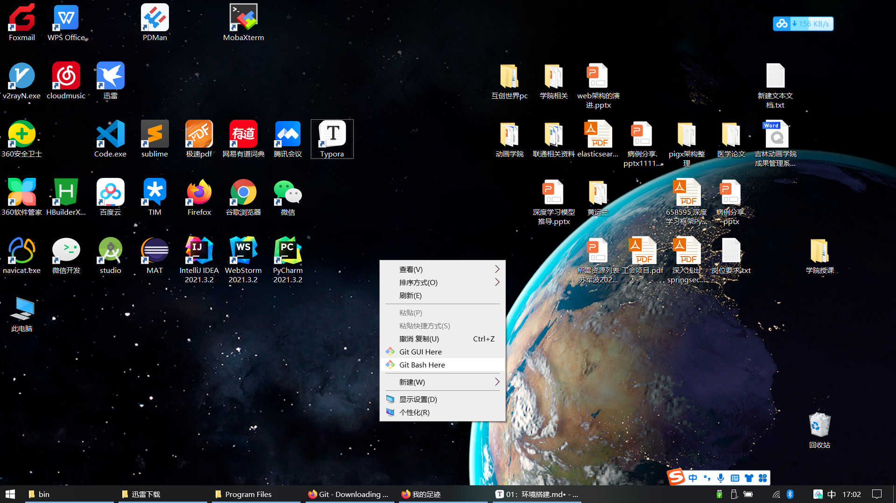


安装完git之后，基本可以使用git 命令进行代码的版本管理。

有的同学不适应使用git命令进行操作可以再安装 TortoiseGit 来进行图形化管理


### TortoiseGit 安装

TortoiseGit  下载地址： https://download.tortoisegit.org/tgit/2.13.0.0/TortoiseGit-2.13.0.1-64bit.msi

安装过程按照默认配置一步步安装即可。

安装完毕之后，在文件夹内右键鼠标可以看到相应菜单：

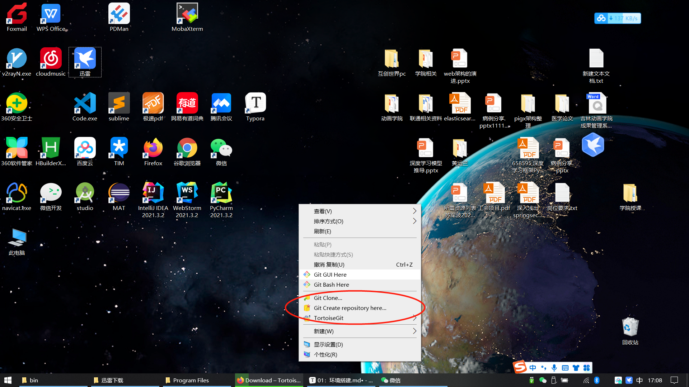


## 2：需要的开发工具


前端代码开发工具：nodejs、WebStorm

### 安装nodeJS与npm

node下载地址：https://cdn.npmmirror.com/binaries/node/v16.14.0/node-v16.14.0-x64.msi

安装过程比较简单，按照默认配置一步步安装即可。node中带有npm，不需要单独安装

安装成功之后。进入命令工具：

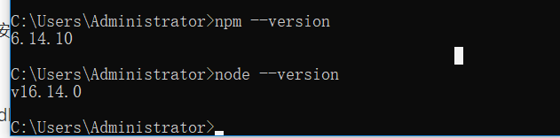

### 安装 webstrom

webstorm下载地址：https://download.jetbrains.com.cn/webstorm/WebStorm-2021.3.2.exe

下载完成之后按照默认配置一步一步安装即可。

安装之后打开webstorm试用即可。后续有破解教程。

### 安装JDK1.8

JDK1.8 下载地址：https://www.oracle.com/java/technologies/javase/javase8u211-later-archive-downloads.html

选择 Windows x64 Installer进行下载。下载后按照默认配置一步一步安装即可。

### 安装IntelJ

IntelJ下载地址：https://download.jetbrains.com.cn/idea/ideaIU-2021.3.2.exe?_gl=1*1wqtbi6*_ga*MTQwMTAxNjE3Ni4xNjQ1NTAwNDg1*_ga_V0XZL7QHEB*MTY0NTUxNTczMi4xLjEuMTY0NTUxNTc0Mi4w

安装之后打开IntelJ试用即可。后续有破解教程。


IntelJ和webstorm破解教程

 下载[破解文件](01：环境搭建.assets/zhile_agent_po.zip)到任意地方并解压，解压密码为 idea404 

打开IntelJ和webstorm，在help中打开edit Custom VM options。如下图所示：

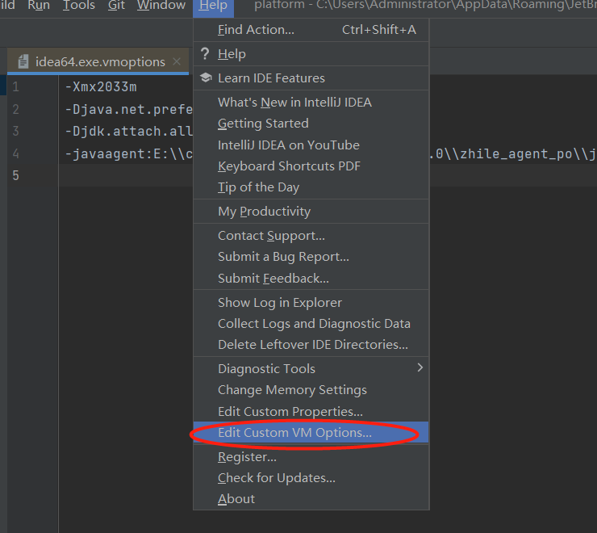

打开改文件之后，在下面添加一行：-javaagent:E:\\crackIntelJ\\ja-netfilter-v2.3.0\\zhile_agent_po\\ja-netfilter.jar 注意这里的路径就是对应你下载的破解文件的解压路径。

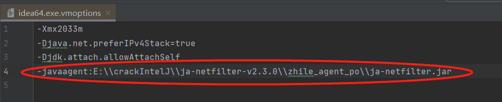

破解成功之后在开发工具中点击 help-about 可以看到授权时间变成了5000年：

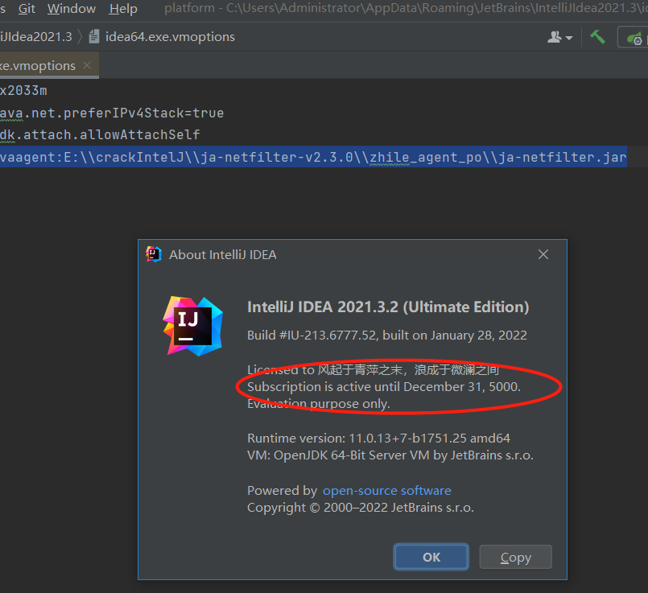


数据库相关软件：mysql 5.7+   、redis

### 安装mysql

mysql下载地址：https://dev.mysql.com/downloads/mysql/5.7.html 建议下载 **Windows (x86, 64-bit), ZIP Archive**版本

解压后，在目录下创建  my.ini 文件，内容如下

```
[mysqld]

port = 3306

basedir=E:\DB\mysql-5.7.26-winx64

datadir=E:\DB\mysql-5.7.26-winx64\data

max_connections=200

character-set-server=utf8

default-storage-engine=INNODB

#skip-grant-tables

sql_mode=NO_ENGINE_SUBSTITUTION,STRICT_TRANS_TABLES

[mysql]

default-character-set=utf8
```

其中 basedir 和 datadir 需要和你当前对应的路径相匹配。

使用超级管理员命令工具进入到bin目录下执行: mysqld -install mysql5.7 其中 第二个mysql是要安装的服务名称，可以省略。若出现**Service successfully installed**，证明安装成功；

```
然后执行 mysqld --initialize
```

设置MySQL密码

首先停止MySQL服务,输入命令行 

```
net stop mysql
```

找到my.ini，在[mysqld]字段下任意一行添加skip-grant-tables，保存即可。这里的这个设置是让mysql不需要进行登录校验就可以链接使用

重启MySQL,输入启动命令：net start mysql启动mysql服务

在输入下面命令不需要输入密码，直接回车

```
mysql -u root -p
```

输入命令行use mysql，进入数据库
输入命令行update user set authentication_string=password("xxxxxx") where user="root";xxxxxx是你设置的新密码，敲击回车后若出现以下信息，证明修改成功！


手动停止MySQL服务，在win10搜索栏内输入服务，找到MySQL。点击右键，然后点击停止即可。然后在刚刚的my.ini文件中删除skip-grant-tables这一行，保存关闭。

再次启动cmd（管理员身份），输入启动命令：net start mysql，再输入mysql -u root -p，再输入你刚刚设置的密码，然后输入命令行use mysql验证一下，结果报错：


这里使因为第一次使用密码需要更改一下。

既然没有重置密码，那就重置一下呗
键入命令行alter user user() identified by "xxxxxx";我的密码是123456，因此我键入 alter user user() identified by "123456";回车！
再次输入命令行use mysql验证一下，成功！
安装过程参见：https://blog.csdn.net/weixin_43395911/article/details/99702121


感觉上述过程复杂的，可以下载 mysql安装版：

https://downloads.mysql.com/archives/installer/

### 安装 redis

下载 redis  https://github.com/MicrosoftArchive/redis/releases


### 安装配置 maven

下载maven：https://dlcdn.apache.org/maven/maven-3/3.8.4/binaries/apache-maven-3.8.4-bin.zip

下载后在某一文件夹内解压。

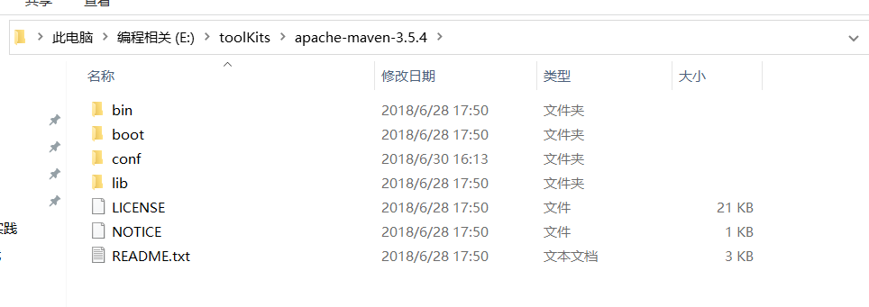

### 安装navicat 

安装 navicat比较简单，网上自行查找安装

## 3：环境搭建

### 下载代码

项目地址 https://gitee.com/y_project/RuoYi-Vue

下载源代码到本地有多重方式，可以直接点击“下载ZIP”，可以使用git工具下载


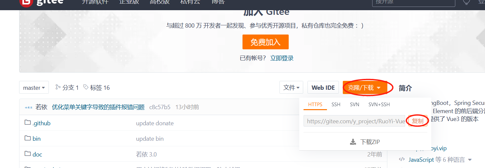

复制地址后，可以在文件夹内右键鼠标，如下图所示

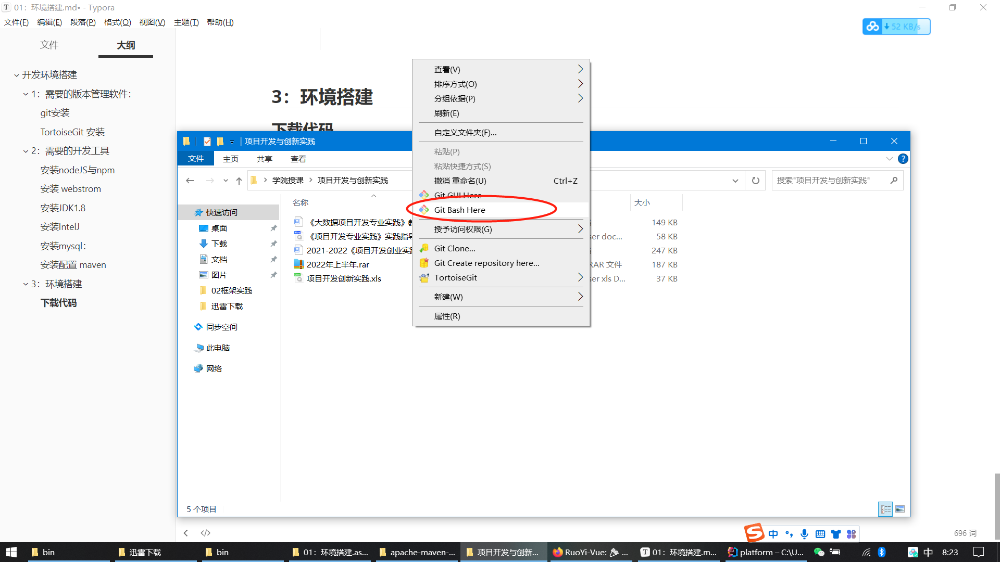

然后进入git命令提示中，使用git clone https://gitee.com/y_project/RuoYi-Vue.git 下载代码如下：

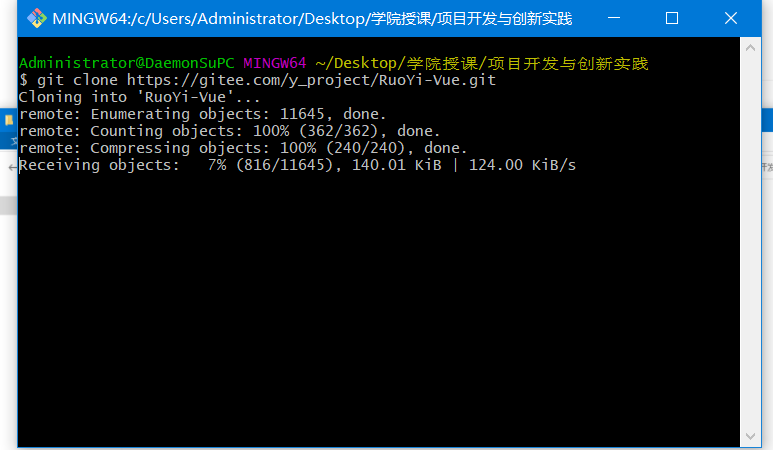

也可以使用如下方法下载代码

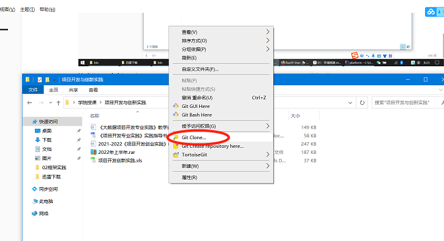

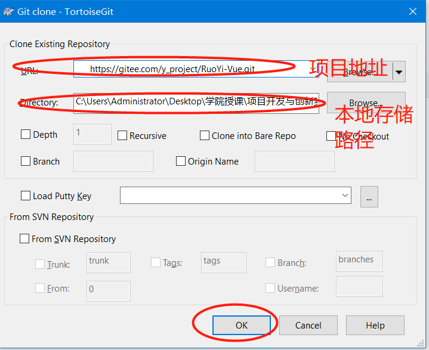


### 代码导入到开发工具中

#### 导入后端代码

1：进入到IntelJ中，点击file -open 选择你下载的源代码文件夹

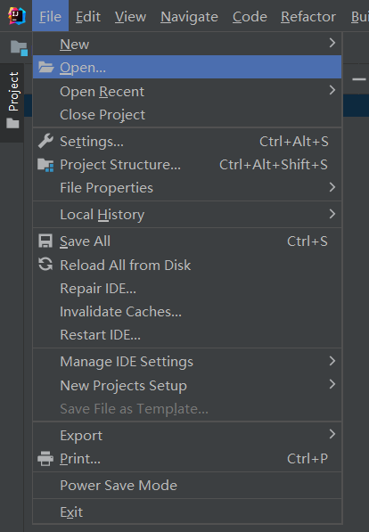

项目导入之后如下：

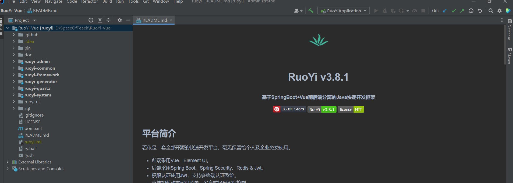

#### 导入前端代码

进入源代码目录中的ruoyi-ui 目录下，按住shift键然后点击鼠标右键（这是一个可以在当前文件夹路径下直接进入命令行的一个小技巧，也可以使用cmd命令进入当前文件夹下），点击在此处打开powershell窗口。

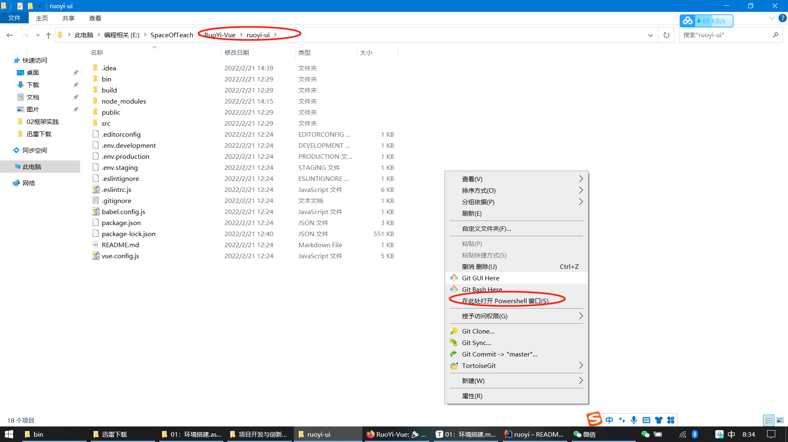

进入后，命令提示行里的路径和你代码所在路径是一致的。在该命令提示行下执行 npm install命令。第一次执行会比较慢。执行结果如下：

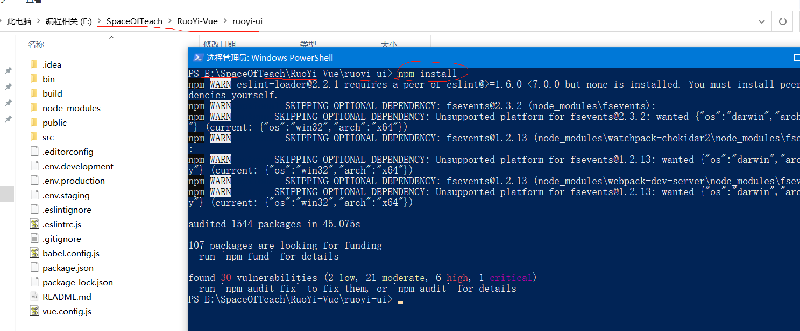

执行完毕之后，在该文件夹下会多出一个 “node_modules” 该文件夹下有前端开发的依赖包。

上述命令执行完毕之后，使用webstorm 打开该文件夹（操作同后端代码导入intelJ）

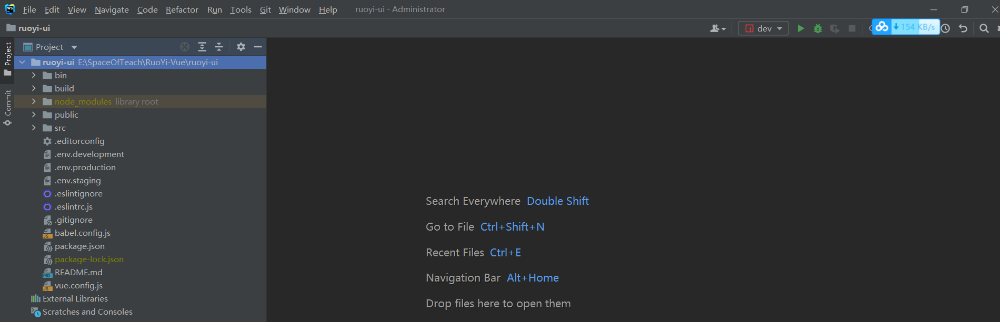


### 修改配置文件

1：修改RuoYi-Vue\ruoyi-admin\src\main\resources 下的application.yml 文件中 redis相关配置。其中host 使你安装redis机器的地址，默认localhost就是你本机地址。password中的值使你在安装redis步骤中设置的redis密码。

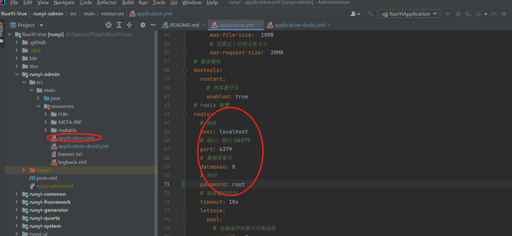


2：修改RuoYi-Vue\ruoyi-admin\src\main\resources 下的application-druid.yml文件中数据库相关配置。其中url配置你安装mysql的机器的ip，默认localhost就是你本机地址。password中的值使你在安装mysql步骤中设置的mysql密码。

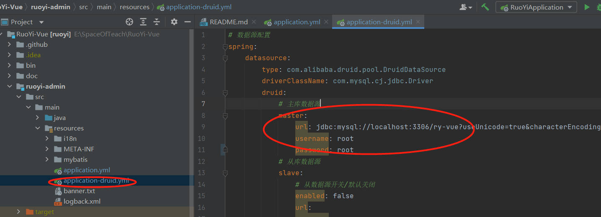


### 导入数据到数据库

创建一个链接：链接-mysql 连接名随便起，主机是localhost，用户名是root，密码是你在安装mysql中设置的密码

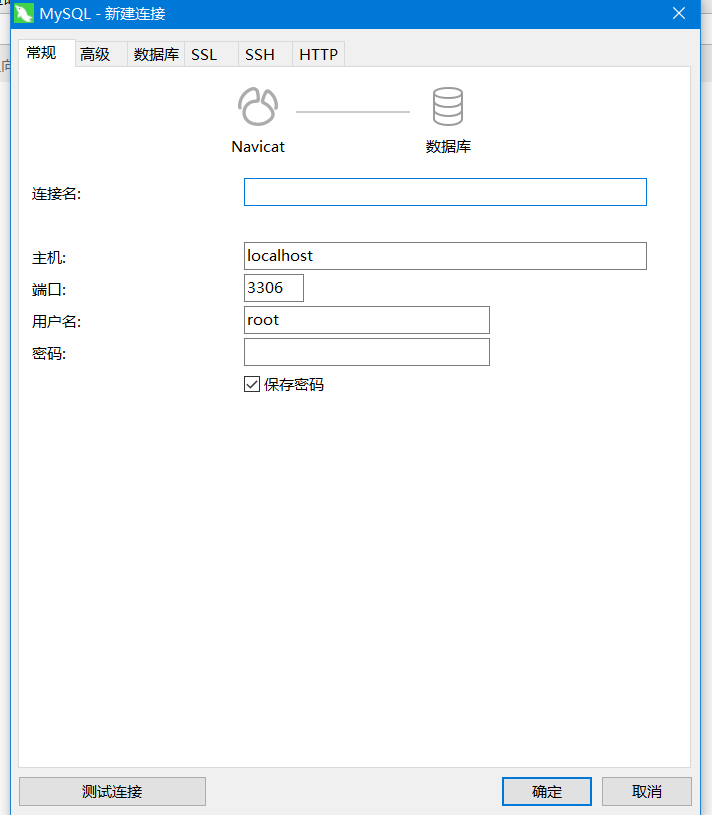


创建链接成功之后，双击链接。在连接上右键-新建数据库：

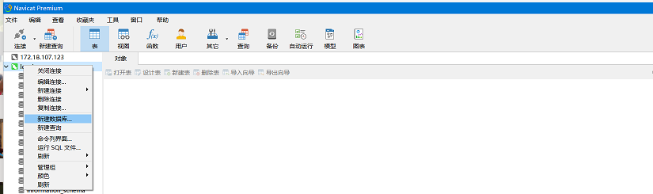

数据库名：ry-vue 字符集：utf8mb4 排序规则空着就行。

创建成功双击打开之后如下：

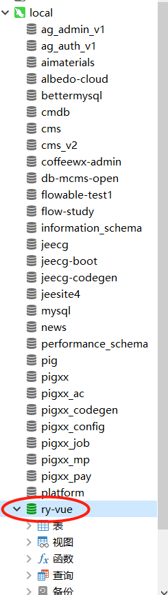

在该数据库上右键运行sql文件并选择项目源代码目录下的sql文件。先选择ry_20210908.sql确定执行，成功之后再重复此步骤运行squartz.sql

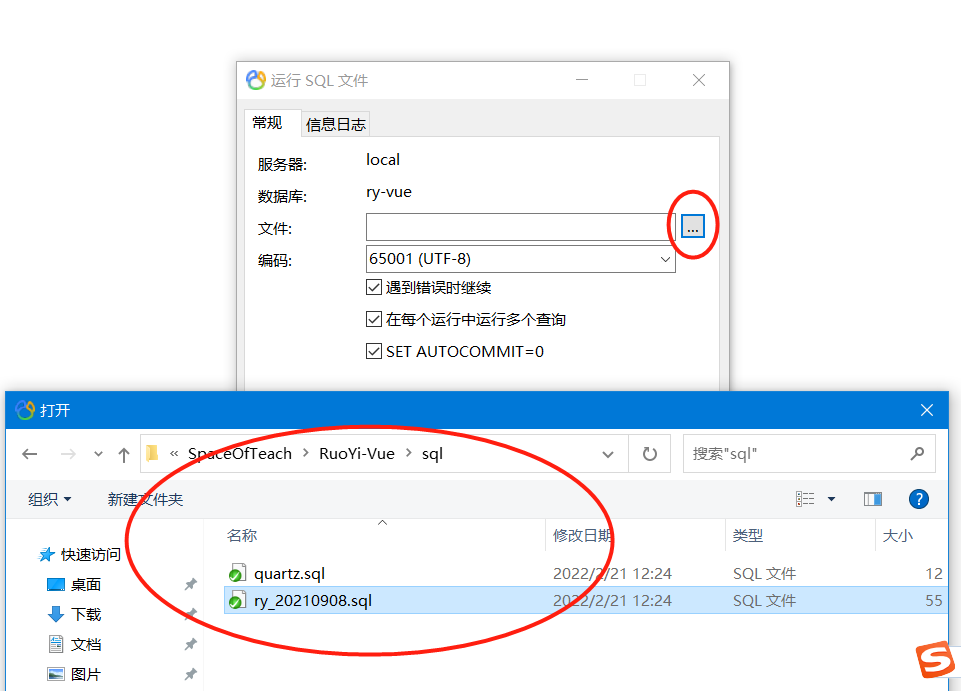

### 配置项目并启动

#### 配置运行后端程序：

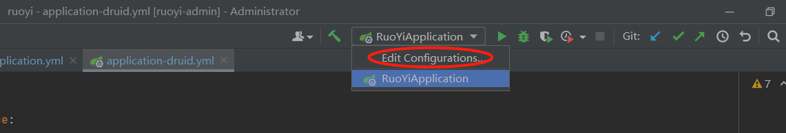


点击加号-spring boot会创建一个启动其中相关配置如下。

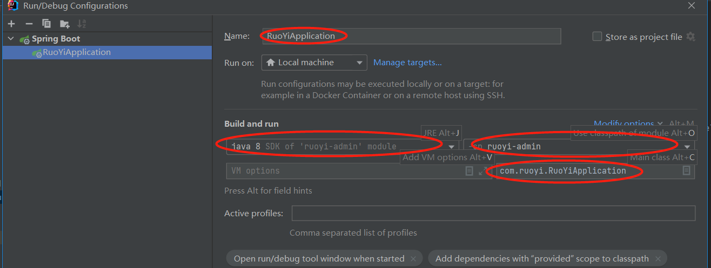

创建完毕之后，可以通过点击下面按钮启动项目

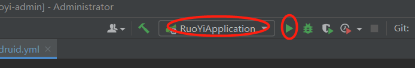

#### 配置前端项目启动

在项目中创建npm程序

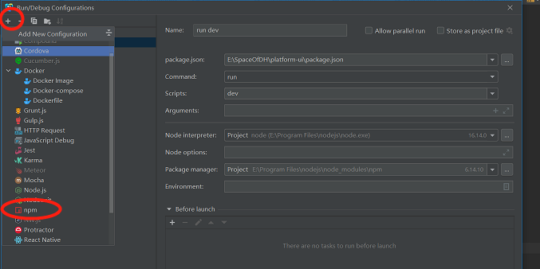

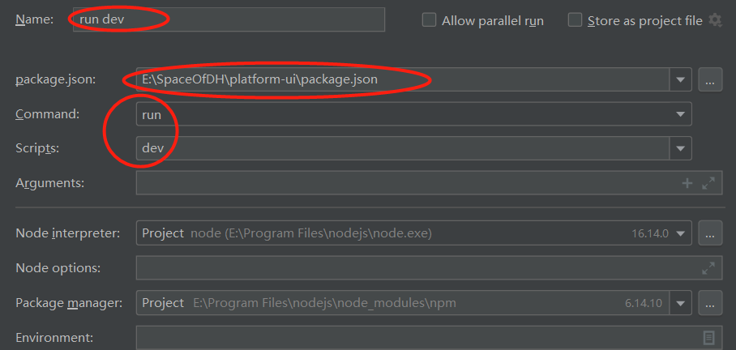

创建配置相关项的填写如上。

配置完成之后，点击启动按钮。起一次启动项目会比较慢，耐心等待。


项目启动完成如下：

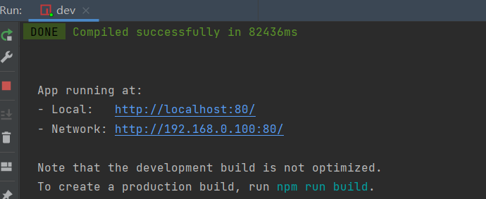

前后台都启动成功的前提下，通过浏览器访问 

http://localhost 默认的用户名和密码（admin/admin123）都是写好了，直接登录即可。
