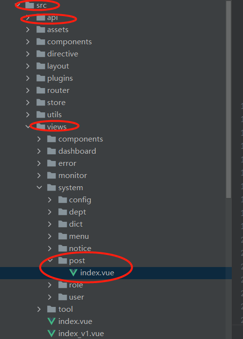
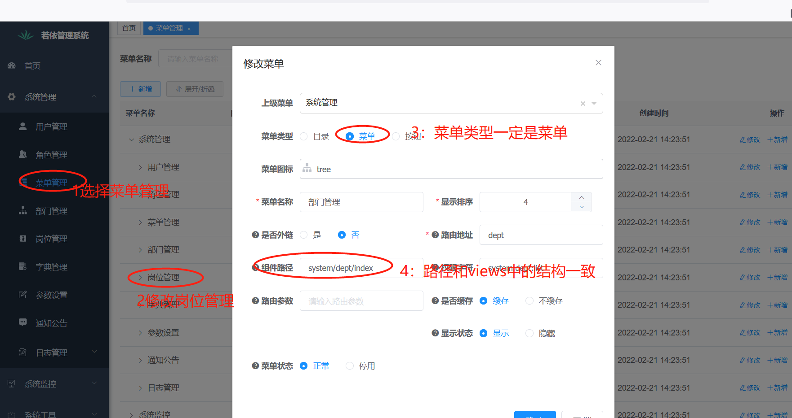

# 系统中的分层与作用


系统在功能开发中，一定需要进行分层设计

## 分层设计整体说明


### 前端：

这里的前端是大前端的概念，包括PC端页面，小程序，移动端APP，PC端PP等，都是前端的概念

我们本学期开发所涉及到的前端是小前端的概念，指PC端浏览器对应的页面。这里主要涉及到的技术是基于 vue开发的element组件库。

该组件库地址：https://element.eleme.cn/#/zh-CN/component/installation

### web层的主要作用是：

1：接受请求，调用service层进行业务处理，然后返回处理结果

2：进行安全验证，包括登录认证处理的验证，用户访问权限的验证以及各种攻击手段的防范（xss、csrf等）

3：对于接收的请求数据进行校验

### service层主要的作用：

1：实现具体的业务逻辑，也就是一个service方法对应一个业务功能，一个业务功能可以对应多个DAO层的sql操作。

2：进行数据库事务控制，保证一个业务的完整性

3：缓存的相关处理

### DAO层作用、bean层：

1：对数据库进行单一的操作动作，一般一个动作对应数据库的一个sql语句。

2：这里需要注意sql注入攻击的防范

Bean层建立一个java实体bean和数据库中的表。bean中的属性字段和数据库表中的字段之间的关系。


### 数据库连接池

建立一个java程序和数据库之间的链接。这里本质是一个优化操作。

## 前端代码分析

我们这里以系统中最简单的模块岗位管理进行分析

### 采用框架

前端采用的是elementUI

官网地址：https://element.eleme.cn/#/zh-CN/component/installation 每一个组件都需要大家详细去学习。我们本次课不详细讲解每一个组件的API

### 前端目录结构



和前端相关的代码基本上都放到了src目录下。

该目录下API里面放置的是调用后端相应的API接口相关操作。

views目录下存放的是和视图相关的代码。其中，views下的各个目录都是不同的系统模块。和系统相关的模块是在views下的system目录下。对应的岗位管理就是在post目录下。


### 开发步骤

#### 1.创建菜单

system目录有对应的还是模块，post.js对应的就是和岗位相关的调用后端操作。里面具体内容如右侧所示。




#### 2.创建对应的前端代码文件

post/index.vue	文件的代码主要是分成了两部分：

```html
<template>
	//模板部分
</template>
<script>
	//调用API加载数据并模板解析
	
</script>
```

其中， script部分又可以分成import， data ，created，methods几个部分。

import 是导入其他的模块或者API。这里因为需要使用相关API，所以导入了API文件夹下的相应的文件。

data部分是这个页面使用的所有的数据都在这里。页面中需要的数据大致有 查询信息，列表数据，校验规则，控制数据等

created是页面加载执行的行为。也就是页面刚一开始加载完毕需要执行的行为。这里需要已进入页面就显示列表，所以就执行了加载列表动作

methods是定了该页面中所有的行为动作，通过调用API来实现，并且定义了执行API动作之后的操作。

```
import { listPost, getPost, delPost, addPost, updatePost } from "@/api/system/post";
data() {
            return {
              // 遮罩层
              loading: true,
              // 选中数组
              ids: [],
              // 非单个禁用
              single: true,
              // 非多个禁用
              multiple: true,
              // 显示搜索条件
              showSearch: true,
              // 总条数
              total: 0,
              // 岗位表格数据
              postList: [],
              // 弹出层标题
              title: "",
              // 是否显示弹出层
              open: false,
              // 查询参数
              queryParams: {
                pageNum: 1,
                pageSize: 10,
                postCode: undefined,
                postName: undefined,
                status: undefined
              },
              // 表单参数
              form: {},
              // 表单校验
              rules: {
              }
            };
	  	created() {
            this.getList();
          },
	    methods:{
	    	 getList() {
                  this.loading = true;
                  listPost(this.queryParams).then(response => {
                    this.postList = response.rows;
                    this.total = response.total;
                    this.loading = false;
                  });
    		},
	    }
```

#### 3：创建API

API目录下存放的都是调用后端的相关动作


其中，涉及到与后端交互。所以一定是要发送请求的。这里的发送请求就是需要导入我们封装的一个request类来发送所有的请求。

方法也很简单，就是将请求的结果返回即可。


#### 4：对响应的数据进行处理

```
		 getList() {
                  this.loading = true;
                  listPost(this.queryParams).then(response => {
                    this.postList = response.rows;
                    this.total = response.total;
                    this.loading = false;
                  });
    		},
```

这里首先是要将请求拿回的数据放到data里面的属性中。然后将data里面的数据进行解析即可。

```html
<el-table v-loading="loading" :data="postList" @selection-change="handleSelectionChange">
  <el-table-column type="selection" width="55" align="center" />
  <el-table-column label="岗位编号" align="center" prop="postId" />
  <el-table-column label="岗位编码" align="center" prop="postCode" />
  <el-table-column label="岗位名称" align="center" prop="postName" />
  <el-table-column label="岗位排序" align="center" prop="postSort" />
  <el-table-column label="状态" align="center" prop="status">
    <template slot-scope="scope">
      <dict-tag :options="dict.type.sys_normal_disable" :value="scope.row.status"/>
    </template>
  </el-table-column>
  <el-table-column label="创建时间" align="center" prop="createTime" width="180">
    <template slot-scope="scope">
      <span>{{ parseTime(scope.row.createTime) }}</span>
    </template>
  </el-table-column>
  <el-table-column label="操作" align="center" class-name="small-padding fixed-width">
    <template slot-scope="scope">
      <el-button
        size="mini"
        type="text"
        icon="el-icon-edit"
        @click="handleUpdate(scope.row)"
        v-hasPermi="['system:post:edit']"
      >修改</el-button>
      <el-button
        size="mini"
        type="text"
        icon="el-icon-delete"
        @click="handleDelete(scope.row)"
        v-hasPermi="['system:post:remove']"
      >删除</el-button>
    </template>
  </el-table-column>
</el-table>
```


