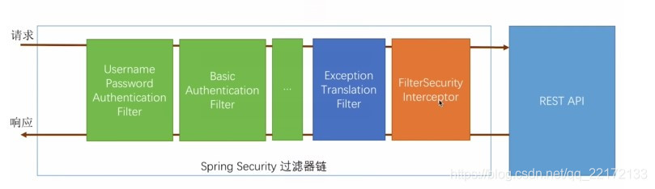
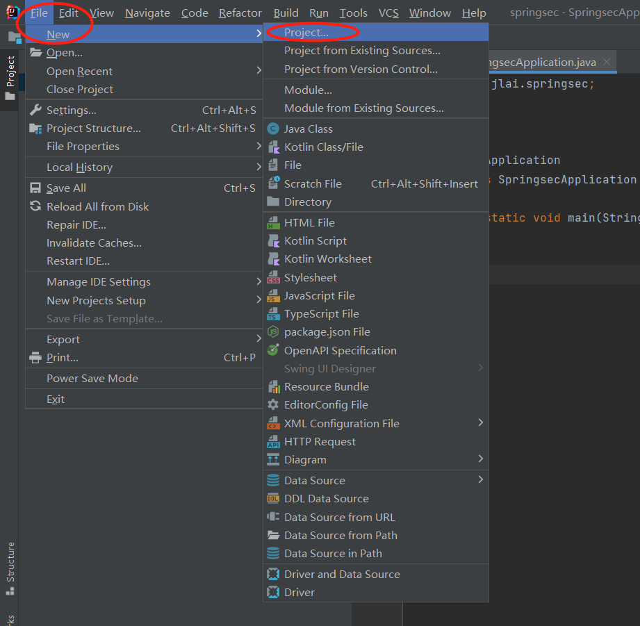
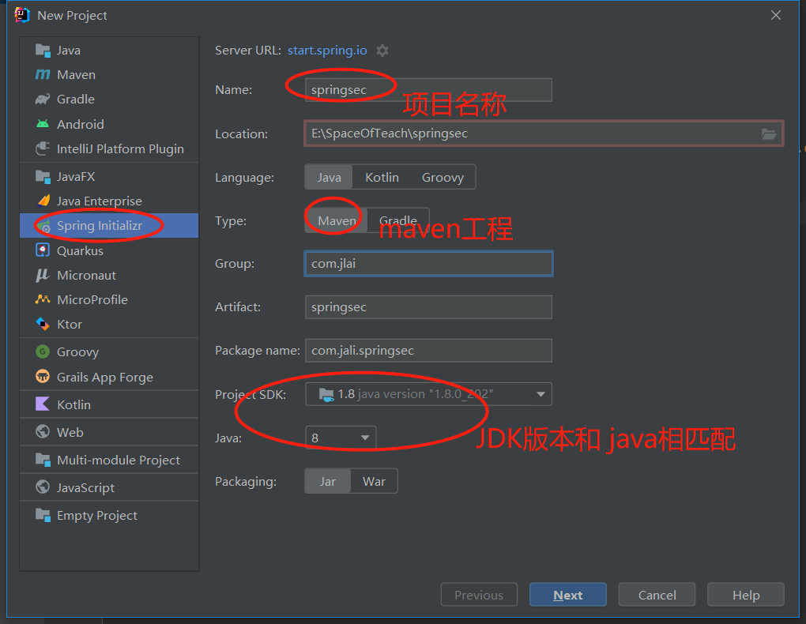
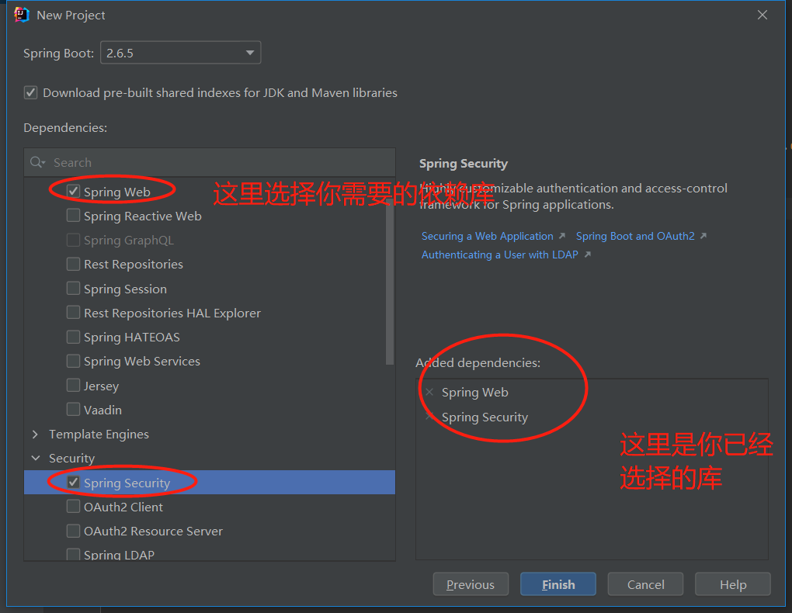
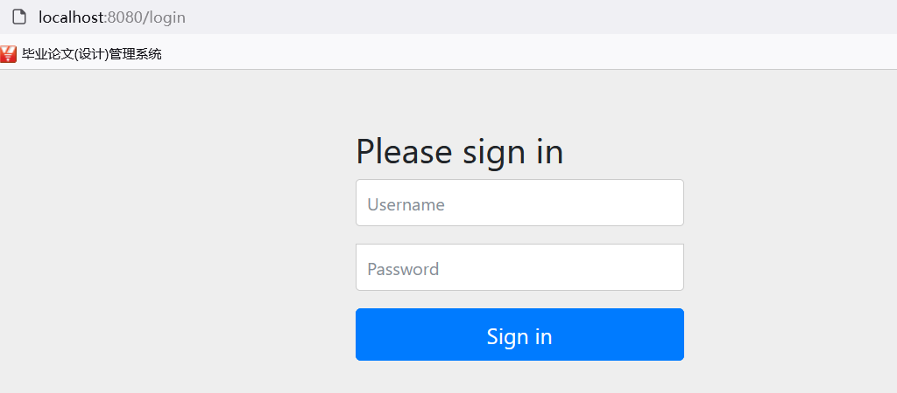
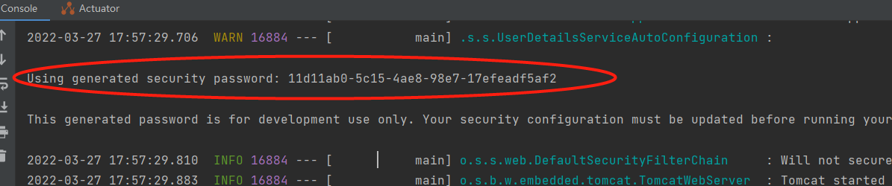
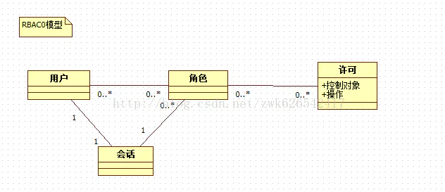

# spring security

## 一、spring security 简介


Spring Security 是 Spring 家族中的一个安全管理框架，实际上，在 Spring Boot 出现之前，Spring Security 就已经发展了多年了，但是使用的并不多，安全管理这个领域，一直是 Shiro 的天下。

相对于 Shiro，在 SSM/SSH 中整合 Spring Security 都是比较麻烦的操作，所以，Spring Security  虽然功能比 Shiro 强大，但是使用反而没有 Shiro 多（Shiro 虽然功能没有 Spring Security  多，但是对于大部分项目而言，Shiro 也够用了）。

自从有了 Spring Boot 之后，Spring Boot 对于 Spring Security 提供了 自动化配置方案，可以零配置使用 Spring Security。

因此，一般来说，常见的安全管理技术栈的组合是这样的：

- SSM + Shiro
- Spring Boot/Spring Cloud + Spring Security


​    spring security 的核心功能主要包括，其他的安全框架基本也要包含以下三个核心功能：

- 认证 （你是谁）

- 授权 （你能干什么）
- 攻击防护 （防止伪造身份）

 其核心就是一组过滤器链，项目启动后将会自动配置。最核心的就是 Basic Authentication Filter 用来认证用户的身份，一个在spring security中一种过滤器处理一种认证方式。



比如，对于username password认证过滤器来说， 

会检查是否是一个登录请求；

是否包含username 和 password （也就是该过滤器需要的一些认证信息） ；

如果不满足则放行给下一个。

 下一个按照自身职责判定是否是自身需要的信息，basic的特征就是在请求头中有 Authorization:Basic eHh4Onh4 的信息。中间可能还有更多的认证过滤器。最后一环是 FilterSecurityInterceptor，这里会判定该请求是否能进行访问rest服务，判断的依据是 BrowserSecurityConfig中的配置，如果被拒绝了就会抛出不同的异常（根据具体的原因）。Exception Translation Filter 会捕获抛出的错误，然后根据不同的认证方式进行信息的返回提示。


## 二：创建简单security 工程：

首选需要创建一个简单的spring工程，我们需要spring web和spring security这两个库。创建步骤如下









我们创建好的工程里面会有一个pom.xml文件，文件内容如下：

```xml
<?xml version="1.0" encoding="UTF-8"?>
<project xmlns="http://maven.apache.org/POM/4.0.0" xmlns:xsi="http://www.w3.org/2001/XMLSchema-instance"
	xsi:schemaLocation="http://maven.apache.org/POM/4.0.0 https://maven.apache.org/xsd/maven-4.0.0.xsd">
	<modelVersion>4.0.0</modelVersion>
	<parent>
		<groupId>org.springframework.boot</groupId>
		<artifactId>spring-boot-starter-parent</artifactId>
		<version>2.6.5</version>
		<relativePath/> <!-- lookup parent from repository -->
	</parent>
	<groupId>com.example</groupId>
	<artifactId>springsec</artifactId>
	<version>0.0.1-SNAPSHOT</version>
	<name>springsec</name>
	<description>springsec</description>
	<properties>
		<java.version>1.8</java.version>
	</properties>
	<dependencies>
		<dependency>
			<groupId>org.springframework.boot</groupId>
			<artifactId>spring-boot-starter-security</artifactId>
		</dependency>
		<dependency>
			<groupId>org.springframework.boot</groupId>
			<artifactId>spring-boot-starter-web</artifactId>
		</dependency>

		<dependency>
			<groupId>org.springframework.boot</groupId>
			<artifactId>spring-boot-starter-test</artifactId>
			<scope>test</scope>
		</dependency>
		<dependency>
			<groupId>org.springframework.security</groupId>
			<artifactId>spring-security-test</artifactId>
			<scope>test</scope>
		</dependency>
	</dependencies>

	<build>
		<plugins>
			<plugin>
				<groupId>org.springframework.boot</groupId>
				<artifactId>spring-boot-maven-plugin</artifactId>
			</plugin>
		</plugins>
	</build>

</project>

```

这个pom文件就是配置了项目中需要依赖的类库。这个在后面我们会有一个章节讲maven。

这里需要知道 dependency 就是配置了一个依赖。groupId +artifactId+version就是相当于配置了一个坐标。通过这个坐标，maven会自动下载相关的类库。

```xml
<dependency>
			<groupId>org.springframework.security</groupId>
			<artifactId>spring-security-test</artifactId>
			<scope>test</scope>
</dependency>
```

同时，项目下形成了SpringsecApplication.java 文件，是整个项目启动的入口。相当于普通java程序的main函数。

application.properties 是整个项目的配置文件。默认情况下是空的。


## 三：开发简单的带有认证功能的web程序

### 3.1：保护请求的资源

按照我们之前学的知识，很简单，配置一个controller配置为完毕之后，我们启动服务。然后访问

```java
@RestController
public class HelloController {
    @GetMapping("/hello")
    public String hello() {
        return "hello";
    }
}
```

我们发现访问http://localhost:8080/login 这个地址结果出现了登录界面。那么用户名和密码分别是什么呢？？



用户名是 user，密码在启动的过程中在控制台可以看到，这个密码每次启动都会发生变化。



用用户名和密码登录成功之后，我们就能看到我们controller 返回的实际内容了。

实际上，当用户从浏览器发送请求访问 `/hello` 接口时，服务端会返回 `302` 响应码，让客户端重定向到 `/login` 页面，用户在 `/login` 页面登录，登陆成功之后，就会自动跳转到 `/hello` 接口。

### 3.2登录用户名和密码的配置

这个随机生成的密码，每次启动时都会变。对登录的用户名/密码进行配置，有三种不同的方式：

- 在 application.properties 中进行配置
- 通过 Java 代码配置在内存中
- 通过 Java 从数据库中加载

前两种比较简单，第三种代码量略大，本文就先来看看前两种。

#### 3.2.1 配置文件配置用户名/密码

可以直接在 application.properties 文件中配置用户的基本信息：

```properties
spring.security.user.name=DaemonSu
spring.security.user.password=hello
```

配置完成后，重启项目，就可以使用这里配置的用户名/密码登录了。

#### 3.2 Java 内存配置用户名/密码

也可以在 Java 代码中配置用户名密码，首先需要我们创建一个 Spring Security 的配置类，集成自 WebSecurityConfigurerAdapter 类，如下：

```java
     @Override
        protected void configure(AuthenticationManagerBuilder auth) throws Exception {
            //下面这两行配置表示在内存中配置了两个用户
            auth.inMemoryAuthentication()
                    .withUser("zhangsan").roles("admin").password("$2a$10$ROgAMNHftYXlIdVrjrpC8.ky4Vu25nwxc32EzemiutBiFkZynkH1q")
                    .and()
                    .withUser("lisi").roles("user").password("$2a$10$fCCvYVCEL.u8iiMhV9pBd.PYoQbo1Xr37Jeojz8KVzbnFOLOCYnJ.");
        }
```

这里我们在 configure 方法中配置了两个用户，用户的密码都是加密之后的字符串(明文是 123)，从 Spring5  开始，强制要求密码要加密，如果非不想加密，可以使用一个过期的 PasswordEncoder 的实例  NoOpPasswordEncoder，但是不建议这么做，毕竟不安全。

Spring Security 中提供了 BCryptPasswordEncoder 密码编码工具，可以非常方便的实现密码的加密加盐，相同明文加密出来的结果总是不同，这样就不需要用户去额外保存`盐`的字段了，这一点比 Shiro 要方便很多。

简单介绍一下加盐和加密方式的encode的使用。

## 四：系统安全配置


#### 配置样例说明

```java
    http
                .authorizeRequests()//开启登录配置
//                .antMatchers("/hello").hasRole("admin")//表示访问 /hello 这个接口，需要具备 admin 这个角色
                .anyRequest().authenticated()//表示剩余的其他接口，登录之后就能访问
                .and()
                .formLogin()
                //定义登录页面，未登录时，访问一个需要登录之后才能访问的接口，会自动跳转到该页面
//                .loginPage("/login")
                //登录处理接口
//                .loginProcessingUrl("/doLogin")
                //定义登录时，用户名的 key，默认为 username
//                .usernameParameter("uname")
                //定义登录时，用户密码的 key，默认为 password
//                .passwordParameter("passwd")
                //登录成功的处理器
//                .successHandler(new AuthenticationSuccessHandler() {
//                    @Override
//                    public void onAuthenticationSuccess(HttpServletRequest req, HttpServletResponse resp, Authentication authentication) throws IOException, ServletException, IOException {
//                        resp.setContentType("application/json;charset=utf-8");
//                        PrintWriter out = resp.getWriter();
//                        out.write("{\"msg\": \"success\"}");
//                        out.flush();
//                    }
//                })
                .failureHandler(new AuthenticationFailureHandler() {
                    @Override
                    public void onAuthenticationFailure(HttpServletRequest req, HttpServletResponse resp, AuthenticationException exception) throws IOException, ServletException {
                        resp.setContentType("application/json;charset=utf-8");
                        PrintWriter out = resp.getWriter();
                        out.write("{\"msg\": \"fail\"}");
                        out.flush();
                    }
                })
                .permitAll()//和表单登录相关的接口统统都直接通过
                .and()
                .logout()
                .logoutUrl("/logout")
                .logoutSuccessHandler(new LogoutSuccessHandler() {
                    @Override
                    public void onLogoutSuccess(HttpServletRequest req, HttpServletResponse resp, Authentication authentication) throws IOException, ServletException {
                        resp.setContentType("application/json;charset=utf-8");
                        PrintWriter out = resp.getWriter();
                        out.write("{\"msg\": \"logout success\"}");
                        out.flush();
                    }
                })
       			.antMatchers("/webjars/**").anonymous()
                .antMatchers("/*/api-docs").anonymous()
                .antMatchers("/druid/**").anonymous()
                // 除上面外的所有请求全部需要鉴权认证
                .anyRequest().authenticated()
                .permitAll()
                .and()
                .httpBasic()
                .and()
                .csrf().disable();
```

#### ant模式匹配

我们常用的匹配模式有ANT模式，比如acegi可以用PATTERN_TYPE_APACHE_ANT来使用ANT匹配模式，那什么是ANT匹配模式呢。

ANT通配符有三种：

通配符 说明 

- ? 匹配任何单字符 
- *匹配0或者任意数量的字符 
- ** 匹配0或者更多的目录 

 例子： 

```
URL路径 说明 
/app/*.x     	匹配(Matches)所有在app路径下的.x文件 
/app/p?ttern 	匹配(Matches) /app/pattern 和 /app/pXttern,但是不包括/app/pttern 
/**/example 	匹配(Matches) /app/example, /app/foo/example, 和 /example 
/app/**/dir/file.* 匹配(Matches) /app/dir/file.jsp, /app/foo/dir/file.html,/app/foo/bar/dir/file.pdf, 和 /app/dir/file.java 
/**/*.jsp 	匹配(Matches)任何的.jsp 文件 
```

属性：
最长匹配原则(has more characters)
说明，URL请求/app/dir/file.jsp，现在存在两个路径匹配模式``/**/``*.jsp和/app/dir/*.jsp，那么会根据模式/app/dir/*.jsp来匹配

## 五：权限控制模型


 RBAC是Role-BasedAccess Control的英文缩写，意思是基于角色的访问控制。RBAC认为权限授权实际上是Who、What、How的问题。在RBAC模型中，who、what、how构成了访问权限三元组，也就是“Who对What(Which)进行How的操作，也就是“主体”对“客体”的操作，其中who——是权限的拥有者或主体（如：User、Role），what——是资源或对象（Resource、Class)

### RBAC0

  RBAC0，它是RBAC0的核心，RBAC1、RBAC2、RBAC3都是先后在RBAC0上的扩展。RBAC0定义了能构成RBAC控制系统的最小的元素集合，RBAC0由四部分构成：

  a、用户（User）

  b、角色（Role）

  c、会话（Session）

  d、许可（Pemission）,其中许可又包括“操作”和“控制对象”其中许可被赋予角色，而不是用户，当一个角色被指定给一个用户时，此用户就拥有了该角色所包含的许可。会话是动态的概念，用户必须通过会话才可以设置角色，是用户与激活的角色之间的映射关系。




### 系统中的权限控制

1：首先创建菜单


2：创建关联角色


3：将角色赋予用户

