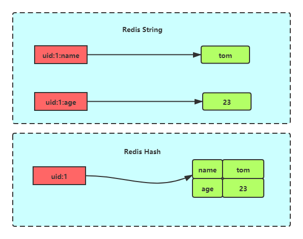
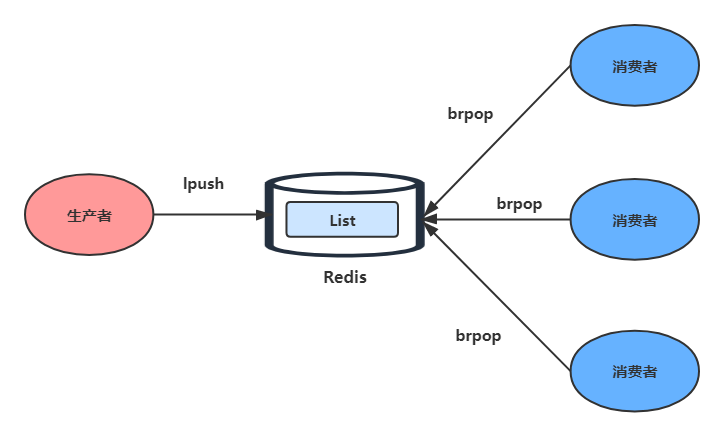
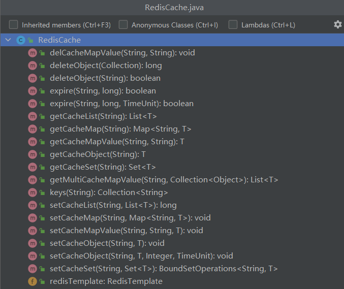
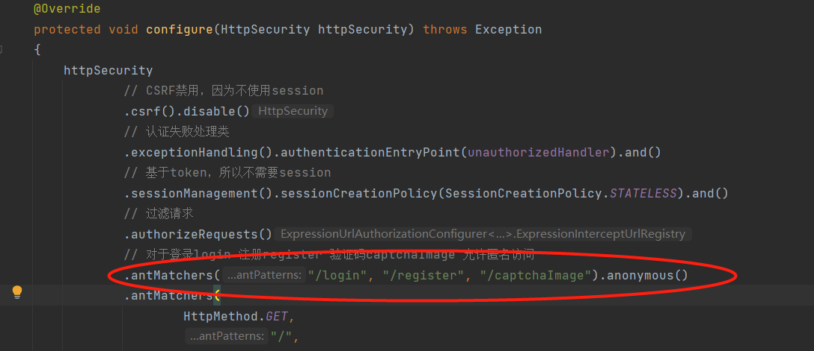

# redis相关知识


​	remote DIctionary Server(Redis) 是一个由 Salvatore Sanfilippo 写的 key-value 存储系统，是跨平台的非关系型数据库。

Redis 是一个开源的使用 ANSI C 语言编写、遵守 BSD 协议、支持网络、可基于内存、分布式、可选持久性的键值对(Key-Value)存储数据库，并提供多种语言的 API。

Redis 通常被称为数据结构服务器，因为值（value）可以是字符串(String)、哈希(Hash)、列表(list)、集合(sets)和有序集合(sorted sets)等类型。

- String: 字符串
- Hash: 散列
- List: 列表
- Set: 集合
- Sorted Set: 有序集合

## 链接redis

### 语法

```
$ redis-cli -h host -p port -a password
```

### 实例

以下实例演示了如何连接到主机为 127.0.0.1，端口为 6379 ，密码为 mypass 的 redis 服务上。

```
$redis-cli -h 127.0.0.1 -p 6379 -a "mypass"
redis 127.0.0.1:6379>
redis 127.0.0.1:6379> PING

PONG
```

## 进行redis操作


### 字符串操作

#### 语法

 Redis 键命令的基本语法如下：

```
redis 127.0.0.1:6379> COMMAND KEY_NAME
```

#### 实例

```
redis 127.0.0.1:6379> SET runoobkey redis
OK
redis 127.0.0.1:6379> DEL runoobkey
(integer) 1
```

#### 常见操作

| 序号 | 命令及描述                                                   |
| ---- | ------------------------------------------------------------ |
| 1    | [SET key value](https://www.runoob.com/redis/strings-set.html)  设置指定 key 的值。 |
| 2    | [GET key](https://www.runoob.com/redis/strings-get.html)  获取指定 key 的值。 |
| 3    | [GETRANGE key start end](https://www.runoob.com/redis/strings-getrange.html)  返回 key 中字符串值的子字符 |
| 4    | [GETSET key value](https://www.runoob.com/redis/strings-getset.html) 将给定 key 的值设为 value ，并返回 key 的旧值(old value)。 |
| 5    | [GETBIT key offset](https://www.runoob.com/redis/strings-getbit.html) 对 key 所储存的字符串值，获取指定偏移量上的位(bit)。 |
| 6    | [MGET key1 [key2..\]](https://www.runoob.com/redis/strings-mget.html) 获取所有(一个或多个)给定 key 的值。 |
| 7    | [SETBIT key offset value](https://www.runoob.com/redis/strings-setbit.html) 对 key 所储存的字符串值，设置或清除指定偏移量上的位(bit)。 |
| 8    | [SETEX key seconds value](https://www.runoob.com/redis/strings-setex.html) 将值 value 关联到 key ，并将 key 的过期时间设为 seconds (以秒为单位)。 |
| 9    | [SETNX key value](https://www.runoob.com/redis/strings-setnx.html) 只有在 key 不存在时设置 key 的值。 |
| 10   | [SETRANGE key offset value](https://www.runoob.com/redis/strings-setrange.html) 用 value 参数覆写给定 key 所储存的字符串值，从偏移量 offset 开始。 |
| 11   | [STRLEN key](https://www.runoob.com/redis/strings-strlen.html) 返回 key 所储存的字符串值的长度。 |
| 12   | [MSET key value [key value ...\]](https://www.runoob.com/redis/strings-mset.html) 同时设置一个或多个 key-value 对。 |
| 13   | [MSETNX key value [key value ...\]](https://www.runoob.com/redis/strings-msetnx.html)  同时设置一个或多个 key-value 对，当且仅当所有给定 key 都不存在。 |
| 14   | [PSETEX key milliseconds value](https://www.runoob.com/redis/strings-psetex.html) 这个命令和 SETEX 命令相似，但它以毫秒为单位设置 key 的生存时间，而不是像 SETEX 命令那样，以秒为单位。 |
| 15   | [INCR key](https://www.runoob.com/redis/strings-incr.html) 将 key 中储存的数字值增一。 |
| 16   | [INCRBY key increment](https://www.runoob.com/redis/strings-incrby.html) 将 key 所储存的值加上给定的增量值（increment） 。 |
| 17   | [INCRBYFLOAT key increment](https://www.runoob.com/redis/strings-incrbyfloat.html) 将 key 所储存的值加上给定的浮点增量值（increment） 。 |
| 18   | [DECR key](https://www.runoob.com/redis/strings-decr.html) 将 key 中储存的数字值减一。 |
| 19   | [DECRBY key decrement](https://www.runoob.com/redis/strings-decrby.html)  key 所储存的值减去给定的减量值（decrement） 。 |
| 20   | [APPEND key value](https://www.runoob.com/redis/strings-append.html) 如果 key 已经存在并且是一个字符串， APPEND 命令将指定的 value 追加到该 key 原来值（value）的末尾。 |


### Redis 哈希(Hash)

Redis hash 是一个 string 类型的 field（字段） 和 value（值） 的映射表，hash 特别适合用于存储对象。

Redis 中每个 hash 可以存储 232 - 1 键值对（40多亿）。缓存一些对象信息，如用户信息、商品信息、配置信息等。

我们以用户信息为例,它在关系型数据库中的结构是这样的

| uid  | name  | age  |
| ---- | ----- | ---- |
| 1    | Tom   | 15   |
| 2    | Jerry | 13   |

而使用Redis Hash存储其结构如下图:

.png)

相比较于使用Redis字符串存储，其有以下几个优缺点:

1. 原生字符串每个属性一个键。

   ```sql
   set user:1:name Tom
   set user:1:age 15
   ```

   优点：简单直观，每个属性都支持更新操作。
    缺点：占用过多的键，内存占用量较大，同时用户信息内聚性比较差，所以此种方案一般不会在生产环境使用。

2. 序列化字符串后，将用户信息序列化后用一个键保存

   ```sql
   set user:1 serialize(userInfo)
   ```

   优点：简化编程，如果合理的使用序列化可以提高内存的使用效率。
    缺点：序列化和反序列化有一定的开销，同时每次更新属性都需要把全部数据取出进行反序列化，更新后再序列化到Redis中。

3. 序列化字符串后，将用户信息序列化后用一个键保存

   ```sql
   hmset user:1 name Tom age 15 
   ```

   优点：简单直观，如果使用合理可以减少内存空间的使用。
    缺点：要控制哈希在ziplist和hashtable两种内部编码的转换，hashtable会消耗更多内存。

此外，我们曾经在做配置中心系统的时候，使用Hash来缓存每个应用的配置信息,其在数据库中的数据结构大致如下表

| AppId | SettingKey | SettingValue |
| ----- | ---------- | ------------ |
| 10001 | AppName    | myblog       |
| 10001 | Version    | 1.0          |
| 10002 | AppName    | admin site   |

在使用Redis Hash进行存储的时候

新增或更新一个配置项

```c
127.0.0.1:6379> HSET 10001 AppName myblog
(integer) 1
```

获取一个配置项

```c
127.0.0.1:6379> HGET 10001 AppName 
"myblog"
```

删除一个配置项

```c
Copy127.0.0.1:6379> HDEL 10001 AppName
(integer) 1
```

#### 实例

```
127.0.0.1:6379>  HMSET runoobkey name "redis tutorial" description "redis basic commands for caching" likes 20 visitors 23000
OK
127.0.0.1:6379>  HGETALL runoobkey
1) "name"
2) "redis tutorial"
3) "description"
4) "redis basic commands for caching"
5) "likes"
6) "20"
7) "visitors"
8) "23000"
```

在以上实例中，我们设置了 redis 的一些描述信息(name, description, likes, visitors) 到哈希表的 **runoobkey** 中。

------

#### Redis hash 命令

下表列出了 redis hash 基本的相关命令：

| 序号 | 命令及描述                                                   |
| ---- | ------------------------------------------------------------ |
| 1    | [HDEL key field1 [field2\]](https://www.runoob.com/redis/hashes-hdel.html)  删除一个或多个哈希表字段 |
| 2    | [HEXISTS key field](https://www.runoob.com/redis/hashes-hexists.html)  查看哈希表 key 中，指定的字段是否存在。 |
| 3    | [HGET key field](https://www.runoob.com/redis/hashes-hget.html)  获取存储在哈希表中指定字段的值。 |
| 4    | [HGETALL key](https://www.runoob.com/redis/hashes-hgetall.html)  获取在哈希表中指定 key 的所有字段和值 |
| 5    | [HINCRBY key field increment](https://www.runoob.com/redis/hashes-hincrby.html)  为哈希表 key 中的指定字段的整数值加上增量 increment 。 |
| 6    | [HINCRBYFLOAT key field increment](https://www.runoob.com/redis/hashes-hincrbyfloat.html)  为哈希表 key 中的指定字段的浮点数值加上增量 increment 。 |
| 7    | [HKEYS key](https://www.runoob.com/redis/hashes-hkeys.html)  获取所有哈希表中的字段 |
| 8    | [HLEN key](https://www.runoob.com/redis/hashes-hlen.html)  获取哈希表中字段的数量 |
| 9    | [HMGET key field1 [field2\]](https://www.runoob.com/redis/hashes-hmget.html)  获取所有给定字段的值 |
| 10   | [HMSET key field1 value1 [field2 value2 \]](https://www.runoob.com/redis/hashes-hmset.html)  同时将多个 field-value (域-值)对设置到哈希表 key 中。 |
| 11   | [HSET key field value](https://www.runoob.com/redis/hashes-hset.html)  将哈希表 key 中的字段 field 的值设为 value 。 |
| 12   | [HSETNX key field value](https://www.runoob.com/redis/hashes-hsetnx.html)  只有在字段 field 不存在时，设置哈希表字段的值。 |
| 13   | [HVALS key](https://www.runoob.com/redis/hashes-hvals.html)  获取哈希表中所有值。 |
| 14   | [HSCAN key cursor [MATCH pattern\] [COUNT count]](https://www.runoob.com/redis/hashes-hscan.html)  迭代哈希表中的键值对。 |

字符串操作和hash操作对比



### Redis 列表(List)

列表（list）类型是用来存储多个有序的字符串，列表中的每个字符串称为元素(element)，一个列表最多可以存储232-1次方个元素。在Redis中，可以对列表两端插入（push）和弹出（pop），还可以获取指定范围的元素列表、获取指定索引下标的元素等。列表是一种比较灵活的数据结构，它可以充当栈和队列的角色，在实际开发上有很多应用场景。


列表类型有两个特点：

1. 列表中的元素是有序的，这就意味着可以通过索引下标获取某个元素或者某个范围内的元素列表。
2. 列表中的元素可以是重复的

#### 实例

```
redis 127.0.0.1:6379> LPUSH runoobkey redis
(integer) 1
redis 127.0.0.1:6379> LPUSH runoobkey mongodb
(integer) 2
redis 127.0.0.1:6379> LPUSH runoobkey mysql
(integer) 3
redis 127.0.0.1:6379> LRANGE runoobkey 0 10

1) "mysql"
2) "mongodb"
3) "redis"
```

在以上实例中我们使用了 **LPUSH** 将三个值插入了名为 **runoobkey** 的列表当中。

#### Redis 列表命令

下表列出了列表相关的基本命令：

| 命令                                  | 说明                                                         | 时间复杂度 |
| ------------------------------------- | ------------------------------------------------------------ | ---------- |
| [BLPOP key key ...\] timeout          | 删除，并获得该列表中的第一元素，或阻塞，直到有一个可用       | O(1)       |
| [BRPOP key key ...\] timeout          | 删除，并获得该列表中的最后一个元素，或阻塞，直到有一个可用   | O(1)       |
| BRPOPLPUSH source destination timeout | 弹出一个列表的值，将它推到另一个列表，并返回它;或阻塞，直到有一个可用 | O(1)       |
| LINDEX key index                      | 获取一个元素，通过其索引列表                                 | O(N)       |
| LINSERT key BEFORE                    | AFTER pivot value在列表中的另一个元素之前或之后插入一个元素  | O(N)       |
| LLEN key                              | 获得队列(List)的长度                                         | O(1)       |
| LPOP key                              | 从队列的左边出队一个元素                                     | O(1)       |
| [LPUSH key value value ...\]          | 从队列的左边入队一个或多个元素                               | O(1)       |
| LPUSHX key value                      | 当队列存在时，从队到左边入队一个元素                         | O(1)       |
| LRANGE key start stop                 | 从列表中获取指定返回的元素                                   | O(S+N)     |
| LREM key count value                  | 从列表中删除元素                                             | O(N)       |
| LSET key index value                  | 设置队列里面一个元素的值                                     | O(N)       |
| LTRIM key start stop                  | 修剪到指定范围内的清单                                       | O(N)       |
| RPOP key                              | 从队列的右边出队一个元                                       | O(1)       |
| RPOPLPUSH source destination          | 删除列表中的最后一个元素，将其追加到另一个列表               | O(1)       |
| [RPUSH key value value ...\]          | 从队列的右边入队一个元素                                     | O(1)       |
| RPUSHX key value                      | 从队列的右边入队一个元素，仅队列存在时有效                   | O(1)       |

#### 使用场景1-消息队列

列表类型可以使用 rpush 实现先进先出的功能，同时又可以使用 lpop 轻松的弹出（查询并删除）第一个元素，所以列表类型可以用来实现消息队列



#### 使用场景2-文章(商品等)列表

我们以博客站点为例，当用户和文章都越来越多时，为了加快程序的响应速度，我们可以把用户自己的文章存入到 List 中，因为 List 是有序的结构，所以这样又可以完美的实现分页功能，从而加速了程序的响应速度。

1. 每篇文章我们使用**哈希**结构存储，例如每篇文章有3个属性title、timestamp、content

   ```c
   hmset acticle:1 title xx timestamp 1476536196 content xxxx
   ...
   hmset acticle:k title yy timestamp 1476512536 content yyyy
   ...
   ```

2. 向用户文章列表添加文章，user：{id}：articles作为用户文章列表的键：

   ```c
   lpush user:1:acticles article:1 article3
   ...
   lpush
   ...
   ```

3. 分页获取用户文章列表，例如下面伪代码获取用户id=1的前10篇文章

   ```c
   articles = lrange user:1:articles 0 9
   for article in {articles}
   {
   	hgetall {article}
   }
   ```

**注意:**使用列表类型保存和获取文章列表会存在两个问题。

- 如果每次分页获取的文章个数较多，需要执行多次hgetall操作，此时可以考虑使用Pipeline批量获取，或者考虑将文章数据序列化为字符串类型，使用mget批量获取。
- 分页获取文章列表时，lrange命令在列表两端性能较好，但是如果列表较大，获取列表中间范围的元素性能会变差，此时可以考虑将列表做二级拆分，或者使用Redis3.2的quicklist内部编码实现，它结合ziplist和linkedlist的特点，获取列表中间范围的元素时也可以高效完成。

关于列表的使用场景可参考以下几个命令组合：

- lpush+lpop=Stack（栈）

- lpush+rpop=Queue（队列）

- lpush+ltrim=Capped Collection（有限集合）

- lpush+brpop=Message Queue（消息队列）

  

### Redis 集合(Set)


集合类型和列表类型的区别如下：

- 列表可以存储重复元素，集合只能存储非重复元素；
- 列表是按照元素的先后顺序存储元素的，而集合则是无序方式存储元素的。

一个集合最多可以存储232-1次方个元素。Redis除了支持集合内的增删改查，同时还支持多个集合取交集、并集、差集，合理地使用好集合类型，能在实际开发中解决很多实际问题。


通过上文，我们可以知道集合的主要几个特性，无序、不可重复、支持并交差等操作。因此集合类型比较适合用来数据去重和保障数据的唯一性，还可以用来统计多个集合的交集、错集和并集等，当我们存储的数据是无序并且需要去重的情况下，比较适合使用集合类型进行存储。

#### 实例

```
redis 127.0.0.1:6379> SADD runoobkey redis
(integer) 1
redis 127.0.0.1:6379> SADD runoobkey mongodb
(integer) 1
redis 127.0.0.1:6379> SADD runoobkey mysql
(integer) 1
redis 127.0.0.1:6379> SADD runoobkey mysql
(integer) 0
redis 127.0.0.1:6379> SMEMBERS runoobkey

1) "mysql"
2) "mongodb"
3) "redis"
```

在以上实例中我们通过 **SADD** 命令向名为 **runoobkey** 的集合插入的三个元素。

------

#### Redis 集合命令

下表列出了 Redis 集合基本命令：

| 序号 | 命令及描述                                                   |
| ---- | ------------------------------------------------------------ |
| 1    | [SADD key member1 [member2\]](https://www.runoob.com/redis/sets-sadd.html)  向集合添加一个或多个成员 |
| 2    | [SCARD key](https://www.runoob.com/redis/sets-scard.html)  获取集合的成员数 |
| 3    | [SDIFF key1 [key2\]](https://www.runoob.com/redis/sets-sdiff.html)  返回第一个集合与其他集合之间的差异。 |
| 4    | [SDIFFSTORE destination key1 [key2\]](https://www.runoob.com/redis/sets-sdiffstore.html)  返回给定所有集合的差集并存储在 destination 中 |
| 5    | [SINTER key1 [key2\]](https://www.runoob.com/redis/sets-sinter.html)  返回给定所有集合的交集 |
| 6    | [SINTERSTORE destination key1 [key2\]](https://www.runoob.com/redis/sets-sinterstore.html)  返回给定所有集合的交集并存储在 destination 中 |
| 7    | [SISMEMBER key member](https://www.runoob.com/redis/sets-sismember.html)  判断 member 元素是否是集合 key 的成员 |
| 8    | [SMEMBERS key](https://www.runoob.com/redis/sets-smembers.html)  返回集合中的所有成员 |
| 9    | [SMOVE source destination member](https://www.runoob.com/redis/sets-smove.html)  将 member 元素从 source 集合移动到 destination 集合 |
| 10   | [SPOP key](https://www.runoob.com/redis/sets-spop.html)  移除并返回集合中的一个随机元素 |
| 11   | [SRANDMEMBER key [count\]](https://www.runoob.com/redis/sets-srandmember.html)  返回集合中一个或多个随机数 |
| 12   | [SREM key member1 [member2\]](https://www.runoob.com/redis/sets-srem.html)  移除集合中一个或多个成员 |
| 13   | [SUNION key1 [key2\]](https://www.runoob.com/redis/sets-sunion.html)  返回所有给定集合的并集 |
| 14   | [SUNIONSTORE destination key1 [key2\]](https://www.runoob.com/redis/sets-sunionstore.html)  所有给定集合的并集存储在 destination 集合中 |
| 15   | [SSCAN key cursor [MATCH pattern\] [COUNT count]](https://www.runoob.com/redis/sets-sscan.html)  迭代集合中的元素 |

#### 使用场景1- 标签系统

集合类型比较典型的使用场景是标签（tag）。

1. 给用户添加标签。

   ```c
   sadd user:1:tags tag1 tag2 tag5
   sadd user:2:tags tag2 tag3 tag5
   ...
   sadd user:k:tags tag1 tag2 tag4
   ...
   ```

2. 给标签添加用户

   ```c
   sadd tag1:users user:1 user:3
   sadd tag2:users user:1 user:2 user:3
   ...
   sadd tagk:users user:1 user:2
   ...
   ```

3. 使用sinter命令，可以来计算用户共同感兴趣的标签

   ```c
   sinter user:1:tags user:2:tags
   ```

这种标签系统在电商系统、社交系统、视频网站，图书网站，旅游网站等都有着广泛的应用。例如一个用户可能对娱乐、体育比较感兴趣，另一个用户可能对历史、新闻比较感兴趣，这些兴趣点就是标签。有了这些数据就可以得到喜欢同一个标签的人，以及用户的共同喜好的标签，这些数据对于用户体验以及增强用户黏度比较重要。例如一个社交系统可以根据用户的标签进行好友的推荐，已经用户感兴趣的新闻的推荐等，一个电子商务的网站会对不同标签的用户做不同类型的推荐，比如对数码产品比较感兴趣的人，在各个页面或者通过邮件的形式给他们推荐最新的数码产品，通常会为网站带来更多的利益。

## java调用redis

​	spring-data-redis是spring-data模块的一部分,专门用来支持在spring管理项目对redis的操作,使用java操作redis最常用的是使用jedis,但并不是只有jedis可以使用,像jdbc-redis、jredis也都属于redis的java客户端,他们之间是无法兼容的,如果你在一个项目中使用了jedis,然后后来决定弃用掉改用jdbc-redis就比较麻烦了,spring-data-redis提供了redis的java客户端的抽象,在开发中可以忽略掉切换具体的客户端所带来的影响,而且他本身就属于spring的一部分,比起单纯的使用jedis,更加稳定.管理起来更加自动化.

spring-data-redis的特性

- 自动管理连接池,提供了一个高度封装的RedisTemplate类
- 针对jedis客户端的大量api进行了归类封装,把同一类型的操作封装成了operation接口.支持redis中的五种数据类型的操作.
- 针对数据的"序列化与反序列化"]提供了多种可以选择的策略(RedisSerializer)
  - ​    JdkSerializationRedisserializer:当需要存储java对象时使用．
  - ​    stringRedisSerializer:当需要存储string类型的字符串时使用.
  - ​    JacksonJsonRedisSerializer:将对象序列化成json的格式存储在redis中,需要jackson-json工具的支持


### Jedis vs Lettuce

SpringBoot 1.5.x版本Redis客户端默认是Jedis实现的，SpringBoot 2.x版本中默认客户端是用Lettuce实现的，我们先来了解下Jedis和Lettuce客户端。

Jedis在实现上是直连Redis服务，多线程环境下非线程安全，除非使用连接池，为每个 RedisConnection 实例增加物理连接。

Lettuce是一种可伸缩，线程安全，完全非阻塞的Redis客户端，多个线程可以共享一个RedisConnection，它利用Netty NIO框架来高效地管理多个连接，从而提供了异步和同步数据访问方式，用于构建非阻塞的反应性应用程序。

### 加入redis依赖和相关配置

1：增加项目依赖

```xml
<!--redis依赖配置-->
<dependency>
    <groupId>org.springframework.boot</groupId>
    <artifactId>spring-boot-starter-data-redis</artifactId>
</dependency>
```


```yml
# redis 配置
redis:
  # 地址
  host: localhost
  # 端口，默认为6379
  port: 6379
  # 数据库索引
  database: 0
  # 密码
  password: root
  # 连接超时时间
  timeout: 10s
  lettuce:
    pool:
      # 连接池中的最小空闲连接
      min-idle: 0
      # 连接池中的最大空闲连接
      max-idle: 8
      # 连接池的最大数据库连接数
      max-active: 8
      # #连接池最大阻塞等待时间（使用负值表示没有限制）
      max-wait: -1ms
```

和redis相关的配置，主要是限流和序列化的相关配置。这里使用的是 FastJson2JsonRedisSerializer

```java
@Configuration
@EnableCaching
public class RedisConfig extends CachingConfigurerSupport
{
    @Bean
    @SuppressWarnings(value = { "unchecked", "rawtypes" })
    public RedisTemplate<Object, Object> redisTemplate(RedisConnectionFactory connectionFactory)
    {
        RedisTemplate<Object, Object> template = new RedisTemplate<>();
        template.setConnectionFactory(connectionFactory);

        FastJson2JsonRedisSerializer serializer = new FastJson2JsonRedisSerializer(Object.class);

        ObjectMapper mapper = new ObjectMapper();
        mapper.setVisibility(PropertyAccessor.ALL, JsonAutoDetect.Visibility.ANY);
        mapper.activateDefaultTyping(LaissezFaireSubTypeValidator.instance, ObjectMapper.DefaultTyping.NON_FINAL, JsonTypeInfo.As.PROPERTY);
        serializer.setObjectMapper(mapper);

        // 使用StringRedisSerializer来序列化和反序列化redis的key值
        template.setKeySerializer(new StringRedisSerializer());
        template.setValueSerializer(serializer);

        // Hash的key也采用StringRedisSerializer的序列化方式
        template.setHashKeySerializer(new StringRedisSerializer());
        template.setHashValueSerializer(serializer);

        template.afterPropertiesSet();
        return template;
    }

}
```

有了上面的配置，在程序中就可以自动生成一个RedisTemplate 对象。该对象可以进行和redis相关的几乎所有的操作。在我们的程序中，开发了一个RedisCache类，这个类通过对RedisTemplate  进行封装，进一步明确了相关的操作。相关方法如下



```java
@Component
public class RedisCache
{
    @Autowired
    public RedisTemplate redisTemplate;

    /**
     * 缓存基本的对象，Integer、String、实体类等
     *
     * @param key 缓存的键值
     * @param value 缓存的值
     */
    public <T> void setCacheObject(final String key, final T value)
    {
        redisTemplate.opsForValue().set(key, value);
    }
      /**
     * 缓存基本的对象，Integer、String、实体类等
     *
     * @param key 缓存的键值
     * @param value 缓存的值
     * @param timeout 时间
     * @param timeUnit 时间颗粒度
     */
    public <T> void setCacheObject(final String key, final T value, final Integer timeout, final TimeUnit timeUnit)
    {
        redisTemplate.opsForValue().set(key, value, timeout, timeUnit);
    }
     /**
     *其他方法
     */
    
}
```


## [RedisTemplate 操作API文档](https://docs.spring.io/spring-data/redis/docs/current/api/org/springframework/data/redis/core/RedisTemplate.html)

## 实际应用场景分析（验证码功能设计）

1：为什么需要验证码


登录验证码注意

- 图片从后台加载

  - 注意该路径不能是认证才能访问，而是需要配置成未登录就能访问的

    

- 验证码的生成策略

  - 生成一张图片，同时，将生成的验证结果存储

- 验证码的存储

  - 将结果保存在redis中

    

  - ```
    redisCache.setCacheObject(verifyKey, code, Constants.CAPTCHA_EXPIRATION, TimeUnit.MINUTES);
    ```

- 验证码的对比

  - 进行验证码对比，同时，删除redis中的验证码


## 实际应用场景分析（字典项的缓存）


```java
/**
 * 根据字典类型查询字典数据信息
 */
@GetMapping(value = "/type/{dictType}")
public AjaxResult dictType(@PathVariable String dictType)
{
    List<SysDictData> data = dictTypeService.selectDictDataByType(dictType);
    if (StringUtils.isNull(data))
    {
        data = new ArrayList<SysDictData>();
    }
    return AjaxResult.success(data);
}
```


```
/**
 * 根据字典类型查询字典数据
 * 
 * @param dictType 字典类型
 * @return 字典数据集合信息
 */
@Override
public List<SysDictData> selectDictDataByType(String dictType)
{
    List<SysDictData> dictDatas = DictUtils.getDictCache(dictType);
    if (StringUtils.isNotEmpty(dictDatas))
    {
        return dictDatas;
    }
    dictDatas = dictDataMapper.selectDictDataByType(dictType);
    if (StringUtils.isNotEmpty(dictDatas))
    {
        DictUtils.setDictCache(dictType, dictDatas);
        return dictDatas;
    }
    return null;
}
```


```
/**
 * 获取字典缓存
 * 
 * @param key 参数键
 * @return dictDatas 字典数据列表
 */
public static List<SysDictData> getDictCache(String key)
{
    Object cacheObj = SpringUtils.getBean(RedisCache.class).getCacheObject(getCacheKey(key));
    if (StringUtils.isNotNull(cacheObj))
    {
        return StringUtils.cast(cacheObj);
    }
    return null;
}
```


## 问题思考？？什么样的数据适合放到缓存里？？？

1：微博浏览量（实时性不敏感，数据丢失不敏感）

2：字典类的数据（非常稳定，极少发生变化，并且经常使用）

3：验证码（使用的时间非常短，2分钟就失效）

4：用户的session信息可以放到redis（主要是做集群来用的）