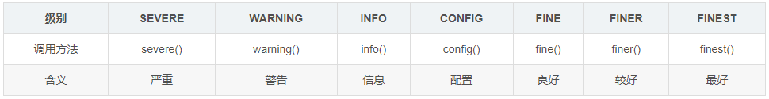
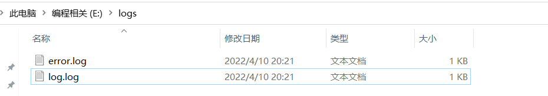
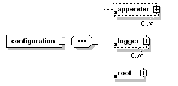
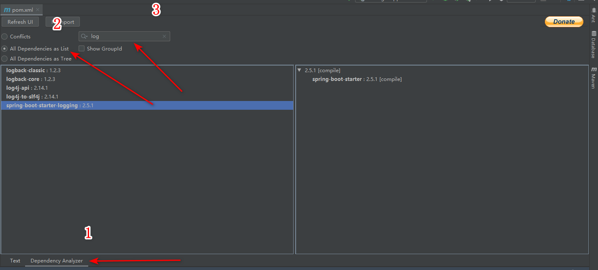
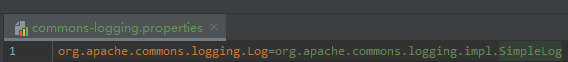
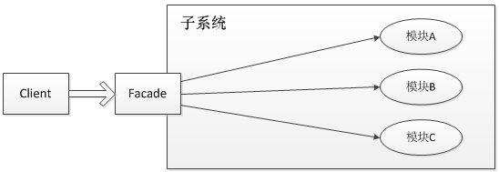
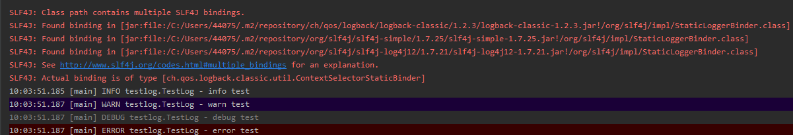
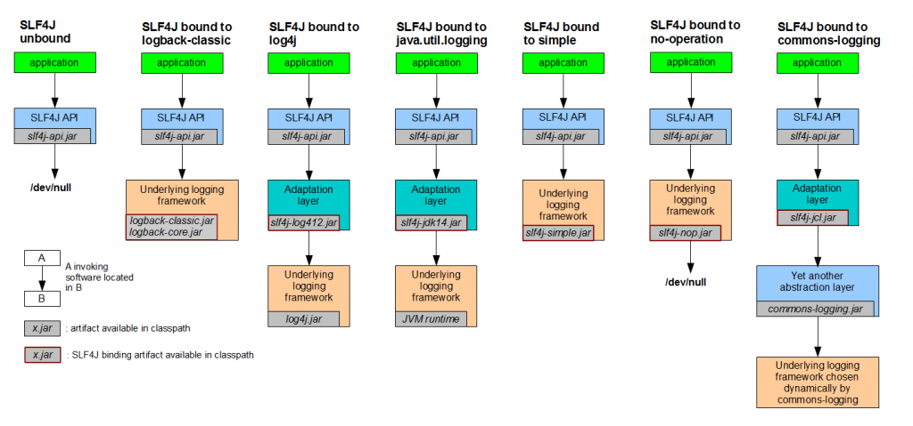

# javaweb开发中的日志


## 一、JDK日志（java.util.logging=jul）

从jdk1.4起，JDK开始自带一套日志系统。JDK Logger最大的优点就是不需要任何类库的支持，只要有Java的运行环境就可以使用。相对于其他的日志框架，JDK自带的日志可谓是鸡肋，无论易用性，功能还是扩展性都要稍逊一筹，所以在商业系统中很少直接使用。

JDK默认的logging配置文件为：$JAVA_HOME/jre/lib/logging.properties，可以使用系统属性java.util.logging.config.file指定相应的配置文件对默认的配置文件进行覆盖，比如， java -Djava.util.logging.config.file=myfile

JDK Logging把日志分为如下七个级别，等级依次降低。



如果将级别设置为INFO，则INFO后面的不会输出。info前面的全部输出。通过控制级别达到控制输出的目的。

    import java.util.logging.Level;
    import java.util.logging.Logger;
     
    public class LogJDKTest {
           private static Logger log = Logger.getLogger(LogJDKTest.class.toString());
     
           public static void main(String[] args) {
                  // all→finest→finer→fine→config→info→warning→server→off
                  // 级别依次升高，后面的日志级别会屏蔽之前的级别
                  log.setLevel(Level.INFO);
                  log.finest("finest");
                  log.finer("finer");
                  log.fine("fine");
                  log.config("config");
                  log.info("info");
                  log.warning("warning");
                  log.severe("server");
           }
    }

 控制台输出：

    六月 23, 2021 11:07:29 上午 com.test.log.LogJDKTest main
    信息: info
    六月 23, 2021 11:07:29 上午 com.test.log.LogJDKTest main
    警告: warning
    六月 23, 2021 11:07:29 上午 com.test.log.LogJDKTest main
    严重: server

1.JDK log默认会有一个控制台输出，它有两个参数，第一个参数设置输出级别，第二个参数设置输出的字符串。

2.同时也可以设置多个输出（Hander），每个输出设置不用的level，然后通过addHandler添加到了log中。

注意：为log设置级别与为每个handler设置级别的意义是不同的。

    import java.util.logging.ConsoleHandler;
    import java.util.logging.Handler;
    import java.util.logging.Level;
    import java.util.logging.Logger;
     
    public class LogJDKTest {
        public static Logger log = Logger.getLogger(LogJDKTest.class.toString());
        static {
            Handler console = new ConsoleHandler();
            console.setLevel(Level.SEVERE);
            log.addHandler(console);
            Handler console2 = new ConsoleHandler();
            console2.setLevel(Level.INFO);
            log.addHandler(console2);
        }
        public static void main(String[] args) {
            // all→finest→finer→fine→config→info→warning→server→off
            // 级别依次升高，后面的日志级别会屏蔽之前的级别
            log.setLevel(Level.INFO);
            log.finest("finest");
            log.finer("finer");
            log.fine("fine");
            log.config("config");
            log.info("info");
            log.warning("warning");
            log.severe("server");
        }
    }

控制台输出：

    六月 23, 2021 11:09:03 上午 com.middleware.test.log.LogJDKTest main
    信息: info
    六月 23, 2021 11:09:03 上午 com.middleware.test.log.LogJDKTest main
    警告: warning
    六月 23, 2021 11:09:03 上午 com.middleware.test.log.LogJDKTest main
    严重: server
    六月 23, 2021 11:09:03 上午 com.middleware.test.log.LogJDKTest main
    严重: server

all，则所有的信息都会被输出，如果设为off，则所有的信息都不会输出。

## 二、log4j1

Apache的一个开放源代码项目，通过使用Log4j，我们可以控制日志信息输送的目的地是控制台、文件、GUI组件、甚至是套接口服务 器、NT的事件记录器、UNIX Syslog守护进程等；用户也可以控制每一条日志的输出格式；通过定义每一条日志信息的级别，用户能够更加细致地控制日志的生成过程。这些可以通过一个 配置文件来灵活地进行配置，而不需要修改程序代码。

导入maven

### 简单应用案例

```xml
<dependency>
    <groupId>log4j</groupId>
    <artifactId>log4j</artifactId>
    <version>1.2.17</version>
</dependency>
```

在resources同级创建并设置log4j.properties

```properties
### 设置###
log4j.rootLogger = debug,stdout,D,E
 
### 输出信息到控制抬 ###
log4j.appender.stdout = org.apache.log4j.ConsoleAppender
log4j.appender.stdout.Target = System.out
log4j.appender.stdout.layout = org.apache.log4j.PatternLayout
log4j.appender.stdout.layout.ConversionPattern = [%-5p] %d{yyyy-MM-dd HH:mm:ss,SSS} method:%l%n%m%n
 
### 输出DEBUG 级别以上的日志到=E://logs/error.log ###
log4j.appender.D = org.apache.log4j.DailyRollingFileAppender
log4j.appender.D.File = E://logs/log.log
log4j.appender.D.Append = true
log4j.appender.D.Threshold = DEBUG
log4j.appender.D.layout = org.apache.log4j.PatternLayout
log4j.appender.D.layout.ConversionPattern = %-d{yyyy-MM-dd HH:mm:ss}  [ %t:%r ] - [ %p ]  %m%n
 
### 输出ERROR 级别以上的日志到=E://logs/error.log ###
log4j.appender.E = org.apache.log4j.DailyRollingFileAppender
log4j.appender.E.File =E://logs/error.log
log4j.appender.E.Append = true
log4j.appender.E.Threshold = ERROR
log4j.appender.E.layout = org.apache.log4j.PatternLayout
log4j.appender.E.layout.ConversionPattern = %-d{yyyy-MM-dd HH:mm:ss}  [ %t:%r ] - [ %p ]  %m%n
```

设置日志内容

```java
import org.apache.log4j.Logger;
 
public class TestLog4j {
    private static Logger logger = Logger.getLogger(TestLog4j.class);
 
    public static void main(String[] args) {
        // 记录debug级别的信息
        logger.debug("This is debug message.");
        // 记录info级别的信息
        logger.info("This is info message.");
        // 记录error级别的信息
        logger.error("This is error message.");
    }
}
```

输出结果

首先是控制台的信息

```
[DEBUG] 2022-04-10 20:21:09,615 method:com.jlai.log.Log4jTest.main(Log4jTest.java:10)
This is debug message.
[INFO ] 2022-04-10 20:21:09,625 method:com.jlai.log.Log4jTest.main(Log4jTest.java:12)
This is info message.
[ERROR] 2022-04-10 20:21:09,625 method:com.jlai.log.Log4jTest.main(Log4jTest.java:14)
This is error message.
```

再来看输出的文件



内容如下，发现已按照要求输出到对应的文档中去了。

```
2022-04-10 20:21:09  [ main:0 ] - [ DEBUG ]  This is debug message.
2022-04-10 20:21:09  [ main:10 ] - [ INFO ]  This is info message.
2022-04-10 20:21:09  [ main:10 ] - [ ERROR ]  This is error message.
```


### 日志设置

Log4j由三个重要的组件构成：日志信息的优先级，日志信息的输出目的地，日志信息的输出格式。日志信息的优先级从高到低有ERROR、WARN、  INFO、DEBUG，分别用来指定这条日志信息的重要程度；日志信息的输出目的地指定了日志将打印到控制台还是文件中；而输出格式则控制了日志信息的显 示内容。

Log4J配置文件的基本格式如下：

 \#配置根Logger

log4j.rootLogger =  [ level ]  , appenderName1 , appenderName2 , …

\#配置日志信息输出目的地Appender

log4j.appender.appenderName = fully.qualified.name.of.appender.class 

　　log4j.appender.appenderName.option1 = value1 

　　… 

　　log4j.appender.appenderName.optionN = valueN 

\#配置日志信息的格式（布局）

log4j.appender.appenderName.layout = fully.qualified.name.of.layout.class 

　　log4j.appender.appenderName.layout.option1 = value1 

　　… 

　　log4j.appender.appenderName.layout.optionN = valueN 


其中 [level] 是日志输出级别，共有5级：

 FATAL   0 

ERROR   3 

WARN    4 

INFO    6 

DEBUG   7 

**Appender 为日志输出目的地，Log4j提供的appender有以下几种：**

 org.apache.log4j.ConsoleAppender（控制台），

org.apache.log4j.FileAppender（文件），

org.apache.log4j.DailyRollingFileAppender（每天产生一个日志文件），

org.apache.log4j.RollingFileAppender（文件大小到达指定尺寸的时候产生一个新的文件），

org.apache.log4j.WriterAppender（将日志信息以流格式发送到任意指定的地方）


**Layout：日志输出格式，Log4j提供的layout有以下几种：**

 org.apache.log4j.HTMLLayout（以HTML表格形式布局），

org.apache.log4j.PatternLayout（可以灵活地指定布局模式），

org.apache.log4j.SimpleLayout（包含日志信息的级别和信息字符串），

org.apache.log4j.TTCCLayout（包含日志产生的时间、线程、类别等等信息）

**打印参数: Log4J采用类似C语言中的printf函数的打印格式格式化日志信息，如下:**

 　	%m  输出代码中指定的消息

　　%p  输出优先级，即DEBUG，INFO，WARN，ERROR，FATAL 

　　%r  输出自应用启动到输出该log信息耗费的毫秒数 

　　%c  输出所属的类目，通常就是所在类的全名 

　　%t  输出产生该日志事件的线程名 

　　%n  输出一个回车换行符，Windows平台为“\r\n”，Unix平台为“\n” 

　　%d  输出日志时间点的日期或时间，默认格式为ISO8601，也可以在其后指定格式，比如：%d{yyy MMM dd HH:mm:ss , SSS}，输出类似：2002年10月18日 22 ： 10 ： 28 ， 921 

　　%l  输出日志事件的发生位置，包括类目名、发生的线程，以及在代码中的行数。举例：Testlog4.main(TestLog4.java: 10 ) 


##  三、log4j2

导入maven包

```xml
              <dependency>
                     <groupId>org.apache.logging.log4j</groupId>
                     <artifactId>log4j-api</artifactId>
                     <version>2.14.1</version>
              </dependency>
 
              <dependency>
                     <groupId>org.apache.logging.log4j</groupId>
                     <artifactId>log4j-core</artifactId>
                     <version>2.14.1</version>
              </dependency>
```

 测试代码

```java
import org.apache.logging.log4j.LogManager;
import org.apache.logging.log4j.Logger;
 
public class LoggerTest {
 
    public static void main(String argv[]) {
        Logger logger = LogManager.getLogger(LogManager.ROOT_LOGGER_NAME);
 
        logger.trace("trace level");
        logger.debug("debug level");
        logger.info("info level");
        logger.warn("warn level");
        logger.error("error level");
        logger.fatal("fatal level");
 
        logger.error("字符串拼接一：{},记录main执行：","logger");
        logger.error("字符串拼接二：","logger");
 
    }
}
```

配置文件

```xml
<?xml version="1.0" encoding="UTF-8"?>
<configuration status="OFF">
  <appenders>
    <Console name="Console" target="SYSTEM_OUT">
      <PatternLayout pattern="%d{HH:mm:ss.SSS} [%t] %-5level %logger{36} - %msg%n"/>
    </Console>
  </appenders>
  <loggers>
    <root level="trace">
      <appender-ref ref="Console"/>
    </root>
  </loggers>
</configuration>
```


### 版本1和版本2的区别

- log4j1中类的包名都是以 ***org.apache.log4j*** 开头；log4j2中，log4j-api中的类包名以 ***org.apache.logging.log4j\*** 开头，log4j-core中的类包名以 ***org.apache.logging.log4j.core\*** 开头。
- log4j1是通过一个.properties的文件作为主配置文件的 ，log4j2则已经弃用了.properties方式，采用的是.xml，.json或者.jsn这种方式来做


## 四、logback

Logback是由log4j创始人设计的又一个开源日记组件。logback当前分成三个模块：logback-core,logback- classic和logback-access。logback-core是其它两个模块的基础模块。logback-classic是log4j的一个 改良版本。此外logback-classic完整实现SLF4J API使你可以很方便地更换成其它日记系统如log4j或JDK14 Logging。logback-access访问模块与Servlet容器集成提供通过Http来访问日记的功能。

### 4.1、logback的介绍

Logback是由log4j创始人设计的另一个开源日志组件,官方网站： Logback Home。它当前分为下面下个模块：

     logback-core：其它两个模块的基础模块
     logback-classic：它是log4j的一个改良版本，同时它完整实现了slf4j API使你可以很方便地更换成其它日志如log4j或JDK logging
     logback-access：访问模块与Servlet容器集成提供通过Http来访问日志的功能

### 4.2、logback取代log4j的理由：

1、更快的实现：Logback的内核重写了，在一些关键执行路径上性能提升10倍以上。而且logback不仅性能提升了，初始化内存加载也更小了。

2、非常充分的测试：Logback经过了几年，数不清小时的测试。Logback的测试完全不同级别的。

3、Logback-classic非常自然实现了SLF4j：Logback-classic实现了SLF4j。在使用SLF4j中，你都感觉不到logback-classic。而且因为logback-classic非常自然地实现了slf4j ， 所 以切换到log4j或者其他，非常容易，只需要提供成另一个jar包就OK，根本不需要去动那些通过SLF4JAPI实现的代码。

4、非常充分的文档 官方网站有两百多页的文档。

5、自动重新加载配置文件，当配置文件修改了，Logback-classic能自动重新加载配置文件。扫描过程快且安全，它并不需要另外创建一个扫描线程。这个技术充分保证了应用程序能跑得很欢在JEE环境里面。

6、Lilith是log事件的观察者，和log4j的chainsaw类似。而lilith还能处理大数量的log数据 。

7、谨慎的模式和非常友好的恢复，在谨慎模式下，多个FileAppender实例跑在多个JVM下，能 够安全地写道同一个日志文件。RollingFileAppender会有些限制。Logback的FileAppender和它的子类包括 RollingFileAppender能够非常友好地从I/O异常中恢复。

8、配置文件可以处理不同的情况，开发人员经常需要判断不同的Logback配置文件在不同的环境下（开发，测试，生产）。而这些配置文件仅仅只有一些很小的不同，可以通过,和来实现，这样一个配置文件就可以适应多个环境。

9、Filters（过滤器）有些时候，需要诊断一个问题，需要打出日志。在log4j，只有降低日志级别，不过这样会打出大量的日志，会影响应用性能。在Logback，你可以继续 保持那个日志级别而除掉某种特殊情况，如alice这个用户登录，她的日志将打在DEBUG级别而其他用户可以继续打在WARN级别。要实现这个功能只需加4行XML配置。可以参考MDCFIlter 。

10、SiftingAppender（一个非常多功能的Appender）：它可以用来分割日志文件根据任何一个给定的运行参数。如，SiftingAppender能够区别日志事件跟进用户的Session，然后每个用户会有一个日志文件。

11、自动压缩已经打出来的log：RollingFileAppender在产生新文件的时候，会自动压缩已经打出来的日志文件。压缩是个异步过程，所以甚至对于大的日志文件，在压缩过程中应用不会受任何影响。

12、堆栈树带有包版本：Logback在打出堆栈树日志时，会带上包的数据。

13、自动去除旧的日志文件：通过设置TimeBasedRollingPolicy或者SizeAndTimeBasedFNATP的maxHistory属性，你可以控制已经产生日志文件的最大数量。如果设置maxHistory 12，那那些log文件超过12个月的都会被自动移除。

### 4.3、logback的配置介绍

-  Logger、appender及layout

Logger作为日志的记录器，把它关联到应用的对应的context上后，主要用于存放日志对象，也可以定义日志类型、级别。

　　Appender主要用于指定日志输出的目的地，目的地可以是控制台、文件、远程套接字服务器、 MySQL、PostreSQL、 Oracle和其他数据库、 JMS和远程UNIX Syslog守护进程等。

　　Layout 负责把事件转换成字符串，格式化的日志信息的输出。

- logger context

各个logger 都被关联到一个 LoggerContext，LoggerContext负责制造logger，也负责以树结构排列各logger。其他所有logger也通过org.slf4j.LoggerFactory 类的静态方法getLogger取得。 getLogger方法以 logger名称为参数。用同一名字调用LoggerFactory.getLogger 方法所得到的永远都是同一个logger对象的引用。

- 有效级别及级别的继承

Logger 可以被分配级别。级别包括：TRACE、DEBUG、INFO、WARN 和 ERROR，定义于ch.qos.logback.classic.Level类。如果 logger没有被分配级别，那么它将从有被分配级别的最近的祖先那里继承级别。root logger 默认级别是 DEBUG。

- 打印方法与基本的选择规则

打印方法决定记录请求的级别。例如，如果 L 是一个 logger 实例，那么，语句 L.info("..")是一条级别为 INFO的记录语句。记录请求的级别在高于或等于其 logger 的有效级别时被称为被启用，否则，称为被禁用。记录请求级别为 p，其 logger的有效级别为 q，只有则当 p>=q时，该请求才会被执行。

该规则是 logback 的核心。级别排序为： TRACE < DEBUG < INFO < WARN < ERROR

### 4.4、logback的默认配置

如果配置文件 logback-test.xml 和 logback.xml 都不存在，那么 logback 默认地会调用BasicConfigurator ，创建一个最小化配置。最小化配置由一个关联到根 logger 的ConsoleAppender 组成。输出用模式为%d{HH:mm:ss.SSS} [%thread] %-5level %logger{36} - %msg%n 的 PatternLayoutEncoder 进行格式化。root logger 默认级别是 DEBUG。

-  Logback的配置文件

Logback 配置文件的语法非常灵活。正因为灵活，所以无法用 DTD 或 XML schema 进行定义。尽管如此，可以这样描述配置文件的基本结构：以\<configuration>开头，后面有零个或多个\<appender>元素，有零个或多个\<logger>元素，有最多一个\<root>元素。

-   Logback默认配置的步骤

1、尝试在 classpath下查找文件logback-test.xml；

2、如果文件不存在，则查找文件logback.xml；

3、如果两个文件都不存在，logback用BasicConfigurator自动对自己进行配置，这会导致记录输出到控制台。

### 4.5、logback.xml常用配置详解



(1) 根节点<configuration>，包含下面三个属性：

scan: 当此属性设置为true时，配置文件如果发生改变，将会被重新加载，默认值为true。

scanPeriod: 设置监测配置文件是否有修改的时间间隔，如果没有给出时间单位，默认单位是毫秒。当scan为true时，此属性生效。默认的时间间隔为1分钟。

debug: 当此属性设置为true时，将打印出logback内部日志信息，实时查看logback运行状态。默认值为false。

例如：

    <configuration scan="true" scanPeriod="60 seconds" debug="false">
    　　  <!--其他配置省略-->
    </configuration>　

(2) 子节点<contextName>：用来设置上下文名称，每个logger都关联到logger上下文，默认上下文名称为default。但可以使用<contextName>设置成其他名字，用于区分不同应用程序的记录。一旦设置，不能修改。

例如：

    <configuration scan="true" scanPeriod="60 seconds" debug="false">
         <contextName>myAppName</contextName>
    　　  <!--其他配置省略-->
    </configuration> 

子节点<property> ：用来定义变量值，它有两个属性name和value，通过<property>定义的值会被插入到logger上下文中，可以使“${}”来使用变量。

name: 变量的名称

value: 的值时变量定义的值

例如：

    <configuration scan="true" scanPeriod="60 seconds" debug="false">
    　　　<property name="APP_Name" value="myAppName" />
    　　　<contextName>${APP_Name}</contextName>
    　　　<!--其他配置省略-->
    </configuration>

子节点<timestamp>：获取时间戳字符串，他有两个属性key和datePattern

key: 标识此<timestamp> 的名字；

datePattern: 设置将当前时间（解析配置文件的时间）转换为字符串的模式，遵循java.txt.SimpleDateFormat的格式。

例如：

    <configuration scan="true" scanPeriod="60 seconds" debug="false">
    　　　　　　<timestamp key="bySecond" datePattern="yyyyMMdd'T'HHmmss"/>
    　　　　　　<contextName>${bySecond}</contextName>
    　　　　　　<!-- 其他配置省略-->
    　　　　</configuration>

(5) 子节点<appender>：负责写日志的组件，它有两个必要属性name和class。name指定appender名称，class指定appender的全限定名

#### 4.5.1、ConsoleAppender 

把日志输出到控制台，有以下子节点：

<encoder>：对日志进行格式化。（具体参数稍后讲解 ）

<target>：字符串System.out(默认)或者System.err（区别不多说了）

例如：

```xml
<configuration>
　　　<appender name="STDOUT" class="ch.qos.logback.core.ConsoleAppender">
　　　　　 <encoder>
　　　　　　　　　<pattern>%-4relative [%thread] %-5level %logger{35} - %msg %n</pattern>
　　　　　 </encoder>
　　　</appender>
 
　　　<root level="DEBUG">
　　　　　　<appender-ref ref="STDOUT" />
　　　</root>
</configuration>
```

>=DEBUG级别的日志都输出到控制台
>
>

#### 4.5.2、FileAppender：

把日志添加到文件，有以下子节点：

<file>：被写入的文件名，可以是相对目录，也可以是绝对目录，如果上级目录不存在会自动创建，没有默认值。

<append>：如果是 true，日志被追加到文件结尾，如果是 false，清空现存文件，默认是true。

<encoder>：对记录事件进行格式化。（具体参数稍后讲解 ）

<prudent>：如果是 true，日志会被安全的写入文件，即使其他的FileAppender也在向此文件做写入操作，效率低，默认是 false。

例如：

```xml
<configuration>
　　　　　　<appender name="FILE" class="ch.qos.logback.core.FileAppender">
　　　　　　　　<file>testFile.log</file>
　　　　　　　　<append>true</append>
　　　　　　　　<encoder>
　　　　　　　　　　<pattern>%-4relative [%thread] %-5level %logger{35} - %msg%n</pattern>
　　　　　　　　</encoder>
　　　　　　</appender>
 
　　　　　　<root level="DEBUG">
　　　　　　<appender-ref ref="FILE" />
　　　　　　</root>
　　　　</configuration>
```

上述配置表示把>=DEBUG级别的日志都输出到testFile.log

#### 4.5.3、RollingFileAppender：

滚动记录文件，先将日志记录到指定文件，当符合某个条件时，将日志记录到其他文件。有以下子节点：

<file>：被写入的文件名，可以是相对目录，也可以是绝对目录，如果上级目录不存在会自动创建，没有默认值。

<append>：如果是 true，日志被追加到文件结尾，如果是 false，清空现存文件，默认是true。

<rollingPolicy>:当发生滚动时，决定RollingFileAppender的行为，涉及文件移动和重命名。属性class定义具体的滚动策略类class="ch.qos.logback.core.rolling.TimeBasedRollingPolicy"： 最常用的滚动策略，它根据时间来制定滚动策略，既负责滚动也负责出发滚动。有以下子节点：

<fileNamePattern>：必要节点，包含文件名及“%d”转换符，“%d”可以包含一个java.text.SimpleDateFormat指定的时间格式，如：%d{yyyy-MM}。

如果直接使用 %d，默认格式是 yyyy-MM-dd。RollingFileAppender的file字节点可有可无，通过设置file，可以为活动文件和归档文件指定不同位置，当前日志总是记录到file指定的文件（活动文件），活动文件的名字不会改变；

如果没设置file，活动文件的名字会根据fileNamePattern 的值，每隔一段时间改变一次。“/”或者“\”会被当做目录分隔符

<maxHistory>:

可选节点，控制保留的归档文件的最大数量，超出数量就删除旧文件。假设设置每个月滚动，且<maxHistory>是6，则只保存最近6个月的文件，删除之前的旧文件。注意，删除旧文件是，那些为了归档而创建的目录也会被删除。

class="ch.qos.logback.core.rolling.SizeBasedTriggeringPolicy"： 查看当前活动文件的大小，如果超过指定大小会告知RollingFileAppender 触发当前活动文件滚动。只有一个节点:

<maxFileSize>:这是活动文件的大小，默认值是10MB。

<prudent>：当为true时，不支持FixedWindowRollingPolicy。支持TimeBasedRollingPolicy，但是有两个限制，1不支持也不允许文件压缩，2不能设置file属性，必须留空。

<triggeringPolicy >: 告知 RollingFileAppender 合适激活滚动。

class="ch.qos.logback.core.rolling.FixedWindowRollingPolicy" 根据固定窗口算法重命名文件的滚动策略。有以下子节点：

<minIndex>:窗口索引最小值

<maxIndex>:窗口索引最大值，当用户指定的窗口过大时，会自动将窗口设置为12。

<fileNamePattern>:必须包含“%i”例如，假设最小值和最大值分别为1和2，命名模式为 mylog%i.log,会产生归档文件mylog1.log和mylog2.log。还可以指定文件压缩选项，例如，mylog%i.log.gz 或者 没有log%i.log.zip

例如：

```xml
<configuration>
　　　　　　　　　　<appender name="FILE" class="ch.qos.logback.core.rolling.RollingFileAppender">
　　　　　　　　　　　　<rollingPolicy class="ch.qos.logback.core.rolling.TimeBasedRollingPolicy">
　　　　　　　　　　　　　　<fileNamePattern>logFile.%d{yyyy-MM-dd}.log</fileNamePattern>
　　　　　　　　　　　　　　<maxHistory>30</maxHistory>
　　　　　　　　　　　　</rollingPolicy>
　　　　　　　　　　　　<encoder>
　　　　　　　　　　　　　　<pattern>%-4relative [%thread] %-5level %logger{35} - %msg%n</pattern>
　　　　　　　　　　　　</encoder>
　　　　　　　　　　</appender>
 
　　　　　　　　　　<root level="DEBUG">
　　　　　　　　　　　　<appender-ref ref="FILE" />
　　　　　　　　　　</root>
　　　　　　　　</configuration>
```

备注：上述配置表示每天生成一个日志文件，保存30天的日志文件。

```xml
<configuration>
　　　　　　　　　　<appender name="FILE" class="ch.qos.logback.core.rolling.RollingFileAppender">
　　　　　　　　　　　　<file>test.log</file>
 
　　　　　　　　　　　　<rollingPolicy class="ch.qos.logback.core.rolling.FixedWindowRollingPolicy">
　　　　　　　　　　　　　　<fileNamePattern>tests.%i.log.zip</fileNamePattern>
　　　　　　　　　　　　　　<minIndex>1</minIndex>
　　　　　　　　　　　　　　<maxIndex>3</maxIndex>
　　　　　　　　　　　　</rollingPolicy>
 
　　　　　　　　　　　　<triggeringPolicy class="ch.qos.logback.core.rolling.SizeBasedTriggeringPolicy">
　　　　　　　　　　　　　　<maxFileSize>5MB</maxFileSize>
　　　　　　　　　　　　</triggeringPolicy>
　　　　　　　　　　　　<encoder>
　　　　　　　　　　　　　　<pattern>%-4relative [%thread] %-5level %logger{35} - %msg%n</pattern>
　　　　　　　　　　　　</encoder>
　　　　　　　　　　</appender>
 
　　　　　　　　　　<root level="DEBUG">
　　　　　　　　　　　　<appender-ref ref="FILE" />
　　　　　　　　　　</root>
　　　　　　　　</configuration>
```

于5MB时，生成新的日志文件。窗口大小是1到3，当保存了3个归档文件后，将覆盖最早的日志。

<encoder>：对记录事件进行格式化。负责两件事，一是把日志信息转换成字节数组，二是把字节数组写入到输出流。

PatternLayoutEncoder 是唯一有用的且默认的encoder ，有一个<pattern>节点，用来设置日志的输入格式。使用“%”加“转换符”方式，如果要输出“%”，则必须用“\”对“\%”进行转义。

#### 4.5.4、其他

还有SocketAppender、SMTPAppender、DBAppender、SyslogAppender、SiftingAppender，并不常用，这里就不详解了。

大家可以参考官方文档（Documentation），还可以编写自己的Appender。

#### 4.5.5子节点\<loger>：

用来设置某一个包或具体的某一个类的日志打印级别、以及指定<appender>。<loger>仅有一个name属性，一个可选的level和一个可选的addtivity属性。

可以包含零个或多个<appender-ref>元素，标识这个appender将会添加到这个loger

name: 用来指定受此loger约束的某一个包或者具体的某一个类。

level: 用来设置打印级别，大小写无关：TRACE, DEBUG, INFO, WARN, ERROR, ALL和OFF，还有一个特俗值INHERITED或者同义词NULL，代表强制执行上级的级别。 如果未设置此属性，那么当前loger将会继承上级的级别。

addtivity: 是否向上级loger传递打印信息。默认是true。同<loger>一样，可以包含零个或多个<appender-ref>元素，标识这个appender将会添加到这个loger。

#### 4.5.6子节点\<root>:

它也是<loger>元素，但是它是根loger,是所有<loger>的上级。只有一个level属性，因为name已经被命名为"root",且已经是最上级了。

level: 用来设置打印级别，大小写无关：TRACE, DEBUG, INFO, WARN, ERROR, ALL和OFF，不能设置为INHERITED或者同义词NULL。 默认是DEBUG。

### 4.6、常用logger配置

```xml
<!-- show parameters for hibernate sql 专为 Hibernate 定制 -->
<logger name="org.hibernate.type.descriptor.sql.BasicBinder" level="TRACE" />
<logger name="org.hibernate.type.descriptor.sql.BasicExtractor" level="DEBUG" />
<logger name="org.hibernate.SQL" level="DEBUG" />
<logger name="org.hibernate.engine.QueryParameters" level="DEBUG" />
<logger name="org.hibernate.engine.query.HQLQueryPlan" level="DEBUG" />
 
<!--myibatis log configure-->
<logger name="com.apache.ibatis" level="TRACE"/>
<logger name="java.sql.Connection" level="DEBUG"/>
<logger name="java.sql.Statement" level="DEBUG"/>
<logger name="java.sql.PreparedStatement" level="DEBUG"/>
```

### 4.7、Demo

（1）添加依赖包logback使用需要和slf4j一起使用，所以总共需要添加依赖的包有slf4j-api

logback使用需要和slf4j一起使用，所以总共需要添加依赖的包有slf4j-api.jar，logback-core.jar，logback-classic.jar，logback-access.jar这个暂时用不到所以不添加依赖了，maven配置

```xml
<properties>
　　　　<project.build.sourceEncoding>UTF-8</project.build.sourceEncoding>
　　　　<logback.version>1.1.7</logback.version>
　　　　<slf4j.version>1.7.21</slf4j.version>
　　</properties>
 
　　<dependencies>
　　　　<dependency>
　　　　　　<groupId>org.slf4j</groupId>
　　　　　　<artifactId>slf4j-api</artifactId>
　　　　　　<version>${slf4j.version}</version>
　　　　　　<scope>compile</scope>
　　　　</dependency>
　　　　<dependency>
　　　　　　<groupId>ch.qos.logback</groupId>
　　　　　　<artifactId>logback-core</artifactId>
　　　　　　<version>${logback.version}</version>
　　　　</dependency>
　　　　<dependency>
　　　　　　<groupId>ch.qos.logback</groupId>
　　　　　　<artifactId>logback-classic</artifactId>
　　　　　　<version>${logback.version}</version>
　　　　　　</dependency>
　　</dependencies>
```

（2）logback.xml配置

```xml
<?xml version="1.0" encoding="UTF-8"?>
<configuration debug="false">
    <!--定义日志文件的存储地址 勿在 LogBack 的配置中使用相对路径-->
    <property name="LOG_HOME" value="/home" />
    <!-- 控制台输出 -->
        <appender name="STDOUT" class="ch.qos.logback.core.ConsoleAppender">
        <encoder class="ch.qos.logback.classic.encoder.PatternLayoutEncoder">
        <!--格式化输出：%d表示日期，%thread表示线程名，%-5level：级别从左显示5个字符宽度%msg：日志消息，%n是换行符-->
        <pattern>%d{yyyy-MM-dd HH:mm:ss.SSS} [%thread] %-5level %logger{50} - %msg%n</pattern>
        </encoder>
    </appender>
    <!-- 按照每天生成日志文件 -->
    <appender name="FILE" class="ch.qos.logback.core.rolling.RollingFileAppender">
        <rollingPolicy class="ch.qos.logback.core.rolling.TimeBasedRollingPolicy">
        <!--日志文件输出的文件名-->
        <FileNamePattern>${LOG_HOME}/TestWeb.log.%d{yyyy-MM-dd}.log</FileNamePattern>
        <!--日志文件保留天数-->
        <MaxHistory>30</MaxHistory>
        </rollingPolicy>
        <encoder class="ch.qos.logback.classic.encoder.PatternLayoutEncoder">
        <!--格式化输出：%d表示日期，%thread表示线程名，%-5level：级别从左显示5个字符宽度%msg：日志消息，%n是换行符-->
        <pattern>%d{yyyy-MM-dd HH:mm:ss.SSS} [%thread] %-5level %logger{50} - %msg%n</pattern>
        </encoder>
        <!--日志文件最大的大小-->
        <triggeringPolicy class="ch.qos.logback.core.rolling.SizeBasedTriggeringPolicy">
        <MaxFileSize>10MB</MaxFileSize>
        </triggeringPolicy>
    </appender>

    <!-- 日志输出级别 -->
    <root level="INFO">
        <appender-ref ref="STDOUT" />
    </root>
</configuration>
```

（3）java代码

```java
import org.slf4j.Logger;
import org.slf4j.LoggerFactory;
 
public class LogbackTest {
    private final static Logger logger = LoggerFactory.getLogger(LogbackTest.class);
    public static void main(String[] args) {
        logger.info("info 成功了");
        logger.error("error 成功了");
        logger.debug("debug 成功了");
    }
}
```

（4）输出

    2021-06-24 16:42:59.131  INFO   --- [           main] com.middleware.test.log.LogbackTest      : info 成功了
    2021-06-24 16:42:59.136 ERROR   --- [           main] com.middleware.test.log.LogbackTest      : error 成功了

### logback整合springboot

springboot本身就内置了日志功能

创建一个空的SpringBoot项目，否则分析会发现其他jar包依赖的日志

springboot的pom文件都会引一个parent

```xml
       <parent>
              <groupId>org.springframework.boot</groupId>
              <artifactId>spring-boot-starter-parent</artifactId>
              <version>2.4.0</version>
              <relativePath />
       </parent>
```

点进去这个parent，会有一个这个dependency

```xml
  <parent>
    <groupId>org.springframework.boot</groupId>
    <artifactId>spring-boot-dependencies</artifactId>
    <version>2.4.0</version>
  </parent>
```

再点进去就是2.4版本，所谓的它给你集成的各种包依赖，而且规定了版本号，其中有一个包如下

```xml
      <dependency>
        <groupId>org.springframework.boot</groupId>
        <artifactId>spring-boot-starter</artifactId>
        <version>2.4.0</version>
      </dependency>
```

再点进去

```xml
    <dependency>
      <groupId>org.springframework.boot</groupId>
      <artifactId>spring-boot-starter-logging</artifactId>
      <version>2.4.0</version>
      <scope>compile</scope>
    </dependency>

    <dependency>
      <groupId>ch.qos.logback</groupId>
      <artifactId>logback-classic</artifactId>
      <version>1.2.3</version>
      <scope>compile</scope>
    </dependency>
    <dependency>
      <groupId>org.apache.logging.log4j</groupId>
      <artifactId>log4j-to-slf4j</artifactId>
      <version>2.13.3</version>
      <scope>compile</scope>
    </dependency>
    <dependency>
      <groupId>org.slf4j</groupId>
      <artifactId>jul-to-slf4j</artifactId>
      <version>1.7.30</version>
      <scope>compile</scope>
    </dependency>
```

8.3、使用maven helper分析

首先在idea中安装该插件



可以明显的看到依赖关系

## 五、common-logging（日志接口）

Jakarta  Commons-logging（JCL）是apache最早提供的日志的门面接口。提供简单的日志实现以及日志解耦功能。

common-logging是apache提供的一个通用的日志接口。用户可以自由选择第三方的日志组件作为具体实现，像log4j，或者jdk自带的logging， common-logging会通过动态查找的机制，在程序运行时自动找出真正使用的日志库。当然，common-logging内部有一个Simple logger的简单实现，但是功能很弱。所以使用common-logging，通常都是配合着log4j来使用。使用它的好处就是，代码依赖是common-logging而非log4j， 避免了和具体的日志方案直接耦合，在有必要时，可以更改日志实现的第三方库。

使用common-logging的常见代码：

```java
import org.apache.commons.logging.Log; 
import org.apache.commons.logging.LogFactory; 
 
public class A { 
    private static Log logger = LogFactory.getLog(this.getClass()); 
} 
```

动态查找原理：Log 是一个接口声明。LogFactory 的内部会去装载具体的日志系统，并获得实现该Log 接口的实现类。LogFactory 内部装载日志系统的流程如下：

1、首先，寻找org.apache.commons.logging.LogFactory 属性配置。

2、否则，利用JDK1.3 开始提供的service 发现机制，会扫描classpah 下的META-INF/services/org.apache.commons.logging.LogFactory文件，若找到则装载里面的配置，使用里面的配置。

3、否则，从Classpath 里寻找commons-logging.properties ，找到则根据里面的配置加载。

4、否则，使用默认的配置：如果能找到Log4j 则默认使用log4j 实现，如果没有则使用JDK14Logger 实现，再没有则使用commons-logging 内部提供的SimpleLog 实现。

从上述加载流程来看，只要引入了log4j 并在classpath 配置了log4j.xml ，则commons-logging 就会使log4j 使用正常，而代码里不需要依赖任何log4j 的代码。

Maven依赖：

```xml
<dependency>
       <groupId>commons-logging</groupId>
       <artifactId>commons-logging</artifactId>
       <version>1.2</version>
</dependency>
```

### 5.1、Commons-logging简单日志实现：

①新建commons-logging.properties文件，放置在classpath根路径下：



org.apache.commons.logging.Log=org.apache.commons.logging.impl.SimpleLog

②代码中使用

```java
import org.apache.commons.logging.Log;
import org.apache.commons.logging.LogFactory;
 
public class CommonsTest {
    private final static Log logger = LogFactory.getLog(CommonsTest.class);
 
    public static void main(String[] args) {
        logger.debug("DEBUG ...CommonsTest");
        logger.info("INFO ...CommonsTest");
        logger.error("ERROR ...CommonsTest");
    }
}
```

输出：

    17:09:33.884 [main] DEBUG com.middleware.test.log.CommonsTest - DEBUG ...CommonsTest
    17:09:33.886 [main] INFO com.middleware.test.log.CommonsTest - INFO ...CommonsTest
    17:09:33.887 [main] ERROR com.middleware.test.log.CommonsTest - ERROR ...CommonsTest

### 5.2、Commons-logging的解耦功能：

commons-logging最核心有用的功能是解耦，它的SimpleLog实现性能比不上其他实现，如log4j等。

①添加依赖

```xml
<dependency>
       <groupId>commons-logging</groupId>
       <artifactId>commons-logging</artifactId>
       <version>1.2</version>
</dependency>
<dependency>
       <groupId>log4j</groupId>
       <artifactId>log4j</artifactId>
       <version>1.2.17</version>
</dependency>
```

改commons-logging.properties文件：显示地指定log4j

org.apache.commons.logging.Log=org.apache.commons.logging.impl.Log4JLogger

并添加log4j.properties的配置文件：

    log4j.rootLogger=DEBUG,console
     
    # 输出到控制台
    log4j.appender.console=org.apache.log4j.ConsoleAppender
    # 设置输出样式   
    log4j.appender.console.layout=org.apache.log4j.PatternLayout
    # 日志输出信息格式为  
    log4j.appender.console.layout.ConversionPattern=[%-d{yyyy-MM-dd HH:mm:ss}]-[%t-%5p]-[%C-%M(%L)]: %m%n
    
    import org.apache.commons.logging.Log;
    import org.apache.commons.logging.LogFactory;
     
    public class CommonsTest {
        private final static Log logger = LogFactory.getLog(CommonsTest.class);
     
        public static void main(String[] args) {
            logger.debug("DEBUG ...CommonsTest");
            logger.info("INFO ...CommonsTest");
            logger.error("ERROR ...CommonsTest");
        }
    }

输出：

    17:15:00.459 [main] DEBUG com.middleware.test.log.CommonsTest - DEBUG ...CommonsTest
    17:15:00.461 [main] INFO com.middleware.test.log.CommonsTest - INFO ...CommonsTest
    17:15:00.461 [main] ERROR com.middleware.test.log.CommonsTest - ERROR ...CommonsTest

## 六、slf4j（日志接口）

### 6.1、简单回顾门面模式

slf4j是门面模式的典型应用，因此在讲slf4j前，我们先简单回顾一下门面模式，门面模式，其核心为外部与一个子系统的通信必须通过一个统一的外观对象进行，使得子系统更易于使用。用一张图来表示门面模式的结构为：



门面模式的核心为Facade即门面对象，门面对象核心为几个点：

    知道所有子角色的功能和责任
    将客户端发来的请求委派到子系统中，没有实际业务逻辑
    不参与子系统内业务逻辑的实现

大致上来看，对门面模式的回顾到这里就可以了，开始接下来对SLF4J的学习。

### 6.2、我们为什么要使用slf4j

slf4j全称为Simple Logging Facade for JAVA，java简单日志门面。类似于Apache Common-Logging，是对不同日志框架提供的一个门面封装，可以在部署的时候不修改任何配置即可接入一种日志实现方案。但是，他在编译时静态绑定真正的Log库。使用SLF4J时，如果你需要使用某一种日志实现，那么你必须选择正确的SLF4J的jar包的集合（各种桥接包）。

我们为什么要使用slf4j，举个例子：

    我们自己的系统中使用了logback这个日志系统
    我们的系统使用了A.jar，A.jar中使用的日志系统为log4j
    我们的系统又使用了B.jar，B.jar中使用的日志系统为slf4j-simple
     
    这样，我们的系统就不得不同时支持并维护logback、log4j、slf4j-simple三种日志框架，非常不便。

印日志而不需要关心如何打印日志，slf4j或者commons-logging就是这种适配层，slf4j是本文研究的对象。

从上面的描述，我们必须清楚地知道一点：slf4j只是一个日志标准，并不是日志系统的具体实现。理解这句话非常重要，slf4j只做两件事情：

    提供日志接口
    提供获取具体日志对象的方法

slf4j-simple、logback都是slf4j的具体实现，log4j并不直接实现slf4j，但是有专门的一层桥接slf4j-log4j12来实现slf4j。

为了更理解slf4j，我们先看例子，再读源码，相信读者朋友会对slf4j有更深刻的认识。

### 6.3、slf4j应用举例

上面讲了，slf4j的直接/间接实现有slf4j-simple、logback、slf4j-log4j12，我们先定义一个pom.xml，引入相关jar包：

```xml
<dependency>
            <groupId>org.slf4j</groupId>
            <artifactId>slf4j-api</artifactId>
            <version>1.7.25</version>
        </dependency>
        <dependency>
            <groupId>ch.qos.logback</groupId>
            <artifactId>logback-classic</artifactId>
            <version>1.2.3</version>
        </dependency>
        <dependency>
            <groupId>org.slf4j</groupId>
            <artifactId>slf4j-simple</artifactId>
            <version>1.7.25</version>
        </dependency>
        <dependency>
            <groupId>log4j</groupId>
            <artifactId>log4j</artifactId>
            <version>1.2.17</version>
        </dependency>
        <dependency>
            <groupId>org.slf4j</groupId>
            <artifactId>slf4j-log4j12</artifactId>
            <version>1.7.21</version>
        </dependency>
```

写一段简单的Java代码：


```java
import org.junit.Test;
import org.slf4j.Logger;
import org.slf4j.LoggerFactory;
 
public class TestLog {
      @Test
      public void testSlf4j() {
          Logger logger = LoggerFactory.getLogger(Object.class);
 
          logger.info("info test");
          logger.warn("warn test");
          logger.debug("debug test");
          logger.error("error test");
          logger.trace("trace test");
      }
}
```

输出：

    09:40:10.438 [main] INFO java.lang.Object - info test
    09:40:10.445 [main] WARN java.lang.Object - warn test
    09:40:10.445 [main] DEBUG java.lang.Object - debug test
    09:40:10.445 [main] ERROR java.lang.Object - error test

注释掉如下几个：

```xml
<!--<dependency>
      <groupId>ch.qos.logback</groupId>
      <artifactId>logback-classic</artifactId>
      <version>1.2.3</version>
    </dependency>
    <dependency>
      <groupId>org.slf4j</groupId>
      <artifactId>slf4j-simple</artifactId>
      <version>1.7.25</version>
    </dependency>
    <dependency>
      <groupId>log4j</groupId>
      <artifactId>log4j</artifactId>
      <version>1.2.17</version>
    </dependency>
    <dependency>
      <groupId>org.slf4j</groupId>
      <artifactId>slf4j-log4j12</artifactId>
      <version>1.7.21</version>
    </dependency>-->
```

再次输出：

    SLF4J: Failed to load class "org.slf4j.impl.StaticLoggerBinder".
    SLF4J: Defaulting to no-operation (NOP) logger implementation
    SLF4J: See http://www.slf4j.org/codes.html#StaticLoggerBinder for further details.

没有任何日志的输出，这验证了我们的观点：slf4j不提供日志的具体实现，只有slf4j是无法打印日志的。

接着打开logback-classic的注释，运行Test方法，我们看一下控制台的输出为：

    10:02:51.496 [main] INFO testlog.TestLog - info test
    10:02:51.499 [main] WARN testlog.TestLog - warn test
    10:02:51.499 [main] DEBUG testlog.TestLog - debug test
    10:02:51.499 [main] ERROR testlog.TestLog - error test

看到我们只要引入了一个slf4j的具体实现类，即可使用该日志框架输出日志。

最后做一个测验，我们把所有日志打开，引入logback-classic、slf4j-simple、log4j，运行Test方法，控制台输出为：

    SLF4J: Class path contains multiple SLF4J bindings.
    SLF4J: Found binding in [jar:file:/C:/Users/44075/.m2/repository/ch/qos/logback/logback-classic/1.2.3/logback-classic-1.2.3.jar!/org/slf4j/impl/StaticLoggerBinder.class]
    SLF4J: Found binding in [jar:file:/C:/Users/44075/.m2/repository/org/slf4j/slf4j-simple/1.7.25/slf4j-simple-1.7.25.jar!/org/slf4j/impl/StaticLoggerBinder.class]
    SLF4J: Found binding in [jar:file:/C:/Users/44075/.m2/repository/org/slf4j/slf4j-log4j12/1.7.21/slf4j-log4j12-1.7.21.jar!/org/slf4j/impl/StaticLoggerBinder.class]
    SLF4J: See http://www.slf4j.org/codes.html#multiple_bindings for an explanation.
    SLF4J: Actual binding is of type [ch.qos.logback.classic.util.ContextSelectorStaticBinder]
    10:03:51.185 [main] INFO testlog.TestLog - info test
    10:03:51.187 [main] WARN testlog.TestLog - warn test
    10:03:51.187 [main] DEBUG testlog.TestLog - debug test
    10:03:51.187 [main] ERROR testlog.TestLog - error test



和上面的差别是，可以输出日志，但是会输出一些告警日志，提示我们同时引入了多个slf4j的实现，然后选择其中的一个作为我们使用的日志系统。

例子我们可以得出一个重要的结论，即slf4j的作用：只要所有代码都使用门面对象slf4j，我们就不需要关心其具体实现，最终所有地方使用一种具体实现即可，更换、维护都非常方便。

## 七、slf4j 与 common-logging 比较

common-logging通过动态查找的机制，在程序运行时自动找出真正使用的日志库。由于它使用了ClassLoader寻找和载入底层的日志库， 导致了象OSGI这样的框架无法正常工作，因为OSGI的不同的插件使用自己的ClassLoader。 OSGI的这种机制保证了插件互相独立，然而却使Apache Common-Logging无法工作。

slf4j在编译时静态绑定真正的Log库,因此可以再OSGI中使用。另外，SLF4J 支持参数化的log字符串，避免了之前为了减少字符串拼接的性能损耗而不得不写的if(logger.isDebugEnable())，现在你可以直接写：logger.debug(“current user is: {}”, user)。拼装消息被推迟到了它能够确定是不是要显示这条消息的时候，但是获取参数的代价并没有幸免。

## 八、Log4j 与 LogBack 比较

LogBack作为一个通用可靠、快速灵活的日志框架，将作为Log4j的替代和SLF4J组成新的日志系统的完整实现。LOGBack声称具有极佳的性能，“ 某些关键操作，比如判定是否记录一条日志语句的操作，其性能得到了显著的提高。这个操作在LogBack中需要3纳秒，而在Log4J中则需要30纳秒。 LogBack创建记录器（logger）的速度也更快：13微秒，而在Log4J中需要23微秒。更重要的是，它获取已存在的记录器只需94纳秒，而 Log4J需要2234纳秒，时间减少到了1/23。跟JUL相比的性能提高也是显著的”。 另外，LOGBack的所有文档是全面免费提供的，不象Log4J那样只提供部分免费文档而需要用户去购买付费文档。

## 九、slf4j与其他各种日志组件的桥接

应用代码中使用slf4j接口，接入具体实现的方法



应用代码中使用别的日志接口，转成slf4j的方法 

 

## 十、日志组件相关历史

Java 界里有许多实现日志功能的工具，最早得到广泛使用的是 log4j，许多应用程序的日志部分都交给了 log4j，不过作为组件开发者，他们希望自己的组件不要紧紧依赖某一个工具，毕竟在同一个时候还有很多其他很多日志工具，假如一个应用程序用到了两个组件，恰好两个组件使用不同的日志工具，那么应用程序就会有两份日志输出了。

为了解决这个问题，Apache Commons Logging （之前叫 Jakarta Commons Logging，JCL）粉墨登场，JCL 只提供 log 接口，具体的实现则在运行时动态寻找。这样一来组件开发者只需要针对 JCL 接口开发，而调用组件的应用程序则可以在运行时搭配自己喜好的日志实践工具。

所以即使到现在你仍会看到很多程序应用 JCL + log4j 这种搭配，不过当程序规模越来越庞大时，JCL的动态绑定并不是总能成功，具体原因大家可以 Google 一下，这里就不再赘述了。解决方法之一就是在程序部署时静态绑定指定的日志工具，这就是 SLF4J 产生的原因。

动态绑定、静态绑定：

Java动态绑定和静态绑定

一、问题 Java方法调用过程中，Jvm是如何知道调用的是哪个类的方法？Jvm又是如何处理？ 

二、概念 a、当子类和父类（接口和实现类）存在同一个方法时，子类重写父类（接口）方法时，程序在运行时调用的https://www.cnblogs.com/xyz-star/p/10152676.html

跟 JCL 一样，SLF4J 也是只提供 log 接口，具体的实现是在打包应用程序时所放入的绑定器（名字为 slf4j-XXX-version.jar）来决定，XXX 可以是 log4j12, jdk14, jcl, nop 等，他们实现了跟具体日志工具（比如 log4j）的绑定及代理工作。举个例子：如果一个程序希望用 log4j 日志工具，那么程序只需针对 slf4j-api 接口编程，然后在打包时再放入 slf4j-log4j12-version.jar 和 log4j.jar 就可以了。

现在还有一个问题，假如你正在开发应用程序所调用的组件当中已经使用了 JCL 的，还有一些组建可能直接调用了 java.util.logging，这时你需要一个桥接器（名字为 XXX-over-slf4j.jar）把他们的日志输出重定向到 SLF4J，所谓的桥接器就是一个假的日志实现工具，比如当你把 jcl-over-slf4j.jar 放到 CLASS_PATH 时，即使某个组件原本是通过 JCL 输出日志的，现在却会被 jcl-over-slf4j “骗到”SLF4J 里，然后 SLF4J 又会根据绑定器把日志交给具体的日志实现工具。过程如下

    Component
    
    |
    
    | log to Apache Commons Logging
    
    V
    
    jcl-over-slf4j.jar --- (redirect) ---> SLF4j ---> slf4j-log4j12-version.jar ---> log4j.jar ---> 输出日志

看到上面的流程图可能会发现一个有趣的问题，假如在 CLASS_PATH 里同时放置 log4j-over-slf4j.jar 和 slf4j-log4j12-version.jar 会发生什么情况呢？没错，日志会被踢来踢去，最终进入死循环。

所以使用 SLF4J 的比较典型搭配就是把 slf4j-api、JCL 桥接器、java.util.logging（JUL）桥接器、log4j 绑定器、log4j 这5个 jar 放置在 CLASS_PATH 里。

不过并不是所有APP容器都是使用 log4j 的，比如 Google AppEngine 它使用的是 java.util.logging（JUL），这时应用 SLF4J 的搭配就变成 slf4j-api、JCL桥接器、logj4桥接器、JUL绑定器这4个 jar 放置在 WEB-INF/lib 里。


2021年12月份爆出 log4J 漏洞
