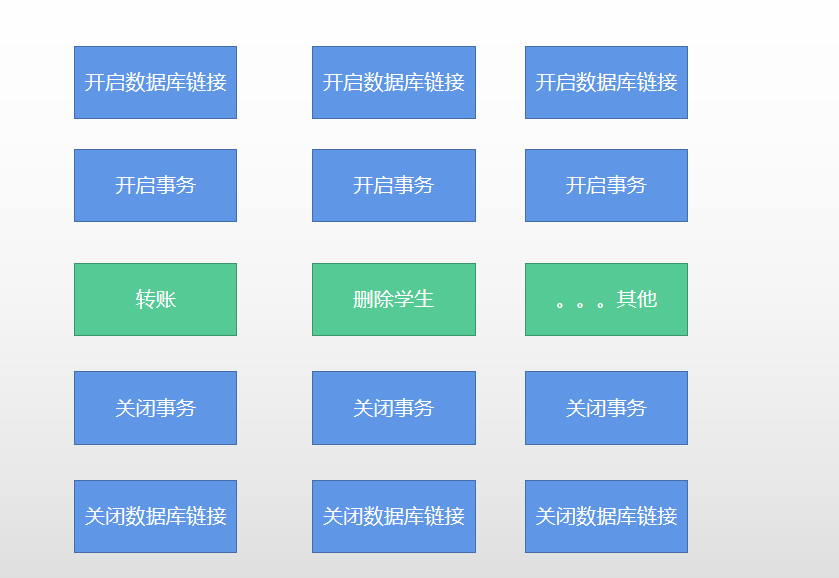
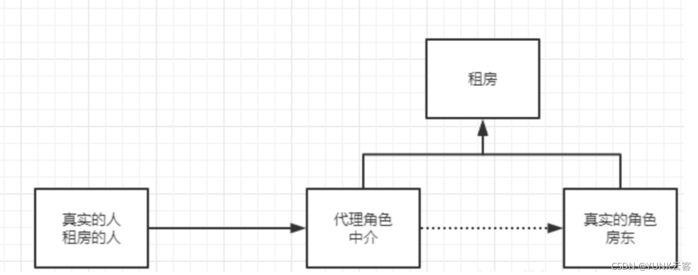
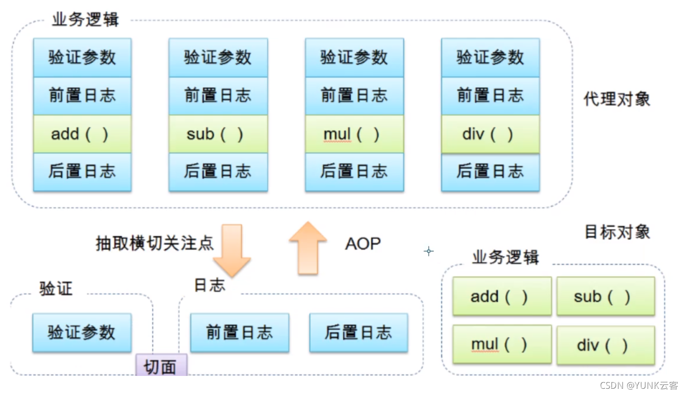
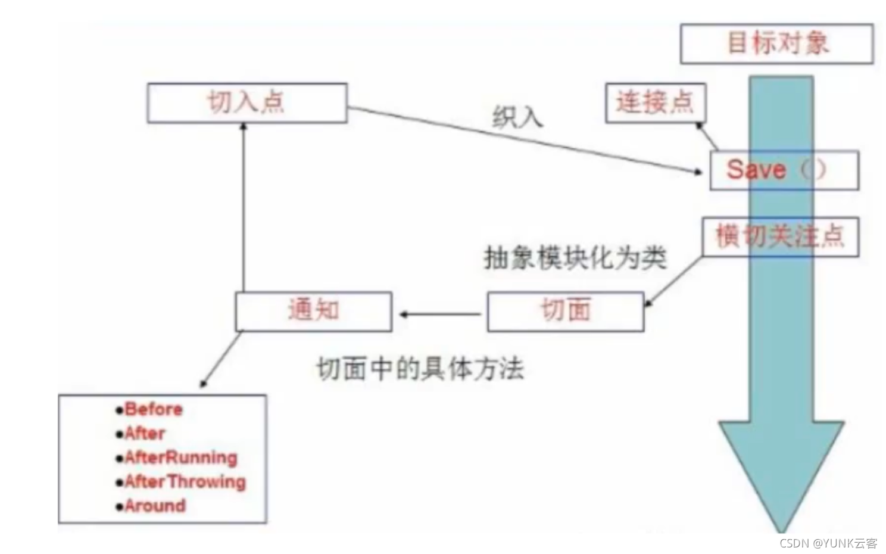

# 代理模式与AOP


## 先思考一个问题




我们以前学习JDBC 的时候的操作。这个代码存在什么问题？？


学习本次课的内容需要提前了解代理模式和java中的反射

## 代理模式

为什么要学习代理模式？因为这就是SpringAOP的底层！

代理模式的分类：

- 静态代理
- 动态代理



### 静态代理

角色分析：

    抽象角色：一般会使用接口或抽象类来解决
    真实角色：被代理的角色
    代理角色：代理真实角色，代理真实角色后，我们会做一些附属操作
    客户：访问代理对象的人！

代码步骤：

1.接口

```java
//租房
public interface Rent {
	public void rent();
}
```

2.真实角色

```java
//房东
public class Host implements Rent{
    public void rent() {
        System.out.println("和租户谈价格");
    }
}
```
3.代理角色

```java
public class Proxy implements Rent {
    private Host host;

    public Proxy() {
    }

    public Proxy(Host host) {
        this.host = host;
    }

    public void rent() {
        seeHouser();
        host.rent();
        heTong();
        fare();
       
    }

    //看房
    public void seeHouser(){
        System.out.println("中介带顾客看房！");
    }

    //签合同
    public void heTong(){
        System.out.println("签租赁合同！");
    }

    //收中介费
    public void fare(){
        System.out.println("收中介费！");
    }
}
```


4.客户端访问代理角色

```java
//顾客
public class Client {
public static void main(String[] args) {

        //直接找房子找不到，我们需要去中介所找房子
        //        Host host = new Host();
        //        host.rent();
        //找房东,房东要出租房子
        Host host = new Host();
    
        //host.rent();

        //代理，中介一般会帮房东出租房子，但是会做一些附属操作
        Proxy proxy = new Proxy(host);

        //不用直接面对房东，直接找中介租房就可以了
        proxy.rent();
    }
}
```
代理模式的好处：

    可以使真实角色的操作更加纯粹！不会去关注一些公共的业务
    公共也就是交给代理角色，实现了业务的分工
    公共业务发生扩展的，方便集中管理时候

缺点：

    一个真实角色就会产生一个代理角色，代码量就会翻量，效率低

#### 加深理解

聊聊AOP

代码步骤：

1.接口

```java
public interface UserDao {
    public void add();
    public void delete();
    public void update();
    public void query();
}
```

2.真实角色

```java
//真实对象
public class UserImpl implements UserDao {
    public void add() {
        System.out.println("操作数据库增加了一个用户！");
    }
    public void delete() {
        System.out.println("操作数据库删除了一个用户！");
    }

    public void update() {
        System.out.println("操作数据库修改了一个用户！");
    }

    public void query() {
        System.out.println("操作数据库查询了一个用户！");
    }
}
```


3.代理角色

```java
public class UserProxy implements UserDao {
    private UserImpl userImpl;

    public UserImpl getUserImpl() {
        return userImpl;
    }

    public void setUserImpl(UserImpl userImpl) {
        this.userImpl = userImpl;
    }

    public void add() {
        log("add");
        userImpl.add();
    }

    public void delete() {
        log("delete");
        userImpl.delete();
    }

    public void update() {
        log("update");
        userImpl.update();
    }

    public void query() {
        log("query");
        userImpl.query();
    }

    //日志方法
    public void log(String str)
    {
        System.out.println("使用了"+str+"方法");
    }
}
```
4.客户端访问代理角色

```java
public class Client {
    public static void main(String[] args) {
       UserImpl userImpl = new UserImpl();
       UserProxy userProxy = new UserProxy();

        userProxy.setUserImpl(userImpl);

        userProxy.add();
        userProxy.delete();
        userProxy.update();
        userProxy.query();
	}   
}
```


### 动态代理

动态代理和静态代理角色一样
动态代理类是动态生成的，不是我们写好的
动态代理分为两大类：基于接口的动态代理，基于类的动态代理

- ​    基于接口：JDK动态代理
- ​    基于类：cglib
- ​    java字节码实现：javasist

#### 基于JDK 的代理实现

需要了解两个类：

proxy代理

 InvocationHandler：调用处理程序


接口

```java
//租房
public interface Rent {
	public void rent();
    
}
```

2.真实角色

```java
//房东
public class Host implements Rent {
    public void rent() {
        System.out.println("和租户面谈价格");
    }
}
```

3.动态代理实现的类


```java
//等会我们会用这个类，自动生成代理类
public class ProxyInvocationHandler implements InvocationHandler {
    //被代理的接口
    private Rent rent;

    public void setRent(Rent rent) {
        this.rent = rent;
    }

    //生成得到的代理类
    public Object getProxy(){

        //这段代码是死的，我们只需要改变rent这个参数的值
        Object o = Proxy.newProxyInstance(this.getClass().getClassLoader(),
                rent.getClass().getInterfaces(), this);

        return o;
    }

    //处理代理实例，并返回结果
    public Object invoke(Object proxy, Method method, Object[] args) throws Throwable {

        seeHouse();
        //动态代理的本质，就是使用反射机制实现
        Object invoke = method.invoke(rent, args);
		hetong();
        fare();

        return invoke;
    }

    public void seeHouse(){
        System.out.println("看房子");
    }

    public void fare(){
        System.out.println("收中介费");
    }
}	
```

4.客户端访问代理角色

```java
public class Client {
    public static void main(String[] args) {
        //真实角色
        Host host = new Host();
        //代理角色:现在没有
        ProxyInvocationHandler p = new ProxyInvocationHandler();

        //通过调用程序处理角色来处理我们要调用的接口对象
        p.setRent(host);

        Rent proxy = (Rent) p.getProxy();

        proxy.rent();
	}
}
```


动态代理的好处：

    可以使真实角色的操作更加纯粹！不用去关注一些公共的业务
    公共也就交给代理角色！实现了业务的分工！
    公共业务发生拓展的时候，方便集中管理！
    一个动态代理类代理的是一个接口，一般就是对应的一类业务
    一个动态代理类可以代理多个类，只要是实现了同一个接口即可

## AOP

什么是AOP  OOP(Object Oriented Programming)

AOP（Aspect Oriented Programming）意为：面向切面编程，通过预编译方式和运行期动态代理实现程序功能的统一维护的一种技术。AOP是OOP的延续，是软件开发中的一个热点，也是Spring框架中的一个重要内容，是函数式编程的一种衍生范型。利用AOP可以对业务逻辑的各个部分进行隔离，从而使得业务逻辑各部分之间的耦合度降低，提高程序的可重用性，同时提高了开发的效率。


## AOP在Spring中的作用


提供声明式事务；允许用户自定义切面

以下名词需要了解下：

    横切关注点：跨越应用程序多个模块的方法或功能。即是，与我们业务逻辑无关的，但是我们需要关注的部分，就是横切关注点。如日志 , 安全 , 缓存 , 事务等等 …
    切面（ASPECT）：横切关注点 被模块化 的特殊对象。即，它是一个类。
    通知（Advice）：切面必须要完成的工作。即，它是类中的一个方法。
    目标（Target）：被通知对象。
    代理（Proxy）：向目标对象应用通知之后创建的对象。
    切入点（PointCut）：切面通知 执行的 “地点”的定义。
    连接点（JointPoint）：与切入点匹配的执行点。



使用Spring实现AOP

要导包

```
<!-- https://mvnrepository.com/artifact/org.aspectj/aspectjweaver -->
<dependency>
   <groupId>org.aspectj</groupId>
   <artifactId>aspectjweaver</artifactId>
   <version>1.9.4</version>
</dependency>
```


### 方式一：使用spring API 实现

首先编写我们的业务接口和实现类

```java
public interface UserService {
    public void add();
    public void delete();
    public void update();
    public void query();
}

```


```java
public class UserServiceImple implements UserService {
    public void add() {
        System.out.println("操作数据库增加了一个用户！");
    }
    public void delete() {
        System.out.println("操作数据库删除了一个用户！");
    }

    public void update() {
        System.out.println("操作数据库修改了一个用户！");
    }

    public void query() {
        System.out.println("操作数据库查询了一个用户！");
    }
}
```


然后去写我们的增强类 , 我们编写两个 , 一个前置增强 一个后置增强

前置增强：

```java
public class Log implements MethodBeforeAdvice {
    //method:要执行的目标对象的方法
    //args:参数
    //target:目标对象
    public void before(Method method, Object[] args, Object target) throws Throwable {
        System.out.println(target.getClass().getName()+"的"+method.getName()+"要执行了！");
    }
}
```


后置增强：

```java
public class AfterLog implements AfterReturningAdvice {
    //returnValue:返回值
    public void afterReturning(Object returnValue, Method method, Object[] args, Object target) throws Throwable {
        System.out.println("执行了"+method.getName()+"方法，返回结果为："+returnValue);
    }
}
```


最后去spring的文件中注册 , 并实现aop切入实现 , 注意导入约束 ：


```xml
<?xml version="1.0" encoding="UTF-8"?>
<beans xmlns="http://www.springframework.org/schema/beans"
       xmlns:xsi="http://www.w3.org/2001/XMLSchema-instance"
       xmlns:aop="http://www.springframework.org/schema/aop"
       xsi:schemaLocation="http://www.springframework.org/schema/beans
        http://www.springframework.org/schema/beans/spring-beans.xsd
        http://www.springframework.org/schema/aop
        http://www.springframework.org/schema/aop/spring-aop.xsd">
<!--注册bean-->
<bean id="userService" class="com.jlai.service.UserServiceImple"></bean>
<bean id="log" class="com.jlai.log.Log"/>
<bean id="afterLog" class="com.jlai.log.AfterLog"/>

<!--方式一：使用spring API原生接口-->
<!--配置AOP:需要导入aop的约束-->
<aop:config>
    <!--切入点：expression:表达式，execution(要执行的位置！ * * * * (..))  (..)代表所有的参数-->
    <aop:pointcut id="pointcut" expression="execution(* com.jlai.service.UserServiceImpl.*(..))"/>

    <!--执行环绕增加-->
    <aop:advisor advice-ref="log" pointcut-ref="pointcut"/>
    <aop:advisor advice-ref="afterLog" pointcut-ref="pointcut"/>
</aop:config>
</beans>
```

测试：

```java
  public class Test {
    public static void main(String[] args) {
        ApplicationContext c =
                new ClassPathXmlApplicationContext("applicationContext.xml");
      //动态代理代理的是接口
        UserService userService = (UserService) c.getBean("userService");

        userService.add();
    }
}
```


### 方式二：自定义类实现AOP

去掉前置增强和后置增强，新增一个类。自定义，方法随意。


```java
public class DiyPointCut  {
    public void before()
    {
        System.out.println("方法执行前！");
    }

    public void after(){
        System.out.println("方法执行后！");
    }
}
```


最后去spring的文件中注册 , 并实现aop切入实现 , 注意导入约束 ：


```xml
<?xml version="1.0" encoding="UTF-8"?>
<beans xmlns="http://www.springframework.org/schema/beans"
       xmlns:xsi="http://www.w3.org/2001/XMLSchema-instance"
       xmlns:aop="http://www.springframework.org/schema/aop"
       xsi:schemaLocation="http://www.springframework.org/schema/beans
        http://www.springframework.org/schema/beans/spring-beans.xsd
        http://www.springframework.org/schema/aop
        http://www.springframework.org/schema/aop/spring-aop.xsd">
<!--注册bean-->
<bean id="userService" class="com.jlai.service.UserServiceImple"></bean>
<bean id="log" class="com.jlai.log.LOg"/>
<bean id="afterLog" class="com.jlai.log.AfterLog"/>

<!--方式二：自定义类实现AOP-->
<bean id="diyPointCut" class="com.jlai.diy.DiyPointCut"/>

<aop:config>

    <!--自定义切面，ref 要引用的类-->
    <aop:aspect ref="diyPointCut">

        <!--切入点-->
        <aop:pointcut id="point" expression="execution(* com.jlai.service.UserServiceImple.*(..))"/>

        <!--通知-->
        <!--before,在point对应的方法之前执行
            after,在point对应的方法之后执行
                method对应要执行的方法，从切入面引用的类中来-->
        <aop:before method="before" pointcut-ref="point"/>
        <aop:after method="after" pointcut-ref="point"/>
    </aop:aspect>
</aop:config>
</beans>
```


### 方式三：使用注解实现

自定义一个类：

```java
package com.jlai.diy;
import org.aspectj.lang.ProceedingJoinPoint;
import org.aspectj.lang.Signature;
import org.aspectj.lang.annotation.After;
import org.aspectj.lang.annotation.Around;
import org.aspectj.lang.annotation.Aspect;
import org.aspectj.lang.annotation.Before;

//方式三：使用注解实现AOP

/*在方式二中，我们需要在配置文件中  <!--自定义切面，ref 要引用的类-->
                                 <aop:aspect ref="diyPointCut">
             我们使用注解@Aspect就直接将该类定义为切面类*/

@Aspect
public class AnnotationPointCut {
    @Before("execution(* com.jlai.service.UserServiceImple.*(..))")//切入面，切入方法都有了，差一个切入点
    public void before()
    {
        System.out.println("1.方法执行前！");
    }

    @After("execution(* com.jlai.service.UserServiceImple.*(..))")
    public void after(){
        System.out.println("方法执行后！");
    }

    /* 在环绕增强中，我们可以给定一个参数，代表我们要获取切入的点*/
    @Around("execution(* com.jlai.service.UserServiceImple.*(..))")
    public void around(ProceedingJoinPoint jp) throws Throwable {
        System.out.println("环绕前");
        //执行方法
        //Signature signature = jp.getSignature();//获得签名
        //System.out.println("signature"+signature);
        jp.proceed();
        System.out.println("环绕后");
    }
}
```


我们还需要在配置文件中写入：

 <!--方式三：使用注解实现AOP-->
    <!--我们还需要配置文件将类注册机进来-->
    <bean id="anno" class="com.jlai.diy.AnnotationPointCut"/>
    <!--开启注解支持-->
    <aop:aspectj-autoproxy/>

通过aop命名空间的<aop:aspectj-autoproxy />声明自动为spring容器中那些配置@aspectJ切面的bean创建代理，织入切面。当然，spring 在内部依旧采用AnnotationAwareAspectJAutoProxyCreator进行自动代理的创建工作，但具体实现的细节已经被<aop:aspectj-autoproxy />隐藏起来了

<aop:aspectj-autoproxy />有一个proxy-target-class属性，默认为false，表示使用jdk动态代理织入增强，当配为<aop:aspectj-auto