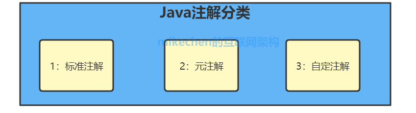
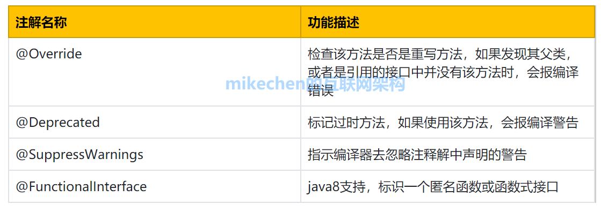
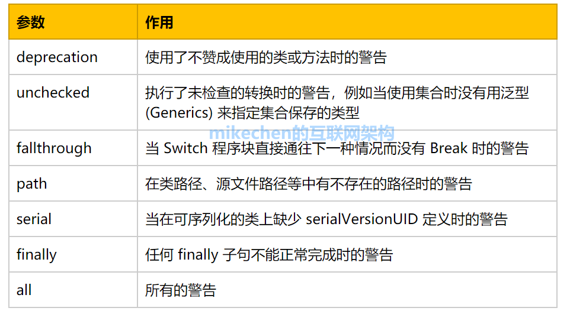
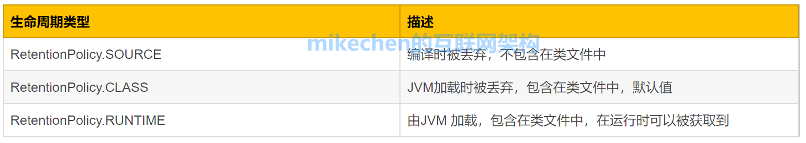
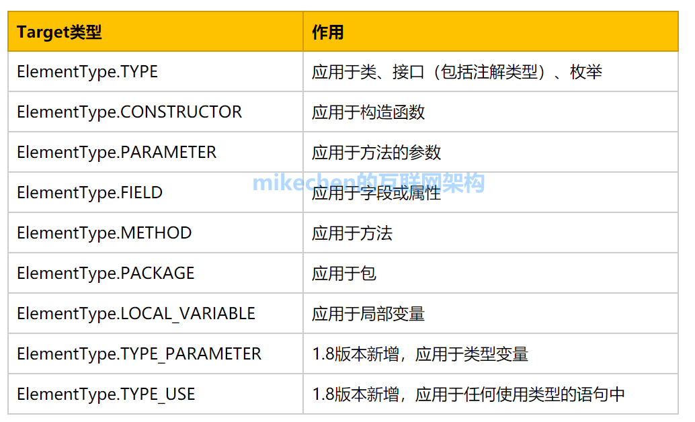

# Java注解定义

Java注解又称Java标注，是在 JDK5 时引入的新特性，注解（也被称为[元数据]）。

Java注解它提供了一种安全的类似注释的机制，用来将任何的信息或元数据（metadata）与程序元素（类、方法、成员变量等）进行关联。

**Java注解是附加在代码中的一些元信息，用于一些工具在编译、运行时进行解析和使用，起到说明、配置的功能。**

# Java注解应用

1.生成文档这是最常见的，也是java 最早提供的注解;

2.在编译时进行格式检查，如@Override放在方法前，如果你这个方法并不是覆盖了超类方法，则编译时就能检查出；

3.跟踪代码依赖性，实现替代配置文件功能，比较常见的是spring 2.5 开始的基于注解配置,作用就是减少配置;

4.在反射的 Class, Method, Field 等函数中，有许多于 Annotation 相关的接口,可以在反射中解析并使用 Annotation。

# Java注解分类




## 1、Java自带的标准注解

包括@Override、@Deprecated、@SuppressWarnings等，使用这些注解后编译器就会进行检查。

## 2、元注解

元注解是用于定义注解的注解，包括@Retention、@Target、@Inherited、@Documented、@Repeatable 等。
元注解也是Java自带的标准注解，只不过用于修饰注解，比较特殊。

## 3、自定义注解

用户可以根据自己的需求定义注解。

# Java标准注解

**JDK 中内置了以下注解：**



## 1.@Override

如果试图使用 @Override 标记一个实际上并没有覆写父类的方法时，java 编译器会告警。

```java
class Parent {

  public void test() {

  }

}

class Child extends Parent  {

   /**
    *  放开下面的注释，编译时会告警
    */
   /*
      @Override
      public void test() {

      }

   */

}
```

## 2.Deprecated

```java
@Deprecated 用于标明被修饰的类或类成员、类方法已经废弃、过时，不建议使用。
@Deprecated

class TestClass {

  // do something

}
```

## 3.@SuppressWarnings

@SuppressWarnings 用于关闭对类、方法、成员编译时产生的特定警告。

**1）抑制单类型的警告**

```java
@SuppressWarnings("unchecked")  

public void addItems(String item){  

  @SuppressWarnings("rawtypes")  

   List items = new ArrayList();  

   items.add(item);  

}
```

**2）抑制多类型的警告**

```java
@SuppressWarnings(value={"unchecked", "rawtypes"})  
public void addItems(String item){  

   List items = new ArrayList();  

   items.add(item);  

}
```

**3）抑制所有类型的警告**

```java
@SuppressWarnings("all")  
public void addItems(String item){  

   List items = new ArrayList();  

   items.add(item);  

}
```

**@SuppressWarnings 注解的常见参数值的简单说明:**


## 4.@FunctionalInterface

@FunctionalInterface 用于指示被修饰的接口是函数式接口,在 JDK8 引入。

```java
@FunctionalInterfacepublic interface UserService {

    void getUser(Long userId);

    // 默认方法，可以用多个默认方法

    public default void setUser() {

    }

    // 静态方法

    public static void saveUser() {

    }

    // 覆盖Object中的equals方法
    public boolean equals(Object obj);
}
```

函数式接口(Functional Interface)就是一个有且仅有一个抽象方法，但是可以有多个非抽象方法的接口。

# Java元注解

**元注解是java API提供的，是用于修饰注解的注解，通常用在注解的定义上：**




## 1.@Retention

@ Retention用来定义该注解在哪一个级别可用，在源代码中(SOURCE)、类文件中(CLASS)或者运行时(RUNTIME)。

@Retention 源码：

```java
@Documented@Retention(RetentionPolicy.RUNTIME)
@Target(ElementType.ANNOTATION_TYPE)
public @interface Retention {
  RetentionPolicy value();
}

public enum RetentionPolicy {
  //此注解类型的信息只会记录在源文件中，编译时将被编译器丢弃，也就是说
  //不会保存在编译好的类信息中
  SOURCE,
  //编译器将注解记录在类文件中，但不会加载到JVM中。如果一个注解声明没指定范围，则系统
  //默认值就是Class
  CLASS,
  //注解信息会保留在源文件、类文件中，在执行的时也加载到Java的JVM中，因此可以反射性的读取。
  RUNTIME
}
```

RetentionPolicy 是一个枚举类型，它定义了被 @Retention 修饰的注解所支持的保留级别：




```java
@Target(ElementType.METHOD)
@Retention(RetentionPolicy.SOURCE) //注解信息只能在源文件中出现
public @interface Override {

}

@Documented@Retention(RetentionPolicy.RUNTIME)  //注解信息在执行时出现@Target(value={CONSTRUCTOR, FIELD, LOCAL_VARIABLE, METHOD, PACKAGE, PARAMETER, TYPE})

  public @interface Deprecated {

}

@Target({TYPE, FIELD, METHOD, PARAMETER, CONSTRUCTOR, LOCAL_VARIABLE})
@Retention(RetentionPolicy.SOURCE)  //注解信息在源文件中出现
public @interface SuppressWarnings {
  String[] value();

}
```

## 2.@Documented

@Documented：生成文档信息的时候保留注解，对类作辅助说明

@Documented 示例

```java
@Target(ElementType.FIELD)
@Retention(RetentionPolicy.RUNTIME)
@Documented
public @interface Column {
    public String name() default "fieldName";
    public String setFuncName() default "setField";
    public String getFuncName() default "getField";
    public boolean defaultDBValue() default false;
}
```

## 3.@Target

@Target：用于描述注解的使用范围（即：被描述的注解可以用在什么地方）

@Target源码：

```java
@Documented
@Retention(RetentionPolicy.RUNTIME)
@Target(ElementType.ANNOTATION_TYPE)
public @interface Target {
    ElementType[] value();
}
```

ElementType 是一个枚举类型，它定义了被 @Target 修饰的注解可以应用的范围：



## 4.@Inherited

@Inherited：说明子类可以继承父类中的该注解

表示自动继承注解类型。 如果注解类型声明中存在 @Inherited 元注解，则注解所修饰类的所有子类都将会继承此注解。

```java
@Inherited
public @interface Greeting {

    public enum FontColor{ BULE,RED,GREEN};

    String name();

    FontColor fontColor() default FontColor.GREEN;

}
```

## 5.@Repeatable

@Repeatable 表示注解可以重复使用。

当我们需要重复使用某个注解时，希望利用相同的注解来表现所有的形式时，我们可以借助@Repeatable注解。
以 Spring @Scheduled 为例：

```java
@Target({ElementType.METHOD, ElementType.ANNOTATION_TYPE})
@Retention(RetentionPolicy.RUNTIME)
@Documented
public @interface Schedules {
    Scheduled[] value();

}

@Target({ElementType.METHOD, ElementType.ANNOTATION_TYPE})
@Retention(RetentionPolicy.RUNTIME)
@Documented
@Repeatable(Schedules.class)
public @interface Scheduled {
  // ...
}
```

# 自定义注解

## 编写注解

这里声明一个 `SystemConfig` 的注解：

```java
//该注解可以应用于类、接口（包括注解类型）、枚举
@Target(ElementType.TYPE)
//该注解标记的元素可以被Javadoc 或类似的工具文档化
@Documented
//该注解的生命周期，由JVM 加载，包含在类文件中，在运行时可以被获取到
@Retention(RetentionPolicy.RUNTIME)
public @interface SystemConfig {
    String name() default "lin";
    int age();
}
```


## 应用注解

在 `User` 类上应用刚刚编写的 `SystemConfig` 注解：

```java
//应用SystemConfig注解到User类
@SystemConfig(age = 20)
public class User {
    private String name;

    private Integer age;
}
```

## 测试

编写测试类，测试注解是否生效：

```java
public class AnnotationTest {

    public static void main(String[] args) {
        //获取User的Class对象
        Class<?> userClass = User.class;
        //判断Class对象上是否有SystemConfig的注解
        if (userClass.isAnnotationPresent(SystemConfig.class)) {
            System.out.println("User上配置了SystemConfig注解");
            //获取SystemConfig注解
            SystemConfig config = userClass.getAnnotation(SystemConfig.class);
            System.out.println("SystemConfig.name:" + config.name() + "; SystemConfig.age:" + config.age());
        } else {
            System.out.println("User上没有配置SystemConfig注解");
        }
    }
}
```

打印结果如下：