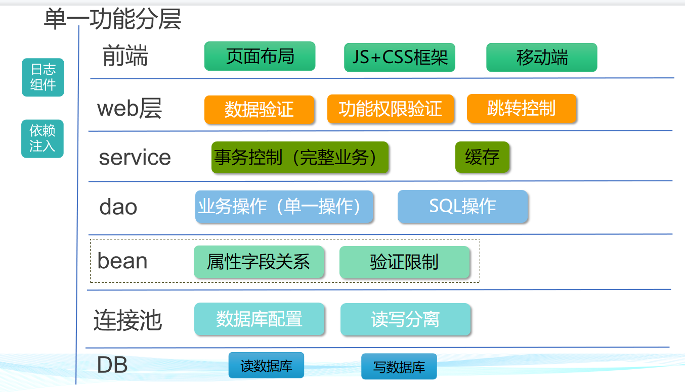
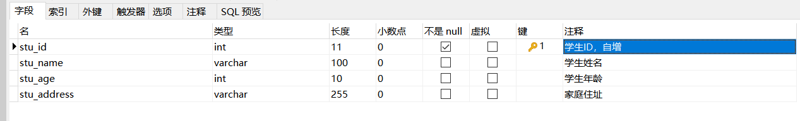

# 综合实训




## 任务1：开发一个简单的学生管理列表

### 后端开发

#### 创建数据库表

结构如下：



#### 创建对应的实体

```java
package com.ruoyi.system.domain;

import com.ruoyi.common.annotation.Excel;
import com.ruoyi.common.annotation.Excel.ColumnType;
import com.ruoyi.common.core.domain.BaseEntity;
import org.apache.commons.lang3.builder.ToStringBuilder;
import org.apache.commons.lang3.builder.ToStringStyle;

import javax.validation.constraints.NotBlank;
import javax.validation.constraints.Size;

/**
 * 学生信息
 * 
 * @author DaemonSu
 */
public class SysStu extends BaseEntity
{
    private static final long serialVersionUID = 1L;

    public Long getStuId() {
        return stuId;
    }

    public void setStuId(Long stuId) {
        this.stuId = stuId;
    }

    public String getStuName() {
        return stuName;
    }

    public void setStuName(String stuName) {
        this.stuName = stuName;
    }

    public int getStuAge() {
        return stuAge;
    }

    public void setStuAge(int stuAge) {
        this.stuAge = stuAge;
    }

    public String getStuAddress() {
        return stuAddress;
    }

    public void setStuAddress(String stuAddress) {
        this.stuAddress = stuAddress;
    }

    /** 学生id */
    private Long stuId;

    /** 岗位编码 */
    private String stuName;

    /** 学生年龄 */
    private int stuAge;

    /** 学生地址 */
    private String stuAddress;


    @Override
    public String toString() {
        return new ToStringBuilder(this,ToStringStyle.MULTI_LINE_STYLE)
            .append("StuId", getStuId())
            .append("StuName", getStuName())
                .append("stuAge", getStuAge())
                .append("stuAddress", getStuAddress())
            .append("createBy", getCreateBy())
            .append("createTime", getCreateTime())
            .append("updateBy", getUpdateBy())
            .append("updateTime", getUpdateTime())
            .append("remark", getRemark())
            .toString();
    }
}
```

#### 创建DAO层-（mybatis）

注意，mapper一定是java mapper和xml文件成对出现，并且方法都是一一对应的。

这里写了我可以对数据库进行那些操作

```java
package com.ruoyi.system.mapper;

import com.ruoyi.system.domain.SysStu;

import java.util.List;

/**
 * 学生信息 数据层
 * 
 * @author DaemonSu
 */
public interface SysStuMapper
{
    /**
     * 查询学生数据集合
     * 
     * @param stu 学生信息
     * @return 学生数据集合
     */
    public List<SysStu> selectStuList(SysStu stu);


    /**
     * 通过学生ID查询学生信息
     * 
     * @param stuId 学生ID
     * @return 角色对象信息
     */
    public SysStu selectStuById(Long stuId);


    /**
     * 删除学生信息
     * 
     * @param stuId 学生ID
     * @return 结果
     */
    public int deleteStuById(Long stuId);

    /**
     * 批量删除学生信息
     * 
     * @param stuIds 需要删除的学生ID
     * @return 结果
     */
    public int deleteStuByIds(Long[] stuIds);

    /**
     * 修改学生信息
     * 
     * @param stu 学生信息
     * @return 结果
     */
    public int updateStu(SysStu stu);

    /**
     * 新增学生信息
     * 
     * @param stu 学生信息
     * @return 结果
     */
    public int insertStu(SysStu stu);


}
```

对应的xml文件。

这里三个要点：

- 首先这里的namespace需要和java类中mapper完全一致。

- 然后这里的每一个完整的sql语句（select，delete，update，insert）的id都需要和java mapper中的方法名称相对应。

- 在resultMap中定义了查询出来的字段和java类中属性的关系


```xml
<?xml version="1.0" encoding="UTF-8" ?>
<!DOCTYPE mapper
PUBLIC "-//mybatis.org//DTD Mapper 3.0//EN"
"http://mybatis.org/dtd/mybatis-3-mapper.dtd">
<mapper namespace="com.ruoyi.system.mapper.SysStuMapper">

	<resultMap type="SysStu" id="SysStuResult">
		<id     property="stuId"        column="stu_id"       />
		<result property="stuAddress"      column="stu_address"     />
		<result property="stuName"      column="stu_name"     />
		<result property="stuAge"      column="stu_age"     />
	</resultMap>
	
	<sql id="selectStuVo">
        select stu_id, stu_address, stu_name, stu_age
		from teach_stu
    </sql>


	<select id="selectStuList" parameterType="SysStu" resultMap="SysStuResult">
		select stu_id, stu_address, stu_name, stu_age
		from teach_stu
		<where>
			<if test="stuAddress != null and stuAddress != ''">
				AND stu_address like concat('%', #{stuAddress}, '%')
			</if>
			<if test="stuName != null and stuName != ''">
				AND stu_name like concat('%', #{stuName}, '%')
			</if>
		</where>
	</select>
	

	<select id="selectStuById" parameterType="Long" resultMap="SysStuResult">
		<include refid="selectStuVo"/>
		where stu_id = #{stuId}
	</select>
	

	<update id="updateStu" parameterType="SysStu">
 		update teach_stu
 		<set>
 			<if test="stuAddress != null and stuAddress != ''">stu_address = #{stuAddress},</if>
 			<if test="stuName != null and stuName != ''">stu_name = #{stuName},</if>
 			<if test="stuAge != null and stuAge != ''">stu_age = #{stuAge}</if>
 		</set>
 		where stu_id = #{stuId}
	</update>
 	
 	<insert id="insertStu" parameterType="SysStu" useGeneratedKeys="true" keyProperty="stuId">
 		insert into teach_stu(
 			<if test="stuAddress != null and stuAddress != ''">stu_address,</if>
 			<if test="stuName != null and stuName != ''">stu_name,</if>
 			<if test="stuAge != null and stuAge != ''">stu_age</if>
 		)values(
 			<if test="stuAddress != null and stuAddress != ''">#{stuAddress},</if>
 			<if test="stuName != null and stuName != ''">#{stuName},</if>
 			<if test="stuAge != null and stuAge != ''">#{stuAge}</if>
 		)
	</insert>
	
	<delete id="deleteStuById" parameterType="Long">
		delete from teach_stu where stu_id = #{stuId}
	</delete>
	
	<delete id="deleteStuByIds" parameterType="Long">
 		delete from teach_stu where stu_id in
 		<foreach collection="array" item="stuId" open="(" separator="," close=")">
 			#{stuId}
        </foreach> 
 	</delete>

</mapper> 
```


#### 创建service

这里service部分需要两块，一块是iservice接口，这个接口主要有两个作用，一个是定义了行为，另一个是可以使AOP兼容多种实现方式

```java
/**
 * 学生管理 服务层
 * 
 * @author ruoyi
 */
public interface ISysStuService
{
    /**
     * 查询学生信息集合
     * 
     * @param stu 学生信息
     * @return 学生列表
     */
    public List<SysStu> selectStuList(SysStu stu);


    /**
     * 通过学生ID查询学生信息
     * 
     * @param stuId 学生ID
     * @return 角色对象信息
     */
    public SysStu selectStuById(Long stuId);

    /**
     * 删除学生信息
     * 
     * @param stuId 学生ID
     * @return 结果
     */
    public int deleteStuById(Long stuId);

    /**
     * 批量删除学生信息
     * 
     * @param stuIds 需要删除的学生ID
     * @return 结果
     */
    public int deleteStuByIds(Long[] stuIds);

    /**
     * 新增保存学生信息
     * 
     * @param stu 学生信息
     * @return 结果
     */
    public int insertStu(SysStu stu);

    /**
     * 修改保存学生信息
     * 
     * @param stu 学生信息
     * @return 结果
     */
    public int updateStu(SysStu stu);
}
```

Service实现类则是调用Map，实现了对学生的所有操作。

```java
/**
 * 学生信息 服务层处理
 * 
 * @author ruoyi
 */
@Service
public class SysStuServiceImpl implements ISysStuService
{
    @Autowired
    private SysStuMapper stuMapper;


    /**
     * 查询学生信息集合
     * 
     * @param stu 学生信息
     * @return 学生信息集合
     */
    @Override
    public List<SysStu> selectStuList(SysStu stu)
    {
        return stuMapper.selectStuList(stu);
    }
    /**
     * 通过学生ID查询学生信息
     * 
     * @param stuId 学生ID
     * @return 角色对象信息
     */
    @Override
    public SysStu selectStuById(Long stuId)
    {
        return stuMapper.selectStuById(stuId);
    }

    /**
     * 删除学生信息
     * 
     * @param stuId 学生ID
     * @return 结果
     */
    @Override
    public int deleteStuById(Long stuId)
    {
        return stuMapper.deleteStuById(stuId);
    }

    /**
     * 批量删除学生信息
     * 
     * @param stuIds 需要删除的学生ID
     * @return 结果
     */
    @Override
    public int deleteStuByIds(Long[] stuIds)
    {
        return stuMapper.deleteStuByIds(stuIds);
    }

    /**
     * 新增保存学生信息
     * 
     * @param stu 学生信息
     * @return 结果
     */
    @Override
    public int insertStu(SysStu stu)
    {
        return stuMapper.insertStu(stu);
    }

    /**
     * 修改保存学生信息
     * 
     * @param stu 学生信息
     * @return 结果
     */
    @Override
    public int updateStu(SysStu stu)
    {
        return stuMapper.updateStu(stu);
    }
}
```

#### 创建controller 

这个部分就是开发的可以处理的请求路径，前台的一个动作，对应后台的一个controller方法

```java
/**
 * 学生管理
 * 
 * @author ruoyi
 */
@RestController
@RequestMapping("/system/stu")
public class SysStuController extends BaseController
{
    @Autowired
    private ISysStuService stuService;

    /**
     * 获取学生列表
     */
    @PreAuthorize("@ss.hasPermi('system:stu:list')")
    @GetMapping("/list")
    public TableDataInfo list(SysStu stu,String userName)
    {
        startPage();
        List<SysStu> list = stuService.selectStuList(stu);
        return getDataTable(list);
    }

    /**
     * 根据学生编号获取详细信息
     */
    @PreAuthorize("@ss.hasPermi('system:stu:query')")
    @GetMapping(value = "/{stuId}")
    public AjaxResult getInfo(@PathVariable Long stuId)
    {
        return AjaxResult.success(stuService.selectStuById(stuId));
    }

    /**
     * 新增学生
     */
    @PreAuthorize("@ss.hasPermi('system:stu:add')")
    @Log(title = "学生管理", businessType = BusinessType.INSERT)
    @PostMapping
    public AjaxResult add(@Validated @RequestBody SysStu stu)
    {
        stu.setCreateBy(getUsername());
        return toAjax(stuService.insertStu(stu));
    }

    /**
     * 修改学生
     */
    @PreAuthorize("@ss.hasPermi('system:stu:edit')")
    @Log(title = "学生管理", businessType = BusinessType.UPDATE)
    @PutMapping
    public AjaxResult edit(@Validated @RequestBody SysStu stu)
    {
        stu.setUpdateBy(getUsername());
        return toAjax(stuService.updateStu(stu));
    }

    /**
     * 删除学生
     */
    @PreAuthorize("@ss.hasPermi('system:stu:remove')")
    @Log(title = "学生管理", businessType = BusinessType.DELETE)
    @DeleteMapping("/{stuIds}")
    public AjaxResult remove(@PathVariable Long[] stuIds)
    {
        return toAjax(stuService.deleteStuByIds(stuIds));
    }

}
```


### 前端开发

### 新的内容-分页


## 任务2：学生作品


### 前端开发


### 后端开发


### 新的内容-事务控制