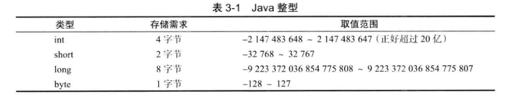
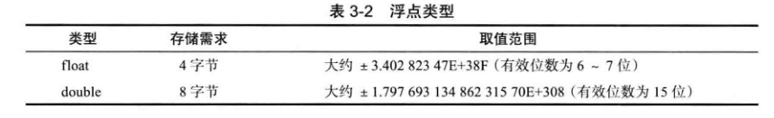
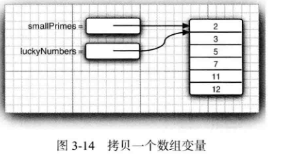

# java基本程序结构

hello world


## 1：注释

```java
//单行注释

/**
*多行注释
*多行注释
*/
```


## 2：基本数据类型

8中基本数据类型  int short long byte boolean double float char

其中

表示整数：short ，int，long，byte



表示小数：double ，float



表示布尔值： boolean  true false

表示字符：char


## 3：变量

变量先定义再使用，变量名长度没有限制，大小写敏感。

需要先赋值再使用。


### 常量（final）的讲解

### final的讲解

final 关键字主要用在三个地方：变量、方法、类

1. **final 变量**

   - 如果是**基本数据类型**的变量，其**数值一旦初始化之后便不能改变**

   - 如果是**引用类型**的变量：则在对其初始化之后便**不能再让其指向另一个对象*

2. **final 类**

   表明这个类**不能被继承**，final 类中的**所有成员方法都会被隐式得指定为final方法**

3. **final方法**

   final修饰的成员方法**不能被子类重写**


## 4：运算

加减乘除

数值之间的转换


## 5：字符串


### 常用方法

下面是 String 类支持的方法，更多详细，参看 Java String API 文档:


| 方法                                           | 描述                                                         |
| ---------------------------------------------- | ------------------------------------------------------------ |
| char charAt(int index)                         | 返回指定索引处的 char 值。                                   |
| int compareTo(Object o)                        | 把这个字符串和另一个对象比较。                               |
| int compareTo(String anotherString)            | 按字典顺序比较两个字符串。                                   |
| boolean endsWith(String suffix)                | 测试此字符串是否以指定的后缀结束。                           |
| boolean equals(Object anObject)                | 将此字符串与指定的对象比较。                                 |
| boolean equalsIgnoreCase(String anotherString) | 将此 String 与另一个 String 比较，不考虑大小写。             |
| byte[] getBytes()                              | 使用平台的默认字符集将此 String 编码为 byte 序列，并将结果存储到一个新的 byte 数组中。 |
| byte[] getBytes(String charsetName)            | 使用指定的字符集将此 String 编码为 byte 序列，并将结果存储到一个新的 byte 数组中。 |
| int indexOf(int ch)                            | 返回指定字符在此字符串中第一次出现处的索引。                 |
| int indexOf(int ch, int fromIndex)             | 返回在此字符串中第一次出现指定字符处的索引，从指定的索引开始搜索。 |
| int indexOf(String str)                        | 返回指定子字符串在此字符串中第一次出现处的索引。             |
| int indexOf(String str, int fromIndex)         | 返回指定子字符串在此字符串中第一次出现处的索引，从指定的索引开始。 |
| String intern()                                | 返回字符串对象的规范化表示形式。                             |
| int lastIndexOf(int ch)                        | 返回指定字符在此字符串中最后一次出现处的索引。               |
| int lastIndexOf(String str)                    | 返回指定子字符串在此字符串中最右边出现处的索引。             |
| int length()                                   | 返回此字符串的长度。                                         |
| boolean matches(String regex)                  | 告知此字符串是否匹配给定的正则表达式。                       |
| String replace(char oldChar, char newChar)     | 返回一个新的字符串，它是通过用 newChar 替换此字符串中出现的所有 oldChar 得到的。 |
| String[] split(String regex)                   | 根据给定正则表达式的匹配拆分此字符串。                       |
| boolean startsWith(String prefix)              | 测试此字符串是否以指定的前缀开始。                           |
| String substring(int beginIndex)               | 返回一个新的字符串，它是此字符串的一个子字符串。             |
| String substring(int beginIndex, int endIndex) | 返回一个新字符串，它是此字符串的一个子字符串。               |
| char[] toCharArray()                           | 将此字符串转换为一个新的字符数组。                           |
| String toLowerCase()                           | 使用默认语言环境的规则将此 String 中的所有字符都转换为小写。 |
| String toUpperCase()                           | 使用默认语言环境的规则将此 String 中的所有字符都转换为大写。 |
| String trim()                                  | 返回字符串的副本，忽略前导空白和尾部空白。                   |

判断 对象是否相等？？？ ==和equal()

```java
public class StringTest {    
	public static void main(String[] args) {        
        String str1 = "HelloFlyapi";        
        String str2 = "HelloFlyapi";        
        String str3 = new String("HelloFlyapi");        
        String str4 = "Hello";        
        String str5 = "Flyapi";        
        String str6 = "Hello" + "Flyapi";        
        String str7 = str4 + str5;
        System.out.println("str1 == str2 result: " + (str1 == str2));
        System.out.println("str1 == str3 result: " + (str1 == str3));
        System.out.println("str1 == str6 result: " + (str1 == str6));
        System.out.println("str1 == str7 result: " + (str1 == str7));
        System.out.println("str1 == str7.intern() result: " + (str1 == str7.intern()));
        System.out.println("str3 == str3.intern() result: " + (str3 == str3.intern()));    		}
}
```

## 7：流程控制

判断流程

循环流程 

```java
//第一种
while(true){
	System.out.println("this is for test");
}
//第二种
do{

}while(condation)
//第三种
for(int i=0;i<10;i++){

}
//第四种
for(int u:userList){
    
}
```

多重选择

```java
Switch（）{
	case 1:
		System.out.println("this is 1");
		
	case 2:
		System.out.println("this is 2");
		break;
		
	default:
		System.out.println("this is default");
}
```

中断（break）和继续（continue）


## 8：数组

数组定义：

int [ ] small Primes = { 2 , 3 , 5 , 7 , 11 , 13 } ;


intQ luckyNumbers = small Primes ;
luckyNumbers [ 5 ] = 12 ; // now small Primes [ 5 ] is also 12

