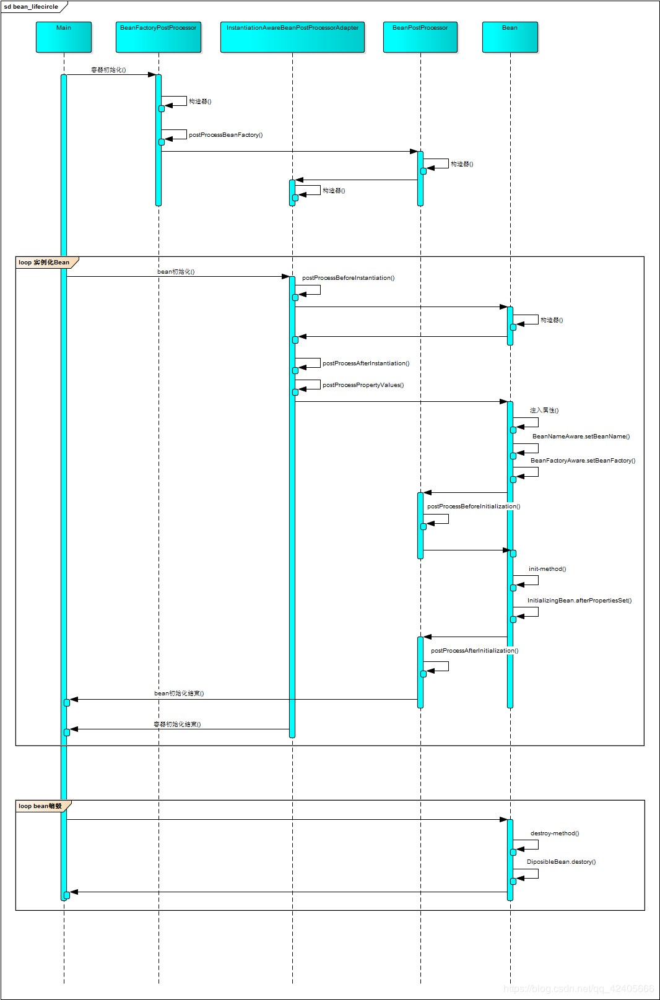
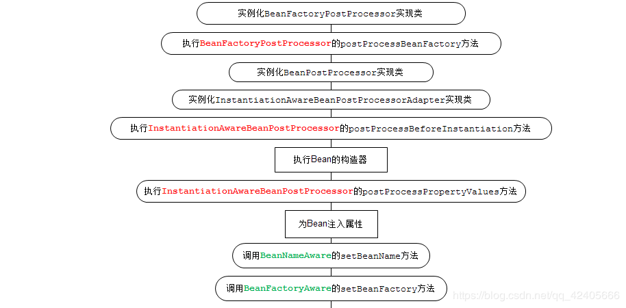
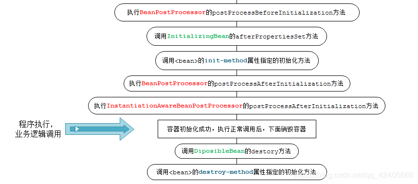

# spring bean 生命周期


生命周期图



    前言
    一、生命周期流程图：
    二、各种接口方法分类
    三、演示

## 前言

Spring作为当前Java最流行、最强大的轻量级框架，受到了程序员的热烈欢迎。准确的了解Spring Bean的生命周期是非常必要的。我们通常使用ApplicationContext作为Spring容器。这里，我们讲的也是 ApplicationContext中Bean的生命周期。而实际BeanFactory也是差不多的，只不过处理器需要手动注册。

## 一、生命周期流程图：


Spring Bean的完整生命周期从创建Spring容器开始，直到最终Spring容器销毁Bean，这其中包含了一系列关键点。


若容器注册了以上各种接口，程序那么将会按照以上的流程进行。下面将仔细讲解各接口作用。

## 二、各种接口方法分类

Bean的完整生命周期经历了各种方法调用，这些方法可以划分为以下几类：

1、Bean自身的方法：这个包括了Bean本身调用的方法和通过配置文件中的init-method和destroy-method指定的方法

2、Bean级生命周期接口方法：这个包括了BeanNameAware、BeanFactoryAware、InitializingBean和DiposableBean这些接口的方法

3、容器级生命周期接口方法：这个包括了InstantiationAwareBeanPostProcessor 和 BeanPostProcessor 这两个接口实现，一般称它们的实现类为“后处理器”。

4、工厂后处理器接口方法：这个包括了AspectJWeavingEnabler, ConfigurationClassPostProcessor, CustomAutowireConfigurer等等非常有用的工厂后处理器接口的方法。工厂后处理器也是容器级的。在应用上下文装配配置文件之后立即调用。

## 三、演示

我们用一个简单的Spring Bean来演示一下Spring Bean的生命周期。
1、首先是一个简单的Spring Bean，调用Bean自身的方法和Bean级生命周期接口方法，为了方便演示，它实现了BeanNameAware、BeanFactoryAware、InitializingBean和DiposableBean这4个接口，同时有2个方法，对应配置文件中的init-method和destroy-method。如下：

 * ```java
 package springBeanTest;

    import org.springframework.beans.BeansException;
import org.springframework.beans.factory.BeanFactory;
    import org.springframework.beans.factory.BeanFactoryAware;
    import org.springframework.beans.factory.BeanNameAware;
    import org.springframework.beans.factory.DisposableBean;
import org.springframework.beans.factory.InitializingBean;
    
    /**

    - @author qsk
      */
      public class Person implements BeanFactoryAware, BeanNameAware,
      InitializingBean, DisposableBean {
    
      private String name;
      private String address;
  private int phone;
    
      private BeanFactory beanFactory;
      private String beanName;
    
  public Person() {
          System.out.println("【构造器】调用Person的构造器实例化");
      }
    
  public String getName() {
          return name;
      }
    
      public void setName(String name) {
      System.out.println("【注入属性】注入属性name");
          this.name = name;
      }
    
  public String getAddress() {
          return address;
      }
    
      public void setAddress(String address) {
      System.out.println("【注入属性】注入属性address");
          this.address = address;
      }
    
      public int getPhone() {
          return phone;
  }
    
      public void setPhone(int phone) {
          System.out.println("【注入属性】注入属性phone");
          this.phone = phone;
      }
    
      @Override
  public String toString() {
          return "Person [address=" + address + ", name=" + name + ", phone="
                  + phone + "]";
      }
    
      // 这是BeanFactoryAware接口方法
      @Override
  public void setBeanFactory(BeanFactory arg0) throws BeansException {
          System.out
                  .println("【BeanFactoryAware接口】调用BeanFactoryAware.setBeanFactory()");
          this.beanFactory = arg0;
      }
    
      // 这是BeanNameAware接口方法
  @Override
      public void setBeanName(String arg0) {
          System.out.println("【BeanNameAware接口】调用BeanNameAware.setBeanName()");
          this.beanName = arg0;
      }
    
  // 这是InitializingBean接口方法
      @Override
      public void afterPropertiesSet() throws Exception {
          System.out
                  .println("【InitializingBean接口】调用InitializingBean.afterPropertiesSet()");
  }
    
      // 这是DiposibleBean接口方法
      @Override
      public void destroy() throws Exception {
      System.out.println("【DiposibleBean接口】调用DiposibleBean.destory()");
  }
    
      // 通过<bean>的init-method属性指定的初始化方法
      public void myInit() {
          System.out.println("【init-method】调用<bean>的init-method属性指定的初始化方法");
      }
    
      // 通过<bean>的destroy-method属性指定的销毁方法
      public void myDestory() {
          System.out.println("【destroy-method】调用<bean>的destroy-method属性指定的销毁方法");
      }
      }
    ```
    
    

2、接下来是演示BeanPostProcessor接口的方法，如下：

```java
package springBeanTest;

import org.springframework.beans.BeansException;
import org.springframework.beans.factory.config.BeanPostProcessor;

public class MyBeanPostProcessor implements BeanPostProcessor {


    public MyBeanPostProcessor() {
        super();
        System.out.println("这是BeanPostProcessor实现类构造器！！");
        // TODO Auto-generated constructor stub
    }

    @Override
    public Object postProcessAfterInitialization(Object arg0, String arg1)
            throws BeansException {
        System.out
        .println("BeanPostProcessor接口方法postProcessAfterInitialization对属性进行更改！");
        return arg0;
    }

    @Override
    public Object postProcessBeforeInitialization(Object arg0, String arg1)
            throws BeansException {
        System.out
        .println("BeanPostProcessor接口方法postProcessBeforeInitialization对属性进行更改！");
        return arg0;
    }

}
```

如上，BeanPostProcessor接口包括2个方法postProcessAfterInitialization和postProcessBeforeInitialization，这两个方法的第一个参数都是要处理的Bean对象，第二个参数都是Bean的name。返回值也都是要处理的Bean对象。这里要注意。
3、InstantiationAwareBeanPostProcessor 接口本质是BeanPostProcessor的子接口，一般我们继承Spring为其提供的适配器类InstantiationAwareBeanPostProcessor Adapter来使用它，如下：

```java
package springBeanTest;

import java.beans.PropertyDescriptor;

import org.springframework.beans.BeansException;
import org.springframework.beans.PropertyValues;
import org.springframework.beans.factory.config.InstantiationAwareBeanPostProcessorAdapter;

public class MyInstantiationAwareBeanPostProcessor extends
        InstantiationAwareBeanPostProcessorAdapter {

    public MyInstantiationAwareBeanPostProcessor() {
        super();
        System.out
                .println("这是InstantiationAwareBeanPostProcessorAdapter实现类构造器！！");
    }

    // 接口方法、实例化Bean之前调用
    @Override
    public Object postProcessBeforeInstantiation(Class beanClass,
            String beanName) throws BeansException {
        System.out
                .println("InstantiationAwareBeanPostProcessor调用postProcessBeforeInstantiation方法");
        return null;
    }

    // 接口方法、实例化Bean之后调用
    @Override
    public Object postProcessAfterInitialization(Object bean, String beanName)
            throws BeansException {
        System.out
                .println("InstantiationAwareBeanPostProcessor调用postProcessAfterInitialization方法");
        return bean;
    }

    // 接口方法、设置某个属性时调用
    @Override
    public PropertyValues postProcessPropertyValues(PropertyValues pvs,
            PropertyDescriptor[] pds, Object bean, String beanName)
            throws BeansException {
        System.out
                .println("InstantiationAwareBeanPostProcessor调用postProcessPropertyValues方法");
        return pvs;
    }

}
```

这个有3个方法，其中第二个方法postProcessAfterInitialization就是重写了BeanPostProcessor的方法。第三个方法postProcessPropertyValues用来操作属性，返回值也应该是PropertyValues对象。
4、演示工厂后处理器接口方法，如下：

```java
package springBeanTest;

import org.springframework.beans.BeansException;
import org.springframework.beans.factory.config.BeanDefinition;
import org.springframework.beans.factory.config.BeanFactoryPostProcessor;
import org.springframework.beans.factory.config.ConfigurableListableBeanFactory;

public class MyBeanFactoryPostProcessor implements BeanFactoryPostProcessor {

    public MyBeanFactoryPostProcessor() {
        super();
        System.out.println("这是BeanFactoryPostProcessor实现类构造器！！");
    }

    @Override
    public void postProcessBeanFactory(ConfigurableListableBeanFactory arg0)
            throws BeansException {
        System.out
                .println("BeanFactoryPostProcessor调用postProcessBeanFactory方法");
        BeanDefinition bd = arg0.getBeanDefinition("person");
        bd.getPropertyValues().addPropertyValue("phone", "110");
    }

}
```

5、配置文件如下beans.xml，很简单，使用ApplicationContext,处理器不用手动注册：

```xml
<?xml version="1.0" encoding="UTF-8"?>

<beans xmlns="http://www.springframework.org/schema/beans"
    xmlns:xsi="http://www.w3.org/2001/XMLSchema-instance" xmlns:p="http://www.springframework.org/schema/p"
    xmlns:aop="http://www.springframework.org/schema/aop" xmlns:tx="http://www.springframework.org/schema/tx"
    xsi:schemaLocation="
            http://www.springframework.org/schema/beans 
            http://www.springframework.org/schema/beans/spring-beans-3.2.xsd">

<bean id="beanPostProcessor" class="springBeanTest.MyBeanPostProcessor">
</bean>

<bean id="instantiationAwareBeanPostProcessor" class="springBeanTest.MyInstantiationAwareBeanPostProcessor">
</bean>

<bean id="beanFactoryPostProcessor" class="springBeanTest.MyBeanFactoryPostProcessor">
</bean>

<bean id="person" class="springBeanTest.Person" init-method="myInit"
    destroy-method="myDestory" scope="singleton" p:name="张三" p:address="广州"
    p:phone="15900000000" />

</beans>
```

6、下面测试一下：

```java
package springBeanTest;

import org.springframework.context.ApplicationContext;
import org.springframework.context.support.ClassPathXmlApplicationContext;

public class BeanLifeCycle {

public static void main(String[] args) {

    System.out.println("现在开始初始化容器");
    
    ApplicationContext factory = new ClassPathXmlApplicationContext("springBeanTest/beans.xml");
    System.out.println("容器初始化成功");    
    //得到Preson，并使用
    Person person = factory.getBean("person",Person.class);
    System.out.println(person);
    
    System.out.println("现在开始关闭容器！");
    ((ClassPathXmlApplicationContext)factory).registerShutdownHook();
}

}
```

关闭容器使用的是实际是AbstractApplicationContext的钩子方法。

## 四、程序执行结果

现在开始初始化容器
2014-5-18 15:46:20 org.springframework.context.support.AbstractApplicationContext prepareRefresh
信息: Refreshing org.springframework.context.support.ClassPathXmlApplicationContext@19a0c7c: startup date [Sun May 18 15:46:20 CST 2014]; root of context hierarchy
2014-5-18 15:46:20 org.springframework.beans.factory.xml.XmlBeanDefinitionReader loadBeanDefinitions
信息: Loading XML bean definitions from class path resource [springBeanTest/beans.xml]
这是BeanFactoryPostProcessor实现类构造器！！
BeanFactoryPostProcessor调用postProcessBeanFactory方法
这是BeanPostProcessor实现类构造器！！
这是InstantiationAwareBeanPostProcessorAdapter实现类构造器！！
2014-5-18 15:46:20 org.springframework.beans.factory.support.DefaultListableBeanFactory preInstantiateSingletons
信息: Pre-instantiating singletons in org.springframework.beans.factory.support.DefaultListableBeanFactory@9934d4: defining beans [beanPostProcessor,instantiationAwareBeanPostProcessor,beanFactoryPostProcessor,person]; root of factory hierarchy
InstantiationAwareBeanPostProcessor调用postProcessBeforeInstantiation方法
【构造器】调用Person的构造器实例化
InstantiationAwareBeanPostProcessor调用postProcessPropertyValues方法
【注入属性】注入属性address
【注入属性】注入属性name
【注入属性】注入属性phone
【BeanNameAware接口】调用BeanNameAware.setBeanName()
【BeanFactoryAware接口】调用BeanFactoryAware.setBeanFactory()
BeanPostProcessor接口方法postProcessBeforeInitialization对属性进行更改！
【InitializingBean接口】调用InitializingBean.afterPropertiesSet()
【init-method】调用<bean>的init-method属性指定的初始化方法
BeanPostProcessor接口方法postProcessAfterInitialization对属性进行更改！
InstantiationAwareBeanPostProcessor调用postProcessAfterInitialization方法
容器初始化成功
Person [address=广州, name=张三, phone=110]
现在开始关闭容器！
【DiposibleBean接口】调用DiposibleBean.destory()
【destroy-method】调用<bean>的destroy-method属性指定的初始化方法