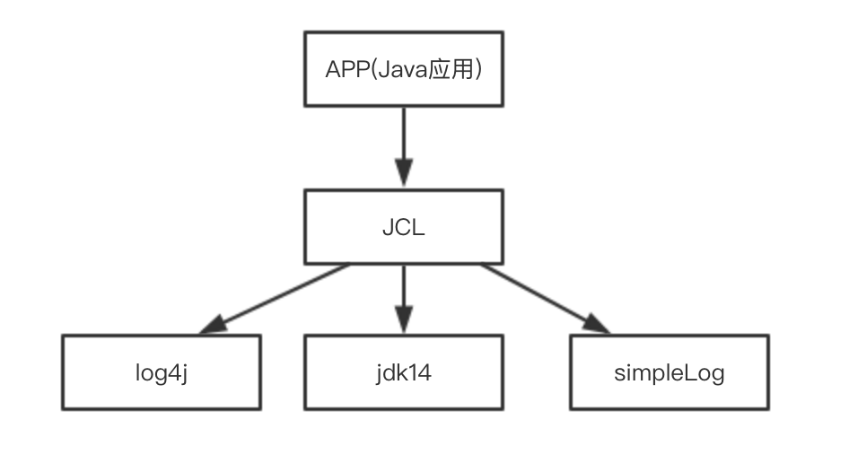
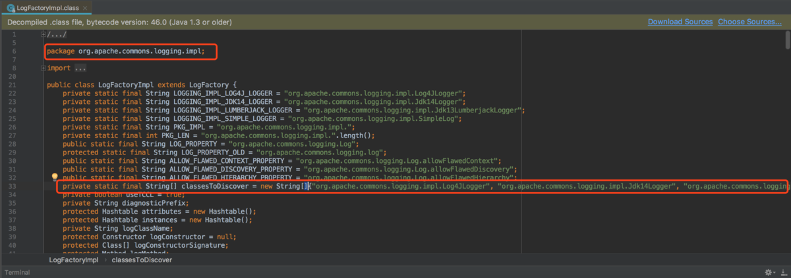
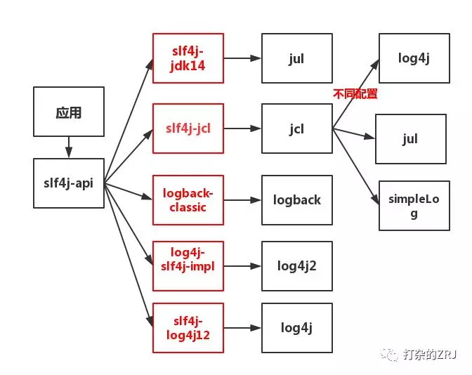
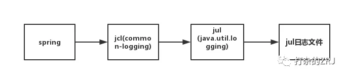
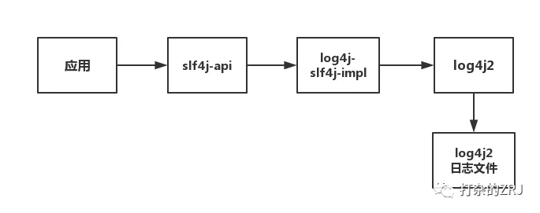
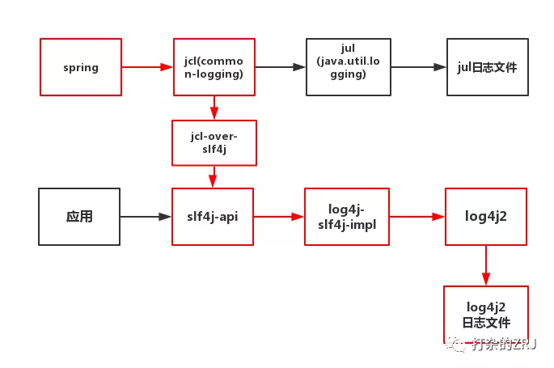
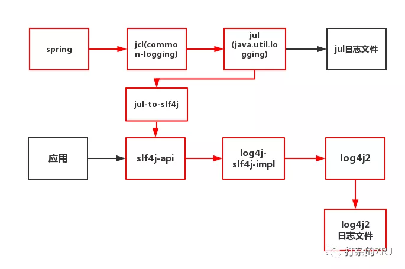
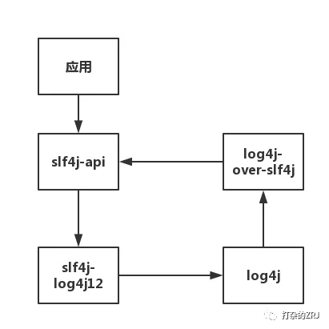

# java中的日志体系

## 引言

还在为弄不清`commons-logging.jar`、`log4j.jar`、`sl4j-api.jar`等日志框架之间复杂的关系而感到烦恼吗？
还在为如何统一系统的日志输出而感到不知所措嘛？
您是否依然存在这样的烦恼。比如，要更改spring的日志输出为log4j 2，却不知该引哪些jar包，只知道去百度一下所谓的博客，照着人家复制，却无法弄懂其中的原理？
不要急，不要方！本文带你们弄懂其中的原理，只要你静下心看本文，你就能随心所欲更改你系统里的日志框架，统一日志输出！

## 正文

### 日志框架发展史 

早年，你工作的时候，在日志里使用了log4j框架来输出，于是你代码是这么写的

```java
import org.apache.log4j.Logger;
\\省略
Logger logger = Logger.getLogger(Test.class);
logger.trace("trace");
\\省略
```

但是，岁月流逝，sun公司对于log4j的出现内心隐隐表示嫉妒。于是在jdk1.4版本后，增加了一个包为java.util.logging，简称为jul，用以对抗log4j。于是，你的领导要你把日志框架改为jul，这时候你只能一行行的将log4j的api改为jul的api，如下所示

```java
import java.util.logging.Logger；
\\省略
Logger loggger = Logger.getLogger(Test.class.getName()); 
logger.finest("finest");
\\省略
```

可以看出，api完全是不同的。那有没有办法，将这些api抽象出接口，这样以后调用的时候，就调用这些接口就好了呢？
这个时候jcl(Jakarta Commons Logging)出现了，说jcl可能大家有点陌生，讲`commons-logging-xx.jar`组件，大家总有印象吧。JCL 只提供 log 接口，具体的实现则在运行时动态寻找。这样一来组件开发者只需要针对 JCL 接口开发，而调用组件的应用程序则可以在运行时搭配自己喜好的日志实践工具。JCL可以实现的集成方案如下图所示



jcl默认的配置：如果能找到Log4j 则默认使用log4j 实现，如果没有则使用jul(jdk自带的) 实现，再没有则使用jcl内部提供的SimpleLog 实现。

于是，你在代码里变成这么写了

```java
import org.apache.commons.logging.Log;
import org.apache.commons.logging.LogFactory;
\\省略
Log log =LogFactory.getLog(Test.class);
log.trace('trace');
\\省略
```

至于这个Log具体的实现类，JCL会在ClassLoader中进行查找。这么做，有三个缺点，缺点一是效率较低，二是容易引发混乱，三是在使用了自定义ClassLoader的程序中，使用JCL会引发内存泄露。另外，他不能把所有日志的实现都包含。具体可以看commons-logging框架的LoggerFactory和LoggerFactoryImpl，里面硬编码了数组，不包含log4j2和logback的最新实现。

 org.apache.commons.logging.impl.LogFactoryImpl见下图：



于是log4j的作者觉得jcl不好用，自己又写了一个新的接口api，那么就是slf4j。

SLF4J 全称 Simple Logging Facade for Java(简单日志门面)。与JCL类似，本身不替供日志具体实现，只对外提供接口或门面。因此它不是具体的日志解决方案，而是通过Facade Pattern门面模式对外提供一些Java Logging API。这些对外提供的核心API其实就是一些接口以及一个LoggerFactory的工厂类。在使用SLF4J的时候，不需要在代码中或配置文件中指定你打算使用哪个具体的日志系统，可以在部署的时候不修改任何配置即可接入一种日志实现方案，在编译时静态绑定想用的Log库。

按照官方的说法，SLF4J是一个用于日志系统的简单Facade，允许最终用户在部署其应用时使用其所希望的日志系统。作者创建SLF4J的目的是为了替代Apache Commons Logging。即使以后又出现更新的其他日志组件，也能完全适应。


关于slf4j的集成图如下所示



如图所示，应用调了sl4j-api，即日志门面接口。日志门面接口本身通常并没有实际的日志输出能力，它底层还是需要去调用具体的日志框架API的，也就是实际上它需要跟具体的日志框架结合使用。由于具体日志框架比较多，而且互相也大都不兼容，日志门面接口要想实现与任意日志框架结合可能需要对应的桥接器，上图红框中的组件即是对应的各种桥接器！

我们在代码中需要写日志，变成下面这么写

```java
import org.slf4j.Logger;
import org.slf4j.LoggerFactory;
//省略
Logger logger = LoggerFactory.getLogger(Test.class);
// 省略
logger.info("info");
```

在代码中，并不会出现具体日志框架的api。程序根据classpath中的桥接器类型，和日志框架类型，判断出logger.info应该以什么框架输出！注意了，如果classpath中不小心引了两个桥接器，那会直接报错的！
因此，在阿里的开发手册上才有这么一条

> **强制：应用中不可直接使用日志系统（log4j、logback）中的 API ，而应依赖使用日志框架 SLF4J 中的 API 。使用门面模式的日志框架，有利于维护和各个类的日志处理方式的统一。**

JCL方式的commons-logging 是动态查找绑定。
SLF4J是静态绑定，需要加桥接包。如slf4j-log4j2。

### slf4j方式，使用log4j日志组件

 只需要在pom.xml中加入：

```xml
        <!-- 加入slf4j的核心API -->
        <dependency>
            <groupId>org.slf4j</groupId>
            <artifactId>slf4j-api</artifactId>
            <version>1.7.25</version>
        </dependency>

        <!-- slf4j静态绑定log4j12的桥接包 -->
        <dependency>
            <groupId>org.slf4j</groupId>
            <artifactId>slf4j-log4j12</artifactId>
            <version>1.7.2</version>
        </dependency>

        <!-- 实际的日志实现 log4j的依赖-->
        <dependency>
            <groupId>log4j</groupId>
            <artifactId>log4j</artifactId>
            <version>1.2.16</version>
        </dependency>
```

### 项目实战 

#### 案例一

**一个项目，一个模块用log4j，另一个模块用slf4j+log4j2,如何统一输出？**
其实在某些中小型公司，这种情况很常见。我曾经见过某公司的项目，因为研发不懂底层的日志原理，日志文件里头既有log4j.properties,又有log4j2.xml，各种API混用，惨不忍睹!
还有人用着jul的API，然后拿着log4j.properties，跑来问我，为什么配置不生效！简直是一言难尽！
OK，回到我们的问题，如何统一输出！OK，这里就要用上slf4j的适配器，slf4j提供了各种各样的适配器，用来将某种日志框架委托给slf4j。其最明显的集成工作方式有如下:


进行选择填空，将我们的案例里的条件填入,根据题意应该选log4j-over-slf4j适配器，于是就变成下面这张图


就可以实现日志统一为log4j2来输出！

`ps`:根据适配器工作原理的不同，被适配的日志框架并不是一定要删除！以上图为例，log4j这个日志框架删不删都可以，你只要能保证log4j的加载顺序在log4j-over-slf4j后即可。因为log4j-over-slf4j这个适配器的工作原理是，内部提供了和log4j一模一样的api接口，因此你在程序中调用log4j的api的时候，你必须想办法让其走适配器的api。如果你删了log4j这个框架，那你程序里肯定是走log4j-over-slf4j这个组件里的api。如果不删log4j，只要保证其在classpth里的顺序比log4j前即可！

#### 案例二

**如何让spring以log4j2的形式输出？**
spring默认使用的是jcl输出日志，由于你此时并没有引入Log4j的日志框架，jcl会以jul做为日志框架。此时集成图如下



而你的应用中，采用了slf4j+log4j-core，即log4j2进行日志记录，那么此时集成图如下



那我们现在需要让spring以log4j2的形式输出？怎么办？

OK,第一种方案，走jcl-over-slf4j适配器，此时集成图就变成下面这样了



在这种方案下，spring框架中遇到日志输出的语句，就会如上图红线流程一样，最终以log4J2的形式输出！

OK，有第二种方案么？

有，走jul-to-slf4j适配器，此时集成图如下



`ps`:这种情况下，记得在代码中执行

```
SLF4JBridgeHandler.removeHandlersForRootLogger();
SLF4JBridgeHandler.install();
```

这样jul-to-slf4j适配器才能正常工作，详情可以查询该适配器工作原理。

### 天啦噜！要死循环 

假设，我们在应用中调用了sl4j-api，但是呢，你引了四个jar包，slf4j-api-xx.jar,slf4j-log4j12-xx.jar,log4j-xx.jar,log4j-over-slf4j-xx.jar，于是你就会出现如下尴尬的场面



如上图所示，在这种情况下，你调用了slf4j-api，就会陷入死循环中！slf4j-api去调了slf4j-log4j12,slf4j-log4j12又去调用了log4j，log4j去调用了log4j-over-slf4j。最终，log4j-over-slf4j又调了slf4j-api，陷入死循环！


## 结论

希望大家通过这篇文章清楚了解java的日志体系，活学活用！