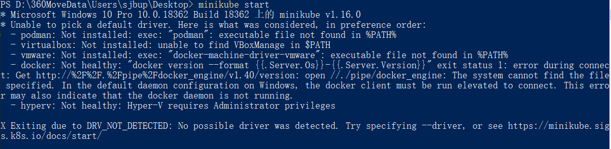

# 安装minikube

详细过程参见 https://minikube.sigs.k8s.io/docs/start/


## 1：下载 minikube并安装 

https://storage.googleapis.com/minikube/releases/latest/minikube-installer.exe


## 2：启动服务和启动

minikube start  



出现driver无法挂载的情况，在windows平台下可以有一下几种挂载方式

- [Hyper-V](https://minikube.sigs.k8s.io/docs/drivers/hyperv/) - VM (preferred)
- [Docker](https://minikube.sigs.k8s.io/docs/drivers/docker/) - VM + Container (preferred)
- [VirtualBox](https://minikube.sigs.k8s.io/docs/drivers/virtualbox/) - VM

常见的driver挂在方式见下面链接说明

https://minikube.sigs.k8s.io/docs/drivers/


这里我们以hyper-V为例进行说明，需要win10系统，并且开启 hyper-V，并执行下面命令

```powershell
Enable-WindowsOptionalFeature -Online -FeatureName Microsoft-Hyper-V -All

minikube start --driver=hyperv 
```


权限不够，需要以超级管理员方式运行power shell

在centos 8 下可以使用docker作为driver

安装docker链接：https://hub.docker.com/search?q=&type=edition&offering=community&sort=updated_at&order=desc

安装完driver之后，可以通过 来设置特定的driver

```shell
minikube start --driver=docker
```

也可以通过下面命令设置默认的driver

```shell
minikube config set driver docker
```


# 安装 kubectl 

详细安装参见 https://kubernetes.io/docs/tasks/tools/install-kubectl/#tabset-2

1. 下载最新的 kubectl命令:

   ```
   curl -LO "https://storage.googleapis.com/kubernetes-release/release/$(curl -s https://storage.googleapis.com/kubernetes-release/release/stable.txt)/bin/linux/amd64/kubectl"
   ```

   To download a specific version, replace the `$(curl -s https://storage.googleapis.com/kubernetes-release/release/stable.txt)` portion of the command with the specific version.

   For example, to download version v1.20.0 on Linux, type:

   ```
   curl -LO https://storage.googleapis.com/kubernetes-release/release/v1.20.0/bin/linux/amd64/kubectl
   ```

2. 增加执行权限

   ```
   chmod +x ./kubectl
   ```

3. 移动到path中

   ```
   sudo mv ./kubectl /usr/local/bin/kubectl
   ```

4. 测试是否安装成功

   ```
   kubectl version --client
   ```

# 集群管理

在开始安装之前，需要关闭防火墙和swap分区等。**尤其是swap分区，一定要关闭**。否则会出错

```bash
关闭selinux：
$ sed -i "s/^SELINUX=enforcing/SELINUX=disabled/g" /etc/selinux/config
$ sed -i "s/^SELINUX=permissive/SELINUX=disabled/g" /etc/selinux/config
$ setenforce 0
$ cat /etc/selinux/config

# This file controls the state of SELinux on the system.
# SELINUX= can take one of these three values:
#     enforcing - SELinux security policy is enforced.
#     permissive - SELinux prints warnings instead of enforcing.
#     disabled - No SELinux policy is loaded.
SELINUX=disabled
# SELINUXTYPE= can take one of three two values:
#     targeted - Targeted processes are protected,
#     minimum - Modification of targeted policy. Only selected processes are protected.
#     mls - Multi Level Security protection.
SELINUXTYPE=targeted

#关闭swap：
 #临时
$ swapoff -a 
 # 永久
编辑 /etc/fstab中含有swap的行，去掉或者注释掉即可

```

集群管理需要需要安装kubelet, kubeadm等包，但k8s官网给的yum源是`packages.cloud.google.com`，国内访问不了，此时我们可以使用阿里云的yum仓库镜像。

在/etc/yum.repos.d 下创建kubernetes.repo文件，内容如下：

```csharp
[kubernetes]
name=Kubernetes
baseurl=http://mirrors.aliyun.com/kubernetes/yum/repos/minikube-el7-x86_64/
enabled=1
gpgcheck=0
repo_gpgcheck=0
gpgkey=http://mirrors.aliyun.com/kubernetes/yum/doc/yum-key.gpg
        http://mirrors.aliyun.com/kubernetes/yum/doc/rpm-package-key.gpg
```


然后导入key文件

```swift
导入gpgkey文件
$ wget https://mirrors.aliyun.com/kubernetes/yum/doc/yum-key.gpg
$ rpm --import yum-key.gpg
$ wget https://mirrors.aliyun.com/kubernetes/yum/doc/rpm-package-key.gpg
$ rpm --import rpm-package-key.gpg
```

然后安装 kubelet，kubeadm，kubernetes-cni

```ruby
$ yum install -y kubelet kubeadm kubectl kubernetes-cni
$ systemctl enable kubelet
```


启动集群

kubeadm init --image-repository registry.aliyuncs.com/google_containers

如果不指定 image-repository 会出现 “[error imagepull] 错误”

如果安装成功

