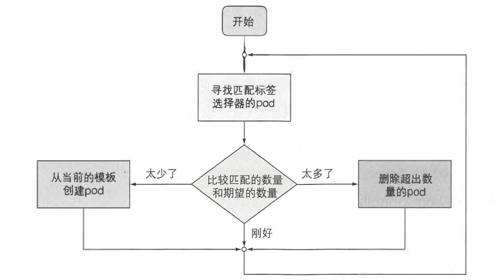
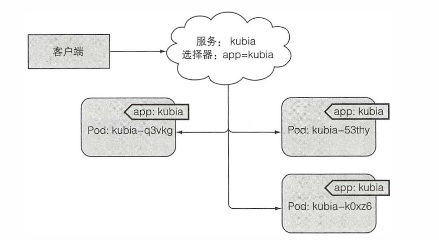
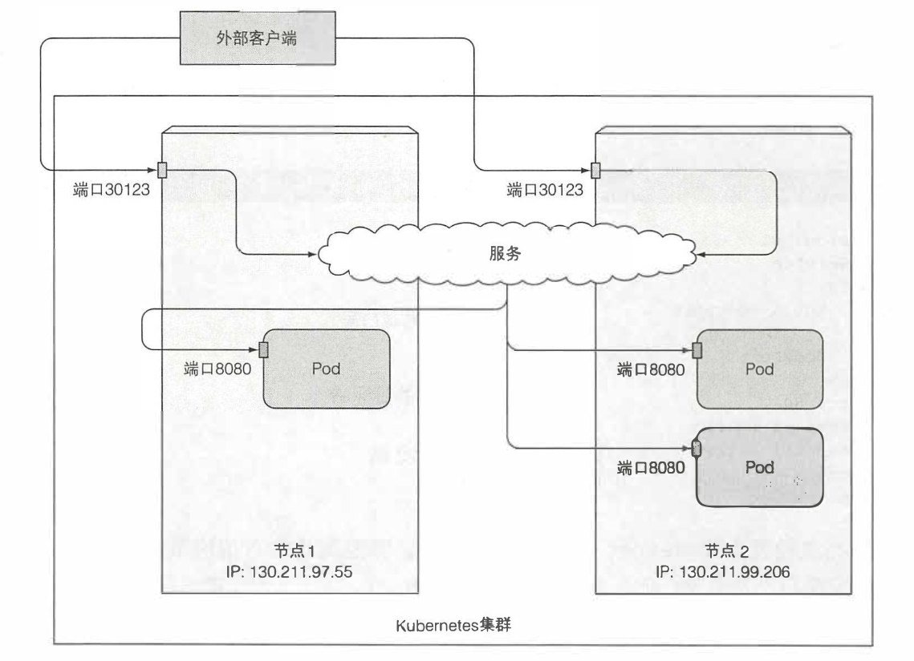
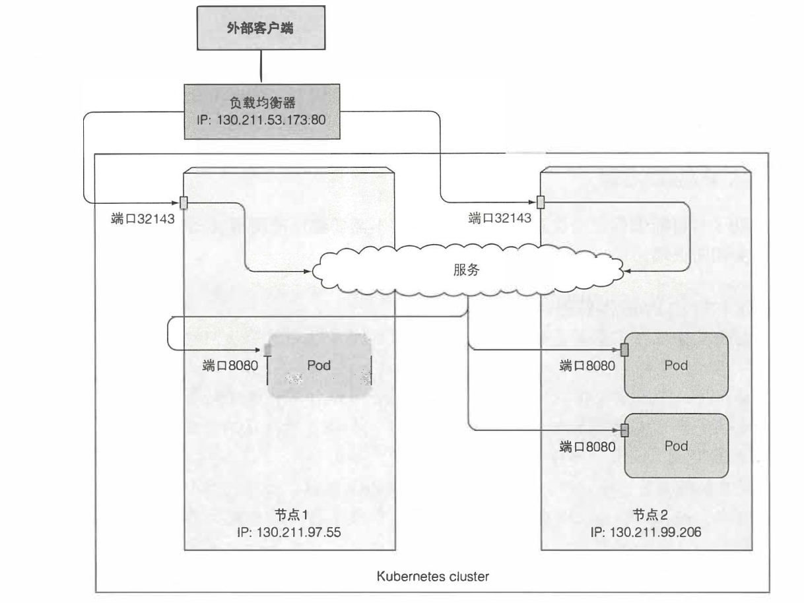
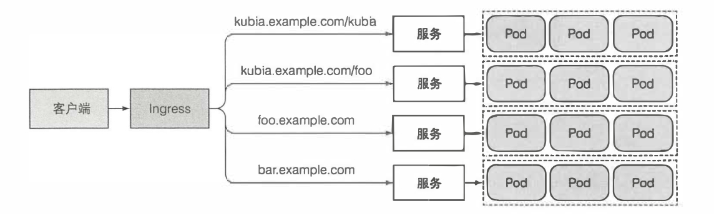
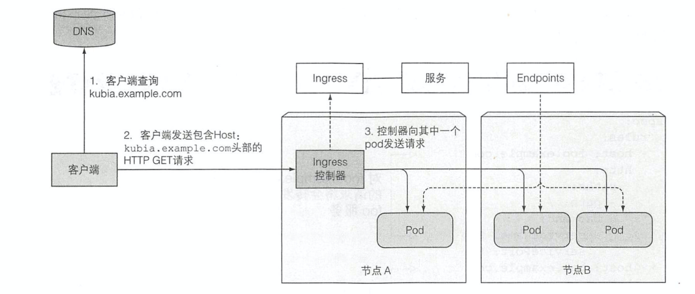

# 一. K8S 介绍

Kubernetes 是一个自动调度（位置）、配置（资源）、监管和故障处理 `微服务容器`的系统。

说到为何推广微服务，就要说说单体应用的危害：

- 扩容复杂（通常垂直扩容）
- 环境依赖复杂（动态链接库版本太多）
- 开发语言不灵活
- 迁移成本巨大（环境难统一）

原文地址 https://www.cnblogs.com/clockq/p/12283169.html

## 1.1 容器介绍

一个容器里运行的进程实际上运行在宿主机的操作系统上，就像所有其他进程一样(不像虚拟机，进程是运行在不同的操作系统上的)。但在容器里的进程仍然是和其他进程隔离的。

对于容器内进程本身而言，就好像是在机器和操作系统上运行的唯一一个进程。同时容器较虚拟机更节省硬件资源。


## 1.2 K8S 组件介绍

### Master中：

- kube-apiserver: 对外提供 RESTful 接口，使外部可以操作 K8S 集群，将用户的操作保存到 etcd 中。
- etcd：CoreOS 开发的一款轻量级、分布式的键值存储系统，用于记录 K8S 集群状态和集群内的服务发现。
- kube-controller-manager：监控 etcd 的改动，读取任务的期望（需要的实例数量），交由 kube-scheduler 调度到节点执行任务。
- kube-scheduler：负责在指定的一个或多个节点上生成任务容器并执行。同时追踪每个节点的资源利用情况，确保容器不会超出指定节点的可利用资源。

### Slave中：

- kubelet：负责从 Master 接收消息，同时也向 Master 传递消息。最终告诉 Container 需要执行的任务。

- Container（Docker）：负责在节点上拉取、创建并运行特定容器。

- kube-proxy：解决单个主机的子网对外提供服务。负责转发请求到真正的容器，和基本的复杂均衡。

  

## 总结

K8S 可提供的功能如下：

1. 保持容器的运行（健康检查与自修复）
2. 动态扩展容器实例数（K8S 可以动态修改容器数量，甚至帮助决定最佳容器数量）
3. 命中移动目标（保证多个相同容器可以在一个固定ip提供服务，并且在容器调度时也始终有效）

# 二. 使用和快速入门

[1. Docker Started](https://docs.docker.com/get-started/)
 [2. Kubernetes started](https://kubernetes.io/docs/home/)

# 三. Pod 的介绍和使用

容器是服务实例的承载体，而 Pod 就是 K8S 中对容器的承载体的抽象。它是 K8S 中最小粒度的调度单位。
 Pod 作为 K8S 中最基础最重要的概念，我们之后使用的所有对象和技术，也都是在围绕它和管理它。

## 3.1 为什么需要 Pod 概念

前面我们已经知道，K8S 就是在管理和调度容器，而容器技术已经如此成熟，为何还需要一层 Pod 的抽象来承载容器呢？

加入一层抽象只是为了更好的解耦，将 K8S 的调度功能与实际的容器技术分离，不再局限 Docker 或其他某个容器。

更可以实现一些强大功能。比如说可以在一个 Pod 内包含多个容器，以此更方便的管理一整组容器。
 同时在一个 Pod 内的容器共享 Linux 命名空间，便可以拥有相同的主机名，网络配置甚至是 IPC，使的两个微服务之间必须要的网络通信进化成进程间通信。

所有 Pod 都在同一个共享网络地址空间中，也就意味着 Pod 间没有 NAT 网关（平坦网络），每个 Pod 都知道目标 IP 地址进行之间通信。

这么一看，Pod 是不是很像真实的物理主机，而每个容器就像是主机里的一个独立进程，只不过每个进程都有自己的文件系统（因为容器的层级概念）。

## 3.2 Pod 容器划分

> Pod 内的容器尽量少

如上所说，既然 Pod 好比一个独立的物理主机，那把所有的容器放到一个 Pod 里面执行，不是又简单又方便。但是为什么不推荐呢？

首先, K8S 集群情况下，每个 Pod 之后在一个真正的 K8S Node 上运行，Pod 的粒度太大不能最大限度的利用物理资源。

其次，同一个应用的每部分服务，他们的伸缩值不同。比如说一套前后分离的 BS 应用，简单的分为前端页面层，中间逻辑层和后端存储层。当用户并发量不断增多的时候，项目瓶颈在哪里？
 如果数据库的读写最先到达瓶颈，我们可以建立存储集群，而不用增加另外两个服务来抢占存储层的资源。
 如果逻辑层的处理速度到达瓶颈（最可能先到瓶颈的），我们可以直接加大逻辑层 Pod 的实例数量，来满足用户并发需求。

这也正是 Docker 和 K8S 所期望的效果。所以除了必须情况，我们尽量使 Pod 内只包含单个容器，而容器内也只有一个服务。做到三者 1:1 关系，方便项目在之后的调度和维护工作。

## 3.3 Pod 的组成

- metadata: 关于 Pod 的元数据信息，包括名称，命名空间，标签和注解等
- spec: 描述 Pod 期望的运行状态，比如要运行的容器，运行参数，需要挂载的卷等
- status: 描述 Pod 当前的运行状态，如运行容器，容器的状态，Pod的IP等

可以通过 `kubectl explain pods` 和 `kubectl explain pod.spec` 查看对象包含的详细信息，添加参数 `--recursive`  递归列出简化的信息。

## 3.4 Pod 的启动

假如存在如下的kubia-manual.yaml文件

```
apiVersion: v1
kind: Pod
metadata:
  name: kubia-manual
  labels:
    app: test
    noderole: master
spec:
  containers:
  - name: kubia-manual
    image: kubia/manual
    imagePullPolicy: IfNotPresent
    ports:
    - name: http
      containerPort: 8080
    - name: https
      containerPort: 8443
```

使用命令 `kubectl create -f kubia-manual.yaml` 创建一个 Pod。

## 3.5 Pod 的标签

标签是一种简单却功能强大的 Kubemetes 特性，不仅可以组织 Pod，也可以组织所有其他的 Kubemetes 资源。标签是可以附加到资源的任意键值对，用以选择具有该确切标签的资源(这是通过标签选择器完成的)。

通过给这些pod添加标签，可以得到一个更有组织化的系统，以便我们理解。
 此时每个pod都标有几个标签:

- enable，它指定资源是否要启用。
- app, 它指定pod属于哪个应用、组件或微服务。
- rel, 它显示在pod中运行的应用程序版本是stable、beta还是canary。

1. 使用命令 `kubectl get po --show-labels` 列出所有 Pod 的所以 lables

```
NAME            READY   STATUS  RESTARTS    AGE     LABELS
kubia-manual    1/1     Running 0           16m     <none>
kubia-manual-v2 1/1     Running 0           2m      creat—method=manual,env=prod ld run=kubia
kubia-zxzij     1/1     Running 0           1d      run=kubia
```

1. `-L` 也可以使用命令 `kubectl get po -L creation_method,env` 将标签展开

```
NAME                READY   STATUS      RESTARTS    AGE     CREATION METHOD     ENV
kubia-manual        1/1     Running     0           16m     <none>              <none>
kubia-rnanual-v2    1/1     Running     0           2m      manual              prod
kubia-zxzij         1/1     Running     0           1d      <none>              <none>
```

1. 添加标签 `kubect label po kubia-manual method=manual`
2. 修改标签 `kubect label po kubia-manual-v2 env=debug --overwrite`
3. `-l` 利用标签筛选 `kubectl get po -l creation_method=manual`

```
NAME                READY   STATUS      RESTARTS    AGE     CREATION METHOD     ENV
kubia-manual        1/1     Running     0           16m     manual              <none>
kubia-rnanual-v2    1/1     Running     0           2m      manual              prod
```

## 3.6 利用标签调度节点

集群内的每台物理主机可能拥有不同的硬件资源，比如个别几个节点拥有 GPU 加速能力，我们就可以在将该主机加入集群的时候，加入一些 `label`，来给之后的自动化调度提供便利。

1. 给一个 node 添加标签
    `kubectl label node gpu-node1 gpu=true`
2. 将 pod 调度到指定 node，yaml 启动文件中加入下列内容

```
spec:
  nodeSelector:
    gpu: "true"
```

## 3.7 命名空间（namespace）概念

K8S 的命名空间不同于 Linux 的命名空间，它只是提供一个简单的作用域功能。可以实现将对象分割成完全独立且不重叠的多个组。也就是在不同命名空间内，可以有两个名称、标签等等完全相同的 Pod。

我们可以利用这一点，把集群内的应用分出另一个维度（开发，生产，QA）的资源。

> 虽然大多数类型的资源都与命名空间相关，即被约束在某一命名空间。但也有一些资源时命名空间共享的。同时，各个命名空间之间网络是否互通，取决于 K8S 所使用的网络解决方法。

1. 查看所有命名空间 `kubectl get ns`
2. 查看某个命名空间的资源 `kubectl get po --namespace kube-system` 或者 `kubectl get po -n kube-system`
3. 创建一个新的命名空间 `kubectl create namespace custom-namespace`

## 3.8 Pod 的删除

在删除 Pod 的过程中，实际上是在终止该 pod 中的所有容器。
 K8S 向容器的进程发送一个 `SIGTERM` 信号并等待一定的秒数（默认30），使其可以正常关闭。
 如果他没有及时关闭，则通过 `SIGKILL` 终止该进程。
 因此，为了确保容器进程总是可以正常关闭，进程要可以正确的处理 `SIGTERM` 信号。

1. 按照名字删除 `kubectl delete po kubia-manual`
2. 同时删除多个Pod  `kubectl delete po pod1 pod2`
3. 按照 label 删除 `kubectl delete po -l creation method=manual`

# 四. 部署托管的 Pod

按照之前的方式部署 Pod，已经可以正确的运行和访问服务了，但还有些隐患。
 假如 Pod 在某个节点开始执行，K8S 就会监控这个 Pod。并且会在 Pod 内的容器出错后自动重启，保持服务健康（也就是在 K8S 中运行的服务不需要什么特殊处理就拥有自恢复能力）。

- 但是如果整个节点出错，会导致整个节点上的全部 Pod 丢失，并且不会在新的节点重生。
- 即使进程没有崩溃，容器和 Pod 还在运行，但也会停止正常的功能。比如 OOM 的 JVM 程序并不会自动关闭。
- 无限循环和死锁的程序也不能正常工作，也不会继续提供正常服务。

## 4.1 存活探针

Kubemetes 可以通过存活探针 (liveness probe) 检查容器是否还在运行。可以为 Pod 中的每个容器单独指定存活探针。如果探测失败，Kubenetes 将定期执行探针并重新启动容器。

K8S 一共存在三种`存活探针`机制，分别是：

- HTTP GET 探针
- TCP 套接字探针
- Exec 探针

### HTTP GET 探针用例

```
apiVersion: v1
kind: Pod
metadata:
  name: kubia-manual
  labels:
    app: test
    noderole: master
spec:
  containers:
  - name: kubia-manual
    image: kubia/manual
    imagePullPolicy: IfNotPresent
    livenessProbe:
      httpGet:
        path: /
        port: 8088
      initialDelaySeconds: 100  #首次探针延迟时间，也就是预计的系统启动时间
      timeoutSeconds: 5         #每次探针的超时时间
```

## 4.2 了解 RC（Replication Controller）

用户直接创建的 Pod 由 Kubelet 直接管理，但由于 Kubelet 本身运行在某个特定节点上。这样也就导致，当某个节点异常终止时，Kubelet 也就会停止，他所管理的 Pod 也就无法维护和工作。

为了确保我们的服务可以始终运行，需要使用 RC 或类似的机制来管理 Pod。

### 1、 RC 的工作原理



可以看到，RC 主要由三部分组成：

- label selector(标签选择器)，用于确定 RC 作用域中有哪些 pod
- replica count(副本个数)，用于指定应该运行的 pod 数量
- pod template(pod 模板)，用于创建新的 pod 副本

> 注意，更改 RC 的标签选择器或者模板，对现有 Pod 都没有任何影响。更改标签选择器，只会导致 RC 不再去关注之前的标签。而创建 Pod 后，RC 也不会继续关心 Pod 的实际内容是否和现在的模板一致，只会在新创建的 Pod 时使用新的模板。

### 2、RC 用例

```
apiVersion: v1
kind: ReplicationController
metadata:
  name: kubia
spec:
  replicas: 3       #需要的实例数量
  selector:
    app: test       #要监控的标签选择器，可以不写，也建议不写，RC会自动推导
  template:
    metadata:
      labels:
        app: test   #RC 监控的依据
    spec:
      containers:
      - name: kubia-manual
        image: kubia/manual
        imagePullPolicy: IfNotPresent
```

### 3、修改 RC 的实例数量

```
kubectl scale rc kubia --replicas=10`
 或者
 `kubectl edit rc kubia
```

### 4、删除 RC

如果删除 RC 的同时，想保留由它创建的所有 Pod，可以执行
 `kubectl delete rc kubia --cascade=false`

## 4.3 了解 RS（Replica Set）

最初，RC 是用于复制和在异常时重新调度节点的唯一组件，后来又引入了一个名为 ReplicaSet 的类似资源。它是新一代的 RC, 并且将其完全替换掉(ReplicationController 最终将被弃用)。

RS 和 RC 几乎完全相同，K8S 也推荐使用 RS，但我们几乎不用亲自创建它，而是在创建更高等级的 Deployment 时自动创建。

### 1、RC 和 RS 的比较

|    标签比较能力     |   RC   |  RS  |
| :-----------------: | :----: | :--: |
|    根据 K=V 匹配    |  可以  | 可以 |
|    匹配多组 K=V     | 不可以 | 可以 |
| 包含某个 K（V = *） | 不可以 | 可以 |
|    不包含某个 K     | 不可以 | 可以 |

### 2、RS 用例

```
apiVersion: apps/v1beta2        #不是 v1 了
kind: ReplicaSet
metadata:
  name: kubia
spec:
  replicas: 3                   #需要的实例数量
  selector:
    matchLabels:                #不是直接的 KV 选择
      app: test
  template:
    metadata:
      labels:
        app: test
    spec:
      containers:
      - name: kubia-manual
        image: kubia/manual
        imagePullPolicy: IfNotPresent
```

### 3、selector 进阶

```
selector:
  matchExpressions:
  - key: app
    operator: In
    values:
    - kubia
```

通过将简单的 `matchLabels` 换成更具有表达能力的 `matchExpressions`，上面的例子中，产生的结果与之前一样，但明显可以进行更强大的扩展。

- key: 要操作的标签
- operator: 会进行的运算符
  - In: key 需要与 values 中某个值匹配
  - NotIn: key 不能与 values 中任何一个值匹配
  - Exists: Pod 中必须包含指定的 key，不能指定 values 字段
  - DoesNotExist: Pod 中不能包含指定 key，不能指定 values
- values: 可选的值列表，取决于运算符

> 需要注意，`matchExpressions` 内存在多个表达式时，它们的组合关系是 `and`, 也就是每个表达式都必须为 `true`，标签选择器才生效。如：
>
> ```
> selector:
>  matchExpressions:
>  - key: app
>    operator: In
>    values:
>    - kubia
>  - key: type
>    operator: In
>    values:
>    - test
> ```

> 如果想要 `or` 的组合关系，需要存在多个 `matchExpressions` 表达式。如：
>
> ```
> selector:
>  matchExpressions:
>  - key: app
>    operator: In
>    values:
>    - kubia
>  matchExpressions:
>  - key: type
>    operator: In
>    values:
>    - test
> ```

## 4.4 了解 DS（Daemon Set）

RC 和 RS 都用于在 K8S 集群上运行部署特定数量的 Pod，但有时候希望 Pod 在集群中的每个节点上刚好运行一个实例时，就不是那么容易了。

举个栗子：希望在每个节点上运行日志收集器和资源监控器。或者 K8S 自己的 kube-proxy 服务，都是在每个节点上运行单一实例的栗子。

### 使用 DaemonSet 只在特定节点创建 Pod

需要知道的是，DS 常用来运行系统服务，也就导致 DS 创建的 Pod 会绕过调度器。这也就导致我们无法利用调度器的一些功能和配置，比如当我们配置了一些节点是`不可调度的`，但 DS 还是会在该节点创建 Pod。

DS 默认会在所有节点创建 Pod，除非进行特殊配置，而有时候我们正好需要这种配置。

通过 Pod 模板的 `nodeSelector` 属性就可以完成上述操作。

使用的 yaml 如下：

```
apiVersion: apps/v1beta2
kind: DaemonSet
metadata:
  name: ssd-monitor
spec:
  selector:
    matchLabels:
      app: ssd-monitor
  template:
    metadata:
      labels:
        app: ssd-monitor
    spec:
      nodeSelector:
        disk: ssd
      containers:
      - name: main
        image: luksa/ssd-monitor
```

## 4.5 运行执行单次任务的临时 Pod

之前说到的各种资源 RC、RS、DS都是持续运行任务，即便容器内的进程执行结束，也会被调度重启，永远没有完成态。但对于一个真正的任务，可能就是一个临时的，执行后就销毁的临时 Pod，不应该重新启动。

### 1、了解 Job

Job 资源类型就是对上述问题的支持。如果节点发生故障，则由 Job 管理的 Pod 还是会在其他节点上被调度。

### 2、Job 用例

```
apiVersion: batch/v1
kind: Job
metadata:
  name: batch-job
spec:
  template:
    metadata:
      labels:
        app: batch-job
    spec:
      completions: 5                #顺序的执行5个 Pod，也就是执行 5 次
      parallelism: 2                #最多可以两个 Pod 并行
      restartPolicy: OnFailure      #重启策略，默认为 Always，如无必要，不要使用默认
      containers:
      - name: main
        image: luksa/batch-job
```

### 3、动态扩展 Job 内运行的 Pod 实例

```
kubectl scale job batch-job --replicas=3
```

## 4.6 让 Job 定期运行或稍后运行

正常 Job 资源在创建时会立即运行 Pod，如果需要在特定时间运行（如 cron 任务一样），K8S 也是支持的。

### 1、CornJob 用例

```
apiVersion: batch/v1beta1
kind: CronJob
metadata:
  name: cron-job
spec:
  schedule: "0,15,30,45 * * * *"
  jobTemplate:
    spec:
      template:
        metadata:
          labels:
            app: cron-job
        spec:
          restartPolicy: OnFailure      #重启策略，默认为 Always，如无必要，不要使用默认
          containers:
          - name: main
            image: luksa/batch-job
```

和 Job 的配置相比，CronJob 就好像在外面包裹了一层 `jobTemplate`，再多加了一个属性 `schedule`。

实际上也的确是这样，CronJob 会创建 Job，Job 会创建 Pod。

### 2、schedule 讲解

快速分析就是该属性一共有五个时间条目，分别用空格分隔

```
分钟 小时 每月第几天 每年第几月 星期几(0-6)
```

如例子中 `0,15,30,45 * * * *` 表示每 15min 运行一次。
 如果改为 `0,15,30,45 1 * * *` 表示每天 0:15、0:30、0:45 执行一次。
 如果改为 `0,15,30,45 1 1 * *` 表示每月一号的 0:15、0:30、0:45 执行一次。
 如果改为 `0 3 * * 0` 表示每个星期天的 3:00 执行一次。

# 五. 服务介绍

Pod 通常需要对来自集群内部其他 Pod 或者外部的请求做出响应。

在最初没有 K8S 的时候，管理员会通过配置文件指定服务和 IP 的映射关系，或者配置反向代理或 DNS 等服务来完成。但对于 K8S 这些操作就没用了。 因为：

- Pod 是临时的：Pod 随时可能启动或停止
- Pod 数量不固定：K8S 原生就支持动态伸缩服务，导致每种服务的实例数量并不固定
- Pod 的 IP 不固定：因为前两条，导致每个 Pod 或每种服务的 IP 并不是一直不变的

为了解决上述问题，同时可以实现原本想要的 `服务 -> IP` 解析的功能，K8S 提供了一种资源类型 —— 服务（Service）。

## 5.1 介绍服务SVC

### 1、SVC 原理图



### 2、SVC 用例

最简单的创建方式，使用 `expose` 即可，方式如下：

```
kubectl expose rc kubia --type=LoadBalancer --name kubia-http
```

也可以使用配置文件方式：

```
apiVersion: v1
kind: Service
metadata:
  name: kubia-http
spec:
  sessionAffinity: ClientIP     #会话亲和性，默认为 None
  ports:
  - name: http          #只暴露一个端口时名字可选，但同时暴露多个端口时必须指定名字
    port: 80            #暴露到宿主的端口
    targetPort: 8080    #容器开放的端口，也可以使用别名
  selector:
    app: kubia          #筛选要代理的 Pod
```

### 3、配置会话亲和性

SVC 会把请求随机的转发到一个 Pod 上，即使请求来自同一个客户端。

如果希望请求优先连接到之前使用过的 Pod 上，可以配置会话亲和性。如上例所示。上例会使服务将来自同一个客户端的代理转发到同一个Pod中。

K8S 也仅仅支持 `None` 和 `ClientIP` 两种配置。竟然连基于 hash 和 cookie 的会话亲和性都不支持？那是因为 K8S 服务不是在 HTTP 层面工作。SVC 处理 TCP 和 UDP  的包，并不关心上层网络协议内容。而 cookie 是 HTTP 协议的一部分，SVC 并不知道它们。

### 4、服务发现

通过创建服务，已经可以在固定的 `IP:Port` 代理一类 Pod 并提供服务，不论 Pod 的数量如何改变或重启，服务的暴露位置不变。

> 目前存在两种服务发现方式 `环境变量` 和 `DNS`，可以通过 Pod 配置中 spec 的 dnsPolicy 属性控制

#### * 环境变量方式

但其他的 Pod 如何和有 SVC 的 Pod 通信呢？
 不需要先创建服务，然后把地址记住传递给别的 Pod，那样太不灵活了。K8S 提供服务发现机制。
 在每个 Pod 运行之前，K8S 会初始化一系列环境变量指向现在存在的服务（和Docker一样）。只有创建的服务早于该 Pod，Pod 上的进程就可以根据环境变量正确访问到服务的地址，访问到 Pod。

#### * DNS方式

在 `kube-system` 命名空间下有个 Pod 叫 `kube-dns`，负责运行 DNS 服务。在集群中的其他 Pod 都被配置成使用其作为 DNS（修改容器的`/etc/resolv.conf`），使每个容器都知道系统中运行的所有服务。

Pod 需要拼接全限定域名（FQDN）来访问 DNS 获得服务地址。

举个栗子`svc-test.ns-test.svc.cluster.local`

- svc-test：服务名称
- ns-test：服务所在的名称空间
- svc.cluster.local：是集群本地服务名称中使用的可配置集群域后缀

> 当 Pod 和要访问的 SVC 在一个命名空间下，可以省略集群域后缀，甚至是省略命名空间，直接以服务名查找到服务IP地址，但端口还需在环境变量中获得。

可以进入 Pod 内部的 bash，执行命令测试一下，和 Docker 类似：

```
kubectl exec -it <pod-name> -- /bin/bash
```

- -i 交互模式，确保 stdin 开放，可以在 shell 中输入命令
- -t 分配一个伪终端，使 stdout 可以回显出来
- -- 用来表示 kubectl 命令项的结束，如果之后的内容没有参数（-*）则不加没什么问题，但如果有参数还没有双横杠标识，参数会被解析为 kubectl 的参数，造成一下意料之外的执行结果

> 需要注意，对于想要直接 ping 通服务 IP 的做法，是不会成功的，因为服务的集群IP 是一个虚拟IP，并且只有在和端口结合时才有意义。

## 5.2 连接集群外部的服务

目前服务可以连接集群内的一个或多个 Pod 服务，但也可能需要连接集群外的服务。

K8S 支持这种做法，并且充分利用了服务的负载均衡和服务发现，让 Pod 无须知道服务提供者到底是集群内还是集群外，都能像之前的服务一样简单使用。

### 1、介绍 Endpoints

服务并不是直接和 Pod 直接相连的。而是有一种资源介于二者之间，他就是 Endpoints。
 Endpoints 资源就是暴露一个服务的 IP 地址和端口的列表。

尽管服务在 spec 中定义了 selector 标签选择器，但在重定向之前，选择器会构建IP和端口的列表，然后存入 Endpoints  资源中。当客户端需要连接服务时，服务选择 Endpoints 存的列表中的一个，并将传入连接重定向到在该位置监听的服务器上。

### 2、配置服务的 Endpoints

因为多了这么一层抽象，所以服务的实现和功能也就更加的灵活，甚至是手动配置和更新 Endpoints 来增加 SVC 的功能。

#### 创建没有选择器的服务

```
apiVersion: v1
kind: Service
metadata:
  name: external-service
spec:
  ports:            #监听80端口的请求
  - port: 80
```

#### 为没有选择器的服务配置 Endpoints

```
apiVersion: v1
kind: Endpoints
metadata:
  name: external-service        #需要和Service的名称一致
subsets:
- addresses:
  - ip: 11.11.11.11             #服务重定向列表
  - ip: 22.22.22.22
  ports:
  - port: 80                    #Endpoints 的目标端口
```

### 3、为外部服务创建别名

```
apiVersion: v1
kind: Service
metadata:
  name: external-service
spec:
  type: ExternalName
  externalName: www.baidu.com
  ports:
  - port: 80
```

这样服务创建后，可以使用 `external-service` 来访问 `www.baidu.com:80` 的服务，这样不使用外部服务实际的 FQDN，等于在中间多了一层抽象，以后修改外部的服务时，对于集群内无须任何修改。

## 5.3 将服务暴露给外部客户端

有几种方式可以在外部访问服务：

- 简单粗暴的端口转发：使用命令`$ kubectl port-forward kubia 8080:80` 开启本机 8080 端口并将此端口的连接转发到 kubia Pod 的 80 端口上。也支持高级资源，如`kubectl port-forward deploy/kubia 8080:80` 或者 `rs`、`svc`等。端口转发仅适用于 TCP 协议。
- 服务类型设置为`NodePort`：对于NodePort服务，每个集群节点在节点本身打开一个端口，并将在该端口上接受到的请求重定向到基础服务。可以通过任何节点IP和预留的端口访问。(端口范围30000-32767)
- 服务类型设置为`LoadBalancer`：需要云基础设施的支持，来提供一个负载均衡器。属于NodePort的扩展，使的服务可以通过专有的负载均衡器访问，将请求重定向跨所有节点的端口上。客户端通过负载均衡器提供的外网 IP 连接到服务。
- 创建一个`Ingress`类型资源：通过一个IP地址公开多个服务，因为该资源运行在HTTP层上，所以可以提供比前两种更多的功能，如cookie亲和性等。

### 1、NodePort 用例

```
apiVersion: v1
kind: Service
metadata:
  name: kubia-nodeport
spec:
  externalTrafficPolicy: Local      # 只转发到同一节点的 Pod 上
  type: NodePort                    # 服务类型，默认是ClusterIP
  ports:
  - port: 80                        # 服务集群IP的端口号
    targetPort: 8080                # Pod的目标端口号
    nodePort: 30123                 # 通过集群各节点IP可访问的端口, 不配置则随机指定
  selector:
    app: kubia
```

所以可以通过

- cluster-ip:80
- nodes:30123

两种方式访问 `pod:8080` 的服务。
 

> 关于 Minikube 的一些问题：
>
> 一、 SVC 开启后还是无法访问？
>  可以运行`$ minikube service <service-name>`开启服务。
>
> 二、 如何修改 NodePort 的端口范围？
>  对于 Minikube 进行下列操作：
>  在启动时加入参数 `$ minikube start --extra-config=apiserver.service-node-port-range=1-65535`
>
> 对于 Kubernetes on Docker，进行如下操作，其他系统也是类似的方式
>
> 1. 进入 Docker 终端 `$ screen ~/Library/Containers/com.docker.docker/Data/vms/0/tty`
> 2. 修改 ApiServer 文件 `$ vi /etc/kubernetes/manifests/kube-apiserver.yaml`
> 3. 在文件内的 `command` 中添加 `- --advertise-address=192.168.65.3` 并保存
> 4. 关闭终端，然后等几分钟，ApiServer 会重新启动
> 5. 查看是否修改成功 `kubectl edit -n kube-system pod kube-apiserver-docker-desktop`

### 2、LoadBalancer 用例

```
apiVersion: v1
kind: Service
metadata:
  name: kubia-loadbalancer
spec:
  type: LoadBalancer        #服务类型，默认是ClusterIP
  ports:
  - port: 80                #服务集群IP的端口号
    targetPort: 8080        #Pod的目标端口号
  selector:
    app: kubia
```

创建服务后一段时间，云基础架构就会生成一个外部IP地址并写入服务的 `EXTERNAL-IP` 中，并可以通过 external-ip:80 端口访问负载均衡器的方式访问到代理的 Pod。



## 5.4 了解 Ingress

实现原理：
 

为什么有了 LB 服务，还需要 Ingress 呢？因为每个 LB 服务都需要一个负载均衡器和一个外网 IP，从图中可以看出 Ingress 只需要一个外网 IP 和一个自己维护的域名表即可实现 LB 服务的要求。

同时 Ingress 是 HTTP 层的数据包管理，可以提供一些 SVC 不能实现的功能。比如基于 cookie 的会话亲和性等功能。

### 1、启用 Ingress

推荐几个不错的项目和文章：

- 使用Ansible脚本安装K8S集群，介绍组件交互原理，方便直接。且不受国内网络环境影响 https://github.com/easzlab/kubeasz
- 烂泥博客：k8s安装与配置ingress https://www.ilanni.com/?p=14501

### 2、Ingress 用例

```
apiVersion: extensions/v1beta1
kind: Ingress
metadata:
  name: kubia
spec:
  tls:                          # 配置 TLS 需要的安全证书，可选
  - hosts:
    - kubia.example.com
    secretName: tls secret
  rules:
  - host: kubia.example.com     # Ingress 代理的域名
    http:
      paths:
      - path: /kubia1
        backend:                # host1 代理指定的后端服务 kubia1
          serviceName: kubia1
          servicePort: 80
      - path: /kubia2
        backend:                # host1 代理指定的后端服务 kubia2
          serviceName: kubia2
          servicePort: 80
  - host: demo.example.com      # Ingress 代理的域名
    http:
      paths:
      - path: /
        backend:                # host2 代理指定的后端服务 kubia
          serviceName: demo
          servicePort: 80
```

> 注意：某些云提供商提供的 Ingress 需要代理到 `type: NodePort` 的服务上。

启动上面用例，执行`$ kubectl get ingress`，在输出信息中可以看到 Ingress 控制器的外部 IP，然后使用 DNS 或者修改 hosts 的域名映射，添加 `kubia.example.com -> IP` 后，即可使用域名访问 Ingress 代理的服务和 Pod。

### 3、Ingress 原理



### 4、配置 Ingress 的 TLS 传输

当客户端创建到 Ingress 控制器的 TLS 连接时，控制器将终止 TLS 向下的连接。也就是客户端与控制器的连接是加密的，但控制器与后端服务和 Pod 的连接不需要加密，运行在 K8S 的 Pod 也不需要支持 TLS。

创建 TLS 秘钥和证书，需要用到 Secret 中，现在理解即可：

```
$ openssl genrsa -out tls.key 2048
$ openssl req -new -x509 -key tls.key -out tls.cert -days 360 -subj /CN=kubia.example.com
$ kubectl create secret tls tls-secret --cert=tls.cert --key=tls.key
```

## 5.5 等待 Pod 就绪信号

如果 Pod 启动后需要时间加载配置或数据，又或者需要预热数据，来防止第一次请求时间过长等问题。此时 Pod 启动后不想立即加入 SVC 提供服务，直至该 Pod 准备接续。如何实现继续往下看。

### 1、 介绍就绪探针

就绪探针和存活探针基本一样，两者之间对比如下：

|   比较项   |                       存活探针                       |                       就绪探针                       |
| :--------: | :--------------------------------------------------: | :--------------------------------------------------: |
|  作用范围  |                     Pod 内的容器                     |                     SVC 下的 Pod                     |
|  探针类型  |       HTTP GET 探针，TCP 套接字探针，Exec 探针       |       HTTP GET 探针，TCP 套接字探针，Exec 探针       |
|  检查模式  |                       周期检查                       |                       周期检查                       |
|  默认属性  | delay=0s timeout=1s period=10s #success=1 #failure=3 | delay=0s timeout=1s period=10s #success=1 #failure=3 |
| 失败后反应 |                删除容器并创建一个新的                |     从服务中移除失败的 Pod，Pod 就绪后再添加回来     |

### 2、就绪探针用例

```
apiVersion: v1
kind: Pod
metadata:
  name: kubia-readiness
  labels:
    app: test
    noderole: master
spec:
  containers:
  - name: kubia-readiness
    image: kubia/manual
    imagePullPolicy: IfNotPresent
    readinessProbe:
      httpGet:
        path: /
        port: 8088
      initialDelaySeconds: 100  #首次探针延迟时间，也就是预计的系统启动时间
      timeoutSeconds: 5         #每次探针的超时时间
```

## 5.6 headless服务来发现独立的 Pod

现在已经可以通过 SVC 均衡分流客户端到每个 Pod 的连接，SVC 会把请求随机转发到任意一个 Pod 上。
 但是，如果一个请求需要同时连接所有的 Pod 呢？目前所学是无法实现的。

通常，到执行服务的 DNS 查找时，DNS 会返回单个 IP （服务在集群的 IP）。但是，如果不让 K8S 提供服务集群 IP（将服务 spec 中的 clusterIP=None），则 DNS 服务器将返回 支持该服务的所有 Pod IP。

### headless 用例

```
apiVersion: v1
kind: Service
metadata:
  name: kubia-headless
spec:
  clusterIP: None           # 设置服务为 headless 类型
  ports:
  - port: 80
    targetPort: 8080
  selector:
    app: test
    noderole: master
```

> headless 服务同样提供跨 pod 的负载均衡，但是方式是 DNS 轮询而不是通过服务代理。

## 5.7 服务的故障排除

1. 首先检查 SVC 的 `CLUSTER-IP` 和 `EXTERNAL-IP` 是否是客户端可访问的位置。即集群内连接 `CLUSTER-IP`，集群外访问 `EXTERNAL-IP`。
2. 注意连接的端口应该是服务的公开的端口，而不是代理的 Pod 目标端口。
3. 不要尝试 `ping` 服务的IP，前面说了，服务 IP 是虚拟 IP，本身并不存在，只有和提供端口一起使用才有意义。
4. 如果定义存活探针或就绪探针要确保 Pod 已经准备就绪。
5. 使用 `kubectl describe svc` 和 `kubectl get endpoints` 检查 SVC 是否正确代理 Pod。
6. 如果使用 FQDN（全限定域名）来访问服务但不起作用，可以试试使用 `CLUSTER-IP` 是否可以访问。
7. 直接使用 Pod IP 访问服务，确保 Pod 可以正确处理请求。

# 初级篇小结

以上主要是 K8S 的基本功能使用，暂时先写这么多。
 同时也是避免篇幅太长，不方便回顾和阅读。