# 六. 挂载卷 Volume

通过学习前五章，我们已经可以部署一个安全稳定的临时应用程序了。为什么说是临时的应用程序呢？

众所周知，程序=代码+数据，现在代码已经可以运行并提供服务，同时可以产生或读取数据了，但每次重启服务或者 K8S 帮助我们调度 Pod 导致容器重启以后，之前运行的一些有价值无价值的数据也就不存在了，在本章，我们将介绍怎么处理这份有价值的数据。

原文地址 https://www.cnblogs.com/clockq/p/12297728.html

## 6.1 Volume 介绍

Kubernetes 通过定义 Volume 来满足这个需求，Volume 被定义为 Pod 这类顶级资源的一部分，并和 Pod 共享生命周期。
 也就是 Pod 启动时创建卷，Pod 删除时销毁卷，期间卷的内容不会消失，所以 Pod 因为各种原因重启容器都不会影响卷的内容，如果一个 Pod 内包含多个容器，多个容器共享此卷。

### Volume 类型

- emptyDir: 用于存储临时数据的空目录
- hostPath: 用于将工作节点的目录挂载到 Pod 中
- gitRepo: 通过检出 Git 仓库内容来初始化的挂载卷
- nfs: 用于挂载 nfs 共享卷到 Pod 中
- configMap、secret、downwardAPI: K8S 内置的用于持久化存储的特殊类型资源
- persistentVolumeClaim: K8S 的持久存储类型
- gcePersistentDisk: 谷歌高效磁盘存储卷
- awsElasticBlockStore: 亚马逊弹性块型存储卷

## 6.2 Volume 用例

### 1、最简单的 emptyDir

虽然 emptyDir 只能作为临时数据存储，不过利用容器共享卷的这一特性，在 Pod 的多个容器中共享文件还是很有效的。

```
apiVersion: v1
kind: Pod
metadata:
  name: fortune
spec:
  containers:
  - image: luksa/fortune
    name: html-generator
    volumeMounts:
    - name: html                # 使用名为 html 的卷
      mountPath: /var/htdocs    # 卷挂载位置
  - image: nginx:alpine
    name: html-server
    volumeMounts:
    - name: html
      mountPath: /usr/share/nginx/html
      readOnly: true
    ports:
    - containerPort: 80
      protocol: TCP
  volumes:
  - name: html                  # 声明一个名为 html 的卷，Pod 创建时创建，自动绑定 Pod 的生命周期
    emptyDir: {}                # 空配置，配置项下面说
```

empytDir 的存储介质由运行 Pod 的节点提供，并且默认实在磁盘上创建一个空目录。我们可以通过修改`emptyDir`的配置项，实现在工作节点的内存创建目录。

```
apiVersion: v1
kind: Pod
metadata:
  name: fortune
spec:
  ...
  volumes:
  - name: html
    emptyDir: 
      medium: Memory
```

### 2、进一大步的 gitRepo

gitRepo 是 emptyDir 的进化版，它通过克隆一个 Git 仓库的特定分支版本来初始化目录的内容（不会同步更新仓库内容）。

```
apiVersion: v1
kind: Pod
metadata:
  name: fortune-for-gitRepo
spec:
  ...
  volumes:
  - name: html
    gitRepo: 
      repository: https://github.com/clockq/***.git # 一个 git 仓库的路径
      reversion: master # 检出 git 的主分支
      directory: .      # git clone 后放在 volume 的根目录，如果不写，会在根目录下创建一个 *** 项目名的子文件夹，实际仓库内容会放到 *** 子文件夹内
```

## 6.3 可持久化的 Volume

上述例子主要实现的功能是 Pod 内的容器重启后，卷中数据可复用。以及 Pod 内的多个容器利用卷共享卷中数据。但因为上述 Volume 的生命周期和 Pod 同步，也导致了 Volume 无法做到真正的持久化。

什么是真正的持久化呢？
 当 Pod 重启后数据依旧存在，不论 Pod 是再次调度到上次的工作节点还是其他工作节点都可以加载到之前生成的持久化数据。

> 注意：如果需要 Volume 可以跨工作节点访问，就需要存储介质可以在所有工作节点可以访问。

### 1、最简单的例子 hostPath

只是将持久化数据放到工作节点的存储介质中，如果 Pod 重新调度后出现在别的工作节点，那么之前持久化的数据就没有用到，所以谨慎使用。

一般用来某些系统级别的应用（比如由 DaemonSet 管理的 Pod）读取工作节点的文件系统时使用。即便可以但也不建议用来做多个 Pod 之间的文件同步。

```
apiVersion: v1
kind: Pod
metadata:
  name: fortune-for-hostPath
spec:
  ...
  volumes:
  - name: html
    hostPath: 
      path: /data       # 工作节点的目录位置
      type: Directory   # 挂载的文件类型
```

### 2、使用 GCE 持久化卷

GCE（Google Compute Engine）是 Google 提供的云计算平台，对于使用方式日新月异，但国内不方便，所以有兴趣的看官网吧。

https://kubernetes.io/zh/docs/concepts/storage/volumes/#gcepersistentdisk

工作原理大致如下：
 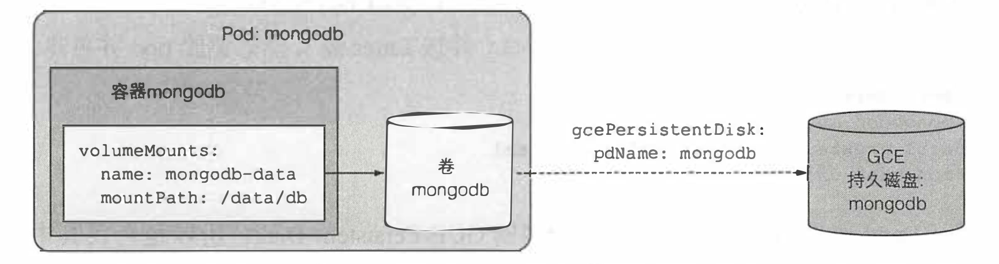

其他云平台大同小异。常见的云平台和接口如下：

- GCE（Google） =>  gcePersistentDisk
- AWS EC2（Amazon） =>  awsElasticBlockStore
- Microsoft Azure（Microsoft） =>  azureFile、azureDisk
- NFS（Linux） =>  nfs

> 需要了解更多的支持和配置信息，可以使用 `$ kubectl explain` 自行查询

## 6.4 从 Pod 解耦底层存储

掌握上面的内容可以绑定大多数的持久化存储了，但一个 Pod 的发布者（或者说服务的开发者）其实并不需要知道所使用的的存储介质，以及存储介质的具体配置，这些应该交给集群管理员来处理。

利用 Kubernetes Volume 屏蔽实际的存储技术不就是 K8S 所推崇的吗！否则就导致一个 Pod 与某种云平台产生了强依赖关系。

理想情况是，当开发人员需要一定一定数量的持久化存储是，向 K8S 请求，就好像请求 CPU，Memory等资源一样。而集群管理员的工作只需将存储介质配置好，并加入到集群的资源池中。

### 1、介绍持久卷与持久卷生命

为了使应用能够正常请求存储资源，同时避免处理基础设施细节，所以引入了持久卷和持久卷声明。

1. 集群管理员只需要创建和管理某种存储介质。
2. 然后创建 PV（PersistentVolume，持久卷）来抽象存储介质，此时可以设定存储大小和访问模式，PV 代理的存储能力会自动加入到 K8S 的资源池中。
3. 当应用发布者需要使用持久卷时，只需创建一个 PVC（PersistentVolumeClaim，持久卷声明），指定所需的最小存储容量要求和访问模式。
4. K8S 会自动找到可匹配的 PV，并绑定到此 PVC。
5. 持久卷声明即可作为一个普通卷使用，并挂载到 Pod 上。
6. 已经挂载的 PV 不能挂载在多个 PVC 上，只能等待之前的 PVC删除后释放，PV 才可以挂载到其他 PVC 上。

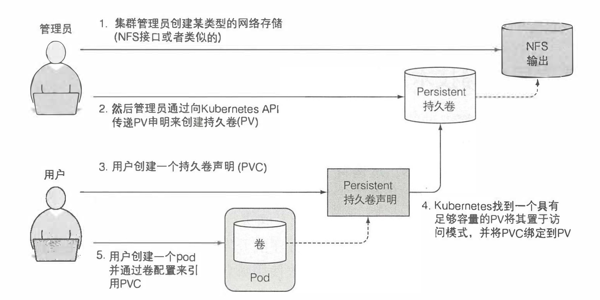

### 2、创建持久卷

```
apiVersion: v1
kind: PersistentVolume
metadata:
  name: demo-pv
spec:
  capacity:
    storage: 1Gi            # 定义存储卷大小
  accessModes:              # 定义存储访问模式
  - ReadWriteOnce           # 可以被一个用户绑定为读写模式
  - ReadOnlyMany            # 也可以被多个节点（而非Pod）绑定为只读模式
  persistentVolumeReclaimPolicy: Retain     # 定义回收策略
  # Retain => 当 PV 被删除后 PV 的内容会被保留。相应策略还有 Delete 和 Recycle，回收策略可以动态改变
  local:                    # 持久卷类型，使用本地存储
    path: /tmp/hostpath_pv/demo-pv   # 本地目录位置
```

### 3、通过持久卷声明绑定持久卷

```
apiVersion: v1
kind: PersistentVolumeClaim
metadata:
  name: demo-pvc
  namespace: demo-ns        # pvc 归属于某个 ns
spec:
  accessModes:
  - ReadWriteOnce           # 可以被一个用户绑定为读写模式
  storageClassName: ""      # 动态类配置
  resources:
    requests:
      storage: 1Gi          # 申请1Gi的存储空间
```

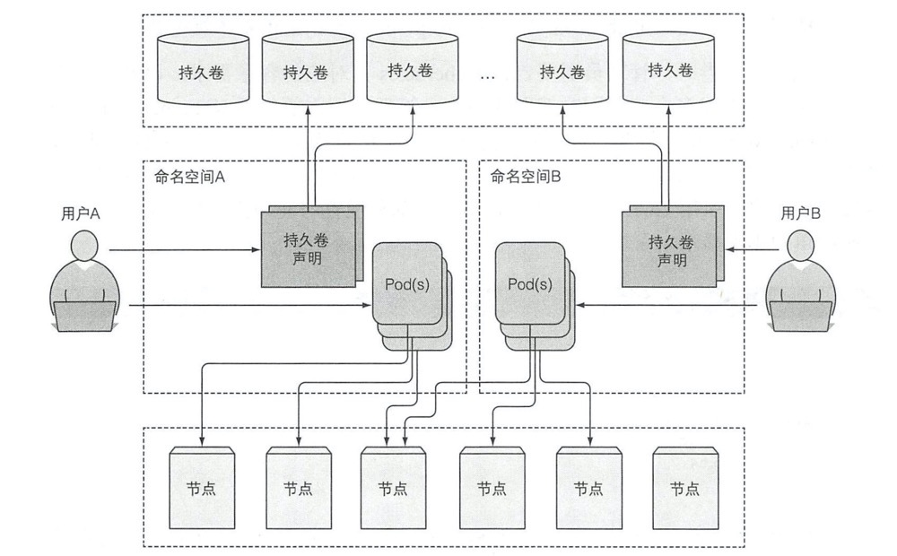

如上图一样，K8S 根据 PVC 申请的资源，去所有 PV 中找到能满足所有要求的 PV，然后两者绑定。此时列举 PVC 打印信息如下：

```
$ kubectl get pvc
NAME        STATUS  VOLUME  CAPACITY    ACCESSMODES AGE
demo-pvc    Bound   demo-pv 1Gi         RWO         13s
```

### 4、Pod 通过持久卷和持久卷声明来使用存储介质

```
apiVersion: v1
kind: Pod
metadata:
  name: fortune-for-pvc
spec:
  ...
  volumes:
  - name: html
    persistentVolumeClaim: 
      claimName: demo-pv    # 通过名字引用之前创建的 pvc
```

### 5、回收持久卷

持久化的回收，so easy，删就完了

```
$ kubectl delete pvc demo-pvc
$ kubectl delete pv demo-pv
```

PV、PVC、Pod 三者的生命周期如下：
 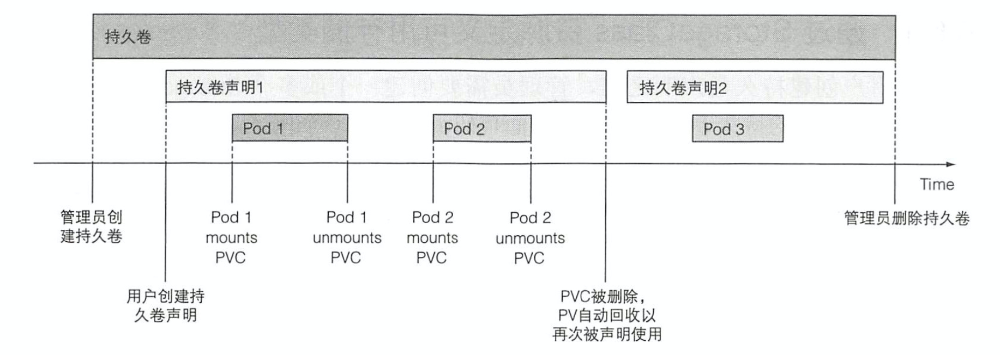

### 6、总结

两种持久卷的使用方式对比如下图。
 好处显而易见，通过中间加了一层抽象，使开发者的持久化工作更加简单，且对存储介质解耦。虽然需要集群管理员做更多的配置工作，但这是值得的。

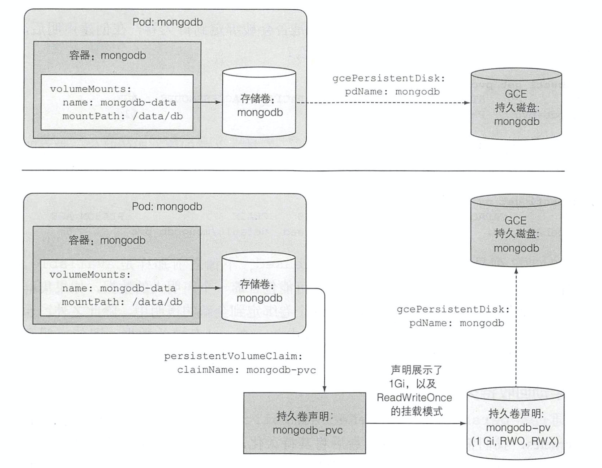

## 6.5 持久卷的动态配置

通过上面章节，我们已经可以很好很方便的使用存储资源，但每次使用都需要集群管理员配置好 PV 来支持实际的存储。

不过还好，K8S 提供 `持久卷配置` 来自动创建 PV。集群管理员只需定义一个或多个 SC（StorageClass）资源，用户在创建 PVC 时就可以指定 SC，K8S 就会使用 SC 的置备程序（provisioner）自动创建 PV。

> Kubernetes 包括最流行的云服务提供商的置备程序（provisioner），所以管理员不需手动创建。但如果 K8S 部署在本地就需要配置一个定制的置备程序。

### 1、定义 SC（StorageClass）

下面是 minikube 环境下使用 hostpath PV 的一个 SC，对于其他云平台的 SC，内容会更简单，但大同小异。

```
apiVersion: storage.k8s.io/v1
kind: StorageClass
metadata:
  name: fast
  annotations:
    storageclass.kubernetes.io/is-default-class: "false" # 是否设置为默认 SC
    creationTimestamp: "2019-12-18"
    resourceVersion: "v0.1"
provisioner: kubernetes.io/minikube-hostpath            # 调用此 SC 时使用的置备程序，对于不同的云平台选择不同内容
reclaimPolicy: Retain                                   # Supported policies: Delete, Retain
parameters:                                             # 传递给 provisioner 的参数
  type: pd-ssd
```

### 2、PVC 使用 SC 动态创建 PV

当创建下面 PVC 时就会引入上面定义的 SC，因此调用里面配置的 provisioner 来自动创建一个 PV。

```
apiVersion: v1
kind: PersistentVolumeClaim
metadata:
  name: demo-pvc
  namespace: demo-ns
spec:
  accessModes:
  - ReadWriteOnce
  storageClassName: fast        # 选择之前创建的 SC
  resources:
    requests:
      storage: 1Gi
```

> 如果引入的 SC 不存在，则 PV 配置失败（ProvisioningFailed）

### 3、不指定存储类的例子

上面使用 SC 的例子，在某些场景下，又一次的提高了应用 Pod 和 PVC 的移植性，因为不需要集群管理员一个一个的创建 PV 了。

在上面例子中，我们显式的指定了 `storageClassName: fast` 才实现了我们要的效果，如果我们把这句话删除，则 PVC 会使用默认的 SC （使用 `$ kubectl get sc` 列出所有 SC 就会看到默认的）。

如果想要 PVC 不通过 provisioner 创建，而是绑定到之手动配置的 PV 时，就要想最开始的例子一样，`storageClassName: ""` 将动态类显式的配置为空字符串。

最后，附上动态持久卷的完整图例
 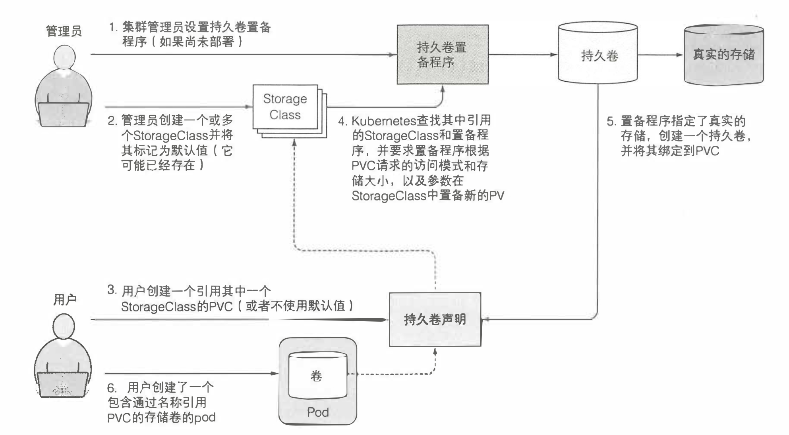

> 关于 local PV，推荐两篇不错的文章，看的我清醒不少
>
> 1. nfs动态卷实现 https://blog.csdn.net/weixin_41004350/article/details/90168631
> 2. 动态配置本地存储 https://www.infoq.cn/article/kuxs6LbGMR3f7ph*bGpx

# 七. ConfigMap和Secret来配置应用

## 7.1 配置容器化应用程序

为了服务的可扩展性和可配置性，我们写好的服务通常会有许多的配置项。配置项的表现形式通常有

1. 启动时的命令行参数
2. 配置文件
3. 环境变量

推荐环境变量优先，因为使用配置文件常常需要打入镜像或挂载到容器上，同时配置文件中包含的敏感信息也不方便透露。

下面我们就来了解一下 K8S 推荐的更优雅的解决方法。ConfigMap和Secret。

## 7.2 向容器传递命令行参数

### 1、在 Docker 中定义命令加参数

首先需要了解，Dockerfile 中定义的两个指令：

- ENTERPOINT：定义容器启动时候调用的可执行程序。类型为[ ]。
- CMD：定义传递给 ENTERPOINT 的参数。类型为[ ]。

更具体的内容请查看 https://aws.amazon.com/cn/blogs/china/demystifying-entrypoint-cmd-docker/

ok，了解了两个指令后，使用方式也是很简单

```
$ docker run [--entrypoint entrypoint] image [cmd] [args]
```

### 2、在 K8S 中配置启动命令和参数

```
apiVersion: v1
kind: Pod
metadata:
  name: demo-args
  namespace: demo-ns
spec:
  containers:
  - image: luksa/fortune:args
    command: ["/bin/command"]       # 相当于 ENTERPOINT
    args: ["arg1", "arg2", "arg3"]  # 相当于 CMD
```

通常不需要设置 `command`，除非是一些镜像中未设置 `ENTERPOINT` 的服务。

上面的内容转换为 Docker 启动语句`docker run -d --entrypoint /bin/command luksa/fortune arg1 arg2 arg3`

> 注意，`command` 和 `args` 在 Pod 启动后无法就无法修改。

## 7.3 为容器设置环境变量

```
apiVersion: v1
kind: Pod
metadata:
  name: demo-env
  namespace: demo-ns
spec:
  containers:
  - image: luksa/fortune:env
    env:
    - name: INTERVAL                # 定义的环境变量的Key
      value: "30"
    - name: INTERVAL_DESC
      value: "$(INTERVAL) seconds"
```

## 7.4 利用 CM（ConfigMap）解耦配置

ConfigMap 是环境变量方式的一种优化，主要作用是可以在多个环境中区分配置选项。

### 1、CM 介绍

Kubernetes 允许将配置选项分离到单独的资源对象 ConfigMap 中，CM 本质上就是一个 KV 对。V 可以是短字面量，也可以是一个完整的配置文件。

应用无需知道 CM 存储的内容，甚至不需要知道这种资源的存在。CM 中的内容可以直接通过持久卷和环境变量的方式传递到容器中。

### 2、创建 CM

最快的创建方式

```
$ kubectl create configmap fortune-config --from-literal=sleep-interval=25 --from-literal=sleep-interval-desc="25 seconds"

$ kubectl create configmap fortune-config-file --from-file=customkey=config-file.conf

$ kubectl create configmap fortune-config-dir --from-file=/path/dir
```

> 注意： ConfigMap 中的键名必须是一个合法的 DNS 子域，仅包含数字、字母、破折号、下划线以及小数点。而环境变量不允许有破折号。

yaml 文件创建方式

```
apiVersion: v1
kind: ConfigMap
metadata:
  name: fortune-config
  namespace: demo-ns
data:
  sleep-interval: 25
  sleep-interval-desc: 25 seconds
```

### 3、CM 作为环境变量

```
apiVersion: v1
kind: Pod
metadata:
  name: demo-env-configmap
  namespace: demo-ns
spec:
  containers:
  - image: luksa/fortune:env
    env:
    - name: INTERVAL                # 定义的环境变量的Key
      valueFrom:                    # 定义 Value 的来源
        configMapKeyRef:            # 从 CM 中取值
          name: fortune-config      # 查找的 CM
          key: sleep-interval       # 获得的 Key
          optional: true            # 当这个 Key 不存在时，Pod 也能正常启动，而不是等待 CM 的创建
```

### 4、一次性将 CM 所有内容作为环境变量

一个个添加容易出错，批量也能搞。

```
apiVersion: v1
kind: Pod
metadata:
  name: demo-env-configmap
  namespace: demo-ns
spec:
  containers:
  - image: luksa/fortune:env
    envFrom:
    - prefix: CONFIG_               # 可为空，容器内的环境变量名为 prefix + CM.Key
      configMapRef:
        name: fortune-config        # 提取的 CM
```

> 注意，K8S 不会自动转换非法的环境变量名。也就是如果一个 Key="FOO-BAR" 在 CM 中是合法的，但是在容器内被自动转为 "CONFIG_FOO-BAR" 因为包含 "-" 是非法环境变量名，所以直接就不会导入他。

### 5、CM 作为容器启动的命令行参数

`pod.spec.containers.args` 中无法直接引用 CM 的条目，但可以使用 CM 条目初始化某个环境变量，然后再在参数字段中引用该环境变量。

```
apiVersion: v1
kind: Pod
metadata:
  name: demo-args-configmap
  namespace: demo-ns
spec:
  containers:
  - image: luksa/fortune:args
    args: ["$(INTERVAL)"]               # 引用环境变量
    env:
    - name: INTERVAL
      valueFrom:
        configMapKeyRef:
          name: fortune-config
          key: sleep-interval
```

### 6、CM 作为挂载文件

需要使用 ConfigMap Volume 将 CM 中的文件挂载到容器中。示意图如下：
 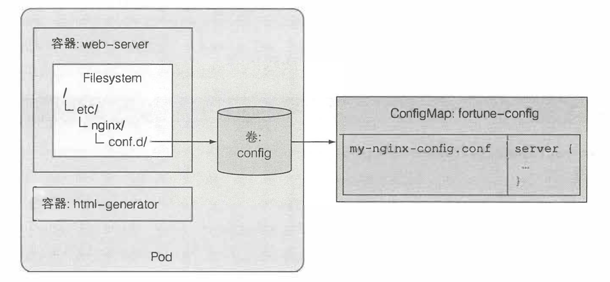

删除之前创建的 fortune-config CM，并通过 file 重新创建。

```
apiVersion: v1
kind: Pod
metadata:
  name: demo-configmap-volume
  namespace: demo-ns
spec:
  containers:
  - image: nginx:alpine
    name: web-server
    volumeMounts:
    - name: config
      mountPath: /etc/nginx/conf.d      # 挂载位置，会覆盖此目录下所有文件
      readOnly: true
  volumes:
  - name: config                        # 挂载卷名称
    configMap:                          # 通过 CM 创建挂载卷
      name: fortune-config              # 提取的 CM 名称
      defaultMode: "660"                # 设置文件访问权限，默认为644
      items:                            # 指定要暴露的条目，不指定则全部添加
      - key: nginx-config.conf          # 暴露的 Key
        path: gzip.conf                 # 条目暴露文件重命名
```

#### CM 文件挂载不覆盖

按照上面的方式挂载 CM 中的文件到容器内的某个文件夹，会导致文件夹原有的文件被隐藏。可以使用 volumeMount 额外的 subPath 字段只挂载部分卷，来解决此问题。示意图如下：
 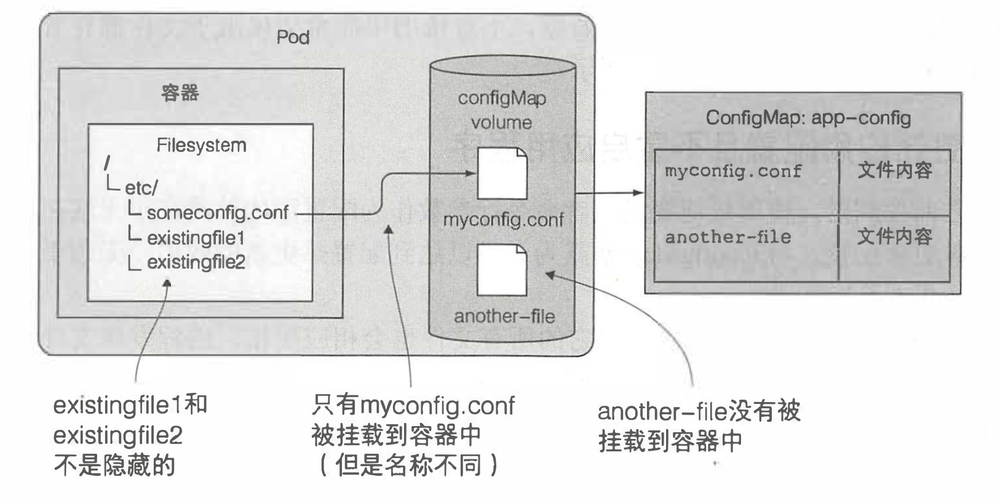

```
...
spec:
  containers:
  - image: nginx:alpine
    name: web-server
    volumeMounts:
    - name: config
      mountPath: /etc/nginx/conf.d      # 挂载位置
      subPath: gzip.conf                # 只挂载卷中的一部分，这样就不会覆盖原有内容
      readOnly: true
  volumes:
    ...
```

### 7、通过热更新 CM 更新 Pod

注意，`command` 和 `args` 在 Pod 启动后无法就无法修改，但将 ConfigMap 暴露为卷是可以达到热更新效果的。

> 但 `subPath` 挂载的卷不会自动更新。

CM 被更新后，卷中引用他的所有文件也会相应更新（因为网络原因可能有延迟），进程发现文件改动（根据代码逻辑，不自动发现的需要手动通知）后会进行重载。

> 但是热更新的耗时会出乎意料的长。

## 7.5 使用 Secret 配置敏感信息

到目前为止我们传递给 K8S 的配置信息都是非敏感数据，而敏感信息如秘钥和证书等，需要使用 Secret 资源确保数据的安全性。

### 1、Secret 介绍

Secret 和 CM 类似，均是 KV 存储，使用方式也类似，可以将 Secret 作为环境变量传递给容器，或者以卷的方式挂载。

> 另外，Secret 只会存储在节点的内存中，永远不会写入物理存储。

> 我们可以看到任意一个 Pod 内都自动挂载了一个 Secret 卷，这个卷中包含了从 Pod 内部安全访问 K8S API 服务器所需的认证信息。虽然我们希望 Pod 对集群信息无感知，但在一下别无他法的情况下，还是会用到的。

### 2、创建 Secret

1. 准备工作，先创建证书和秘钥

```
# 创建私钥
$ openssl genrsa -out https.key 2048
# 生成 CERTIFICATE
$ openssl req -new -x509 -key https.key -out https.cert -days 360 -subj/CN=kubia.example.com
```

1. 创建 `generic` 类型的 Secret，和 CM 基本一样，就是多加了一个类型参数

```
$ kubectl create secret generic fortune-https --from-file=https.key --from-file=https.cert --from-file=foo
```

> 注意，Secret 保存的条目，最大是 1M。

### 3、在 Pod 中使用 Secret

```
apiVersion: v1
kind: Pod
metadata:
  name: fortune-https
spec:
  containers:
  - image: luksa/fortune:env
    name: html-generator
    env:
    - name: INTERVAL
      valueFrom:
        configMapKeyRef:
          name: fortune-config
          key: sleep-interval
    volumeMounts:
    - name: html
      mountPath: /var/htdocs
  - image: nginx:alpine
    name: html-server
    volumeMounts:
    - name: html
      mountPath: /usr/share/nginx/html
      readOnly: true
    - name: config
      mountPath: /etc/nginx/conf.d
      readOnly: true
    - name: certs
      mountPath: /etc/nginx/certs
      readOnly: true
    ports:
    - containerPort: 80
      protocol: TCP
    - containerPort: 443
      protocol: TCP
  volumes:
  - name: html                  # 声明一个名为 html 的卷，Pod 创建时创建，自动绑定 Pod 的生命周期
    emptyDir: {}                # 空配置，配置项下面说
  - name: config
    configMap:
      name: fortune-config
      items:
      - key: nginx-config.conf
        path: https.conf 
  - name: certs
    secret:
      secretName: fortune-https
```

上面例子的示意图如下：
 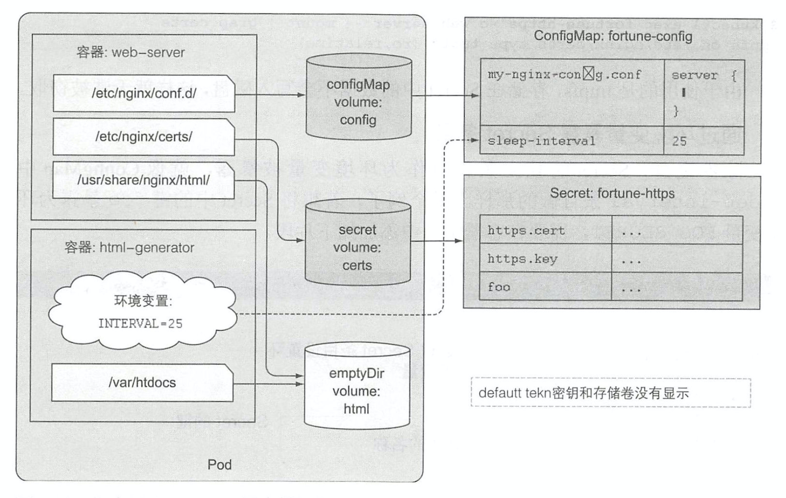

#### 通过环境变量引入

```
...
spec:
  containers:
    ...
    env:
    - name: INTERVAL
      valueFrom:
        secretKeyRef:
          name: fortune-https
          key: foo
```

但这不是一个好主意，因为应用程序可能在系统出错时打印环境变量，从而无意中暴露 Secret 信息。

> 子进程会继承父进程的全部环境变量，如果 fork 第三方的二进制程序，敏感信息可能出现泄漏风险

Docker Hub 私有镜像拉取

```
# 创建 docker-registry 类型的 secret
$ kubectl create secret docker-registry mydockerhubsecret --docker-username=admin --docker-password=pwd --docker-email=email@demo.com

# Pod 中使用 docker-registry 类型的 secret
...
spec:
  imagePullSecrets:
  - name: mydockerhubsecret
  containers:
    ...
```

### 4、CM 和 Secret 对比

当使用 kubectl get cm(secret)  -o yaml 打印详细信息时，两者区别是：

- CM 直接纯文本展示内容存储内容
- Secret 的内容会被 Base64 格式编码打印（因为 Base64 编码可以涵盖二进制数据）

# 八. 从应用访问 Pod 元数据及其他资源

## 8.1 通过 Downward API 传递元数据

之前学习的 CM 和 Secret 向应用传递预设的配置信息已经足够，但对于不可预先获得的信息，比如 Pod 的 IP，主机名或者 Pod 自身的动态名时就捉襟见肘了。
 此外，对于已经在别处定义的 Pod 标签和注解等，也不希望重复的保存和定义。

上述问题就可以通过 Downward API 解决。

### 1、Downward API 介绍

Downward API 允许我们通过环境变量或挂载卷的方式传递 Pod 的元数据。示意图如下：
 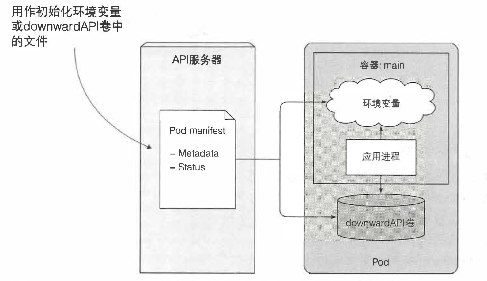

### 2、了解可用的元数据

- Pod 的名称
- Pod 的 IP
- Pod 的标签（只可以通过卷暴露）
- Pod 的注解（只可以通过卷暴露）
- Pod 所在的命名空间
- Pod 运行节点的名称
- Pod 运行所归属的服务账户名称
- 每个容器可用的 CPU 和内存的限制
- 每个容器请求的 CPU 和内存的使用量

### 3、通过环境变量暴露元数据

```
apiVersion: v1
kind: Pod
metadata:
  name: downward
spec:
  containers:
  - name: main
    image: busybox
    command: ["sleep", "9999999"]
    resources:
      requests:
        cpu: 15m
        memory: 100Ki
      limits:
        cpu: 100m
        memory: 4Mi
    env:
    - name: POD_NAME
      valueFrom:
        fieldRef:                 # 引用 manifest 中的元数据
          fieldPath: metadata.name
    - name: POD_NAMESPACE
      valueFrom:
        fieldRef:
          fieldPath: metadata.namespace
    - name: POD_IP
      valueFrom:
        fieldRef:
          fieldPath: status.podIP
    - name: NODE_NAME
      valueFrom:
        fieldRef:
          fieldPath: spec.nodeName
    - name: SERVICE_ACCOUNT
      valueFrom:
        fieldRef:
          fieldPath: spec.serviceAccountName
    - name: CONTAINER_CPU_REQUEST_MILLICORES
      valueFrom:
        resourceFieldRef:           # 引用资源中的元数据
          resource: requests.cpu
          divisor: 1m               # 定义一个基数（量词）
    - name: CONTAINER_MEMORY_LIMIT_KIBIBYTES
      valueFrom:
        resourceFieldRef:
          resource: limits.memory
          divisor: 1Ki              # K 必须大写
```

执行后的效果图如下：
 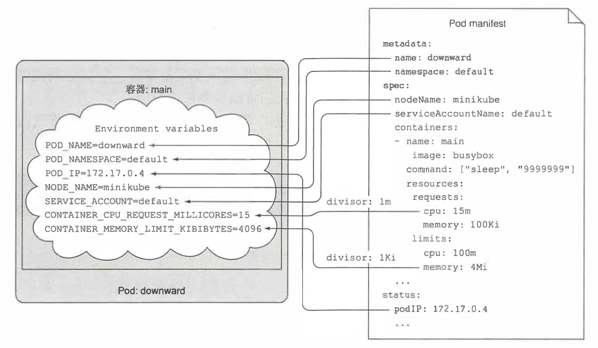

### 4、通过卷传递元数据

```
apiVersion: v1
kind: Pod
metadata:
  name: downward
  labels:
    foo: bar
  annotations:
    key1: value1
    key2: |
      one
      two
spec:
  containers:
  - name: main
    image: busybox
    command: ["sleep", "9999999"]
    resources:
      requests:
        cpu: 15m
        memory: 100Ki
      limits:
        cpu: 100m
        memory: 4Mi
    volumeMounts:               # 挂载配置
    - name: downward
      mountPath: /etc/downward
  volumes:
  - name: downward              # 定义卷
    downwardAPI:
      items:
      - path: "podName"         # 保存的文件名
        fieldRef:
          fieldPath: metadata.name
      - path: "podNamespace"
        fieldRef:
          fieldPath: metadata.namespace
      - path: "labels"
        fieldRef:
          fieldPath: metadata.labels
      - path: "annotations"
        fieldRef:
          fieldPath: metadata.annotations
      - path: "containerCpuRequestMilliCores"
        resourceFieldRef:
          containerName: main           # 资源对应的容器名
          resource: requests.cpu
          divisor: 1m
      - path: "containerMemoryLimitBytes"
        resourceFieldRef:
          containerName: main
          resource: limits.memory
          divisor: 1
```

> labels 和 annotations 可以动态更改，所以不能通过环境变量的方式传递，否则新的值无法暴露，请求重启 Pod 会出错

## 8.2 与 Kubernetes API 服务器交互

Downward API 仅可以获得 Pod 自身的元数据，还无法获得其他 Pod 的元数据信息甚至是集群的信息。

### 1、探究 Kubernetes REST API

可以通过 `$ kubectl cluster-info` 获得 API 服务器的 URL。

因为服务器使用 HTTPS 协议并且需要授权，所以需要执行 `$ kubectl proxy` 启动代理服务，负责转发请求和处理身份认证，同时确保和我们通信的是真实的 API 服务器。

> 无需传递其他参数，因为`kubectl`已经知道服务器的全部参数。启动后就会在本机8001端口开启服务并转发用户的请求。
>  之后通过浏览器或者 `curl` 工具访问 `http://localhost:8001` 即可获得集群相关信息。

### 2、从 Pod 内部与 Kubernetes API 交互

交互之前需要关注三个问题：

1. API 服务器的位置
2. 确保 API 服务器的真实性而不是一个假冒的地址
3. 通过 API 服务器的身份认证

关于问题1的解决方法如下：

1. 可以通过 `$ k get svc -A | grep kubernetes` 获得集群地址。
2. 或者按照我们之前说的，每个容器内都有各个服务的环境变量信息 `KUBERNETES_SERVICE_HOST` 和 `KUBERNETES_SERVICE_PORT`。
3. 利用集群 DNS 直接访问 `https://kubernetes`

关于问题3的解决方法如下：

```
# 查看自动分配给每个 Pod 的身份证书
$ ls /var/run/secrets/kubernetes.io/serviceaccount/

# 信任服务器证书
$ export CURL_CA_BUNDLE=/var/run/secrets/kubernetes.io/serviceaccount/ca.crt

# 生成Client Token
$ export TOKEN=$(cat /var/run/secrets/kubernetes.io/serviceaccount/token)

# 获得命名空间
$ export NS=$(cat /var/run/secrets/kubernetes.io/serviceaccount/namespace)

# 简单测试，获得当前命名空间下所有 Pod
$ curl -H "Authorization: Bearer $TOKEN" https://kubernetes/api/v1/namespaces/$NS/pods
```

### 3、通过 ambassador 容器简化与 API 交互

Pod 内部也可以使用类似 `kubectl proxy` 的方式绕过认证。

在启动主容器的同时，启动一个 ambassador 容器，并在其中运行 `$ kubectl proxy` 命令来实现与 API 服务器的交互。

示意图如下：
 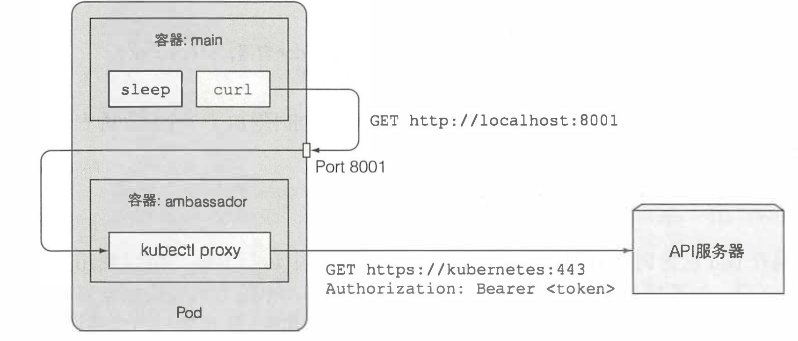

### 4、使用客户端库与 API 交互

不用多说，推荐两个官方Kuberbetes API 客户端库。

- Galang client：https://github.com/kubernetes/client-g
- Python client：https://github.com/kubernetes-incubator/client-python

# 九. Deployment：声明式地升级应用

## 9.1 更新运行在 Pod 内的应用程序

假设有一组以 RC 或 RS 代理的 Pod 正在提供服务，Pod 一开始使用 v1 版本的镜像运行。之后的开发生产过程中，创建了 v2 版本的镜像并已经推送至仓库。

接下来就要考虑怎么使用 v2 镜像替换 v1 镜像，但 Pod 创建之后不允许直接修改镜像，有以下三种方法更新 Pod：

1. 删除原本的 Pod 并重新创建基于新版本镜像的 Pod（会出现宕机时间）
2. 先创建新的 Pod ，利用 SVC 代理到新的 Pod，成功发布后删掉原本的 Pod（这就是蓝绿部署，可以逐渐的调整实例数量）
3. 利用代码实现 AB 对接（可以新老代码同时存在并运行）

方法二的示意图如下：
 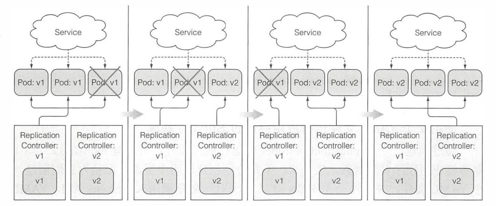

## 9.2 使用 RC（ReplicationController） 实现自动滚动升级

> 如果容器镜像使用 latest 的 tag，则 imagePullPolicy 默认为 Always，否则默认策略为 IfNotPresent。

K8S 对于上述的方法二，提供一种自动滚动升级的方式，而且非常的简单和快捷。

```
$ kubectl rolling-update kubia-v1 kubia-v2 --image=luksa/kubia:v2
```

运行该命令后，会进行下列活动：

1. 由旧的 RC 为模板，一个以 luksa/kubia:v2 为镜像的，名为 kubia-v2 的 RC 被创建，但初始副本为 0
2. 为新旧 RC 及 Pod 添加 deployment 版本的标签
3. 将 kubia-v2 副本增加 1，然后 kubia-v1 副本减少 1
4. 循环第三步，直至全部升级完成

> 此方法为什么被舍弃呢?
>
> 1. 需要添加标签而修改了 RC，这与用户预设不符，这种黑箱操作总是会导致一个问题累死都找不到原因。
> 2. 这个操作实际就是对客户端一组操作的包装，也就意味着如果执行过程中出错或网络中断，是没有事物锁帮助还原和重试的。
> 3. K8S 期望使用声明式的，如在 yaml 中修改为新版本，并运行新的 Pod 替换老的。而不是执行 rolling-update 去明确的告诉 K8S 应该如何升级。（好像 RC 的伸缩一样）

## 9.3 使用 Deployment 声明式地升级应用

Deployment 是一种更高阶的资源，用于部署应用程序并以声明的方式升级应用，而不是直接通过 RC 或 RS 进行部署。

当创建 Deployment 后，RS 会随之创建，并负责复制和管理 Pod。示意图如下：
 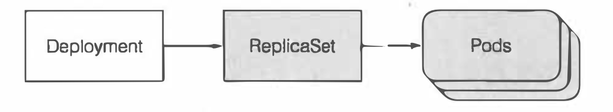

> 有了 RC，RS 为啥还需要 Deployment？
>  就如同上一章说的，当应用服务使用 `rolling-update` 滚动升级时，需要协调另一个新建的 RC 不断增删来达到升级目的。而 Deployment 资源是在 K8S 控制层上运行控制器进程解决滚动升级问题。

### 1、创建一个 Deployment

```
apiVersion: apps/v1beta1
kind: Deployment
metadata:
  name: kubia           # 因为 Deployment 可以管理多个版本，所以不需要加版本后缀
spec:
  replicas: 3           # 副本实例数量
  template:
    metadata:
      name: kubia
      labels:
        app: kubia
    spec:
      containers:
      - image: luksa/kubia:v1
        name: nodejs
```

将上述内容保存为`kubia-deployment-v1.yaml`，并
 执行 `kubectl create -f kubia-deployment-v1.yaml --record`即可创建 Deployment。

> 在创建时加入参数 `--record` 会记录历史版本号，这在之后的操作中很有用。

可以使用三种方式查看部署的进度：

```
$ kubectl get deployment kubia
$ kubectl describe deployment kubia
$ kubectl rollout status deployment kubia
```

### 2、升级 Deployment

现在升级应用，只需修改 `spec.template` 后重新 apply 即可，做到声明式和期望型的服务发布。

至于如何达到升级状态，则是由 Deployment 的升级策略决定的。

- 默认策略是执行滚动升级（RollingUpdate），需要应用程序支持多版本同时对外提供服务
- 另一种策略是一次性删除所有旧的 Pod 然后创建新的 Pod（Recreate）。

> 需要知道，修改模板中引用的 CM 或者 Secret 并不会触发 Deployment 更新，如果需要此效果，可以创建一个新的 CM 然后引用。

### 3、回滚 Deployment

如果发现新的版本不符合预期，需要回退到上个版本，可以使用下列语句：

```
# 回滚到上一版本
$ kubectl rollout undo deployment kubia
# 指定版本回滚
$ kubectl rollout undo deployment kubia --to-revision=1
```

> undo 命令也可以在滚动升级过程中运行，并直接停止升级。在升级过程中创建的 Pod 会被删除并被老版本的 Pod 替代。

版本回滚是很快的，因为在滚动升级时，老版本创建的 RS 是不会被删除的，仅仅是将副本数量清空。
 可以使用`$ kubectl rollout history deployment kubia`查看升级的历史记录。

### 4、控制滚动升级速率

```
...
spec:
  strategy:
    rollingUpdate:              # 滚动升级配置
      maxSurge: 1               # Pod 峰值最多可以超出期望副本的数量（为控制峰值资源），默认25%，数值可以是百分数，比如期望数为4，比如25%，则最多存在5个Pod；或者是绝对值，比如2，可以再多出2个副本
      maxUnavailable: 0         # 升级时相比期望数量，允许有多少 Pod 处于不可用状态，默认25%，数据和上面一样，比如25%，则最多一个 Pod 不可用，要保证最少有3个 Pod 处于可用状态
    type: RollingUpdate         # 默认的升级策略
```

上面配置产生的升级过程示意图如下：
 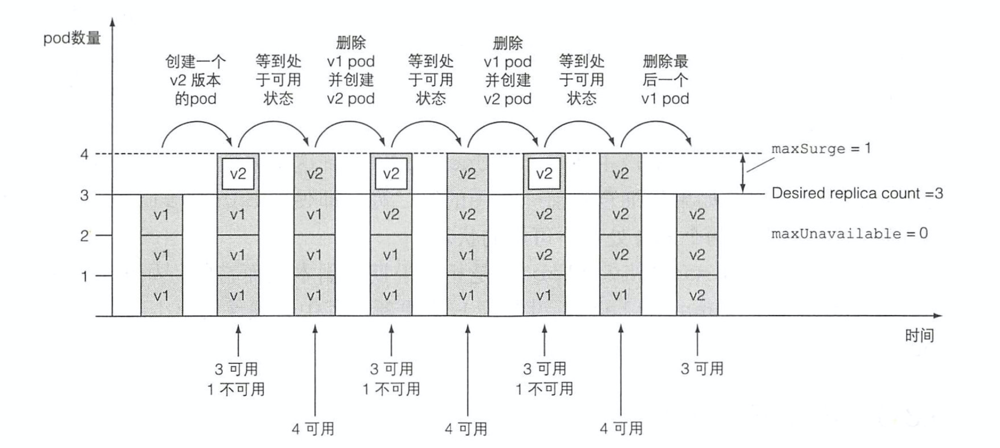

### 5、暂停滚动升级

为避免系统升级出错，还需要手动回退的问题，我们可以先升级很小的一部分 Pod，一旦升级的服务符合预期，再将剩余的 Pod 继续升级。（金丝雀发布方式，控制最小风险）

```
# 1. 先修改 Deployment 并 apply 滚动升级服务
# 2. 查看更新进度，在第一个 Pod 升级完成后立刻停止升级
$ kubectl rollout status deployment kubia
$ kubectl rollout pause deployment kubia
# 3. 一旦新版本运行符合预期，就可以恢复继续升级
$ kubectl rollout resume deployment kubia
```

### 6、阻止错误版本的滚动升级

首先介绍 `minReadySeconds` 属性，它指定新创建的 Pod 至少要成功运行多久才被视为可用。

需要的条件：

1. 容器具备正确配置的就绪探针
2. 配置 `minReadySeconds` 属性，并设置一个足够高的值（10）

整个过程是这样婶的：

1. 创建一个新版本的 Pod
2. 因为 `maxUnavailable = 0` 的配置，新的 Pod 可用之前滚动进程不会继续
3. 如果就绪探针探测失败，则因为步骤2导致升级被阻止
4. 所有容器的就绪探针都成功返回后， Pod 标记为就绪状态
5. 如果 Pod 的就绪状态不能维持超过 `minReadySeconds` 配置，则升级会被阻止
6. 如果就绪状态可以保持 `minReadySeconds` 以上，新的 Pod 升级成功，继续重复执行 1-6

# 十. StatefulSet：部署有状态的多副本应用

## 10.1 复制有状态 Pod

之前我们介绍的类型资源，创建的副本集除了名字和 IP 不同以外，其余完全一样，也就是模板中引用的简单卷还是 CM 等都是一样的。示意图如下：
 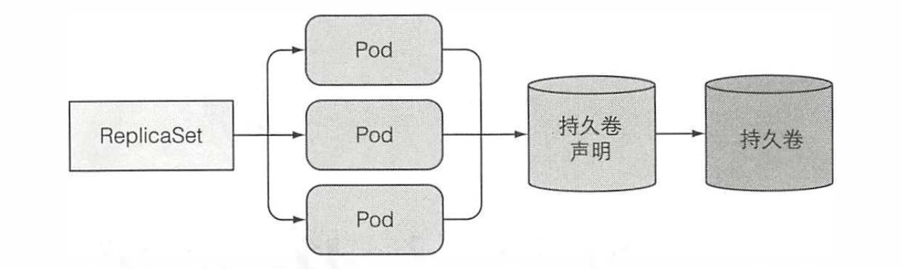

### 1、运行的每个实例都有独立的存储的多副本

- 方式一: 手动创建多个Pod，绑定各自的存储
  - 优势：简单
  - 劣势：没有高级资源的统一管理，基本是废了
- 方式二：创建多个单一副本的 RS，绑定各自的存储
  - 优势：利用 K8S 自动调度和故障处理
  - 劣势：管理很多资源，难以维护，扩展
- 方式三：投机取巧的让 RS 的多副本使用数据卷的不同子目录
  - 优势：回归一个资源管理，只需代码中创建个一致性的子目录
  - 劣势：公用存储可能出现性能瓶颈，同时稳定性变的依赖代码

### 2、每个 Pod 都提供稳定的标识

当一个新的实例替换掉老的实例后，可能会获得新的主机名和网络标识，但还使用上一个实例的数据，就可能引起一些问题。

为什么一些应用需要维护一个稳定的网络标识呢?
 这个需求在有状态的分布式应用中很普遍。
 这类应用要求管理者在每个集群成员的配置文件中列出所有其他集群成员和它们的 IP 地址或主机名(如Spark，YARN等的 slaves 配置文件)。
 但是在 Kubernetes 中，每次重新调度一个 Pod, 这个新的 Pod 就有一个新的主机名和 IP 地址，这样就要求当集群中任何一个 成员被重新调度后，整个应用集群都需要重新配置。

## 10.2 了解 StatefulSet

可以创建 StatefulSet 资源来代替 RS 运行此类 Pod，它是专门定制的一类应用，在 StatefulSet 中的每个实例都是不可替代的个体，且拥有稳定的名字和状态。

### 1、对比 StatefulSet 和 RS

StatefulSet 和 RS 就好比宠物和牛，而且 StatefulSet 最初也叫 PetSet。
 对于有记忆（存储）的动物就好比宠物，我们无法获得一个一模一样的宠物，所以需要细心照料。而没有记忆的动物就好像农场主千百头牛中的一头，不需要给予太多的关心，反而可以随时的删除和替换。

### 2、提供稳定的网络标识

StatefulSet 创建的每个 Pod 都是名称加上从零开始的索引命名，这个命名同样体现在 Pod 的主机名，以及 Pod 对应的固定存储上。不同于 RS 的随机，这样有规则的命名更加方便管理。

#### 控制服务介绍

有状态的 Pod 有时候需要通过其主机名来被定位。无状态的服务在处理请求的时候，随便选择一个可用 Pod 即可，但对于有状态 Pod 它们每个的内容是不同的，所以每次连接和处理的也不同。

为实现上方效果，一个 StatefulSet 需要创建一个用来记录每个 Pod 网络标记的 headlessService。
 通过这个 Service 使每个 Pod 拥有独立的 DNS 记录，使集群内的伙伴或客户端可以通过主机名找到它。

#### 替换消失的宠物

当 StatefulSet 管理的 Pod 实例因为节点故障或人工删除的原因消失时，StatefulSet 会和 RS 一样重新创建一个  Pod 维持期望的实例数量。但和 RS 不同的是，它重新创建的 Pod 会和之前的 Pod 有完全一致的名称、主机名、存储卷。

#### 扩缩容 StatefulSet

扩容一个 StatefulSet 会使用下一个还没有用到的顺序索引值创建一个新的 Pod 实例。缩容时也是会删除最高索引值的实例，使的扩容缩容的结果都是可预知的。

因为 StatefulSet 缩容的时候，每次只会操作一个 Pod 实例，所以有状态应用的缩容都会相对较慢。
 举例来说，如果缩容是线性且缓慢的，则分布式存储应用就有机会把即将关闭的节点数据复制到其他节点，保证数据安全。

> 基于以上原因，StatefulSet 在存在不健康实例的情况下是不允许缩容的。

### 3、提供稳定的专属存储

一个有状态的 Pod 需要拥有自己的存储，即使该 Pod 被重新调度并且产生不一致的标识，也必须挂载和之前相同的存储。

很明显，有状态的 Pod 的存储必须是持久的，并且与 Pod 解耦。利用之前学习的 PVC 解耦，同时保证每个 Pod 绑定一个单独的 PVC 就保证绑定了各自的 PV。

#### 在 Pod 模板中添加卷声明模板

如何保证 StatefulSet 使用同一模板，但可以绑定不同的 PVC 呢？
 解决方式就像创建 Pod 一样，也有一个 PVC 模板来创建和管理 PVC，并且这些持久卷声明会在创建 Pod 前完成创建。

> 持久卷可以由集群管理员提前创建或使用 SC 自动创建。

#### 持久卷的创建和删除

扩容一个实例，会创建一个 Pod 和对应的 PV、PVC 两三个资源。但当收缩一个实例时，则只会删除 Pod 而保留 PV、PVC，原因不必多说。

> 如果需要释放对应的 PV、PVC 要手动来完成，但并不建议这么做。

#### 重新挂载持久卷

因为缩容时 StatefulSet 保留了 PV、PVC，所以在随后的扩容中，新的 Pod 会期望使用之前的数据，也就会使用之前保留下来的 PV、PVC。

### 4、StatefulSet 的保障

相比 RS，StatefulSet 不仅拥有稳定的标记和独立的存储，还有一些其他的保障。

通常来说，无状态的 Pod 可以被替代，但有状态的 Pod 只能被消灭和复活。
 但是，当 Pod 的状态不能确定呢？如果 StatefulSet 又创建了一个一模一样的 Pod 呢？
 这也就意味着两个完全一致的 Pod 会绑定同一个 PV，并同时写相同的文件。
 所以 K8S 要确保上述问题不会发生，也就要保证有状态的 Pod 实例是 `at-most-one` 语义。

## 10.3 使用 StatefulSet

要使用 StatefulSet，需要以下几种资源：

1. 存储数据的持久卷
2. 一个控制的 Service
3. StatefulSet 本身

### 1、手动创建 PV

分别创建 pv-a、pv-b、pv-c 三个持久卷，这里不墨迹了。

### 2、创建控制 Service

创建用于在有状态的 Pod 之间提供网络标识的 headlessService。

```
apiVersion: v1
kind: Service
metadata:
  name: kubia
spec:
  clusterIP: None       # 之前讲过 headless 模式的 SVC
  selector:
    app: kubia
  ports:
  - name: http          # 使用名字代理 Pod 端口
    port: 80
```

### 3、创建 StatefulSet

```
apiVersion: apps/v1beta1
kind: StatefulSet
metadata:
  name: kubia
spec:
  serviceName: kubia
  replicas: 2
  template:
    metadata:
      labels:
        app: kubia
    spec:
      containers:
      - name: kubia
        image: luksa/kubia-pet
        ports:
        - name: http            # 端口命名
          containerPort: 8080
        volumeMounts:
        - name: data
          mountPath: /var/data
  volumeClaimTemplates:             # 持久卷声明模板，注意是 list 类型
  - metadata:
      name: data
    spec:
      resources:
        requests:
          storage: 1Mi
      accessModes:
      - ReadWriteOnce
```

> StatefulSet 创建的 Pod 会线性的缓慢的逐个创建。只有当前一个 Pod 运行并处于就绪状态才会继续向后创建 Pod。

### 4、使用服务

现在有状态的集群已经启动成功，但之前创建的 SVC 是 headless 模式，所以不能通过它来访问我们的 Pod，而是要直接连接每个单独的 Pod 来访问。

#### 方式一：通过 API 服务器通信

可以利用 `kubectl proxy` 开启代理服务，跳过身份验证后请求这个 URL：

```
<apiServerHost>:<port>/api/vl/namespaces/default/pods/kubia-0/proxy/<path>
```

不过这种方式会造成不必要的网络跳转，示意图如下：
 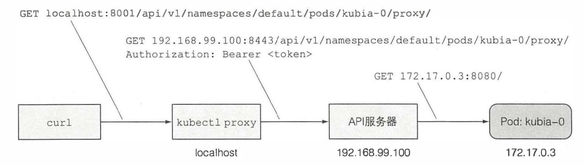

#### 方式二：使用非 headless 的 SVC 暴露 Pod

就和我们掌握的普通 SVC 一样，代理之前 StatefulSet 创建的所有 Pod。对于客户端的所有连接，也会被 SVC 自身的负载均衡随机分配到任意 Pod。

```
apiVersion: v1
kind: Service
metadata:
  name: kubia-public
spec:
  selector:
    app: kubia
  ports:
  - name: http
    port: 80
```

## 10.4 在 StatefulSet 中发现伙伴节点

对于集群型应用，通常需要和伙伴节点彼此通信和发现（如 Spark集群要配置主机名列表、分布式数据库要知道各节点的 IP）

需要知道，请求 headless 类型的 SVC，会返回一个记录着所有 Pod 主机和地址的 SRV 记录。

如果用户不想通过 `kubia-public` 轮询访问 Pod，而是想获得所有 Pod 的数据，就必须发送多次请求，并且包含所有 Pod 才行。

## 10.5 了解 StatefulSet 如何处理节点失效

我们知道 K8S 必须保证每个有状态的 Pod 都是独特且唯一的。 因此 StatefulSet 要保证不会有两个拥有完全相同标记和存储的 Pod 在同时运行。
 这就需要确保在一个有状态 Pod 完全停止或未确定是否停止前，都不能创建它的替代者。

### 1、模拟一个节点的网络断开

在非 minikube 的环境可以尝试关闭网络适配器来模拟网络中断情况。

当节点的网络中断后，在此节点上的 Kubelet 服务就无法与 API 服务器通信，也就无法汇报本节点的健康情况以及节点资源的情况。
 一段时间后，就可以在控制台看到中断节点的状态被置为`NotReady`。
 同时，可以看到位于中断节点上的Pod的状态被置为`Unknown`。
 如果网络重新连通，Kubelet 会重新汇报它所在的节点状态和资源状态，一切回到没有中断之前的状态。
 如果网络中断几分钟后，还没有连通。则 `Unknown` 标记的 Pod 会被标记为 `Deleting`。
 但这个 Pod 所在的节点网络中断，也就意味着负责和 API 服务器通信的 Kubelet 也无法与主节点通信，就会让导致这个节点上的 Pod 偷偷的存活下去。

### 2、手动删除 Pod

如果已经知道网络中断一时之间无法恢复，并且要保证服务可用的实例数量，我们就需要把 Pod 重新调度到其他节点。

按照之前所学正常的删除 Pod 会出现前面说的问题（Pod 还在离线的节点运行），所以需要强制删除才可以。

```
$ kubectl delete po kubia-0 --force --grace-period 0
```

# 进阶篇小结

关于 K8S 的进阶资源就介绍到这里，通过本篇的学习，就可以搭建出一个可持久化，可升级的有状态应用集群了，这在简单项目的运维和生产中已经足够了。