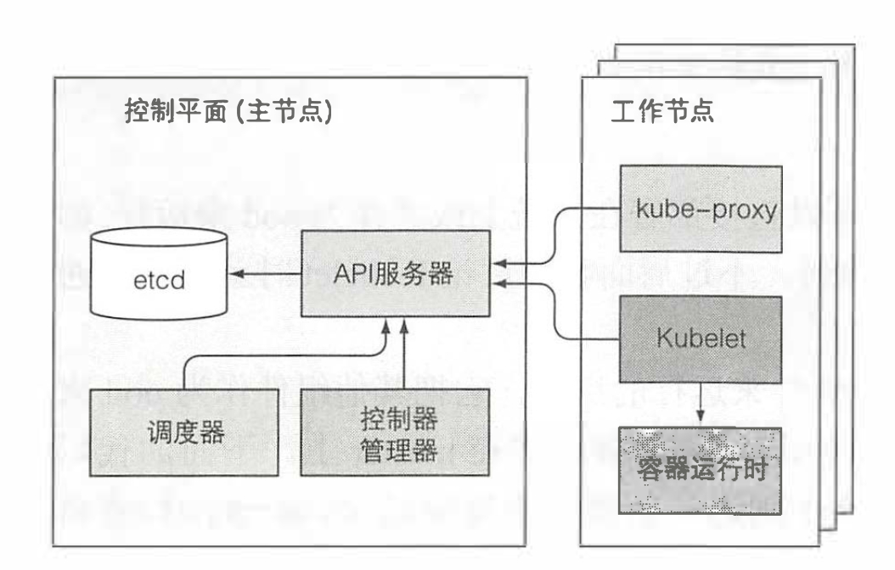

这篇开始深入了解 Kubernetes 的工作原理和实现方式。

# 十一. 了解 Kubernetes 机理

## 11.1 了解架构

| Master 控制组件 |    工作节点组件     |       附加组件        |
| :-------------: | :-----------------: | :-------------------: |
|   （Kubelet）   |       Kubelet       |      DNS 服务器       |
|   API 服务器    |     容器运行时      |   dashboard 仪表盘    |
| etcd 分布式存储 | kube-proxy 服务代理 |    Ingress 控制器     |
|   控制管理器    |          -          | Heapster 容器集群监控 |
|     调度器      |          -          |   容器网络接口插件    |

> 在主节点上也会隐式的运行一个 Kubelet 实例，它会使主节点和工作节点中的其他组件可以以 Pod 的形式部署和存在，这样整个集群中也就只有 Kubelet 自身需要以常规系统组件方式运行了。

以上组件的协同关系示意图如下：
 

### 组件间的分布式特性

通过上图可以发现，只有 `API 服务器` 与 `etcd` 通信，其他组件都是通过 `API 服务器` 修改或查看 `etcd` 的状态内容。

在工作节点上运行的组件会在每个节点上运行单个实例，这没什么问题。
 在 Master 节点的组件中，`API 服务器` 和 `etcd` 可以多实例同时并行工作。

只有 Kubelet 常规方式运行，其他组件均以 Pod 形式运行。

### K8S 如何使用 etcd

我们学习的 Pod、RC、RS、CM 等等资源，都需要把 manifest 持久化以方便服务的重启和容灾。而 etcd 就是存放这些资源的 manifest 的地方。

etcd 是一个兼具一致性和高可用的分布式 K-V 数据库，它是保存 K8S 所有集群数据的后台数据库。通过抽离出单独存储，使的 K8S 的核心组件也可灵活组合。

etcd 在集群内的唯一客户端只有 API 服务器，其他组件只能通过 API 服务器代理来完成数据的修改，这样带来的好处就是 `增强乐观锁（串行读写）`和`验证系统健壮性`。

K8S 的所有数据都存放在 `Key = /registry` 下：

```
# 获得以 /registry 为 Key 的目录下所有资源
$ etcdctl ls /registry
/registry/configmaps
/registry/daemonsets
/registry/deployments
/registry/events
/regis七ry/namespaces
/registry/pods

# 依次向下查询，直至最底层资源时，可以看到内容就是 Pod 的 json 定义
$ etcdct1 get /registry/pods/default/kubia-159041347-wtGga
{"kind": "Pod", "apiVersion": "v1", "metadata": {"name" : "kubia-159041347-wtGga", "generateName": "kubia-159041347-", "namespace": "default", "selfLink": ...
```

etcd 使用 `RAFT一致性算法` 来保证集群一致性。算法要求超过一半的法定节点参与投票才可以进行到下一个状态。所以我们希望 etcd 集群的实例数量尽可能是奇数。

### API 服务器到底做了什么

### API 服务器如何通知客户端资源变更

### 了解调度器

## 11.2 控制器如何协助

## 11.3 运行中的 Pod 到底是什么

## 11.4 跨 Pod 网络

## 11.5 服务是如何实现的

## 11.6 运行高可用集群