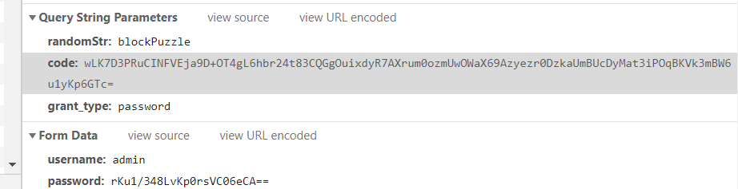
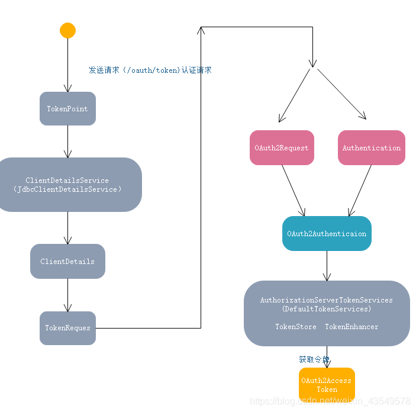

Pigx中的登录认证

# 验证码处理

用户输入完用户名和密码点击登录，会弹出滑动验证框，用户进行滑动进行验证。

## 验证码路由配置

这个过程主要是在gateway中的RouterFunctionConfiguration 进行设置的：

```
@Bean
public RouterFunction routerFunction() {
   return
         //获得拖动验证码
         RouterFunctions
         .route(RequestPredicates.path("/code").and(RequestPredicates.accept(MediaType.TEXT_PLAIN)),
               imageCodeCreateHandler)
         //增加拖动验证码校验
         .andRoute(RequestPredicates.POST("/code/check").and(RequestPredicates.accept(MediaType.ALL)),
               imageCodeCheckHandler);

}
```

## 验证码缓存处理


## 验证码验证返回


这里设置的/code 加载验证码， /code/check 进行验证码的验证。验证成功会返回 ：

```json
{
	"code": 0,
	"msg": null,
	"data": {
		"repCode": "0000",
		"repMsg": null,
		"repData": {
			"captchaId": null,
			"projectCode": null,
			"captchaType": "blockPuzzle",
			"captchaOriginalPath": null,
			"captchaFontType": null,
			"captchaFontSize": null,
			"secretKey": null,
			"originalImageBase64": null,
			"point": null,
			"jigsawImageBase64": null,
			"wordList": null,
			"pointList": null,
			"pointJson": "AoisRt4TRVdyCQUBjD0KSZXqjMzMpuWYQTCFaBth7Pk=",
			"token": "a69b544a2f3f46818f349dd2383c66e1",
			"result": true,
			"captchaVerification": null
		},
		"error": false,
		"success": true
	}
}
```

## 客户端数据加密处理


## 客户端发送认证请求

1：用户登录的时候发送请求：

Request URL: 

http://localhost:8080/auth/oauth/token?randomStr=blockPuzzle&code=zVc5JanZClRNi86ojGwlimAqRcd9%2FQrOn0hc58gU5em7fHRCDK2IaHsa24ZyJVggAajGiFQfXX%2FRsshBZKLLgvqKuwEMDenNxeU6gvCTQ0Q%3D&grant_type=password





这里需要注意grant_type=password说明这是oauth的第三种 密码方式，也就是说第三方应用（前端应用）作为一个接入端采用发送密码的方式进行认证。


请求路径说明：

1./oauth/authorize 发送请求认证

2./oauth/token 获取accesstoken

这个路径不是在配置文件配置出来的，是spring security 默认的处理路径



### org.springframework.security.oauth2.provider.endpoint;源码分析

//相当于RestController
@FrameworkEndpoint
public class TokenEndpoint extends AbstractEndpoint {

	private OAuth2RequestValidator oAuth2RequestValidator = new DefaultOAuth2RequestValidator();
	 
	private Set<HttpMethod> allowedRequestMethods = new HashSet<HttpMethod>(Arrays.asList(HttpMethod.POST));
	 
	//认证请求
	@RequestMapping(value = "/oauth/token", method=RequestMethod.GET)
	public ResponseEntity<OAuth2AccessToken> getAccessToken(Principal principal, @RequestParam
	Map<String, String> parameters) throws HttpRequestMethodNotSupportedException {
		if (!allowedRequestMethods.contains(HttpMethod.GET)) {
			throw new HttpRequestMethodNotSupportedException("GET");
		}
		return postAccessToken(principal, parameters);
	}
	
	@RequestMapping(value = "/oauth/token", method=RequestMethod.POST)
	public ResponseEntity<OAuth2AccessToken> postAccessToken(Principal principal, @RequestParam
	Map<String, String> parameters) throws HttpRequestMethodNotSupportedException {
	 
		if (!(principal instanceof Authentication)) {
			throw new InsufficientAuthenticationException(
					"There is no client authentication. Try adding an appropriate authentication filter.");
		}
	    //获取客户端id
		String clientId = getClientId(principal);
		//获取第三方应用的配置
		ClientDetails authenticatedClient = getClientDetailsService().loadClientByClientId(clientId);
	     //创建TokenRequest对象
		TokenRequest tokenRequest = getOAuth2RequestFactory().createTokenRequest(parameters, authenticatedClient);
	 
		if (clientId != null && !clientId.equals("")) {
			// Only validate the client details if a client authenticated during this
			// request.
			if (!clientId.equals(tokenRequest.getClientId())) {
				// double check to make sure that the client ID in the token request is the same as that in the
				// authenticated client
				throw new InvalidClientException("Given client ID does not match authenticated client");
			}
		}
		//检查Scope
		if (authenticatedClient != null) {
			oAuth2RequestValidator.validateScope(tokenRequest, authenticatedClient);
		}
		if (!StringUtils.hasText(tokenRequest.getGrantType())) {
			throw new InvalidRequestException("Missing grant type");
		}
		//简化模式：针对授权码 在第一步用户授权的时候直接返回授权码
		//在第二部在使用简化模式是不支持的
		if (tokenRequest.getGrantType().equals("implicit")) {
			throw new InvalidGrantException("Implicit grant type not supported from token endpoint");
		}
	    //判断是否是授权码模式
		if (isAuthCodeRequest(parameters)) {
			// The scope was requested or determined during the authorization step
			if (!tokenRequest.getScope().isEmpty()) {
				logger.debug("Clearing scope of incoming token request");
				//直接设置为空 重新用请求认证的权限范围，将其设置到tokenRequest中
				tokenRequest.setScope(Collections.<String> emptySet());
			}
		}
	    //刷新令牌 重新设置Scope
		if (isRefreshTokenRequest(parameters)) {
			// A refresh token has its own default scopes, so we should ignore any added by the factory here.
			tokenRequest.setScope(OAuth2Utils.parseParameterList(parameters.get(OAuth2Utils.SCOPE)));
		}
	    //通过TokenGranter创建OAuth2AccessToken
		OAuth2AccessToken token = getTokenGranter().grant(tokenRequest.getGrantType(), tokenRequest);
		if (token == null) {
			throw new UnsupportedGrantTypeException("Unsupported grant type: " + tokenRequest.getGrantType());
		}
	 
		return getResponse(token);
	 
	}
	 
	/**
	 * @param principal the currently authentication principal
	 * @return a client id if there is one in the principal
	 */
	protected String getClientId(Principal principal) {
		Authentication client = (Authentication) principal;
		if (!client.isAuthenticated()) {
			throw new InsufficientAuthenticationException("The client is not authenticated.");
		}
		String clientId = client.getName();
		if (client instanceof OAuth2Authentication) {
			// Might be a client and user combined authentication
			clientId = ((OAuth2Authentication) client).getOAuth2Request().getClientId();
		}
		return clientId;
	}
	 
	。。。。。。。。。。。。。。。。。。。。。
	 
	private boolean isRefreshTokenRequest(Map<String, String> parameters) {
		return "refresh_token".equals(parameters.get("grant_type")) && parameters.get("refresh_token") != null;
	}
	 
	private boolean isAuthCodeRequest(Map<String, String> parameters) {
		return "authorization_code".equals(parameters.get("grant_type")) && parameters.get("code") != null;
	}
	 
	public void setOAuth2RequestValidator(OAuth2RequestValidator oAuth2RequestValidator) {
		this.oAuth2RequestValidator = oAuth2RequestValidator;
	}
	 
	public void setAllowedRequestMethods(Set<HttpMethod> allowedRequestMethods) {
		this.allowedRequestMethods = allowedRequestMethods;
	}
}

//创建TokenRequest对象
public TokenRequest createTokenRequest(Map<String, String> requestParameters, ClientDetails authenticatedClient) {
	 //OAuth2Utils.CLIENT_ID= client_id  
	String clientId = requestParameters.get(OAuth2Utils.CLIENT_ID);
	if (clientId == null) {
		// if the clientId wasn't passed in in the map, we add pull it from the authenticated client object
		clientId = authenticatedClient.getClientId();
	}
	else {
		// otherwise, make sure that they match
		if (!clientId.equals(authenticatedClient.getClientId())) {
			throw new InvalidClientException("Given client ID does not match authenticated client");
		}
	}
	//OAuth2Utils.GRANT_TYPE=grant_type 授权类型
	String grantType = requestParameters.get(OAuth2Utils.GRANT_TYPE);
    //请求范围 创建方位 通过获取
	//Set<String> authorities = AuthorityUtils.authorityListToSet(securityContextAccessor.getAuthorities());
	Set<String> scopes = extractScopes(requestParameters, clientId);
	//new TokenRequest
	TokenRequest tokenRequest = new TokenRequest(requestParameters, clientId, scopes, grantType);

	return tokenRequest;
}
//通过TokenGranter创建OAuth2AccessToken
public class CompositeTokenGranter implements TokenGranter {

	private final List<TokenGranter> tokenGranters;
	 
	public CompositeTokenGranter(List<TokenGranter> tokenGranters) {
		this.tokenGranters = new ArrayList<TokenGranter>(tokenGranters);
	}
	//创建OAuth2AccessToken
	public OAuth2AccessToken grant(String grantType, TokenRequest tokenRequest) {
		for (TokenGranter granter : tokenGranters) {
			OAuth2AccessToken grant = granter.grant(grantType, tokenRequest);
			if (grant!=null) {
				return grant;
			}
		}
		return null;
	}
	
	public void addTokenGranter(TokenGranter tokenGranter) {
		if (tokenGranter == null) {
			throw new IllegalArgumentException("Token granter is null");
		}
		tokenGranters.add(tokenGranter);
	}

}
public OAuth2AccessToken grant(String grantType, TokenRequest tokenRequest) {
     //判断请求类型是否一样
	if (!this.grantType.equals(grantType)) {
		return null;
	}
	
	String clientId = tokenRequest.getClientId();
	ClientDetails client = clientDetailsService.loadClientByClientId(clientId);
	validateGrantType(grantType, client);
	
	logger.debug("Getting access token for: " + clientId);
	 
	return getAccessToken(client, tokenRequest);

}

protected OAuth2AccessToken getAccessToken(ClientDetails client, TokenRequest tokenRequest) {
   //tokenServices 抽象类 AuthorizationServerTokenServices 
	return tokenServices.createAccessToken(getOAuth2Authentication(client, tokenRequest));
}

//getOAuth2Authentication方法 ResourceOwnerPasswordTokenGranter 密码模式的实现方式
@Override
protected OAuth2Authentication getOAuth2Authentication(ClientDetails client, TokenRequest tokenRequest) {

	Map<String, String> parameters = new LinkedHashMap<String, String>(tokenRequest.getRequestParameters());
	String username = parameters.get("username");
	String password = parameters.get("password");
	// Protect from downstream leaks of password
	parameters.remove("password");
	 
	 //创建 UsernamePasswordAuthenticationToken
	Authentication userAuth = new UsernamePasswordAuthenticationToken(username, password);
	((AbstractAuthenticationToken) userAuth).setDetails(parameters);
	try {
	   //传递给authenticationManager做认证 认证过程中会调用 自己定义的UserDetailsService 验证用户名和密码
		userAuth = authenticationManager.authenticate(userAuth);
	}
	catch (AccountStatusException ase) {
		//covers expired, locked, disabled cases (mentioned in section 5.2, draft 31)
		throw new InvalidGrantException(ase.getMessage());
	}
	catch (BadCredentialsException e) {
		// If the username/password are wrong the spec says we should send 400/invalid grant
		throw new InvalidGrantException(e.getMessage());
	}
	if (userAuth == null || !userAuth.isAuthenticated()) {
		throw new InvalidGrantException("Could not authenticate user: " + username);
	}
	//创建 OAuth2Request对象 
	OAuth2Request storedOAuth2Request = getRequestFactory().createOAuth2Request(client, tokenRequest);
	//创建 	OAuth2Authentication
	return new OAuth2Authentication(storedOAuth2Request, userAuth);
}
// 将客户端信息和 tokenRequest进行合并
public OAuth2Request createOAuth2Request(ClientDetails client) {
	Map<String, String> requestParameters = getRequestParameters();
	HashMap<String, String> modifiable = new HashMap<String, String>(requestParameters);
	// Remove password if present to prevent leaks
	modifiable.remove("password");
	modifiable.remove("client_secret");
	// Add grant type so it can be retrieved from OAuth2Request
	modifiable.put("grant_type", grantType);
	return new OAuth2Request(modifiable, client.getClientId(), client.getAuthorities(), true, this.getScope(),
			client.getResourceIds(), null, null, null);
}

//创建OAuth2AccessToken DefaultTokenServices
@Transactional
public OAuth2AccessToken createAccessToken(OAuth2Authentication authentication) throws AuthenticationException {
    //同一个用户令牌没过期，就会先找上一次的令牌重新给这次请求
	OAuth2AccessToken existingAccessToken = tokenStore.getAccessToken(authentication);
	OAuth2RefreshToken refreshToken = null;
	
	if (existingAccessToken != null) {
	   //判断是否过期
		if (existingAccessToken.isExpired()) {
			if (existingAccessToken.getRefreshToken() != null) {
				refreshToken = existingAccessToken.getRefreshToken();
				tokenStore.removeRefreshToken(refreshToken);
			}
			tokenStore.removeAccessToken(existingAccessToken);
		}
		else {
			// Re-store the access token in case the authentication has changed
			//重新设置令牌 同一个模式
			tokenStore.storeAccessToken(existingAccessToken, authentication);
			return existingAccessToken;
		}
	}
	 
	if (refreshToken == null) {
		refreshToken = createRefreshToken(authentication);
	}else if (refreshToken instanceof ExpiringOAuth2RefreshToken) {
		ExpiringOAuth2RefreshToken expiring = (ExpiringOAuth2RefreshToken) refreshToken;
		if (System.currentTimeMillis() > expiring.getExpiration().getTime()) {
			refreshToken = createRefreshToken(authentication);
		}
	}
	//通过 authentication refreshToken创建令牌
	OAuth2AccessToken accessToken = createAccessToken(authentication, refreshToken);
	tokenStore.storeAccessToken(accessToken, authentication);
	// In case it was modified
	refreshToken = accessToken.getRefreshToken();
	if (refreshToken != null) {
		tokenStore.storeRefreshToken(refreshToken, authentication);
	}
	return accessToken;

}
//通过 authentication refreshToken创建令牌
private OAuth2AccessToken createAccessToken(OAuth2Authentication authentication, OAuth2RefreshToken refreshToken) {
    //UUID
	DefaultOAuth2AccessToken token = new DefaultOAuth2AccessToken(UUID.randomUUID().toString());
	int validitySeconds = getAccessTokenValiditySeconds(authentication.getOAuth2Request());
	if (validitySeconds > 0) {
	    //设置过期时间
		token.setExpiration(new Date(System.currentTimeMillis() + (validitySeconds * 1000L)));
	}
	//刷新令牌
	token.setRefreshToken(refreshToken);
	token.setScope(authentication.getOAuth2Request().getScope());
    // accessTokenEnhancer.enhance(token, authentication) 增强器 可以自定义数据到token中
	return accessTokenEnhancer != null ? accessTokenEnhancer.enhance(token, authentication) : token;
}
认证模式：


流程说明： 

1. 用户发起获取token的请求。

2. 过滤器会验证path是否是认证的请求/oauth/token，如果为false，则直接返回没有后续操作。

3. 过滤器通过clientId查询生成一个Authentication对象。

4. 然后会通过username和生成的Authentication对象生成一个UserDetails对象，并检查用户是否存在。

5. 以上全部通过会进入地址/oauth/token，即TokenEndpoint的postAccessToken方法中。

6. postAccessToken方法中会验证Scope，然后验证是否是refreshToken请求等。

7. 之后调用AbstractTokenGranter中的grant方法。

8. grant方法中调用AbstractUserDetailsAuthenticationProvider的authenticate方法，通过username和Authentication对象来检索用户是否存在。

9. 然后通过DefaultTokenServices类从tokenStore中获取OAuth2AccessToken对象。

10. 然后将OAuth2AccessToken对象包装进响应流返回。 

    TokenStore通常情况为自定义实现，一般放置在缓存或者数据库中。此处可以利用自定义tokenStore来实现多种需求，如：

1. 同已用户每次获取token，获取到的都是同一个token，只有token失效后才会获取新token。
2. 同一用户每次获取token都生成一个完成周期的token并且保证每次生成的token都能够使用（多点登录）。
3. 同一用户每次获取token都保证只有最后一个token能够使用，之前的token都设为无效（单点token）。
   