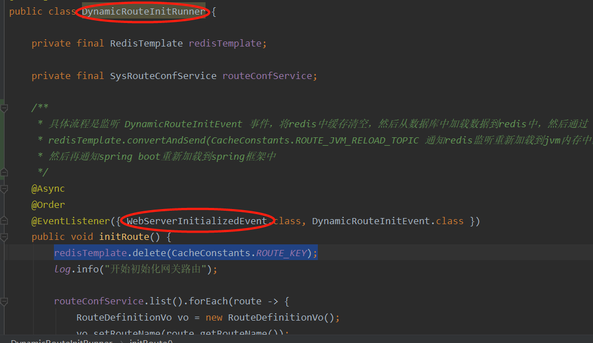
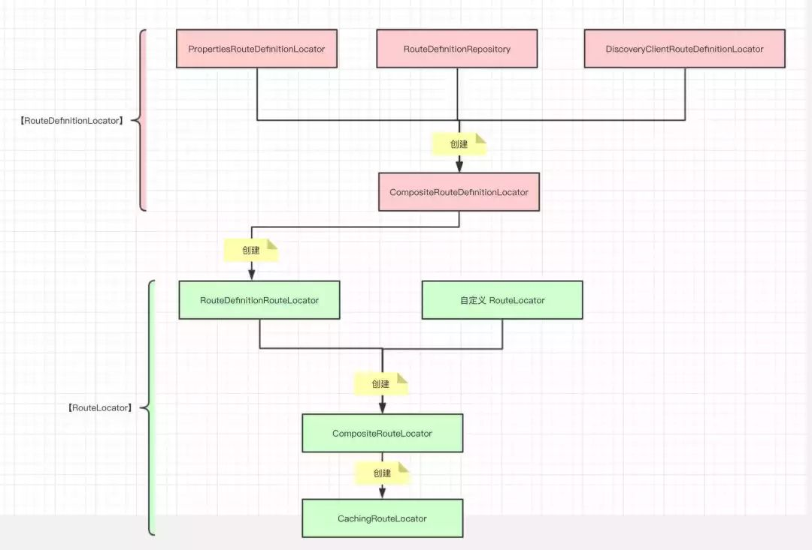
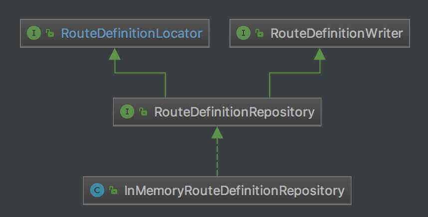

# pigx中的动态路由加载


## 1：在upms中启动加载路由信息

DynamicRouteInitRunner中配置了WebServerInitializedEvent 和DynamicRouteInitEvent事件监听器，所以，当系统启动，server初始化完毕，先从redis中清除所有路由信息，redisTemplate.delete(CacheConstants.ROUTE_KEY); 然后从数据库中加载所有路由配置信息，并且放置到redis中。




系统注册DynamicRouteInitEvent，这个类通过名字就能知道是动态路由初始化事件。

## 2：redis消息机制通知gateway更新路由信息

```
// 通知网关重置路由
redisTemplate.convertAndSend(CacheConstants.ROUTE_JVM_RELOAD_TOPIC, "路由信息,网关缓存更新");
```

当upms启动加载完路由信息，通过这个方式通知gateway加载redis中的路由信息到gateway的内存中

## 3：gateway加载路由信息


当上一步通过reids发送redisTemplate.convertAndSend(CacheConstants.ROUTE_JVM_RELOAD_TOPIC, "路由信息,网关缓存更新");

由于gateway配置了订阅了redis消息ROUTE_JVM_RELOAD_TOPIC频道的内容，所以，gateway能获得upms加载完路由的消息 

```
	/**
	 * redis 监听配置加载路由配置信息
	 * @param redisConnectionFactory redis 配置
	 * @return
	 */
	@Bean
	public RedisMessageListenerContainer redisContainer(RedisConnectionFactory redisConnectionFactory) {
		RedisMessageListenerContainer container = new RedisMessageListenerContainer();
		container.setConnectionFactory(redisConnectionFactory);
		container.addMessageListener((message, bytes) -> {
			log.warn("接收到重新JVM 重新加载路由事件");
			RouteCacheHolder.removeRouteList();
			// 发送刷新路由事件
			SpringContextHolder.publishEvent(new RefreshRoutesEvent(this));
		}, new ChannelTopic(CacheConstants.ROUTE_JVM_RELOAD_TOPIC));
		return container;
	}
```

然后RouteCacheHolder.removeRouteList(); 清除JVM中缓存的路由信息，通过 SpringContextHolder.publishEvent(new RefreshRoutesEvent(this));发送重新加载路由信息事件。

然后gateway就会自动重新加载路由配置信息了。


## 扩展

接下来有两个问题：

1：gateway是怎么知道从哪里去加载路由信息的，是从配置文件还是配置中心还是从数据库redis里面？

2：gateway为什么会自动的根据RefreshRoutesEvent 事件重新加载路由信息？


## 4：路由配置信息加载

要回答上面的问题，首先要知道gateway路由加载过程：




RouteDefinitionLocator 负责读取路由配置( org.springframework.cloud.gateway.route.RouteDefinition ) 。从上图中我们可以看到，RouteDefinitionLocator 接口有四种实现 ：

- PropertiesRouteDefinitionLocator ，从配置文件( 例如，YML / Properties 等 ) 读取。
- CachingRouteDefinitionLocator -RouteDefinitionLocator包装类， 缓存目标RouteDefinitionLocator 为routeDefinitions提供缓存功能
- RouteDefinitionRepository ，从存储器( 例如，内存 / Redis / MySQL 等 )读取。

- DiscoveryClientRouteDefinitionLocator ，从注册中心( 例如，Eureka / Consul / Zookeeper / Etcd 等 )读取。

- CompositeRouteDefinitionLocator ，组合多种 RouteDefinitionLocator 的实现，为 RouteDefinitionRouteLocator 提供统一入口。

所以，我们只要定义好路由的加载源是RouteDefinitionRepository  应该就可以实现从reids中加载路由信息。下面是该类的继承层次。




    public interface RouteDefinitionWriter {
        /**
         * 保存路由配置
         *
         * @param route 路由配置
         * @return Mono<Void>
         */
        Mono<Void> save(Mono<RouteDefinition> route);
    
        /**
         * 删除路由配置
         *
         * @param routeId 路由编号
         * @return Mono<Void>
         */
        Mono<Void> delete(Mono<String> routeId);
    }

org.springframework.cloud.gateway.route.RouteDefinitionRepository ，存储器 RouteDefinitionLocator 接口
继承 RouteDefinitionLocator 接口。
继承 RouteDefinitionWriter 接口。
通过实现该接口，实现从存储器( 例如，内存 / Redis / MySQL 等 )读取、保存、删除路由配置。

我们再看 pigx中的实现：

```
@Slf4j
@Component
@RequiredArgsConstructor
public class RedisRouteDefinitionWriter implements RouteDefinitionRepository {

   private final RedisTemplate redisTemplate;

   @Override
   public Mono<Void> save(Mono<RouteDefinition> route) {
      return route.flatMap(r -> {
         RouteDefinitionVo vo = new RouteDefinitionVo();
         BeanUtils.copyProperties(r, vo);
         log.info("保存路由信息{}", vo);
         redisTemplate.setKeySerializer(new StringRedisSerializer());
         redisTemplate.opsForHash().put(CacheConstants.ROUTE_KEY, r.getId(), vo);
         //更新redis内容之后将更新消息放到redis中，gateway中设置了监听器，发现有更新会重新加载路由配置信息参见DynamicRouteAutoConfiguration
         redisTemplate.convertAndSend(CacheConstants.ROUTE_JVM_RELOAD_TOPIC, "新增路由信息,网关缓存更新");
         return Mono.empty();
      });
   }

   @Override
   public Mono<Void> delete(Mono<String> routeId) {
      routeId.subscribe(id -> {
         log.info("删除路由信息{}", id);
         redisTemplate.setKeySerializer(new StringRedisSerializer());
         redisTemplate.opsForHash().delete(CacheConstants.ROUTE_KEY, id);
      });
      //更新redis内容之后将更新消息放到redis中，gateway中设置了监听器，发现有更新会重新加载路由配置信息参见DynamicRouteAutoConfiguration
      redisTemplate.convertAndSend(CacheConstants.ROUTE_JVM_RELOAD_TOPIC, "删除路由信息,网关缓存更新");
      return Mono.empty();
   }

   /**
    * 动态路由入口
    * <p>
    * 1. 先从内存中获取 2. 为空加载Redis中数据 3. 更新内存
    * @return
    */
   @Override
   public Flux<RouteDefinition> getRouteDefinitions() {
      List<RouteDefinitionVo> routeList = RouteCacheHolder.getRouteList();
      if (CollUtil.isNotEmpty(routeList)) {
         log.debug("内存 中路由定义条数： {}， {}", routeList.size(), routeList);
         return Flux.fromIterable(routeList);
      }

      redisTemplate.setKeySerializer(new StringRedisSerializer());
      redisTemplate.setHashValueSerializer(new Jackson2JsonRedisSerializer<>(RouteDefinitionVo.class));
      List<RouteDefinitionVo> values = redisTemplate.opsForHash().values(CacheConstants.ROUTE_KEY);
      log.debug("redis 中路由定义条数： {}， {}", values.size(), values);

      //放到java缓存中
      RouteCacheHolder.setRouteList(values);
      return Flux.fromIterable(values);
   }

}
```

该类继承自RouteDefinitionRepository 所以增删改查基本逻辑都实现了从redis中进行操作。

其中，增加和删除操作同样会向redis发送消息，redisTemplate.convertAndSend(CacheConstants.ROUTE_JVM_RELOAD_TOPIC, "新增路由信息,网关缓存更新");会导致网关重新加载路由配置信息。

因为CompositeRouteDefinitionLocator是提供统一的入口，所以，最终提供通过CompositeRouteDefinitionLocator提供统一的
getRouteDefinitions方法

```ruby
PropertiesRouteDefinitionLocator-->|配置文件加载初始化| CompositeRouteDefinitionLocator
RouteDefinitionRepository-->|存储器中加载初始化| CompositeRouteDefinitionLocator
DiscoveryClientRouteDefinitionLocator-->|注册中心加载初始化| CompositeRouteDefinitionLocator
```


## 5：路由定位器的生成


GatewayAutoConfiguration相关代码：在上一步加载完路由定义（RouteDefinition）之后，就需要根据路由定义生成路由定位器（routeLocator）

```dart
/**
     * 创建一个根据RouteDefinition转换的路由定位器
     */
    @Bean
    public RouteLocator routeDefinitionRouteLocator(GatewayProperties properties,
                                                   List<GatewayFilterFactory> GatewayFilters,
                                                   List<RoutePredicateFactory> predicates,
                                                   RouteDefinitionLocator routeDefinitionLocator) {
        return new RouteDefinitionRouteLocator(routeDefinitionLocator, predicates, GatewayFilters, properties);
    }

    /**
     * 创建一个缓存路由的路由定位器
     * @param routeLocators
     * @return
     */
    @Bean
    @Primary//意思是在众多相同的bean中，优先使用用@Primary注解的bean.
    //TODO: property to disable composite?
    public RouteLocator cachedCompositeRouteLocator(List<RouteLocator> routeLocators) {
        
        //1.创建组合路由定位器，根据(容器)已有的路由定位器集合
        //2.创建缓存功能的路由定位器
        return new CachingRouteLocator(new CompositeRouteLocator(Flux.fromIterable(routeLocators)));
    }
```


从初始化配置类中可以路由定位器的创建流程

> 1. RouteDefinitionRouteLocator
> 2. CompositeRouteLocator
> 3. CachingRouteLocator
>
> - 其中 RouteDefinitionRouteLocator 是获取路由的主要地方，CompositeRouteLocator，CachingRouteLocator对路由定位器做了附加功能的包装，最终使用的是CachingRouteLocator对外提供服务

我们看这里的CachingRouteLocator 就实现了ApplicationListener<RefreshRoutesEvent> 接口，可以对所有的RefreshRoutesEvent事件进行监听处理，所以当路由信息发生变化，只需要发布RefreshRoutesEvent 事件，gateway即可重新加载路由信息

```kotlin
public class CachingRouteLocator implements Ordered, RouteLocator, ApplicationListener<RefreshRoutesEvent>, ApplicationEventPublisherAware {
// 其他代码

    public Flux<Route> refresh() {
        this.cache.clear();
        return this.routes;
    }

    public void onApplicationEvent(RefreshRoutesEvent event) {
        try {
            this.fetch().collect(Collectors.toList()).subscribe((list) -> {
                Flux.fromIterable(list).materialize().collect(Collectors.toList()).subscribe((signals) -> {
                    this.applicationEventPublisher.publishEvent(new RefreshRoutesResultEvent(this));
                    this.cache.put("routes", signals);
                }, (throwable) -> {
                    this.handleRefreshError(throwable);
                });
            });
        } catch (Throwable var3) {
            this.handleRefreshError(var3);
        }

    }

  //其他代码
}
```


