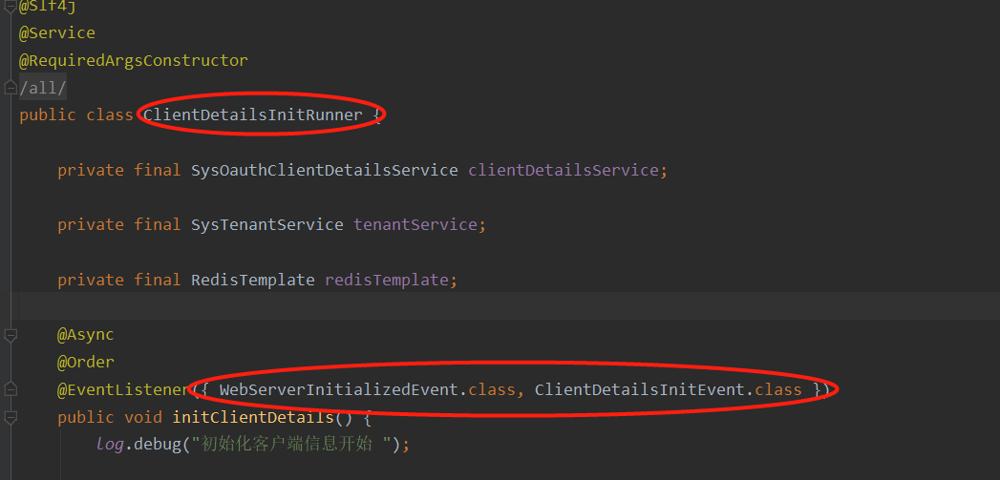
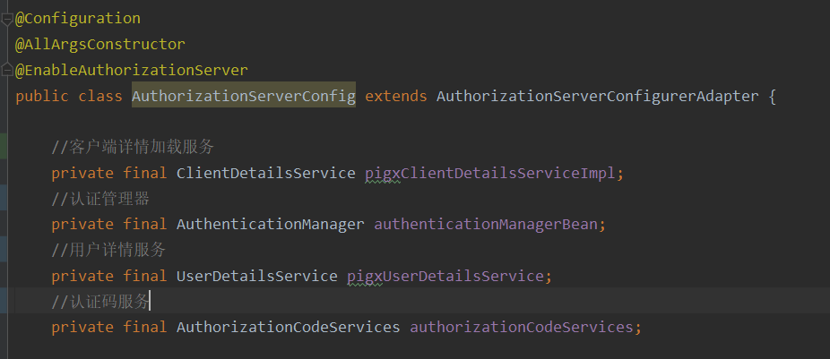
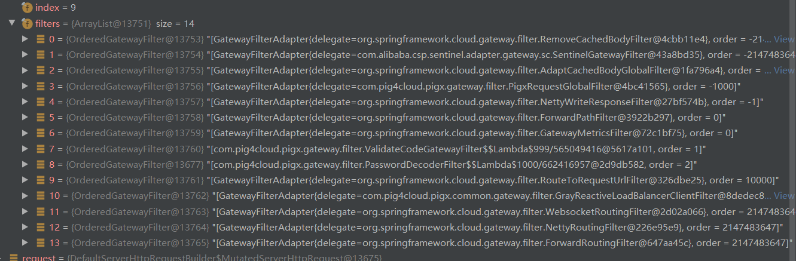
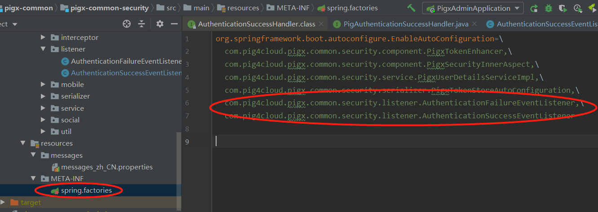

# pigx中的认证流程


## 前提：在upms中启动加载client信息

ClientDetailsInitRunner中配置了WebServerInitializedEvent 和ClientDetailsInitEvent事件监听器，所以，当系统启动，server初始化完毕，从数据库中加载所有client配置信息。并且放置到redis中。



系统认证相关的配置主要是分成两部分：

## oauth的认证配置




# 1：用户普通输入用户名和密码的认证

系统认证体系是基于spring security 开发的。所以，需要对该框架有基本的了解。





## 认证后续处理：

认证之后，需要记录认证成功或者失败，并且根据结果进行后续的动作。这里是通过spring 提供的事件监听机制实现的。这里以登录成功为例，注册了监听的处理：

```
public class AuthenticationSuccessEventListener implements ApplicationListener<AuthenticationSuccessEvent> {

   @Autowired(required = false)
   private PigAuthenticationSuccessHandler successHandler;

   /**
    * Handle an application event.
    * @param event the event to respond to
    */
   @Override
   public void onApplicationEvent(AuthenticationSuccessEvent event) {
      Authentication authentication = (Authentication) event.getSource();
      if (successHandler != null && isUserAuthentication(authentication)) {
         ServletRequestAttributes requestAttributes = (ServletRequestAttributes) RequestContextHolder
               .getRequestAttributes();
         HttpServletRequest request = requestAttributes.getRequest();
         HttpServletResponse response = requestAttributes.getResponse();

         successHandler.handle(authentication, request, response);
      }
   }

   private boolean isUserAuthentication(Authentication authentication) {
      return authentication.getPrincipal() instanceof PigxUser
            || CollUtil.isNotEmpty(authentication.getAuthorities());
   }

}
```

这里需要注意几个点：

登录成功的处理采用 @Async异步处理的；

调用logService 进行认证日志记录是调用的远程服务

另外，这里自定义接口的名字是 AuthenticationSuccessHandler ，这个名字和spring security中的名字一样，所以为了不引起歧义，我这里修改了一下。

```
@Slf4j
@Component
@AllArgsConstructor
public class PigxAuthenticationSuccessEventHandler implements PigAuthenticationSuccessHandler {
	private final RemoteLogService logService;
	private final KeyStrResolver tenantKeyStrResolver;
	/**
	 * 处理登录成功方法
	 * <p>
	 * 获取到登录的authentication 对象
	 * @param authentication 登录对象
	 * @param request 请求
	 * @param response 返回
	 */
	@Async
	@Override
	public void handle(Authentication authentication, HttpServletRequest request, HttpServletResponse response) {
		String username = authentication.getName();
		SysLogDTO sysLog = SysLogUtils.getSysLog(request, username);
		sysLog.setTitle(username + "用户登录");
		sysLog.setParams(username);
		String header = request.getHeader(HttpHeaders.AUTHORIZATION);
		sysLog.setServiceId(WebUtils.extractClientId(header).orElse("N/A"));
		sysLog.setTenantId(Integer.parseInt(tenantKeyStrResolver.key()));

		logService.saveLog(sysLog, SecurityConstants.FROM_IN);
		log.info("用户：{} 登录成功", username);
	}
}
```

那么这个这个登录成功或者失败的处理监听器是如何注册到spring的体系中的呢，答案就是SPI：



这里可以去看下在《java框架-springboot-SPI机制的原理和应用》中的说明