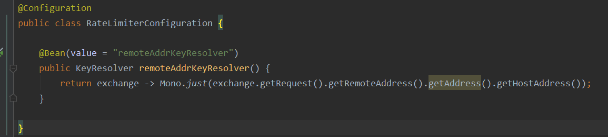

# 系统限流

系统限流在几个地方实现：

## 1：gateway网关限流：

系统在动态路由部分配置了RequestRateLimiter  ，这里的过滤器是gateway内置的，采用reids存储访问的相关信息，然后进行限流

具体的限流策略是令牌桶的策略

redis-rate-limiter.replenishRate：1000 #允许用户每秒执行多少请求，而不会丢弃任何请求。这是令牌桶填充的速率。            

redis-rate-limiter.burstCapacity：1000 #一秒钟内允许执行的最大请求数。这是令牌桶可以容纳的令牌数。将此值设置为零将阻止所有请求。            

key-resolver: "#{@remoteAddeKeyReslover}" #根据关键字标识的限流

这里是用客户端的ip地址作为key来进行限制。

## 2：服务调用限流

这里采用的是基于sentinel 限流工具，具体参见alibaba/sentinel限流

