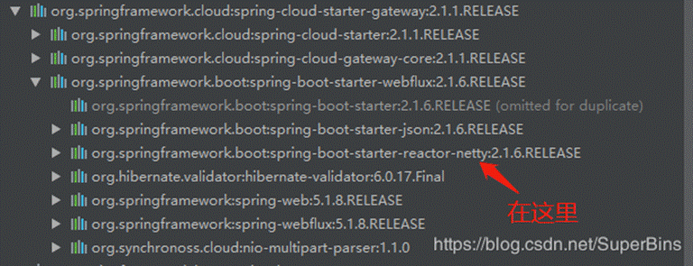
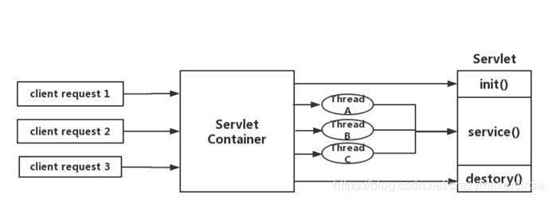
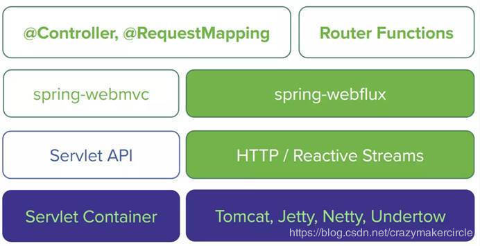
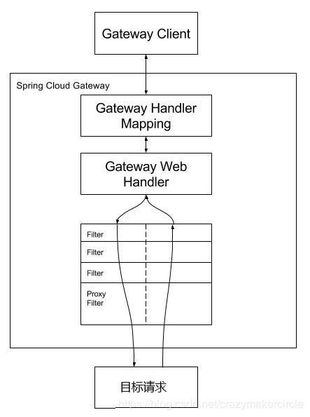
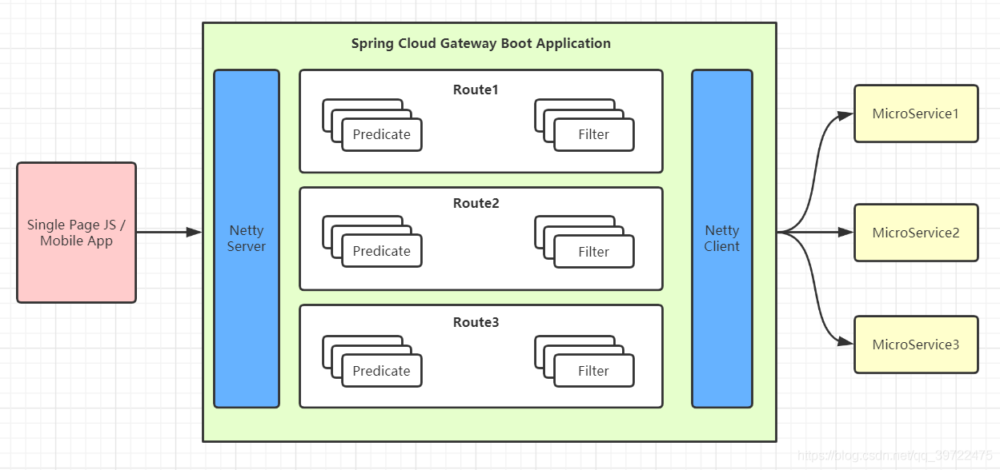
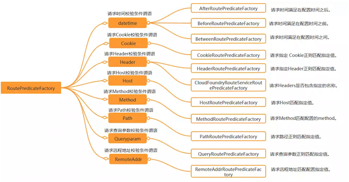
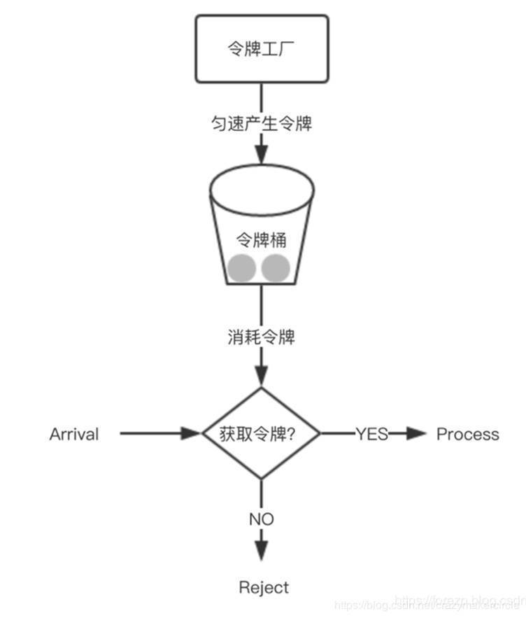
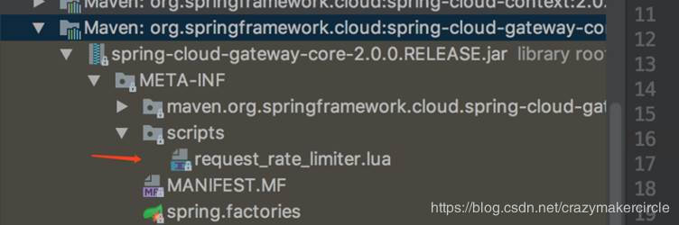
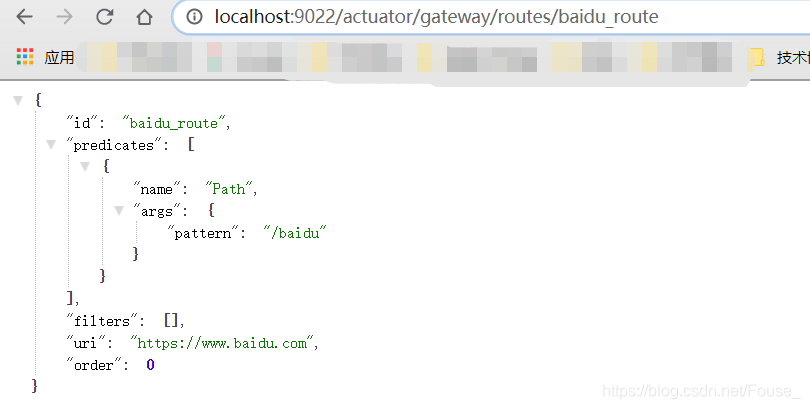
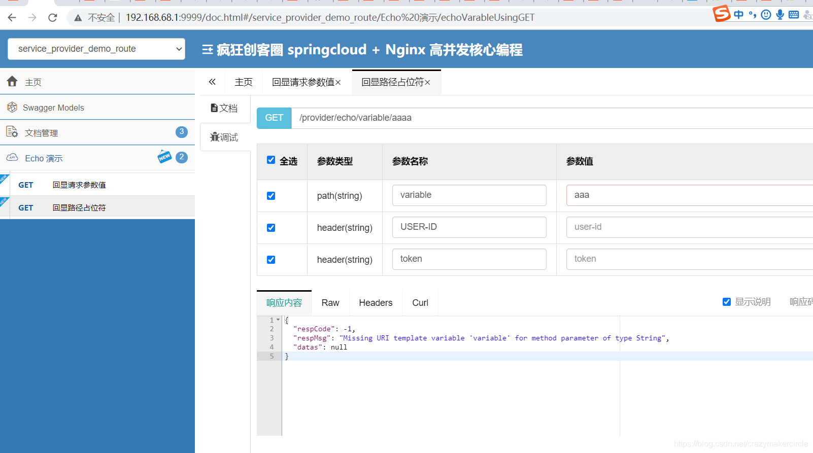

# **1.1**   SpringCloud Gateway 简介

SpringCloud Gateway 是 Spring Cloud 的一个全新项目，该项目是基于 Spring 5.0，Spring  Boot 2.0 和 Project Reactor 等技术开发的网关，它旨在为微服务架构提供一种简单有效的统一的 API 路由管理方式。

SpringCloud Gateway 作为 Spring Cloud 生态系统中的网关，目标是替代 Zuul，在Spring Cloud 2.0以上版本中，没有对新版本的Zuul 2.0以上最新高性能版本进行集成，仍然还是使用的Zuul  2.0之前的非Reactor模式的老版本。而为了提升网关的性能，SpringCloud  Gateway是基于WebFlux框架实现的，而WebFlux框架底层则使用了高性能的Reactor模式通信框架Netty。

Spring Cloud Gateway 的目标，不仅提供统一的路由方式，并且基于 Filter 链的方式提供了网关基本的功能，例如：安全，监控/指标，和限流。

提前声明：**Spring Cloud Gateway  底层使用了高性能的通信框架Netty**。

## **1.2**     SpringCloud Gateway 特征

SpringCloud官方，对SpringCloud Gateway 特征介绍如下：

（1）基于 Spring Framework 5，Project Reactor 和 Spring Boot 2.0

（2）集成 Hystrix 断路器

（3）集成 Spring Cloud DiscoveryClient

（4）Predicates 和 Filters 作用于特定路由，易于编写的 Predicates 和 Filters

（5）具备一些网关的高级功能：动态路由、限流、路径重写

从以上的特征来说，和Zuul的特征差别不大。SpringCloud Gateway和Zuul主要的区别，还是在底层的通信框架上。

简单说明一下上文中的三个术语：

**（**1**）**Filter**（过滤器）**：

和Zuul的过滤器在概念上类似，可以使用它拦截和修改请求，并且对上游的响应，进行二次处理。过滤器为org.springframework.cloud.gateway.filter.GatewayFilter类的实例。

（2）**Route**（路由）：

网关配置的基本组成模块，和Zuul的路由配置模块类似。一个**Route模块**由一个 ID，一个目标 URI，一组断言和一组过滤器定义。如果断言为真，则路由匹配，目标URI会被访问。

**（**3**）**Predicate**（断言）**：

这是一个 Java 8 的 Predicate，可以使用它来匹配来自 HTTP 请求的任何内容，例如 headers 或参数。**断言的**输入类型是一个 ServerWebExchange。

## **1.3**     SpringCloud Gateway和架构

Spring在2017年下半年迎来了Webflux，Webflux的出现填补了Spring在响应式编程上的空白，Webflux的响应式编程不仅仅是编程风格的改变，而且对于一系列的著名框架，都提供了响应式访问的开发包，比如Netty、Redis等等。

SpringCloud Gateway 使用的Webflux中的reactor-netty响应式编程组件，底层使用了Netty通讯框架。
 [](https://upload-images.jianshu.io/upload_images/19816137-8758f092be21e6f7.gif?imageMogr2/auto-orient/strip)

## **1.3.1**       SpringCloud Zuul的IO模型

Springcloud中所集成的Zuul版本，采用的是Tomcat容器，使用的是传统的Servlet IO处理模型。

大家知道，servlet由servlet  container进行生命周期管理。container启动时构造servlet对象并调用servlet  init()进行初始化；container关闭时调用servlet  destory()销毁servlet；container运行时接受请求，并为每个请求分配一个线程（一般从线程池中获取空闲线程）然后调用service()。

弊端：servlet是一个简单的网络IO模型，当请求进入servlet container时，servlet  container就会为其绑定一个线程，在并发不高的场景下这种模型是适用的，但是一旦并发上升，线程数量就会上涨，而线程资源代价是昂贵的（上线文切换，内存消耗大）严重影响请求的处理时间。在一些简单的业务场景下，不希望为每个request分配一个线程，只需要1个或几个线程就能应对极大并发的请求，这种业务场景下servlet模型没有优势。
 [](https://upload-images.jianshu.io/upload_images/19816137-bb466f6b0135bb71?imageMogr2/auto-orient/strip|imageView2/2/w/1240)

所以Springcloud Zuul  是基于servlet之上的一个阻塞式处理模型，即spring实现了处理所有request请求的一个servlet（DispatcherServlet），并由该servlet阻塞式处理处理。所以Springcloud  Zuul无法摆脱servlet模型的弊端。虽然Zuul 2.0开始，使用了Netty，并且已经有了大规模Zuul  2.0集群部署的成熟案例，但是，Springcloud官方已经没有集成改版本的计划了。

## **1.3.2**       Webflux 服务器

Webflux模式替换了旧的Servlet线程模型。用少量的线程处理request和response  io操作，这些线程称为Loop线程，而业务交给响应式编程框架处理，响应式编程是非常灵活的，用户可以将业务中阻塞的操作提交到响应式框架的work线程中执行，而不阻塞的操作依然可以在Loop线程中进行处理，大大提高了Loop线程的利用率。官方结构图：

[](https://upload-images.jianshu.io/upload_images/19816137-dad0e43fc31f4536?imageMogr2/auto-orient/strip|imageView2/2/w/1240)

Webflux虽然可以兼容多个底层的通信框架，但是一般情况下，底层使用的还是Netty，毕竟，Netty是目前业界认可的最高性能的通信框架。而Webflux的Loop线程，正好就是著名的Reactor 模式IO处理模型的Reactor线程，如果使用的是高性能的通信框架Netty，这就是Netty的EventLoop线程。

关于Reactor线程模型，和Netty通信框架的知识，是Java程序员的重要、必备的内功，个中的原理，具体请参见尼恩编著的《Netty、Zookeeper、Redis高并发实战》一书，这里不做过多的赘述。

## **1.3.3**        Spring Cloud Gateway的处理流程

客户端向 Spring Cloud Gateway 发出请求。然后在 Gateway Handler Mapping  中找到与请求相匹配的路由，将其发送到 Gateway Web Handler。Handler  再通过指定的过滤器链来将请求发送到我们实际的服务执行业务逻辑，然后返回。过滤器之间用虚线分开是因为过滤器可能会在发送代理请求之前（“pre”）或之后（“post”）执行业务逻辑。
 [](https://upload-images.jianshu.io/upload_images/19816137-eeedbd49be096c05?imageMogr2/auto-orient/strip|imageView2/2/w/1240)

# 2   路由配置方式

## 2.1      基础URI路由配置方式

如果请求的目标地址，是单个的URI资源路径，配置文件示例如下：


```
server:
  port: 8080
spring:
  application:
    name: api-gateway
  cloud:
    gateway:
      routes:
        -id: url-proxy-1
          uri: https://blog.csdn.net
          predicates:
            -Path=/csdn
```

各字段含义如下：

id：我们自定义的路由 ID，保持唯一

uri：目标服务地址

predicates：路由条件，Predicate 接受一个输入参数，返回一个布尔值结果。该接口包含多种默认方法来将 Predicate 组合成其他复杂的逻辑（比如：与，或，非）。

上面这段配置的意思是，配置了一个 id 为 url-proxy-1的URI代理规则，路由的规则为：

当访问地址http://localhost:8080/csdn/1.jsp时，

会路由到上游地址https://blog.csdn.net/1.jsp。

## 2.2 基于代码的路由配置方式

转发功能同样可以通过代码来实现，我们可以在启动类 GateWayApplication 中添加方法 customRouteLocator() 来定制转发规则。


```
package com.springcloud.gateway;
 
import org.springframework.boot.SpringApplication;
import org.springframework.boot.autoconfigure.SpringBootApplication;
import org.springframework.cloud.gateway.route.RouteLocator;
import org.springframework.cloud.gateway.route.builder.RouteLocatorBuilder;
import org.springframework.context.annotation.Bean;
 
@SpringBootApplication
public class GatewayApplication {
 
    public static void main(String[] args) {
        SpringApplication.run(GatewayApplication.class, args);
    }
 
    @Bean
    public RouteLocator customRouteLocator(RouteLocatorBuilder builder) {
        return builder.routes()
                .route("path_route", r -> r.path("/csdn")
                        .uri("https://blog.csdn.net"))
                .build();
    }
 
}
```

我们在yaml配置文件中注销掉相关路由的配置，重启服务，访问链接：http://localhost:8080/ csdn， 可以看到和上面一样的页面，证明我们测试成功。

上面两个示例中 uri 都是指向了我的CSDN博客，在实际项目使用中可以将 uri 指向对外提供服务的项目地址，统一对外输出接口。

## 2.3    和注册中心相结合的路由配置方式

在uri的schema协议部分为自定义的lb:类型，表示从微服务注册中心（如Eureka）订阅服务，并且进行服务的路由。

一个典型的示例如下：

```
server:
  port: 8084
spring:
  cloud:
    gateway:
      routes:
      -id: seckill-provider-route
        uri: lb://seckill-provider
        predicates:
        - Path=/seckill-provider/**

      -id: message-provider-route
        uri: lb://message-provider
        predicates:
        -Path=/message-provider/**

application:
  name: cloud-gateway

eureka:
  instance:
    prefer-ip-address: true
  client:
    service-url:
      defaultZone: http://localhost:8888/eureka/
```

注册中心相结合的路由配置方式，与单个URI的路由配置，区别其实很小，仅仅在于URI的schema协议不同。单个URI的地址的schema协议，一般为http或者https协议。

# 3   路由 匹配规则

Spring Cloud Gateway 的功能很强大，我们仅仅通过 Predicates 的设计就可以看出来，前面我们只是使用了  predicates 进行了简单的条件匹配，其实 Spring Cloud Gataway 帮我们内置了很多 Predicates 功能。

Spring Cloud Gateway 是通过 Spring WebFlux 的 HandlerMapping  做为底层支持来匹配到转发路由，Spring Cloud Gateway 内置了很多 Predicates 工厂，这些 Predicates  工厂通过不同的 HTTP 请求参数来匹配，多个 Predicates 工厂可以组合使用。

[](https://img-blog.csdnimg.cn/20200527213652534.png?x-oss-process=image/watermark,type_ZmFuZ3poZW5naGVpdGk,shadow_10,text_aHR0cHM6Ly9ibG9nLmNzZG4ubmV0L3FxXzM5NzIyNDc1,size_16,color_FFFFFF,t_70)

gateWay的主要功能之一是转发请求，转发规则的定义主要包含三个部分

|                         |                                                              |      |
| ----------------------- | ------------------------------------------------------------ | ---- |
| Route（路由）           | 路由是网关的基本单元，由ID、URI、一组Predicate、一组Filter组成，根据Predicate进行匹配转发。 |      |
| Predicate（谓语、断言） | 路由转发的判断条件，目前SpringCloud Gateway支持多种方式，常见如：Path、Query、Method、Header等，写法必须遵循 key=vlue的形式 |      |
| Filter（过滤器）        | 过滤器是路由转发请求时所经过的过滤逻辑，可用于修改请求、响应内容 |      |

> 其中Route和Predicate必须同时申明

例子：


```
//通过配置文件配置
spring:
  cloud:
    gateway:
      routes:
        - id: gate_route
          uri: http://localhost:9023
          predicates:
          ## 当请求的路径为gate、rule开头的时，转发到http://localhost:9023服务器上
            - Path=/gate/**,/rule/**
        ### 请求路径前加上/app
          filters:
          - PrefixPath=/app
```

## 3.1       Predicate 断言条件(转发规则)介绍

Predicate 来源于 Java 8，是 Java 8 中引入的一个函数，Predicate  接受一个输入参数，返回一个布尔值结果。该接口包含多种默认方法来将 Predicate  组合成其他复杂的逻辑（比如：与，或，非）。可以用于接口请求参数校验、判断新老数据是否有变化需要进行更新操作。

在 Spring Cloud Gateway 中 Spring 利用 Predicate 的特性实现了各种路由匹配规则，有通过  Header、请求参数等不同的条件来进行作为条件匹配到对应的路由。网上有一张图总结了 Spring Cloud 内置的几种 Predicate  的实现。
 [](https://upload-images.jianshu.io/upload_images/19816137-bb046dbf19bee1b4.gif?imageMogr2/auto-orient/strip)
 [
 说白了 Predicate 就是为了实现一组匹配规则，方便让请求过来找到对应的 Route 进行处理，接下来我们接下 Spring Cloud GateWay 内置几种 Predicate 的使用。

- 转发规则（predicates），假设 转发uri都设定为***http://localhost:9023***

| 规则    | 实例                                                         | 说明                                                         |
| ------- | ------------------------------------------------------------ | ------------------------------------------------------------ |
| Path    | - Path=/gate/**,/rule/**                                     | ## 当请求的路径为gate、rule开头的时，转发到http://localhost:9023服务器上 |
| Before  | - Before=2017-01-20T17:42:47.789-07:00[America/Denver]       | 在某个时间之前的请求才会被转发到 http://localhost:9023服务器上 |
| After   | - After=2017-01-20T17:42:47.789-07:00[America/Denver]        | 在某个时间之后的请求才会被转发                               |
| Between | - Between=2017-01-20T17:42:47.789-07:00[America/Denver],2017-01-21T17:42:47.789-07:00[America/Denver] | 在某个时间段之间的才会被转发                                 |
| Cookie  | - Cookie=chocolate, ch.p                                     | 名为chocolate的表单或者满足正则ch.p的表单才会被匹配到进行请求转发 |
| Header  | - Header=X-Request-Id, \d+                                   | 携带参数X-Request-Id或者满足\d+的请求头才会匹配              |
| Host    | - Host=www.hd123.com                                         | 当主机名为www.hd123.com的时候直接转发到http://localhost:9023服务器上 |
| Method  | - Method=GET                                                 | 只有GET方法才会匹配转发请求，还可以限定POST、PUT等请求方式   |

### **1.5.2**       通过请求参数匹配

Query Route Predicate 支持传入两个参数，一个是属性名一个为属性值，属性值可以是正则表达式。


```
server:
  port: 8080
spring:
  application:
  	 name: api-gateway
  cloud:
    gateway:
      routes:
        -id: gateway-service
          uri: https://www.baidu.com
          order: 0
          predicates:
            -Query=smile
```

这样配置，只要请求中包含 smile 属性的参数即可匹配路由。

使用 curl 测试，命令行输入:

curl localhost:8080?smile=x&id=2

经过测试发现只要请求汇总带有 smile 参数即会匹配路由，不带 smile 参数则不会匹配。

还可以将 Query 的值以键值对的方式进行配置，这样在请求过来时会对属性值和正则进行匹配，匹配上才会走路由。


```
server:

  port: 8080

spring:

  application:

    name: api-gateway

  cloud:

    gateway:

      routes:

        -id: gateway-service

          uri: https://www.baidu.com

          order: 0

          predicates:

            -Query=keep, pu.
```

这样只要当请求中包含 keep 属性并且参数值是以 pu 开头的长度为三位的字符串才会进行匹配和路由。

使用 curl 测试，命令行输入:

curl localhost:8080?keep=pub

测试可以返回页面代码，将 keep 的属性值改为 pubx 再次访问就会报 404,证明路由需要匹配正则表达式才会进行路由。

### **1.5.3**       通过 Header 属性匹配

Header Route Predicate 和 Cookie Route Predicate 一样，也是接收 2 个参数，一个 header 中属性名称和一个正则表达式，这个属性值和正则表达式匹配则执行。


```
server:

  port: 8080

spring:

  application:

    name: api-gateway

  cloud:

    gateway:

      routes:

        -id: gateway-service

          uri: https://www.baidu.com

          order: 0

          predicates:

            - Header=X-Request-Id, \d+
```

使用 curl 测试，命令行输入:

curl http://localhost:8080  -H "X-Request-Id:88"

则返回页面代码证明匹配成功。将参数-H "X-Request-Id:88"改为-H "X-Request-Id:spring"再次执行时返回404证明没有匹配。

### **1.5.4**       通过 Cookie 匹配

Cookie Route Predicate 可以接收两个参数，一个是 Cookie name ,一个是正则表达式，路由规则会通过获取对应的 Cookie name 值和正则表达式去匹配，如果匹配上就会执行路由，如果没有匹配上则不执行。


```
server:
  port: 8080
spring:
  application:
    name: api-gateway
  cloud:
    gateway:
      routes:
        -id: gateway-service
          uri: https://www.baidu.com
          order: 0
          predicates:
            - Cookie=sessionId, test
```

使用 curl 测试，命令行输入:

curl http://localhost:8080 --cookie "sessionId=test"

则会返回页面代码，如果去掉--cookie "sessionId=test"，后台汇报 404 错误。

### **1.5.5**       通过 Host 匹配

Host Route Predicate 接收一组参数，一组匹配的域名列表，这个模板是一个 ant 分隔的模板，用.号作为分隔符。它通过参数中的主机地址作为匹配规则。


```
server:

  port: 8080

spring:

  application:

    name: api-gateway

  cloud:

    gateway:

      routes:

        -id: gateway-service

          uri: https://www.baidu.com

          order: 0

          predicates:

            - Host=**.baidu.com
```

使用 curl 测试，命令行输入:

curl http://localhost:8080  -H "Host: www.baidu.com"

curl http://localhost:8080  -H "Host: md.baidu.com"

经测试以上两种 host 均可匹配到 host_route 路由，去掉 host 参数则会报 404 错误。

### **1.5.6**       通过请求方式匹配

可以通过是 POST、GET、PUT、DELETE 等不同的请求方式来进行路由。


```
server:

  port: 8080

spring:

  application:

    name: api-gateway

  cloud:

    gateway:

      routes:

        -id: gateway-service

          uri: https://www.baidu.com

          order: 0

          predicates:

            - Method=GET
```

使用 curl 测试，命令行输入:

\# curl 默认是以 GET 的方式去请求

curl http://localhost:8080

测试返回页面代码，证明匹配到路由，我们再以 POST 的方式请求测试。

\# curl 默认是以 GET 的方式去请求

curl -X POST http://localhost:8080

返回 404 没有找到，证明没有匹配上路由

### **1.5.7**       通过请求路径匹配

Path Route Predicate 接收一个匹配路径的参数来判断是否走路由。


```
server:

  port: 8080

spring:

  application:

    name: api-gateway

  cloud:

    gateway:

      routes:

        -id: gateway-service

          uri: http://ityouknow.com

          order: 0

          predicates:

            -Path=/foo/{segment}
```

如果请求路径符合要求，则此路由将匹配，例如：/foo/1 或者 /foo/bar。

使用 curl 测试，命令行输入:

curl http://localhost:8080/foo/1

curl http://localhost:8080/foo/xx

curl http://localhost:8080/boo/xx

经过测试第一和第二条命令可以正常获取到页面返回值，最后一个命令报404，证明路由是通过指定路由来匹配。

### **1.5.8**       通过请求 ip 地址进行匹配

Predicate 也支持通过设置某个 ip 区间号段的请求才会路由，RemoteAddr Route Predicate 接受 cidr 符号(IPv4 或 IPv6 )字符串的列表(最小大小为1)，例如 192.168.0.1/16 (其中 192.168.0.1 是 IP  地址，16 是子网掩码)。


```
server:

  port: 8080

spring:

  application:

    name: api-gateway

  cloud:

    gateway:

      routes:

        - id: gateway-service

          uri: https://www.baidu.com

          order: 0

          predicates:

            - RemoteAddr=192.168.1.1/24
```

可以将此地址设置为本机的 ip 地址进行测试。

curl localhost:8080

如果请求的远程地址是 192.168.1.10，则此路由将匹配。

### **1.5.10** **组合使用**


```
server:
  port: 8080
spring:
  application:
    name: api-gateway
  cloud:
    gateway:
      routes:
        - id: gateway-service
          uri: https://www.baidu.com
          order: 0
          predicates:
            - Host=**.foo.org
            - Path=/headers
            - Method=GET
            - Header=X-Request-Id, \d+
            - Query=foo, ba.
            - Query=baz
            - Cookie=chocolate, ch.p
```


各种 Predicates 同时存在于同一个路由时，请求必须同时满足所有的条件才被这个路由匹配。

一个请求满足多个路由的断言条件时，请求只会被首个成功匹配的路由转发

## 3.2 过滤器规则（Filter）

### 过滤器规则（Filter）

| 过滤规则            | 实例                           | 说明                                                         |
| ------------------- | ------------------------------ | ------------------------------------------------------------ |
| PrefixPath          | - PrefixPath=/app              | 在请求路径前加上app                                          |
| RewritePath         | - RewritePath=/test, /app/test | 访问localhost:9022/test,请求会转发到localhost:8001/app/test  |
| SetPath             | SetPath=/app/{path}            | 通过模板设置路径，转发的规则时会在路径前增加app，{path}表示原请求路径 |
| RedirectTo          |                                | 重定向                                                       |
| RemoveRequestHeader |                                | 去掉某个请求头信息                                           |

注：当配置多个filter时，优先定义的会被调用，剩余的filter将不会生效

### PrefixPath

对所有的请求路径添加前缀：

```
spring:
  cloud:
    gateway:
      routes:
      - id: prefixpath_route
        uri: https://example.org
        filters:
        - PrefixPath=/mypath
```

访问/hello的请求被发送到https://example.org/mypath/hello。

### RedirectTo

重定向，配置包含重定向的返回码和地址：


```
spring:
  cloud:
    gateway:
      routes:
      - id: prefixpath_route
        uri: https://example.org
        filters:
        - RedirectTo=302, https://acme.org
```

### RemoveRequestHeader

去掉某个请求头信息：

```
spring:
  cloud:
    gateway:
      routes:
      - id: removerequestheader_route
        uri: https://example.org
        filters:
        - RemoveRequestHeader=X-Request-Foo
```

去掉请求头信息  X-Request-Foo

### RemoveResponseHeader

去掉某个回执头信息：


```
spring:
  cloud:
    gateway:
      routes:
      - id: removerequestheader_route
        uri: https://example.org
        filters:
        - RemoveResponseHeader=X-Request-Foo
```

### RemoveRequestParameter

去掉某个请求参数信息：


```
spring:
  cloud:
    gateway:
      routes:
      - id: removerequestparameter_route
        uri: https://example.org
        filters:
        - RemoveRequestParameter=red
```

### RewritePath

改写路径：


```
spring:
  cloud:
    gateway:
      routes:
      - id: rewrite_filter
        uri: http://localhost:8081
        predicates:
        - Path=/test/**
        filters:
        - RewritePath=/where(?<segment>/?.*), /test(?<segment>/?.*)
```

/where/... 改成  test/...

使用代码改下路径


```
	    RouteLocatorBuilder.Builder builder = routeLocatorBuilder.routes();
        builder
                .route("path_rote_at_guigu", r -> r.path("/guonei")
                        .uri("http://news.baidu.com/guonei"))
                .route("csdn_route", r -> r.path("/csdn")
                        .uri("https://blog.csdn.net"))
                .route("blog3_rewrite_filter", r -> r.path("/blog3/**")
                        .filters(f -> f.rewritePath("/blog3/(?<segment>.*)", "/$\\{segment}"))
                        .uri("https://blog.csdn.net"))
                .route("rewritepath_route", r -> r.path("/baidu/**")
                        .filters(f -> f.rewritePath("/baidu/(?<segment>.*)", "/$\\{segment}"))
                        .uri("http://www.baidu.com"))

                .build();
```

### SetPath

设置请求路径，与RewritePath类似。


```
spring:
  cloud:
    gateway:
      routes:
      - id: setpath_route
        uri: https://example.org
        predicates:
        - Path=/red/{segment}
        filters:
        - SetPath=/{segment}
```

如/red/blue的请求被转发到/blue。

### SetRequestHeader

设置请求头信息。


```
spring:
  cloud:
    gateway:
      routes:
      - id: setrequestheader_route
        uri: https://example.org
        filters:
        - SetRequestHeader=X-Request-Red, Blue
```

### SetStatus

设置回执状态码。


```
spring:
  cloud:
    gateway:
      routes:
      - id: setstatusint_route
        uri: https://example.org
        filters:
        - SetStatus=401
```

### StripPrefix

跳过指定路径。


```
spring:
  cloud:
    gateway:
      routes:
      - id: nameRoot
        uri: https://nameservice
        predicates:
        - Path=/name/**
        filters:
        - StripPrefix=2
```

请求/name/blue/red会转发到/red。

### RequestSize

请求大小。

```
spring:
  cloud:
    gateway:
      routes:
      - id: request_size_route
        uri: http://localhost:8080/upload
        predicates:
        - Path=/upload
        filters:
        - name: RequestSize
          args:
            maxSize: 5000000
```

超过5M的请求会返回413错误。

### Default-filters

对所有请求添加过滤器。

```
spring:
  cloud:
    gateway:
      default-filters:
      - AddResponseHeader=X-Response-Default-Red, Default-Blue
      - PrefixPath=/httpbin
```

## 3.3 通过代码进行配置

通过代码进行配置，将路由规则设置为一个Bean即可：


```
	@Bean
	public RouteLocator customRouteLocator(RouteLocatorBuilder builder) {
		return builder.routes()
			.route("path_route", r -> r.path("/get")
				.uri("http://httpbin.org"))
			.route("host_route", r -> r.host("*.myhost.org")
				.uri("http://httpbin.org"))
			.route("rewrite_route", r -> r.host("*.rewrite.org")
				.filters(f -> f.rewritePath("/foo/(?<segment>.*)", "/${segment}"))
				.uri("http://httpbin.org"))
			.route("hystrix_route", r -> r.host("*.hystrix.org")
				.filters(f -> f.hystrix(c -> c.setName("slowcmd")))
				.uri("http://httpbin.org"))
			.route("hystrix_fallback_route", r -> r.host("*.hystrixfallback.org")
				.filters(f -> f.hystrix(c -> c.setName("slowcmd").setFallbackUri("forward:/hystrixfallback")))
				.uri("http://httpbin.org"))
			.route("limit_route", r -> r
				.host("*.limited.org").and().path("/anything/**")
				.filters(f -> f.requestRateLimiter(c -> c.setRateLimiter(redisRateLimiter())))
				.uri("http://httpbin.org"))
			.build();
	}
```

## **3.2**       实现熔断降级

为什么要实现熔断降级？

在分布式系统中，网关作为流量的入口，因此会有大量的请求进入网关，向其他服务发起调用，其他服务不可避免的会出现调用失败（超时、异常），失败时不能让请求堆积在网关上，需要快速失败并返回给客户端，想要实现这个要求，就必须在网关上做熔断、降级操作。

为什么在网关上请求失败需要快速返回给客户端？

因为当一个客户端请求发生故障的时候，这个请求会一直堆积在网关上，当然只有一个这种请求，网关肯定没有问题（如果一个请求就能造成整个系统瘫痪，那这个系统可以下架了），但是网关上堆积多了就会给网关乃至整个服务都造成巨大的压力，甚至整个服务宕掉。因此要对一些服务和页面进行有策略的降级，以此缓解服务器资源的的压力，以保证核心业务的正常运行，同时也保持了客户和大部分客户的得到正确的相应，所以需要网关上请求失败需要快速返回给客户端。

```
server.port: 8082

spring:
  application:
    name: gateway
  redis:
      host: localhost
      port: 6379
      password: 123456
  cloud:
    gateway:
      routes:
        - id: rateLimit_route
          uri: http://localhost:8000
          order: 0
          predicates:
            - Path=/test/**
          filters:
            - StripPrefix=1
            - name: Hystrix
              args:
                name: fallbackCmdA
                fallbackUri: forward:/fallbackA

  hystrix.command.fallbackCmdA.execution.isolation.thread.timeoutInMilliseconds: 5000
```

这里的配置，使用了两个过滤器：

（1）过滤器StripPrefix，作用是去掉请求路径的最前面n个部分截取掉。

StripPrefix=1就代表截取路径的个数为1，比如前端过来请求/test/good/1/view，匹配成功后，路由到后端的请求路径就会变成http://localhost:8888/good/1/view。

（2）过滤器Hystrix，作用是通过Hystrix进行熔断降级

当上游的请求，进入了Hystrix熔断降级机制时，就会调用fallbackUri配置的降级地址。需要注意的是，还需要单独设置Hystrix的commandKey的超时时间

fallbackUri配置的降级地址的代码如下：

```
package org.gateway.controller;

import org.gateway.response.Response;
import org.springframework.web.bind.annotation.GetMapping;
import org.springframework.web.bind.annotation.RestController;

@RestController
public class FallbackController {

    @GetMapping("/fallbackA")
    public Response fallbackA() {
        Response response = new Response();
        response.setCode("100");
        response.setMessage("服务暂时不可用");
        return response;
    }
}
```

# 4 高级配置

## 4.1       分布式限流

从某种意义上讲，令牌桶算法是对漏桶算法的一种改进，桶算法能够限制请求调用的速率，而令牌桶算法能够在限制调用的平均速率的同时还允许一定程度的突发调用。在令牌桶算法中，存在一个桶，用来存放固定数量的令牌。算法中存在一种机制，以一定的速率往桶中放令牌。每次请求调用需要先获取令牌，只有拿到令牌，才有机会继续执行，否则选择选择等待可用的令牌、或者直接拒绝。放令牌这个动作是持续不断的进行，如果桶中令牌数达到上限，就丢弃令牌，所以就存在这种情况，桶中一直有大量的可用令牌，这时进来的请求就可以直接拿到令牌执行，比如设置qps为100，那么限流器初始化完成一秒后，桶中就已经有100个令牌了，这时服务还没完全启动好，等启动完成对外提供服务时，该限流器可以抵挡瞬时的100个请求。所以，只有桶中没有令牌时，请求才会进行等待，最后相当于以一定的速率执行。
 [](https://upload-images.jianshu.io/upload_images/19816137-89297e59a487540d?imageMogr2/auto-orient/strip|imageView2/2/w/1240)

在Spring Cloud  Gateway中，有Filter过滤器，因此可以在“pre”类型的Filter中自行实现上述三种过滤器。但是限流作为网关最基本的功能，Spring Cloud  Gateway官方就提供了RequestRateLimiterGatewayFilterFactory这个类，适用在Redis内的通过执行Lua脚本实现了令牌桶的方式。具体实现逻辑在RequestRateLimiterGatewayFilterFactory类中，lua脚本在如下图所示的文件夹中：
 [](https://upload-images.jianshu.io/upload_images/19816137-0456652619daecaa?imageMogr2/auto-orient/strip|imageView2/2/w/1240)

首先在工程的pom文件中引入gateway的起步依赖和redis的reactive依赖，代码如下：

配置如下：

```
server:
  port: 8081
spring:
  cloud:
    gateway:
      routes:
      - id: limit_route
        uri: http://httpbin.org:80/get
        predicates:
        - After=2017-01-20T17:42:47.789-07:00[America/Denver]
        filters:
        - name: RequestRateLimiter
          args:
            key-resolver: '#{@userKeyResolver}'
            redis-rate-limiter.replenishRate: 1
            redis-rate-limiter.burstCapacity: 3
  application:
    name: cloud-gateway
  redis:
    host: localhost
    port: 6379
    database: 0
```

在上面的配置文件，指定程序的端口为8081，配置了 redis的信息，并配置了RequestRateLimiter的限流过滤器，该过滤器需要配置三个参数：

- burstCapacity，令牌桶总容量。
- replenishRate，令牌桶每秒填充平均速率。
- key-resolver，用于限流的键的解析器的 Bean 对象的名字。它使用 SpEL 表达式根据#{@beanName}从 Spring 容器中获取 Bean 对象。

这里根据用户ID限流，请求路径中必须携带userId参数


```
@Bean

KeyResolver userKeyResolver() {
  return exchange -> Mono.just(exchange.getRequest().getQueryParams().getFirst("user"));
}

 
```

KeyResolver需要实现resolve方法，比如根据userid进行限流，则需要用userid去判断。实现完KeyResolver之后，需要将这个类的Bean注册到Ioc容器中。

如果需要根据IP限流，定义的获取限流Key的bean为：

```
@Bean
public KeyResolver ipKeyResolver() {
  return exchange -> Mono.just(exchange.getRequest().getRemoteAddress().getHostName());
}
```

通过exchange对象可以获取到请求信息，这边用了HostName，如果你想根据用户来做限流的话这边可以获取当前请求的用户ID或者用户名就可以了，比如：

如果需要根据接口的URI进行限流，则需要获取请求地址的uri作为限流key，定义的Bean对象为：


```
@Bean
KeyResolver apiKeyResolver() {
  return exchange -> Mono.just(exchange.getRequest().getPath().value());
}
```

通过exchange对象可以获取到请求信息，这边用了HostName，如果你想根据用户来做限流的话这边可以获取当前请求的用户ID或者用户名就可以了，比如：

如果需要根据接口的URI进行限流，则需要获取请求地址的uri作为限流key，定义的Bean对象为：

```
@Bean
KeyResolver apiKeyResolver() {
  return exchange -> Mono.just(exchange.getRequest().getPath().value());
}
```

## 4.2 健康检查配置

admin-client、actuator健康检查配置，为之后的功能提供支持，此部分比较简单，不再赘述，加入以下maven依赖和配置

#### maven依赖

```
  <dependency>
        <groupId>org.springframework.boot</groupId>
        <artifactId>spring-boot-starter-actuator</artifactId>
 </dependency>
<dependency>
        <groupId>de.codecentric</groupId>
        <artifactId>spring-boot-admin-starter-client</artifactId>
        <version>2.1.0</version>
    </dependency>
<dependency>
        <groupId>org.springframework.cloud</groupId>
        <artifactId>spring-cloud-starter-netflix-eureka-client</artifactId>
    </dependency>
```

#### 配置文件

```
spring:
  application:
    name: mas-cloud-gateway
  boot:
    admin:
      client:
      ### 本地搭建的admin-server
        url: http://localhost:8011
eureka:
  client:
    registerWithEureka: true
    fetchRegistry: true
    healthcheck:
      enabled: true
    serviceUrl:
      defaultZone: http://localhost:6887/eureka/
    enabled: true
feign:
  sentinel:
    enabled: true
management:
  endpoints:
    web:
      exposure:
        include: '*'
  endpoint:
    health:
      show-details: ALWAYS
```

若转发的目标地址为微服务中组件，不为具体ip:port形式的，应写成lb://mas-openapi-service形式，目标地址会从注册中心直接拉取

## 4.3 统一配置跨域请求：

现在的请求通过经过gateWay网关时，需要在网关统一配置跨域请求，需求所有请求通过

```
spring:
  cloud:
    gateway:
      globalcors:
        cors-configurations:
          '[/**]':
            allowed-origins: "*"
            allowed-headers: "*"
            allow-credentials: true
            allowed-methods:
              - GET
              - POST
              - DELETE
              - PUT
              - OPTION
```

# 5 整合Nacos

## maven依赖

```
<?xml version="1.0" encoding="UTF-8"?>
<project xmlns="http://maven.apache.org/POM/4.0.0" xmlns:xsi="http://www.w3.org/2001/XMLSchema-instance"
         xsi:schemaLocation="http://maven.apache.org/POM/4.0.0 https://maven.apache.org/xsd/maven-4.0.0.xsd">
    <modelVersion>4.0.0</modelVersion>
    <parent>
        <groupId>org.springframework.boot</groupId>
        <artifactId>spring-boot-starter-parent</artifactId>
        <version>2.1.9.RELEASE</version>
        <relativePath/> <!-- lookup parent from repository -->
    </parent>
    <groupId>com.example</groupId>
    <artifactId>nacos_gateway</artifactId>
    <version>0.0.1-SNAPSHOT</version>
    <packaging>war</packaging>
    <name>nacos_gateway</name>
    <description>Demo project for Spring Boot</description>

    <properties>
        <java.version>1.8</java.version>
        <spring-cloud.version>Greenwich.SR3</spring-cloud.version>
    </properties>

    <dependencies>
        <dependency>
            <groupId>org.springframework.boot</groupId>
            <artifactId>spring-boot-starter-test</artifactId>
            <scope>test</scope>
        </dependency>
        <!--gateway-->
        <dependency>
            <groupId>org.springframework.cloud</groupId>
            <artifactId>spring-cloud-starter-gateway</artifactId>
        </dependency>
        <!--nacos dicovery-->
        <dependency>
            <groupId>org.springframework.cloud</groupId>
            <artifactId>spring-cloud-starter-alibaba-nacos-discovery</artifactId>
        </dependency>
    </dependencies>

    <dependencyManagement>
        <dependencies>
            <dependency>
                <groupId>org.springframework.cloud</groupId>
                <artifactId>spring-cloud-dependencies</artifactId>
                <version>${spring-cloud.version}</version>
                <type>pom</type>
                <scope>import</scope>
            </dependency>
            <dependency>
                <groupId>org.springframework.cloud</groupId>
                <artifactId>spring-cloud-alibaba-dependencies</artifactId>
                <version>0.2.2.RELEASE</version>
                <type>pom</type>
                <scope>import</scope>
            </dependency>
        </dependencies>
    </dependencyManagement>

    <build>
        <plugins>
            <plugin>
                <groupId>org.springframework.boot</groupId>
                <artifactId>spring-boot-maven-plugin</artifactId>
            </plugin>
        </plugins>
    </build>

</project>
```

需要注意在Gateway服务中的pom.xml文件中不要存在这个jar

```
        <dependency>
            <groupId>org.springframework.boot</groupId>
            <artifactId>spring-boot-starter-tomcat</artifactId>
            <scope>provided</scope>
        </dependency>
```

否则调用接口时会报以下错误因为gateway使用的是webflux,默认使用netty,所以从依赖中排除 tomcat相关的依赖


```
java.lang.ClassCastException: org.springframework.core.io.buffer.DefaultDataBufferFactory cannot be cast to org.springframework.core.io.buffer.NettyDataBufferFactory
	at org.springframework.cloud.gateway.filter.NettyWriteResponseFilter.lambda$filter$1(NettyWriteResponseFilter.java:82) ~[spring-cloud-gateway-core-2.1.3.RELEASE.jar:2.1.3.RELEASE]
	at reactor.core.publisher.MonoDefer.subscribe(MonoDefer.java:44) [reactor-core-3.2.12.RELEASE.jar:3.2.12.RELEASE]
```

错误2 是由于 spring-boot-starter-web 引起

## 服务发现配置：从Nacos获取微服务提供者清单

```
server:
  port: 8087
spring:
  application:
    name: nacos_gateway
  cloud:
    nacos:
      discovery:
        server-addr: 127.0.0.1:8848
    gateway:
      discovery:
        locator:
          enabled: true  #表明gateway开启服务注册和发现的功能，并且spring cloud gateway自动根据服务发现为每一个服务创建了一个router，这个router将以服务名开头的请求路径转发到对应的服务
          lower-case-service-id: true  #是将请求路径上的服务名配置为小写（因为服务注册的时候，向注册中心注册时将服务名转成大写的了
      routes:
          -id: apiuser
          #
          uri: lb://nacos-consumer-user
          predicates:
          # http://localhost:6601/user/user/users/2, 必须加上StripPrefix=1，否则访问服务时会带上user
          - Path=/user/** # 转发该路径
           #以下是配置例子
            # - id: 163                     #网关路由到网易官网
            #  uri: http://www.163.com/
            #  predicates:
                - Path=/163/**
        #      - id: ORDER-SERVICE           #网关路由到订单服务order-service
        #        uri: lb://ORDER-SERVICE
        #        predicates:
        #          - Path=/ORDER-SERVICE/**
        #      - id: USER-SERVICE            #网关路由到用户服务user-service
        #        uri: lb://USER-SERVICE
        #        predicates:
        #          - Pach=/USER-SERVICE/**
```

## nacos实现动态配置

使用nacos实现动态路由，以上两种方式都是实现的静态配置路径，只能应对部分场景，接下来配置nacos实现动态配置以及配置的存储，由于gateWay并没有适配nacos，需要自定义监听器：

```
@Component
@Slf4j
public class NacosDynamicRouteService implements ApplicationEventPublisherAware {
  private String dataId = "gateway-router";
  private String group = "DEFAULT_GROUP";
  @Value("${spring.cloud.nacos.config.server-addr}")
  private String serverAddr;
  @Autowired
  private RouteDefinitionWriter routeDefinitionWriter;
  private ApplicationEventPublisher applicationEventPublisher;
  private static final List<String> ROUTE_LIST = new ArrayList<>();
  @PostConstruct
  public void dynamicRouteByNacosListener() {
    try {
      ConfigService configService = NacosFactory.createConfigService(serverAddr);
      configService.getConfig(dataId, group, 5000);
      configService.addListener(dataId, group, new Listener() {
        @Override
        public void receiveConfigInfo(String configInfo) {
          clearRoute();
          try {
            if (StringUtil.isNullOrEmpty(configInfo)) {//配置被删除
              return;
            }
            List<RouteDefinition> gatewayRouteDefinitions = JSONObject.parseArray(configInfo, RouteDefinition.class);
            for (RouteDefinition routeDefinition : gatewayRouteDefinitions) {
              addRoute(routeDefinition);
            }
            publish();
          } catch (Exception e) {
            log.error("receiveConfigInfo error" + e);
          }
        }
        @Override
        public Executor getExecutor() {
          return null;
        }
      });
    } catch (NacosException e) {
        log.error("dynamicRouteByNacosListener error" + e);
    }
  }
  private void clearRoute() {
    for (String id : ROUTE_LIST) {
      this.routeDefinitionWriter.delete(Mono.just(id)).subscribe();
    }
    ROUTE_LIST.clear();
  }
  private void addRoute(RouteDefinition definition) {
    try {
      routeDefinitionWriter.save(Mono.just(definition)).subscribe();
      ROUTE_LIST.add(definition.getId());
    } catch (Exception e) {
 log.error("addRoute error" + e);
    }
  }
  private void publish() {
    this.applicationEventPublisher.publishEvent(new RefreshRoutesEvent(this.routeDefinitionWriter));
  }
  @Override
  public void setApplicationEventPublisher(ApplicationEventPublisher applicationEventPublisher) {
    this.applicationEventPublisher = applicationEventPublisher;
  }
```

在nacos中增加一个规则：


```
[{
    "filters": [],
    "id": "baidu_route",
    "order": 0,
    "predicates": [{
        "args": {
            "pattern": "/baidu"
        },
        "name": "Path"
    }],
    "uri": "https://www.baidu.com"
}]
```

访问网关的路由规则，能看到刚刚加入的规则，访问*http://localhost:9022/baidu*时请求直接被转发到百度的首页了。

[](https://img-blog.csdnimg.cn/20200325164150414.png?x-oss-process=image/watermark,type_ZmFuZ3poZW5naGVpdGk,shadow_10,text_aHR0cHM6Ly9ibG9nLmNzZG4ubmV0L0ZvdXNlXw==,size_16,color_FFFFFF,t_70#pic_center)

### 

# 6 整合Swagger聚合微服务系统API文档

有关源码   具体请参见  疯狂创客圈的  crazy-springcloud  脚手架

## maven依赖


```
<?xml version="1.0" encoding="UTF-8"?>
<project xmlns="http://maven.apache.org/POM/4.0.0"
         xmlns:xsi="http://www.w3.org/2001/XMLSchema-instance"
         xsi:schemaLocation="http://maven.apache.org/POM/4.0.0 http://maven.apache.org/xsd/maven-4.0.0.xsd">
    <parent>
        <artifactId>cloud-center-alibaba</artifactId>
        <groupId>com.crazymaker.springcloud</groupId>
        <version>1.0-SNAPSHOT</version>
    </parent>
    <modelVersion>4.0.0</modelVersion>

    <groupId>com.crazymaker.springcloud</groupId>
    <artifactId>springcloud-gateway-demo</artifactId>
    <version>1.0-SNAPSHOT</version>
    <name>springcloud-gateway-demo</name>
    <packaging>jar</packaging>


    <dependencies>
        <!--gateway 网关依赖,内置webflux 依赖 -->
        <dependency>
            <groupId>org.springframework.cloud</groupId>
            <artifactId>spring-cloud-starter-gateway</artifactId>
        </dependency>
        <!--新增sentinel-->
        <dependency>
            <groupId>com.alibaba.csp</groupId>
            <artifactId>sentinel-spring-cloud-gateway-adapter</artifactId>
        </dependency>
        <dependency>
            <groupId>com.alibaba.csp</groupId>
            <artifactId>sentinel-transport-simple-http</artifactId>
        </dependency>

        <!-- nacos服务注册发现依赖-->
        <dependency>
            <groupId>com.alibaba.cloud</groupId>
            <artifactId>spring-cloud-starter-alibaba-nacos-discovery</artifactId>
            <exclusions>
                <exclusion>
                    <groupId>com.google.guava</groupId>
                    <artifactId>guava</artifactId>
                </exclusion>
            </exclusions>
        </dependency>
        <dependency>
            <groupId>mysql</groupId>
            <artifactId>mysql-connector-java</artifactId>
            <version>${mysql.connector.version}</version>
        </dependency>
        <!-- nacos配置服务依赖-->
        <dependency>
            <groupId>com.alibaba.cloud</groupId>
            <artifactId>spring-cloud-starter-alibaba-nacos-config</artifactId>
            <exclusions>
                <exclusion>
                    <groupId>com.google.guava</groupId>
                    <artifactId>guava</artifactId>
                </exclusion>
            </exclusions>
        </dependency>
        <dependency>
            <groupId>org.springframework.cloud</groupId>
            <artifactId>spring-cloud-starter-netflix-hystrix</artifactId>
        </dependency>
        <dependency>
            <groupId>org.springframework.boot</groupId>
            <artifactId>spring-boot-starter-actuator</artifactId>
        </dependency>


        <dependency>
            <groupId>org.projectlombok</groupId>
            <artifactId>lombok</artifactId>
            <optional>true</optional>
        </dependency>
        <dependency>
            <groupId>org.springframework.boot</groupId>
            <artifactId>spring-boot-starter-test</artifactId>
            <scope>test</scope>
        </dependency>


        <dependency>
            <groupId>org.projectlombok</groupId>
            <artifactId>lombok</artifactId>
            <optional>true</optional>
        </dependency>

        <dependency>
            <groupId>cn.hutool</groupId>
            <artifactId>hutool-all</artifactId>
            <version>${hutool.version}</version>
        </dependency>
        <dependency>
            <groupId>io.springfox</groupId>
            <artifactId>springfox-swagger2</artifactId>
            <version>${swagger.version}</version>
        </dependency>
        <dependency>
            <groupId>io.springfox</groupId>
            <artifactId>springfox-swagger-common</artifactId>
            <version>${swagger.version}</version>
        </dependency>
        <dependency>
            <groupId>com.github.xiaoymin</groupId>
            <artifactId>swagger-bootstrap-ui</artifactId>
            <version>${swagger-ui.version}</version>
        </dependency>
        <dependency>
            <groupId>org.springframework.cloud</groupId>
            <artifactId>spring-cloud-commons</artifactId>
        </dependency>
    </dependencies>
    <build>
        <plugins>

            <plugin>
                <groupId>org.springframework.boot</groupId>
                <artifactId>spring-boot-maven-plugin</artifactId>
                <configuration>
                    <mainClass>com.crazymaker.cloud.nacos.demo.gateway.starter.GatewayProviderApplication</mainClass>
                </configuration>
                <executions>
                    <execution>
                        <goals>
                            <goal>repackage</goal>
                        </goals>
                    </execution>
                </executions>
            </plugin>


            <plugin>
                <artifactId>maven-assembly-plugin</artifactId>
                <version>2.4.1</version>
                <configuration>
                    <descriptors>
                        <descriptor>src/main/assembly/assembly.xml</descriptor>
                    </descriptors>
                </configuration>
                <executions>
                    <execution>
                        <id>make-assembly</id>
                        <phase>package</phase>
                        <goals>
                            <goal>single</goal>
                        </goals>
                    </execution>
                </executions>
            </plugin>

            <!-- 添加docker-maven插件 -->

            <plugin>
                <groupId>com.spotify</groupId>
                <artifactId>docker-maven-plugin</artifactId>
                <version>1.1.1</version>
                <configuration>
                    <imageName>dockerlocal:5000/${project.artifactId}:${project.version}</imageName>
                    <baseImage>dockerlocal:5000/java</baseImage>
                    <entryPoint>["java", "-jar", "/${project.build.finalName}.jar"]</entryPoint>
                    <dockerDirectory>docker</dockerDirectory>
                    <resources>
                        <resource>
                            <targetPath>/</targetPath>
                            <directory>${project.build.directory}</directory>
                            <include>${project.build.finalName}.jar</include>
                        </resource>
                    </resources>
                </configuration>
            </plugin>

        </plugins>
    </build>
</project>
```

## 配置文件


```
package com.crazymaker.cloud.nacos.demo.gateway.config;

import lombok.AllArgsConstructor;
import org.springframework.cloud.gateway.config.GatewayProperties;
import org.springframework.cloud.gateway.route.RouteLocator;
import org.springframework.cloud.gateway.support.NameUtils;
import org.springframework.context.annotation.Primary;
import org.springframework.stereotype.Component;
import springfox.documentation.swagger.web.SwaggerResource;
import springfox.documentation.swagger.web.SwaggerResourcesProvider;

import java.util.ArrayList;
import java.util.List;

/**
 * @ClassName SwaggerProvider
 * @PackageName com.ruoyi.gateway.config
 * @Description
 * @Author daiz
 * @Date 2019/8/16 10:04
 * @Version 1.0
 */
@Component
@Primary
@AllArgsConstructor
public class SwaggerConfig implements SwaggerResourcesProvider
{
    public static final String API_URI = "/v2/api-docs";

    private final RouteLocator routeLocator;

    private final GatewayProperties gatewayProperties;

    @Override
    public List<SwaggerResource> get()
    {
        /**
         * 网关应用名称,不需要在网关的swagger 上展示
         */
        String appName = "springcloud-gateway";

        List<SwaggerResource> resources = new ArrayList<>();
        List<String> routes = new ArrayList<>();
        // 取出gateway的route
        routeLocator.getRoutes().subscribe(route -> routes.add(route.getId()));
        // 结合配置的route-路径(Path)，和route过滤，只获取有效的route节点
        // 打开下面注释可以自动扫描接入gateway的服务，为了演示，只扫描system
        // gatewayProperties.getRoutes().stream().filter(routeDefinition ->
        // routes.contains(routeDefinition.getId()))
        gatewayProperties.getRoutes().stream()
                .filter(route -> route.getUri().getHost() != null)
                .filter(route -> !appName.equals(route.getUri().getHost()))
                .forEach(routeDefinition -> routeDefinition.getPredicates().stream()
                        .filter(predicateDefinition -> ("Path").equalsIgnoreCase(predicateDefinition.getName()))
                        .forEach(predicateDefinition -> resources
                                .add(swaggerResource(routeDefinition.getId(), predicateDefinition.getArgs()
                                        .get(NameUtils.GENERATED_NAME_PREFIX + "0").replace("/**", API_URI)))));
        return resources;
    }

    private SwaggerResource swaggerResource(String name, String location)
    {
        SwaggerResource swaggerResource = new SwaggerResource();
        swaggerResource.setName(name);
        swaggerResource.setLocation(location);
        swaggerResource.setSwaggerVersion("2.0");
        return swaggerResource;
    }
}
```

## 效果：

[](https://img-blog.csdnimg.cn/20210112153623924.png?x-oss-process=image/watermark,type_ZmFuZ3poZW5naGVpdGk,shadow_10,text_aHR0cHM6Ly9ibG9nLmNzZG4ubmV0L2NyYXp5bWFrZXJjaXJjbGU=,size_16,color_FFFFFF,t_70)

# 7 Gatway 网关的过滤器开发

## 7.1  过滤器的执行次序

Spring-Cloud-Gateway 基于过滤器实现，同 zuul 类似，有**pre**和**post**两种方式的 filter,分别处理**前置逻辑**和**后置逻辑**。客户端的请求先经过**pre**类型的 filter，然后将请求转发到具体的业务服务，收到业务服务的响应之后，再经过**post**类型的 filter 处理，最后返回响应到客户端。

过滤器执行流程如下，**order 越大，优先级越低**

[](https://gitee.com/idea360/oss/raw/master/images/spring-cloud-gateway-fliter-order.png)

分为全局过滤器和局部过滤器

- **全局过滤器：**

> 对所有路由生效
>
> 接口用时统计

- **局部过滤器：**

> 对指定路由生效

## 7.2定义全局过滤器

实现 GlobalFilter 和 Ordered，重写相关方法，加入到spring容器管理即可，无需配置，全局过滤器对所有的路由都有效。

全局过滤器举例：代码如下：


```
package com.crazymaker.cloud.nacos.demo.gateway.config;

import lombok.extern.slf4j.Slf4j;
import org.springframework.cloud.gateway.filter.GatewayFilterChain;
import org.springframework.cloud.gateway.filter.GlobalFilter;
import org.springframework.context.annotation.Bean;
import org.springframework.context.annotation.Configuration;
import org.springframework.core.Ordered;
import org.springframework.core.annotation.Order;
import org.springframework.web.server.ServerWebExchange;
import reactor.core.publisher.Mono;

@Configuration
public class FilterConfig
{

    @Bean
    @Order(-1)
    public GlobalFilter a()
    {
        return new AFilter();
    }

    @Bean
    @Order(0)
    public GlobalFilter b()
    {
        return new BFilter();
    }

    @Bean
    @Order(1)
    public GlobalFilter c()
    {
        return new CFilter();
    }


    @Slf4j
    public class AFilter implements GlobalFilter, Ordered
    {

        @Override
        public Mono<Void> filter(ServerWebExchange exchange, GatewayFilterChain chain)
        {
            log.info("AFilter前置逻辑");
            return chain.filter(exchange).then(Mono.fromRunnable(() ->
            {
                log.info("AFilter后置逻辑");
            }));
        }

        //   值越小，优先级越高
//    int HIGHEST_PRECEDENCE = -2147483648;
//    int LOWEST_PRECEDENCE = 2147483647;
        @Override
        public int getOrder()
        {
            return HIGHEST_PRECEDENCE + 100;
        }
    }

    @Slf4j
    public class BFilter implements GlobalFilter, Ordered
    {
        @Override
        public Mono<Void> filter(ServerWebExchange exchange, GatewayFilterChain chain)
        {
            log.info("BFilter前置逻辑");
            return chain.filter(exchange).then(Mono.fromRunnable(() ->
            {
                log.info("BFilter后置逻辑");
            }));
        }
        //   值越小，优先级越高
//    int HIGHEST_PRECEDENCE = -2147483648;
//    int LOWEST_PRECEDENCE = 2147483647;
        @Override
        public int getOrder()
        {
            return HIGHEST_PRECEDENCE + 200;
        }
    }

    @Slf4j
    public class CFilter implements GlobalFilter, Ordered
    {

        @Override
        public Mono<Void> filter(ServerWebExchange exchange, GatewayFilterChain chain)
        {
            log.info("CFilter前置逻辑");
            return chain.filter(exchange).then(Mono.fromRunnable(() ->
            {
                log.info("CFilter后置逻辑");
            }));
        }

        //   值越小，优先级越高
//    int HIGHEST_PRECEDENCE = -2147483648;
//    int LOWEST_PRECEDENCE = 2147483647;
        @Override
        public int getOrder()
        {
            return HIGHEST_PRECEDENCE + 300;
        }
    }
}
```

## 7.3定义局部过滤器

步骤：

1 需要实现GatewayFilter, Ordered，实现相关的方法

2 加入到过滤器工厂，并且注册到spring容器中。

3、在配置文件中进行配置，如果不配置则不启用此过滤器规则。

局部过滤器举例,  对请求头部的  user-id 进行校验，代码如下：

1 需要实现GatewayFilter, Ordered，实现相关的方法

```
package com.crazymaker.cloud.nacos.demo.gateway.filter;

import lombok.extern.slf4j.Slf4j;
import org.apache.commons.lang3.StringUtils;
import org.springframework.cloud.gateway.filter.GatewayFilter;
import org.springframework.cloud.gateway.filter.GatewayFilterChain;
import org.springframework.cloud.gateway.filter.GlobalFilter;
import org.springframework.core.Ordered;
import org.springframework.http.HttpStatus;
import org.springframework.stereotype.Component;
import org.springframework.web.server.ServerWebExchange;
import reactor.core.publisher.Mono;

//@Component
@Slf4j
public class UserIdCheckGateWayFilter implements GatewayFilter, Ordered
{
    @Override
    public Mono<Void> filter(ServerWebExchange exchange, GatewayFilterChain chain)
    {
        String url = exchange.getRequest().getPath().pathWithinApplication().value();
        log.info("请求URL:" + url);
        log.info("method:" + exchange.getRequest().getMethod());
       /*   String secret = exchange.getRequest().getHeaders().getFirst("secret");
        if (StringUtils.isBlank(secret))
        {
            return chain.filter(exchange);
        }*/
         //获取param 请求参数
        String uname = exchange.getRequest().getQueryParams().getFirst("uname");
        //获取header
        String userId = exchange.getRequest().getHeaders().getFirst("user-id");
        log.info("userId：" + userId);

        if (StringUtils.isBlank(userId))
        {
            log.info("*****头部验证不通过，请在头部输入  user-id");
            //终止请求，直接回应
            exchange.getResponse().setStatusCode(HttpStatus.NOT_ACCEPTABLE);
            return exchange.getResponse().setComplete();
        }
        return chain.filter(exchange);
    }

    //   值越小，优先级越高
//    int HIGHEST_PRECEDENCE = -2147483648;
//    int LOWEST_PRECEDENCE = 2147483647;
    @Override
    public int getOrder()
    {
        return HIGHEST_PRECEDENCE;
    }
}
```

2 加入到过滤器工厂，并且注册到spring容器中。


```
package com.crazymaker.cloud.nacos.demo.gateway.config;

import com.crazymaker.cloud.nacos.demo.gateway.filter.UserIdCheckGateWayFilter;
import org.springframework.cloud.gateway.filter.GatewayFilter;
import org.springframework.cloud.gateway.filter.factory.AbstractGatewayFilterFactory;
import org.springframework.stereotype.Component;


@Component
public class UserIdCheckGatewayFilterFactory extends AbstractGatewayFilterFactory<Object>
{
    @Override
    public GatewayFilter apply(Object config)
    {
        return new UserIdCheckGateWayFilter();
    }
}
```

3、在配置文件中进行配置，如果不配置则不启用此过滤器规则。

```
        - id: service_provider_demo_route_filter
          uri: lb://service-provider-demo
          predicates:
            - Path=/filter/**
          filters:
            - RewritePath=/filter/(?<segment>.*), /provider/$\{segment}
            - UserIdCheck
```

除此之外，还有两种方式实现自定义的过滤器：

一种是实现方式和上面一样，但是配置不通过配置文件方式进行配置，而是通过硬编码的方式：

```java
   @Bean
    public RouteLocator customerRouteLocator(RouteLocatorBuilder builder) {
        // @formatter:off
        return builder.routes()
                .route(r -> r.path("/customer/**")
                        .filters(f -> f.filter(new UserIdCheckGateWayFilter())
                                .addResponseHeader("X-Response-Default-Foo", "Default-Bar"))
                        .uri("http://httpbin.org:80/get")
                        .order(0)
                        .id("customer_filter_router")
                )
                .build();
        // @formatter:on
    }
```

还有一种时间方式是自定义过滤器类继承 AbstractGatewayFilterFactory 这个类。则可以省略工厂类的方式直接使用。

# 8 整合Sentinel完成流控和降级

## maven依赖

使用Sentinel作为gateWay的限流、降级、系统保护工具

```
     <!--alibaba 流量卫士-->
        <dependency>
            <groupId>com.alibaba.csp</groupId>
            <artifactId>sentinel-core</artifactId>
            <version>${sentinel.version}</version>
        </dependency>
        <dependency>
            <groupId>org.springframework.cloud</groupId>
            <artifactId>spring-cloud-starter-alibaba-sentinel</artifactId>
        </dependency>
       <dependency>
            <groupId>com.alibaba.csp</groupId>
            <artifactId>sentinel-spring-cloud-gateway-adapter</artifactId>
            <version>1.7.1</version>
        </dependency>
```

## 配置文件

客户端配置：在配置文件中增加下列配置，dashboard就可以轻松管理客户端了，还有一种方式是在启动时加入

```
spring:
  cloud:
    sentinel:
      transport:
        ## VM
        ##-Djava.net.preferIPv4Stack=true -Dcsp.sentinel.dashboard.server=localhost:8080 -Dcsp.sentinel.api.port=8666 -Dproject.name=gateway -Dcsp.sentinel.app.type=1
        dashboard: localhost:8880
        port: 8880
```

## 限流规则通用配置

由于sentinel的工作原理其实借助于全局的filter进行请求拦截并计算出是否进行限流、熔断等操作的，增加SentinelGateWayFilter配置


```
  @Bean//拦截请求
  @Order(Ordered.HIGHEST_PRECEDENCE)
  public GlobalFilter sentinelGatewayFilter() {
    return new SentinelGatewayFilter();
  }
```

sentinel 不仅支持通过硬代码方式进行资源的申明，还能通过注解方式进行声明，为了让注解生效，还需要配置切面类SentinelResourceAspect

```
   @Bean
  public SentinelResourceAspect sentinelResourceAspect() {
    return new SentinelResourceAspect();
  }
```

sentinel拦截包括了视图、静态资源等，需要配置viewResolvers以及拦截之后的异常，我们也可以自定义抛出异常的提示

```
  public SentinelConfig(ObjectProvider<List<ViewResolver>> viewResolversProvider,
                        ServerCodecConfigurer serverCodecConfigurer) {
    this.viewResolvers = viewResolversProvider.getIfAvailable(Collections::emptyList);
    this.serverCodecConfigurer = serverCodecConfigurer;
  }

  @Bean//自定义异常
  @Order(Ordered.HIGHEST_PRECEDENCE)
  public ExceptionHandler sentinelGatewayBlockExceptionHandler() {
    // Register the block exception handler for Spring Cloud Gateway.
    return new ExceptionHandler(viewResolvers, serverCodecConfigurer);
  }
```

自定义异常提示：当发生限流、熔断异常时，会返回定义的提示信息。

```
    /**
     * 配置限流的异常处理器:SentinelGatewayBlockExceptionHandler
     */
    @Bean
    @Order(Ordered.HIGHEST_PRECEDENCE)
    public SentinelGatewayBlockExceptionHandler sentinelGatewayBlockExceptionHandler() {
        return new SentinelGatewayBlockExceptionHandlerEX(viewResolvers, serverCodecConfigurer);
    }
```

```
不需要额外的配置，sentinel就已经可以正常工作了
```

## 限流规则设置

1 资源定义：定义API组

2 定义限流规则

> 具体请参见学习视频

## 网关限流参数

其中网关限流规则 GatewayFlowRule的字段解释如下：

- resource：资源名称，可以是网关中的 route 名称或者用户自定义的 API 分组名称。

- resourceMode：规则是针对 API Gateway 的 route（RESOURCE_MODE_ROUTE_ID）还是用户在  Sentinel 中定义的 API 分组（RESOURCE_MODE_CUSTOM_API_NAME），默认是 route。

- grade：限流指标维度，同限流规则的 grade 字段。

- count：限流阈值

- intervalSec：统计时间窗口，单位是秒，默认是 1 秒。

- controlBehavior：流量整形的控制效果，同限流规则的 controlBehavior 字段，目前支持快速失败和匀速排队两种模式，默认是快速失败。

- burst：应对突发请求时额外允许的请求数目。

- maxQueueingTimeoutMs：匀速排队模式下的最长排队时间，单位是毫秒，仅在匀速排队模式下生效。

- paramItem

  参数限流配置。若不提供，则代表不针对参数进行限流，该网关规则将会被转换成普通流控规则；否则会转换成热点规则。其中的字段：

  - parseStrategy：从请求中提取参数的策略，目前支持提取来源  IP（PARAM_PARSE_STRATEGY_CLIENT_IP）、Host（PARAM_PARSE_STRATEGY_HOST）、任意  Header（PARAM_PARSE_STRATEGY_HEADER）和任意 URL  参数（PARAM_PARSE_STRATEGY_URL_PARAM）四种模式。
  - fieldName：若提取策略选择 Header 模式或 URL 参数模式，则需要指定对应的 header 名称或 URL 参数名称。
  - pattern：参数值的匹配模式，只有匹配该模式的请求属性值会纳入统计和流控；若为空则统计该请求属性的所有值。（1.6.2 版本开始支持）
  - matchStrategy：参数值的匹配策略，目前支持精确匹配（PARAM_MATCH_STRATEGY_EXACT）、子串匹配（PARAM_MATCH_STRATEGY_CONTAINS）和正则匹配（PARAM_MATCH_STRATEGY_REGEX）。（1.6.2 版本开始支持）

用户可以通过 GatewayRuleManager.loadRules(rules) 手动加载网关规则，或通过 GatewayRuleManager.register2Property(property) 注册动态规则源动态推送（推荐方式）。