# 五、 Nacos服务注册与配置

## 5.1 什么是Nacos？

​    Nacos是用于构建云本机应用程序的易于使用的动态服务发现，配置和服务管理平台。

## 5.2安装并运行Nacos

### 5.2.1 环境

​    本地Java8+Maven环境已经OK

### 5.2.2官网下载Nacos

​    https://github.com/alibaba/nacos/releases/tag/1.1.4

### 5.2.3解压安装包，直接运行bin目录下的startup.cmd

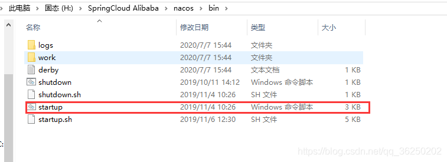

### 5.2.4命令运行成功后直接访问http://localhost:8848/nacos；默认账户密码都是：nacos

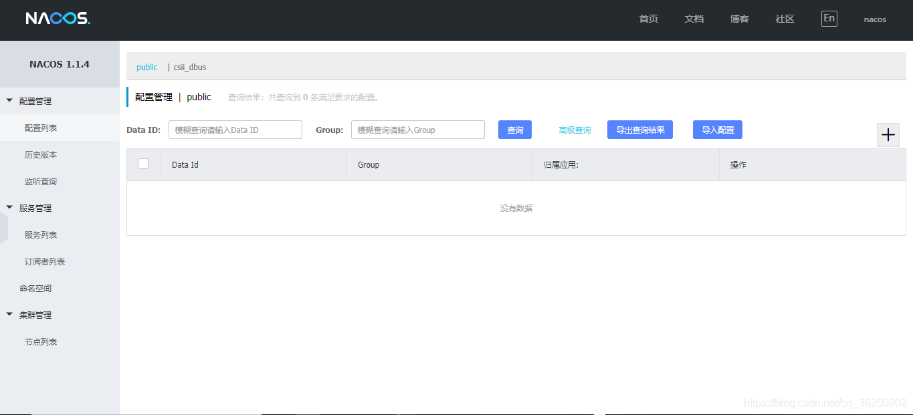

##  5.3 Nacos作为服务注册中心演示

1.父POM加

```html
<!--spring cloud alibaba 2.1.0.RELEASE-->

<dependency>

  <groupId>com.alibaba.cloud</groupId>

  <artifactId>spring-cloud-alibaba-dependencies</artifactId>

  <version>2.1.0.RELEASE</version>

  <type>pom</type>

  <scope>import</scope>

</dependency>
```

2.本地模块POM加

```html
  <dependency>

        <groupId>com.alibaba.cloud</groupId>

        <artifactId>spring-cloud-starter-alibaba-nacos-discovery</artifactId>

    </dependency>
```

3.写yml

```java
server:
  port: 5000
spring:
  application:
    name: nocas-csii-provider
  cloud:
    nacos:
      discovery:
        server-addr: xxx.xxx.xx.xxx:8090 #Nacos服务注册中心地址
```

 4.主启动类加注解：@EnableDiscoveryClient开启服务注册发现功能

```java
package com.csii.regist;

import org.springframework.boot.SpringApplication;
import org.springframework.boot.autoconfigure.SpringBootApplication;
import org.springframework.cloud.client.discovery.EnableDiscoveryClient;

@SpringBootApplication
@EnableDiscoveryClient//开启服务注册发现功能

public class RegistMain5001 {

    public static void main(String[] args) {
        SpringApplication.run(RegistMain5001.class,args);
    }
}
```

 5.启动+访问测试

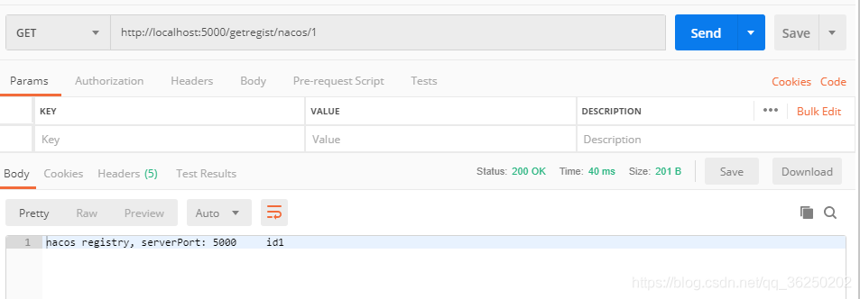

6.nacos控制台证明服务注册成功

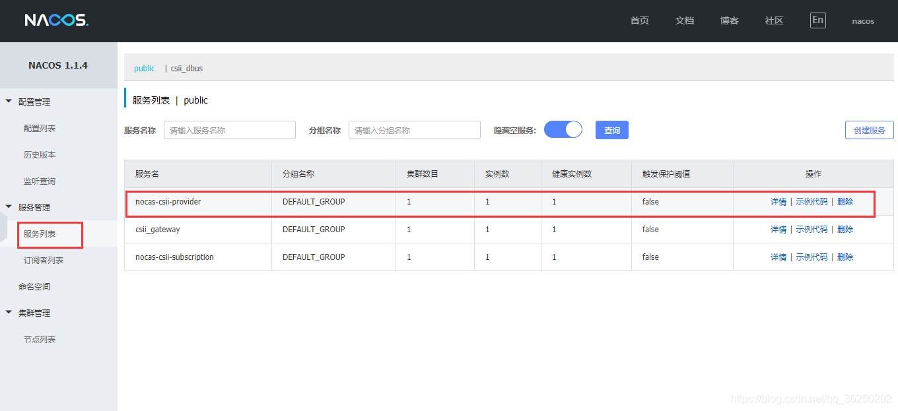

##  5.4Nacos作为配置中心（基础配置+分类配置）

1.POM依赖添加

```html
 <dependency>
        <groupId>com.alibaba.cloud</groupId>
        <artifactId>spring-cloud-starter-alibaba-nacos-config</artifactId>
    </dependency>
```

2.写yml

 bootstrap.yml编写

```html
server:
  port: 5000
spring:
  application:
    name: nocas-csii-provider
  cloud:

    nacos:
      discovery:
        server-addr: 192.168.xxx.xxx:8090 #Nacos服务注册中心地址
      config:
        server-addr: 192.168.xxx.xxx:8090 #Nacos作为配置中心地址
        file-extension: yaml  #指定yaml格式的配置
        group: DEFAULT_GROUP
        #group: DEV_GROUP
        namespace: bd677bce-c69e-473e-8f71-da92c6987215
```

 application.yml编写

```java
server:
  port: 5000

spring:

  application:
    name: nocas-csii-provider
  cloud:
    nacos:
      discovery:
        server-addr: xxx.xxx.xx.xxx:8090 #Nacos服务注册中心地址

      config:
        server-addr: xxx.xxx.xx.xxx:8090 #Nacos作为配置中心地址
        file-extension: yaml  #指定yaml格式的配置
        group: DEFAULT_GROUP
        #group: DEV_GROUP
        namespace: bd677bce-c69e-473e-8f71-da92c6987215
```

3.controller添加注解：@RefreshScope//实现配置自动更新

```java
package com.csii.regist.controller;

import com.csii.dbus.entities.CommonResult;
import com.csii.dbus.entities.Payment;
import com.csii.regist.service.PaymentService;
import lombok.extern.slf4j.Slf4j;
import org.springframework.beans.factory.annotation.Value;
import org.springframework.cloud.context.config.annotation.RefreshScope;
import org.springframework.web.bind.annotation.GetMapping;
import org.springframework.web.bind.annotation.PathVariable;
import org.springframework.web.bind.annotation.PostMapping;
import org.springframework.web.bind.annotation.RestController;
import javax.annotation.Resource;
import java.util.HashMap;
import java.util.concurrent.TimeUnit;


@RestController
@Slf4j
@RefreshScope//实现配置自动更新
public class RegistController {

    @Value("${server.port}")
    private String serverPort;

    @Resource
    private PaymentService paymentService;

    //只传给前端CommonResult，不需要前端了解其他的组件
    @PostMapping(value = "/getregist/create")
    public CommonResult create(Payment payment) {

        int result = paymentService.create(payment);
        //log.info("*****插入结果："+result);
        if (result > 0) {
            return new CommonResult(200, "插入数据成功,serverPort：" + serverPort, result);
        } else {
            return new CommonResult(444, "插入数据失败", null);
        }
    }


    @GetMapping(value = "/getregist/get/{id}")
    public CommonResult<Payment> getPaymentById(@PathVariable("id") Long id) {

        Payment payment = paymentService.getPaymentById(id);
        //log.info("*****插入结果："+payment);

        if (payment != null) {
            return new CommonResult(200, "查询成功,serverPort：" + serverPort, payment);

        } else {
            return new CommonResult(444, "没有对应记录,查询ID：" + id, null);
        }

    }
}
```

### 5.4.1 Nacos的图形化管理界面

配置管理

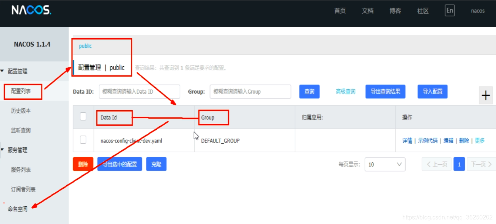

 命名空间


Namespace+Group+Data ID三者关系？为什么这么设计？

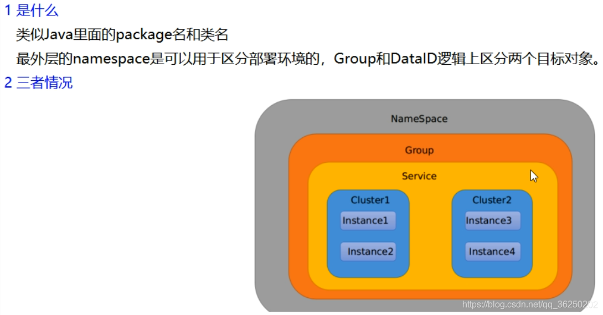

新建csii_dbus/test的Namespace

 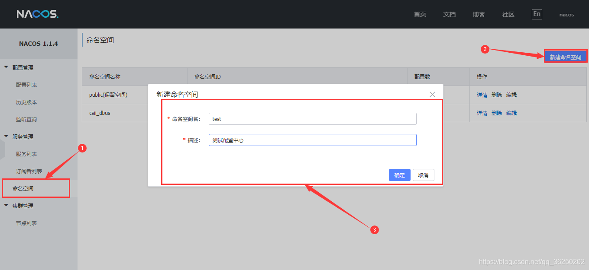

 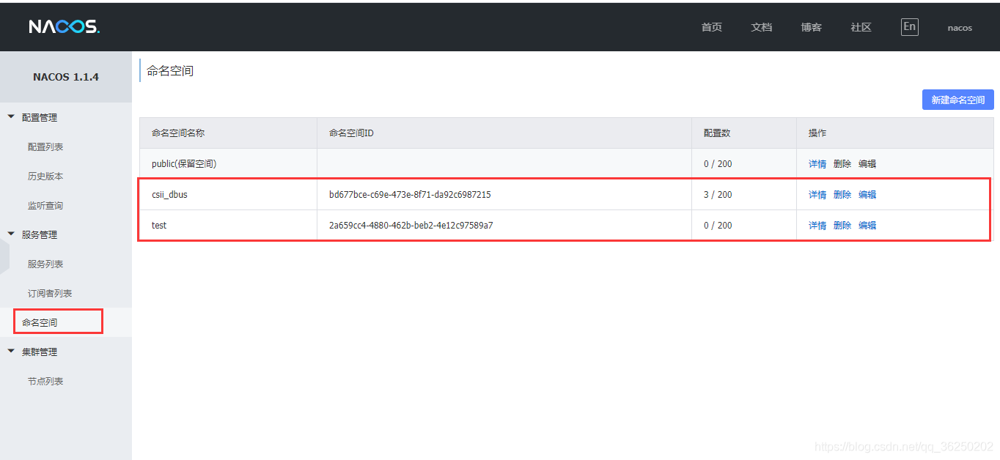

配置规则+nacos配置

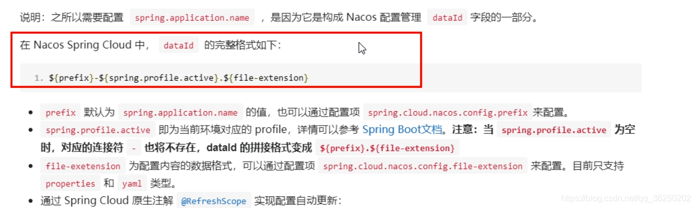

 

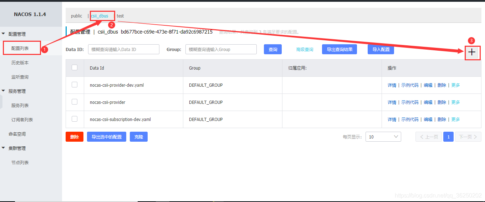 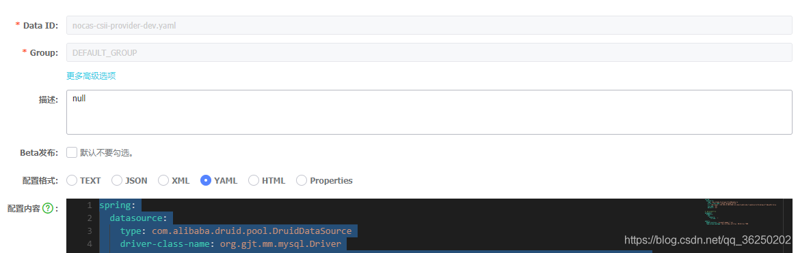

配置内容

```java
spring:
  datasource:
    type: com.alibaba.druid.pool.DruidDataSource
    driver-class-name: org.gjt.mm.mysql.Driver

    url: jdbc:mysql://xxx.xxx.xx.xxx:3306/csii_dbus?useUnicode=true&characterEncoding=utf-8&useSSL=false
    username: root
    password: root

# 开启所有端点允许HTTP查看

management:
  endpoints:
    web:
      exposure:
        include: '*'
mybatis:
  mapperLocations: classpath:mapper/*.xml

  type-aliases-package: com.csii.dbus.entities  #所有Entity别名类所在包
```

 启动+测试访问+访问成功+测试成功

# 六、OpenFeign服务接口调用

## 6.1 OpenFeign是什么？

​     Feign是一个声明式的web服务客户端，让编写web服务客户端变得非常容易，只需创建一个接口并在接口上添加注解即可。

## 6.2 OpenFeign能干什么？   

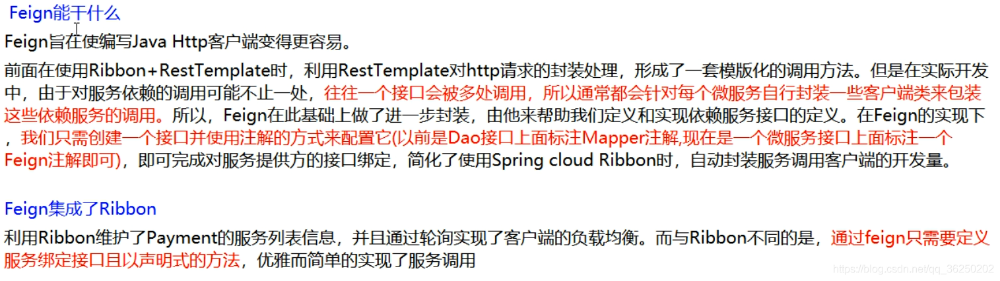

##  6.3Feign和OpenFeign两者区别

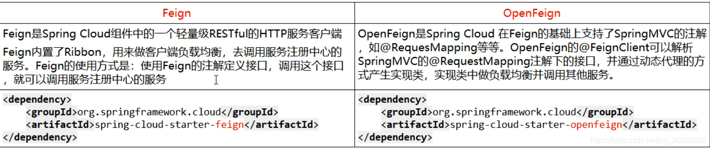

##  6.4 OpenFeign使用步骤 

​     接口+注解：微服务调用接口+@FeignClient

1.新建cloud-consumer-feign-order80

2.写POM

```html
        <dependency>

            <groupId>org.springframework.cloud</groupId>

            <artifactId>spring-cloud-starter-openfeign</artifactId>

        </dependency>

        <!--nacos-config-->

        <dependency>

            <groupId>com.alibaba.cloud</groupId>

            <artifactId>spring-cloud-starter-alibaba-nacos-config</artifactId>

        </dependency>

        <!--nacos-discovery-->
        <dependency>
            <groupId>com.alibaba.cloud</groupId>
            <artifactId>spring-cloud-starter-alibaba-nacos-discovery</artifactId>
        </dependency>
        <!--     sentinel-datasource-nacos 后续持久化用   -->

        <dependency>
            <groupId>com.alibaba.csp</groupId>
            <artifactId>sentinel-datasource-nacos</artifactId>
        </dependency>
          <dependency>
            <groupId>org.springframework.boot</groupId>
            <artifactId>spring-boot-starter-web</artifactId>
        </dependency>

        <dependency>
		     <groupId>org.springframework.boot</groupId>

            <artifactId>spring-boot-starter-actuator</artifactId>

        </dependency>
	    <dependency>

            <groupId>org.projectlombok</groupId>

            <artifactId>lombok</artifactId>

            <optional>true</optional>

        </dependency>

        <dependency>

            <groupId>org.springframework.boot</groupId>

            <artifactId>spring-boot-starter-test</artifactId>

            <scope>test</scope>

        </dependency>

        <dependency>

            <groupId>org.springframework.boot</groupId>

            <artifactId>spring-boot-devtools</artifactId>

            <scope>runtime</scope>

            <optional>true</optional>

        </dependency>
```

3.写yml

```java
server:

  port: 6001

spring:

  application:

    name: nocas-csii-subscription

  cloud:

    nacos:

      discovery:

        server-addr: 192.168.xxx.xxx:8090 #Nacos服务注册中心地址
```

4.主启动类加注解 ：@EnableFeignClients//启动Feign功能

```java
package com.csii.subscription;

import org.springframework.boot.SpringApplication;
import org.springframework.boot.autoconfigure.SpringBootApplication;
import org.springframework.cloud.client.discovery.EnableDiscoveryClient;
import org.springframework.cloud.openfeign.EnableFeignClients;


@SpringBootApplication
@EnableDiscoveryClient//开启服务注册发现功能
@EnableFeignClients//启动Feign功能

public class SubscriptionMain6001 {

    public static void main(String[] args) {
        SpringApplication.run(SubscriptionMain6001.class,args);
    }
}
```

 5.业务类

业务逻辑接口+@FeignClient配置调用provider服务

```java
package com.csii.subscription.service;

import com.csii.dbus.entities.CommonResult;
import com.csii.dbus.entities.Payment;
import org.springframework.cloud.openfeign.FeignClient;
import org.springframework.stereotype.Component;
import org.springframework.web.bind.annotation.GetMapping;
import org.springframework.web.bind.annotation.PathVariable;

@Component
@FeignClient(value = "nocas-csii-provider")
public interface PaymentFeignService {

    @GetMapping(value = "/getregist/nacos/{id}")

    public String getRegist(@PathVariable("id") Integer id);

}
```

控制层Controller

```java
package com.csii.subscription.controller;

import com.csii.dbus.entities.CommonResult;
import com.csii.dbus.entities.Payment;
import com.csii.subscription.service.PaymentFeignService;
import org.springframework.beans.factory.annotation.Value;
import org.springframework.cloud.context.config.annotation.RefreshScope;
import org.springframework.web.bind.annotation.GetMapping;
import org.springframework.web.bind.annotation.PathVariable;
import org.springframework.web.bind.annotation.RestController;
import javax.annotation.Resource;


@RestController
public class OrderFeignController {

    @Resource
    private PaymentFeignService paymentFeignService;
    @Value("${server.port}")
    private String serverPort;

    @GetMapping(value = "/sub/getregist/nacos/{id}")
    public String getRegist(@PathVariable("id") Integer id){

        return paymentFeignService.getRegist(id);
    }

}
```

 启动测试成功

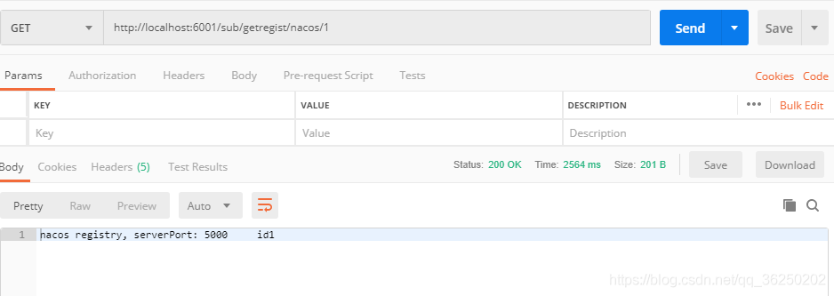

## 6.5 OpenFeign超时控制 

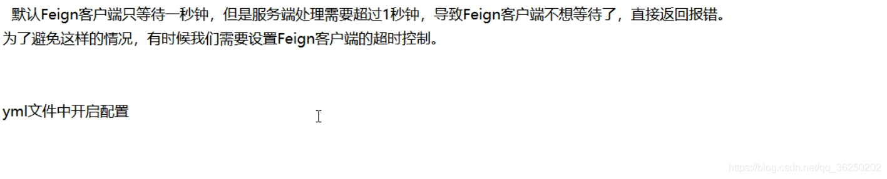

 OpenFeign默认支持Ribbon

1.YML文件里需要开启OpenFeign客户端超时控制 

```html
ribbon:
  ReadTimeout:  5000
  ConnectTimeout: 5000
```

测试：1.先去掉yml配置并关闭5001服务访问直接报错，

​      2.加上yml配置并开启5001服务，效果明显。

## 6.6 OpenFeign日志打印功能


1.日志级别

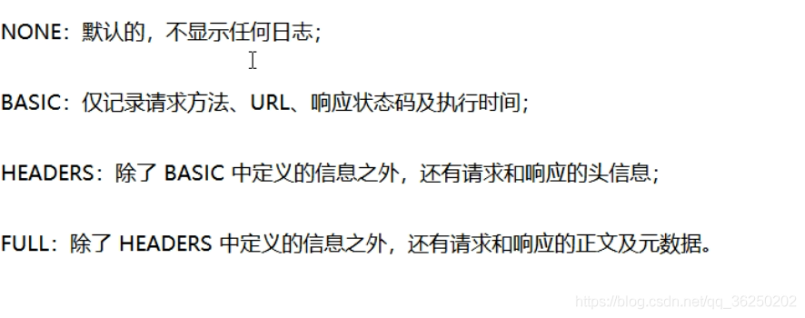

 2.配置日志bean

```java
package com.atguigu.springcloud.config;

import feign.Logger;
import org.springframework.context.annotation.Bean;

import org.springframework.context.annotation.Configuration;

@Configuration
public class FeignConfig {

    @Bean
    Logger.Level feignLoggerLevel(){
        return Logger.Level.FULL;
    }

}
```

3.YML文件里需要开启日志的Feign客户端

```java
logging:
  level:
    com.atguigu.springcloud.service.PaymentFeignService: debug
```

 **idea后台日志查看**

# 七、Sentinel实现熔断与限流

## 7.1 什么是Sentinel

​     随着微服务的流行，服务和服务之间的稳定性变得越来越重要。Sentinel 以流量为切入点，从流量控制、熔断降级、系统负载保护等多个维度保护服务的稳定性。

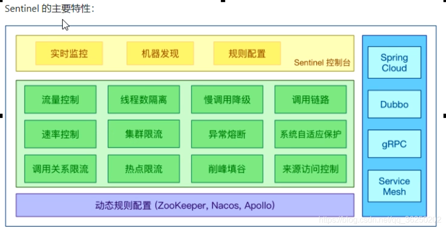

 

Sentinel 具有以下特征:

- **丰富的应用场景**：Sentinel 承接了阿里巴巴近 10 年的双十一大促流量的核心场景，例如秒杀（即突发流量控制在系统容量可以承受的范围）、消息削峰填谷、集群流量控制、实时熔断下游不可用应用等。
- **完备的实时监控**：Sentinel 同时提供实时的监控功能。您可以在控制台中看到接入应用的单台机器秒级数据，甚至 500 台以下规模的集群的汇总运行情况。
- **广泛的开源生态**：Sentinel 提供开箱即用的与其它开源框架/库的整合模块，例如与 Spring Cloud、Dubbo、gRPC 的整合。您只需要引入相应的依赖并进行简单的配置即可快速地接入 Sentinel。
- **完善的 SPI 扩展点**：Sentinel 提供简单易用、完善的 SPI 扩展接口。您可以通过实现扩展接口来快速地定制逻辑。例如定制规则管理、适配动态数据源等。

## 7.2安装与使用

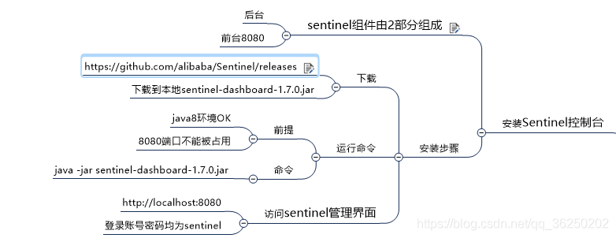

Sentinel 分为两个部分:

- 核心库（Java 客户端）不依赖任何框架/库，能够运行于所有 Java 运行时环境，同时对 Dubbo / Spring Cloud 等框架也有较好的支持。
- 控制台（Dashboard）基于 Spring Boot 开发，打包后可以直接运行，不需要额外的 Tomcat 等应用容器。

### 7.2.1 启动Nacos成功

### 7.2.2 5001服务模块编辑

1.写POM

```html
        <dependency>
            <groupId>com.alibaba.cloud</groupId>

            <artifactId>spring-cloud-starter-alibaba-sentinel</artifactId>
        </dependency>
```

2.写yml

```
server:
  port: 5001
spring:

  application:
    name: nocas-csii-provider

  cloud:
    nacos:
      discovery:
        server-addr: localhost:8848
    sentinel:

      transport:

        dashboard: localhost:8080

        port: 8719  #默认8719，假如被占用了会自动从8719开始依次+1扫描。直至找到未被占用的端口


management:

  endpoints:

    web:

      exposure:

        include: '*'
```

\3. 启动Sentinel8080

  java -jar sentinel-dashboard-1.7.0

4.启动5001微服务后查看sentienl控制台

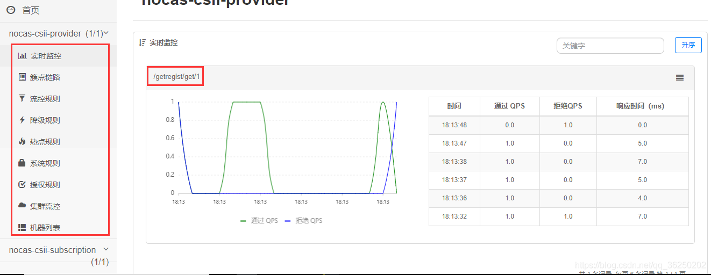

## 7.3 流控规则

###  7.3.1基本介绍

​     其原理是监控应用流量的 QPS 或并发线程数等指标，当达到指定的阈值时对流量进行控制，以避免被瞬时的流量高峰冲垮，从而保障应用的高可用性。

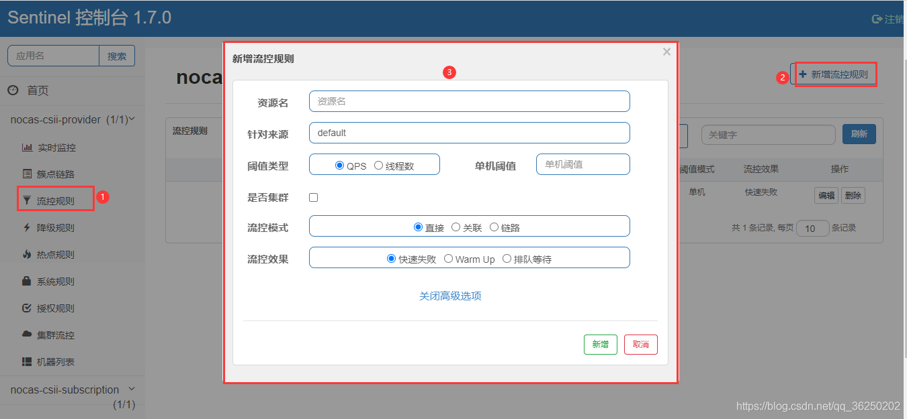

限流的直接表现是在执行 `Entry nodeA = SphU.entry(resourceName)` 的时候抛出 `FlowException` 异常。`FlowException` 是 `BlockException` 的子类，您可以捕捉 `BlockException` 来自定义被限流之后的处理逻辑。

一条限流规则主要由下面几个因素组成，我们可以组合这些元素来实现不同的限流效果：

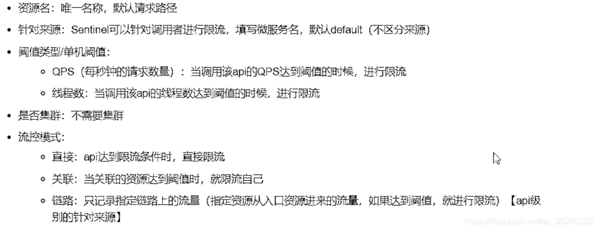

### 7.3.2流控模式

1.系统默认直接快速失败>>>配置及说明

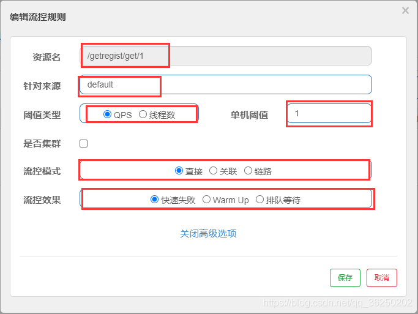

测试访问>>快速点：[http://192.168.xxx.xxx:5001/getregist/get/1](http://192.168.32.1:4001/getregist/get/1)

结果：


 思考：直接调用默认报错技术上ok，但是太粗暴了，体验很不好。所以需要类似有一个fallback的兜底方法。

2.关联

   当关联的资源达到阈值时，就限流自己；当与A关联的资源B达到阈值后，就限流自己；B惹事，A挂了。

配置:

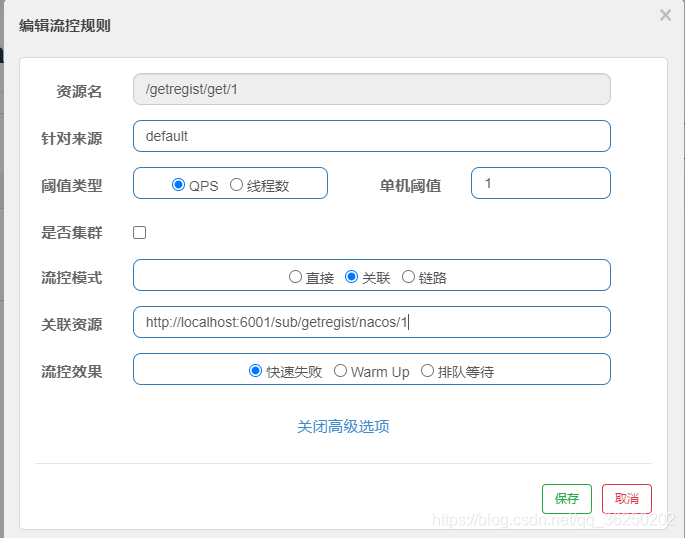

 postman模拟并发密集访问/sub/getregist/nacos/1

postman里新建多线程集合组:

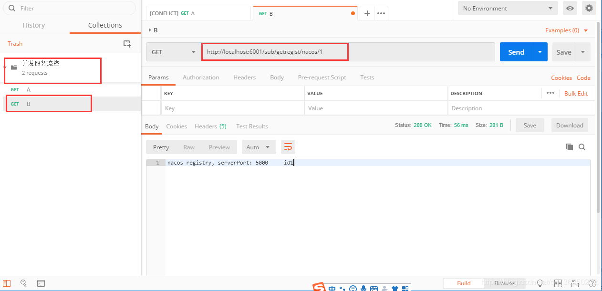

大批量线程高并发访问B，导致A失效了:

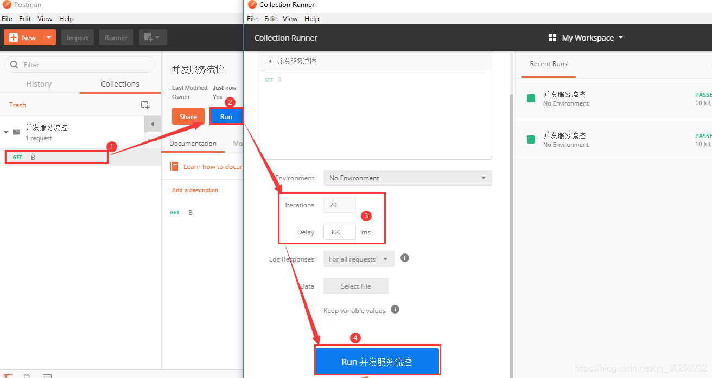

 快速在浏览器访问：/getregist/get/1

结果：

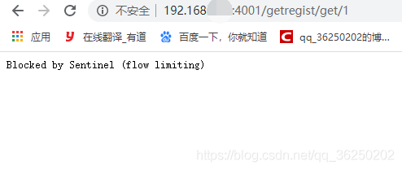

3.链路

`NodeSelectorSlot` 中记录了资源之间的调用链路，这些资源通过调用关系，相互之间构成一棵调用树。这棵树的根节点是一个名字为 `machine-root` 的虚拟节点，调用链的入口都是这个虚节点的子节点。

一棵典型的调用树如下图所示：

```
     	          machine-root

                    /       \

                   /         \

             Entrance1     Entrance2

                /             \

               /               \

      DefaultNode(nodeA)   DefaultNode(nodeA)
```

上图中来自入口 `Entrance1` 和 `Entrance2` 的请求都调用到了资源 `NodeA`，Sentinel 允许只根据某个入口的统计信息对资源限流。比如我们可以设置 `FlowRule.strategy` 为 `RuleConstant.CHAIN`，同时设置 `FlowRule.ref_identity` 为 `Entrance1` 来表示只有从入口 `Entrance1` 的调用才会记录到 `NodeA` 的限流统计当中，而不关心经 `Entrance2` 到来的调用。

**注意：为了方便理解上边这一段话大家自行与下两图匹配，不理解可以评论留言。**

```java
 public static final int FLOW_GRADE_THREAD = 0;

    public static final int FLOW_GRADE_QPS = 1;

    public static final int DEGRADE_GRADE_RT = 0;

    /**
     * Degrade by biz exception ratio in the current {@link IntervalProperty#INTERVAL} second(s).
     */

    public static final int DEGRADE_GRADE_EXCEPTION_RATIO = 1;

    /**
     * Degrade by biz exception count in the last 60 seconds.
     */

    public static final int DEGRADE_GRADE_EXCEPTION_COUNT = 2;

    public static final int AUTHORITY_WHITE = 0;

    public static final int AUTHORITY_BLACK = 1;

    public static final int STRATEGY_DIRECT = 0;

    public static final int STRATEGY_RELATE = 1;

    public static final int STRATEGY_CHAIN = 2;

    public static final int CONTROL_BEHAVIOR_DEFAULT = 0;

    public static final int CONTROL_BEHAVIOR_WARM_UP = 1;

    public static final int CONTROL_BEHAVIOR_RATE_LIMITER = 2;

    public static final int CONTROL_BEHAVIOR_WARM_UP_RATE_LIMITER = 3;

    public static final String LIMIT_APP_DEFAULT = "default";

    public static final String LIMIT_APP_OTHER = "other";

    public static final int DEFAULT_SAMPLE_COUNT = 2;

    public static final int DEFAULT_WINDOW_INTERVAL_MS = 1000;
```

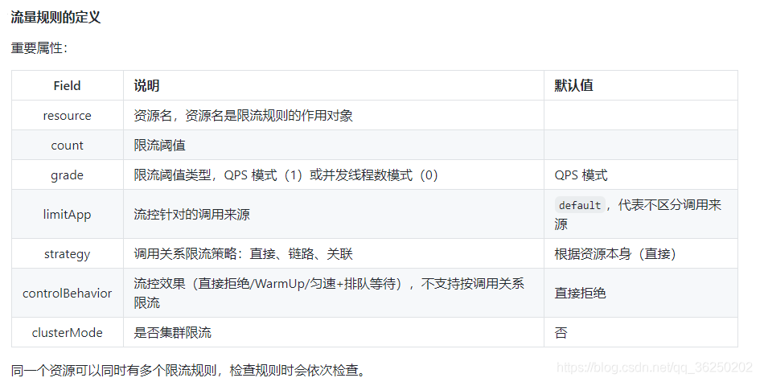

配置：

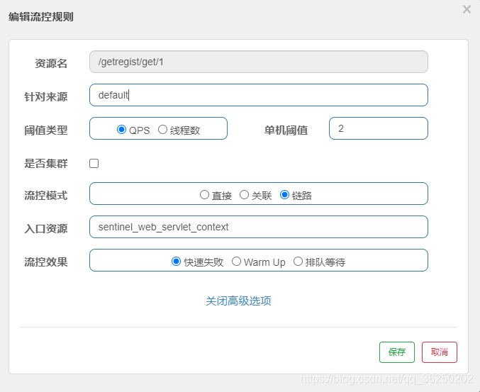

测试访问：[http://192.168.xxx.xxx:4001/getregist/get/1](http://192.168.32.1:4001/getregist/get/1)

当1秒流量（qps）>3时，报错：


### 7.3.3流控效果

**1、快速失败：直接失败**

​    方式是默认的流量控制方式，当QPS超过任意规则的阈值后，新的请求就会被立即拒绝，拒绝方式为抛出`FlowException`。这种方式适用于对系统处理能力确切已知的情况下，比如通过压测确定了系统的准确水位时。

直接抛错：（演示略）

```html
Blocked by Sentinel (flow limiting)
```

**2、Warm Up方式：即请求 QPS 从 threshold / 3 开始，经预热时长逐渐升至设定的 QPS 阈值（预热/冷启动方式）**

​    即预热/冷启动方式。当系统长期处于低水位的情况下，当流量突然增加时，直接把系统拉升到高水位可能瞬间把系统压垮。通过"冷启动"，让通过的流量缓慢增加，在一定时间内逐渐增加到阈值上限，给冷系统一个预热的时间，避免冷系统被压垮。

默认coldFactor为3，即请求QPS从threshold/3开始，经预热时长逐渐升至设定的QPS阈值。

源码：com.alibaba.csp.sentinel.slots.block.flow.controller.WarmUpController

```java
public WarmUpController(double count, int warmUpPeriodInSec) {

        construct(count, warmUpPeriodInSec, 3);

    }

private void construct(double count, int warmUpPeriodInSec, int coldFactor) {

        if (coldFactor <= 1) {

            throw new IllegalArgumentException("Cold factor should be larger than 1");

        }

        this.count = count;
        this.coldFactor = coldFactor;

        // thresholdPermits = 0.5 * warmupPeriod / stableInterval.

        // warningToken = 100;

        warningToken = (int)(warmUpPeriodInSec * count) / (coldFactor - 1);

        // / maxPermits = thresholdPermits + 2 * warmupPeriod /

        // (stableInterval + coldInterval)

        // maxToken = 200

        maxToken = warningToken + (int)(2 * warmUpPeriodInSec * count / (1.0 + coldFactor));

        // slope

        // slope = (coldIntervalMicros - stableIntervalMicros) / (maxPermits

        // - thresholdPermits);

        slope = (coldFactor - 1.0) / count / (maxToken - warningToken);

    }
```

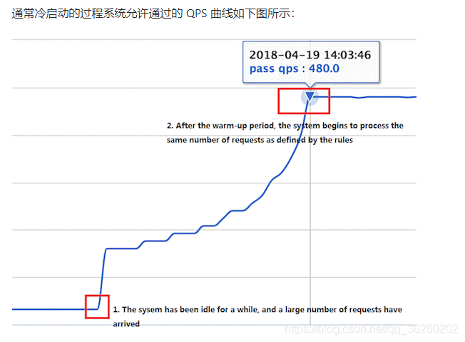

Warmup配置：

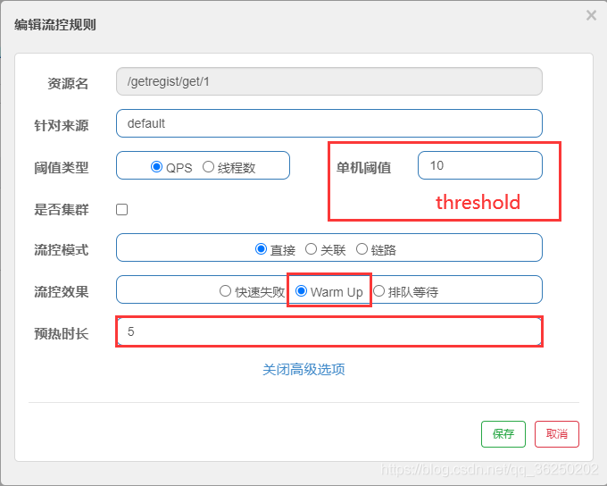

测试访问：[http://xxx:4001/getregist/get/1](http://192.168.32.1:4001/getregist/get/1)

一直狂点刚开始不行，基本5秒后就可以正常访问了。


**3、排队等待**

​    会严格控制请求通过的间隔时间，也即是让请求以均匀的速度通过，对应的是漏桶算法。详细文档可以参考 [流量控制 - 匀速器模式](https://github.com/alibaba/Sentinel/wiki/流量控制-匀速排队模式)，具体的例子可以参见 [PaceFlowDemo](https://github.com/alibaba/Sentinel/blob/master/sentinel-demo/sentinel-demo-basic/src/main/java/com/alibaba/csp/sentinel/demo/flow/PaceFlowDemo.java)。

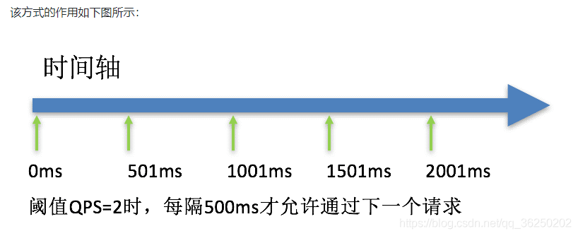

这种方式主要用于处理间隔性突发的流量，例如消息队列。想象一下这样的场景，在某一秒有大量的请求到来，而接下来的几秒则处于空闲状态，我们希望系统能够在接下来的空闲期间逐渐处理这些请求，而不是在第一秒直接拒绝多余的请求。

源码：com.alibaba.csp.sentinel.slots.block.flow.controller.RateLimiterController 

**配置：匀速排队，阈值必须设置为QPS**

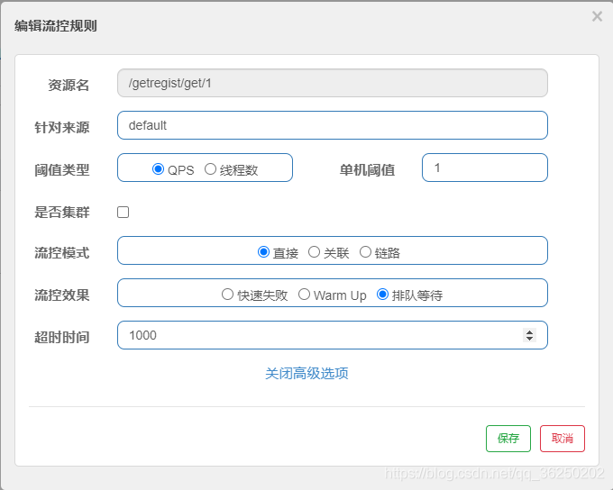

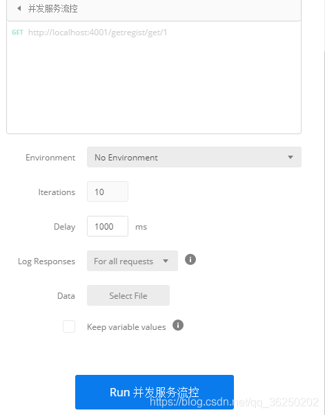

测试访问1s通过一个，所以多线程1000ms访问10次是不行的，已受到限制只能排队。

### 7.4 降级规则

7.4.1 官网溜一圈

**概述**

除了流量控制以外，对调用链路中不稳定的资源进行熔断降级也是保障高可用的重要措施之一。由于调用关系的复杂性，如果调用链路中的某个资源不稳定，最终会导致请求发生堆积。Sentinel **熔断降级**会在调用链路中某个资源出现不稳定状态时（例如调用超时或异常比例升高），对这个资源的调用进行限制，让请求快速失败，避免影响到其它的资源而导致级联错误。当资源被降级后，在接下来的降级时间窗口之内，对该资源的调用都自动熔断（默认行为是抛出 `DegradeException`）。

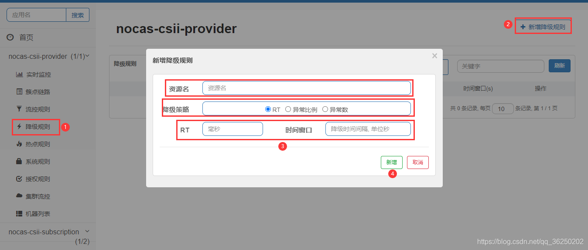

**降级策略**

我们通常用以下几种方式来衡量资源是否处于稳定的状态：

- 平均响应时间 (`DEGRADE_GRADE_RT`)：当 1s 内持续进入 N 个请求，对应时刻的平均响应时间（秒级）均超过阈值（`count`，以 ms 为单位），那么在接下的时间窗口（`DegradeRule` 中的 `timeWindow`，以 s 为单位）之内，对这个方法的调用都会自动地熔断（抛出 `DegradeException`）。注意 Sentinel 默认统计的 RT 上限是 4900 ms，**超出此阈值的都会算作 4900 ms**，若需要变更此上限可以通过启动配置项 `-Dcsp.sentinel.statistic.max.rt=xxx` 来配置。


**配置：**

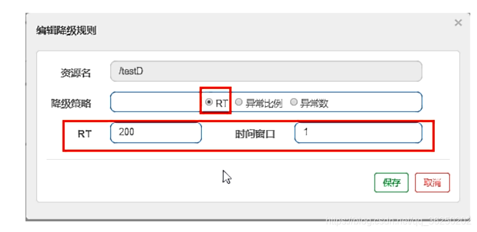

**代码：**

```java
    @GetMapping("/testD")
    public String testD()

    {

        try { TimeUnit.SECONDS.sleep(1); } catch (InterruptedException e) { e.printStackTrace(); }

        log.info("testD 测试RT");

        return "------testD";

    }
```

 **jmeter压测:**

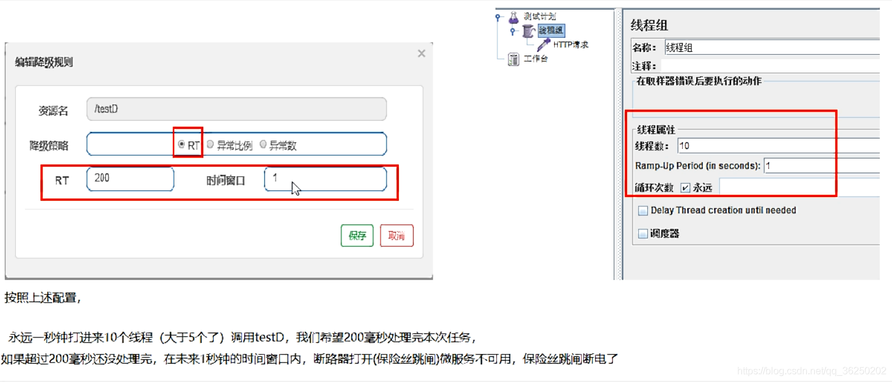


- 异常比例 (`DEGRADE_GRADE_EXCEPTION_RATIO`)：当资源的每秒请求量 >= N（可配置），并且每秒异常总数占通过量的比值超过阈值（`DegradeRule` 中的 `count`）之后，资源进入降级状态，即在接下的时间窗口（`DegradeRule` 中的 `timeWindow`，以 s 为单位）之内，对这个方法的调用都会自动地返回。异常比率的阈值范围是 `[0.0, 1.0]`，代表 0% - 100%。

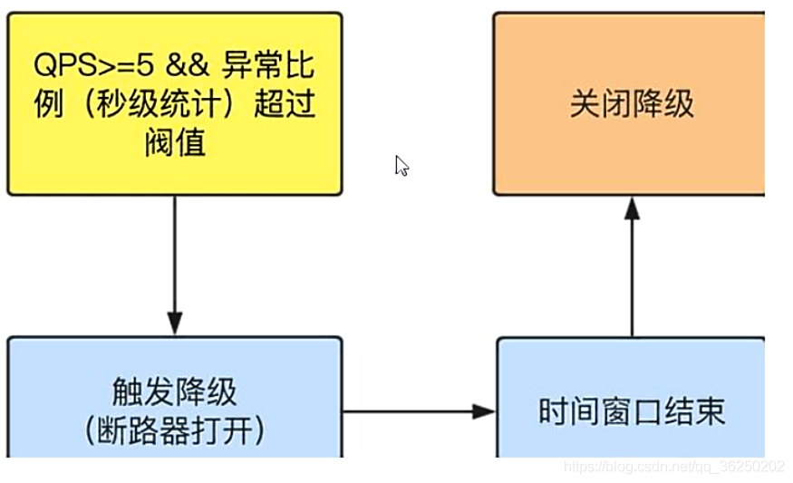

**配置：** 


**代码：**

```java
@GetMapping("/testD")
    public String testD()
    {

        log.info("testD 测试RT");
        int age = 10/0;
        return "------testD";

    }
```

 **jmeter压测:**


- 异常数 (`DEGRADE_GRADE_EXCEPTION_COUNT`)：当资源近 1 分钟的异常数目超过阈值之后会进行熔断。注意由于统计时间窗口是分钟级别的，若 `timeWindow` 小于 60s，则结束熔断状态后仍可能再进入熔断状态。

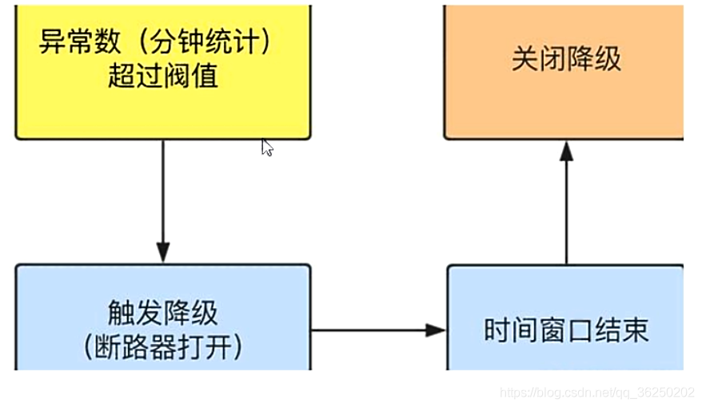

**配置：** 

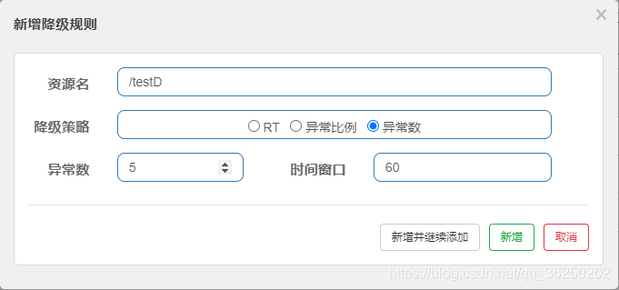

**代码**+ **jmeter压测:**同上（异常比例） 

### 7.5 热点key限流

## 7.5.1 Overview

何为热点？热点即经常访问的数据。很多时候我们希望统计某个热点数据中访问频次最高的 Top K 数据，并对其访问进行限制。比如：

- 商品 ID 为参数，统计一段时间内最常购买的商品 ID 并进行限制
- 用户 ID 为参数，针对一段时间内频繁访问的用户 ID 进行限制

热点参数限流会统计传入参数中的热点参数，并根据配置的限流阈值与模式，对包含热点参数的资源调用进行限流。热点参数限流可以看做是一种特殊的流量控制，仅对包含热点参数的资源调用生效。

 

Sentinel 利用 LRU 策略统计最近最常访问的热点参数，结合令牌桶算法来进行参数级别的流控。热点参数限流支持集群模式。

 **7.5.2 承上启下复习start：@SentinelResource**

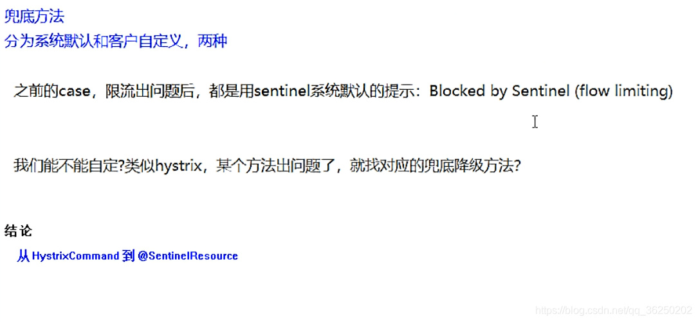

 **代码：**

```java
@GetMapping("/testHotKey")


@SentinelResource(value = "testHotKey",blockHandler = "deal_testHotKey")


public String testHotKey(@RequestParam(value = "p1",required = false) String p1,


                         @RequestParam(value = "p2",required = false) String p2) {


    //int age = 10/0;


    return "------testHotKey";


}


 


//兜底方法


public String deal_testHotKey (String p1, String p2, BlockException exception){


    return "------deal_testHotKey,o(╥﹏╥)o";  


}


 


 
```

 配置 nacos：

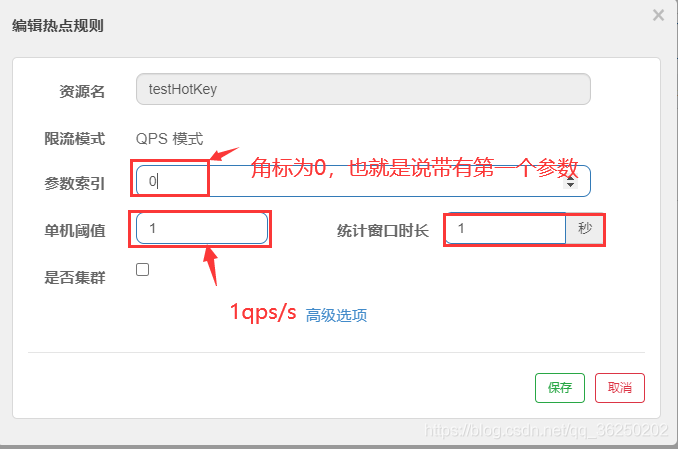

***\*注：\****方法testHostKey里面第一个参数只要QPS超过每秒1次，马上降级处理。如果参数索引为大于0的数则是连续多个参数；并不表示下标第几个。前提是不选择【高级选项】

测试成功

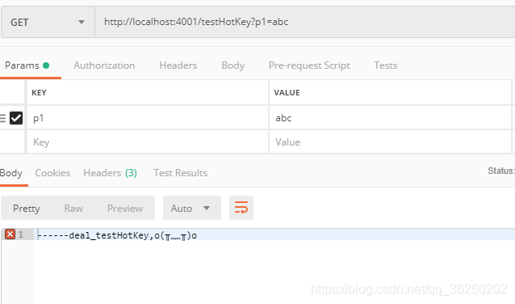

 **7.5.3 参数例外项**


sentinel配置热点：

 

测试成功

“p1=5”的时候可以访问200/s


### 7.6 系统规则

**系统自适应限流**

Sentinel 系统自适应限流从整体维度对应用入口流量进行控制，结合应用的 Load、CPU 使用率、总体平均 RT、入口 QPS 和并发线程数等几个维度的监控指标，通过自适应的流控策略，让系统的入口流量和系统的负载达到一个平衡，让系统尽可能跑在最大吞吐量的同时保证系统整体的稳定性。

**背景**

在开始之前，我们先了解一下系统保护的目的：

- 保证系统不被拖垮
- 在系统稳定的前提下，保持系统的吞吐量

长期以来，系统保护的思路是根据硬指标，即系统的负载 (load1) 来做系统过载保护。当系统负载高于某个阈值，就禁止或者减少流量的进入；当 load 开始好转，则恢复流量的进入。这个思路给我们带来了不可避免的两个问题：

- load 是一个“结果”，如果根据 load 的情况来调节流量的通过率，那么就始终有延迟性。也就意味着通过率的任何调整，都会过一段时间才能看到效果。当前通过率是使 load 恶化的一个动作，那么也至少要过 1 秒之后才能观测到；同理，如果当前通过率调整是让 load 好转的一个动作，也需要 1 秒之后才能继续调整，这样就浪费了系统的处理能力。所以我们看到的曲线，总是会有抖动。
- 恢复慢。想象一下这样的一个场景（真实），出现了这样一个问题，下游应用不可靠，导致应用 RT 很高，从而 load 到了一个很高的点。过了一段时间之后下游应用恢复了，应用 RT 也相应减少。这个时候，其实应该大幅度增大流量的通过率；但是由于这个时候 load 仍然很高，通过率的恢复仍然不高。

[TCP BBR](https://en.wikipedia.org/wiki/TCP_congestion_control#TCP_BBR) 的思想给了我们一个很大的启发。我们应该根据系统能够处理的请求，和允许进来的请求，来做平衡，而不是根据一个间接的指标（系统 load）来做限流。最终我们追求的目标是 **在系统不被拖垮的情况下，提高系统的吞吐率，而不是 load 一定要到低于某个阈值**。如果我们还是按照固有的思维，超过特定的 load 就禁止流量进入，系统 load 恢复就放开流量，这样做的结果是无论我们怎么调参数，调比例，都是按照果来调节因，都无法取得良好的效果。

Sentinel 在系统自适应保护的做法是，用 load1 作为启动自适应保护的因子，而允许通过的流量由处理请求的能力，即请求的响应时间以及当前系统正在处理的请求速率来决定。

**系统规则**

系统保护规则是从应用级别的入口流量进行控制，从单台机器的 load、CPU 使用率、平均 RT、入口 QPS 和并发线程数等几个维度监控应用指标，让系统尽可能跑在最大吞吐量的同时保证系统整体的稳定性。

系统保护规则是应用整体维度的，而不是资源维度的，并且**仅对入口流量生效**。入口流量指的是进入应用的流量（`EntryType.IN`），比如 Web 服务或 Dubbo 服务端接收的请求，都属于入口流量。


系统规则支持以下的模式：

- **Load 自适应**（仅对 Linux/Unix-like 机器生效）：系统的 load1 作为启发指标，进行自适应系统保护。当系统 load1 超过设定的启发值，且系统当前的并发线程数超过估算的系统容量时才会触发系统保护（BBR 阶段）。系统容量由系统的 `maxQps * minRt` 估算得出。设定参考值一般是 `CPU cores * 2.5`。
- **CPU usage**（1.5.0+ 版本）：当系统 CPU 使用率超过阈值即触发系统保护（取值范围 0.0-1.0），比较灵敏。
- **平均 RT**：当单台机器上所有入口流量的平均 RT 达到阈值即触发系统保护，单位是毫秒。
- **并发线程数**：当单台机器上所有入口流量的并发线程数达到阈值即触发系统保护。
- **入口 QPS**：当单台机器上所有入口流量的 QPS 达到阈值即触发系统保护。

自行测试+简单+不重要 

### 7.7注解@SentinelResource

> 注意：注解方式埋点不支持 private 方法。

`@SentinelResource` 用于定义资源，并提供可选的异常处理和 fallback 配置项。 `@SentinelResource` 注解包含以下属性：

- `value`：资源名称，必需项（不能为空）

- `entryType`：entry 类型，可选项（默认为 `EntryType.OUT`）

- `blockHandler` / `blockHandlerClass`: `blockHandler` 对应处理 `BlockException` 的函数名称，可选项。blockHandler 函数访问范围需要是 `public`，返回类型需要与原方法相匹配，参数类型需要和原方法相匹配并且最后加一个额外的参数，类型为 `BlockException`。blockHandler 函数默认需要和原方法在同一个类中。若希望使用其他类的函数，则可以指定 `blockHandlerClass` 为对应的类的 `Class` 对象，注意对应的函数必需为 static 函数，否则无法解析。

- ```
  fallback
  ```

   / 

  ```
  fallbackClass
  ```

  ：fallback 函数名称，可选项，用于在抛出异常的时候提供 fallback 处理逻辑。fallback 函数可以针对所有类型的异常（除了 

  ```
  exceptionsToIgnore
  ```

   里面排除掉的异常类型）进行处理。fallback 函数签名和位置要求：

  - 返回值类型必须与原函数返回值类型一致；
  - 方法参数列表需要和原函数一致，或者可以额外多一个 `Throwable` 类型的参数用于接收对应的异常。
  - fallback 函数默认需要和原方法在同一个类中。若希望使用其他类的函数，则可以指定 `fallbackClass` 为对应的类的 `Class` 对象，注意对应的函数必需为 static 函数，否则无法解析。

- ```
  defaultFallback
  ```

  （since 1.6.0）：默认的 fallback 函数名称，可选项，通常用于通用的 fallback 逻辑（即可以用于很多服务或方法）。默认 fallback 函数可以针对所有类型的异常（除了 

  ```
  exceptionsToIgnore
  ```

   里面排除掉的异常类型）进行处理。若同时配置了 fallback 和 defaultFallback，则只有 fallback 会生效。defaultFallback 函数签名要求：

  - 返回值类型必须与原函数返回值类型一致；
  - 方法参数列表需要为空，或者可以额外多一个 `Throwable` 类型的参数用于接收对应的异常。
  - defaultFallback 函数默认需要和原方法在同一个类中。若希望使用其他类的函数，则可以指定 `fallbackClass` 为对应的类的 `Class` 对象，注意对应的函数必需为 static 函数，否则无法解析。

- `exceptionsToIgnore`（since 1.6.0）：用于指定哪些异常被排除掉，不会计入异常统计中，也不会进入 fallback 逻辑中，而是会原样抛出。

> 注：1.6.0 之前的版本 fallback 函数只针对降级异常（`DegradeException`）进行处理，**不能针对业务异常进行处理**。
>
>  

示例：好用简单不做演示，有问题评论留言 

```java
public class TestService {


 


    // 对应的 `handleException` 函数需要位于 `ExceptionUtil` 类中，并且必须为 static 函数.


    @SentinelResource(value = "test", blockHandler = "handleException", blockHandlerClass = {ExceptionUtil.class})


    public void test() {


        System.out.println("Test");


    }


 


    // 原函数


    @SentinelResource(value = "hello", blockHandler = "exceptionHandler", fallback = "helloFallback")


    public String hello(long s) {


        return String.format("Hello at %d", s);


    }


    


    // Fallback 函数，函数签名与原函数一致或加一个 Throwable 类型的参数.


    public String helloFallback(long s) {


        return String.format("Halooooo %d", s);


    }


 


    // Block 异常处理函数，参数最后多一个 BlockException，其余与原函数一致.


    public String exceptionHandler(long s, BlockException ex) {


        // Do some log here.


        ex.printStackTrace();


        return "Oops, error occurred at " + s;


    }


}
```

 

### 7.8 服务熔断功能

**7.8.1Feign系列**

1.写pom（略）+上边 案例已加过了

2.写yml（略）+上边 案例已加过了 

3.业务类

带@FeignClient注解的业务接口：

```java
package com.atguigu.springcloud.alibaba.service;


 


 


import com.atguigu.springcloud.alibaba.entities.CommonResult;


import com.atguigu.springcloud.alibaba.entities.Payment;


import org.springframework.cloud.openfeign.FeignClient;


import org.springframework.web.bind.annotation.GetMapping;


import org.springframework.web.bind.annotation.PathVariable;


 


 


@FeignClient(value = "nocas-csii-provider",fallback = PaymentFallbackService.class)


public interface PaymentService


{


    @GetMapping(value = "/paymentSQL/{id}")


    public CommonResult<Payment> paymentSQL(@PathVariable("id") Long id);


}


 


 
```

 PaymentFallbackService实现类：

```java
package com.atguigu.springcloud.alibaba.service;


 


 


import com.atguigu.springcloud.alibaba.entities.CommonResult;


import com.atguigu.springcloud.alibaba.entities.Payment;


import org.springframework.stereotype.Component;


 


 


@Component


public class PaymentFallbackService implements PaymentService


{


    @Override


    public CommonResult<Payment> paymentSQL(Long id)


    {


        return new CommonResult<>(44444,"服务降级返回,---PaymentFallbackService",new Payment(id,"errorSerial"));


    }


}


 


 
```

Controller： 

```java
// OpenFeign


@Resource


private PaymentService paymentService;


 


@GetMapping(value = "/consumer/paymentSQL/{id}")


public CommonResult<Payment> paymentSQL(@PathVariable("id") Long id) {


    return paymentService.paymentSQL(id);


}


 
```

 测试6001调用5001，此时故意关闭5001微服务提供者，看6001消费侧自动降级，不会被耗死。

**7.8.2 熔断框架比较**


### 7.9 规则持久化

 **7.9.1 是什么？**

​    一旦我们重启应用，Sentinel规则将消失，生产环境需要将配置规则进行持久化.

 **7.9.2 怎么玩？**

​      将限流配置规则持久化进Nacos保存，只要刷新5001某个rest地址，sentinel控制台的流控规则就能看到，只要Nacos里面   的配置不删除，针对5001上Sentinel上的流控规则持续有效。

**7.9.3 步骤：**

1.修改csii_service_regist5001

2.写POM

```html
<dependency>


    <groupId>com.alibaba.csp</groupId>


    <artifactId>sentinel-datasource-nacos</artifactId>


</dependency>


 
```

3.写YML

```
server:


  port: 5000


 


spring:


  application:


    name: nocas-csii-provider


  cloud:


    nacos:


      discovery:


        server-addr: 192.168.XXX.XXX:8090 #Nacos服务注册中心地址


      config:


        server-addr: 192.168.XXX.XXX:8090 #Nacos作为配置中心地址


        file-extension: yaml  #指定yaml格式的配置


        group: DEFAULT_GROUP


        #group: DEV_GROUP


        namespace: bd677bce-c69e-473e-8f71-da92c6987215


    sentinel:


      transport:


        dashboard: 192.168.XXX.XXX:8080


        port: 8719  #默认8719，假如被占用了会自动从8719开始依次+1扫描。直至找到未被占用的端口


      datasource:


        ds1:


          nacos:


            server-addr: 192.168.XXX.XXX:8090 #nginx代理后的地址


            dataId: nocas-csii-provider


            groupId: DEFAULT_GROUP


            data-type: json


            rule-type: flow


            namespace: bd677bce-c69e-473e-8f71-da92c6987215


management:


  endpoints:


    web:


      exposure:


        include: '*'


 


feign:


  sentinel:


    enabled: true # 激活Sentinel对Feign的支持
```

4.添加Nacos业务规则配置 


内容解析： 

 

 启动5001后刷新sentinel发现业务规则有了


 

# 八、Gateway新一代网关

### 8.1 概述简介

**2.2.1.RELEASE**

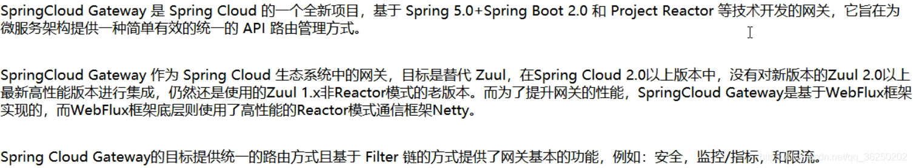

***\**\*[1.如何包括Spring Cloud Gateway](https://cloud.spring.io/spring-cloud-static/spring-cloud-gateway/2.2.1.RELEASE/reference/html/#gateway-starter)\*\**\***

要将Spring Cloud Gateway包含在您的项目中，请使用启动器，其组ID为`org.springframework.cloud`，工件ID为`spring-cloud-starter-gateway`。有关使用当前Spring Cloud Release Train设置构建系统的详细信息，请参见[Spring Cloud Project页面](https://projects.spring.io/spring-cloud/)。

如果包括启动器，但不希望启用网关，请设置`spring.cloud.gateway.enabled=false`。

|      | Spring Cloud Gateway是基于[Spring Boot 2.x](https://spring.io/projects/spring-boot#learn)，[Spring WebFlux](https://docs.spring.io/spring/docs/current/spring-framework-reference/web-reactive.html)和[Project Reactor ](https://projectreactor.io/docs)[构建的](https://docs.spring.io/spring/docs/current/spring-framework-reference/web-reactive.html)。结果，当您使用Spring Cloud Gateway时，许多您熟悉的同步库（例如，Spring Data和Spring Security）和模式可能不适用。如果您不熟悉这些项目，建议您在使用Spring Cloud Gateway之前先阅读它们的文档以熟悉一些新概念。 |
| ---- | ------------------------------------------------------------ |
|      |                                                              |

|      | Spring Cloud Gateway需要Spring Boot和Spring Webflux提供的Netty运行时。它不能在传统的Servlet容器中或作为WAR构建时使用。 |
| ---- | ------------------------------------------------------------ |
|      |                                                              |

 

**源码架构:** 


 **能干嘛？**


 **微服务架构中网关在哪里：**


**GateWay模型 ：**


 

### 8.2 三大核心概念


**总体：** 


###  8.3 Gateway工作流程

**官网总结：**


**核心逻辑：** 

路由转发+执行过滤器链

### 8.4 通过微服务名实现动态路由配置

**8.4.1新建Module**

1.csii_gateway_gateway4001

2.写POM

```html
<!--新增gateway-->

        <dependency>

            <groupId>org.springframework.cloud</groupId>

            <artifactId>spring-cloud-starter-gateway</artifactId>

        </dependency>

        <dependency>

            <groupId>com.csii.dbus</groupId>

            <artifactId>csii_api_commons</artifactId>

            <version>1.0-SNAPSHOT</version>

        </dependency>

        <dependency>
            <groupId>org.springframework.boot</groupId>
            <artifactId>spring-boot-devtools</artifactId>
            <scope>runtime</scope>

            <optional>true</optional>

        </dependency>
        <dependency>

            <groupId>org.projectlombok</groupId>

            <artifactId>lombok</artifactId>

            <optional>true</optional>

        </dependency>

        <dependency>

            <groupId>org.springframework.boot</groupId>

            <artifactId>spring-boot-starter-test</artifactId>

            <scope>test</scope>

        </dependency>

        <!--     sentinel-datasource-nacos 后续持久化用   -->

        <dependency>

            <groupId>com.alibaba.csp</groupId>

            <artifactId>sentinel-datasource-nacos</artifactId>

        </dependency>

        <!--nacos客户端-->

        <dependency>

            <groupId>com.alibaba.nacos</groupId>

            <artifactId>nacos-client</artifactId>

        </dependency>


        <!--     sentinel-datasource-nacos 后续持久化用   -->

        <dependency>

            <groupId>com.alibaba.cloud</groupId>

            <artifactId>spring-cloud-starter-alibaba-sentinel</artifactId>

        </dependency>

        <dependency>

            <groupId>org.springframework.cloud</groupId>

            <artifactId>spring-cloud-starter-openfeign</artifactId>

        </dependency>

        <!--spring-boot-starter-webflux:反应式Web框架-->

        <dependency>

            <groupId>org.springframework.boot</groupId>

            <artifactId>spring-boot-starter-webflux</artifactId>

        </dependency>

      <!--  <dependency>

            <groupId>com.alibaba.cloud</groupId>

            <artifactId>spring-cloud-starter-alibaba-nacos-config</artifactId>

        </dependency>-->

        <!--nacos-discovery-->

        <dependency>

            <groupId>com.alibaba.cloud</groupId>

            <artifactId>spring-cloud-starter-alibaba-nacos-discovery</artifactId>

        </dependency>

        <dependency>

            <groupId>com.alibaba.csp</groupId>

            <artifactId>sentinel-datasource-nacos</artifactId>

        </dependency>

        <dependency>

            <groupId>cn.hutool</groupId>

            <artifactId>hutool-all</artifactId>

            <version>4.6.3</version>

        </dependency>
```

3.写yml(默认情况下Gateway会根据注册中心的服务列表，以注册中心上微服务名为路径创建动态路由进行转发，从而实现动态路由的功能)

**注意：**需要注意的是uri的协议为lb，表示启用Gateway的负载均衡功能

```
server:


  port: 4001


spring:


  application:


    name: csii_gateway


  cloud:


    nacos:


      discovery:


        server-addr: 192.168.xxx.xxx:8090 #Nacos服务注册中心地址


    gateway:


      discovery:


        locator:


          enabled: true  #开启从注册中心动态创建路由的功能，利用微服务名进行路由


      routes:


        - id: regist_routh #路由的ID，没有固定规则但要求唯一，建议配合服务名


          #uri: http://192.168.xxx.xxx:5000   #匹配后提供服务的路由地址


          uri: lb://nocas-csii-provider


          predicates:


            #- Path=/getregist/get/**   #断言,路径相匹配的进行路由


            - Path=/**


        #- id: regist_routh2 #路由的ID，没有固定规则但要求唯一，建议配合服务名


         # uri: lb://cloud-payment-service


         # predicates:


         #   - Path=/payment/lb/**   #断言,路径相匹配的进行路由


 


 


 


 


 


# 显示详细健康信息


# management.endpoint.health.show-details=always


# 开启所有端点允许HTTP查看


management:


  endpoints:


    web:


      exposure:


        include: '*'


 
```

 lb://serviceName是spring cloud gateway在微服务中自动为我们创建的负载均衡uri

4.业务类（无）

5.主启动类

```java
package com.csii.gateway;


 


import org.springframework.boot.SpringApplication;


import org.springframework.boot.autoconfigure.SpringBootApplication;


import org.springframework.cloud.client.discovery.EnableDiscoveryClient;


 


@SpringBootApplication


//@EnableEurekaClient//Eureka


@EnableDiscoveryClient


public class GateWayMain4001 {


 


    public static void main(String[] args) {


 


        SpringApplication.run(GateWayMain4001.class, args);


 


    }


}
```

 测试：http://localhost:4001/getregist/nacos/1 微服务名动态路由成功

### 8.5 Predicate的使用

**8.5.1 是什么？**


 **8.5.1 常用的Route Predicate**


**After时间API** 

```java
      ZonedDateTime zonedDateTime = ZonedDateTime.now();


        System.out.println(zonedDateTime);
```

**yml配置** 

```
server:


  port: 9527


spring:


  application:


    name: cloud-gateway


  cloud:


    gateway:


      discovery:


        locator:


          enabled: true  #开启从注册中心动态创建路由的功能，利用微服务名进行路由


      routes:


        - id: payment_routh #路由的ID，没有固定规则但要求唯一，建议配合服务名


          #uri: http://localhost:8001   #匹配后提供服务的路由地址


          uri: lb://cloud-payment-service


          predicates:


            - Path=/payment/get/**   #断言,路径相匹配的进行路由


 


        - id: payment_routh2


          #uri: http://localhost:8001   #匹配后提供服务的路由地址


          uri: lb://cloud-payment-service


          predicates:


            - Path=/payment/lb/**   #断言,路径相匹配的进行路由


            #- After=2020-03-08T10:59:34.102+08:00[Asia/Shanghai]


            #- Cookie=username,zhangshuai #并且Cookie是username=zhangshuai才能访问


            #- Header=X-Request-Id, \d+ #请求头中要有X-Request-Id属性并且值为整数的正则表达式


            #- Host=**.atguigu.com


            #- Method=GET


            #- Query=username, \d+ #要有参数名称并且是正整数才能路由


 


 


eureka:


  instance:


    hostname: cloud-gateway-service


  client:


    service-url:


      register-with-eureka: true


      fetch-registry: true


      defaultZone: http://eureka7001.com:7001/eureka


 


 
```

 **总结：**

说白了，Predicate就是为了实现一组匹配规则，让请求过来找到对应的Route进行处理。

### 8.6 Filter的使用

**8.6.1是什么？**


单一常用的GatewayFilter与自定义全局GlobalFilter， 演示比较简单官网搞起来。

# 九、Seata处理分布式事务

### 9.1 Seata简介

​    Seata 是一款开源的分布式事务解决方案，致力于提供高性能和简单易用的分布式事务服务。Seata 将为用户提供了 AT、TCC、SAGA 和 XA 事务模式，为用户打造一站式的分布式解决方案。

### 9.2 分布式事务问题

**1.分布式前**


**2.分布式之后**


**问题：**一次业务操作需要跨多个数据源或需要跨多个系统进行远程调用，就会产生分布式事务问题. 

### 9.3 Seata-Server安装

### 9.4 Seata之原理简介

# 十、Sleuth分布式请求链路追踪

### 10.1 概述

**10.1.1是什么？**

1.Spring Cloud Sleuth提供了一套完整的服务跟踪的解决方案。

2.在分布式系统中提供追踪解决方案并且兼容支持了zipkin

**10.1.2为什么会出现这个技术？需要解决哪些问题？**


**10.1.3 解决** 


 

### 10.2 搭建链路监控步骤

**10.2.1 zipkin**

1.下载

SpringCloud从F版起已不需要自己构建Zipkin server了，只需要调用jar包即可

https://dl.bintray.com/openzipkin/maven/io/zipkin/java/zipkin-server/

zipkin-server-2.12.9.exec.jar

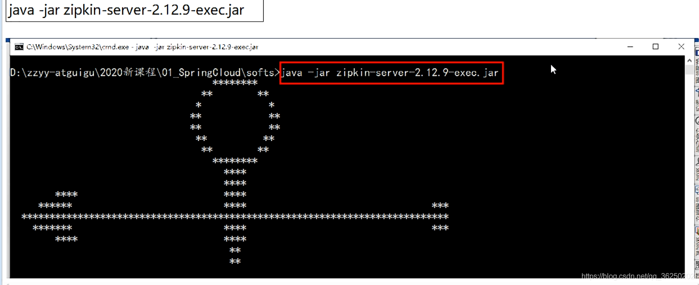

**2.运行控制台**

访问路径：http://localhost:9411/zipkin/

**完整的调用链路：**

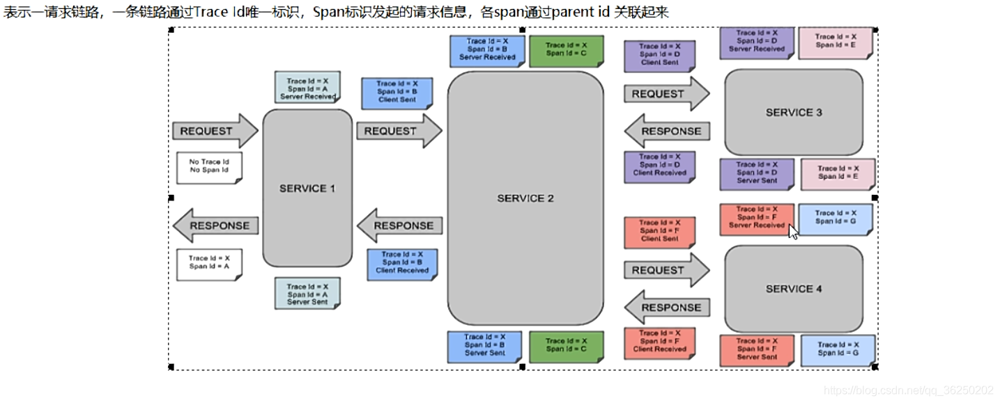

**简化图：**

 **名词解释：**

**Trace:**类似于树结构的Span集合，表示一条调用链路，存在唯一标识。

**span:**表示调用链路来源，通俗的理解span就是一次请求信息。

**10.2.2 csii_service_regist5001**

1.写pom

```html
        <!--包含了sleuth+zipkin-->
        <dependency>
            <groupId>org.springframework.cloud</groupId>
            <artifactId>spring-cloud-starter-zipkin</artifactId>
        </dependency>
```

2.写yml

```java
spring:

  application:

    name: nocas-csii-provider

  zipkin:

    base-url: http://192.168.xxx.xxx:9411

  sleuth:

    sampler:

    probability: 1 #表示全部采集
```

测试访问： http://localhost:4001/getregist/nacos/1

打开：http://localhost:9411/zipkin/


