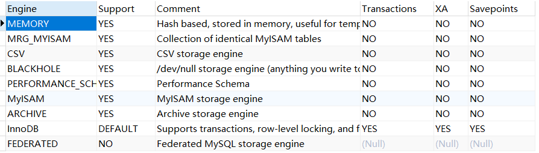

# MYSQL存储引擎

在mysql中执行 show engines； 可以看到mysql支持的引擎类型。在5.6之前，默认引擎都是MyISAM，5.6之后默认引擎就是innoDB了。

## 一、MySQL常用存储引擎及特点

1、InnoDB存储引擎

从MySQL5.5版本之后，MySQL的默认内置存储引擎已经是InnoDB了，他的主要特点有：

（1）灾难恢复性比较好；
（2）支持事务。默认的事务隔离级别为可重复度，通过MVCC（并发版本控制）来实现的。
（3）使用的锁粒度为行级锁，可以支持更高的并发；
（4）支持外键；
（5）配合一些热备工具可以支持在线热备份；
（6）在InnoDB中存在着缓冲管理，通过缓冲池，将索引和数据全部缓存起来，加快查询的速度；
（7）对于InnoDB类型的表，其数据的物理组织形式是聚簇表。所有的数据按照主键来组织。数据和索引放在一块，都位于B+数的叶子节点上；

2、MyISAM存储引擎
在5.5版本之前，MyISAM是MySQL的默认存储引擎，该存储引擎并发性差，不支持事务，所以使用场景比较少，主要特点为：

（1）不支持事务；
（2）不支持外键，如果强行增加外键，不会提示错误，只是外键不其作用；
（3）对数据的查询缓存只会缓存索引，不会像InnoDB一样缓存数据，而且是利用操作系统本身的缓存；
（4）默认的锁粒度为表级锁，所以并发度很差，加锁快，锁冲突较少，所以不太容易发生死锁；
（5）支持全文索引（MySQL5.6之后，InnoDB存储引擎也对全文索引做了支持），但是MySQL的全文索引基本不会使用，对于全文索引，现在有其他成熟的解决方案，比如：ElasticSearch，Solr，Sphinx等。
（6）数据库所在主机如果宕机，MyISAM的数据文件容易损坏，而且难恢复；

3、MEMORY存储引擎
将数据存在内存中，和市场上的Redis，memcached等思想类似，为了提高数据的访问速度，主要特点：

（1）支持的数据类型有限制，比如：不支持TEXT和BLOB类型，对于字符串类型的数据，只支持固定长度的行，VARCHAR会被自动存储为CHAR类型；
（2）支持的锁粒度为表级锁。所以，在访问量比较大时，表级锁会成为MEMORY存储引擎的瓶颈；
（3）由于数据是存放在内存中，所以在服务器重启之后，所有数据都会丢失；
（4）查询的时候，如果有用到临时表，而且临时表中有BLOB，TEXT类型的字段，那么这个临时表就会转化为MyISAM类型的表，性能会急剧降低；

4、ARCHIVE存储引擎
ARCHIVE存储引擎适合的场景有限，由于其支持压缩，故主要是用来做日志，流水等数据的归档，主要特点：

（1）支持Zlib压缩，数据在插入表之前，会先被压缩；
（2）仅支持SELECT和INSERT操作，存入的数据就只能查询，不能做修改和删除；
（3）只支持自增键上的索引，不支持其他索引；

5、CSV存储引擎
数据中转试用，主要特点：

（1）其数据格式为.csv格式的文本，可以直接编辑保存；
（2）导入导出比较方便，可以将某个表中的数据直接导出为csv，试用Excel办公软件打开；

6：黑洞（blackHole）

该引擎接受数据但是不存储数据，接收到查询之后总返回空的集合。该引擎类型的表可以通过发送到slave节点替换DML配置。但是master节点不存储数据。

7：NDB或者NDB集群

这种集群数据库引擎特别适合需要尽可能高的正常运行时间和可用性的应用程序

除此之外，还有merge和federated等引擎，参见 

[MYSQL存储引擎]: https://dev.mysql.com/doc/refman/5.7/en/storage-engines.html

## 二、InnoDB和MyISAM的对比

1、由于锁粒度的不同，InnoDB比MyISAM支持更高的并发；
2、InnoDB为行级锁，MyISAM为表级锁，所以InnoDB相对于MyISAM来说，更容易发生死锁，锁冲突的概率更大，而且上锁的开销也更大，因为需要为每一行加锁；
3、在备份容灾上，InnoDB支持在线热备，有很成熟的在线热备解决方案；
4、查询性能上，MyISAM的查询效率高于InnoDB，因为InnoDB在查询过程中，是需要维护数据缓存，而且查询过程是先定位到行所在的数据块，然后在从数据块中定位到要查找的行；而MyISAM可以直接定位到数据所在的内存地址，可以直接找到数据；
5、SELECT COUNT(*)语句，如果行数在千万级别以上，MyISAM可以快速查出，而InnoDB查询的特别慢，因为MyISAM将行数单独存储了，而InnoDB需要朱行去统计行数；所以如果使用InnoDB，而且需要查询行数，则需要对行数进行特殊处理，如：离线查询并缓存；
6、MyISAM的表结构文件包括：.frm(表结构定义),.MYI(索引),.MYD(数据)；而InnoDB的表数据文件为:.ibd和.frm(表结构定义)；

## 三、如何选择合适的存储引擎

1、使用场景是否需要事务支持；
2、是否需要支持高并发，InnoDB的并发度远高于MyISAM；
3、是否需要支持外键；
4、是否需要支持在线热备；
5、高效缓冲数据，InnoDB对数据和索引都做了缓冲，而MyISAM只缓冲了索引；
6、索引，不同存储引擎的索引并不太一样；

