# 数据库索引

最近一段时间重新深入研究了一遍MySQL的内容，今天主要分享分析MySQL索引原理，后续会输出一些关于MySQL方面的干货，希望各位小伙伴喜欢。

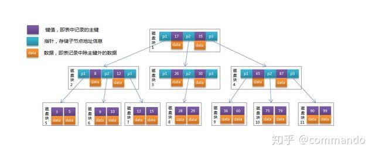

## **一、什么是索引、为什么要建立索引？**

关于索引的理解，个人更加喜欢将其比喻为字典里面的目录，根据字典来进行查询的速度远大于每一页逐个逐个字排查的速度。

索引主要用于快速找出在某个列中有特定值的行，倘若不使用索引，MySQL必须从第一条记录开始读完整个表，直到找出相关的行，表越大，查询数据所花费的时间就越多。如果表中查询的列有一个索引，MySQL能够快速到达一个位置去搜索数据，而不必查找所有数据，那么将会节省很大一部分时间。

**（一）、索引的存储文件是如何的？**

首先我们来看看mysql索引数据的存储位置：

mysql的数据存储是存放在mysql的data文件夹底下，截图如下所示：

查看该文件夹底下，我们通常可以看到相关的信息内容：

.frm表结构文件，和所选用的存储引擎无关。

**（二）、MyISAM引擎的文件格式**

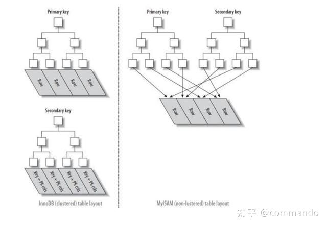

**1、myd 数据文件后缀**

**2、myi 索引文件后缀**

**（三）、InnoDB引擎的文件格式**

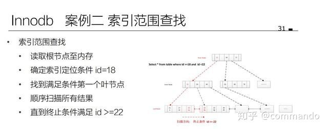

**1、ibd 将索引信息和数据一起存储起来**

## 二、索引的结构是什么？为何不采用别的结构？

索引在起初做设计的时候其实是有一定数据结构选型的，对于不同的数据结构基础，我做了以下 的相关总结：

**（一）、使用二叉树作为索引结构缺陷**

容易导致二叉树出现结构偏移，极端情况容易变成一条链表的形状。

**例如下方情况：**

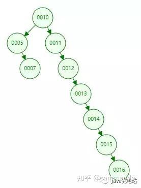

**（二）、使用红黑树数据结构的缺陷**

红黑树虽然有自动进行树节点的二叉平衡功能。虽然相对于二叉树而言，不会有太严重的单边偏移情况，但还是避免不了极端情况下树的重心出现偏移的现象。（数据量变大的情况下，深度会变大）

使用红黑树数据结构容易在极端的情况下发生红黑树失重情况，如下图所示，随着数据量的增大，失重情况愈发严重：

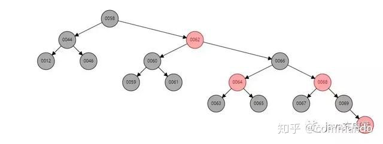

**（三）、hash索引的缺陷**

虽然说hash查询的速度很快，但是依然有以下缺陷：

**1、无法解决查询范围导致的问题**

**2、无法解决hash冲突的问题**

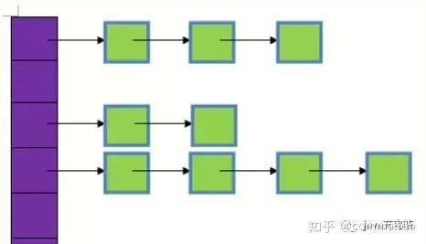

## **三、如何理解BTree**

在学习索引的真正结构之前，首先我们需要来了解一下什么是BTree。

**（一）、BTree的基本结构如下图所示：**

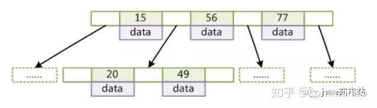

**（二）、BTree里面包含有几个重要的特点**

1、度(Degree)-节点的数据存储个数，一旦存储数据超过度值就要进行节点分裂

2、	所有叶子节点具有相同的深度

3、叶子节点的指针为空

4、叶子节点中的数据key从左到右递增排列

btree数据结构通过节点的横向扩展，从而压低整个Btree的高度，减少了节点io读取的次数。通常百万级别的数据会被压到3-5层的高度。

## **四、节点数据读取过程发生了什么？**

我在初学索引的时候，觉得io次数读取越少，因此获取数据的速度会越快。后来重新回看了一遍操作系统原理的讲解之后，对于这块的内容有了更加深入的认识。

**（一）、磁盘数据读取**

指针在同一磁道上边读取数据的时候如果采用的是顺序读取方式，那么数据的读取效率就会比较高效。倘若数据在进行读取的时候采用了随机读取的方式，则需要进行磁道的变换，这种磁道变换读取所带来的性能消耗会是巨大的。每个节点存放的地址通常都不会是连续的，不可避免的会有一些内存碎片存在，因此每一次进行io读取都会是比较耗费性能的。

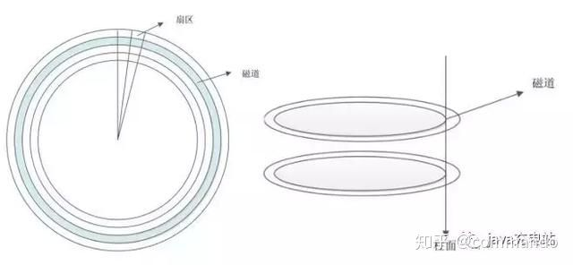

btree里面的节点采用了key-value的基本存储结构，key是索引的数值，value是存储的data数值。由于我们对于btree进行节点	比较的时候是基于内存进行数据比较，先从磁盘进行io读取数据，读取到cpu缓存中进行比对。

在了解了磁道读取问题之后，我们再来思考一下索引的遍历。

**如下图所示：**

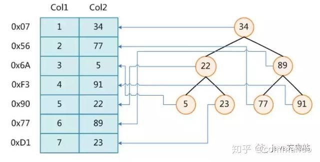

如图所示，假设我们没有采用索引，要读取数据第七行（23），则需要进行7次的io读取操作。假若使用了索引，则可以通过走索引的方式，34-->22-->23一共三次io读取操作即可查找到所要的节点23。

**（二）、度值无限扩增会如何？**

**如果我们将节点的度设置到极致，例如说将度设置到100W，那么BTree的高度就会降低，查询的次数就会大大减少，是否可行？**

这种想法是不可行的，节点会变得过大。每次进行节点数据读取的时候都需要将磁盘的数据加载到操作系统自身的缓存中。假设将度值设置过大，io一次读取的大小还是有限，过大的节点还是需要进行多次的io读取。

计算机里面的内存和磁盘之间进行数据读取是按照计算机自身标准来进行设置的，每次读取的大小空间基本单位通常称之为	**页**	，假设每一页的数据读取通常是8k（不同硬件设备大小不同），假若说一个节点的大小为10M,那么读取该节点里面的数据则需要进行多次的io操作。**（通常DBA在进行数据库的度值设置的时候默认是将一个页单位的大小设置为度的大小。）**

**（三）、磁盘 IO**

一个数据库必须保证其中存储的所有数据都是可以随时读写的，同时因为	**MySQL** 中所有的数据其实都是以文件的形式存储在磁盘上的，而从磁盘上随机访问对应的数据非常耗时，所以数据库程序和操作系统提供了	**缓冲池**	和	**内存**	以提高数据的访问速度。

除此之外，我们知道数据库对数据的读取并不是以行为单位进行的，无论是读取一行还是多行，都会将该行或者多行所在的页全部加载进来，然后再读取对应的数据记录；也就是说，读取所耗费的时间与行数无关，只与页数有关。（这也就是数据库的预读取机制）

**页大小可以如下操作显示：**

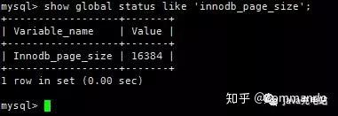

在 MySQL 中，页的大小一般为 16KB，不过也可能是 8KB、32KB 或者其他值，这跟 MySQL 的存储引擎对数据的存储方式有很大的关系。

关于数据库的缓存池原理剖析日后在后续我会进行解析，这里暂时先略过。

## **五、如何进行BTree的优化？**

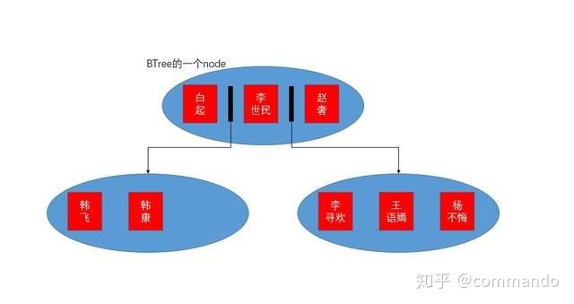

如果每个节点的大小越小，则操作系统读取一页数据的内容则越多，内存中可容纳的数据量增加，处理的效率也会有所提升。因此	B+Tree	就此诞生了。

**（一）、如何理解B+Tree？**

**B+Tree的基本结构如下图所示：**

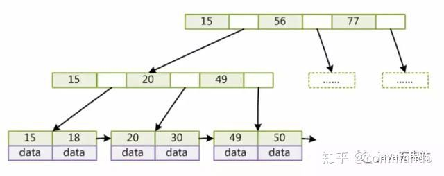

**（二）、B+Tree几个比较重要的特点：**

1、非叶子节点不存储data，只存储key，可以增大度的值。

2、叶子节点不存储指针。

3、顺序访问指针，提高区间访问的性能。

仔细观察图中树结构的同学不知道是否有发现，B+Tree里面对于索引数据进行了适当的冗余存储，但是这一点相比于度大小的增加而言，并不会带来太多的性能影响。由于非叶子结点只存储key，并没有存储data数据，因此所有的非叶子结点的度可以增加地更大，	使得一次	io	读取的数据更多，从磁盘读取到操作系统内存中的数据也大大增加。

仔细观察B+Tree里面的数据结构，会发现叶子节点里面有相应的顺序访问指针。

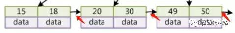

B+Tree的叶子节点之间的顺序访问指针的作用可以提高范围查询的效率。

例如说在一定范围内进行数据查询的时候不需要像BTree那样，每次在进行节点数据读取的时候都需要重新从顶部开始读取，可以根据相应的顺序指针直接进行连续读取，提高了范围性读取数据的效率。

## **六、Myisam非聚簇索引**

之前我们有说过mysql里面数据存储的位置和文件信息。myisam存储引擎里面，mysql读取数据的时候会有一个文件指针，根据指针来读取数据文件的顺序为：.	myi--->.myd（读取数据文件里面的内容然后查找数据）

存储引擎里面的索引通常会被划分为主键索引和非主键索引（一般是指除了主键索引之外的那些索引）

**（一）、主键索引：**

主键索引比较好理解，B+Tree里面的叶子节点的key存储的是索引值，value存储的是相应data数据的指针。

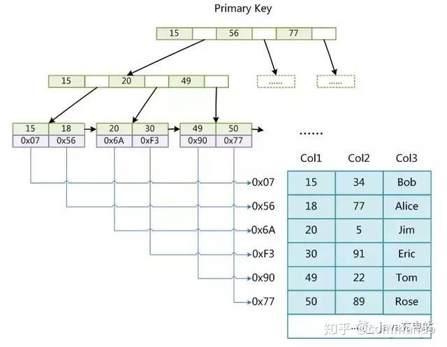

**（二）、辅助索引：**

Myisam里面的辅助索引结构和主键索引基本一致，结构如下图所示

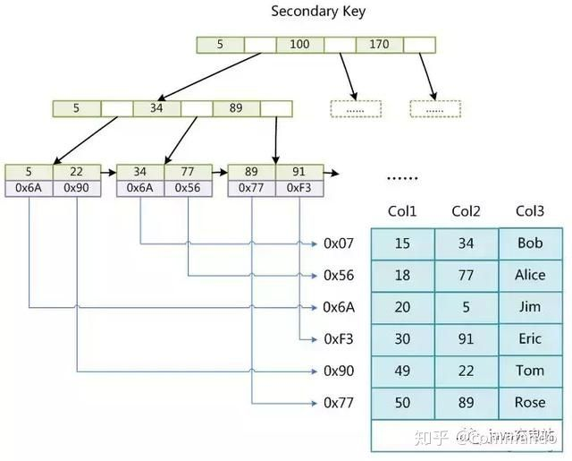

**（三）、Innodb聚簇索引**

在上边我们提及过innodb存储中，是将数据和索引放在了同一份文件里面的。

因此innodb里面的非主键索引（辅助索引）和主键索引有一定的区别，下边我们来用图例进行详细对比说明：

innodb里面的主键索引和非主键索引：

**（四）、主键索引**

主键索引里面的存储情况如下图所示，叶子节点里面的key是索引的信息，value是数据表里面该索引对应行的数据信息。

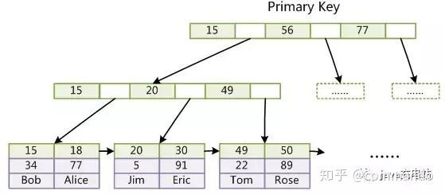

**（五）、非主键索引**

这种索引在进行存储的时候，虽然说节点依然是key-value的结构，key对应的是相应的索引，但是value对应的却是主键索引的值。如下图所示：

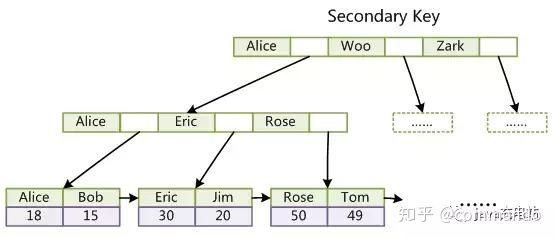

如果索引里面存储的值不是数字类型而是字符串类型，那么在进行索引插入或者索引查找的时候都需要通过计算每个字符的ASCII码来判断索引的大小。

## **七、为什么InnoDB表必须有主键？**

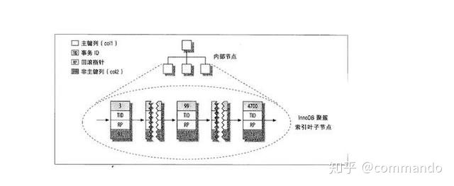

在innodb存储引擎里面，数据的默认的存储结构默认是以B+Tree的结构来进行存储的，因此必须要有主键存在。

即使手动没有设置主键，innodb也会自动选取一列数据进行设置，或者默认生成一列作为主键。

**（一）、使用uuid和自增id作为主键的区别？**

在了解了索引原理之后，我们不妨从底层来思考一下使用uuid替代自增id带来的缺陷。

1、由于uuid的长度普遍要比自增id的长度要长，因此uuid更加占用磁盘空间。

2、uuid通常都是以字符串的形式存在的，因此在进行比较的时候大多都是基于字符串的形式进行比较的(使用ack||码),而自增主键使用的是integer的比较方式。效率方面差异较大。

3、uuid在进行数据插入的时候可能会插入到某个度已经满了的节点里面，这个时候原有的旧节点就需要进行节点的分裂操作了，需要进行数据的移动，降低性能效率。

**（二）、联合索引的底层存储结构是如何的？**

在实际项目开发中，联合索引是我们经常会用到的优化技巧之一，本文暂时先不讲优化，先从底层去理解联合索引的存储方式，后边会展开优化的讲解。例如一个联合索引里面用到了id，职位名称，出生日期三个字段，那么在存储的时候会将三个字段一起存入节点里面的key位置。如下图所示：

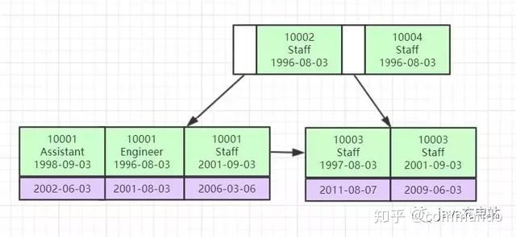

在索引节点里面的key进行比对的时候，会按照id，职位名称，出生日期的顺序（由左到右），比较的时候是逐一比对，一旦没有匹配到指定字段，则不会继续匹配，这也是我们常说的复合索引里面的最左前缀匹配原则。