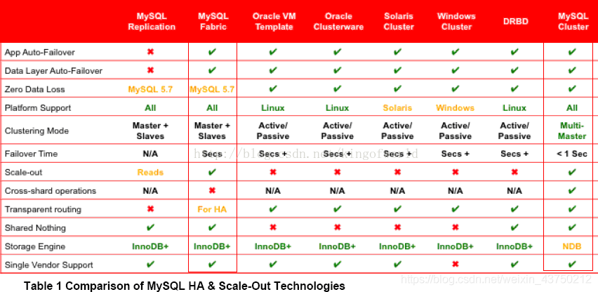
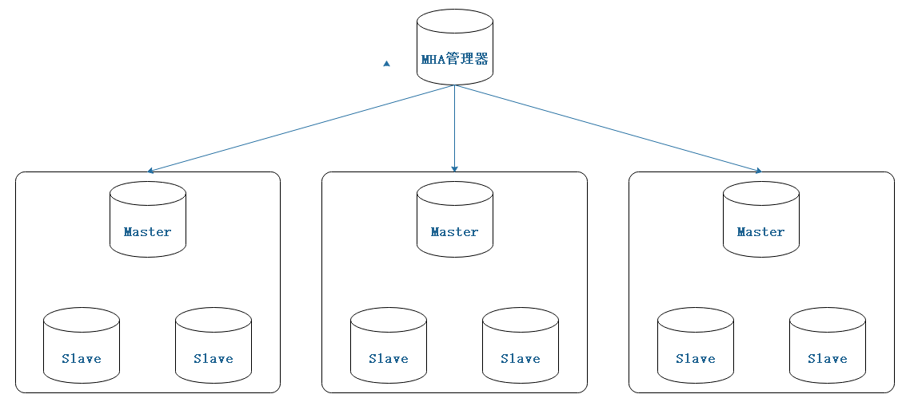
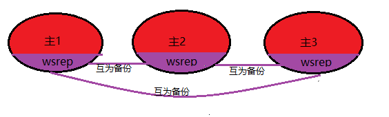
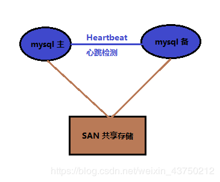
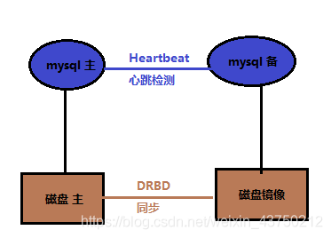
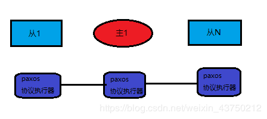
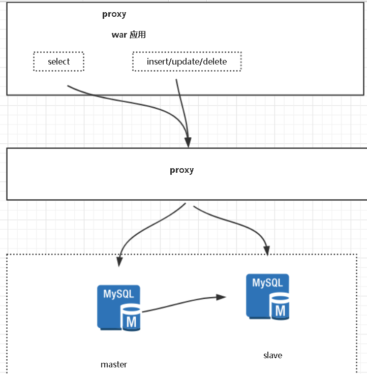

# 多图文，详细介绍mysql各个集群方案

集群的好处

- 高可用性：故障检测及迁移，多节点备份。
- 可伸缩性：新增数据库节点便利，方便扩容。
- 负载均衡：切换某服务访问某节点，分摊单个节点的数据库压力。

集群要考虑的风险

- 网络分裂：群集还可能由于网络故障而拆分为多个部分，每部分内的节点相互连接，但各部分之间的节点失去连接。
- 脑裂：导致数据库节点彼此独立运行的集群故障称为“脑裂”。这种情况可能导致数据不一致，并且无法修复，例如当两个数据库节点独立更新同一表上的同一行时。


### 一，mysql原厂出品

##### 1，MySQL Replication

mysql复制（MySQL Replication），是mysql自带的功能。

原理简介：

主从复制是通过重放binlog实现主库数据的异步复制。即当主库执行了一条sql命令，那么在从库同样的执行一遍，从而达到主从复制的效果。在这个过程中，master对数据的写操作记入二进制日志文件中(binlog)，生成一个 log dump 线程，用来给从库的  i/o线程传binlog。而从库的i/o线程去请求主库的binlog，并将得到的binlog日志写到中继日志（relaylog）中，从库的sql线程，会读取relaylog文件中的日志，并解析成具体操作，通过主从的操作一致，而达到最终数据一致。


MySQL Replication一主多从的结构，主要目的是实现数据的多点备份（没有故障自动转移和负载均衡）。相比于单个的mysql，一主多从下的优势如下：

- 如果让后台读操作连接从数据库，让写操作连接主数据库，能起到读写分离的作用，这个时候多个从数据库可以做负载均衡。
- 可以在某个从数据库中暂时中断复制进程，来备份数据，从而不影响主数据的对外服务（如果在master上执行backup，需要让master处于readonly状态，这也意味这所有的write请求需要阻塞）。

就各个集群方案来说，其优势为：

- 主从复制是mysql自带的，无需借助第三方。
- 数据被删除，可以从binlog日志中恢复。
- 配置较为简单方便。

其劣势为：

- 从库要从binlog获取数据并重放，这肯定与主库写入数据存在时间延迟，因此从库的数据总是要滞后主库。
- 对主库与从库之间的网络延迟要求较高，若网络延迟太高，将加重上述的滞后，造成最终数据的不一致。
- 单一的主节点挂了，将不能对外提供写服务。

##### 2，MySQL Fabirc

mysql织物（MySQL Fabirc），是mysql官方提供的。

这是在MySQL Replication的基础上，增加了故障检测与转移，自动数据分片功能。不过依旧是一主多从的结构，MySQL Fabirc只有一个主节点，区别是当该主节点挂了以后，会从从节点中选择一个来当主节点。

就各个集群方案来说，其优势为：

- mysql官方提供的工具，无需第三方插件。
- 数据被删除，可以从binlog日志中恢复。
- 主节点挂了以后，能够自动从从节点中选择一个来当主节点，不影响持续对外提供写服务。

其劣势为：

- 从库要从binlog获取数据并重放，这肯定与主库写入数据存在时间延迟，因此从库的数据总是要滞后主库。
- 对主库与从库之间的网络延迟要求较高，若网络延迟太高，将加重上述的滞后，造成最终数据的不一致。
- 2014年5月推出的产品，数据库资历较浅，应用案例不多，网上各种资料相对较少。
- 事务及查询只支持在同一个分片内，事务中更新的数据不能跨分片，查询语句返回的数据也不能跨分片。
- 节点故障恢复30秒或更长（采用InnoDB存储引擎的都这样）。

##### 3，MySQL Cluster

mysql集群（MySQL Cluster）也是mysql官方提供的。

MySQL Cluster是多主多从结构的

就各个集群方案来说，其优势为：

- mysql官方提供的工具，无需第三方插件。
- 高可用性优秀，99.999%的可用性，可以自动切分数据，能跨节点冗余数据（其数据集并不是存储某个特定的MySQL实例上，而是被分布在多个Data Nodes中，即一个table的数据可能被分散在多个物理节点上，任何数据都会在多个Data  Nodes上冗余备份。任何一个数据变更操作，都将在一组Data Nodes上同步，以保证数据的一致性）。
- 可伸缩性优秀，能自动切分数据，方便数据库的水平拓展。
- 负载均衡优秀，可同时用于读操作、写操作都都密集的应用，也可以使用SQL和NOSQL接口访问数据。
- 多个主节点，没有单点故障的问题，节点故障恢复通常小于1秒。

其劣势为：

- 架构模式和原理很复杂。
- 只能使用存储引擎 NDB ，与平常使用的InnoDB 有很多明显的差距。比如在事务（其事务隔离级别只支持Read  Committed，即一个事务在提交前，查询不到在事务内所做的修改），外键（虽然最新的NDB  存储引擎已经支持外键，但性能有问题，因为外键所关联的记录可能在别的分片节点），表限制上的不同，可能会导致日常开发出现意外。[点击查看具体差距比较](https://dev.mysql.com/doc/mysql-cluster-excerpt/8.0/en/mysql-cluster-ndb-innodb-engines.html)
- 作为分布式的数据库系统，各个节点之间存在大量的数据通讯，比如所有访问都是需要经过超过一个节点（至少有一个 SQL Node和一个 NDB Node）才能完成，因此对节点之间的内部互联网络带宽要求高。
- Data Node数据会被尽量放在内存中，对内存要求大，而且重启的时候，数据节点将数据load到内存需要很长时间。

官方的三兄弟的区别对比如下图所示；



### 二，mysql第三方优化

##### 4，MMM

MMM是在MySQL Replication的基础上，对其进行优化。

MMM（Master Replication Manager for  MySQL）是双主多从结构，这是Google的开源项目，使用Perl语言来对MySQL  Replication做扩展，提供一套支持双主故障切换和双主日常管理的脚本程序，主要用来监控mysql主主复制并做失败转移。


 注意：这里的双主节点，虽然叫做双主复制，但是业务上同一时刻只允许对一个主进行写入，另一台备选主上提供部分读服务，以加速在主主切换时刻备选主的预热。

就各个集群方案来说，其优势为：

- 自动的主主Failover切换，一般3s以内切换备机。
- 多个从节点读的负载均衡。

其劣势为：

- 无法完全保证数据的一致性。如主1挂了，MMM monitor已经切换到主2上来了，而若此时双主复制中，主2数据落后于主1（即还未完全复制完毕），那么此时的主2已经成为主节点，对外提供写服务，从而导致数据不一。
- 由于是使用虚拟IP浮动技术，类似Keepalived，故RIP（真实IP）要和VIP（虚拟IP）在同一网段。如果是在不同网段也可以，需要用到虚拟路由技术。但是绝对要在同一个IDC机房，不可跨IDC机房组建集群。

##### 5，MHA

MHA是在MySQL Replication的基础上，对其进行优化。

MHA（Master High Availability）是多主多从结构，这是日本DeNA公司的youshimaton开发，主要提供更多的主节点，但是缺少VIP（虚拟IP），需要配合keepalived等一起使用。

要搭建MHA，要求一个复制集群中必须最少有三台数据库服务器，一主二从，即一台充当master，一台充当备用master，另外一台充当从库。



就各个集群方案来说，其优势为：

- 可以进行故障的自动检测和转移
- 具备自动数据补偿能力，在主库异常崩溃时能够最大程度的保证数据的一致性。

其劣势为：

- MHA架构实现读写分离，最佳实践是在应用开发设计时提前规划读写分离事宜，在使用时设置两个连接池，即读连接池与写连接池，也可以选择折中方案即引入SQL Proxy。但无论如何都需要改动代码；
- 关于读负载均衡可以使用F5、LVS、HAPROXY或者SQL Proxy等工具，只要能实现负载均衡、故障检查及备升级为主后的读写剥离功能即可，建议使用LVS

##### 6，Galera Cluster

Galera  Cluster是由Codership开发的MySQL多主结构集群，这些主节点互为其它节点的从节点。不同于MySQL原生的主从异步复制，Galera采用的是多主同步复制，并针对同步复制过程中，会大概率出现的事务冲突和死锁进行优化，就是复制不基于官方binlog而是Galera复制插件，重写了wsrep api。

> 异步复制中，主库将数据更新传播给从库后立即提交事务，而不论从库是否成功读取或重放数据变化。这种情况下，在主库事务提交后的短时间内，主从库数据并不一致。
>
> 同步复制时，主库的单个更新事务需要在所有从库上同步更新。换句话说，当主库提交事务时，集群中所有节点的数据保持一致。

对于读操作，从每个节点读取到的数据都是相同的。对于写操作，当数据写入某一节点后，集群会将其同步到其它节点。



就各个集群方案来说，其优势为：

- 多主多活下，可对任一节点进行读写操作，就算某个节点挂了，也不影响其它的节点的读写，都不需要做故障切换操作，也不会中断整个集群对外提供的服务。
- 拓展性优秀，新增节点会自动拉取在线节点的数据（当有新节点加入时，集群会选择出一个Donor Node为新节点提供数据），最终集群所有节点数据一致，而不需要手动备份恢复。

其劣势为：

- 能做到数据的强一致性，毫无疑问，也是以牺牲性能为代价。

### 三，依托硬件配合

不同主机的数据同步不再依赖于MySQL的原生复制功能，而是通过同步磁盘数据，来保证数据的一致性。

然后处理故障的方式是借助Heartbeat，它监控和管理各个节点间连接的网络，并监控集群服务，当节点出现故障或者服务不可用时，自动在其他节点启动集群服务。

##### 7，heartbeat+SAN

SAN：共享存储，主库从库用的一个存储。SAN的概念是允许存储设施和解决器（服务器）之间建立直接的高速连接，通过这种连接实现数据的集中式存储。


 就各个集群方案来说，其优势为：

- 保证数据的强一致性；
- 与mysql解耦，不会由于mysql的逻辑错误发生数据不一致的情况；

其劣势为：

- SAN价格昂贵；

##### 8，heartbeat+DRDB

DRDB：这是linux内核板块实现的快级别的同步复制技术。通过各主机之间的网络，复制对方磁盘的内容。当客户将数据写入本地磁盘时，还会将数据发送到网络中另一台主机的磁盘上，这样的本地主机(主节点)与远程主机(备节点)的数据即可以保证明时同步。


 就各个集群方案来说，其优势为：

- 相比于SAN储存网络，价格低廉；
- 保证数据的强一致性；
- 与mysql解耦，不会由于mysql的逻辑错误发生数据不一致的情况；

其劣势为：

- 对io性能影响较大；
- 从库不提供读操作；

### 四，其它

##### 9，Zookeeper + proxy

Zookeeper使用分布式算法保证集群数据的一致性，使用zookeeper可以有效的保证proxy的高可用性，可以较好的避免网络分区现象的产生。


 就各个集群方案来说，其优势为：

- 扩展性较好，可以扩展为大规模集群。

缺其劣势为：

- 搭建Zookeeper 集群，在配置一套代理，整个系统的逻辑变得更加复杂。

##### 10，Paxos

分布式一致性算法，Paxos 算法处理的问题是一个分布式系统如何就某个值（决议）达成一致。这个算法被认为是同类算法中最有效的。Paxos与MySQL相结合可以实现在分布式的MySQL数据的强一致性。



### 读写分离解决方案

- 客户端解决方案（应用层）：TDDL、 Sharding-Jdbc (常用shardding-jdbc)

- 中间件解决方案（代理层）：mysql proxy、mycat、altas、Sharding-Proxy (常用mycat)

- 

- 

  #### sharding-sphere

  Sharding-Sphere是一套开源的分布式数据库中间件解决方案组成的生态圈，它由Sharding-JDBC、Sharding-Proxy和Sharding-Sidecar这3款相互独立的产品组成。他们均提供标准化的数据分片、读写分离、柔性事务和数据治理功能，可适用于如Java同构、异构语言、容器、云原生等各种多样化的应用场景。

  **官网**

  http://shardingsphere.apache.org/index_zh.html

  **Github**

  https://github.com/sharding-sphere

  三大核心模块分别是Sharding-JDBC、Sharding-Proxy和Sharding-Sidecar。

  #### Sharding-JDBC

  ```
  定位为轻量级Java框架，在Java的JDBC层提供的额外服务。 它使用客户端直连数据库，以jar包形式提供服务，无需额外部署和依赖，可理解为增强版的JDBC驱动，完全兼容JDBC和各种ORM框架。
  ```

  

  #### Sharding-Proxy

  ```
  定位为透明化的数据库代理端，提供封装了数据库二进制协议的服务端版本，用于完成对异构语言的支持。 目前先提供MySQL版本，它可以使用任何兼容MySQL协议的访问客户端(如：MySQL Command Client, MySQL Workbench等)操作数据，对DBA更加友好。
  ```

  

  #### Sharding-Sidecar

  ```
  定位为Kubernetes或Mesos的云原生数据库代理，以DaemonSet的形式代理所有对数据库的访问。 通过无中心、零侵入的方案提供与数据库交互的的啮合层，即Database Mesh，又可称数据网格。
  ```

  

- |            | *Sharding-JDBC* | *Sharding-Proxy* | *Sharding-Sidecar* |
  | ---------- | --------------- | ---------------- | ------------------ |
  | 数据库     | 任意            | MySQL            | MySQL              |
  | 连接消耗数 | 高              | 低               | 高                 |
  | 异构语言   | 仅Java          | 任意             | 任意               |
  | 性能       | 损耗低          | 损耗略高         | 损耗低             |
  | 无中心化   | 是              | 否               | 是                 |
  | 静态入口   | 无              | 有               | 无                 |