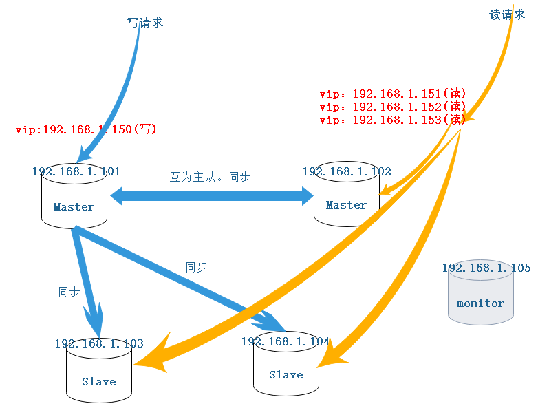
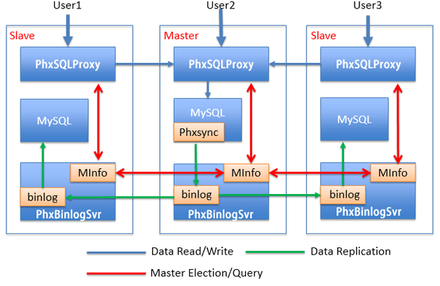

# MYSQL部署方案对比

随着平台升级，单节点数据库提供服务已力不从心。现在需要确定一套集群方案用以部署mysql5.7集群。在这里和大家分享下经历，难免会有些许错误，请各位看官不吝赐教。

## 需求明确

可以预见数据库运行的环境如下：

1. 内网运行
2. 部署维护便利
3. 考虑迁移性
4. 定期备份
5. 横向扩展
6. 主备，热切换，读写分离，易恢复

ok,需求明确了，下一步寻找方案

## 对比方案

 我们团队在开发前期前期已确定数据库采用mysql5.7，再此基础上搜索了主流的
 集群部署方式。

### MySQL Replication架构

 MySQL Replication是MySQL非常出色的一个功能，该功能将一个MySQL实例中的数据复制到另一个MySQL实例中。整个过程是异步进行的，但由于其高效的性能设计，复制的延时非常小。多数的集群方案都基于此功能进行设计。
 MySQL的复制（replication）是一个异步的复制，从一个MySQLinstace（称之为Master）复制到另一个MySQLinstance（称之Slave）。整个复制操作主要由三个进程完成的，其中两个进程在Slave（Sql进程和IO进程），另外一个进程在Master（IO进程）上。

 要实施复制，首先必须打开Master端的binarylog（bin-log）功能，否则无法实现。因为整个复制过程实际上就是Slave从Master端获取该日志然后再在自己身上完全顺序的执行日志中所记录的各种操作。复制的基本过程如下：

1. Slave上面的IO进程连接上Master，并请求从指定日志文件的指定位置（或者从最开始的日志）之后的日志内容；
2. Master接收到来自Slave的IO进程的请求后，通过负责复制的IO进程根据请求信息读取指定日志指定位置之后的日志信息，返回给Slave的IO进程。返回信息中除了日志所包含的信息之外，还包括本次返回的信息已经到Master端的bin-log文件的名称以及bin-log的位置；
3. Slave的IO进程接收到信息后，将接收到的日志内容依次添加到Slave端的relay-log文件的最末端，并将读取到的Master端的bin-log的文件名和位置记录到master-info文件中，以便在下一次读取的时候能够清楚的告诉Master“我需要从某个bin-log的某个位置开始往后的日志内容，请发给我”;
4. Slave的Sql进程检测到relay-log中新增加了内容后，会马上解析relay-log的内容成为在Master端真实执行时候的那些可执行的内容，并在自身执行。

#### 结论

功能太单一，不符需求，不考虑。

### MMM架构

 MySQL-MMM是Master-Master Replication Manager for MySQL（mysql主主复制管理器）的简称，是Google的开源项目（Perl脚本）。
 MMM基于MySQL  Replication做的扩展架构，主要用来监控mysql主主复制并做失败转移。其原理是将真实数据库节点的IP（RIP）映射为虚拟IP（VIP）集，在这个虚拟的IP集中，有一个专用于write的IP，多个用于read的IP，这个用于Write的VIP映射着
 
 数据库集群中的两台master的真实IP（RIP），以此来实现Failover的切换，其他read的VIP可以用来均衡读（balance）。

#### 优点：

1. 自动的主主Failover切换，一般3s以内切换备机
2. 多个Slave读的负载均衡。

#### 缺点：

1. 无法完全保证数据的一致性（在db1宕机过程中，一旦db2落后于db1,这时发生切换，db2变成了可写状态，数据的一致性就无法保证）
2. 无论何时，只有一个数据库可写；db1宕机后，write VIP会指向db2，当db1恢复后，db1不会自动变成可写主，需要手动move_role 或者db2宕机。

所以read host要包括db1，不然容易造成浪费；

1. 由于是使用虚拟IP浮动技术，类似Keepalived，故RIP（真实IP）要和VIP（虚拟IP）在同一网段；如果是在不同网段也可以，需要用到虚拟路由技术。
2. monitor单点问题，或许可以用keepalived来解决。

#### 结论

 MMM架构在以前非常流行，但现在难免有些落伍，mysql本质上还是已单机模式安装在服务器上，无法方便的横向扩展。不考虑

### MHA架构

 MHA（Master High  Availability）由日本DeNA公司youshimaton（现就职于Facebook公司）开发，是一套优秀的作为MySQL高可用性环境下故障切换和主从提升的高可用软件。在MySQL故障切换过程中，MHA能做到在0~30秒之内自动完成数据库的故障切换操作（以2019年的眼光来说太慢了），并且在进行故障切换的过程中，MHA能在最大程度上保证数据的一致性，以达到真正意义上的高可用。
 某种意义上来说MHA架构是MMM架构的升级版，但是又缺少了vip的功能，一般会配合keepalived使用补完vip的功能。

#### 优点

1. 自动监控Master故障转移、故障后节点之间的数据同步
2. 不会有性能损耗，适用于任何存储引擎
3. 具备自动数据补偿能力，在主库异常崩溃时能够最大程度的保证数据的一致性
4. 可实现同城应用级别双活
5. 最大程度上保证数据的一致性

#### 缺点

1. MHA架构实现读写分离，最佳实践是在应用开发设计时提前规划读写分离事宜，在使用时设置两个连接池，即读连接池与写连接池，也可以选择折中方案即引入SQL Proxy。但无论如何都需要改动代码；
2. 关于读负载均衡可以使用F5、LVS、HAPROXY或者SQL Proxy等工具，只要能实现负载均衡、故障检查及备升级为主后的读写剥离功能即可，建议使用LVS；
3. MHA Manager Node 主要负责主库在crash时将bin log完整同步到slave库、监控主备库的状态及切换。

#### 结论

 最大的问题做读写分离时需要改动代码，与开发耦合太高，不利于当前部署以及后期改造。不考虑。

### InnoDB Cluster架构

 MySQL InnoDB集群为MySQL提供了完整的高可用性解决方案。 MySQL  Shell包含AdminAPI，使您可以轻松配置和管理一组至少三个MySQL服务器实例，以充当InnoDB集群。 每个MySQL服务器实例都运行MySQL Group Replication，它提供了在InnoDB集群内复制数据的机制，具有内置故障转移功能。Admin  API无需在InnoDB集群中直接使用组复制。 MySQL  Shell可以根据您部署的集群自动配置自身，将客户端应用程序透明地连接到服务器实例。如果服务器实例意外故障，群集将自动重新配置。在默认的单主模式下，InnoDB集群具有单个读写服务器实例 -  主要实例。多个辅助服务器实例是主要副本的副本。如果主服务器出现故障，则辅助服务器将自动升级为主服务器。MySQL路由器检测到此情况并将客户端应用程序转发到新主服务器。高级用户还可以将群集配置为多主结构。
 
 一般采用MySQL Router、Cluster和MySQL Shell构成的Mysql InnoDB Cluster高可用方案进行搭建

#### 结论：

 InnoDB Cluster支持自动Failover、强一致性、读写分离、读库高可用、读请求负载均衡，横向扩展的特性，是比较完备的一套方案。但是部署起来复杂，想要解决router单点问题好需要新增组件，如没有其他更好的方案暂考虑该方案。

### Mycat架构

基于阿里开源的Cobar产品而研发，Cobar的稳定性、可靠性、优秀的架构和性能以及众多成熟的使用案例使得MYCAT一开始就拥有一个很好的起点。一个彻底开源的，面向企业应用开发的大数据库集群。

#### 功能介绍

1. 支持事务、ACID、可以替代MySQL的加强版数据库
2. 一个可以视为MySQL集群的企业级数据库，用来替代昂贵的Oracle集群
3. 一个融合内存缓存技术、NoSQL技术、HDFS大数据的新型SQL Server
4. 结合传统数据库和新型分布式数据仓库的新一代企业级数据库产品
5. 一个新颖的数据库中间件产品
6. MYCAT监控
    1.支持对Mycat、Mysql性能监控
    2.支持对Mycat的JVM内存提供监控服务
    3.支持对线程的监控
    4.支持对操作系统的CPU、内存、磁盘、网络的监控
    

#### 优点

1. Mycat作为主数据库中间件，是与代码弱关联的，所以代码是不用修改的，使用Mycat后，连接数据库是不变的，默认端口是8066。连接方式和普通数据库一样，如：jdbc:mysql://192.168.0.2:8066/
2. 自带监控，提供较全面的监控服务
3. 可实现数据库的读写分离，在后端的主从复制数据库集群中，通过MYCAT配置，将前台的写操作路由到主数据库中，将读操作路由到从数据库上。
4. MYCAT可以实现读写分离下的读操作负载均衡，将大量的读操作均衡到不同的从库上，主要出现在一主多从情形下。
5. MYCAT可实现数据库的高可用，在数据库主节点可用的情况下，配置一台可写从节点，这两个节点都配置在MYCAT中，当主节点宕机时，MyCAT会自动将写操作路由到备用节点上，但并不支持在切换之后的继续主从同步。
6. 当读写分离已经不能满足持续增加的访问量时，MYCAT可实现数据库的垂直拆分，将所有的数据库表按照模块划分，不同类型的表拆分到不同的数据库服务器。
7. 随着业务量的增长，垂直拆分之后如果又出现了数据库性能问题，则需要进行水平切分，这就是俗称的分库分表。将数据量很大的表数据切分到不同的服务器库中，表结构是一样的，而使用MYCAT实现水平切分，对前端应用是完全透明的，不用调整前台逻辑。

#### 缺点

1. TPS性能低下
2. 最近版本维护越来越少了

#### 总结

 Mycat也并不是配置以后，就能完全解决分表分库和读写分离问题。Mycat配合数据库本身的复制功能，可以解决读写分离的问题，但是针对分表分库的问题，不是完美的解决。或者说，至今为止，业界没有完美的解决方案。
 分表分库写入能完美解决，但是，不能完美解决主要是联表查询的问题，Mycat支持两个表联表的查询，多余两个表的查询不支持。  其实，很多数据库中间件关于分表分库后查询的问题，都是需要自己实现的，而且节本都不支持联表查询，Mycat已经算做地非常先进了。分表分库的后联表查询问题，需要通过合理数据库设计来避免。这是一套比较好的数据库集群方案，值得考虑。

### PhxSQL

#### 优点

1. 高性能：由于Proxy接管了MySQL Client的请求，为了使整个集群的读写性能接近单机MySQL，Proxy使用协程模型提高自身的处理能力。
2. Proxy的协程模型使用开源的Libco库。Libco库是微信团队开源的一个高性能协程库，具有以下特点：
    用同步方式写代码，实现异步代码的性能。
    支持千万级的并发连接。
    项目地址https://github.com/tencent-wechat/libco
3. 完全兼容MySQL：为了已有的应用程序能够不做任何修改就能迁移到PhxSQL，Proxy需兼容MySQL的所有功能。

#### 缺点

### MySQL Fabric.

 Oracle在2014年5月推出了一套为各方寄予厚望的MySQL产品 – MySQL  Fabric，从字面上不太能看出它是啥，但是从名称上还是有迹可循的。fabric是“织物”的意思，这意味着它是用来“织”起一片MySQL数据库。MySQL Fabric是一套数据库服务器场(Database Server Farm)的架构管理系统。

MySQL Fabric是什么？
 MySQL Fabric能“组织”多个MySQL数据库，是应用系统将大于几TB的表分散到多个数据库，即数据分片(Data  Shard)。在同一个分片内又可以含有多个数据库，并且由Fabric自动挑选一个适合的作为主数据库，其他的数据库配置成从数据库，来做主从复制。在主数据库挂掉时，从各个从数据库中挑选一个提升为主数据库。之后，其他的从数据库转向新的主数据库复制新的数据。注意：这里说的“自动”是指由MySQL Fabric在后台完成，而不需要用户手动更改配置。最重要的是，MySQL  Fabric是GPL的开源软件，也就是在符合GPL的规范下，你可以自由的使用和修改这个软件。

#### mysql备份

 关于数据的备份，其实是件比较头疼的事，服务器容量有限，不可能存放在磁盘上，幸好项目环境是运行在阿里云的内网环境的云服务器上，可以连接阿里云oss。遂决定采用以下方案：

1. 上传binlog日志至oss
    结合crontab设定定时任务，周期的上传文件至oss
2. 上传数据库备份至oss
    创建备份用户，在上传日志文件时，同时触发mysqldump 脚本生成sql文件上传至oss

### 总结

 综合考虑，在满足横向扩展，主备，热切换，读写分离，易恢复等基础需求上，公司人手有限又是内网部署，需要一套易部署维护的，要与开发代码无关的部署反感，个人比较倾向与PhxSQL.

------

更6月17日更新
 需求补充，项目需要分场景部署两套集群：

1. 该场景下会频繁进行插入操作，偶尔的单表读操作，不会有更新操作，会有大量数据存储，需要保证数据强一致性。
2. 该场景下会频繁进行单表读操作，偶尔的单表插入操作，不会有更新操作