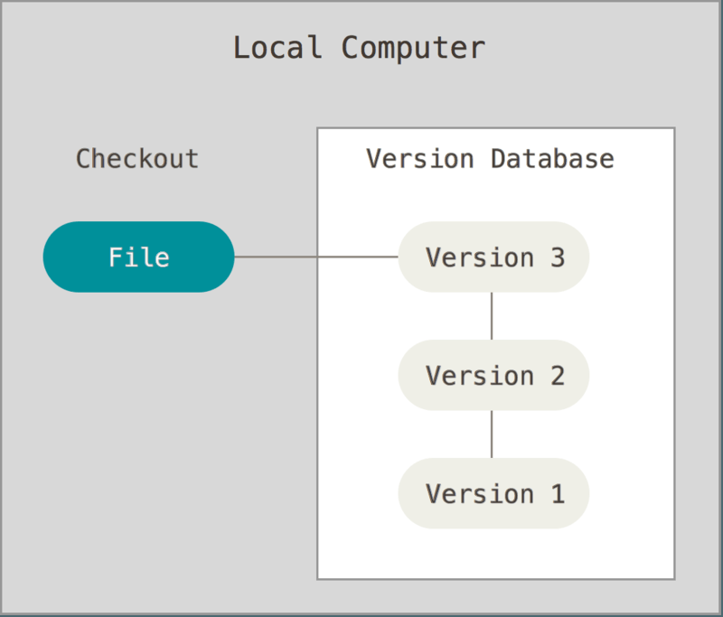
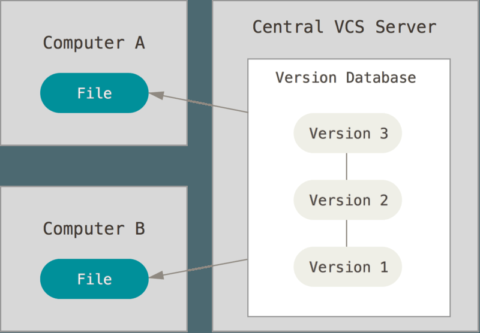
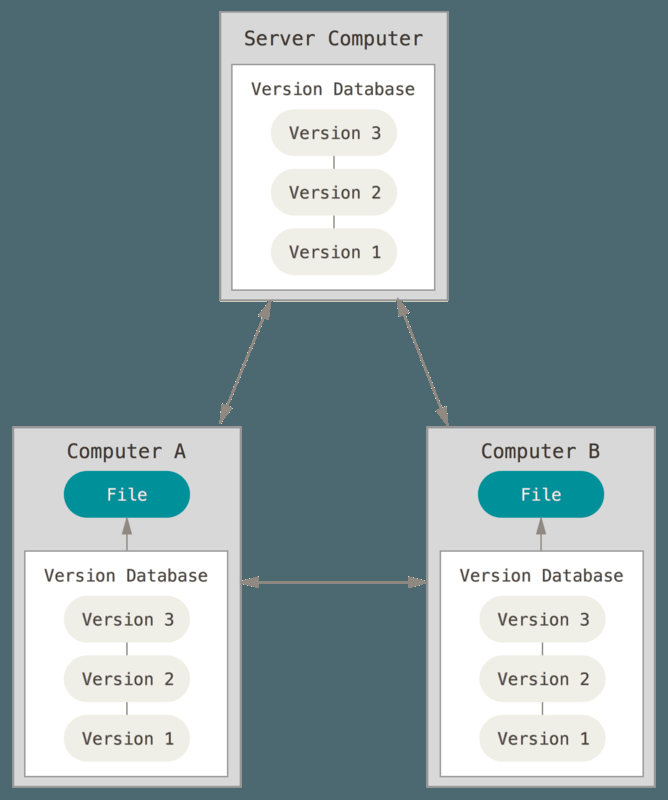
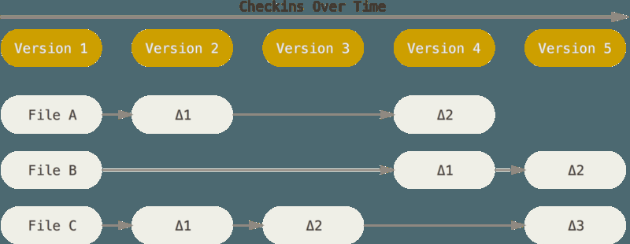
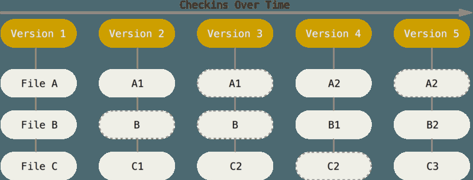

# 理解Git

## 版本管理

git是一个版本管理的工具。那么什么是版本管理呢

对于同一份共享文件，如果又多个人需要修改的话会发生什么事情呢？假设现在有三个人，A分享了文件夹gitProject，其中包含了三个文件《理解git.md》，《git常用命令.md》，《readme.md》，B和C需要对这份文件进行修改。

B和C分别把gitProject文件夹拷贝到自己的电脑上，然后进行修改，改完之后需要再把自己修改上传上去。B先改完了之后把自己的文件上传上去，覆盖了A的分享。之后C也改完了，也把自己的改动上传上去。这样，C就会把B的修改覆盖掉。

为了上述这种问题，就需要通过一种方式来在C想要上传文件的时候来提醒他，告诉他需要考虑到B已经改过文件的事情。

比较好的方式就是通过版本控制。

## 版本管理的方式

### 本地版本控制系统

许多人习惯用复制整个项目目录的方式来保存不同的版本，或许还会改名加上备份时间以示区别。 这么做唯一的好处就是简单，但是特别容易犯错。 有时候会混淆所在的工作目录，一不小心会写错文件或者覆盖意想外的文件。为了解决这个问题，人们很久以前就开发了许多种本地版本控制系统，大多都是采用某种简单的数据库来记录文件的历次更新差异。其中，最流行的是RCS

### 集中化版本控制系统

​		接下来人们又遇到一个问题，如何让在不同系统上的开发者协同工作？ 于是，集中化的版本控制系统(Centralized Version Control Systems，简称 CVCS）应运而生。 这类系统，诸如 CVS、Subversion 以及Perforce 等，都有一个单一的集中管理的服务器，保存所有文件的修订版本，而协同工作的人们都通过客户端连到这台服务器，取出最新的文件或者提交更新。 多年以来，这已成为版本控制系统的标准做法。

​		事分两面，有好有坏。 这么做最显而易见的缺点是中央服务器的单点故障。 如果宕机一小时，那么在这一小时内，谁都无法提交更新，也就无法协同工作。 如果中心数据库所在的磁盘发生损坏，又没有做恰当备份，毫无疑问你将丢失所有数据——包括项目的整个变更历史，只剩下人们在各自机器上保留的单独快照。 本地版本控制系统也存在类似问题，只要整个项目的历史记录被保存在单一位置，就有丢失所有历史更新记录的风险。

### 分布式版本控制系统

​	于是分布式版本控制系统（Distributed Version Control System，简称 DVCS）面世了。 在这类系统中，像Git、Mercurial、Bazaar 以及 Darcs 等，客户端并不只提取最新版本的文件快照，而是把代码仓库完整地镜像下来。 这么一来，任何一处协同工作用的服务器发生故障，事后都可以用任何一个镜像出来的本地仓库恢复。因为每一次的克隆操作，实际上都是一次对代码仓库的完整备份。

## Git和其他版本管理的区别

Git 和其它版本控制系统（包括 Subversion 和近似工具）的主要差别在于 Git 对待数据的方法。 概念上来区分，其它大部分系统以文件变更列表的方式存储信息。 这类系统（CVS、Subversion、Perforce、Bazaar 等）将它们保存的信息看作是一组基本文件和每个文件随时间逐步累积的差异。

Git 不按照以上方式对待或保存数据。 反之，Git 更像是把数据看作是对小型文件系统的一组快照。 每次你提交更新，或在 Git 中保存项目状态时，它主要对当时的全部文件制作一个快照并保存这个快照的索引。 为了高效，如果文件没有修改，Git 不再重新存储该文件，而是只保留一个链接指向之前存储的文件。 Git 对待数据更像是一个 快照流。

## Git的三种状态

要清楚git的三种状态，首先要明白git的工作原理：

- Workspace：工作区
- Index / Stage：暂存区
- Repository：仓库区（或本地仓库）
- Remote：远程仓库

已提交（committed）、已修改（modified）和已暂存（staged）。 已提交表示数据已经安全的保存在本地数据库中。 已修改表示修改了文件，但还没保存到数据库中。 已暂存表示对一个已修改文件的当前版本做了标记，使之包含在下次提交的快照中。

基本的 Git 工作流程如下：
1. 在工作目录中修改文件。
2. 暂存文件，将文件的快照放入暂存区域。
3. 提交更新，找到暂存区域的文件，将快照永久性存储到 Git 仓库目录。

