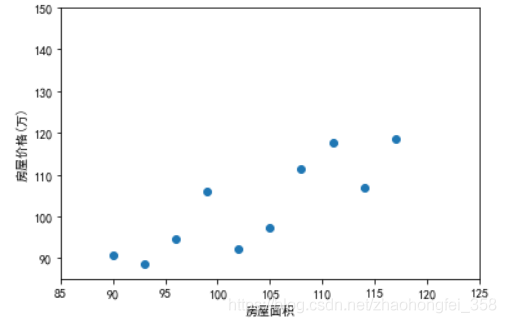
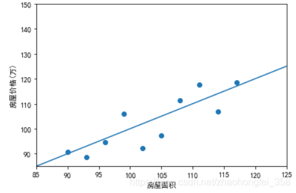
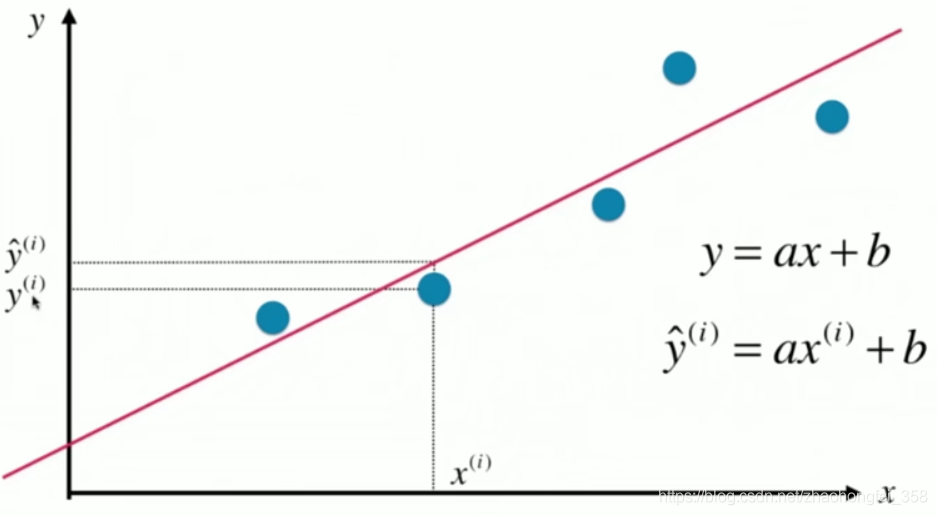

文章目录

    什么是线性回归
    简单线性回归
        如何预测线性回归方程呢？
            b b b 的推导过程
            a a a 的推导过程
    线性回归评测
        均方误差（MSE，Mean Squared Error）
        均方根误差（RMSE，Root Mean Squared Error）
        平均绝对误差（MAE，Mean Absolute Error）
            RMSE 和 MAE 比较
        R Squared
    多元线性回归
    线性回归方程的可解释性
    参考资料

# 什么是线性回归

假设我们现在要预测房价，我们现在采样了一些数据：
在这里插入图片描述

横坐标为房屋面积，纵坐标为房屋价格。根据该图，我们大致可以看出，房屋价格和房屋面积是成线性增长的。

此时，我们就可以绘制出一条直线：

通过这条直线，我们就可以大概预测出，125平的房价是多少了。我们画这条线的依据为：尽可能让每个点回归到这条直线上。

这就是线性回归。而机器学习学的就是如何绘制出这条直线

# 简单线性回归

上面的例子中，我们的特征只有一个（房屋面积），这样我们就可以在二维平面中观察，如果是两个特征，就需要在三维平面观察。如果超过2个特征，就没办观察了。对于这种只有一个特征的线性回归问题，称为简单线性回归。相应的，高纬的称为多元线性回归。

首先，要熟悉一下相应的数学符号为：

在
预测的直线，使用 y = a x + b表示。预测值使用
$$
y ^ ( i )
$$
表示，读作y hat。 i  表示这是第 i 个数据。对于 x ( i ) x^{(i)} x(i) 对应的真值，使用 y ( i ) y^{(i)} y(i) 表示。

要预测出该线性方程，本质是要预测出 a a a 和 b b b 的值。 公式如下：

$$
a = ∑ i = 1 m ( x ( i ) − x ˉ ) ( y ( i ) − y ˉ ) ∑ i = 1 m ( x ( i ) − x ˉ ) 2 b = y ˉ − a x ˉ
a=∑mi=1(x(i)−x¯)(y(i)−y¯)∑mi=1(x(i)−x¯)2b=y¯−ax¯

a=∑i=1m(x(i)−xˉ)2∑i=1m(x(i)−xˉ)(y(i)−yˉ)b=yˉ−axˉ
$$
其中， m m m 为样本数量， x ( i ) x^{(i)} x(i) 为第 i i i 个样本的特征值。 x ˉ \bar{x} xˉ 和 y ˉ \bar{y} yˉ 横纵坐标的平均值
如何预测线性回归方程呢？

思路为：找出一条直线，使得每个点的真值与预测值之间的距离之和最小

假设最佳拟合的直线方程为：
y = a x + b y=ax+b y=ax+b

则对于每一个样本 x ( i ) x^{(i)} x(i) ，它的预测值 y ^ ( i ) \hat{y}^{(i)} y^(i) 为
y ^ ( i ) = a x ( i ) + b \hat{y}^{(i)} = a x^{(i)} + b y^(i)=ax(i)+b

那该预测值和真值之间的距离则为：
y ( i ) − y ^ ( i ) y^{(i)} - \hat{y}^{(i)} y(i)−y^(i)
为了消除负号，且便于求导，对其进行平方：
( y ( i ) − y ^ ( i ) ) 2 (y^{(i)} - \hat{y}^{(i)})^2 (y(i)−y^(i))2

对所有n个样本样本进行求和，则为：
∑ i = 1 m ( y ( i ) − y ^ ( i ) ) 2 \sum_{i=1}^m (y^{(i)} - \hat{y}^{(i)})^2 i=1∑m(y(i)−y^(i))2

其中 y ^ ( i ) = a x ( i ) + b \hat{y}^{(i)} = ax^{(i)} + b y^(i)=ax(i)+b ，将其带入上式，得：
f ( a , b ) = ∑ i = 1 m ( y ( i ) − a x ( i ) − b ) 2 f(a,b) = \sum_{i=1}^m (y^{(i)} - ax^{(i)} - b)^2 f(a,b)=i=1∑m(y(i)−ax(i)−b)2

我们的目标是，让上式尽可能的小。对于这种使其尽可能小，最终推理出参数的函数，称为损失函数（loss function）
b b b 的推导过程

我们知道，当 f ′ ( x ) = 0 ， f ′ ′ ( x ) > 0 f'(x) = 0，f''(x) > 0 f′(x)=0，f′′(x)>0 ， 函数取极小值。简单起见，我们首先来求 b b b，注意，此时 b b b 为未知数，所以其他都是常数，所以求导也是对 b 求：
f ( b ) = ∑ i = 1 m ( y ( i ) − a x ( i ) − b ) 2 f ′ ( b ) = ( − 2 ) ∑ i = 1 m ( y ( i ) − a x ( i ) − b ) f ′ ′ ( b ) = 2 m > 0
f(b)=∑i=1m(y(i)−ax(i)−b)2f′(b)=(−2)∑i=1m(y(i)−ax(i)−b)f′′(b)=2m>0

f(b)=i=1∑m(y(i)−ax(i)−b)2f′(b)=(−2)i=1∑m(y(i)−ax(i)−b)f′′(b)=2m>0

令 f’(b) = 0 ，得
( − 2 ) ∑ i = 1 m ( y ( i ) − a x ( i ) − b ) = 0 m ⋅ b = ∑ i = 1 m y ( i ) − a ∑ i = 1 m x ( i ) b = y ˉ − a x ˉ
(−2)∑i=1m(y(i)−ax(i)−b)=0m⋅b=∑i=1my(i)−a∑i=1mx(i)b=y¯−ax¯

(−2)i=1∑m(y(i)−ax(i)−b)=0m⋅b=i=1∑my(i)−ai=1∑mx(i)b=yˉ−axˉ

又因为 f ′ ′ ( b ) > 0 f''(b) > 0 f′′(b)>0，所以当 b = y ˉ − a x ˉ b = \bar{y} - a \bar{x} b=yˉ−axˉ 时， f ( b ) f(b) f(b) 取最小值
a a a 的推导过程

与b类似，稍显复杂：

f ( a ) = ∑ i = 1 m ( y ( i ) − a x ( i ) − b ) 2 f ′ ( a ) = − 2 ∑ i = 1 m x ( i ) ( y ( i ) − a x ( i ) − b ) f ′ ′ ( a ) = 2 ∑ i = 1 m ( x ( i ) ) 2 > 0
f(a)=∑i=1m(y(i)−ax(i)−b)2f′(a)=−2∑i=1mx(i)(y(i)−ax(i)−b)f′′(a)=2∑i=1m(x(i))2>0

f(a)=i=1∑m(y(i)−ax(i)−b)2f′(a)=−2i=1∑mx(i)(y(i)−ax(i)−b)f′′(a)=2i=1∑m(x(i))2>0

令 f ′ ( a ) = 0 f'(a) = 0 f′(a)=0 ，得：
− 2 ∑ i = 1 m x ( i ) ( y ( i ) − a x ( i ) − b ) = 0 ∑ i = 1 m x ( i ) ( y ( i ) − a x ( i ) − b ) = 0
−2∑i=1mx(i)(y(i)−ax(i)−b)=0∑i=1mx(i)(y(i)−ax(i)−b)=0

−2i=1∑mx(i)(y(i)−ax(i)−b)=0i=1∑mx(i)(y(i)−ax(i)−b)=0

其中 b = y ˉ − a x ˉ b = \bar{y} - a \bar{x} b=yˉ−axˉ ，将 b b b 代入上式，得：
∑ i = 1 m x ( i ) ( y ( i ) − a x ( i ) − y ˉ + a x ˉ ) = 0 ∑ i = 1 m x ( i ) y ( i ) − ∑ i = 1 m a ( x ( i ) ) 2 − ∑ i = 1 m x ( i ) y ˉ + ∑ i = 1 m a x ( i ) x ˉ = 0 a ∑ i = 1 m ( ( x ( i ) ) 2 − x ( i ) x ˉ ) = ∑ i = 1 m ( x ( i ) y ( i ) − y ˉ x ( i ) )
∑i=1mx(i)(y(i)−ax(i)−y¯+ax¯)∑i=1mx(i)y(i)−∑i=1ma(x(i))2−∑i=1mx(i)y¯+∑i=1max(i)x¯a∑i=1m((x(i))2−x(i)x¯)=0=0=∑i=1m(x(i)y(i)−y¯x(i))

i=1∑mx(i)(y(i)−ax(i)−yˉ+axˉ)i=1∑mx(i)y(i)−i=1∑ma(x(i))2−i=1∑mx(i)yˉ+i=1∑max(i)xˉai=1∑m((x(i))2−x(i)xˉ)=0=0=i=1∑m(x(i)y(i)−yˉx(i))

将左边除过去，得 a a a ：
a = ∑ i = 1 m ( x ( i ) y ( i ) − y ˉ x ( i ) ) ∑ i = 1 m ( ( x ( i ) ) 2 − x ( i ) x ˉ ) a = \frac{ \sum_{i=1}^m(x^{(i)}y^{(i)} - \bar{y}x^{(i)})}{\sum_{i=1}^m((x^{(i)})^2 - x^{(i)}\bar{x})} a=∑i=1m((x(i))2−x(i)xˉ)∑i=1m(x(i)y(i)−yˉx(i))

此时，我们就得到 a a a ，但为了方便进行向量化运算（可以方便使用numpy加快运行速度），对该式继续改造。

已知：
∑ i = 1 m x ( i ) y ˉ = y ˉ ∑ i = 1 m x ( i ) = m y ˉ ⋅ x ˉ = x ˉ ∑ i = 1 m y ( i ) = ∑ i = 1 m y ( i ) x ˉ = ∑ i = 1 m x ˉ ⋅ y ˉ
∑i=1mx(i)y¯=y¯∑i=1mx(i)=my¯⋅x¯=x¯∑i=1my(i)=∑i=1my(i)x¯=∑i=1mx¯⋅y¯

i=1∑mx(i)yˉ=yˉi=1∑mx(i)=myˉ⋅xˉ=xˉi=1∑my(i)=i=1∑my(i)xˉ=i=1∑mxˉ⋅yˉ

根据上式，继续对a进行处理，可得：
a = ∑ i = 1 m ( x ( i ) y ( i ) − y ˉ x ( i ) − x ˉ y ( i ) + x ˉ y ˉ ) ∑ i = 1 m ( ( x ( i ) ) 2 − x ( i ) x ˉ − x ( i ) x ˉ + ( x ˉ ) 2 ) a = ∑ i = 1 m ( x ( i ) − x ˉ ) ( y ( i ) − y ˉ ) ∑ i = 1 m ( x ( i ) − x ˉ ) 2
a=∑mi=1(x(i)y(i)−y¯x(i)−x¯y(i)+x¯y¯)∑mi=1((x(i))2−x(i)x¯−x(i)x¯+(x¯)2)a=∑mi=1(x(i)−x¯)(y(i)−y¯)∑mi=1(x(i)−x¯)2

a=∑i=1m((x(i))2−x(i)xˉ−x(i)xˉ+(xˉ)2)∑i=1m(x(i)y(i)−yˉx(i)−xˉy(i)+xˉyˉ)a=∑i=1m(x(i)−xˉ)2∑i=1m(x(i)−xˉ)(y(i)−yˉ)

此时，上底下底都转成了
y = w ⋅ v y = w\cdot v y=w⋅v

就可以方便的进行向量运算了
线性回归评测

当模型训练好后，需要对模型的好坏进行评测。我们需要使用训练测试集进行评测，通常有以下几种方式：
均方误差（MSE，Mean Squared Error）

M S E = 1 m ∑ i = 1 m ( y t e s t ( i ) − y ^ t e s t ( i ) ) 2 MSE = \frac{1}{m} \sum^{m}_{i=1} (y^{(i)}_{test}-\hat{y}^{(i)}_{test})^2 MSE=m1i=1∑m(ytest(i)−y^test(i))2
其中 y t e s t ( i ) y^{(i)}_{test} ytest(i) 为测试数据的 y y y 值， y ^ t e s t ( i ) \hat{y}^{(i)}_{test} y^test(i) 为预测结果。对它们的差平方后求和，再除以样本数量 m m m

该方法使用的方差的思想，缺点是结果和误差量岗不一致。
均方根误差（RMSE，Root Mean Squared Error）

R M S E = M S E = 1 m ∑ i = 1 m ( y t e s t ( i ) − y ^ t e s t ( i ) ) 2 RMSE = \sqrt{MSE} = \sqrt{\frac{1}{m} \sum^{m}_{i=1} (y^{(i)}_{test}-\hat{y}^{(i)}_{test})^2} RMSE=MSE
=m1i=1∑m(ytest(i)−y^test(i))2

为了解决均方误差量岗不一致的缺点，使用标准差的思想，对其进行开方，就可以保证量岗一致了。
平均绝对误差（MAE，Mean Absolute Error）

M A E = 1 m ∑ i = 1 m ∣ y t e s t ( i ) − y ^ t e s t ( i ) ∣ MAE = \frac{1}{m} \sum^{m}_{i=1} |y^{(i)}_{test}-\hat{y}^{(i)}_{test}| MAE=m1i=1∑m∣ytest(i)−y^test(i)∣

该方法很直白，直接计算距离求和，然后求平均。这样就很方便的保证了量岗
RMSE 和 MAE 比较

RMSE和MAE都可以求误差，但是，学方差的时候我们知道，开方是为了增大误差较大的数据的影响，所以往往RMSE的值要比MAE的值大。在实践中，使RMSE的值尽可能的小会更有意义。
R Squared

问题提出：还记得相对标准偏差么。当预测的多个模型单位不一致时，例如我预测出的房价RMSE误差为1万元，你预测出的考试成绩RMSE为10分，那么这样是很难比较说明谁的模型更好。

此时聪明的科学家就提出了 R Squared ：

R 2 = 1 − S S r e s i d u a l S S t o t a l = 1 − ∑ i = 1 m ( y ^ ( i ) − y ( i ) ) 2 ∑ i = 1 m ( y ˉ − y ( i ) ) 2
R2=1−SSresidualSStotal=1−∑mi=1(y^(i)−y(i))2∑mi=1(y¯−y(i))2

R2=1−SStotalSSresidual=1−∑i=1m(yˉ−y(i))2∑i=1m(y^(i)−y(i))2

其中，分子 S S r e s i d u a l SS_{residual} SSresidual (Residual Sum of Squares) 表示预测值与真值误差平方之和，分母 S S t o t a l SS_{total} SStotal (Total Sum of Squares) 表示平均值与真值误差平方之和。

换言之，减号右边就是想看看用预测出的模型的误差 和 直接用平均值作为模型的误差 进行比较，看看其效果怎么样（平均值被称为基准模型（Baseline Model））。所以就可以得出以下结论：

    R 2 < = 1 R^2<=1 R2<=1 。因为减号右边一定大于0
    R 2 R^2 R2 越大越好。当预测结果与实际结果完全一致时，分子 S S r e s i d u a l = 0 SS_{residual}=0 SSresidual=0，所以 R 2 = 1 R^2=1 R2=1。
    R 2 R^2 R2 越小越坏。当预测模型和基准模型效果差不多时， R 2 = 0 R^2=0 R2=0。当 R 2 < 0 R^2 <0 R2<0 时，说明预测模型还不如基准模型，此时，数据很有可能不存在线性关系

我们现在对 R Squared 再做一下改造：

R 2 = 1 − ∑ i = 1 m ( y ^ ( i ) − y ( i ) ) 2 ∑ i = 1 m ( y ˉ − y ( i ) ) 2 = 1 − ( ∑ i = 1 m ( y ^ ( i ) − y ( i ) ) 2 ) / m ( ∑ i = 1 m ( y ˉ − y ( i ) ) 2 ) / m = 1 − M S E ( y ^ , y ) V a r ( y )
R2=1−∑mi=1(y^(i)−y(i))2∑mi=1(y¯−y(i))2=1−(∑mi=1(y^(i)−y(i))2)/m(∑mi=1(y¯−y(i))2)/m=1−MSE(y^,y)Var(y)

R2=1−∑i=1m(yˉ−y(i))2∑i=1m(y^(i)−y(i))2=1−(∑i=1m(yˉ−y(i))2)/m(∑i=1m(y^(i)−y(i))2)/m=1−Var(y)MSE(y^,y)

其中， M S E ( y ^ , y ) MSE(\hat{y},y) MSE(y^,y)为模型的均方误差， V a r ( y ) Var(y) Var(y) 为数据方差。使用该公式，可以更方便编码。

多元线性回归

特征数为1时，可以在2维平面中观察，为2时，可以在3维平面中观察。超过了2，就无法观察了。对于特征数超过1的线性回归方程，称为多元线性回归。

当我们只有一个特征时，线性方程为：
y = θ 0 + θ 1 x 1       （ y = a x + b ） y = \theta_0 + \theta_1 x_1 ~~~~~（y=ax + b） y=θ0+θ1x1     （y=ax+b）

当有两个特征时，线性方程为：
y = θ 0 + θ 1 x 1 + θ 2 x 2 y = \theta_0 + \theta_1 x_1 + \theta_2 x_2 y=θ0+θ1x1+θ2x2

以此类推，当有n个特征时，线性方程为：
y = θ 0 + θ 1 x 1 + θ 2 x 2 + ⋯ + θ n x n y = \theta_0 + \theta_1 x_1 + \theta_2 x_2 + \cdots + \theta_n x_n y=θ0+θ1x1+θ2x2+⋯+θnxn

所以，我们构建模型就是算出 θ 0 , θ 1 , ⋯ θ n \theta_0, \theta_1, \cdots \theta_n θ0,θ1,⋯θn 的值

当推算出 θ 0 , θ 1 , ⋯ θ n \theta_0, \theta_1, \cdots \theta_n θ0,θ1,⋯θn 后，就可以预测 y ^ \hat{y} y^ 了，：
y ^ ( i ) = θ 0 + θ 1 X 1 ( i ) + θ 2 X 2 ( i ) + ⋯ + θ n X n ( i ) \hat{y}^{(i)} = \theta_0 + \theta_1 X_1^{(i)} + \theta_2 X_2^{(i)} + \cdots + \theta_n X_n^{(i)} y^(i)=θ0+θ1X1(i)+θ2X2(i)+⋯+θnXn(i)

其中， y ^ \hat{y} y^ 是预测出的值， X 1 , X 2 , ⋯   , X n X_1, X_2, \cdots, X_n X1,X2,⋯,Xn 是输入数据的n个特征

同样，多元线性回归的目标也是使 ∑ i = 1 m ( y ( i ) − y ^ ( i ) ) 2 \sum_{i=1}^m (y^{(i)} - \hat{y}^{(i)})^2 ∑i=1m(y(i)−y^(i))2 尽可能小。

我们可以将 y ^ ( i ) \hat{y}^{(i)} y^(i) 写成向量形式：

y ^ ( i ) = X ( i ) ⋅ θ      其 中 θ = ( θ 0 , θ 1 , ⋯   , θ n ) T , X ( i ) = ( 1 , X 1 ( i ) , X 2 ( i ) , ⋯   , X n ( i ) ) \hat{y}^{(i)} = X^{(i)} \cdot \theta ~~~~其中 \theta=(\theta_0,\theta_1, \cdots , \theta_n)^T , X^{(i)} = (1, X_1^{(i)},X_2^{(i)}, \cdots, X_n^{(i)}) y^(i)=X(i)⋅θ    其中θ=(θ0,θ1,⋯,θn)T,X(i)=(1,X1(i),X2(i),⋯,Xn(i))

对于整个 y ^ \hat{y} y^，表示成向量，即为：
y ^ = X b ⋅ θ \hat{y} = X_b \cdot \theta \\\\ y^=Xb⋅θ

其中：
X b = ( 1 X 1 ( 1 ) X 2 ( 1 ) … X n ( 1 ) 1 X 1 ( 2 ) X 2 ( 2 ) … X n ( 2 ) ⋯ ⋯ 1 X 1 ( m ) X 2 ( m ) … X n ( m ) )            θ = ( θ 0 θ 1 θ 2 ⋯ θ n )
Xb=⎛⎝⎜⎜⎜⎜⎜⎜⎜⎜⎜⎜⎜⎜⎜11⋯1X(1)1X(2)1X(m)1X(1)2X(2)2X(m)2…X(1)n…X(2)n⋯…X(m)n⎞⎠⎟⎟⎟⎟⎟⎟⎟⎟⎟⎟⎟⎟⎟          θ=⎛⎝⎜⎜⎜⎜⎜⎜⎜⎜⎜⎜⎜⎜⎜⎜⎜⎜⎜⎜θ0θ1θ2⋯θn⎞⎠⎟⎟⎟⎟⎟⎟⎟⎟⎟⎟⎟⎟⎟⎟⎟⎟⎟⎟

Xb=⎝⎜⎜⎜⎜⎜⎜⎜⎜⎜⎛11⋯1X1(1)X1(2)X1(m)X2(1)X2(2)X2(m)…Xn(1)…Xn(2)⋯…Xn(m)⎠⎟⎟⎟⎟⎟⎟⎟⎟⎟⎞          θ=⎝⎜⎜⎜⎜⎜⎜⎜⎜⎜⎜⎜⎜⎜⎜⎛θ0θ1θ2⋯θn⎠⎟⎟⎟⎟⎟⎟⎟⎟⎟⎟⎟⎟⎟⎟⎞

根据线性代数知识，我们知道：
∑ i = 1 m x i 2 = x 1 2 + x 2 2 + ⋯ + x n 2 = ( x 1 , x 2 , ⋯   , x n ) ⋅ ( x 1 , x 2 , ⋯   , x n ) T = X T ⋅ X 其 中 X = ( x 1 , x 2 , ⋯   , x n ) T \sum^{m}_{i=1} x_i^2 = x_1^2 + x_2^2 + \cdots + x_n^2 = (x_1, x_2, \cdots, x_n) \cdot (x_1, x_2, \cdots, x_n)^T = X^T \cdot X \\\\ 其中 X = (x_1,x_2, \cdots, x_n)^T i=1∑mxi2=x12+x22+⋯+xn2=(x1,x2,⋯,xn)⋅(x1,x2,⋯,xn)T=XT⋅X其中X=(x1,x2,⋯,xn)T

所以，根据上面两个式子，对 ∑ i = 1 m ( y ( i ) − y ^ ( i ) ) 2 \sum_{i=1}^m (y^{(i)} - \hat{y}^{(i)})^2 ∑i=1m(y(i)−y^(i))2 进行向量化处理，可得：
∑ i = 1 m ( y ( i ) − y ^ ( i ) ) 2 = ( y − X b ⋅ θ ) T ( y − X b ⋅ θ ) \sum_{i=1}^m (y^{(i)} - \hat{y}^{(i)})^2 = (y-X_b \cdot \theta)^T(y-X_b \cdot \theta) i=1∑m(y(i)−y^(i))2=(y−Xb⋅θ)T(y−Xb⋅θ)

经过推导（推导过程），可以推出 θ \theta θ，得：
θ = ( X b T X b ) − 1 X b T y \theta = (X_b^T X_b)^{-1} X_b^T y θ=(XbTXb)−1XbTy

该式子称为多元线性回归的正规方程解（Normal Equation）

    缺点：时间复杂度高 O(n3)，即使优化后，也有 O(n2.4)
    优点：不需要对数据做归一化处理

线性回归方程的可解释性

例如，我们对于房价预测，得到了以下数据：
θ = ( θ 0 θ 1 θ 2 θ 3 θ 4 ) = ( − 1.3 − 2.5 0 7.5 3 ) → ( 空 气 污 染 程 度 周 边 工 厂 数 量 小 区 大 门 数 量 房 屋 面 积 小 区 绿 化 程 度 ) \theta=
⎛⎝⎜⎜⎜⎜⎜⎜⎜⎜⎜⎜⎜⎜⎜⎜⎜⎜⎜⎜θ0θ1θ2θ3θ4⎞⎠⎟⎟⎟⎟⎟⎟⎟⎟⎟⎟⎟⎟⎟⎟⎟⎟⎟⎟
=
⎛⎝⎜⎜⎜⎜⎜⎜⎜⎜⎜⎜⎜⎜⎜⎜⎜⎜⎜⎜−1.3−2.507.53⎞⎠⎟⎟⎟⎟⎟⎟⎟⎟⎟⎟⎟⎟⎟⎟⎟⎟⎟⎟
\to
⎛⎝⎜⎜⎜⎜⎜⎜⎜⎜⎜⎜⎜⎜⎜⎜⎜⎜⎜⎜空气污染程度周边工厂数量小区大门数量房屋面积小区绿化程度⎞⎠⎟⎟⎟⎟⎟⎟⎟⎟⎟⎟⎟⎟⎟⎟⎟⎟⎟⎟

θ=⎝⎜⎜⎜⎜⎜⎜⎜⎜⎜⎜⎜⎜⎜⎜⎛θ0θ1θ2θ3θ4⎠⎟⎟⎟⎟⎟⎟⎟⎟⎟⎟⎟⎟⎟⎟⎞=⎝⎜⎜⎜⎜⎜⎜⎜⎜⎜⎜⎜⎜⎜⎜⎛−1.3−2.507.53⎠⎟⎟⎟⎟⎟⎟⎟⎟⎟⎟⎟⎟⎟⎟⎞→⎝⎜⎜⎜⎜⎜⎜⎜⎜⎜⎜⎜⎜⎜⎜⎛空气污染程度周边工厂数量小区大门数量房屋面积小区绿化程度⎠⎟⎟⎟⎟⎟⎟⎟⎟⎟⎟⎟⎟⎟⎟⎞

可以看到，该数据中有正有负，其中正数就代表该特征与结果呈正相关，例如房屋面积越大，房价越高。负数则说明该特征与结果呈负相关，例如周边工厂数量越多，房价越低。

而系数的大小说明了该特征对结果的影响大小，系数的绝对值越大，说明该特征对结果影响越大，例如周边工厂的数量相比空气污染程度对房价的影响更大。

这就是线性回归方程的可解释性，我们可以通过线性回归方程看出得到一些结论。所以，及时拿到数据之后，不知道用哪一种算法进行预测，也可以先使用线性回归试一下，至少能看出这些特征对结果的影响程度

参考资料

第五章 线性回归法: https://coding.imooc.com/class/chapter/169.html

多元线性回归方程正规方程解（Normal Equation）公式推导详细过程: https://blog.csdn.net/zhaohongfei_358/article/details/118678245

考研必备数学公式大全: https://blog.csdn.net/zhaohongfei_358/article/details/106039576
————————————————
版权声明：本文为CSDN博主「蜗牛____」的原创文章，遵循CC 4.0 BY-SA版权协议，转载请附上原文出处链接及本声明。
原文链接：https://blog.csdn.net/zhaohongfei_358/article/details/117967229