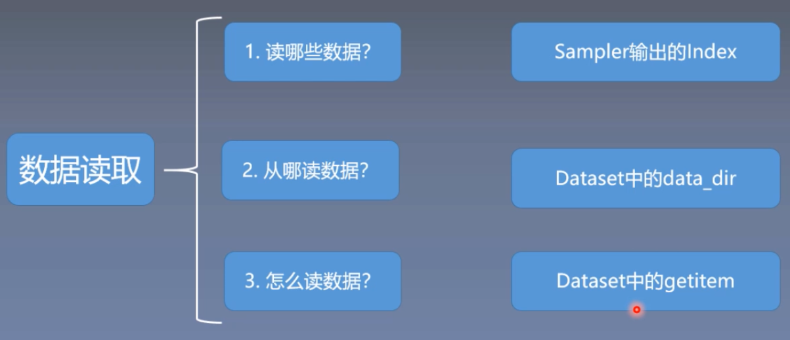
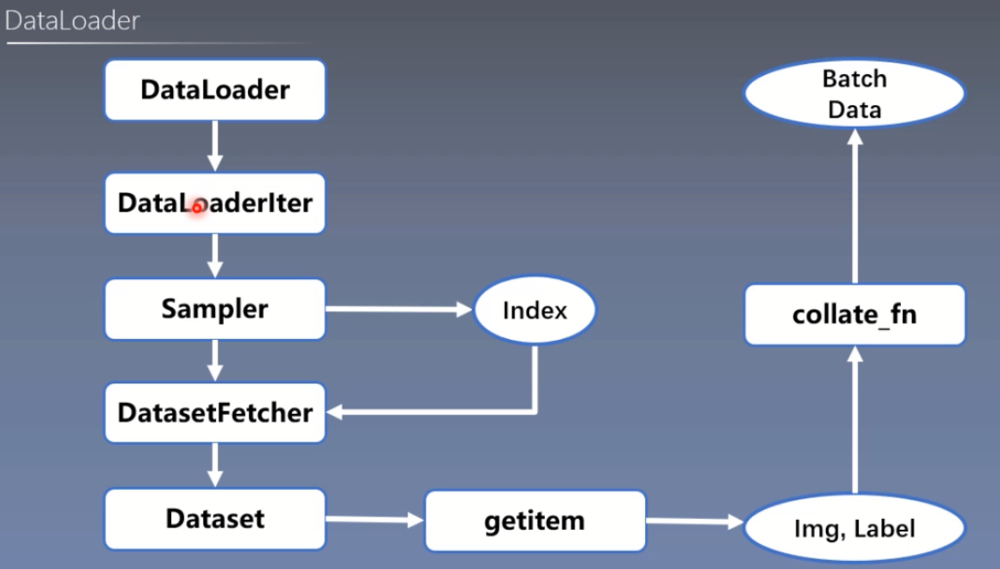

# DataLoader


**2、DataLoader与Dataset**

DataLoader和Dataset是pytorch中数据读取的核心；

**2.1) DataLoader**

(1）torch.utils.data.DataLoader

- 功能：构建可迭代的数据装载器；
- dataset:Dataset类，决定数据从哪里读取及如何读取；
- batchsize：批大小；
- num_works:是否多进程读取数据；
- shuffle：每个epoch是否乱序；
- drop_last：当样本数不能被batchsize整除时，是否舍弃最后一批数据；

Epoch：所有训练样本都已输入到模型中，称为一个Epoch；
 Iteration：一批样本输入到模型中，称之为一个Iteration；
 Batchsize：批大小，决定一个Epoch中有多少个Iteration；

样本总数：80，Batchsize：8 （样本能被Batchsize整除）
 1 Epoch = 10 Iteration

样本总数：87，Batchsize=8 （样本不能被Batchsize整除）
 1 Epoch = 10 Iteration，drop_last = True
 1 Epoch = 11 Iteration， drop_last = False

```java
DataLoader(dataset,
           batch_size=1,
           shuffle=False,
           sampler=None,
           batch_sampler=None,
           num_works=0,
           clollate_fn=None,
           pin_memory=False,
           drop_last=False,
           timeout=0,
           worker_init_fn=None,
           multiprocessing_context=None)
```

（2）torch.utils.data.Dataset

- Dataset是用来定义数据从哪里读取，以及如何读取的问题；
- 功能：Dataset抽象类，所有自定义的Dataset需要继承它，并且复写__getitem__()；
- getitem：接收一个索引，返回一个样本

```python
class Dataset(object):
    def __getitem__(self, index):
        raise NotImplementedError
    def __add__(self, other)
        return ConcatDataset([self,other])
```

下面对人民币二分类的数据进行读取，从三个方面了解pytorch的读取机制，分别为读哪些数据、从哪读数据、怎么读数据；

**读哪些数据**
 具体来说，在每一个Iteration的时候应该读取哪些数据，每一个Iteration读取一个Batch大小的数据，假如有80个样本，那么从80个样本中读取8个样本，那么应该读取哪八个样本，这就是我们的第一个问题，读哪些数据；

**从哪读数据**
 意思是在硬盘当中，我们应该怎么找到对应的数据，在哪里设置参数；

**怎么读数据**
 从代码中学习；

下面通过代码来看pytorch是读取数据的；

```python
#代码来源于《深度之眼》的课程《pytorch框架班》的带班老师，余老师
#如果侵权，请联系我进行删除
import os
import random
import numpy as np
import torch
import torch.nn as nn
from torch.utils.data import DataLoader
import torchvision.transforms as transforms
import torch.optim as optim
from matplotlib import pyplot as plt
from model.lenet import LeNet
from tools.my_dataset import RMBDataset
def set_seed(seed=1):
random.seed(seed)
np.random.seed(seed)
torch.manual_seed(seed)
torch.cuda.manual_seed(seed)
set_seed()  # 设置随机种子
rmb_label = { 
"1": 0, "100": 1}
# 参数设置
MAX_EPOCH = 10
BATCH_SIZE = 16
LR = 0.01
log_interval = 10
val_interval = 1
# ============================ step 1/5 数据 ============================
split_dir = os.path.join("C:/Users/10530/Desktop/pytorch/rmb_split")
train_dir = os.path.join(split_dir, "train")
valid_dir = os.path.join(split_dir, "valid")
norm_mean = [0.485, 0.456, 0.406]
norm_std = [0.229, 0.224, 0.225]
train_transform = transforms.Compose([
transforms.Resize((32, 32)),
transforms.RandomCrop(32, padding=4),
transforms.ToTensor(),
transforms.Normalize(norm_mean, norm_std),
])   # Resize的功能是缩放，RandomCrop的功能是裁剪，ToTensor的功能是把图片变为张量
valid_transform = transforms.Compose([
transforms.Resize((32, 32)),
transforms.ToTensor(),
transforms.Normalize(norm_mean, norm_std),
])
# 构建MyDataset实例，MyDataset必须是用户自己构建的
train_data = RMBDataset(data_dir=train_dir, transform=train_transform)  # data_dir是数据的路径，transform是数据预处理
valid_data = RMBDataset(data_dir=valid_dir, transform=valid_transform)  # 一个用于训练，一个用于验证
# 构建DataLoder
train_loader = DataLoader(dataset=train_data, batch_size=BATCH_SIZE, shuffle=True)  # shuffle=True，每一个epoch中样本都是乱序的
valid_loader = DataLoader(dataset=valid_data, batch_size=BATCH_SIZE)
# ============================ step 2/5 模型 ============================
net = LeNet(classes=2)  # 初始化一个卷积神经网络leNet-
net.initialize_weights()
# ============================ step 3/5 损失函数 ============================
criterion = nn.CrossEntropyLoss()                                                   # 选择损失函数
# ============================ step 4/5 优化器 ============================
optimizer = optim.SGD(net.parameters(), lr=LR, momentum=0.9)                        # 选择优化器
scheduler = torch.optim.lr_scheduler.StepLR(optimizer, step_size=10, gamma=0.1)     # 设置学习率下降策略
# ============================ step 5/5 训练 ============================
train_curve = list()
valid_curve = list()
for epoch in range(MAX_EPOCH):
loss_mean = 0.
correct = 0.
total = 0.
net.train()
for i, data in enumerate(train_loader):
# forward
inputs, labels = data
outputs = net(inputs)
# backward
optimizer.zero_grad()
loss = criterion(outputs, labels)
loss.backward()
# update weights
optimizer.step()
# 统计分类情况
_, predicted = torch.max(outputs.data, 1)
total += labels.size(0)
correct += (predicted == labels).squeeze().sum().numpy()
# 打印训练信息
loss_mean += loss.item()
train_curve.append(loss.item())
if (i+1) % log_interval == 0:
loss_mean = loss_mean / log_interval
print("Training:Epoch[{:0>3}/{:0>3}] Iteration[{:0>3}/{:0>3}] Loss: {:.4f} Acc:{:.2%}".format(
epoch, MAX_EPOCH, i+1, len(train_loader), loss_mean, correct / total))
loss_mean = 0.
scheduler.step()  # 更新学习率
# validate the model
if (epoch+1) % val_interval == 0:
correct_val = 0.
total_val = 0.
loss_val = 0.
net.eval()
with torch.no_grad():
for j, data in enumerate(valid_loader):
inputs, labels = data
outputs = net(inputs)
loss = criterion(outputs, labels)
_, predicted = torch.max(outputs.data, 1)
total_val += labels.size(0)
correct_val += (predicted == labels).squeeze().sum().numpy()
loss_val += loss.item()
valid_curve.append(loss_val)
print("Valid:\t Epoch[{:0>3}/{:0>3}] Iteration[{:0>3}/{:0>3}] Loss: {:.4f} Acc:{:.2%}".format(
epoch, MAX_EPOCH, j+1, len(valid_loader), loss_val, correct / total))
train_x = range(len(train_curve))
train_y = train_curve
train_iters = len(train_loader)
valid_x = np.arange(1, len(valid_curve)+1) * train_iters*val_interval # 由于valid中记录的是epochloss，需要对记录点进行转换到iterations
valid_y = valid_curve
plt.plot(train_x, train_y, label='Train')
plt.plot(valid_x, valid_y, label='Valid')
plt.legend(loc='upper right')
plt.ylabel('loss value')
plt.xlabel('Iteration')
plt.show()
# ============================ inference ============================
BASE_DIR = os.path.dirname(os.path.abspath(__file__))
test_dir = os.path.join(BASE_DIR, "test_data")
test_data = RMBDataset(data_dir=test_dir, transform=valid_transform)
valid_loader = DataLoader(dataset=test_data, batch_size=1)
for i, data in enumerate(valid_loader):
# forward
inputs, labels = data
outputs = net(inputs)
_, predicted = torch.max(outputs.data, 1)
rmb = 1 if predicted.numpy()[0] == 0 else 100
print("模型获得{}元".format(rmb))
```

在上面的代码中，包括了五个模块，这里主要了解数据模块；在数据模块中，首先要设置数据的路径：

```python
split_dir = os.path.join("C:/Users/10530/Desktop/pytorch/rmb_split")
train_dir = os.path.join(split_dir, "train")
valid_dir = os.path.join(split_dir, "valid")
```

也就是上面介绍的数据读取的三个问题中的第二个问题——从哪读数据，上面的三行代码设置了硬盘中的路径；

接着是Transform，用于对数据进行预处理，代码中的Resize是对数据进行缩放，RandomCrop是对数据进行裁剪，ToTensor是对数据进行转换，把图像转换成张量数据。代码具体如下：

```python
train_transform = transforms.Compose([
transforms.Resize((32, 32)),
transforms.RandomCrop(32, padding=4),
transforms.ToTensor(),
transforms.Normalize(norm_mean, norm_std),
])   # Resize的功能是缩放，RandomCrop的功能是裁剪，ToTensor的功能是把图片变为张量
```


接着是重点，构建Dataset和DataLoader；Dataset必须是用户自己构建的，在Dataset中会传入两个主要参数，一个是data_dir，也就是数据的路径，就是三个问题中的第二个，从哪读数据；第二个参数是transform，transform是数据预处理，数据预处理之后会介绍，这里暂时不做分析；

```python
# 构建MyDataset实例，MyDataset必须是用户自己构建的
train_data = RMBDataset(data_dir=train_dir, transform=train_transform)  # data_dir是数据的路径，transform是数据预处理
valid_data = RMBDataset(data_dir=valid_dir, transform=valid_transform)  # 一个用于训练，一个用于验证
```

现在了解一下上面代码中RMBDataset中的具体实现；按住Ctrl，然后单击RMBDataset函数或者类就可以跳转到具体函数实现的位置；

跳转到RMBDataset函数中后，可以发现其具体代码实现如下：

```python
class RMBDataset(Dataset):
def __init__(self, data_dir, transform=None):
""" rmb面额分类任务的Dataset :param data_dir: str, 数据集所在路径 :param transform: torch.transform，数据预处理 """
self.label_name = { 
"1": 0, "100": 1}   # 初始化部分
self.data_info = self.get_img_info(data_dir)  # data_info存储所有图片路径和标签，在DataLoader中通过index读取样本
self.transform = transform
def __getitem__(self, index):  # 函数功能是根据index索引去返回图片img以及标签label
    path_img, label = self.data_info[index]
    img = Image.open(path_img).convert('RGB')     # 0~255
    if self.transform is not None:
    img = self.transform(img)   # 在这里做transform，转为tensor等等
    return img, label
def __len__(self):   # 函数功能是用来查看数据的长度，也就是样本的数量
    return len(self.data_info)
@staticmethod
def get_img_info(data_dir):   # 函数功能是用来获取数据的路径以及标签
    data_info = list()
    for root, dirs, _ in os.walk(data_dir):
        # 遍历类别
        for sub_dir in dirs:
            img_names = os.listdir(os.path.join(root, sub_dir))
            img_names = list(filter(lambda x: x.endswith('.jpg'), img_names))
    # 遍历图片
    for i in range(len(img_names)):
        img_name = img_names[i]
        path_img = os.path.join(root, sub_dir, img_name)
        label = rmb_label[sub_dir]
        data_info.append((path_img, int(label)))
    return data_info    # 有了data_info，就可以返回上面的__getitem__()函数中的self.data_info[index]，根据index索取图片和标签
```

上面这段代码就是RMBDataset的具体实现；代码中构建了两个Dataset，一个用于训练，一个用于验证；

有了Dataset就可以构建数据迭代器DataLoader，DataLoader会传入一个参数Dataset，也就是前面构建好的RMBDataset；第二个参数是batch_size；在代码中可以看到，在训练集中的DataLoader中有一个参数是shuffle=True，它的作用是每一个epoch中样本都是乱序的，具体代码如下：

```python
# 构建DataLoder
train_loader = DataLoader(dataset=train_data, batch_size=BATCH_SIZE, shuffle=True)  # shuffle=True，每一个epoch中样本都是乱序的
valid_loader = DataLoader(dataset=valid_data, batch_size=BATCH_SIZE)
```

数据准备完毕之后，建立一个卷积神经网络LeNet，因为卷积神经网络对图像分类比较好，代码采用的是经典的卷积神经网络；

```python
net = LeNet(classes=2)  # 初始化一个卷积神经网络leNet-
net.initialize_weights()
```

接着会设定损失函数，分类任务通常使用交叉熵损失，然后是优化器，这里使用随机梯度下降；

```python
# ============================ step 3/5 损失函数 ============================
criterion = nn.CrossEntropyLoss()                                                   # 选择损失函数
# ============================ step 4/5 优化器 ============================
optimizer = optim.SGD(net.parameters(), lr=LR, momentum=0.9)                        # 选择优化器
scheduler = torch.optim.lr_scheduler.StepLR(optimizer, step_size=10, gamma=0.1)     # 设置学习率下降策略
```

设置好数据、模型、损失函数和优化器，就可以进行模型的训练；模型训练以epoch为周期，代码中先进行epoch的主循环，在每一个epoch当中会有多个Iteration的训练，在每一个Iteration当中去训练模型，每一次读取一个batch_size大小的数据，然后输入到模型中，进行前向传播，反向传播获取梯度，更新权值，接着统计分类准确率，打印训练信息；在每一个epoch会进行验证集的测试，通过验证集来观察模型是否过拟合；

```java
for epoch in range(MAX_EPOCH):
loss_mean = 0.
correct = 0.
total = 0.
net.train()
for i, data in enumerate(train_loader):
# forward
inputs, labels = data
outputs = net(inputs)
# backward
optimizer.zero_grad()
loss = criterion(outputs, labels)
loss.backward()
# update weights
optimizer.step()
# 统计分类情况
_, predicted = torch.max(outputs.data, 1)
total += labels.size(0)
correct += (predicted == labels).squeeze().sum().numpy()
# 打印训练信息
loss_mean += loss.item()
train_curve.append(loss.item())
if (i+1) % log_interval == 0:
loss_mean = loss_mean / log_interval
print("Training:Epoch[{:0>3}/{:0>3}] Iteration[{:0>3}/{:0>3}] Loss: {:.4f} Acc:{:.2%}".format(
epoch, MAX_EPOCH, i+1, len(train_loader), loss_mean, correct / total))
loss_mean = 0.
scheduler.step()  # 更新学习率
# validate the model
if (epoch+1) % val_interval == 0:
correct_val = 0.
total_val = 0.
loss_val = 0.
net.eval()
with torch.no_grad():
for j, data in enumerate(valid_loader):
inputs, labels = data
outputs = net(inputs)
loss = criterion(outputs, labels)
_, predicted = torch.max(outputs.data, 1)
total_val += labels.size(0)
correct_val += (predicted == labels).squeeze().sum().numpy()
loss_val += loss.item()
valid_curve.append(loss_val)
print("Valid:\t Epoch[{:0>3}/{:0>3}] Iteration[{:0>3}/{:0>3}] Loss: {:.4f} Acc:{:.2%}".format(
epoch, MAX_EPOCH, j+1, len(valid_loader), loss_val, correct / total))
train_x = range(len(train_curve))
train_y = train_curve
train_iters = len(train_loader)
valid_x = np.arange(1, len(valid_curve)+1) * train_iters*val_interval # 由于valid中记录的是epochloss，需要对记录点进行转换到iterations
valid_y = valid_curve
plt.plot(train_x, train_y, label='Train')
plt.plot(valid_x, valid_y, label='Valid')
plt.legend(loc='upper right')
plt.ylabel('loss value')
plt.xlabel('Iteration')
plt.show()
```

从代码中可以发现，数据的获取是通过for循环获取的；

```java
for i, data in enumerate(train_loader):
```

从DataLoader迭代器中不停地去获取一个Batchsize大小的数据，下面通过代码的调试观察pytorch是如何读取数据的；

首先在pycharm中对

```java
for i, data in enumerate(train_loader):
```

这一行代码设置断点，然后执行Debug，然后点击步进功能键，就可以跳转到对应的函数中，可以发现是跳到了dataloader.py文件中的__iter__()函数；具体如下所示：

```java
    def __iter__(self):
if self.num_workers == 0:
return _SingleProcessDataLoaderIter(self)
else:
return _MultiProcessingDataLoaderIter(self)
```

这段代码是一个if的判断语句，其功能是判断是否采用多进程；如果采用多进程，有多进程的读取机制；如果是单进程，有单进程的读取机制；这里以单进程进行演示；

单进程当中，最主要的是__next__()函数，在next中会获取index和data，回想一下数据读取中的三个问题，第一个问题是读哪些数据；__next__函数就告诉我们，在每一个Iteration当中读取哪些数据；

```java
class _SingleProcessDataLoaderIter(_BaseDataLoaderIter):
def __init__(self, loader):
super(_SingleProcessDataLoaderIter, self).__init__(loader)
assert self.timeout == 0
assert self.num_workers == 0
self.dataset_fetcher = _DatasetKind.create_fetcher(
self.dataset_kind, self.dataset, self.auto_collation, self.collate_fn, self.drop_last)
def __next__(self):
index = self._next_index()  # may raise StopIteration
data = self.dataset_fetcher.fetch(index)  # may raise StopIteration
if self.pin_memory:
data = _utils.pin_memory.pin_memory(data)
return data
next = __next__  # Python 2 compatibility
```

现在将光标对准def **next**(self)中的index=self._next_index()，点击功能区中的run to cursor，然后程序就会运行到这一行，点击功能区中的step into，进入到_next_index()函数中了解是怎么获得数据的index的；之后代码会跳到下面的代码中：

```java
    def _next_index(self):
return next(self.sampler_iter)  # may raise StopIteration
```

再点击一下step into就进入了sampler.py文件中，sampler是一个采样器，其功能是告诉我们每一个batch_size应该读取哪些数据；

```java
    def __next__(self):
index = self._next_index()  # may raise StopIteration
data = self.dataset_fetcher.fetch(index)  # may raise StopIteration
if self.pin_memory:
data = _utils.pin_memory.pin_memory(data)
return data
```

通过执行上面这段代码中的：

```java
index = self._next_index()  # may raise StopIteration
```

就可以挑选出一个Iteration中的index，因为bitch_size的值是16，其在pycharm中的表示形式为：

```python
Index={ 
list}<class 'list'>: [4, 135, 113, 34, 47, 140, 87, 0, 59, 33, 144, 43, 83, 133, 1, 78]
self={ 
_SingleProcessDataLoaderlter}<torch.utils.data.dataloader._SingleProcessDataLoaderIter object at 0x000001F11BF6A7C8>
```

有了Index之后，将Index输入到Dataset当中去获取data，代码中会进入一个dataset_fetcher.fetch()函数；点击功能区中的step_into，进入到一个_MapDatasetFetcher()类当中，在这个类里面实现了具体的数据读取，具体代码如下。代码中调用了dataset，通过输入一个索引idx返回一个data，通过一系列的data拼接成一个list；

```java
class _MapDatasetFetcher(_BaseDatasetFetcher):
def __init__(self, dataset, auto_collation, collate_fn, drop_last):
super(_MapDatasetFetcher, self).__init__(dataset, auto_collation, collate_fn, drop_last)
def fetch(self, possibly_batched_index):
if self.auto_collation:
data = [self.dataset[idx] for idx in possibly_batched_index]
else:
data = self.dataset[possibly_batched_index]
return self.collate_fn(data)
```

采用步进查看一下这个过程，代码跳转到mt_dataset.py中的类RMBdataset()中的__getitem__()函数中，所以dataset最重要最核心的就是__getitem__()函数；

```java
    def __getitem__(self, index):
path_img, label = self.data_info[index]
img = Image.open(path_img).convert('RGB')     # 0~255
if self.transform is not None:
img = self.transform(img)   # 在这里做transform，转为tensor等等
return img, label
```

这里已经实现了data_info()函数，对数据进行初步的读取，可以得到图片的路径和标签；然后通过Image.open来读取数据，这就实现了一个数据的读取，标签的获取；

之后点击step_out跳出该函数，会返回fetch()函数中；

```java
    def fetch(self, possibly_batched_index):
if self.auto_collation:
data = [self.dataset[idx] for idx in possibly_batched_index]
else:
data = self.dataset[possibly_batched_index]
return self.collate_fn(data)
```

在fetch()returnd的时候会进入一个collate_fn()，它是数据的整理器，会将我们读取到的16个数据整理出一个batch的形式；得到数据和标签；

**通过以上的分析，可以回答一开始提出的数据读取的三个问题：1、读哪些数据；2、从哪读数据；3、怎么读数据；**
 [](https://img-blog.csdnimg.cn/20191022154725577.png)

（1）从代码中可以发现，index是从sampler.py中输出的，所以读哪些数据是由sampler得到的；
 （2）从代码中看，是从Dataset中的参数data_dir告诉我们pytorch是从硬盘中的哪一个文件夹获取数据；
 （3）从代码中可以发现，pytorch是从Dataset的getitem()中具体实现的，根据索引去读取数据；

**Dataloader读取数据很复杂，需要经过四五个函数的跳转才能最终读取数据**
 为了简单，将整个跳转过程以流程图进行表示；通过流程图对数据读取机制有一个简单的认识；
 [](https://img-blog.csdnimg.cn/20191022153826430.png)
 简单描述一下流程图，首先在for循环中去使用DataLoader，进入DataLoader之后是否采用多进程进入DataLoaderlter，进入DataLoaderIter之后会使用sampler去获取Index，拿到索引之后传输到DatasetFetcher，在DatasetFetcher中会调用Dataset，Dataset根据给定的Index，在getitem中从硬盘里面去读取实际的Img和Label，读取了一个batch_size的数据之后，通过一个collate_fn将数据进行整理，整理成batch_Data的形式，接着就可以输入到模型中训练；

**读哪些是由Sampler决定的，从哪读是由Dataset决定的，怎么读是由getitem决定的**


https://pytorch.org/docs/stable/data.html?highlight=dataloader#torch.utils.data.DataLoader

# torch.utils.data

```
class torch.utils.data.Dataset
```

表示Dataset的抽象类。

所有其他数据集都应该进行子类化。所有子类应该override`__len__`和`__getitem__`，前者提供了数据集的大小，后者支持整数索引，范围从0到len(self)。

```
class torch.utils.data.TensorDataset(data_tensor, target_tensor)
```

包装数据和目标张量的数据集。

通过沿着第一个维度索引两个张量来恢复每个样本。

**参数：**

- **data_tensor** (*Tensor*) －　包含样本数据
- **target_tensor** (*Tensor*) －　包含样本目标（标签）

```
class torch.utils.data.DataLoader(dataset, batch_size=1, shuffle=False, sampler=None, num_workers=0, collate_fn=<function default_collate>, pin_memory=False, drop_last=False)
```

数据加载器。组合数据集和采样器，并在数据集上提供单进程或多进程迭代器。

**参数：**

- **dataset** (*Dataset*) – 加载数据的数据集。
- **batch_size** (*int*, optional) – 每个batch加载多少个样本(默认: 1)。
- **shuffle** (*bool*, optional) – 设置为`True`时会在每个epoch重新打乱数据(默认: False).
- **sampler** (*Sampler*, optional) – 定义从数据集中提取样本的策略。如果指定，则忽略`shuffle`参数。
- **num_workers** (*int*, optional) – 用多少个子进程加载数据。0表示数据将在主进程中加载(默认: 0)
- **collate_fn** (*callable*, optional) –
- **pin_memory** (*bool*, optional) –
- **drop_last** (*bool*, optional) – 如果数据集大小不能被batch size整除，则设置为True后可删除最后一个不完整的batch。如果设为False并且数据集的大小不能被batch size整除，则最后一个batch将更小。(默认: False)

```
class torch.utils.data.sampler.Sampler(data_source)
```

所有采样器的基础类。

每个采样器子类必须提供一个`__iter__`方法，提供一种迭代数据集元素的索引的方法，以及返回迭代器长度的`__len__`方法。

```
class torch.utils.data.sampler.SequentialSampler(data_source)
```

样本元素顺序排列，始终以相同的顺序。

**参数：** - **data_source** (*Dataset*) – 采样的数据集。

```
class torch.utils.data.sampler.RandomSampler(data_source)
```

样本元素随机，没有替换。

**参数：** - **data_source** (*Dataset*) – 采样的数据集。

```
class torch.utils.data.sampler.SubsetRandomSampler(indices)
```

样本元素从指定的索引列表中随机抽取，没有替换。

**参数：** - **indices** (*list*) – 索引的列表

```
class torch.utils.data.sampler.WeightedRandomSampler(weights, num_samples, replacement=True)
```

样本元素来自于[0,..,len(weights)-1]，给定概率（weights）。

**参数：** - **weights** (*list*) – 权重列表。没必要加起来为1 - **num_samples** (*int*) – 抽样数量