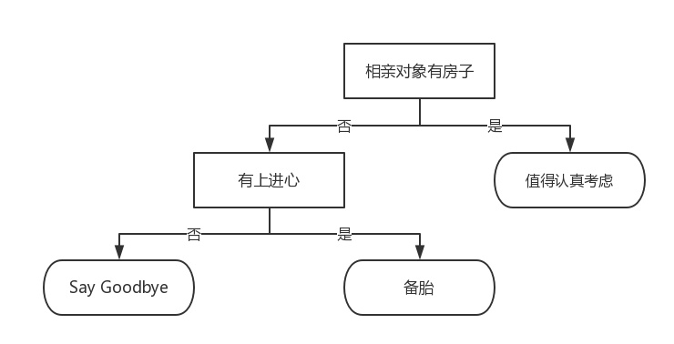
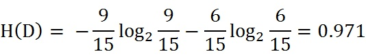
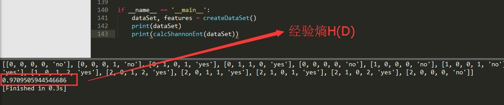
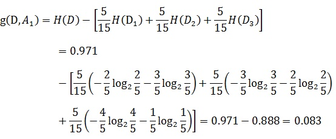
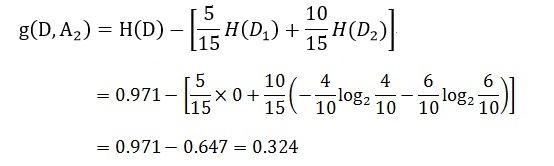
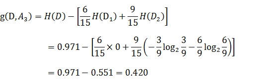
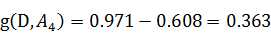
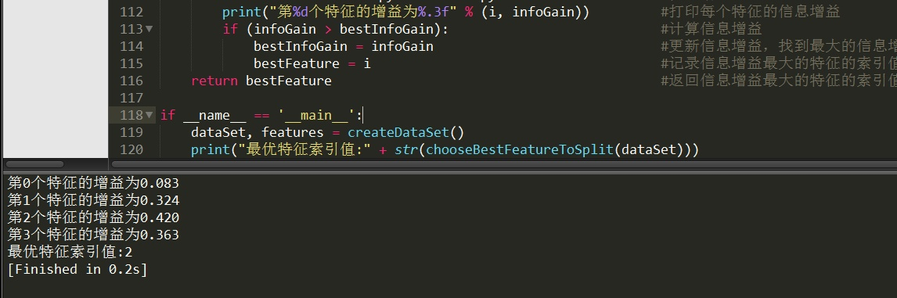

## 一、前言

有读者反映，说我上篇文章[机器学习实战教程（一）：k-近邻算法(史诗级干货长文)](https://www.cuijiahua.com/blog/2017/11/ml_1_knn.html)，太长了。一看那么长，读的欲望都降低了。既然如此，决策树的内容，我就分开讲好了。本篇讨论决策树的原理和决策树构建的准备工作，完整实例内容会在下一篇文章进行讲解。

本文出现的所有代码，均可在我的github上下载，欢迎**Follow、Star**：[Github代码地址](https://github.com/Jack-Cherish/Machine-Learning/tree/master/Decision Tree)

## 二、决策树

决策树是什么？决策树(decision tree)是一种基本的分类与回归方法。举个通俗易懂的例子，如下图所示的流程图就是一个决策树，长方形代表判断模块(decision  block)，椭圆形成代表终止模块(terminating  block)，表示已经得出结论，可以终止运行。从判断模块引出的左右箭头称作为分支(branch)，它可以达到另一个判断模块或者终止模块。我们还可以这样理解，分类决策树模型是一种描述对实例进行分类的树形结构。决策树由结点(node)和有向边(directed edge)组成。结点有两种类型：内部结点(internal node)和叶结点(leaf  node)。内部结点表示一个特征或属性，叶结点表示一个类。蒙圈没？？如下图所示的决策树，长方形和椭圆形都是结点。长方形的结点属于内部结点，椭圆形的结点属于叶结点，从结点引出的左右箭头就是有向边。而最上面的结点就是决策树的根结点(root node)。这样，结点说法就与模块说法对应上了，理解就好。

[](https://cuijiahua.com/wp-content/uploads/2017/11/m_2_1.jpg)

我们回到这个流程图，对，你没看错，这就是一个假想的相亲对象分类系统。它首先检测相亲对方是否有房。如果有房，则对于这个相亲对象可以考虑进一步接触。如果没有房，则观察相亲对象是否有上进心，如果没有，直接Say  Goodbye，此时可以说："你人很好，但是我们不合适。"如果有，则可以把这个相亲对象列入候选名单，好听点叫候选名单，有点瑕疵地讲，那就是备胎。

不过这只是个简单的相亲对象分类系统，只是做了简单的分类。真实情况可能要复杂得多，考虑因素也可以是五花八门。脾气好吗？会做饭吗？愿意做家务吗？家里几个孩子？父母是干什么的？天啊，我不想再说下去了，想想都可怕。

我们可以把决策树看成一个if-then规则的集合，将决策树转换成if-then规则的过程是这样的：由决策树的根结点(root node)到叶结点(leaf  node)的每一条路径构建一条规则；路径上内部结点的特征对应着规则的条件，而叶结点的类对应着规则的结论。决策树的路径或其对应的if-then规则集合具有一个重要的性质：互斥并且完备。这就是说，每一个实例都被一条路径或一条规则所覆盖，而且只被一条路径或一条规则所覆盖。这里所覆盖是指实例的特征与路径上的特征一致或实例满足规则的条件。

使用决策树做预测需要以下过程：

- 收集数据：可以使用任何方法。比如想构建一个相亲系统，我们可以从媒婆那里，或者通过采访相亲对象获取数据。根据他们考虑的因素和最终的选择结果，就可以得到一些供我们利用的数据了。
- 准备数据：收集完的数据，我们要进行整理，将这些所有收集的信息按照一定规则整理出来，并排版，方便我们进行后续处理。
- 分析数据：可以使用任何方法，决策树构造完成之后，我们可以检查决策树图形是否符合预期。
- 训练算法：这个过程也就是构造决策树，同样也可以说是决策树学习，就是构造一个决策树的数据结构。
- 测试算法：使用经验树计算错误率。当错误率达到了可接收范围，这个决策树就可以投放使用了。
- 使用算法：此步骤可以使用适用于任何监督学习算法，而使用决策树可以更好地理解数据的内在含义。

## 三、决策树的构建的准备工作

使用决策树做预测的每一步骤都很重要，数据收集不到位，将会导致没有足够的特征让我们构建错误率低的决策树。数据特征充足，但是不知道用哪些特征好，将会导致无法构建出分类效果好的决策树模型。从算法方面看，决策树的构建是我们的核心内容。

决策树要如何构建呢？通常，这一过程可以概括为3个步骤：特征选择、决策树的生成和决策树的修剪。

### 1、特征选择

特征选择在于选取对训练数据具有分类能力的特征。这样可以提高决策树学习的效率，如果利用一个特征进行分类的结果与随机分类的结果没有很大差别，则称这个特征是没有分类能力的。经验上扔掉这样的特征对决策树学习的精度影响不大。通常特征选择的标准是信息增益(information  gain)或信息增益比，为了简单，本文使用信息增益作为选择特征的标准。那么，什么是信息增益？在讲解信息增益之前，让我们看一组实例，贷款申请样本数据表。

[](https://cuijiahua.com/wp-content/uploads/2017/11/m_2_2.jpg)

希望通过所给的训练数据学习一个贷款申请的决策树，用于对未来的贷款申请进行分类，即当新的客户提出贷款申请时，根据申请人的特征利用决策树决定是否批准贷款申请。

特征选择就是决定用哪个特征来划分特征空间。比如，我们通过上述数据表得到两个可能的决策树，分别由两个不同特征的根结点构成。

[](https://cuijiahua.com/wp-content/uploads/2017/11/m_2_3.jpg)

图(a)所示的根结点的特征是年龄，有3个取值，对应于不同的取值有不同的子结点。图(b)所示的根节点的特征是工作，有2个取值，对应于不同的取值有不同的子结点。两个决策树都可以从此延续下去。问题是：究竟选择哪个特征更好些？这就要求确定选择特征的准则。直观上，如果一个特征具有更好的分类能力，或者说，按照这一特征将训练数据集分割成子集，使得各个子集在当前条件下有最好的分类，那么就更应该选择这个特征。信息增益就能够很好地表示这一直观的准则。

什么是信息增益呢？在划分数据集之后信息发生的变化称为信息增益，知道如何计算信息增益，我们就可以计算每个特征值划分数据集获得的信息增益，获得信息增益最高的特征就是最好的选择。

**（1）香农熵**

在可以评测哪个数据划分方式是最好的数据划分之前，我们必须学习如何计算信息增益。集合信息的度量方式称为香农熵或者简称为熵(entropy)，这个名字来源于信息论之父克劳德·香农。

如果看不明白什么是信息增益和熵，请不要着急，因为他们自诞生的那一天起，就注定会令世人十分费解。克劳德·香农写完信息论之后，约翰·冯·诺依曼建议使用"熵"这个术语，因为大家都不知道它是什么意思。

熵定义为信息的期望值。在信息论与概率统计中，熵是表示随机变量不确定性的度量。如果待分类的事物可能划分在多个分类之中，则符号xi的信息定义为 ：

[](https://cuijiahua.com/wp-content/uploads/2017/11/m_2_4.png)

其中p(xi)是选择该分类的概率。有人可能会问，信息为啥这样定义啊？答曰：前辈得出的结论。这就跟1+1等于2一样，记住并且会用即可。上述式中的对数以2为底，也可以e为底(自然对数)。

通过上式，我们可以得到所有类别的信息。为了计算熵，我们需要计算所有类别所有可能值包含的信息期望值(数学期望)，通过下面的公式得到：

[](https://cuijiahua.com/wp-content/uploads/2017/11/m_2_5.png)

期中n是分类的数目。熵越大，随机变量的不确定性就越大。

当熵中的概率由数据估计(特别是最大似然估计)得到时，所对应的熵称为经验熵(empirical  entropy)。什么叫由数据估计？比如有10个数据，一共有两个类别，A类和B类。其中有7个数据属于A类，则该A类的概率即为十分之七。其中有3个数据属于B类，则该B类的概率即为十分之三。浅显的解释就是，这概率是我们根据数据数出来的。我们定义贷款申请样本数据表中的数据为训练数据集D，则训练数据集D的经验熵为H(D)，|D|表示其样本容量，及样本个数。设有K个类Ck, = 1,2,3,...,K,|Ck|为属于类Ck的样本个数，因此经验熵公式就可以写为 ：

[](https://cuijiahua.com/wp-content/uploads/2017/11/m_2_6.png)

根据此公式计算经验熵H(D)，分析贷款申请样本数据表中的数据。最终分类结果只有两类，即放贷和不放贷。根据表中的数据统计可知，在15个数据中，9个数据的结果为放贷，6个数据的结果为不放贷。所以数据集D的经验熵H(D)为：

[](https://cuijiahua.com/wp-content/uploads/2017/11/m_2_7.jpg)

经过计算可知，数据集D的经验熵H(D)的值为0.971。

**（2）编写代码计算经验熵**

在编写代码之前，我们先对数据集进行属性标注。

- 年龄：0代表青年，1代表中年，2代表老年；
- 有工作：0代表否，1代表是；
- 有自己的房子：0代表否，1代表是；
- 信贷情况：0代表一般，1代表好，2代表非常好；
- 类别(是否给贷款)：no代表否，yes代表是。

确定这些之后，我们就可以创建数据集，并计算经验熵了，代码编写如下：

```python
# -*- coding: UTF-8 -*-
from math import log

"""
函数说明:创建测试数据集

Parameters:
    无
Returns:
    dataSet - 数据集
    labels - 分类属性
Author:
    Jack Cui
Modify:
    2017-07-20
"""
def createDataSet():
    dataSet = [[0, 0, 0, 0, 'no'],         #数据集
            [0, 0, 0, 1, 'no'],
            [0, 1, 0, 1, 'yes'],
            [0, 1, 1, 0, 'yes'],
            [0, 0, 0, 0, 'no'],
            [1, 0, 0, 0, 'no'],
            [1, 0, 0, 1, 'no'],
            [1, 1, 1, 1, 'yes'],
            [1, 0, 1, 2, 'yes'],
            [1, 0, 1, 2, 'yes'],
            [2, 0, 1, 2, 'yes'],
            [2, 0, 1, 1, 'yes'],
            [2, 1, 0, 1, 'yes'],
            [2, 1, 0, 2, 'yes'],
            [2, 0, 0, 0, 'no']]
    labels = ['不放贷', '放贷']             #分类属性
    return dataSet, labels                #返回数据集和分类属性

"""
函数说明:计算给定数据集的经验熵(香农熵)

Parameters:
    dataSet - 数据集
Returns:
    shannonEnt - 经验熵(香农熵)
Author:
    Jack Cui
Modify:
    2017-03-29
"""
def calcShannonEnt(dataSet):
    numEntires = len(dataSet)                        #返回数据集的行数
    labelCounts = {}                                #保存每个标签(Label)出现次数的字典
    for featVec in dataSet:                            #对每组特征向量进行统计
        currentLabel = featVec[-1]                    #提取标签(Label)信息
        if currentLabel not in labelCounts.keys():    #如果标签(Label)没有放入统计次数的字典,添加进去
            labelCounts[currentLabel] = 0
        labelCounts[currentLabel] += 1                #Label计数
    shannonEnt = 0.0                                #经验熵(香农熵)
    for key in labelCounts:                            #计算香农熵
        prob = float(labelCounts[key]) / numEntires    #选择该标签(Label)的概率
        shannonEnt -= prob * log(prob, 2)            #利用公式计算
    return shannonEnt                                #返回经验熵(香农熵)

if __name__ == '__main__':
    dataSet, features = createDataSet()
    print(dataSet)
    print(calcShannonEnt(dataSet))
```


代码运行结果如下图所示，代码是先打印训练数据集，然后打印计算的经验熵H(D)，程序计算的结果与我们统计计算的结果是一致的，程序没有问题。

[](https://cuijiahua.com/wp-content/uploads/2017/11/m_2_8.jpg)

**（3） 信息增益**

在上面，我们已经说过，如何选择特征，需要看信息增益。也就是说，信息增益是相对于特征而言的，信息增益越大，特征对最终的分类结果影响也就越大，我们就应该选择对最终分类结果影响最大的那个特征作为我们的分类特征。

在讲解信息增益定义之前，我们还需要明确一个概念，条件熵。

熵我们知道是什么，条件熵又是个什么鬼？条件熵H(Y|X)表示在已知随机变量X的条件下随机变量Y的不确定性，随机变量X给定的条件下随机变量Y的条件熵(conditional entropy)H(Y|X)，定义为X给定条件下Y的条件概率分布的熵对X的数学期望：

[](https://cuijiahua.com/wp-content/uploads/2017/11/m_2_9.jpg)

这里，

[](https://cuijiahua.com/wp-content/uploads/2017/11/m_2_10.jpg)

同理，当条件熵中的概率由数据估计(特别是极大似然估计)得到时，所对应的条件熵称为条件经验熵(empirical conditional entropy)。

明确了条件熵和经验条件熵的概念。接下来，让我们说说信息增益。前面也提到了，信息增益是相对于特征而言的。所以，特征A对训练数据集D的信息增益g(D,A)，定义为集合D的经验熵H(D)与特征A给定条件下D的经验条件熵H(D|A)之差，即：

[](https://cuijiahua.com/wp-content/uploads/2017/11/m_2_11.jpg)

一般地，熵H(D)与条件熵H(D|A)之差称为互信息(mutual information)。决策树学习中的信息增益等价于训练数据集中类与特征的互信息。

设特征A有n个不同的取值{a1,a2,···,an}，根据特征A的取值将D划分为n个子集{D1,D2，···,Dn}，|Di|为Di的样本个数。记子集Di中属于Ck的样本的集合为Dik，即Dik = Di ∩ Ck，|Dik|为Dik的样本个数。于是经验条件熵的公式可以些为：

[](https://cuijiahua.com/wp-content/uploads/2017/11/m_2_12.jpg)

说了这么多概念性的东西，没有听懂也没有关系，举几个例子，再回来看一下概念，就懂了。

以贷款申请样本数据表为例进行说明。看下年龄这一列的数据，也就是特征A1，一共有三个类别，分别是：青年、中年和老年。我们只看年龄是青年的数据，年龄是青年的数据一共有5个，所以年龄是青年的数据在训练数据集出现的概率是十五分之五，也就是三分之一。同理，年龄是中年和老年的数据在训练数据集出现的概率也都是三分之一。现在我们只看年龄是青年的数据的最终得到贷款的概率为五分之二，因为在五个数据中，只有两个数据显示拿到了最终的贷款，同理，年龄是中年和老年的数据最终得到贷款的概率分别为五分之三、五分之四。所以计算年龄的信息增益，过程如下：

[](https://cuijiahua.com/wp-content/uploads/2017/11/m_2_13.jpg)

同理，计算其余特征的信息增益g(D,A2)、g(D,A3)和g(D,A4)。分别为：

[](https://cuijiahua.com/wp-content/uploads/2017/11/m_2_14_m.jpg)

[](https://cuijiahua.com/wp-content/uploads/2017/11/m_2_15.jpg)

[](https://cuijiahua.com/wp-content/uploads/2017/11/m_2_16.jpg)

最后，比较特征的信息增益，由于特征A3(有自己的房子)的信息增益值最大，所以选择A3作为最优特征。

**（4） 编写代码计算信息增益**

我们已经学会了通过公式计算信息增益，接下来编写代码，计算信息增益。


```python
# -*- coding: UTF-8 -*-
from math import log

"""
函数说明:计算给定数据集的经验熵(香农熵)

Parameters:
    dataSet - 数据集
Returns:
    shannonEnt - 经验熵(香农熵)
Author:
    Jack Cui
Modify:
    2017-03-29
"""
def calcShannonEnt(dataSet):
    numEntires = len(dataSet)                        #返回数据集的行数
    labelCounts = {}                                #保存每个标签(Label)出现次数的字典
    for featVec in dataSet:                            #对每组特征向量进行统计
        currentLabel = featVec[-1]                    #提取标签(Label)信息
        if currentLabel not in labelCounts.keys():    #如果标签(Label)没有放入统计次数的字典,添加进去
            labelCounts[currentLabel] = 0
        labelCounts[currentLabel] += 1                #Label计数
    shannonEnt = 0.0                                #经验熵(香农熵)
    for key in labelCounts:                            #计算香农熵
        prob = float(labelCounts[key]) / numEntires    #选择该标签(Label)的概率
        shannonEnt -= prob * log(prob, 2)            #利用公式计算
    return shannonEnt                                #返回经验熵(香农熵)

"""
函数说明:创建测试数据集

Parameters:
    无
Returns:
    dataSet - 数据集
    labels - 分类属性
Author:
    Jack Cui
Modify:
    2017-07-20
"""
def createDataSet():
    dataSet = [[0, 0, 0, 0, 'no'],                        #数据集
            [0, 0, 0, 1, 'no'],
            [0, 1, 0, 1, 'yes'],
            [0, 1, 1, 0, 'yes'],
            [0, 0, 0, 0, 'no'],
            [1, 0, 0, 0, 'no'],
            [1, 0, 0, 1, 'no'],
            [1, 1, 1, 1, 'yes'],
            [1, 0, 1, 2, 'yes'],
            [1, 0, 1, 2, 'yes'],
            [2, 0, 1, 2, 'yes'],
            [2, 0, 1, 1, 'yes'],
            [2, 1, 0, 1, 'yes'],
            [2, 1, 0, 2, 'yes'],
            [2, 0, 0, 0, 'no']]
    labels = ['不放贷', '放贷']            #分类属性
    return dataSet, labels                             #返回数据集和分类属性

"""
函数说明:按照给定特征划分数据集

Parameters:
    dataSet - 待划分的数据集
    axis - 划分数据集的特征
    value - 需要返回的特征的值
Returns:
    无
Author:
    Jack Cui
Modify:
    2017-03-30
"""
def splitDataSet(dataSet, axis, value):       
    retDataSet = []                                        #创建返回的数据集列表
    for featVec in dataSet:                             #遍历数据集
        if featVec[axis] == value:
            reducedFeatVec = featVec[:axis]                #去掉axis特征
            reducedFeatVec.extend(featVec[axis+1:])     #将符合条件的添加到返回的数据集
            retDataSet.append(reducedFeatVec)
    return retDataSet                                      #返回划分后的数据集

"""
函数说明:选择最优特征

Parameters:
    dataSet - 数据集
Returns:
    bestFeature - 信息增益最大的(最优)特征的索引值
Author:
    Jack Cui
Modify:
    2017-03-30
"""
def chooseBestFeatureToSplit(dataSet):
    numFeatures = len(dataSet[0]) - 1                    #特征数量
    baseEntropy = calcShannonEnt(dataSet)                 #计算数据集的香农熵
    bestInfoGain = 0.0                                  #信息增益
    bestFeature = -1                                    #最优特征的索引值
    for i in range(numFeatures):                         #遍历所有特征
        #获取dataSet的第i个所有特征
        featList = [example[i] for example in dataSet]
        uniqueVals = set(featList)                         #创建set集合{},元素不可重复
        newEntropy = 0.0                                  #经验条件熵
        for value in uniqueVals:                         #计算信息增益
            subDataSet = splitDataSet(dataSet, i, value)         #subDataSet划分后的子集
            prob = len(subDataSet) / float(len(dataSet))           #计算子集的概率
            newEntropy += prob * calcShannonEnt(subDataSet)     #根据公式计算经验条件熵
        infoGain = baseEntropy - newEntropy                     #信息增益
        print("第%d个特征的增益为%.3f" % (i, infoGain))            #打印每个特征的信息增益
        if (infoGain > bestInfoGain):                             #计算信息增益
            bestInfoGain = infoGain                             #更新信息增益，找到最大的信息增益
            bestFeature = i                                     #记录信息增益最大的特征的索引值
    return bestFeature                                             #返回信息增益最大的特征的索引值

if __name__ == '__main__':
    dataSet, features = createDataSet()
    print("最优特征索引值:" + str(chooseBestFeatureToSplit(dataSet)))
```

splitDataSet函数是用来选择各个特征的子集的，比如选择年龄(第0个特征)的青年(用0代表)的自己，我们可以调用splitDataSet(dataSet,0,0)这样返回的子集就是年龄为青年的5个数据集。chooseBestFeatureToSplit是选择选择最优特征的函数。运行代码结果如下：

[](https://cuijiahua.com/wp-content/uploads/2017/11/m_2_17.jpg)

对比我们自己计算的结果，发现结果完全正确！最优特征的索引值为2，也就是特征A3(有自己的房子)。

### 2、决策树生成和修剪

我们已经学习了从数据集构造决策树算法所需要的子功能模块，包括经验熵的计算和最优特征的选择，其工作原理如下：得到原始数据集，然后基于最好的属性值划分数据集，由于特征值可能多于两个，因此可能存在大于两个分支的数据集划分。第一次划分之后，数据集被向下传递到树的分支的下一个结点。在这个结点上，我们可以再次划分数据。因此我们可以采用递归的原则处理数据集。

构建决策树的算法有很多，比如C4.5、ID3和CART，这些算法在运行时并不总是在每次划分数据分组时都会消耗特征。由于特征数目并不是每次划分数据分组时都减少，因此这些算法在实际使用时可能引起一定的问题。目前我们并不需要考虑这个问题，只需要在算法开始运行前计算列的数目，查看算法是否使用了所有属性即可。

决策树生成算法递归地产生决策树，直到不能继续下去未为止。这样产生的树往往对训练数据的分类很准确，但对未知的测试数据的分类却没有那么准确，即出现过拟合现象。过拟合的原因在于学习时过多地考虑如何提高对训练数据的正确分类，从而构建出过于复杂的决策树。解决这个问题的办法是考虑决策树的复杂度，对已生成的决策树进行简化。

## 四、总结

本篇文章讲解了如何计算数据集的经验熵和如何选择最优特征作为分类特征。决策树如何生成、修剪、可视化，以及整体实例练习，会在后续的文章中进行讲解。