## 一、前言

上篇文章[机器学习实战教程（二）：决策树基础篇之让我们从相亲说起](https://www.cuijiahua.com/blog/2017/11/ml_2_decision_tree_1.html)讲述了机器学习决策树的原理，以及如何选择最优特征作为分类特征。本篇文章将在此基础上进行介绍。主要包括：

- 决策树构建
- 决策树可视化
- 使用决策树进行分类预测
- 决策树的存储和读取
- sklearn实战之预测隐形眼睛类型

## 二、决策树构建

上篇文章也粗略提到过，构建决策树的算法有很多。篇幅原因，本篇文章只使用ID3算法构建决策树。

### 1、ID3算法

ID3算法的核心是在决策树各个结点上对应信息增益准则选择特征，递归地构建决策树。具体方法是：从根结点(root  node)开始，对结点计算所有可能的特征的信息增益，选择信息增益最大的特征作为结点的特征，由该特征的不同取值建立子节点；再对子结点递归地调用以上方法，构建决策树；直到所有特征的信息增益均很小或没有特征可以选择为止。最后得到一个决策树。ID3相当于用极大似然法进行概率模型的选择。

在使用ID3构造决策树之前，我们再分析下数据。

[](https://cuijiahua.com/wp-content/uploads/2017/11/ml_3_1.jpg)

利用上篇文章求得的结果，由于特征A3(有自己的房子)的信息增益值最大，所以选择特征A3作为根结点的特征。它将训练集D划分为两个子集D1(A3取值为"是")和D2(A3取值为"否")。由于D1只有同一类的样本点，所以它成为一个叶结点，结点的类标记为“是”。

对D2则需要从特征A1(年龄)，A2(有工作)和A4(信贷情况)中选择新的特征，计算各个特征的信息增益：

[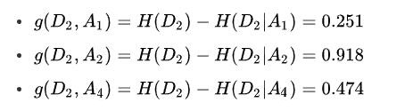](https://cuijiahua.com/wp-content/uploads/2017/11/ml_3_2-b.jpg)

根据计算，选择信息增益最大的特征A2(有工作)作为结点的特征。由于A2有两个可能取值，从这一结点引出两个子结点：一个对应"是"(有工作)的子结点，包含3个样本，它们属于同一类，所以这是一个叶结点，类标记为"是"；另一个是对应"否"(无工作)的子结点，包含6个样本，它们也属于同一类，所以这也是一个叶结点，类标记为"否"。

这样就生成了一个决策树，该决策树只用了两个特征(有两个内部结点)，生成的决策树如下图所示。

[](https://cuijiahua.com/wp-content/uploads/2017/11/ml_3_3.jpg)

这样我们就使用ID3算法构建出来了决策树，接下来，让我们看看如何进行代实现。

### 2、编写代码构建决策树

我们使用字典存储决策树的结构，比如上小节我们分析出来的决策树，用字典可以表示为：


Shell

{'有自己的房子': {0: {'有工作': {0: 'no', 1: 'yes'}}, 1: 'yes'}}

创建函数majorityCnt统计classList中出现此处最多的元素(类标签)，创建函数createTree用来递归构建决策树。编写代码如下：


```python
# -*- coding: UTF-8 -*-
from math import log
import operator

"""
函数说明:计算给定数据集的经验熵(香农熵)

Parameters:
    dataSet - 数据集
Returns:
    shannonEnt - 经验熵(香农熵)
Author:
    Jack Cui
Blog:
    http://blog.csdn.net/c406495762
Modify:
    2017-07-24
"""
def calcShannonEnt(dataSet):
    numEntires = len(dataSet)                        #返回数据集的行数
    labelCounts = {}                                #保存每个标签(Label)出现次数的字典
    for featVec in dataSet:                            #对每组特征向量进行统计
        currentLabel = featVec[-1]                    #提取标签(Label)信息
        if currentLabel not in labelCounts.keys():    #如果标签(Label)没有放入统计次数的字典,添加进去
            labelCounts[currentLabel] = 0
        labelCounts[currentLabel] += 1                #Label计数
    shannonEnt = 0.0                                #经验熵(香农熵)
    for key in labelCounts:                            #计算香农熵
        prob = float(labelCounts[key]) / numEntires    #选择该标签(Label)的概率
        shannonEnt -= prob * log(prob, 2)            #利用公式计算
    return shannonEnt                                #返回经验熵(香农熵)

"""
函数说明:创建测试数据集

Parameters:
    无
Returns:
    dataSet - 数据集
    labels - 特征标签
Author:
    Jack Cui
Blog:
    http://blog.csdn.net/c406495762
Modify:
    2017-07-20
"""
def createDataSet():
    dataSet = [[0, 0, 0, 0, 'no'],                        #数据集
            [0, 0, 0, 1, 'no'],
            [0, 1, 0, 1, 'yes'],
            [0, 1, 1, 0, 'yes'],
            [0, 0, 0, 0, 'no'],
            [1, 0, 0, 0, 'no'],
            [1, 0, 0, 1, 'no'],
            [1, 1, 1, 1, 'yes'],
            [1, 0, 1, 2, 'yes'],
            [1, 0, 1, 2, 'yes'],
            [2, 0, 1, 2, 'yes'],
            [2, 0, 1, 1, 'yes'],
            [2, 1, 0, 1, 'yes'],
            [2, 1, 0, 2, 'yes'],
            [2, 0, 0, 0, 'no']]
    labels = ['年龄', '有工作', '有自己的房子', '信贷情况']        #特征标签
    return dataSet, labels                             #返回数据集和分类属性

"""
函数说明:按照给定特征划分数据集

Parameters:
    dataSet - 待划分的数据集
    axis - 划分数据集的特征
    value - 需要返回的特征的值
Returns:
    无
Author:
    Jack Cui
Blog:
    http://blog.csdn.net/c406495762
Modify:
    2017-07-24
"""
def splitDataSet(dataSet, axis, value):       
    retDataSet = []                                        #创建返回的数据集列表
    for featVec in dataSet:                             #遍历数据集
        if featVec[axis] == value:
            reducedFeatVec = featVec[:axis]                #去掉axis特征
            reducedFeatVec.extend(featVec[axis+1:])     #将符合条件的添加到返回的数据集
            retDataSet.append(reducedFeatVec)
    return retDataSet                                      #返回划分后的数据集

"""
函数说明:选择最优特征

Parameters:
    dataSet - 数据集
Returns:
    bestFeature - 信息增益最大的(最优)特征的索引值
Author:
    Jack Cui
Blog:
    http://blog.csdn.net/c406495762
Modify:
    2017-07-20
"""
def chooseBestFeatureToSplit(dataSet):
    numFeatures = len(dataSet[0]) - 1                    #特征数量
    baseEntropy = calcShannonEnt(dataSet)                 #计算数据集的香农熵
    bestInfoGain = 0.0                                  #信息增益
    bestFeature = -1                                    #最优特征的索引值
    for i in range(numFeatures):                         #遍历所有特征
        #获取dataSet的第i个所有特征
        featList = [example[i] for example in dataSet]
        uniqueVals = set(featList)                         #创建set集合{},元素不可重复
        newEntropy = 0.0                                  #经验条件熵
        for value in uniqueVals:                         #计算信息增益
            subDataSet = splitDataSet(dataSet, i, value)         #subDataSet划分后的子集
            prob = len(subDataSet) / float(len(dataSet))           #计算子集的概率
            newEntropy += prob * calcShannonEnt(subDataSet)     #根据公式计算经验条件熵
        infoGain = baseEntropy - newEntropy                     #信息增益
        # print("第%d个特征的增益为%.3f" % (i, infoGain))            #打印每个特征的信息增益
        if (infoGain > bestInfoGain):                             #计算信息增益
            bestInfoGain = infoGain                             #更新信息增益，找到最大的信息增益
            bestFeature = i                                     #记录信息增益最大的特征的索引值
    return bestFeature                                             #返回信息增益最大的特征的索引值


"""
函数说明:统计classList中出现此处最多的元素(类标签)

Parameters:
    classList - 类标签列表
Returns:
    sortedClassCount[0][0] - 出现此处最多的元素(类标签)
Author:
    Jack Cui
Blog:
    http://blog.csdn.net/c406495762
Modify:
    2017-07-24
"""
def majorityCnt(classList):
    classCount = {}
    for vote in classList:                                        #统计classList中每个元素出现的次数
        if vote not in classCount.keys():classCount[vote] = 0   
        classCount[vote] += 1
    sortedClassCount = sorted(classCount.items(), key = operator.itemgetter(1), reverse = True)        #根据字典的值降序排序
    return sortedClassCount[0][0]                                #返回classList中出现次数最多的元素

"""
函数说明:创建决策树

Parameters:
    dataSet - 训练数据集
    labels - 分类属性标签
    featLabels - 存储选择的最优特征标签
Returns:
    myTree - 决策树
Author:
    Jack Cui
Blog:
    http://blog.csdn.net/c406495762
Modify:
    2017-07-25
"""
def createTree(dataSet, labels, featLabels):
    classList = [example[-1] for example in dataSet]            #取分类标签(是否放贷:yes or no)
    if classList.count(classList[0]) == len(classList):            #如果类别完全相同则停止继续划分
        return classList[0]
    if len(dataSet[0]) == 1 or len(labels) == 0:                                    #遍历完所有特征时返回出现次数最多的类标签
        return majorityCnt(classList)
    bestFeat = chooseBestFeatureToSplit(dataSet)                #选择最优特征
    bestFeatLabel = labels[bestFeat]                            #最优特征的标签
    featLabels.append(bestFeatLabel)
    myTree = {bestFeatLabel:{}}                                    #根据最优特征的标签生成树
    del(labels[bestFeat])                                        #删除已经使用特征标签
    featValues = [example[bestFeat] for example in dataSet]        #得到训练集中所有最优特征的属性值
    uniqueVals = set(featValues)                                #去掉重复的属性值
    for value in uniqueVals:                                   #遍历特征，创建决策树。        
        subLabels = labels[:]               
        myTree[bestFeatLabel][value] = createTree(splitDataSet(dataSet, bestFeat, value), subLabels, featLabels)
    return myTree

if __name__ == '__main__':
    dataSet, labels = createDataSet()
    featLabels = []
    myTree = createTree(dataSet, labels, featLabels)
    print(myTree)
```

 

递归创建决策树时，递归有两个终止条件：第一个停止条件是所有的类标签完全相同，则直接返回该类标签；第二个停止条件是使用完了所有特征，仍然不能将数据划分仅包含唯一类别的分组，即决策树构建失败，特征不够用。此时说明数据纬度不够，由于第二个停止条件无法简单地返回唯一的类标签，这里挑选出现数量最多的类别作为返回值。

运行上述代码，我们可以看到如下结果：

[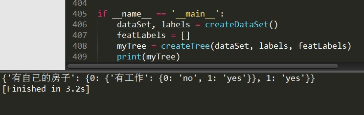](https://cuijiahua.com/wp-content/uploads/2017/11/ml_3_4.jpg)

可见，我们的决策树已经构建完成了。这时候，有的朋友可能会说，这个决策树看着好别扭，虽然这个能看懂，但是如果多点的结点，就不好看了。能直观点吗？完全没有问题，我们可以使用强大的Matplotlib绘制决策树。

## 三、决策树可视化

这里代码都是关于Matplotlib的，如果对于Matplotlib不了解的，可以先学习下，Matplotlib的内容这里就不再累述。可视化需要用到的函数：

- getNumLeafs：获取决策树叶子结点的数目
- getTreeDepth：获取决策树的层数
- plotNode：绘制结点
- plotMidText：标注有向边属性值
- plotTree：绘制决策树
- createPlot：创建绘制面板

我对可视化决策树的程序进行了详细的注释，直接看代码，调试查看即可。为了显示中文，需要设置FontProperties，代码编写如下：


```python
# -*- coding: UTF-8 -*-
from matplotlib.font_manager import FontProperties
import matplotlib.pyplot as plt
from math import log
import operator

"""
函数说明:计算给定数据集的经验熵(香农熵)

Parameters:
    dataSet - 数据集
Returns:
    shannonEnt - 经验熵(香农熵)
Author:
    Jack Cui
Blog:
    http://blog.csdn.net/c406495762
Modify:
    2017-07-24
"""
def calcShannonEnt(dataSet):
    numEntires = len(dataSet)                        #返回数据集的行数
    labelCounts = {}                                #保存每个标签(Label)出现次数的字典
    for featVec in dataSet:                            #对每组特征向量进行统计
        currentLabel = featVec[-1]                    #提取标签(Label)信息
        if currentLabel not in labelCounts.keys():    #如果标签(Label)没有放入统计次数的字典,添加进去
            labelCounts[currentLabel] = 0
        labelCounts[currentLabel] += 1                #Label计数
    shannonEnt = 0.0                                #经验熵(香农熵)
    for key in labelCounts:                            #计算香农熵
        prob = float(labelCounts[key]) / numEntires    #选择该标签(Label)的概率
        shannonEnt -= prob * log(prob, 2)            #利用公式计算
    return shannonEnt                                #返回经验熵(香农熵)

"""
函数说明:创建测试数据集

Parameters:
    无
Returns:
    dataSet - 数据集
    labels - 特征标签
Author:
    Jack Cui
Blog:
    http://blog.csdn.net/c406495762
Modify:
    2017-07-20
"""
def createDataSet():
    dataSet = [[0, 0, 0, 0, 'no'],                        #数据集
            [0, 0, 0, 1, 'no'],
            [0, 1, 0, 1, 'yes'],
            [0, 1, 1, 0, 'yes'],
            [0, 0, 0, 0, 'no'],
            [1, 0, 0, 0, 'no'],
            [1, 0, 0, 1, 'no'],
            [1, 1, 1, 1, 'yes'],
            [1, 0, 1, 2, 'yes'],
            [1, 0, 1, 2, 'yes'],
            [2, 0, 1, 2, 'yes'],
            [2, 0, 1, 1, 'yes'],
            [2, 1, 0, 1, 'yes'],
            [2, 1, 0, 2, 'yes'],
            [2, 0, 0, 0, 'no']]
    labels = ['年龄', '有工作', '有自己的房子', '信贷情况']        #特征标签
    return dataSet, labels                             #返回数据集和分类属性

"""
函数说明:按照给定特征划分数据集

Parameters:
    dataSet - 待划分的数据集
    axis - 划分数据集的特征
    value - 需要返回的特征的值
Returns:
    无
Author:
    Jack Cui
Blog:
    http://blog.csdn.net/c406495762
Modify:
    2017-07-24
"""
def splitDataSet(dataSet, axis, value):       
    retDataSet = []                                        #创建返回的数据集列表
    for featVec in dataSet:                             #遍历数据集
        if featVec[axis] == value:
            reducedFeatVec = featVec[:axis]                #去掉axis特征
            reducedFeatVec.extend(featVec[axis+1:])     #将符合条件的添加到返回的数据集
            retDataSet.append(reducedFeatVec)
    return retDataSet                                      #返回划分后的数据集

"""
函数说明:选择最优特征

Parameters:
    dataSet - 数据集
Returns:
    bestFeature - 信息增益最大的(最优)特征的索引值
Author:
    Jack Cui
Blog:
    http://blog.csdn.net/c406495762
Modify:
    2017-07-20
"""
def chooseBestFeatureToSplit(dataSet):
    numFeatures = len(dataSet[0]) - 1                    #特征数量
    baseEntropy = calcShannonEnt(dataSet)                 #计算数据集的香农熵
    bestInfoGain = 0.0                                  #信息增益
    bestFeature = -1                                    #最优特征的索引值
    for i in range(numFeatures):                         #遍历所有特征
        #获取dataSet的第i个所有特征
        featList = [example[i] for example in dataSet]
        uniqueVals = set(featList)                         #创建set集合{},元素不可重复
        newEntropy = 0.0                                  #经验条件熵
        for value in uniqueVals:                         #计算信息增益
            subDataSet = splitDataSet(dataSet, i, value)         #subDataSet划分后的子集
            prob = len(subDataSet) / float(len(dataSet))           #计算子集的概率
            newEntropy += prob * calcShannonEnt(subDataSet)     #根据公式计算经验条件熵
        infoGain = baseEntropy - newEntropy                     #信息增益
        # print("第%d个特征的增益为%.3f" % (i, infoGain))            #打印每个特征的信息增益
        if (infoGain > bestInfoGain):                             #计算信息增益
            bestInfoGain = infoGain                             #更新信息增益，找到最大的信息增益
            bestFeature = i                                     #记录信息增益最大的特征的索引值
    return bestFeature                                             #返回信息增益最大的特征的索引值


"""
函数说明:统计classList中出现此处最多的元素(类标签)

Parameters:
    classList - 类标签列表
Returns:
    sortedClassCount[0][0] - 出现此处最多的元素(类标签)
Author:
    Jack Cui
Blog:
    http://blog.csdn.net/c406495762
Modify:
    2017-07-24
"""
def majorityCnt(classList):
    classCount = {}
    for vote in classList:                                        #统计classList中每个元素出现的次数
        if vote not in classCount.keys():classCount[vote] = 0   
        classCount[vote] += 1
    sortedClassCount = sorted(classCount.items(), key = operator.itemgetter(1), reverse = True)        #根据字典的值降序排序
    return sortedClassCount[0][0]                                #返回classList中出现次数最多的元素

"""
函数说明:创建决策树

Parameters:
    dataSet - 训练数据集
    labels - 分类属性标签
    featLabels - 存储选择的最优特征标签
Returns:
    myTree - 决策树
Author:
    Jack Cui
Blog:
    http://blog.csdn.net/c406495762
Modify:
    2017-07-25
"""
def createTree(dataSet, labels, featLabels):
    classList = [example[-1] for example in dataSet]            #取分类标签(是否放贷:yes or no)
    if classList.count(classList[0]) == len(classList):            #如果类别完全相同则停止继续划分
        return classList[0]
    if len(dataSet[0]) == 1 or len(labels) == 0:                                    #遍历完所有特征时返回出现次数最多的类标签
        return majorityCnt(classList)
    bestFeat = chooseBestFeatureToSplit(dataSet)                #选择最优特征
    bestFeatLabel = labels[bestFeat]                            #最优特征的标签
    featLabels.append(bestFeatLabel)
    myTree = {bestFeatLabel:{}}                                    #根据最优特征的标签生成树
    del(labels[bestFeat])                                        #删除已经使用特征标签
    featValues = [example[bestFeat] for example in dataSet]        #得到训练集中所有最优特征的属性值
    uniqueVals = set(featValues)                                #去掉重复的属性值
    for value in uniqueVals:                                    #遍历特征，创建决策树。  
        subLabels = labels[:]               
        myTree[bestFeatLabel][value] = createTree(splitDataSet(dataSet, bestFeat, value), subLabels, featLabels)
    return myTree

"""
函数说明:获取决策树叶子结点的数目

Parameters:
    myTree - 决策树
Returns:
    numLeafs - 决策树的叶子结点的数目
Author:
    Jack Cui
Blog:
    http://blog.csdn.net/c406495762
Modify:
    2017-07-24
"""
def getNumLeafs(myTree):
    numLeafs = 0                                                #初始化叶子
    firstStr = next(iter(myTree))                                #python3中myTree.keys()返回的是dict_keys,不在是list,所以不能使用myTree.keys()[0]的方法获取结点属性，可以使用list(myTree.keys())[0]
    secondDict = myTree[firstStr]                                #获取下一组字典
    for key in secondDict.keys():
        if type(secondDict[key]).__name__=='dict':                #测试该结点是否为字典，如果不是字典，代表此结点为叶子结点
            numLeafs += getNumLeafs(secondDict[key])
        else:   numLeafs +=1
    return numLeafs

"""
函数说明:获取决策树的层数

Parameters:
    myTree - 决策树
Returns:
    maxDepth - 决策树的层数
Author:
    Jack Cui
Blog:
    http://blog.csdn.net/c406495762
Modify:
    2017-07-24
"""
def getTreeDepth(myTree):
    maxDepth = 0                                                #初始化决策树深度
    firstStr = next(iter(myTree))                                #python3中myTree.keys()返回的是dict_keys,不在是list,所以不能使用myTree.keys()[0]的方法获取结点属性，可以使用list(myTree.keys())[0]
    secondDict = myTree[firstStr]                                #获取下一个字典
    for key in secondDict.keys():
        if type(secondDict[key]).__name__=='dict':                #测试该结点是否为字典，如果不是字典，代表此结点为叶子结点
            thisDepth = 1 + getTreeDepth(secondDict[key])
        else:   thisDepth = 1
        if thisDepth > maxDepth: maxDepth = thisDepth            #更新层数
    return maxDepth

"""
函数说明:绘制结点

Parameters:
    nodeTxt - 结点名
    centerPt - 文本位置
    parentPt - 标注的箭头位置
    nodeType - 结点格式
Returns:
    无
Author:
    Jack Cui
Blog:
    http://blog.csdn.net/c406495762
Modify:
    2017-07-24
"""
def plotNode(nodeTxt, centerPt, parentPt, nodeType):
    arrow_args = dict(arrowstyle="<-")                                            #定义箭头格式
    font = FontProperties(fname=r"c:\windows\fonts\simsun.ttc", size=14)        #设置中文字体
    createPlot.ax1.annotate(nodeTxt, xy=parentPt,  xycoords='axes fraction',    #绘制结点
        xytext=centerPt, textcoords='axes fraction',
        va="center", ha="center", bbox=nodeType, arrowprops=arrow_args, FontProperties=font)

"""
函数说明:标注有向边属性值

Parameters:
    cntrPt、parentPt - 用于计算标注位置
    txtString - 标注的内容
Returns:
    无
Author:
    Jack Cui
Blog:
    http://blog.csdn.net/c406495762
Modify:
    2017-07-24
"""
def plotMidText(cntrPt, parentPt, txtString):
    xMid = (parentPt[0]-cntrPt[0])/2.0 + cntrPt[0]                                            #计算标注位置                   
    yMid = (parentPt[1]-cntrPt[1])/2.0 + cntrPt[1]
    createPlot.ax1.text(xMid, yMid, txtString, va="center", ha="center", rotation=30)

"""
函数说明:绘制决策树

Parameters:
    myTree - 决策树(字典)
    parentPt - 标注的内容
    nodeTxt - 结点名
Returns:
    无
Author:
    Jack Cui
Blog:
    http://blog.csdn.net/c406495762
Modify:
    2017-07-24
"""
def plotTree(myTree, parentPt, nodeTxt):
    decisionNode = dict(boxstyle="sawtooth", fc="0.8")                                        #设置结点格式
    leafNode = dict(boxstyle="round4", fc="0.8")                                            #设置叶结点格式
    numLeafs = getNumLeafs(myTree)                                                          #获取决策树叶结点数目，决定了树的宽度
    depth = getTreeDepth(myTree)                                                            #获取决策树层数
    firstStr = next(iter(myTree))                                                            #下个字典                                                 
    cntrPt = (plotTree.xOff + (1.0 + float(numLeafs))/2.0/plotTree.totalW, plotTree.yOff)    #中心位置
    plotMidText(cntrPt, parentPt, nodeTxt)                                                    #标注有向边属性值
    plotNode(firstStr, cntrPt, parentPt, decisionNode)                                        #绘制结点
    secondDict = myTree[firstStr]                                                            #下一个字典，也就是继续绘制子结点
    plotTree.yOff = plotTree.yOff - 1.0/plotTree.totalD                                        #y偏移
    for key in secondDict.keys():                               
        if type(secondDict[key]).__name__=='dict':                                            #测试该结点是否为字典，如果不是字典，代表此结点为叶子结点
            plotTree(secondDict[key],cntrPt,str(key))                                        #不是叶结点，递归调用继续绘制
        else:                                                                                #如果是叶结点，绘制叶结点，并标注有向边属性值                                             
            plotTree.xOff = plotTree.xOff + 1.0/plotTree.totalW
            plotNode(secondDict[key], (plotTree.xOff, plotTree.yOff), cntrPt, leafNode)
            plotMidText((plotTree.xOff, plotTree.yOff), cntrPt, str(key))
    plotTree.yOff = plotTree.yOff + 1.0/plotTree.totalD

"""
函数说明:创建绘制面板

Parameters:
    inTree - 决策树(字典)
Returns:
    无
Author:
    Jack Cui
Blog:
    http://blog.csdn.net/c406495762
Modify:
    2017-07-24
"""
def createPlot(inTree):
    fig = plt.figure(1, facecolor='white')                                                    #创建fig
    fig.clf()                                                                                #清空fig
    axprops = dict(xticks=[], yticks=[])
    createPlot.ax1 = plt.subplot(111, frameon=False, **axprops)                                #去掉x、y轴
    plotTree.totalW = float(getNumLeafs(inTree))                                            #获取决策树叶结点数目
    plotTree.totalD = float(getTreeDepth(inTree))                                            #获取决策树层数
    plotTree.xOff = -0.5/plotTree.totalW; plotTree.yOff = 1.0;                                #x偏移
    plotTree(inTree, (0.5,1.0), '')                                                            #绘制决策树
    plt.show()                                                                                 #显示绘制结果     

if __name__ == '__main__':
    dataSet, labels = createDataSet()
    featLabels = []
    myTree = createTree(dataSet, labels, featLabels)
    print(myTree)  
    createPlot(myTree)
```

不出意外的话，我们就可以得到如下结果，可以看到决策树绘制完成。plotNode函数的工作就是绘制各个结点，比如有`自己的房子`、`有工作`、`yes`、`no`，包括内结点和叶子结点。plotMidText函数的工作就是绘制各个有向边的属性，例如各个有向边的`0`和`1`。这部分内容呢，个人感觉可以选择性掌握，能掌握最好，不能掌握可以放一放，因为后面会介绍一个更简单的决策树可视化方法。看到这句话，是不是想偷懒不仔细看这部分的代码了？(눈_눈)

[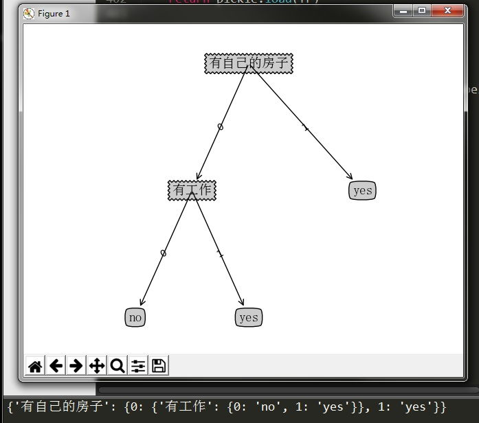](https://cuijiahua.com/wp-content/uploads/2017/11/ml_3_5.jpg)

## 四、使用决策树执行分类

依靠训练数据构造了决策树之后，我们可以将它用于实际数据的分类。在执行数据分类时，需要决策树以及用于构造树的标签向量。然后，程序比较测试数据与决策树上的数值，递归执行该过程直到进入叶子结点；最后将测试数据定义为叶子结点所属的类型。在构建决策树的代码，可以看到，有个featLabels参数。它是用来干什么的？它就是用来记录各个分类结点的，在用决策树做预测的时候，我们按顺序输入需要的分类结点的属性值即可。举个例子，比如我用上述已经训练好的决策树做分类，那么我只需要提供这个人是否有房子，是否有工作这两个信息即可，无需提供冗余的信息。

用决策树做分类的代码很简单，编写代码如下：

```python
# -*- coding: UTF-8 -*-
from math import log
import operator

"""
函数说明:计算给定数据集的经验熵(香农熵)

Parameters:
    dataSet - 数据集
Returns:
    shannonEnt - 经验熵(香农熵)
Author:
    Jack Cui
Blog:
    http://blog.csdn.net/c406495762
Modify:
    2017-07-24
"""
def calcShannonEnt(dataSet):
    numEntires = len(dataSet)                        #返回数据集的行数
    labelCounts = {}                                #保存每个标签(Label)出现次数的字典
    for featVec in dataSet:                            #对每组特征向量进行统计
        currentLabel = featVec[-1]                    #提取标签(Label)信息
        if currentLabel not in labelCounts.keys():    #如果标签(Label)没有放入统计次数的字典,添加进去
            labelCounts[currentLabel] = 0
        labelCounts[currentLabel] += 1                #Label计数
    shannonEnt = 0.0                                #经验熵(香农熵)
    for key in labelCounts:                            #计算香农熵
        prob = float(labelCounts[key]) / numEntires    #选择该标签(Label)的概率
        shannonEnt -= prob * log(prob, 2)            #利用公式计算
    return shannonEnt                                #返回经验熵(香农熵)

"""
函数说明:创建测试数据集

Parameters:
    无
Returns:
    dataSet - 数据集
    labels - 特征标签
Author:
    Jack Cui
Blog:
    http://blog.csdn.net/c406495762
Modify:
    2017-07-20
"""
def createDataSet():
    dataSet = [[0, 0, 0, 0, 'no'],                        #数据集
            [0, 0, 0, 1, 'no'],
            [0, 1, 0, 1, 'yes'],
            [0, 1, 1, 0, 'yes'],
            [0, 0, 0, 0, 'no'],
            [1, 0, 0, 0, 'no'],
            [1, 0, 0, 1, 'no'],
            [1, 1, 1, 1, 'yes'],
            [1, 0, 1, 2, 'yes'],
            [1, 0, 1, 2, 'yes'],
            [2, 0, 1, 2, 'yes'],
            [2, 0, 1, 1, 'yes'],
            [2, 1, 0, 1, 'yes'],
            [2, 1, 0, 2, 'yes'],
            [2, 0, 0, 0, 'no']]
    labels = ['年龄', '有工作', '有自己的房子', '信贷情况']        #特征标签
    return dataSet, labels                             #返回数据集和分类属性

"""
函数说明:按照给定特征划分数据集

Parameters:
    dataSet - 待划分的数据集
    axis - 划分数据集的特征
    value - 需要返回的特征的值
Returns:
    无
Author:
    Jack Cui
Blog:
    http://blog.csdn.net/c406495762
Modify:
    2017-07-24
"""
def splitDataSet(dataSet, axis, value):       
    retDataSet = []                                        #创建返回的数据集列表
    for featVec in dataSet:                             #遍历数据集
        if featVec[axis] == value:
            reducedFeatVec = featVec[:axis]                #去掉axis特征
            reducedFeatVec.extend(featVec[axis+1:])     #将符合条件的添加到返回的数据集
            retDataSet.append(reducedFeatVec)
    return retDataSet                                      #返回划分后的数据集

"""
函数说明:选择最优特征

Parameters:
    dataSet - 数据集
Returns:
    bestFeature - 信息增益最大的(最优)特征的索引值
Author:
    Jack Cui
Blog:
    http://blog.csdn.net/c406495762
Modify:
    2017-07-20
"""
def chooseBestFeatureToSplit(dataSet):
    numFeatures = len(dataSet[0]) - 1                    #特征数量
    baseEntropy = calcShannonEnt(dataSet)                 #计算数据集的香农熵
    bestInfoGain = 0.0                                  #信息增益
    bestFeature = -1                                    #最优特征的索引值
    for i in range(numFeatures):                         #遍历所有特征
        #获取dataSet的第i个所有特征
        featList = [example[i] for example in dataSet]
        uniqueVals = set(featList)                         #创建set集合{},元素不可重复
        newEntropy = 0.0                                  #经验条件熵
        for value in uniqueVals:                         #计算信息增益
            subDataSet = splitDataSet(dataSet, i, value)         #subDataSet划分后的子集
            prob = len(subDataSet) / float(len(dataSet))           #计算子集的概率
            newEntropy += prob * calcShannonEnt(subDataSet)     #根据公式计算经验条件熵
        infoGain = baseEntropy - newEntropy                     #信息增益
        # print("第%d个特征的增益为%.3f" % (i, infoGain))            #打印每个特征的信息增益
        if (infoGain > bestInfoGain):                             #计算信息增益
            bestInfoGain = infoGain                             #更新信息增益，找到最大的信息增益
            bestFeature = i                                     #记录信息增益最大的特征的索引值
    return bestFeature                                             #返回信息增益最大的特征的索引值


"""
函数说明:统计classList中出现此处最多的元素(类标签)

Parameters:
    classList - 类标签列表
Returns:
    sortedClassCount[0][0] - 出现此处最多的元素(类标签)
Author:
    Jack Cui
Blog:
    http://blog.csdn.net/c406495762
Modify:
    2017-07-24
"""
def majorityCnt(classList):
    classCount = {}
    for vote in classList:                                        #统计classList中每个元素出现的次数
        if vote not in classCount.keys():classCount[vote] = 0   
        classCount[vote] += 1
    sortedClassCount = sorted(classCount.items(), key = operator.itemgetter(1), reverse = True)        #根据字典的值降序排序
    return sortedClassCount[0][0]                                #返回classList中出现次数最多的元素

"""
函数说明:创建决策树

Parameters:
    dataSet - 训练数据集
    labels - 分类属性标签
    featLabels - 存储选择的最优特征标签
Returns:
    myTree - 决策树
Author:
    Jack Cui
Blog:
    http://blog.csdn.net/c406495762
Modify:
    2017-07-25
"""
def createTree(dataSet, labels, featLabels):
    classList = [example[-1] for example in dataSet]            #取分类标签(是否放贷:yes or no)
    if classList.count(classList[0]) == len(classList):            #如果类别完全相同则停止继续划分
        return classList[0]
    if len(dataSet[0]) == 1 or len(labels) == 0:                                    #遍历完所有特征时返回出现次数最多的类标签
        return majorityCnt(classList)
    bestFeat = chooseBestFeatureToSplit(dataSet)                #选择最优特征
    bestFeatLabel = labels[bestFeat]                            #最优特征的标签
    featLabels.append(bestFeatLabel)
    myTree = {bestFeatLabel:{}}                                    #根据最优特征的标签生成树
    del(labels[bestFeat])                                        #删除已经使用特征标签
    featValues = [example[bestFeat] for example in dataSet]        #得到训练集中所有最优特征的属性值
    uniqueVals = set(featValues)                                #去掉重复的属性值
    for value in uniqueVals:                                    #遍历特征，创建决策树。                       
        myTree[bestFeatLabel][value] = createTree(splitDataSet(dataSet, bestFeat, value), labels, featLabels)
    return myTree

"""
函数说明:使用决策树分类

Parameters:
    inputTree - 已经生成的决策树
    featLabels - 存储选择的最优特征标签
    testVec - 测试数据列表，顺序对应最优特征标签
Returns:
    classLabel - 分类结果
Author:
    Jack Cui
Blog:
    http://blog.csdn.net/c406495762
Modify:
    2017-07-25
"""
def classify(inputTree, featLabels, testVec):
    firstStr = next(iter(inputTree))                                                        #获取决策树结点
    secondDict = inputTree[firstStr]                                                        #下一个字典
    featIndex = featLabels.index(firstStr)                                               
    for key in secondDict.keys():
        if testVec[featIndex] == key:
            if type(secondDict[key]).__name__ == 'dict':
                classLabel = classify(secondDict[key], featLabels, testVec)
            else: classLabel = secondDict[key]
    return classLabel

if __name__ == '__main__':
    dataSet, labels = createDataSet()
    featLabels = []
    myTree = createTree(dataSet, labels, featLabels)
    testVec = [0,1]                                        #测试数据
    result = classify(myTree, featLabels, testVec)
    if result == 'yes':
        print('放贷')
    if result == 'no':
        print('不放贷')
```


这里只增加了classify函数，用于决策树分类。输入测试数据[0,1]，它代表没有房子，但是有工作，分类结果如下所示：

[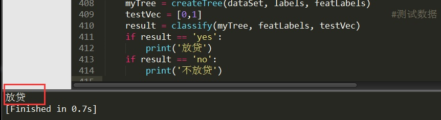](https://cuijiahua.com/wp-content/uploads/2017/11/ml_3_7.jpg)

看到这里，细心的朋友可能就会问了，每次做预测都要训练一次决策树？这也太麻烦了吧？有什么好的解决吗？

## 五、决策树的存储

构造决策树是很耗时的任务，即使处理很小的数据集，如前面的样本数据，也要花费几秒的时间，如果数据集很大，将会耗费很多计算时间。然而用创建好的决策树解决分类问题，则可以很快完成。因此，为了节省计算时间，最好能够在每次执行分类时调用已经构造好的决策树。为了解决这个问题，需要使用Python模块pickle序列化对象。序列化对象可以在磁盘上保存对象，并在需要的时候读取出来。

假设我们已经得到决策树{'有自己的房子': {0: {'有工作': {0: 'no', 1: 'yes'}}, 1: 'yes'}}，使用pickle.dump存储决策树。

```python
# -*- coding: UTF-8 -*-
import pickle

"""
函数说明:存储决策树

Parameters:
    inputTree - 已经生成的决策树
    filename - 决策树的存储文件名
Returns:
    无
Author:
    Jack Cui
Blog:
    http://blog.csdn.net/c406495762
Modify:
    2017-07-25
"""
def storeTree(inputTree, filename):
    with open(filename, 'wb') as fw:
        pickle.dump(inputTree, fw)

if __name__ == '__main__':
    myTree = {'有自己的房子': {0: {'有工作': {0: 'no', 1: 'yes'}}, 1: 'yes'}}
    storeTree(myTree, 'classifierStorage.txt')
```


运行代码，在该Python文件的相同目录下，会生成一个名为classifierStorage.txt的txt文件，这个文件二进制存储着我们的决策树。我们可以使用sublime txt打开看下存储结果。

[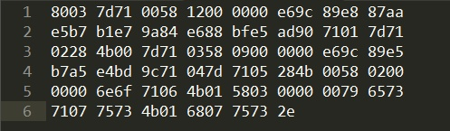](https://cuijiahua.com/wp-content/uploads/2017/11/ml_3_6.jpg)

看不懂？没错，因为这个是个二进制存储的文件，我们也无需看懂里面的内容，会存储，会用即可。那么问题来了。将决策树存储完这个二进制文件，然后下次使用的话，怎么用呢？

很简单使用pickle.load进行载入即可，编写代码如下：


```python
# -*- coding: UTF-8 -*-
import pickle

"""
函数说明:读取决策树

Parameters:
    filename - 决策树的存储文件名
Returns:
    pickle.load(fr) - 决策树字典
Author:
    Jack Cui
Blog:
    http://blog.csdn.net/c406495762
Modify:
    2017-07-25
"""
def grabTree(filename):
    fr = open(filename, 'rb')
    return pickle.load(fr)

if __name__ == '__main__':
    myTree = grabTree('classifierStorage.txt')
    print(myTree)
```

如果在该Python文件的相同目录下，有一个名为classifierStorage.txt的文件，那么我们就可以运行上述代码，运行结果如下图所示：

[](https://cuijiahua.com/wp-content/uploads/2017/11/ml_3_9.jpg)

从上述结果中，我们可以看到，我们顺利加载了存储决策树的二进制文件。

## 六、Sklearn之使用决策树预测隐形眼睛类型

### 1、实战背景

进入本文的正题：眼科医生是如何判断患者需要佩戴隐形眼镜的类型的？一旦理解了决策树的工作原理，我们甚至也可以帮助人们判断需要佩戴的镜片类型。

隐形眼镜数据集是非常著名的数据集，它包含很多换着眼部状态的观察条件以及医生推荐的隐形眼镜类型。隐形眼镜类型包括硬材质(hard)、软材质(soft)以及不适合佩戴隐形眼镜(no lenses)。数据来源与UCI数据库，数据集下载地址：[https://github.com/Jack-Cherish/Machine-Learning/blob/master/Decision%20Tree/classifierStorage.txt](https://github.com/Jack-Cherish/Machine-Learning/blob/master/Decision Tree/classifierStorage.txt)

一共有24组数据，数据的Labels依次是`age`、`prescript`、`astigmatic`、`tearRate`、`class`，也就是第一列是年龄，第二列是症状，第三列是是否散光，第四列是眼泪数量，第五列是最终的分类标签。数据如下图所示：

[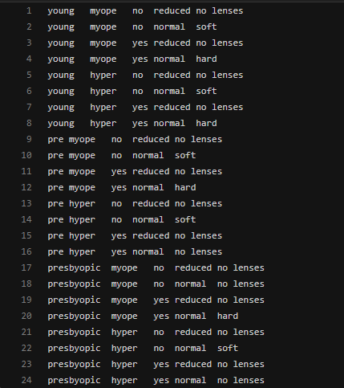](https://cuijiahua.com/wp-content/uploads/2017/11/ml_3_10.png)

可以使用已经写好的Python程序构建决策树，不过出于继续学习的目的，本文使用Sklearn实现。

### 2、使用Sklearn构建决策树

官方英文文档地址：[http://scikit-learn.org/stable/modules/generated/sklearn.tree.DecisionTreeClassifier.html](https://scikit-learn.org/stable/modules/generated/sklearn.tree.DecisionTreeClassifier.html)

sklearn.tree模块提供了决策树模型，用于解决分类问题和回归问题。方法如下图所示：

[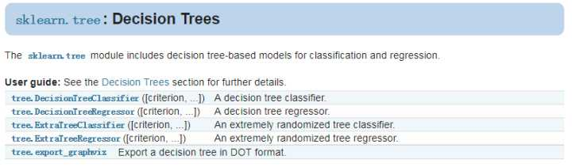](https://cuijiahua.com/wp-content/uploads/2017/11/ml_3_11.jpg)

本次实战内容使用的是DecisionTreeClassifier和export_graphviz，前者用于决策树构建，后者用于决策树可视化。

**DecisionTreeClassifier构建决策树：**

让我们先看下DecisionTreeClassifier这个函数，一共有12个参数：

[](https://cuijiahua.com/wp-content/uploads/2017/11/ml_3_12.jpg)

参数说明如下：

- **criterion：**特征选择标准，可选参数，默认是`gini`，可以设置为`entropy`。`gini`是基尼不纯度，是将来自集合的某种结果随机应用于某一数据项的预期误差率，是一种基于统计的思想。`entropy`是香农熵，也就是上篇文章讲过的内容，是一种基于信息论的思想。Sklearn把`gini`设为默认参数，应该也是做了相应的斟酌的，精度也许更高些？ID3算法使用的是`entropy`，CART算法使用的则是`gini`。

- **splitter：**特征划分点选择标准，可选参数，默认是`best`，可以设置为`random`。每个结点的选择策略。`best`参数是根据算法选择最佳的切分特征，例如`gini`、`entropy`。`random`随机的在部分划分点中找局部最优的划分点。默认的"best"适合样本量不大的时候，而如果样本数据量非常大，此时决策树构建推荐"random"。

- max_features：

  划分时考虑的最大特征数，可选参数，默认是None。寻找最佳切分时考虑的最大特征数(n_features为总共的特征数)，有如下6种情况：

  - 如果max_features是整型的数，则考虑max_features个特征；
  - 如果max_features是浮点型的数，则考虑int(max_features * n_features)个特征；
  - 如果max_features设为`auto`，那么max_features = sqrt(n_features)；
  - 如果max_features设为`sqrt`，那么max_featrues = sqrt(n_features)，跟`auto`一样；
  - 如果max_features设为`log2`，那么max_features = log2(n_features)；
  - 如果max_features设为`None`，那么max_features = n_features，也就是所有特征都用。
  - 一般来说，如果样本特征数不多，比如小于50，我们用默认的"None"就可以了，如果特征数非常多，我们可以灵活使用刚才描述的其他取值来控制划分时考虑的最大特征数，以控制决策树的生成时间。

- **max_depth：**决策树最大深，可选参数，默认是`None`。这个参数是这是树的层数的。层数的概念就是，比如在贷款的例子中，决策树的层数是2层。如果这个参数设置为`None`，那么决策树在建立子树的时候不会限制子树的深度。一般来说，数据少或者特征少的时候可以不管这个值。或者如果设置了`min_samples_slipt`参数，那么直到少于`min_smaples_split`个样本为止。如果模型样本量多，特征也多的情况下，推荐限制这个最大深度，具体的取值取决于数据的分布。常用的可以取值10-100之间。

- **min_samples_split：**内部节点再划分所需最小样本数，可选参数，默认是2。这个值限制了子树继续划分的条件。如果`min_samples_split`为整数，那么在切分内部结点的时候，`min_samples_split`作为最小的样本数，也就是说，如果样本已经少于`min_samples_split`个样本，则停止继续切分。如果`min_samples_split`为浮点数，那么`min_samples_split`就是一个百分比，ceil(min_samples_split * n_samples)，数是向上取整的。如果样本量不大，不需要管这个值。如果样本量数量级非常大，则推荐增大这个值。

- **min_samples_leaf：**叶子节点最少样本数，可选参数，默认是1。这个值限制了叶子节点最少的样本数，如果某叶子节点数目小于样本数，则会和兄弟节点一起被剪枝。叶结点需要最少的样本数，也就是最后到叶结点，需要多少个样本才能算一个叶结点。如果设置为1，哪怕这个类别只有1个样本，决策树也会构建出来。如果`min_samples_leaf`是整数，那么`min_samples_leaf`作为最小的样本数。如果是浮点数，那么`min_samples_leaf`就是一个百分比，同上，celi(min_samples_leaf * n_samples)，数是向上取整的。如果样本量不大，不需要管这个值。如果样本量数量级非常大，则推荐增大这个值。

- **min_weight_fraction_leaf：**叶子节点最小的样本权重和，可选参数，默认是0。这个值限制了叶子节点所有样本权重和的最小值，如果小于这个值，则会和兄弟节点一起被剪枝。一般来说，如果我们有较多样本有缺失值，或者分类树样本的分布类别偏差很大，就会引入样本权重，这时我们就要注意这个值了。

- **max_leaf_nodes：**最大叶子节点数，可选参数，默认是`None`。通过限制最大叶子节点数，可以防止过拟合。如果加了限制，算法会建立在最大叶子节点数内最优的决策树。如果特征不多，可以不考虑这个值，但是如果特征分成多的话，可以加以限制，具体的值可以通过交叉验证得到。

- **class_weight：**类别权重，可选参数，默认是`None`，也可以字典、字典列表、`balanced`。指定样本各类别的的权重，主要是为了防止训练集某些类别的样本过多，导致训练的决策树过于偏向这些类别。类别的权重可以通过`{class_label：weight}`这样的格式给出，这里可以自己指定各个样本的权重，或者用`balanced`，如果使用`balanced`，则算法会自己计算权重，样本量少的类别所对应的样本权重会高。当然，如果你的样本类别分布没有明显的偏倚，则可以不管这个参数，选择默认的`None`。

- **random_state：**可选参数，默认是`None`。随机数种子。如果是证书，那么`random_state`会作为随机数生成器的随机数种子。随机数种子，如果没有设置随机数，随机出来的数与当前系统时间有关，每个时刻都是不同的。如果设置了随机数种子，那么相同随机数种子，不同时刻产生的随机数也是相同的。如果是`RandomState instance`，那么`random_state`是随机数生成器。如果为`None`，则随机数生成器使用np.random。

- **min_impurity_split：**节点划分最小不纯度,可选参数，默认是1e-7。这是个阈值，这个值限制了决策树的增长，如果某节点的不纯度(基尼系数，信息增益，均方差，绝对差)小于这个阈值，则该节点不再生成子节点。即为叶子节点 。

- **presort：**数据是否预排序，可选参数，默认为`False`，这个值是布尔值，默认是False不排序。一般来说，如果样本量少或者限制了一个深度很小的决策树，设置为true可以让划分点选择更加快，决策树建立的更加快。如果样本量太大的话，反而没有什么好处。问题是样本量少的时候，我速度本来就不慢。所以这个值一般懒得理它就可以了。

除了这些参数要注意以外，其他在调参时的注意点有：

- 当样本数量少但是样本特征非常多的时候，决策树很容易过拟合，一般来说，样本数比特征数多一些会比较容易建立健壮的模型
- 如果样本数量少但是样本特征非常多，在拟合决策树模型前，推荐先做维度规约，比如主成分分析（PCA），特征选择（Losso）或者独立成分分析（ICA）。这样特征的维度会大大减小。再来拟合决策树模型效果会好。
- 推荐多用决策树的可视化，同时先限制决策树的深度，这样可以先观察下生成的决策树里数据的初步拟合情况，然后再决定是否要增加深度。
- 在训练模型时，注意观察样本的类别情况（主要指分类树），如果类别分布非常不均匀，就要考虑用class_weight来限制模型过于偏向样本多的类别。
- 决策树的数组使用的是numpy的float32类型，如果训练数据不是这样的格式，算法会先做copy再运行。
- 如果输入的样本矩阵是稀疏的，推荐在拟合前调用csc_matrix稀疏化，在预测前调用csr_matrix稀疏化。

sklearn.tree.DecisionTreeClassifier()提供了一些方法供我们使用，如下图所示：

[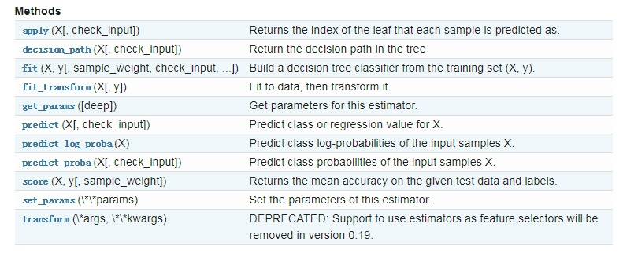](https://cuijiahua.com/wp-content/uploads/2017/11/ml_3_13.jpg)

了解到这些，我们就可以编写代码了。

```python
# -*- coding: UTF-8 -*-
from sklearn import tree

if __name__ == '__main__':
    fr = open('lenses.txt')
    lenses = [inst.strip().split('\t') for inst in fr.readlines()]
    print(lenses)
    lensesLabels = ['age', 'prescript', 'astigmatic', 'tearRate']
    clf = tree.DecisionTreeClassifier()
    lenses = clf.fit(lenses, lensesLabels)
```


运行代码，会得到如下结果：

[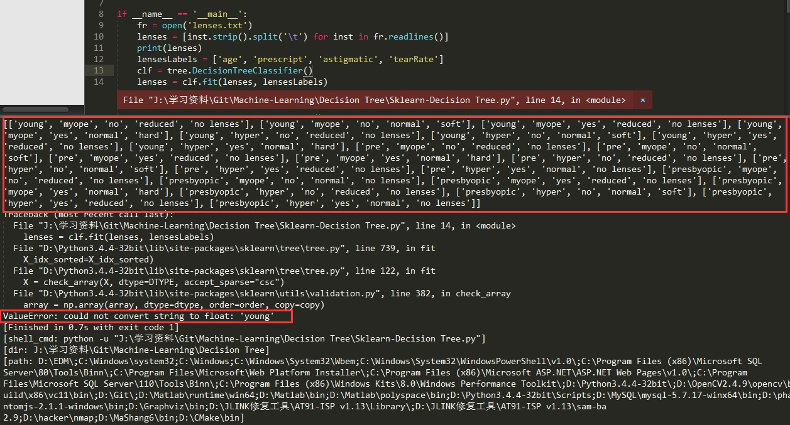](https://cuijiahua.com/wp-content/uploads/2017/11/ml_3_14.jpg)

我们可以看到程序报错了，这是为什么？因为在fit()函数不能接收`string`类型的数据，通过打印的信息可以看到，数据都是`string`类型的。在使用fit()函数之前，我们需要对数据集进行编码，这里可以使用两种方法：

- [LabelEncoder](https://scikit-learn.org/dev/modules/generated/sklearn.preprocessing.LabelEncoder.html) ：将字符串转换为增量值
- [OneHotEncoder](https://scikit-learn.org/dev/modules/generated/sklearn.preprocessing.OneHotEncoder.html#sklearn.preprocessing.OneHotEncoder)：使用One-of-K算法将字符串转换为整数

为了对`string`类型的数据序列化，需要先生成pandas数据，这样方便我们的序列化工作。这里我使用的方法是，原始数据->字典->pandas数据，编写代码如下：

```python
# -*- coding: UTF-8 -*-
import pandas as pd

if __name__ == '__main__':
    with open('lenses.txt', 'r') as fr:                                        #加载文件
        lenses = [inst.strip().split('\t') for inst in fr.readlines()]        #处理文件
    lenses_target = []                                                        #提取每组数据的类别，保存在列表里
    for each in lenses:
        lenses_target.append(each[-1])

    lensesLabels = ['age', 'prescript', 'astigmatic', 'tearRate']            #特征标签       
    lenses_list = []                                                        #保存lenses数据的临时列表
    lenses_dict = {}                                                        #保存lenses数据的字典，用于生成pandas
    for each_label in lensesLabels:                                            #提取信息，生成字典
        for each in lenses:
            lenses_list.append(each[lensesLabels.index(each_label)])
        lenses_dict[each_label] = lenses_list
        lenses_list = []
    print(lenses_dict)                                                        #打印字典信息
    lenses_pd = pd.DataFrame(lenses_dict)                                    #生成pandas.DataFrame
    print(lenses_pd)
```


从运行结果可以看出，顺利生成pandas数据。

[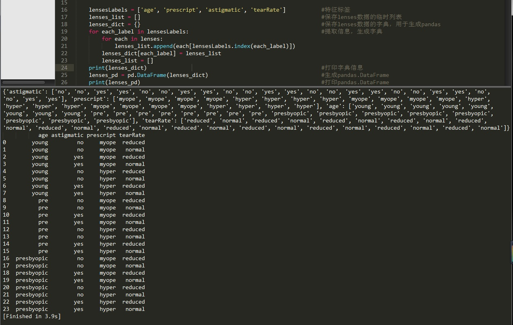](https://cuijiahua.com/wp-content/uploads/2017/11/ml_3_15.jpg)

接下来，将数据序列化，编写代码如下：

```python
# -*- coding: UTF-8 -*-
import pandas as pd
from sklearn.preprocessing import LabelEncoder

import pydotplus
from sklearn.externals.six import StringIO

if __name__ == '__main__':
    with open('lenses.txt', 'r') as fr:                                        #加载文件
        lenses = [inst.strip().split('\t') for inst in fr.readlines()]        #处理文件
    lenses_target = []                                                        #提取每组数据的类别，保存在列表里
    for each in lenses:
        lenses_target.append(each[-1])

    lensesLabels = ['age', 'prescript', 'astigmatic', 'tearRate']            #特征标签       
    lenses_list = []                                                        #保存lenses数据的临时列表
    lenses_dict = {}                                                        #保存lenses数据的字典，用于生成pandas
    for each_label in lensesLabels:                                            #提取信息，生成字典
        for each in lenses:
            lenses_list.append(each[lensesLabels.index(each_label)])
        lenses_dict[each_label] = lenses_list
        lenses_list = []
    # print(lenses_dict)                                                        #打印字典信息
    lenses_pd = pd.DataFrame(lenses_dict)                                    #生成pandas.DataFrame
    print(lenses_pd)                                                        #打印pandas.DataFrame
    le = LabelEncoder()                                                        #创建LabelEncoder()对象，用于序列化            
    for col in lenses_pd.columns:                                            #为每一列序列化
        lenses_pd[col] = le.fit_transform(lenses_pd[col])
    print(lenses_pd)
```


从打印结果可以看到，我们已经将数据顺利序列化，接下来。我们就可以fit()数据，构建决策树了。

[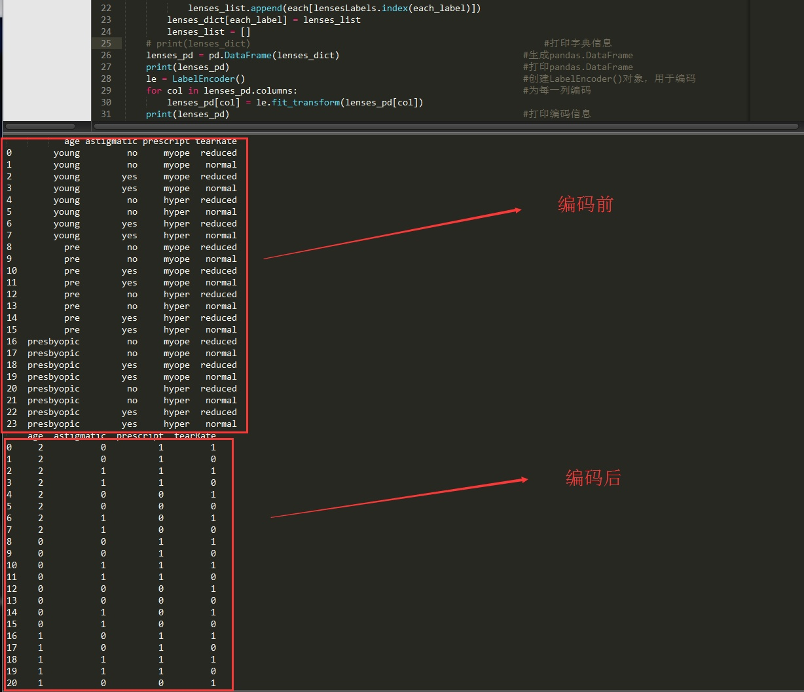](https://cuijiahua.com/wp-content/uploads/2017/11/ml_3_16.jpg)

### 3、使用Graphviz可视化决策树

Graphviz的是AT&T Labs  Research开发的图形绘制工具，他可以很方便的用来绘制结构化的图形网络，支持多种格式输出，生成图片的质量和速度都不错。它的输入是一个用dot语言编写的绘图脚本，通过对输入脚本的解析，分析出其中的点，边以及子图，然后根据属性进行绘制。是使用Sklearn生成的决策树就是dot格式的，因此我们可以直接利用Graphviz将决策树可视化。

在讲解编写代码之前，我们需要安装两样东西，即pydotplus和Grphviz。

**（1）安装Pydotplus**

pydotplus可以在CMD窗口中，直接使用指令安装：

pip3 install pydotplus

**（2）安装Graphviz**

Graphviz不能使用`pip`进行安装，我们需要手动安装，下载地址：[https://www.graphviz.org](https://www.graphviz.org/)

找到相应的版本进行安装即可，不过这个网站的下载速度感人，每秒10k的速度也是没谁了。因此我已经将Graphviz for Windows的版本下载好了，供各位直接下载，这样速度很快，节省各位的时间（密码：b5xz）：

[点击下载](https://pan.baidu.com/s/1LiWGrozTZS-QM62FPyoyRQ)

下载好安装包，进行安装，安装完毕之后，需要设置Graphviz的环境变量。

首先，按快捷键win+r，在出现的运行对话框中输入sysdm.cpl，点击确定，出现如下对话框：

[](https://cuijiahua.com/wp-content/uploads/2017/11/ml_3_17.jpg)

选择高级->环境变量。在系统变量的Path变量中，添加Graphviz的环境变量，比如Graphviz安装在了D盘的根目录，则添加：D:\Graphviz\bin;

[](https://cuijiahua.com/wp-content/uploads/2017/11/ml_3_18.jpg)

添加好环境变量之后，我们就可以正常使用Graphviz了。

**（3）编写代码**

Talk is Cheap, show me the code.(废话少说，放码过来)。可视化部分的代码不难，都是有套路的，直接填参数就好，详细内容可以查看官方教程：[http://scikit-learn.org/stable/modules/tree.html#tree](https://scikit-learn.org/stable/modules/tree.html#tree)

```python
# -*- coding: UTF-8 -*-
from sklearn.preprocessing import LabelEncoder, OneHotEncoder
from sklearn.externals.six import StringIO
from sklearn import tree
import pandas as pd
import numpy as np
import pydotplus

if __name__ == '__main__':
    with open('lenses.txt', 'r') as fr:                                        #加载文件
        lenses = [inst.strip().split('\t') for inst in fr.readlines()]        #处理文件
    lenses_target = []                                                        #提取每组数据的类别，保存在列表里
    for each in lenses:
        lenses_target.append(each[-1])
    print(lenses_target)

    lensesLabels = ['age', 'prescript', 'astigmatic', 'tearRate']            #特征标签       
    lenses_list = []                                                        #保存lenses数据的临时列表
    lenses_dict = {}                                                        #保存lenses数据的字典，用于生成pandas
    for each_label in lensesLabels:                                            #提取信息，生成字典
        for each in lenses:
            lenses_list.append(each[lensesLabels.index(each_label)])
        lenses_dict[each_label] = lenses_list
        lenses_list = []
    # print(lenses_dict)                                                        #打印字典信息
    lenses_pd = pd.DataFrame(lenses_dict)                                    #生成pandas.DataFrame
    # print(lenses_pd)                                                        #打印pandas.DataFrame
    le = LabelEncoder()                                                        #创建LabelEncoder()对象，用于序列化           
    for col in lenses_pd.columns:                                            #序列化
        lenses_pd[col] = le.fit_transform(lenses_pd[col])
    # print(lenses_pd)                                                        #打印编码信息

    clf = tree.DecisionTreeClassifier(max_depth = 4)                        #创建DecisionTreeClassifier()类
    clf = clf.fit(lenses_pd.values.tolist(), lenses_target)                    #使用数据，构建决策树
    dot_data = StringIO()
    tree.export_graphviz(clf, out_file = dot_data,                            #绘制决策树
                        feature_names = lenses_pd.keys(),
                        class_names = clf.classes_,
                        filled=True, rounded=True,
                        special_characters=True)
    graph = pydotplus.graph_from_dot_data(dot_data.getvalue())
    graph.write_pdf("tree.pdf")                                                #保存绘制好的决策树，以PDF的形式存储。
```


运行代码，在该python文件保存的相同目录下，会生成一个名为tree的PDF文件，打开文件，我们就可以看到决策树的可视化效果图了。

[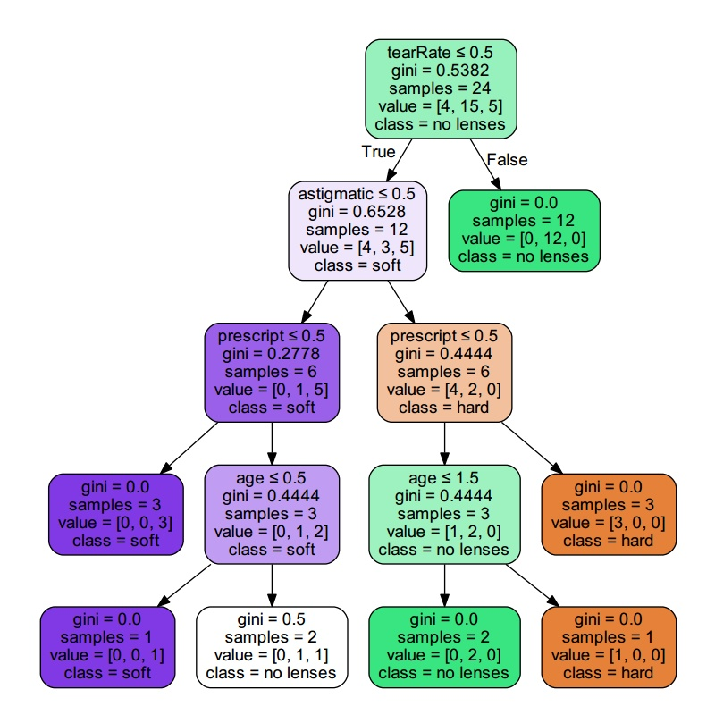](https://cuijiahua.com/wp-content/uploads/2017/11/ml_3_19.jpg)

确定好决策树之后，我们就可以做预测了。可以根据自己的眼睛情况和年龄等特征，看一看自己适合何种材质的隐形眼镜。使用如下代码就可以看到预测结果：

print(clf.predict([[1,1,1,0]]))                    #预测

代码简单，官方手册都有，就不全贴出来了。

本来是想继续讨论决策树的过拟合问题，但是看到《机器学习实战》将此部分内容放到了第九章，那我也放在后面好了。

## 七、总结

**决策树的一些优点：**

- 易于理解和解释。决策树可以可视化。
- 几乎不需要数据预处理。其他方法经常需要数据标准化，创建虚拟变量和删除缺失值。决策树还不支持缺失值。
- 使用树的花费（例如预测数据）是训练数据点(data points)数量的对数。
- 可以同时处理数值变量和分类变量。其他方法大都适用于分析一种变量的集合。
- 可以处理多值输出变量问题。
- 使用白盒模型。如果一个情况被观察到，使用逻辑判断容易表示这种规则。相反，如果是黑盒模型（例如人工神经网络），结果会非常难解释。
- 即使对真实模型来说，假设无效的情况下，也可以较好的适用。

**决策树的一些缺点：**

- 决策树学习可能创建一个过于复杂的树，并不能很好的预测数据。也就是过拟合。修剪机制（现在不支持），设置一个叶子节点需要的最小样本数量，或者数的最大深度，可以避免过拟合。
- 决策树可能是不稳定的，因为即使非常小的变异，可能会产生一颗完全不同的树。这个问题通过decision trees with an ensemble来缓解。
- 概念难以学习，因为决策树没有很好的解释他们，例如，XOR, parity or multiplexer problems。
- 如果某些分类占优势，决策树将会创建一棵有偏差的树。因此，建议在训练之前，先抽样使样本均衡。