## 一、前言

朴素贝叶斯算法是有监督的学习算法，解决的是分类问题，如客户是否流失、是否值得投资、信用等级评定等多分类问题。**该算法的优点在于简单易懂、学习效率高、在某些领域的分类问题中能够与决策树、神经网络相媲美。**但由于该算法以自变量之间的独立（条件特征独立）性和连续变量的正态性假设为前提，就会导致算法精度在某种程度上受影响。

 

本篇文章将从朴素贝叶斯推断原理开始讲起，通过实例进行辅助讲解。最后，使用Python3编程实现一个简单的言论过滤器。

[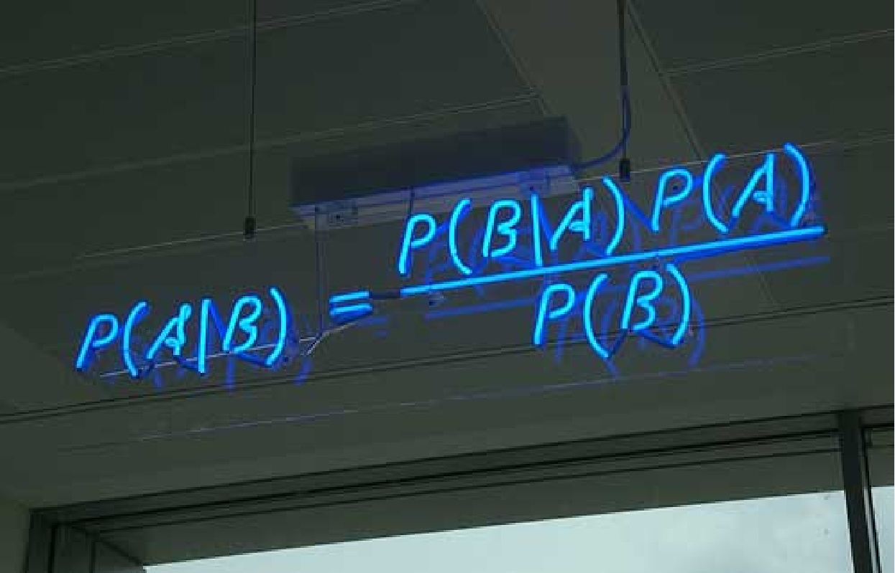](https://cuijiahua.com/wp-content/uploads/2017/11/ml_4_1.jpg)

## 二、朴素贝叶斯理论

朴素贝叶斯是贝叶斯决策理论的一部分，所以在讲述朴素贝叶斯之前有必要快速了解一下贝叶斯决策理论。

### 1、贝叶斯决策理论

假设现在我们有一个数据集，它由两类数据组成，数据分布如下图所示：

[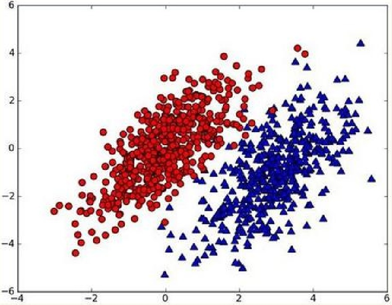](https://cuijiahua.com/wp-content/uploads/2017/11/ml_4_2.jpg)

我们现在用p1(x,y)表示数据点(x,y)属于类别1(图中红色圆点表示的类别)的概率，用p2(x,y)表示数据点(x,y)属于类别2(图中蓝色三角形表示的类别)的概率，那么对于一个新数据点(x,y)，可以用下面的规则来判断它的类别：

- 如果p1(x,y)>p2(x,y)，那么类别为1
- 如果p1(x,y)<p2(x,y)，那么类别为2

也就是说，我们会选择高概率对应的类别。这就是贝叶斯决策理论的核心思想，即选择具有最高概率的决策。已经了解了贝叶斯决策理论的核心思想，那么接下来，就是学习如何计算p1和p2概率。

### 2、条件概率

在学习计算p1 和p2概率之前，我们需要了解什么是条件概率(Conditional probability)，就是指在事件B发生的情况下，事件A发生的概率，用P(A|B)来表示。

[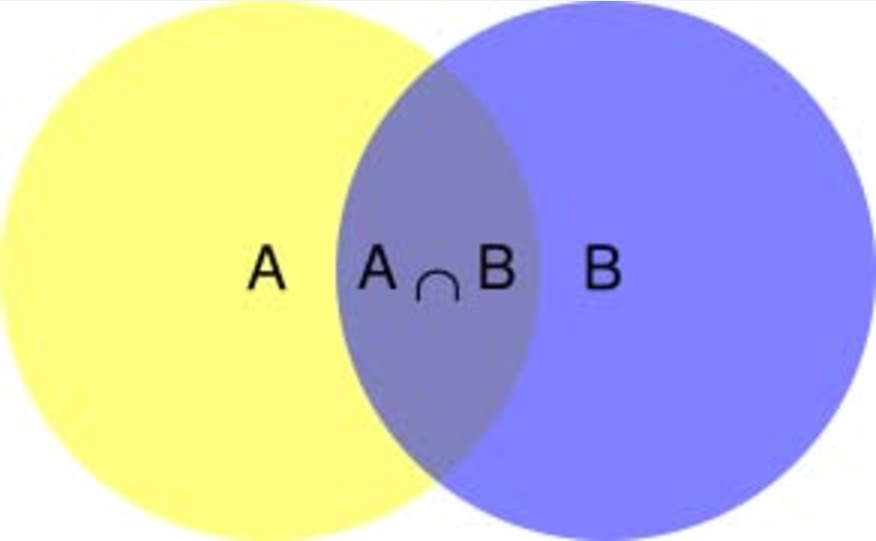](https://cuijiahua.com/wp-content/uploads/2017/11/ml_4_3.jpg)

根据文氏图，可以很清楚地看到在事件B发生的情况下，事件A发生的概率就是P(A∩B)除以P(B)。

[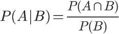](https://cuijiahua.com/wp-content/uploads/2017/11/ml_4_4.jpg)

因此，

[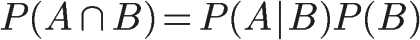](https://cuijiahua.com/wp-content/uploads/2017/11/ml_4_5.jpg)

同理可得，

[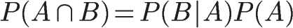](https://cuijiahua.com/wp-content/uploads/2017/11/ml_4_6.jpg)

所以，

[](https://cuijiahua.com/wp-content/uploads/2017/11/ml_4_7.jpg)

即

[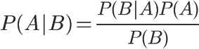](https://cuijiahua.com/wp-content/uploads/2017/11/ml_4_8.jpg)

这就是条件概率的计算公式。

### 3、全概率公式

除了条件概率以外，在计算p1和p2的时候，还要用到全概率公式，因此，这里继续推导全概率公式。

假定样本空间S，是两个事件A与A'的和。

[](https://cuijiahua.com/wp-content/uploads/2017/11/ml_4_9.jpg)

上图中，红色部分是事件A，绿色部分是事件A'，它们共同构成了样本空间S。

在这种情况下，事件B可以划分成两个部分。

[](https://cuijiahua.com/wp-content/uploads/2017/11/ml_4_10.jpg)

即

[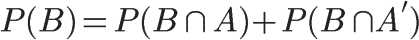](https://cuijiahua.com/wp-content/uploads/2017/11/ml_4_11.jpg)

在上一节的推导当中，我们已知

[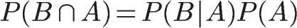](https://cuijiahua.com/wp-content/uploads/2017/11/ml_4_12.jpg)

所以，

[](https://cuijiahua.com/wp-content/uploads/2017/11/ml_4_13.jpg)

这就是全概率公式。它的含义是，如果A和A'构成样本空间的一个划分，那么事件B的概率，就等于A和A'的概率分别乘以B对这两个事件的条件概率之和。

将这个公式代入上一节的条件概率公式，就得到了条件概率的另一种写法：

[](https://cuijiahua.com/wp-content/uploads/2017/11/ml_4_14.jpg)

### 4、贝叶斯推断

对条件概率公式进行变形，可以得到如下形式：

[](https://cuijiahua.com/wp-content/uploads/2017/11/ml_4_15.jpg)

**我们把P(A)称为"先验概率"（Prior probability）**，即在B事件发生之前，我们对A事件概率的一个判断。

**P(A|B)称为"后验概率"（Posterior probability）**，即在B事件发生之后，我们对A事件概率的重新评估。

**P(B|A)/P(B)称为"可能性函数"（Likelyhood）**，这是一个调整因子，使得预估概率更接近真实概率。

所以，条件概率可以理解成下面的式子：

后验概率　＝　先验概率 ｘ 调整因子

| 1    | 后验概率　＝　先验概率 ｘ 调整因子 |
| ---- | ---------------------------------- |
|      |                                    |

**这就是贝叶斯推断的含义。我们先预估一个"先验概率"，然后加入实验结果，看这个实验到底是增强还是削弱了"先验概率"，由此得到更接近事实的"后验概率"。**

在这里，如果"可能性函数"P(B|A)/P(B)>1，意味着"先验概率"被增强，事件A的发生的可能性变大；如果"可能性函数"=1，意味着B事件无助于判断事件A的可能性；如果"可能性函数"<1，意味着"先验概率"被削弱，事件A的可能性变小。

为了加深对贝叶斯推断的理解，我们举一个例子。

[](https://cuijiahua.com/wp-content/uploads/2017/11/ml_4_16.jpg)

两个一模一样的碗，一号碗有30颗水果糖和10颗巧克力糖，二号碗有水果糖和巧克力糖各20颗。现在随机选择一个碗，从中摸出一颗糖，发现是水果糖。请问这颗水果糖来自一号碗的概率有多大？

我们假定，H1表示一号碗，H2表示二号碗。由于这两个碗是一样的，所以P(H1)=P(H2)，也就是说，在取出水果糖之前，这两个碗被选中的概率相同。因此，P(H1)=0.5，我们把这个概率就叫做"先验概率"，即没有做实验之前，来自一号碗的概率是0.5。

再假定，E表示水果糖，所以问题就变成了在已知E的情况下，来自一号碗的概率有多大，即求P(H1|E)。我们把这个概率叫做"后验概率"，即在E事件发生之后，对P(H1)的修正。

根据条件概率公式，得到

[](https://cuijiahua.com/wp-content/uploads/2017/11/ml_4_17.jpg)

已知，P(H1)等于0.5，P(E|H1)为一号碗中取出水果糖的概率，等于30÷(30+10)=0.75，那么求出P(E)就可以得到答案。根据全概率公式，

[](https://cuijiahua.com/wp-content/uploads/2017/11/ml_4_18.jpg)

所以，

[](https://cuijiahua.com/wp-content/uploads/2017/11/ml_4_19.jpg)

将数字代入原方程，得到

[](https://cuijiahua.com/wp-content/uploads/2017/11/ml_4_20.jpg)

这表明，来自一号碗的概率是0.6。也就是说，取出水果糖之后，H1事件的可能性得到了增强。

**同时再思考一个问题，在使用该算法的时候，如果不需要知道具体的类别概率，即上面P(H1|E)=0.6，只需要知道所属类别，即来自一号碗，我们有必要计算P(E)这个全概率吗？要知道我们只需要比较  P(H1|E)和P(H2|E)的大小，找到那个最大的概率就可以。既然如此，两者的分母都是相同的，那我们只需要比较分子即可。即比较P(E|H1)P(H1)和P(E|H2)P(H2)的大小，所以为了减少计算量，全概率公式在实际编程中可以不使用。**

### 5、朴素贝叶斯推断

理解了贝叶斯推断，那么让我们继续看看朴素贝叶斯。贝叶斯和朴素贝叶斯的概念是不同的，区别就在于“朴素”二字，朴素贝叶斯对条件个概率分布做了条件独立性的假设。 比如下面的公式，假设有n个特征：

[](https://cuijiahua.com/wp-content/uploads/2017/11/ml_4_21.jpg)

由于每个特征都是独立的，我们可以进一步拆分公式 ：

[](https://cuijiahua.com/wp-content/uploads/2017/11/ml_4_22.jpg)

这样我们就可以进行计算了。如果有些迷糊，让我们从一个例子开始讲起，你会看到贝叶斯分类器很好懂，一点都不难。

某个医院早上来了六个门诊的病人，他们的情况如下表所示：

[](https://cuijiahua.com/wp-content/uploads/2017/11/ml_4_23.jpg)

现在又来了第七个病人，是一个打喷嚏的建筑工人。请问他患上感冒的概率有多大？

根据贝叶斯定理：

[](https://cuijiahua.com/wp-content/uploads/2017/11/ml_4_24.jpg)

可得：

[](https://cuijiahua.com/wp-content/uploads/2017/11/ml_4_28.png)

根据朴素贝叶斯条件独立性的假设可知，"打喷嚏"和"建筑工人"这两个特征是独立的，因此，上面的等式就变成了

[](https://cuijiahua.com/wp-content/uploads/2017/11/ml_4_29.jpg)

这里可以计算：

[](https://cuijiahua.com/wp-content/uploads/2017/11/ml_4_30.jpg)

因此，这个打喷嚏的建筑工人，有66%的概率是得了感冒。同理，可以计算这个病人患上过敏或脑震荡的概率。比较这几个概率，就可以知道他最可能得什么病。

这就是贝叶斯分类器的基本方法：在统计资料的基础上，依据某些特征，计算各个类别的概率，从而实现分类。

**同样，在编程的时候，如果不需要求出所属类别的具体概率，P(打喷嚏) = 0.5和P(建筑工人) = 0.33的概率是可以不用求的。**

## 三、动手实战

说了这么多，没点实践编程怎么行？

以在线社区留言为例。为了不影响社区的发展，我们要屏蔽侮辱性的言论，所以要构建一个快速过滤器，如果某条留言使用了负面或者侮辱性的语言，那么就将该留言标志为内容不当。过滤这类内容是一个很常见的需求。对此问题建立两个类型：侮辱类和非侮辱类，使用1和0分别表示。

我们把文本看成单词向量或者词条向量，也就是说将句子转换为向量。考虑出现所有文档中的单词，再决定将哪些单词纳入词汇表或者说所要的词汇集合，然后必须要将每一篇文档转换为词汇表上的向量。简单起见，我们先假设已经将本文切分完毕，存放到列表中，并对词汇向量进行分类标注。编写代码如下：


Python

```python
# -*- coding: UTF-8 -*-

"""
函数说明:创建实验样本

Parameters:
    无
Returns:
    postingList - 实验样本切分的词条
    classVec - 类别标签向量
Author:
    Jack Cui
Blog:
    http://blog.csdn.net/c406495762
Modify:
    2017-08-11
"""
def loadDataSet():
    postingList=[['my', 'dog', 'has', 'flea', 'problems', 'help', 'please'],                #切分的词条
                 ['maybe', 'not', 'take', 'him', 'to', 'dog', 'park', 'stupid'],
                 ['my', 'dalmation', 'is', 'so', 'cute', 'I', 'love', 'him'],
                 ['stop', 'posting', 'stupid', 'worthless', 'garbage'],
                 ['mr', 'licks', 'ate', 'my', 'steak', 'how', 'to', 'stop', 'him'],
                 ['quit', 'buying', 'worthless', 'dog', 'food', 'stupid']]
    classVec = [0,1,0,1,0,1]                                                                   #类别标签向量，1代表侮辱性词汇，0代表不是
    return postingList,classVec

if __name__ == '__main__':
    postingLIst, classVec = loadDataSet()
    for each in postingLIst:
        print(each)
    print(classVec)
```

从运行结果可以看出，我们已经将postingList是存放词条列表中，classVec是存放每个词条的所属类别，1代表侮辱类 ，0代表非侮辱类。

[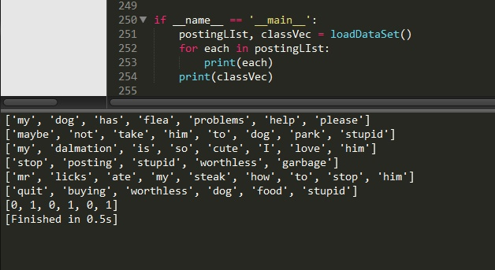](https://cuijiahua.com/wp-content/uploads/2017/11/ml_4_31.jpg)

继续编写代码，前面我们已经说过我们要先创建一个词汇表，并将切分好的词条转换为词条向量。

```python
# -*- coding: UTF-8 -*-

"""
函数说明:创建实验样本

Parameters:
    无
Returns:
    postingList - 实验样本切分的词条
    classVec - 类别标签向量
Author:
    Jack Cui
Blog:
    http://blog.csdn.net/c406495762
Modify:
    2017-08-11
"""
def loadDataSet():
    postingList=[['my', 'dog', 'has', 'flea', 'problems', 'help', 'please'],                #切分的词条
                 ['maybe', 'not', 'take', 'him', 'to', 'dog', 'park', 'stupid'],
                 ['my', 'dalmation', 'is', 'so', 'cute', 'I', 'love', 'him'],
                 ['stop', 'posting', 'stupid', 'worthless', 'garbage'],
                 ['mr', 'licks', 'ate', 'my', 'steak', 'how', 'to', 'stop', 'him'],
                 ['quit', 'buying', 'worthless', 'dog', 'food', 'stupid']]
    classVec = [0,1,0,1,0,1]                                                                   #类别标签向量，1代表侮辱性词汇，0代表不是
    return postingList,classVec

"""
函数说明:根据vocabList词汇表，将inputSet向量化，向量的每个元素为1或0

Parameters:
    vocabList - createVocabList返回的列表
    inputSet - 切分的词条列表
Returns:
    returnVec - 文档向量,词集模型
Author:
    Jack Cui
Blog:
    http://blog.csdn.net/c406495762
Modify:
    2017-08-11
"""
def setOfWords2Vec(vocabList, inputSet):
    returnVec = [0] * len(vocabList)                                    #创建一个其中所含元素都为0的向量
    for word in inputSet:                                                #遍历每个词条
        if word in vocabList:                                            #如果词条存在于词汇表中，则置1
            returnVec[vocabList.index(word)] = 1
        else: print("the word: %s is not in my Vocabulary!" % word)
    return returnVec                                                    #返回文档向量

"""
函数说明:将切分的实验样本词条整理成不重复的词条列表，也就是词汇表

Parameters:
    dataSet - 整理的样本数据集
Returns:
    vocabSet - 返回不重复的词条列表，也就是词汇表
Author:
    Jack Cui
Blog:
    http://blog.csdn.net/c406495762
Modify:
    2017-08-11
"""
def createVocabList(dataSet):
    vocabSet = set([])                      #创建一个空的不重复列表
    for document in dataSet:               
        vocabSet = vocabSet | set(document) #取并集
    return list(vocabSet)

if __name__ == '__main__':
    postingList, classVec = loadDataSet()
    print('postingList:\n',postingList)
    myVocabList = createVocabList(postingList)
    print('myVocabList:\n',myVocabList)
    trainMat = []
    for postinDoc in postingList:
        trainMat.append(setOfWords2Vec(myVocabList, postinDoc))
    print('trainMat:\n', trainMat)
```

List是所有单词出现的集合，没有重复的元素。词汇表是用来干什么的？没错，它是用来将词条向量化的，一个单词在词汇表中出现过一次，那么就在相应位置记作1，如果没有出现就在相应位置记作0。trainMat是所有的词条向量组成的列表。它里面存放的是根据myVocabList向量化的词条向量。

[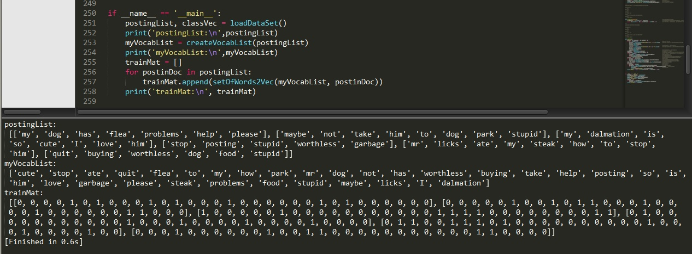](https://cuijiahua.com/wp-content/uploads/2017/11/ml_4_32.jpg)

我们已经得到了词条向量。接下来，我们就可以通过词条向量训练朴素贝叶斯分类器。

```python
# -*- coding: UTF-8 -*-
import numpy as np

"""
函数说明:创建实验样本

Parameters:
    无
Returns:
    postingList - 实验样本切分的词条
    classVec - 类别标签向量
Author:
    Jack Cui
Blog:
    http://blog.csdn.net/c406495762
Modify:
    2017-08-11
"""
def loadDataSet():
    postingList=[['my', 'dog', 'has', 'flea', 'problems', 'help', 'please'],                #切分的词条
                 ['maybe', 'not', 'take', 'him', 'to', 'dog', 'park', 'stupid'],
                 ['my', 'dalmation', 'is', 'so', 'cute', 'I', 'love', 'him'],
                 ['stop', 'posting', 'stupid', 'worthless', 'garbage'],
                 ['mr', 'licks', 'ate', 'my', 'steak', 'how', 'to', 'stop', 'him'],
                 ['quit', 'buying', 'worthless', 'dog', 'food', 'stupid']]
    classVec = [0,1,0,1,0,1]                                                                   #类别标签向量，1代表侮辱性词汇，0代表不是
    return postingList,classVec

"""
函数说明:根据vocabList词汇表，将inputSet向量化，向量的每个元素为1或0

Parameters:
    vocabList - createVocabList返回的列表
    inputSet - 切分的词条列表
Returns:
    returnVec - 文档向量,词集模型
Author:
    Jack Cui
Blog:
    http://blog.csdn.net/c406495762
Modify:
    2017-08-11
"""
def setOfWords2Vec(vocabList, inputSet):
    returnVec = [0] * len(vocabList)                                    #创建一个其中所含元素都为0的向量
    for word in inputSet:                                                #遍历每个词条
        if word in vocabList:                                            #如果词条存在于词汇表中，则置1
            returnVec[vocabList.index(word)] = 1
        else: print("the word: %s is not in my Vocabulary!" % word)
    return returnVec                                                    #返回文档向量

"""
函数说明:将切分的实验样本词条整理成不重复的词条列表，也就是词汇表

Parameters:
    dataSet - 整理的样本数据集
Returns:
    vocabSet - 返回不重复的词条列表，也就是词汇表
Author:
    Jack Cui
Blog:
    http://blog.csdn.net/c406495762
Modify:
    2017-08-11
"""
def createVocabList(dataSet):
    vocabSet = set([])                      #创建一个空的不重复列表
    for document in dataSet:
        vocabSet = vocabSet | set(document) #取并集
    return list(vocabSet)

"""
函数说明:朴素贝叶斯分类器训练函数

Parameters:
    trainMatrix - 训练文档矩阵，即setOfWords2Vec返回的returnVec构成的矩阵
    trainCategory - 训练类别标签向量，即loadDataSet返回的classVec
Returns:
    p0Vect - 非侮辱类的条件概率数组
    p1Vect - 侮辱类的条件概率数组
    pAbusive - 文档属于侮辱类的概率
Author:
    Jack Cui
Blog:
    http://blog.csdn.net/c406495762
Modify:
    2017-08-12
"""
def trainNB0(trainMatrix,trainCategory):
    numTrainDocs = len(trainMatrix)                            #计算训练的文档数目
    numWords = len(trainMatrix[0])                            #计算每篇文档的词条数
    pAbusive = sum(trainCategory)/float(numTrainDocs)        #文档属于侮辱类的概率
    p0Num = np.zeros(numWords); p1Num = np.zeros(numWords)    #创建numpy.zeros数组,词条出现数初始化为0
    p0Denom = 0.0; p1Denom = 0.0                            #分母初始化为0
    for i in range(numTrainDocs):
        if trainCategory[i] == 1:                            #统计属于侮辱类的条件概率所需的数据，即P(w0|1),P(w1|1),P(w2|1)···
            p1Num += trainMatrix[i]
            p1Denom += sum(trainMatrix[i])
        else:                                                #统计属于非侮辱类的条件概率所需的数据，即P(w0|0),P(w1|0),P(w2|0)···
            p0Num += trainMatrix[i]
            p0Denom += sum(trainMatrix[i])
    p1Vect = p1Num/p1Denom                                      
    p0Vect = p0Num/p0Denom         
    return p0Vect,p1Vect,pAbusive                            #返回属于侮辱类的条件概率数组，属于非侮辱类的条件概率数组，文档属于侮辱类的概率

if __name__ == '__main__':
    postingList, classVec = loadDataSet()
    myVocabList = createVocabList(postingList)
    print('myVocabList:\n', myVocabList)
    trainMat = []
    for postinDoc in postingList:
        trainMat.append(setOfWords2Vec(myVocabList, postinDoc))
    p0V, p1V, pAb = trainNB0(trainMat, classVec)
    print('p0V:\n', p0V)
    print('p1V:\n', p1V)
    print('classVec:\n', classVec)
    print('pAb:\n', pAb)
```

运行结果如下，p0V存放的是每个单词属于类别0，也就是非侮辱类词汇的概率。比如p0V的倒数第6个概率，就是stupid这个单词属于非侮辱类的概率为0。同理，p1V的倒数第6个概率，就是stupid这个单词属于侮辱类的概率为0.15789474，也就是约等于15.79%的概率。我们知道stupid的中文意思是蠢货，难听点的叫法就是傻逼。显而易见，这个单词属于侮辱类。pAb是所有侮辱类的样本占所有样本的概率，从classVec中可以看出，一用有3个侮辱类，3个非侮辱类。所以侮辱类的概率是0.5。因此p0V存放的就是P(him | 非侮辱类) = 0.0833，P(is | 非侮辱类) = 0.0417，一直到P(dog | 非侮辱类) =  0.0417，这些单词的条件概率。同理，p1V存放的就是各个单词属于侮辱类的条件概率。pAb就是先验概率。

[](https://cuijiahua.com/wp-content/uploads/2017/11/ml_4_33.jpg)

已经训练好分类器，接下来，使用分类器进行分类。


```python
# -*- coding: UTF-8 -*-
import numpy as np
from functools import reduce

"""
函数说明:创建实验样本

Parameters:
	无
Returns:
	postingList - 实验样本切分的词条
	classVec - 类别标签向量
Author:
	Jack Cui
Blog:
	http://blog.csdn.net/c406495762
Modify:
	2017-08-11
"""
def loadDataSet():
	postingList=[['my', 'dog', 'has', 'flea', 'problems', 'help', 'please'],				#切分的词条
				['maybe', 'not', 'take', 'him', 'to', 'dog', 'park', 'stupid'],
				['my', 'dalmation', 'is', 'so', 'cute', 'I', 'love', 'him'],
				['stop', 'posting', 'stupid', 'worthless', 'garbage'],
				['mr', 'licks', 'ate', 'my', 'steak', 'how', 'to', 'stop', 'him'],
				['quit', 'buying', 'worthless', 'dog', 'food', 'stupid']]
	classVec = [0,1,0,1,0,1]   																#类别标签向量，1代表侮辱性词汇，0代表不是
	return postingList,classVec																#返回实验样本切分的词条和类别标签向量

"""
函数说明:将切分的实验样本词条整理成不重复的词条列表，也就是词汇表

Parameters:
	dataSet - 整理的样本数据集
Returns:
	vocabSet - 返回不重复的词条列表，也就是词汇表
Author:
	Jack Cui
Blog:
	http://blog.csdn.net/c406495762
Modify:
	2017-08-11
"""
def createVocabList(dataSet):
	vocabSet = set([])  					#创建一个空的不重复列表
	for document in dataSet:				
		vocabSet = vocabSet | set(document) #取并集
	return list(vocabSet)

"""
函数说明:根据vocabList词汇表，将inputSet向量化，向量的每个元素为1或0

Parameters:
	vocabList - createVocabList返回的列表
	inputSet - 切分的词条列表
Returns:
	returnVec - 文档向量,词集模型
Author:
	Jack Cui
Blog:
	http://blog.csdn.net/c406495762
Modify:
	2017-08-11
"""
def setOfWords2Vec(vocabList, inputSet):
	returnVec = [0] * len(vocabList)									#创建一个其中所含元素都为0的向量
	for word in inputSet:												#遍历每个词条
		if word in vocabList:											#如果词条存在于词汇表中，则置1
			returnVec[vocabList.index(word)] = 1
		else: print("the word: %s is not in my Vocabulary!" % word)
	return returnVec													#返回文档向量


"""
函数说明:朴素贝叶斯分类器训练函数

Parameters:
	trainMatrix - 训练文档矩阵，即setOfWords2Vec返回的returnVec构成的矩阵
	trainCategory - 训练类别标签向量，即loadDataSet返回的classVec
Returns:
	p0Vect - 非侮辱类的条件概率数组
	p1Vect - 侮辱类的条件概率数组
	pAbusive - 文档属于侮辱类的概率
Author:
	Jack Cui
Blog:
	http://blog.csdn.net/c406495762
Modify:
	2017-08-12
"""
def trainNB0(trainMatrix,trainCategory):
	numTrainDocs = len(trainMatrix)							#计算训练的文档数目
	numWords = len(trainMatrix[0])							#计算每篇文档的词条数
	pAbusive = sum(trainCategory)/float(numTrainDocs)		#文档属于侮辱类的概率
	p0Num = np.zeros(numWords); p1Num = np.zeros(numWords)	#创建numpy.zeros数组,
	p0Denom = 0.0; p1Denom = 0.0                        	#分母初始化为0.0
	for i in range(numTrainDocs):
		if trainCategory[i] == 1:							#统计属于侮辱类的条件概率所需的数据，即P(w0|1),P(w1|1),P(w2|1)···
			p1Num += trainMatrix[i]
			p1Denom += sum(trainMatrix[i])
		else:												#统计属于非侮辱类的条件概率所需的数据，即P(w0|0),P(w1|0),P(w2|0)···
			p0Num += trainMatrix[i]
			p0Denom += sum(trainMatrix[i])
	p1Vect = p1Num/p1Denom									#相除        
	p0Vect = p0Num/p0Denom          
	return p0Vect,p1Vect,pAbusive							#返回属于侮辱类的条件概率数组，属于非侮辱类的条件概率数组，文档属于侮辱类的概率

"""
函数说明:朴素贝叶斯分类器分类函数

Parameters:
	vec2Classify - 待分类的词条数组
	p0Vec - 侮辱类的条件概率数组
	p1Vec -非侮辱类的条件概率数组
	pClass1 - 文档属于侮辱类的概率
Returns:
	0 - 属于非侮辱类
	1 - 属于侮辱类
Author:
	Jack Cui
Blog:
	http://blog.csdn.net/c406495762
Modify:
	2017-08-12
"""
def classifyNB(vec2Classify, p0Vec, p1Vec, pClass1):
	p1 = reduce(lambda x,y:x*y, vec2Classify * p1Vec) * pClass1    			#对应元素相乘
	p0 = reduce(lambda x,y:x*y, vec2Classify * p0Vec) * (1.0 - pClass1)
	print('p0:',p0)
	print('p1:',p1)
	if p1 > p0:
		return 1
	else: 
		return 0

"""
函数说明:测试朴素贝叶斯分类器

Parameters:
	无
Returns:
	无
Author:
	Jack Cui
Blog:
	http://blog.csdn.net/c406495762
Modify:
	2017-08-12
"""
def testingNB():
	listOPosts,listClasses = loadDataSet()									#创建实验样本
	myVocabList = createVocabList(listOPosts)								#创建词汇表
	trainMat=[]
	for postinDoc in listOPosts:
		trainMat.append(setOfWords2Vec(myVocabList, postinDoc))				#将实验样本向量化
	p0V,p1V,pAb = trainNB0(np.array(trainMat),np.array(listClasses))		#训练朴素贝叶斯分类器
	testEntry = ['love', 'my', 'dalmation']									#测试样本1
	thisDoc = np.array(setOfWords2Vec(myVocabList, testEntry))				#测试样本向量化
	if classifyNB(thisDoc,p0V,p1V,pAb):
		print(testEntry,'属于侮辱类')										#执行分类并打印分类结果
	else:
		print(testEntry,'属于非侮辱类')										#执行分类并打印分类结果
	testEntry = ['stupid', 'garbage']										#测试样本2

	thisDoc = np.array(setOfWords2Vec(myVocabList, testEntry))				#测试样本向量化
	if classifyNB(thisDoc,p0V,p1V,pAb):
		print(testEntry,'属于侮辱类')										#执行分类并打印分类结果
	else:
		print(testEntry,'属于非侮辱类')										#执行分类并打印分类结果

if __name__ == '__main__':
	testingNB()
```

我们测试了两个词条，在使用分类器前，也需要对词条向量化，然后使用classifyNB()函数，用朴素贝叶斯公式，计算词条向量属于侮辱类和非侮辱类的概率。运行结果如下：

[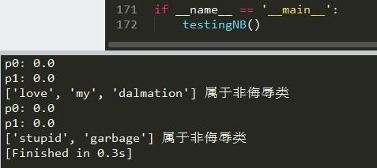](https://cuijiahua.com/wp-content/uploads/2017/11/ml_4_34.jpg)

你会发现，这样写的算法无法进行分类，p0和p1的计算结果都是0，显然结果错误。这是为什么呢？下一篇文章继续讲解~

## 四、总结

**朴素贝叶斯推断的一些优点：**

- 生成式模型，通过计算概率来进行分类，可以用来处理多分类问题。
- 对小规模的数据表现很好，适合多分类任务，适合增量式训练，算法也比较简单。

**朴素贝叶斯推断的一些缺点：**

- 对输入数据的表达形式很敏感。
- 由于朴素贝叶斯的“朴素”特点，所以会带来一些准确率上的损失。
- 需要计算先验概率，分类决策存在错误率。

**其它：**

- 本文中的编程实例，存在一定的问题，需要进行改进，下篇文章会讲解改进方法；
- 同时，本文中的编程实例，没有进行前期的文本切分，下一篇文章会讲解英文单词和中文单词的切分方法；
- 下篇文章将使用sklearn进行中文实例练习；
- 朴素贝叶斯的准确率，其实是比较依赖于训练语料的，[机器学习](https://cuijiahua.com/blog/tag/机器学习/)算法就和纯洁的小孩一样，取决于其成长（训练）条件，"吃的是草挤的是奶"，但"不是所有的牛奶，都叫特仑苏"。
- 参考文献：http://www.ruanyifeng.com/blog/2013/12/naive_bayes_classifier.html
- 如有问题，请留言。如有错误，还望指正，谢谢！