## 一、前言

上篇文章[机器学习实战教程（四）：朴素贝叶斯基础篇之言论过滤器](https://www.cuijiahua.com/blog/2017/11/ml_4_bayes_1.html)讲解了朴素贝叶斯的基础知识。本篇文章将在此基础上进行扩展，你将看到以下内容：

- 拉普拉斯平滑
- 垃圾邮件过滤(Python3)
- 新浪新闻分类([sklearn](https://cuijiahua.com/blog/tag/sklearn/))

## 二、朴素贝叶斯改进之拉普拉斯平滑

上篇文章提到过，算法存在一定的问题，需要进行改进。那么需要改进的地方在哪里呢？利用贝叶斯分类器对文档进行分类时，要计算多个概率的乘积以获得文档属于某个类别的概率，即计算p(w0|1)p(w1|1)p(w2|1)。如果其中有一个概率值为0，那么最后的成绩也为0。我们拿出上一篇文章的截图。

[](https://cuijiahua.com/wp-content/uploads/2017/11/ml_5_1.jpg)

从上图可以看出，在计算的时候已经出现了概率为0的情况。如果新实例文本，包含这种概率为0的分词，那么最终的文本属于某个类别的概率也就是0了。显然，这样是不合理的，为了降低这种影响，可以将所有词的出现数初始化为1，并将分母初始化为2。这种做法就叫做拉普拉斯平滑(Laplace Smoothing)又被称为加1平滑，是比较常用的平滑方法，它就是为了解决0概率问题。

除此之外，另外一个遇到的问题就是下溢出，这是由于太多很小的数相乘造成的。学过数学的人都知道，两个小数相乘，越乘越小，这样就造成了下溢出。在程序中，在相应小数位置进行四舍五入，计算结果可能就变成0了。为了解决这个问题，对乘积结果取自然对数。通过求对数可以避免下溢出或者浮点数舍入导致的错误。同时，采用自然对数进行处理不会有任何损失。下图给出函数f(x)和ln(f(x))的曲线。

[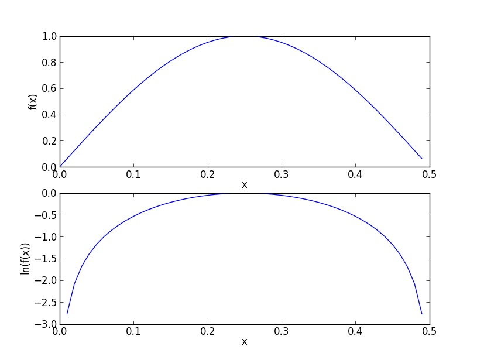](https://cuijiahua.com/wp-content/uploads/2017/11/ml_5_2.jpg)

检查这两条曲线，就会发现它们在相同区域内同时增加或者减少，并且在相同点上取到极值。它们的取值虽然不同，但不影响最终结果。因此我们可以对上篇文章的trainNB0(trainMatrix, trainCategory)函数进行更改，修改如下：

```python
"""
函数说明:朴素贝叶斯分类器训练函数

Parameters:
    trainMatrix - 训练文档矩阵，即setOfWords2Vec返回的returnVec构成的矩阵
    trainCategory - 训练类别标签向量，即loadDataSet返回的classVec
Returns:
    p0Vect - 非侮辱类的条件概率数组
    p1Vect - 侮辱类的条件概率数组
    pAbusive - 文档属于侮辱类的概率
Author:
    Jack Cui
Blog:
    http://blog.csdn.net/c406495762
Modify:
    2017-08-12
"""
def trainNB0(trainMatrix,trainCategory):
    numTrainDocs = len(trainMatrix)                            #计算训练的文档数目
    numWords = len(trainMatrix[0])                            #计算每篇文档的词条数
    pAbusive = sum(trainCategory)/float(numTrainDocs)        #文档属于侮辱类的概率
    p0Num = np.ones(numWords); p1Num = np.ones(numWords)    #创建numpy.ones数组,词条出现数初始化为1，拉普拉斯平滑
    p0Denom = 2.0; p1Denom = 2.0                            #分母初始化为2,拉普拉斯平滑
    for i in range(numTrainDocs):
        if trainCategory[i] == 1:                            #统计属于侮辱类的条件概率所需的数据，即P(w0|1),P(w1|1),P(w2|1)···
            p1Num += trainMatrix[i]
            p1Denom += sum(trainMatrix[i])
        else:                                                #统计属于非侮辱类的条件概率所需的数据，即P(w0|0),P(w1|0),P(w2|0)···
            p0Num += trainMatrix[i]
            p0Denom += sum(trainMatrix[i])
    p1Vect = np.log(p1Num/p1Denom)                            #取对数，防止下溢出         
    p0Vect = np.log(p0Num/p0Denom)         
    return p0Vect,p1Vect,pAbusive                            #返回属于侮辱类的条件概率数组，属于非侮辱类的条件概率数组，文档属于侮辱类的概率
```


运行代码，就可以得到如下结果：

[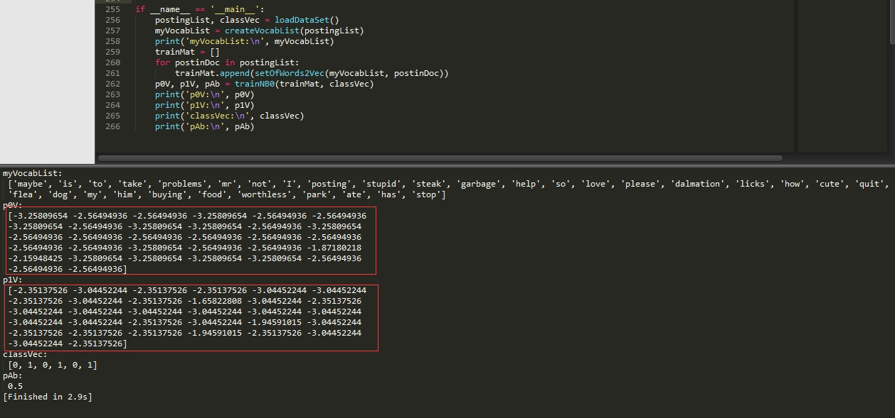](https://cuijiahua.com/wp-content/uploads/2017/11/ml_5_18.jpg)

瞧，这样我们得到的结果就没有问题了，不存在0概率。当然除此之外，我们还需要对代码进行修改classifyNB(vec2Classify, p0Vec, p1Vec, pClass1)函数，修改如下：


```python
"""
函数说明:朴素贝叶斯分类器分类函数

Parameters:
    vec2Classify - 待分类的词条数组
    p0Vec - 非侮辱类的条件概率数组
    p1Vec -侮辱类的条件概率数组
    pClass1 - 文档属于侮辱类的概率
Returns:
    0 - 属于非侮辱类
    1 - 属于侮辱类
Author:
    Jack Cui
Blog:
    http://blog.csdn.net/c406495762
Modify:
    2017-08-12
"""
def classifyNB(vec2Classify, p0Vec, p1Vec, pClass1):
    p1 = sum(vec2Classify * p1Vec) + np.log(pClass1)        #对应元素相乘。logA * B = logA + logB，所以这里加上log(pClass1)
    p0 = sum(vec2Classify * p0Vec) + np.log(1.0 - pClass1)
    if p1 > p0:
        return 1
    else:
        return 0
```

为啥这么改？因为取自然对数了。logab = loga + logb。

这样，我们的朴素贝叶斯分类器就改进完毕了。

## 三、朴素贝叶斯之过滤垃圾邮件

在上篇文章那个简单的例子中，我们引入了字符串列表。使用朴素贝叶斯解决一些现实生活中的问题时，需要先从文本内容得到字符串列表，然后生成词向量。下面这个例子中，我们将了解朴素贝叶斯的一个最著名的应用：电子邮件垃圾过滤。首先看一下使用朴素贝叶斯对电子邮件进行分类的步骤：

- 收集数据：提供文本文件。
- 准备数据：将文本文件解析成词条向量。
- 分析数据：检查词条确保解析的正确性。
- 训练算法：使用我们之前建立的trainNB0()函数。
- 测试算法：使用classifyNB()，并构建一个新的测试函数来计算文档集的错误率。
- 使用算法：构建一个完整的程序对一组文档进行分类，将错分的文档输出到屏幕上。

### 1、收集数据

数据我已经为大家准备好了，可以在我的Github上下载： [数据集下载](https://github.com/Jack-Cherish/Machine-Learning/tree/master/Naive Bayes/email)

有两个文件夹ham和spam，spam文件下的txt文件为垃圾邮件。

### 2、准备数据

对于英文文本，我们可以以非字母、非数字作为符号进行切分，使用split函数即可。编写代码如下：

```python
# -*- coding: UTF-8 -*-
import re

"""
函数说明:接收一个大字符串并将其解析为字符串列表

Parameters:
    无
Returns:
    无
Author:
    Jack Cui
Blog:
    http://blog.csdn.net/c406495762
Modify:
    2017-08-14
"""
def textParse(bigString):                                                   #将字符串转换为字符列表
    listOfTokens = re.split(r'\W+', bigString)                              #将特殊符号作为切分标志进行字符串切分，即非字母、非数字
    return [tok.lower() for tok in listOfTokens if len(tok) > 2]            #除了单个字母，例如大写的I，其它单词变成小写

"""
函数说明:将切分的实验样本词条整理成不重复的词条列表，也就是词汇表

Parameters:
    dataSet - 整理的样本数据集
Returns:
    vocabSet - 返回不重复的词条列表，也就是词汇表
Author:
    Jack Cui
Blog:
    http://blog.csdn.net/c406495762
Modify:
    2017-08-11
"""
def createVocabList(dataSet):
    vocabSet = set([])                      #创建一个空的不重复列表
    for document in dataSet:               
        vocabSet = vocabSet | set(document) #取并集
    return list(vocabSet)

if __name__ == '__main__':
    docList = []; classList = []
    for i in range(1, 26):                                                  #遍历25个txt文件
        wordList = textParse(open('email/spam/%d.txt' % i, 'r').read())     #读取每个垃圾邮件，并字符串转换成字符串列表
        docList.append(wordList)
        classList.append(1)                                                 #标记垃圾邮件，1表示垃圾文件
        wordList = textParse(open('email/ham/%d.txt' % i, 'r').read())      #读取每个非垃圾邮件，并字符串转换成字符串列表
        docList.append(wordList)
        classList.append(0)                                                 #标记非垃圾邮件，1表示垃圾文件   
    vocabList = createVocabList(docList)                                    #创建词汇表，不重复
    print(vocabList)
```


这样我们就得到了词汇表，结果如下图所示：

[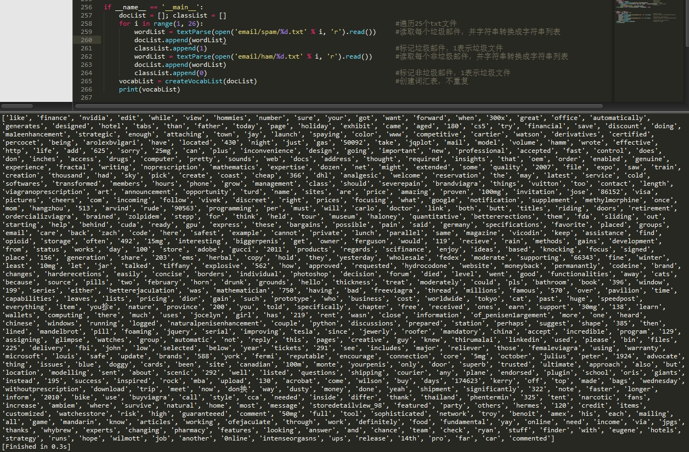](https://cuijiahua.com/wp-content/uploads/2017/11/ml_5_4.jpg)

根据词汇表，我们就可以将每个文本向量化。我们将数据集分为训练集和测试集，使用交叉验证的方式测试朴素贝叶斯分类器的准确性。编写代码如下：

```python
# -*- coding: UTF-8 -*-
import numpy as np
import random
import re

"""
函数说明:将切分的实验样本词条整理成不重复的词条列表，也就是词汇表

Parameters:
    dataSet - 整理的样本数据集
Returns:
    vocabSet - 返回不重复的词条列表，也就是词汇表
Author:
    Jack Cui
Blog:
    http://blog.csdn.net/c406495762
Modify:
    2017-08-11
"""
def createVocabList(dataSet):
    vocabSet = set([])                      #创建一个空的不重复列表
    for document in dataSet:               
        vocabSet = vocabSet | set(document) #取并集
    return list(vocabSet)

"""
函数说明:根据vocabList词汇表，将inputSet向量化，向量的每个元素为1或0

Parameters:
    vocabList - createVocabList返回的列表
    inputSet - 切分的词条列表
Returns:
    returnVec - 文档向量,词集模型
Author:
    Jack Cui
Blog:
    http://blog.csdn.net/c406495762
Modify:
    2017-08-11
"""
def setOfWords2Vec(vocabList, inputSet):
    returnVec = [0] * len(vocabList)                                    #创建一个其中所含元素都为0的向量
    for word in inputSet:                                                #遍历每个词条
        if word in vocabList:                                            #如果词条存在于词汇表中，则置1
            returnVec[vocabList.index(word)] = 1
        else: print("the word: %s is not in my Vocabulary!" % word)
    return returnVec                                                    #返回文档向量


"""
函数说明:根据vocabList词汇表，构建词袋模型

Parameters:
    vocabList - createVocabList返回的列表
    inputSet - 切分的词条列表
Returns:
    returnVec - 文档向量,词袋模型
Author:
    Jack Cui
Blog:
    http://blog.csdn.net/c406495762
Modify:
    2017-08-14
"""
def bagOfWords2VecMN(vocabList, inputSet):
    returnVec = [0]*len(vocabList)                                        #创建一个其中所含元素都为0的向量
    for word in inputSet:                                                #遍历每个词条
        if word in vocabList:                                            #如果词条存在于词汇表中，则计数加一
            returnVec[vocabList.index(word)] += 1
    return returnVec                                                    #返回词袋模型

"""
函数说明:朴素贝叶斯分类器训练函数

Parameters:
    trainMatrix - 训练文档矩阵，即setOfWords2Vec返回的returnVec构成的矩阵
    trainCategory - 训练类别标签向量，即loadDataSet返回的classVec
Returns:
    p0Vect - 非侮辱类的条件概率数组
    p1Vect - 侮辱类的条件概率数组
    pAbusive - 文档属于侮辱类的概率
Author:
    Jack Cui
Blog:
    http://blog.csdn.net/c406495762
Modify:
    2017-08-12
"""
def trainNB0(trainMatrix,trainCategory):
    numTrainDocs = len(trainMatrix)                            #计算训练的文档数目
    numWords = len(trainMatrix[0])                            #计算每篇文档的词条数
    pAbusive = sum(trainCategory)/float(numTrainDocs)        #文档属于侮辱类的概率
    p0Num = np.ones(numWords); p1Num = np.ones(numWords)    #创建numpy.ones数组,词条出现数初始化为1，拉普拉斯平滑
    p0Denom = 2.0; p1Denom = 2.0                            #分母初始化为2,拉普拉斯平滑
    for i in range(numTrainDocs):
        if trainCategory[i] == 1:                            #统计属于侮辱类的条件概率所需的数据，即P(w0|1),P(w1|1),P(w2|1)···
            p1Num += trainMatrix[i]
            p1Denom += sum(trainMatrix[i])
        else:                                                #统计属于非侮辱类的条件概率所需的数据，即P(w0|0),P(w1|0),P(w2|0)···
            p0Num += trainMatrix[i]
            p0Denom += sum(trainMatrix[i])
    p1Vect = np.log(p1Num/p1Denom)                            #取对数，防止下溢出         
    p0Vect = np.log(p0Num/p0Denom)         
    return p0Vect,p1Vect,pAbusive                            #返回属于侮辱类的条件概率数组，属于非侮辱类的条件概率数组，文档属于侮辱类的概率

"""
函数说明:朴素贝叶斯分类器分类函数

Parameters:
    vec2Classify - 待分类的词条数组
    p0Vec - 非侮辱类的条件概率数组
    p1Vec -侮辱类的条件概率数组
    pClass1 - 文档属于侮辱类的概率
Returns:
    0 - 属于非侮辱类
    1 - 属于侮辱类
Author:
    Jack Cui
Blog:
    http://blog.csdn.net/c406495762
Modify:
    2017-08-12
"""
def classifyNB(vec2Classify, p0Vec, p1Vec, pClass1):
    p1 = sum(vec2Classify * p1Vec) + np.log(pClass1)        #对应元素相乘。logA * B = logA + logB，所以这里加上log(pClass1)
    p0 = sum(vec2Classify * p0Vec) + np.log(1.0 - pClass1)
    if p1 > p0:
        return 1
    else:
        return 0

"""
函数说明:接收一个大字符串并将其解析为字符串列表

Parameters:
    无
Returns:
    无
Author:
    Jack Cui
Blog:
    http://blog.csdn.net/c406495762
Modify:
    2017-08-14
"""
def textParse(bigString):                                                   #将字符串转换为字符列表
    listOfTokens = re.split(r'\W+', bigString)                              #将特殊符号作为切分标志进行字符串切分，即非字母、非数字
    return [tok.lower() for tok in listOfTokens if len(tok) > 2]            #除了单个字母，例如大写的I，其它单词变成小写

"""
函数说明:测试朴素贝叶斯分类器

Parameters:
    无
Returns:
    无
Author:
    Jack Cui
Blog:
    http://blog.csdn.net/c406495762
Modify:
    2017-08-14
"""
def spamTest():
    docList = []; classList = []; fullText = []
    for i in range(1, 26):                                                  #遍历25个txt文件
        wordList = textParse(open('email/spam/%d.txt' % i, 'r').read())     #读取每个垃圾邮件，并字符串转换成字符串列表
        docList.append(wordList)
        fullText.append(wordList)
        classList.append(1)                                                 #标记垃圾邮件，1表示垃圾文件
        wordList = textParse(open('email/ham/%d.txt' % i, 'r').read())      #读取每个非垃圾邮件，并字符串转换成字符串列表
        docList.append(wordList)
        fullText.append(wordList)
        classList.append(0)                                                 #标记非垃圾邮件，1表示垃圾文件   
    vocabList = createVocabList(docList)                                    #创建词汇表，不重复
    trainingSet = list(range(50)); testSet = []                             #创建存储训练集的索引值的列表和测试集的索引值的列表                       
    for i in range(10):                                                     #从50个邮件中，随机挑选出40个作为训练集,10个做测试集
        randIndex = int(random.uniform(0, len(trainingSet)))                #随机选取索索引值
        testSet.append(trainingSet[randIndex])                              #添加测试集的索引值
        del(trainingSet[randIndex])                                         #在训练集列表中删除添加到测试集的索引值
    trainMat = []; trainClasses = []                                        #创建训练集矩阵和训练集类别标签系向量             
    for docIndex in trainingSet:                                            #遍历训练集
        trainMat.append(setOfWords2Vec(vocabList, docList[docIndex]))       #将生成的词集模型添加到训练矩阵中
        trainClasses.append(classList[docIndex])                            #将类别添加到训练集类别标签系向量中
    p0V, p1V, pSpam = trainNB0(np.array(trainMat), np.array(trainClasses))  #训练朴素贝叶斯模型
    errorCount = 0                                                          #错误分类计数
    for docIndex in testSet:                                                #遍历测试集
        wordVector = setOfWords2Vec(vocabList, docList[docIndex])           #测试集的词集模型
        if classifyNB(np.array(wordVector), p0V, p1V, pSpam) != classList[docIndex]:    #如果分类错误
            errorCount += 1                                                 #错误计数加1
            print("分类错误的测试集：",docList[docIndex])
    print('错误率：%.2f%%' % (float(errorCount) / len(testSet) * 100))


if __name__ == '__main__':
    spamTest()
```


运行结果如下：

[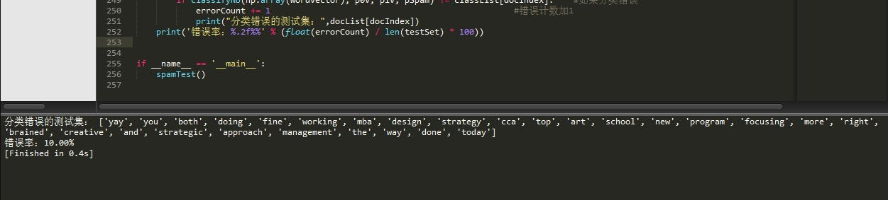](https://cuijiahua.com/wp-content/uploads/2017/11/ml_5_5.jpg)

函数spamTest()会输出在10封随机选择的电子邮件上的分类错误概率。既然这些电子邮件是随机选择的，所以每次的输出结果可能有些差别。如果发现错误的话，函数会输出错误的文档的此表，这样就可以了解到底是哪篇文档发生了错误。如果想要更好地估计错误率，那么就应该将上述过程重复多次，比如说10次，然后求平均值。相比之下，将垃圾邮件误判为正常邮件要比将正常邮件归为垃圾邮件好。为了避免错误，有多种方式可以用来修正分类器，这些内容会在后续文章中进行讨论。

这部分代码获取：[代码获取](https://github.com/Jack-Cherish/Machine-Learning/blob/master/Naive Bayes/bayes-modify.py)

## 四、朴素贝叶斯之新浪新闻分类(Sklearn)

### 1、中文语句切分

考虑一个问题，英文的语句可以通过非字母和非数字进行切分，但是汉语句子呢？就比如我打的这一堆字，该如何进行切分呢？我们自己写个规则？

幸运地是，这部分的工作不需要我们自己做了，可以直接使用第三方分词组件，即jieba，没错就是"结巴"。

jieba已经兼容Python2和Python3，使用如下指令直接安装即可：

pip3 install jieba

| 1    | pip3 install jieba |
| ---- | ------------------ |
|      |                    |

Python中文分词组件使用简单：

- 民间教程：https://www.oschina.net/p/jieba
- 官方教程：https://github.com/fxsjy/jieba

新闻分类数据集我也已经准备好，可以到我的Github进行下载：[数据集下载](https://github.com/Jack-Cherish/Machine-Learning/tree/master/Naive Bayes/SogouC)

数据集已经做好分类，分文件夹保存，分类结果如下：

[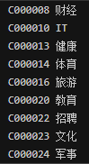](https://cuijiahua.com/wp-content/uploads/2017/11/ml_5_6.png)

数据集已经准备好，接下来，让我们直接进入正题。切分中文语句，编写如下代码：

```python
# -*- coding: UTF-8 -*-
import os
import jieba

def TextProcessing(folder_path):
    folder_list = os.listdir(folder_path)                        #查看folder_path下的文件
    data_list = []                                                #训练集
    class_list = []

    #遍历每个子文件夹
    for folder in folder_list:
        new_folder_path = os.path.join(folder_path, folder)        #根据子文件夹，生成新的路径
        files = os.listdir(new_folder_path)                        #存放子文件夹下的txt文件的列表

        j = 1
        #遍历每个txt文件
        for file in files:
            if j > 100:                                            #每类txt样本数最多100个
                break
            with open(os.path.join(new_folder_path, file), 'r', encoding = 'utf-8') as f:    #打开txt文件
                raw = f.read()

            word_cut = jieba.cut(raw, cut_all = False)            #精简模式，返回一个可迭代的generator
            word_list = list(word_cut)                            #generator转换为list

            data_list.append(word_list)
            class_list.append(folder)
            j += 1
    print(data_list)
    print(class_list)
if __name__ == '__main__':
    #文本预处理
    folder_path = './SogouC/Sample'                #训练集存放地址
    TextProcessing(folder_path)
```

代码运行结果如下所示，可以看到，我们已经顺利将每个文本进行切分，并进行了类别标记。

[](https://cuijiahua.com/wp-content/uploads/2017/11/ml_5_7.jpg)

### 2、文本特征选择

我们将所有文本分成训练集和测试集，并对训练集中的所有单词进行词频统计，并按降序排序。也就是将出现次数多的词语在前，出现次数少的词语在后进行排序。编写代码如下：

```python
# -*- coding: UTF-8 -*-
import os
import random
import jieba

"""
函数说明:中文文本处理

Parameters:
    folder_path - 文本存放的路径
    test_size - 测试集占比，默认占所有数据集的百分之20
Returns:
    all_words_list - 按词频降序排序的训练集列表
    train_data_list - 训练集列表
    test_data_list - 测试集列表
    train_class_list - 训练集标签列表
    test_class_list - 测试集标签列表
Author:
    Jack Cui
Blog:
    http://blog.csdn.net/c406495762
Modify:
    2017-08-22
"""
def TextProcessing(folder_path, test_size = 0.2):
    folder_list = os.listdir(folder_path)                        #查看folder_path下的文件
    data_list = []                                                #数据集数据
    class_list = []                                                #数据集类别

    #遍历每个子文件夹
    for folder in folder_list:
        new_folder_path = os.path.join(folder_path, folder)        #根据子文件夹，生成新的路径
        files = os.listdir(new_folder_path)                        #存放子文件夹下的txt文件的列表

        j = 1
        #遍历每个txt文件
        for file in files:
            if j > 100:                                            #每类txt样本数最多100个
                break
            with open(os.path.join(new_folder_path, file), 'r', encoding = 'utf-8') as f:    #打开txt文件
                raw = f.read()

            word_cut = jieba.cut(raw, cut_all = False)            #精简模式，返回一个可迭代的generator
            word_list = list(word_cut)                            #generator转换为list

            data_list.append(word_list)                            #添加数据集数据
            class_list.append(folder)                            #添加数据集类别
            j += 1

    data_class_list = list(zip(data_list, class_list))            #zip压缩合并，将数据与标签对应压缩
    random.shuffle(data_class_list)                                #将data_class_list乱序
    index = int(len(data_class_list) * test_size) + 1            #训练集和测试集切分的索引值
    train_list = data_class_list[index:]                        #训练集
    test_list = data_class_list[:index]                            #测试集
    train_data_list, train_class_list = zip(*train_list)        #训练集解压缩
    test_data_list, test_class_list = zip(*test_list)            #测试集解压缩

    all_words_dict = {}                                            #统计训练集词频
    for word_list in train_data_list:
        for word in word_list:
            if word in all_words_dict.keys():
                all_words_dict[word] += 1
            else:
                all_words_dict[word] = 1

    #根据键的值倒序排序
    all_words_tuple_list = sorted(all_words_dict.items(), key = lambda f:f[1], reverse = True)
    all_words_list, all_words_nums = zip(*all_words_tuple_list)    #解压缩
    all_words_list = list(all_words_list)                        #转换成列表
    return all_words_list, train_data_list, test_data_list, train_class_list, test_class_list

if __name__ == '__main__':
    #文本预处理
    folder_path = './SogouC/Sample'                #训练集存放地址
    all_words_list, train_data_list, test_data_list, train_class_list, test_class_list = TextProcessing(folder_path, test_size=0.2)
    print(all_words_list)
```


all_words_list就是将所有训练集的切分结果通过词频降序排列构成的单词合集。观察一下打印结果，不难发现，这里包含了很多标点符号，很显然，这些标点符号是不能作为新闻分类的特征的。总不能说，应为这个文章逗号多，所以它是xx类新闻吧？为了降低这些高频的符号对分类结果的影响，我们应该怎么做呢？答曰：抛弃他们！  除了这些，还有"在"，"了"这样对新闻分类无关痛痒的词。并且还有一些数字，数字显然也不能作为分类新闻的特征。所以要消除它们对分类结果的影响，我们可以定制一个规则。

[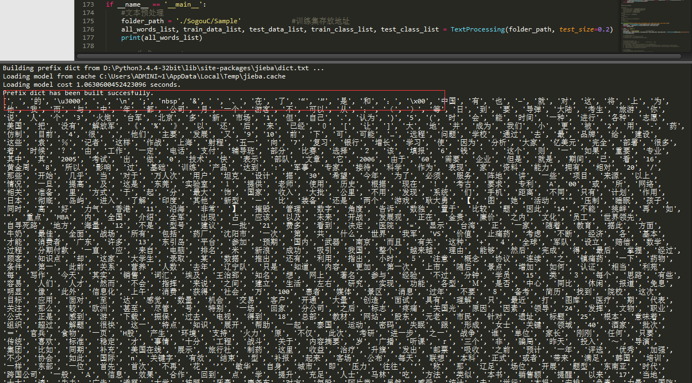](https://cuijiahua.com/wp-content/uploads/2017/11/ml_5_8.png)

一个简单的规则可以这样制定：首先去掉高频词，至于去掉多少个高频词，我们可以通过观察去掉高频词个数和最终检测准确率的关系来确定。除此之外，去除数字，不把数字作为分类特征。同时，去除一些特定的词语，比如："的"，"一"，"在"，"不"，"当然","怎么"这类的对新闻分类无影响的介词、代词、连词。怎么去除这些词呢？可以使用已经整理好的stopwords_cn.txt文本。下载地址：[点我下载](https://github.com/Jack-Cherish/Machine-Learning/blob/master/Naive Bayes/stopwords_cn.txt)

这个文件是这个样子的：

[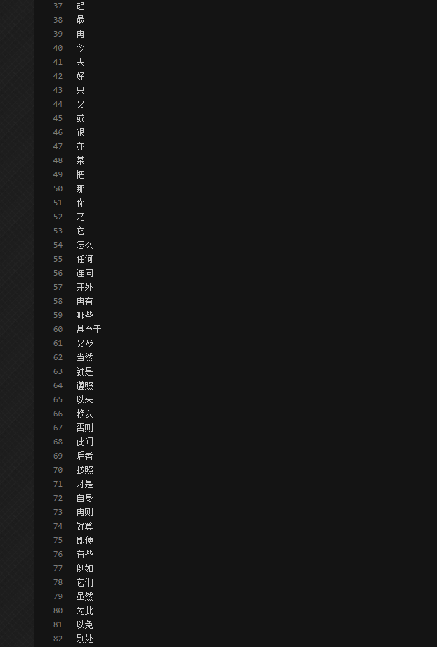](https://cuijiahua.com/wp-content/uploads/2017/11/ml_5_9.png)

所以我们可以根据这个文档，将这些单词去除，不作为分类的特征。我们先去除前100个高频词汇，然后编写代码如下：

```python
# -*- coding: UTF-8 -*-
import os
import random
import jieba

"""
函数说明:中文文本处理

Parameters:
    folder_path - 文本存放的路径
    test_size - 测试集占比，默认占所有数据集的百分之20
Returns:
    all_words_list - 按词频降序排序的训练集列表
    train_data_list - 训练集列表
    test_data_list - 测试集列表
    train_class_list - 训练集标签列表
    test_class_list - 测试集标签列表
Author:
    Jack Cui
Blog:
    http://blog.csdn.net/c406495762
Modify:
    2017-08-22
"""
def TextProcessing(folder_path, test_size = 0.2):
    folder_list = os.listdir(folder_path)                        #查看folder_path下的文件
    data_list = []                                                #数据集数据
    class_list = []                                                #数据集类别

    #遍历每个子文件夹
    for folder in folder_list:
        new_folder_path = os.path.join(folder_path, folder)        #根据子文件夹，生成新的路径
        files = os.listdir(new_folder_path)                        #存放子文件夹下的txt文件的列表

        j = 1
        #遍历每个txt文件
        for file in files:
            if j > 100:                                            #每类txt样本数最多100个
                break
            with open(os.path.join(new_folder_path, file), 'r', encoding = 'utf-8') as f:    #打开txt文件
                raw = f.read()

            word_cut = jieba.cut(raw, cut_all = False)            #精简模式，返回一个可迭代的generator
            word_list = list(word_cut)                            #generator转换为list

            data_list.append(word_list)                            #添加数据集数据
            class_list.append(folder)                            #添加数据集类别
            j += 1

    data_class_list = list(zip(data_list, class_list))            #zip压缩合并，将数据与标签对应压缩
    random.shuffle(data_class_list)                                #将data_class_list乱序
    index = int(len(data_class_list) * test_size) + 1            #训练集和测试集切分的索引值
    train_list = data_class_list[index:]                        #训练集
    test_list = data_class_list[:index]                            #测试集
    train_data_list, train_class_list = zip(*train_list)        #训练集解压缩
    test_data_list, test_class_list = zip(*test_list)            #测试集解压缩

    all_words_dict = {}                                            #统计训练集词频
    for word_list in train_data_list:
        for word in word_list:
            if word in all_words_dict.keys():
                all_words_dict[word] += 1
            else:
                all_words_dict[word] = 1

    #根据键的值倒序排序
    all_words_tuple_list = sorted(all_words_dict.items(), key = lambda f:f[1], reverse = True)
    all_words_list, all_words_nums = zip(*all_words_tuple_list)    #解压缩
    all_words_list = list(all_words_list)                        #转换成列表
    return all_words_list, train_data_list, test_data_list, train_class_list, test_class_list

"""
函数说明:读取文件里的内容，并去重

Parameters:
    words_file - 文件路径
Returns:
    words_set - 读取的内容的set集合
Author:
    Jack Cui
Blog:
    http://blog.csdn.net/c406495762
Modify:
    2017-08-22
"""
def MakeWordsSet(words_file):
    words_set = set()                                            #创建set集合
    with open(words_file, 'r', encoding = 'utf-8') as f:        #打开文件
        for line in f.readlines():                                #一行一行读取
            word = line.strip()                                    #去回车
            if len(word) > 0:                                    #有文本，则添加到words_set中
                words_set.add(word)                               
    return words_set                                             #返回处理结果

"""
函数说明:文本特征选取

Parameters:
    all_words_list - 训练集所有文本列表
    deleteN - 删除词频最高的deleteN个词
    stopwords_set - 指定的结束语
Returns:
    feature_words - 特征集
Author:
    Jack Cui
Blog:
    http://blog.csdn.net/c406495762
Modify:
    2017-08-22
"""
def words_dict(all_words_list, deleteN, stopwords_set = set()):
    feature_words = []                            #特征列表
    n = 1
    for t in range(deleteN, len(all_words_list), 1):
        if n > 1000:                            #feature_words的维度为1000
            break                               
        #如果这个词不是数字，并且不是指定的结束语，并且单词长度大于1小于5，那么这个词就可以作为特征词
        if not all_words_list[t].isdigit() and all_words_list[t] not in stopwords_set and 1 < len(all_words_list[t]) < 5:
            feature_words.append(all_words_list[t])
        n += 1   
    return feature_words

if __name__ == '__main__':
    #文本预处理
    folder_path = './SogouC/Sample'                #训练集存放地址
    all_words_list, train_data_list, test_data_list, train_class_list, test_class_list = TextProcessing(folder_path, test_size=0.2)

    #生成stopwords_set
    stopwords_file = './stopwords_cn.txt'
    stopwords_set = MakeWordsSet(stopwords_file)

    feature_words = words_dict(all_words_list, 100, stopwords_set)
    print(feature_words)
```


运行结果如下：

[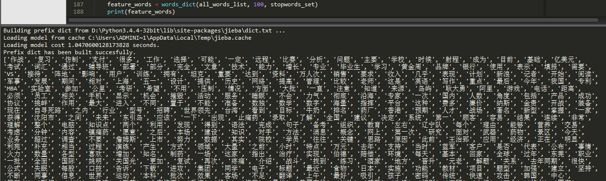](https://cuijiahua.com/wp-content/uploads/2017/11/ml_5_10.png)

可以看到，我们已经滤除了那些没有用的词组，这个feature_words就是我们最终选出的用于新闻分类的特征。随后，我们就可以根据feature_words，将文本向量化，然后用于训练朴素贝叶斯分类器。这个向量化的思想和第三章的思想一致，因此不再累述。

### 3、使用Sklearn构建朴素贝叶斯分类器

数据已经处理好了，接下来就可以使用[sklearn](https://cuijiahua.com/blog/tag/sklearn/)构建朴素贝叶斯分类器了。

官方英文文档地址：[文档地址](https://scikit-learn.org/dev/modules/generated/sklearn.naive_bayes.MultinomialNB.html)

朴素贝叶斯是一类比较简单的算法，scikit-learn中朴素贝叶斯类库的使用也比较简单。相对于决策树，KNN之类的算法，朴素贝叶斯需要关注的参数是比较少的，这样也比较容易掌握。在scikit-learn中，一共有3个朴素贝叶斯的分类算法类。分别是GaussianNB，MultinomialNB和BernoulliNB。其中GaussianNB就是先验为高斯分布的朴素贝叶斯，MultinomialNB就是先验为多项式分布的朴素贝叶斯，而BernoulliNB就是先验为伯努利分布的朴素贝叶斯。上篇文章讲解的先验概率模型就是先验概率为多项式分布的朴素贝叶斯。

[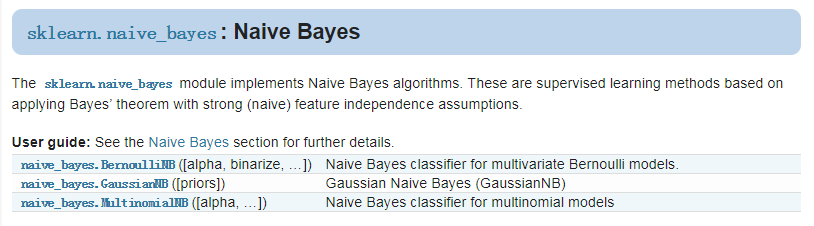](https://cuijiahua.com/wp-content/uploads/2017/11/ml_5_11.png)

对于新闻分类，属于多分类问题。我们可以使用MultinamialNB()完成我们的新闻分类问题。另外两个函数的使用暂且不再进行扩展，可以自行学习。MultinomialNB假设特征的先验概率为多项式分布，即如下式：

[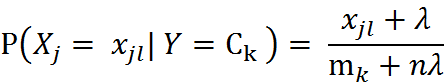](https://cuijiahua.com/wp-content/uploads/2017/11/ml_5_12.png)

其中， P(Xj = Xjl | Y = Ck)是第k个类别的第j维特征的第l个取值条件概率。mk是训练集中输出为第k类的样本个数。λ为一个大于0的常数，常常取值为1，即拉普拉斯平滑，也可以取其他值。

接下来，我们看下MultinamialNB这个函数，只有3个参数：

[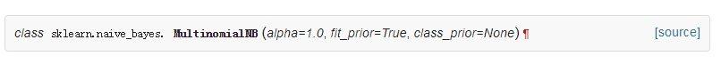](https://cuijiahua.com/wp-content/uploads/2017/11/ml_5_15.jpg)

参数说明如下：

- alpha：浮点型可选参数，默认为1.0，其实就是添加拉普拉斯平滑，即为上述公式中的λ ，如果这个参数设置为0，就是不添加平滑；
- fit_prior：布尔型可选参数，默认为True。布尔参数fit_prior表示是否要考虑先验概率，如果是false,则所有的样本类别输出都有相同的类别先验概率。否则可以自己用第三个参数class_prior输入先验概率，或者不输入第三个参数class_prior让MultinomialNB自己从训练集样本来计算先验概率，此时的先验概率为P(Y=Ck)=mk/m。其中m为训练集样本总数量，mk为输出为第k类别的训练集样本数。
- class_prior：可选参数，默认为None。

总结如下：

[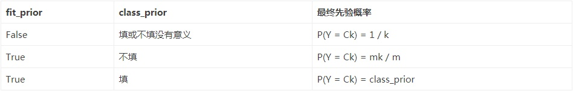](https://cuijiahua.com/wp-content/uploads/2017/11/ml_5_13.jpg)

除此之外，MultinamialNB也有一些方法供我们使用：

[](https://cuijiahua.com/wp-content/uploads/2017/11/ml_5_14.jpg)

MultinomialNB一个重要的功能是有partial_fit方法，这个方法的一般用在如果训练集数据量非常大，一次不能全部载入内存的时候。这时我们可以把训练集分成若干等分，重复调用partial_fit来一步步的学习训练集，非常方便。GaussianNB和BernoulliNB也有类似的功能。  在使用MultinomialNB的fit方法或者partial_fit方法拟合数据后，我们可以进行预测。此时预测有三种方法，包括predict，predict_log_proba和predict_proba。predict方法就是我们最常用的预测方法，直接给出测试集的预测类别输出。predict_proba则不同，它会给出测试集样本在各个类别上预测的概率。容易理解，predict_proba预测出的各个类别概率里的最大值对应的类别，也就是predict方法得到类别。predict_log_proba和predict_proba类似，它会给出测试集样本在各个类别上预测的概率的一个对数转化。转化后predict_log_proba预测出的各个类别对数概率里的最大值对应的类别，也就是predict方法得到类别。具体细节不再讲解，可参照官网手册。

了解了这些，我们就可以编写代码，通过观察取不同的去掉前deleteN个高频词的个数与最终检测准确率的关系，确定deleteN的取值：


```python
# -*- coding: UTF-8 -*-
from sklearn.naive_bayes import MultinomialNB
import matplotlib.pyplot as plt
import os
import random
import jieba

"""
函数说明:中文文本处理

Parameters:
    folder_path - 文本存放的路径
    test_size - 测试集占比，默认占所有数据集的百分之20
Returns:
    all_words_list - 按词频降序排序的训练集列表
    train_data_list - 训练集列表
    test_data_list - 测试集列表
    train_class_list - 训练集标签列表
    test_class_list - 测试集标签列表
Author:
    Jack Cui
Blog:
    http://blog.csdn.net/c406495762
Modify:
    2017-08-22
"""
def TextProcessing(folder_path, test_size = 0.2):
    folder_list = os.listdir(folder_path)                        #查看folder_path下的文件
    data_list = []                                                #数据集数据
    class_list = []                                                #数据集类别

    #遍历每个子文件夹
    for folder in folder_list:
        new_folder_path = os.path.join(folder_path, folder)        #根据子文件夹，生成新的路径
        files = os.listdir(new_folder_path)                        #存放子文件夹下的txt文件的列表

        j = 1
        #遍历每个txt文件
        for file in files:
            if j > 100:                                            #每类txt样本数最多100个
                break
            with open(os.path.join(new_folder_path, file), 'r', encoding = 'utf-8') as f:    #打开txt文件
                raw = f.read()

            word_cut = jieba.cut(raw, cut_all = False)            #精简模式，返回一个可迭代的generator
            word_list = list(word_cut)                            #generator转换为list

            data_list.append(word_list)                            #添加数据集数据
            class_list.append(folder)                            #添加数据集类别
            j += 1

    data_class_list = list(zip(data_list, class_list))            #zip压缩合并，将数据与标签对应压缩
    random.shuffle(data_class_list)                                #将data_class_list乱序
    index = int(len(data_class_list) * test_size) + 1            #训练集和测试集切分的索引值
    train_list = data_class_list[index:]                        #训练集
    test_list = data_class_list[:index]                            #测试集
    train_data_list, train_class_list = zip(*train_list)        #训练集解压缩
    test_data_list, test_class_list = zip(*test_list)            #测试集解压缩

    all_words_dict = {}                                            #统计训练集词频
    for word_list in train_data_list:
        for word in word_list:
            if word in all_words_dict.keys():
                all_words_dict[word] += 1
            else:
                all_words_dict[word] = 1

    #根据键的值倒序排序
    all_words_tuple_list = sorted(all_words_dict.items(), key = lambda f:f[1], reverse = True)
    all_words_list, all_words_nums = zip(*all_words_tuple_list)    #解压缩
    all_words_list = list(all_words_list)                        #转换成列表
    return all_words_list, train_data_list, test_data_list, train_class_list, test_class_list

"""
函数说明:读取文件里的内容，并去重

Parameters:
    words_file - 文件路径
Returns:
    words_set - 读取的内容的set集合
Author:
    Jack Cui
Blog:
    http://blog.csdn.net/c406495762
Modify:
    2017-08-22
"""
def MakeWordsSet(words_file):
    words_set = set()                                            #创建set集合
    with open(words_file, 'r', encoding = 'utf-8') as f:        #打开文件
        for line in f.readlines():                                #一行一行读取
            word = line.strip()                                    #去回车
            if len(word) > 0:                                    #有文本，则添加到words_set中
                words_set.add(word)                               
    return words_set                                             #返回处理结果

"""
函数说明:根据feature_words将文本向量化

Parameters:
    train_data_list - 训练集
    test_data_list - 测试集
    feature_words - 特征集
Returns:
    train_feature_list - 训练集向量化列表
    test_feature_list - 测试集向量化列表
Author:
    Jack Cui
Blog:
    http://blog.csdn.net/c406495762
Modify:
    2017-08-22
"""
def TextFeatures(train_data_list, test_data_list, feature_words):
    def text_features(text, feature_words):                        #出现在特征集中，则置1                                               
        text_words = set(text)
        features = [1 if word in text_words else 0 for word in feature_words]
        return features
    train_feature_list = [text_features(text, feature_words) for text in train_data_list]
    test_feature_list = [text_features(text, feature_words) for text in test_data_list]
    return train_feature_list, test_feature_list                #返回结果


"""
函数说明:文本特征选取

Parameters:
    all_words_list - 训练集所有文本列表
    deleteN - 删除词频最高的deleteN个词
    stopwords_set - 指定的结束语
Returns:
    feature_words - 特征集
Author:
    Jack Cui
Blog:
    http://blog.csdn.net/c406495762
Modify:
    2017-08-22
"""
def words_dict(all_words_list, deleteN, stopwords_set = set()):
    feature_words = []                            #特征列表
    n = 1
    for t in range(deleteN, len(all_words_list), 1):
        if n > 1000:                            #feature_words的维度为1000
            break                               
        #如果这个词不是数字，并且不是指定的结束语，并且单词长度大于1小于5，那么这个词就可以作为特征词
        if not all_words_list[t].isdigit() and all_words_list[t] not in stopwords_set and 1 < len(all_words_list[t]) < 5:
            feature_words.append(all_words_list[t])
        n += 1
    return feature_words

"""
函数说明:新闻分类器

Parameters:
    train_feature_list - 训练集向量化的特征文本
    test_feature_list - 测试集向量化的特征文本
    train_class_list - 训练集分类标签
    test_class_list - 测试集分类标签
Returns:
    test_accuracy - 分类器精度
Author:
    Jack Cui
Blog:
    http://blog.csdn.net/c406495762
Modify:
    2017-08-22
"""
def TextClassifier(train_feature_list, test_feature_list, train_class_list, test_class_list):
    classifier = MultinomialNB().fit(train_feature_list, train_class_list)
    test_accuracy = classifier.score(test_feature_list, test_class_list)
    return test_accuracy

if __name__ == '__main__':
    #文本预处理
    folder_path = './SogouC/Sample'                #训练集存放地址
    all_words_list, train_data_list, test_data_list, train_class_list, test_class_list = TextProcessing(folder_path, test_size=0.2)

    # 生成stopwords_set
    stopwords_file = './stopwords_cn.txt'
    stopwords_set = MakeWordsSet(stopwords_file)


    test_accuracy_list = []
    deleteNs = range(0, 1000, 20)                #0 20 40 60 ... 980
    for deleteN in deleteNs:
        feature_words = words_dict(all_words_list, deleteN, stopwords_set)
        train_feature_list, test_feature_list = TextFeatures(train_data_list, test_data_list, feature_words)
        test_accuracy = TextClassifier(train_feature_list, test_feature_list, train_class_list, test_class_list)
        test_accuracy_list.append(test_accuracy)

    plt.figure()
    plt.plot(deleteNs, test_accuracy_list)
    plt.title('Relationship of deleteNs and test_accuracy')
    plt.xlabel('deleteNs')
    plt.ylabel('test_accuracy')
    plt.show()
```

运行结果如下：

[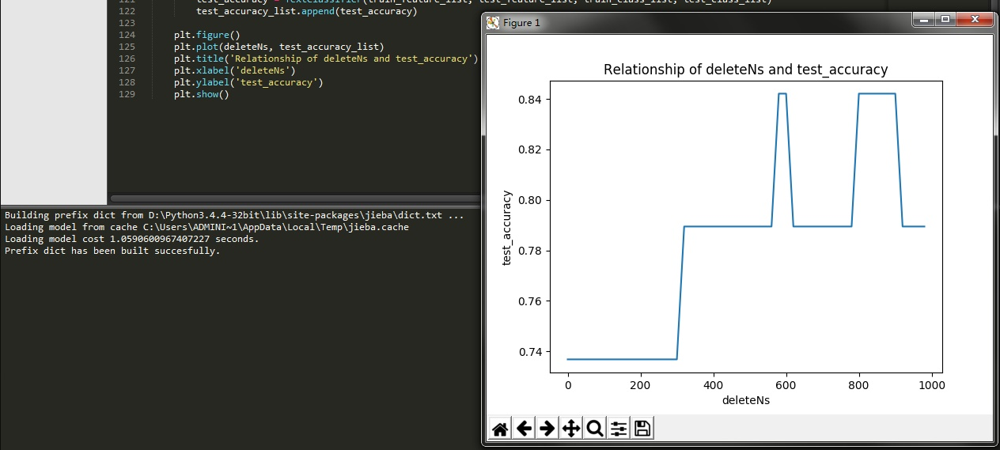](https://cuijiahua.com/wp-content/uploads/2017/11/ml_5_16.jpg)

我们绘制出了deleteNs和test_accuracy的关系，这样我们就可以大致确定去掉前多少的高频词汇了。每次运行程序，绘制的图形可能不尽相同，我们可以通过多次测试，来决定这个deleteN的取值，然后确定这个参数，这样就可以顺利构建出用于新闻分类的朴素贝叶斯分类器了。我测试感觉450还不错，最差的分类准确率也可以达到百分之50以上。将if __name__ == '__main__'下的代码修改如下：


```python
if __name__ == '__main__':
    #文本预处理
    folder_path = './SogouC/Sample'                #训练集存放地址
    all_words_list, train_data_list, test_data_list, train_class_list, test_class_list = TextProcessing(folder_path, test_size=0.2)

    # 生成stopwords_set
    stopwords_file = './stopwords_cn.txt'
    stopwords_set = MakeWordsSet(stopwords_file)


    test_accuracy_list = []
    feature_words = words_dict(all_words_list, 450, stopwords_set)
    train_feature_list, test_feature_list = TextFeatures(train_data_list, test_data_list, feature_words)
    test_accuracy = TextClassifier(train_feature_list, test_feature_list, train_class_list, test_class_list)
    test_accuracy_list.append(test_accuracy)
    ave = lambda c: sum(c) / len(c)

    print(ave(test_accuracy_list))
```

运行结果：

[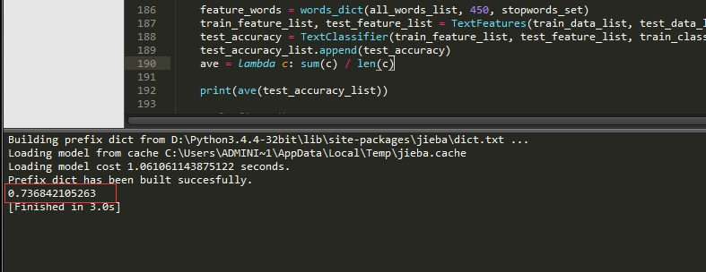](https://cuijiahua.com/wp-content/uploads/2017/11/ml_5_17.jpg)

## 五、总结

- 在训练朴素贝叶斯分类器之前，要处理好训练集，文本的清洗还是有很多需要学习的东西。
- 根据提取的分类特征将文本向量化，然后训练朴素贝叶斯分类器。
- 去高频词汇数量的不同，对结果也是有影响的的。
- 拉普拉斯平滑对于改善朴素贝叶斯分类器的分类效果有着积极的作用。
- 如有问题，请留言。如有错误，还望指正，谢谢！