## 一、前言

本文从Logistic回归的原理开始讲起，补充了书上**省略的数学推导**。本文可能会略显枯燥，理论居多，Sklearn实战内容会放在下一篇文章。**自己慢慢推导完公式，还是蛮开心的一件事。**

## 二、Logistic回归与梯度上升算法

Logistic回归是众多分类算法中的一员。通常，Logistic回归用于二分类问题，例如预测明天是否会下雨。当然它也可以用于多分类问题，不过为了简单起见，本文暂先讨论二分类问题。首先，让我们来了解一下，什么是Logistic回归。

### 1、Logistic回归

假设现在有一些数据点，我们利用一条直线对这些点进行拟合(该线称为最佳拟合直线)，这个拟合过程就称作为回归，如下图所示：

[](https://cuijiahua.com/wp-content/uploads/2017/11/ml_6_1.png)

Logistic回归是分类方法，它利用的是Sigmoid函数阈值在[0,1]这个特性。**Logistic回归进行分类的主要思想是：根据现有数据对分类边界线建立回归公式，以此进行分类。**其实，Logistic本质上是一个基于条件概率的判别模型(Discriminative Model)。

所以要想了解Logistic回归，我们必须先看一看Sigmoid函数 ，我们也可以称它为Logistic函数。它的公式如下：

[](https://cuijiahua.com/wp-content/uploads/2017/11/ml_6_2.png)

[](https://cuijiahua.com/wp-content/uploads/2017/11/ml_6_3.jpg)

[](https://cuijiahua.com/wp-content/uploads/2017/11/ml_6_4.png)

整合成一个公式，就变成了如下公式：

[](https://cuijiahua.com/wp-content/uploads/2017/11/ml_6_5.jpg)

下面这张图片，为我们展示了Sigmoid函数的样子。

[](https://cuijiahua.com/wp-content/uploads/2017/11/ml_6_6.png)

z是一个矩阵，θ是参数列向量(要求解的)，x是样本列向量(给定的数据集)。θ^T表示θ的转置。g(z)函数实现了任意实数到[0,1]的映射，这样我们的数据集([x0,x1,...,xn])，不管是大于1或者小于0，都可以映射到[0,1]区间进行分类。hθ(x)给出了输出为1的概率。比如当hθ(x)=0.7，那么说明有70%的概率输出为1。输出为0的概率是输出为1的补集，也就是30%。

如果我们有合适的参数列向量θ([θ0,θ1,...θn]^T)，以及样本列向量x([x0,x1,...,xn])，那么我们对样本x分类就可以通过上述公式计算出一个概率，如果这个概率大于0.5，我们就可以说样本是正样本，否则样本是负样本。

举个例子，对于"垃圾邮件判别问题"，对于给定的邮件(样本)，我们定义非垃圾邮件为正类，垃圾邮件为负类。我们通过计算出的概率值即可判定邮件是否是垃圾邮件。

**那么问题来了！如何得到合适的参数向量θ?**

根据sigmoid函数的特性，我们可以做出如下的假设：

[](https://cuijiahua.com/wp-content/uploads/2017/11/ml_6_7.jpg)

式即为在已知样本x和参数θ的情况下，样本x属性正样本(y=1)和负样本(y=0)的条件概率。理想状态下，根据上述公式，求出各个点的概率均为1，也就是完全分类都正确。但是考虑到实际情况，样本点的概率越接近于1，其分类效果越好。比如一个样本属于正样本的概率为0.51，那么我们就可以说明这个样本属于正样本。另一个样本属于正样本的概率为0.99，那么我们也可以说明这个样本属于正样本。但是显然，第二个样本概率更高，更具说服力。我们可以把上述两个概率公式合二为一：

[](https://cuijiahua.com/wp-content/uploads/2017/11/ml_6_8_1.jpg)

合并出来的Loss，我们称之为损失函数(Loss Function)。当y等于1时，(1-y)项(第二项)为0；当y等于0时，y项(第一项)为0。为s了简化问题，我们对整个表达式求对数，(将指数问题对数化是处理数学问题常见的方法)：

[](https://cuijiahua.com/wp-content/uploads/2017/11/ml_6_9_1.jpg)

这个损失函数，是对于一个样本而言的。给定一个样本，我们就可以通过这个损失函数求出，样本所属类别的概率，而这个概率越大越好，所以也就是求解这个损失函数的最大值。既然概率出来了，那么最大似然估计也该出场了。假定样本与样本之间相互独立，那么整个样本集生成的概率即为所有样本生成概率的乘积，便可得到如下公式：

[](https://cuijiahua.com/wp-content/uploads/2017/11/ml_6_10.png)

其中，m为样本的总数，y(i)表示第i个样本的类别，x(i)表示第i个样本，需要注意的是θ是多维向量，x(i)也是多维向量。

**综上所述，满足J(θ)的最大的θ值即是我们需要求解的模型。**

怎么求解使J(θ)最大的θ值呢？因为是求最大值，所以我们需要使用梯度上升算法。如果面对的问题是求解使J(θ)最小的θ值，那么我们就需要使用梯度下降算法。面对我们这个问题，如果使J(θ) :=  -J(θ)，那么问题就从求极大值转换成求极小值了，使用的算法就从梯度上升算法变成了梯度下降算法，它们的思想都是相同的，学会其一，就也会了另一个。本文使用梯度上升算法进行求解。

### 2、梯度上升算法

说了半天，梯度上升算法又是啥？J(θ)太复杂，我们先看个简单的求极大值的例子。一个看了就会想到高中生活的函数：

[](https://cuijiahua.com/wp-content/uploads/2017/11/ml_6_11.png)

来吧，做高中题。这个函数的极值怎么求？显然这个函数开口向下，存在极大值，它的函数图像为：

[](https://cuijiahua.com/wp-content/uploads/2017/11/ml_6_12.png)

求极值，先求函数的导数：

[](https://cuijiahua.com/wp-content/uploads/2017/11/ml_6_13.png)

令导数为0，可求出x=2即取得函数f(x)的极大值。极大值等于f(2)=4

但是真实环境中的函数不会像上面这么简单，就算求出了函数的导数，也很难精确计算出函数的极值。此时我们就可以用迭代的方法来做。就像爬坡一样，一点一点逼近极值。这种寻找最佳拟合参数的方法，就是最优化算法。爬坡这个动作用数学公式表达即为：

[](https://cuijiahua.com/wp-content/uploads/2017/11/ml_6_14.png)

其中，α为步长，也就是学习速率，控制更新的幅度。效果如下图所示：

[](https://cuijiahua.com/wp-content/uploads/2017/11/ml_6_15.png)

比如从(0,0)开始，迭代路径就是1->2->3->4->...->n，直到求出的x为函数极大值的近似值，停止迭代。我们可以编写Python3代码，来实现这一过程：

```python
# -*- coding:UTF-8 -*-
"""
函数说明:梯度上升算法测试函数

求函数f(x) = -x^2 + 4x的极大值

Parameters:
    无
Returns:
    无
Author:
    Jack Cui
Blog:
    http://blog.csdn.net/c406495762
Zhihu:
    https://www.zhihu.com/people/Jack--Cui/
Modify:
    2017-08-28
"""
def Gradient_Ascent_test():
    def f_prime(x_old):                                    #f(x)的导数
        return -2 * x_old + 4
    x_old = -1                                            #初始值，给一个小于x_new的值
    x_new = 0                                            #梯度上升算法初始值，即从(0,0)开始
    alpha = 0.01                                        #步长，也就是学习速率，控制更新的幅度
    presision = 0.00000001                                #精度，也就是更新阈值
    while abs(x_new - x_old) > presision:
        x_old = x_new
        x_new = x_old + alpha * f_prime(x_old)            #上面提到的公式
    print(x_new)                                        #打印最终求解的极值近似值

if __name__ == '__main__':
    Gradient_Ascent_test()
```


代码运行结果如下：

[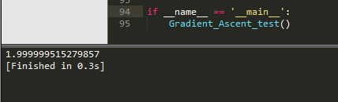](https://cuijiahua.com/wp-content/uploads/2017/11/ml_6_16.png)

结果很显然，已经非常接近我们的真实极值2了。这一过程，就是梯度上升算法。那么同理，J(θ)这个函数的极值，也可以这么求解。公式可以这么写：

[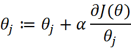](https://cuijiahua.com/wp-content/uploads/2017/11/ml_6_17.png)

由上小节可知J(θ)为：

[](https://cuijiahua.com/wp-content/uploads/2017/11/ml_6_18.png)

sigmoid函数为：

[](https://cuijiahua.com/wp-content/uploads/2017/11/ml_6_19.jpg)

**那么，现在我只要求出J(θ)的偏导，就可以利用梯度上升算法，求解J(θ)的极大值了。**

那么现在开始求解J(θ)对θ的偏导，求解如下：

[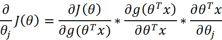](https://cuijiahua.com/wp-content/uploads/2017/11/ml_6_20.jpg)

其中：

[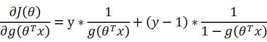](https://cuijiahua.com/wp-content/uploads/2017/11/ml_6_21.jpg)

再由：

[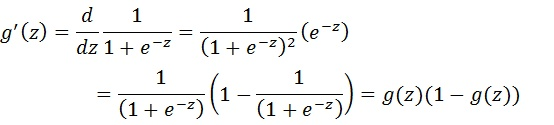](https://cuijiahua.com/wp-content/uploads/2017/11/ml_6_22.jpg)

可得：

[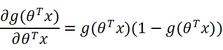](https://cuijiahua.com/wp-content/uploads/2017/11/ml_6_23.png)

接下来，就剩下第三部分：

[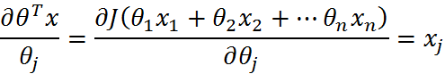](https://cuijiahua.com/wp-content/uploads/2017/11/ml_6_24.png)

综上所述：

[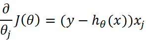](https://cuijiahua.com/wp-content/uploads/2017/11/ml_6_25.png)

因此，梯度上升迭代公式为：

[](https://cuijiahua.com/wp-content/uploads/2017/11/ml_6_26.png)

知道了，梯度上升迭代公式，我们就可以自己编写代码，计算最佳拟合参数了。

## 三、Python3实战

### 1、数据准备

数据集已经为大家准备好，下载地址：[数据集下载](https://github.com/Jack-Cherish/Machine-Learning/blob/master/Logistic/testSet.txt)

这就是一个简单的数据集，没什么实际意义。让我们先从这个简单的数据集开始学习。先看下数据集有哪些数据：

[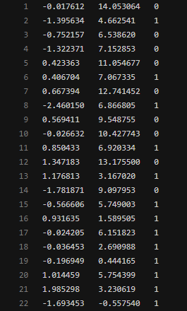](https://cuijiahua.com/wp-content/uploads/2017/11/ml_6_27.png)

这个数据有两维特征，因此可以将数据在一个二维平面上展示出来。我们可以将第一列数据(X1)看作x轴上的值，第二列数据(X2)看作y轴上的值。而最后一列数据即为分类标签。根据标签的不同，对这些点进行分类。

那么，先让我们编写代码，看下数据集的分布情况：

```python
# -*- coding:UTF-8 -*-
import matplotlib.pyplot as plt
import numpy as np

"""
函数说明:加载数据

Parameters:
    无
Returns:
    dataMat - 数据列表
    labelMat - 标签列表
Author:
    Jack Cui
Blog:
    http://blog.csdn.net/c406495762
Zhihu:
    https://www.zhihu.com/people/Jack--Cui/
Modify:
    2017-08-28
"""
def loadDataSet():
    dataMat = []                                                        #创建数据列表
    labelMat = []                                                        #创建标签列表
    fr = open('testSet.txt')                                            #打开文件   
    for line in fr.readlines():                                            #逐行读取
        lineArr = line.strip().split()                                    #去回车，放入列表
        dataMat.append([1.0, float(lineArr[0]), float(lineArr[1])])        #添加数据
        labelMat.append(int(lineArr[2]))                                #添加标签
    fr.close()                                                            #关闭文件
    return dataMat, labelMat                                            #返回

"""
函数说明:绘制数据集

Parameters:
    无
Returns:
    无
Author:
    Jack Cui
Blog:
    http://blog.csdn.net/c406495762
Zhihu:
    https://www.zhihu.com/people/Jack--Cui/
Modify:
    2017-08-28
"""
def plotDataSet():
    dataMat, labelMat = loadDataSet()                                    #加载数据集
    dataArr = np.array(dataMat)                                            #转换成numpy的array数组
    n = np.shape(dataMat)[0]                                            #数据个数
    xcord1 = []; ycord1 = []                                            #正样本
    xcord2 = []; ycord2 = []                                            #负样本
    for i in range(n):                                                    #根据数据集标签进行分类
        if int(labelMat[i]) == 1:
            xcord1.append(dataArr[i,1]); ycord1.append(dataArr[i,2])    #1为正样本
        else:
            xcord2.append(dataArr[i,1]); ycord2.append(dataArr[i,2])    #0为负样本
    fig = plt.figure()
    ax = fig.add_subplot(111)                                            #添加subplot
    ax.scatter(xcord1, ycord1, s = 20, c = 'red', marker = 's',alpha=.5)#绘制正样本
    ax.scatter(xcord2, ycord2, s = 20, c = 'green',alpha=.5)            #绘制负样本
    plt.title('DataSet')                                                #绘制title
    plt.xlabel('x'); plt.ylabel('y')                                    #绘制label
    plt.show()                                                            #显示

if __name__ == '__main__':
    plotDataSet()
```


运行结果如下：

[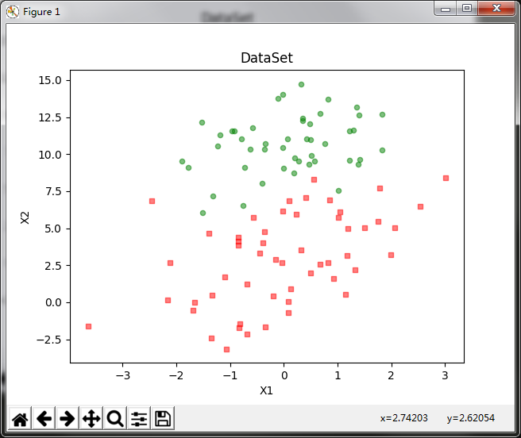](https://cuijiahua.com/wp-content/uploads/2017/11/ml_6_28.png)

从上图可以看出数据的分布情况。假设Sigmoid函数的输入记为z，那么z=w0x0 + w1x1 +  w2x2，即可将数据分割开。其中，x0为全是1的向量，x1为数据集的第一列数据，x2为数据集的第二列数据。另z=0，则0=w0 + w1x1 + w2x2。横坐标为x1，纵坐标为x2。这个方程未知的参数为w0，w1，w2，也就是我们需要求的回归系数(最优参数)。

### 2、训练算法

在编写代码之前，让我们回顾下梯度上升迭代公式：


将上述公式矢量化：

[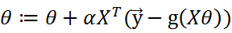](https://cuijiahua.com/wp-content/uploads/2017/11/ml_6_30.png)

根据矢量化的公式，编写代码如下：

```python
# -*- coding:UTF-8 -*-
import numpy as np

"""
函数说明:加载数据

Parameters:
    无
Returns:
    dataMat - 数据列表
    labelMat - 标签列表
Author:
    Jack Cui
Blog:
    http://blog.csdn.net/c406495762
Zhihu:
    https://www.zhihu.com/people/Jack--Cui/
Modify:
    2017-08-28
"""
def loadDataSet():
    dataMat = []                                                        #创建数据列表
    labelMat = []                                                        #创建标签列表
    fr = open('testSet.txt')                                            #打开文件   
    for line in fr.readlines():                                            #逐行读取
        lineArr = line.strip().split()                                    #去回车，放入列表
        dataMat.append([1.0, float(lineArr[0]), float(lineArr[1])])        #添加数据
        labelMat.append(int(lineArr[2]))                                #添加标签
    fr.close()                                                            #关闭文件
    return dataMat, labelMat                                            #返回

"""
函数说明:sigmoid函数

Parameters:
    inX - 数据
Returns:
    sigmoid函数
Author:
    Jack Cui
Blog:
    http://blog.csdn.net/c406495762
Zhihu:
    https://www.zhihu.com/people/Jack--Cui/
Modify:
    2017-08-28
"""
def sigmoid(inX):
    return 1.0 / (1 + np.exp(-inX))


"""
函数说明:梯度上升算法

Parameters:
    dataMatIn - 数据集
    classLabels - 数据标签
Returns:
    weights.getA() - 求得的权重数组(最优参数)
Author:
    Jack Cui
Blog:
    http://blog.csdn.net/c406495762
Zhihu:
    https://www.zhihu.com/people/Jack--Cui/
Modify:
    2017-08-28
"""
def gradAscent(dataMatIn, classLabels):
    dataMatrix = np.mat(dataMatIn)                                        #转换成numpy的mat
    labelMat = np.mat(classLabels).transpose()                            #转换成numpy的mat,并进行转置
    m, n = np.shape(dataMatrix)                                            #返回dataMatrix的大小。m为行数,n为列数。
    alpha = 0.001                                                        #移动步长,也就是学习速率,控制更新的幅度。
    maxCycles = 500                                                        #最大迭代次数
    weights = np.ones((n,1))
    for k in range(maxCycles):
        h = sigmoid(dataMatrix * weights)                                #梯度上升矢量化公式
        error = labelMat - h
        weights = weights + alpha * dataMatrix.transpose() * error
    return weights.getA()                                                #将矩阵转换为数组，返回权重数组

if __name__ == '__main__':
    dataMat, labelMat = loadDataSet()           
    print(gradAscent(dataMat, labelMat))
```

运行结果如图所示：

[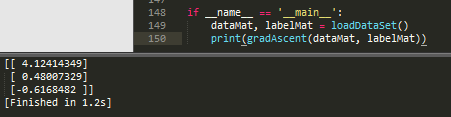](https://cuijiahua.com/wp-content/uploads/2017/11/ml_6_31.png)

可以看出，我们已经求解出回归系数[w0,w1,w2]。

通过求解出的参数，我们就可以确定不同类别数据之间的分隔线，画出决策边界。

### 3、绘制决策边界

我们已经解出了一组回归系数，它确定了不同类别数据之间的分隔线。现在开始绘制这个分隔线，编写代码如下：

```python
# -*- coding:UTF-8 -*-
import matplotlib.pyplot as plt
import numpy as np

"""
函数说明:加载数据

Parameters:
    无
Returns:
    dataMat - 数据列表
    labelMat - 标签列表
Author:
    Jack Cui
Blog:
    http://blog.csdn.net/c406495762
Zhihu:
    https://www.zhihu.com/people/Jack--Cui/
Modify:
    2017-08-28
"""
def loadDataSet():
    dataMat = []                                                        #创建数据列表
    labelMat = []                                                        #创建标签列表
    fr = open('testSet.txt')                                            #打开文件   
    for line in fr.readlines():                                            #逐行读取
        lineArr = line.strip().split()                                    #去回车，放入列表
        dataMat.append([1.0, float(lineArr[0]), float(lineArr[1])])        #添加数据
        labelMat.append(int(lineArr[2]))                                #添加标签
    fr.close()                                                            #关闭文件
    return dataMat, labelMat                                            #返回


"""
函数说明:sigmoid函数

Parameters:
    inX - 数据
Returns:
    sigmoid函数
Author:
    Jack Cui
Blog:
    http://blog.csdn.net/c406495762
Zhihu:
    https://www.zhihu.com/people/Jack--Cui/
Modify:
    2017-08-28
"""
def sigmoid(inX):
    return 1.0 / (1 + np.exp(-inX))

"""
函数说明:梯度上升算法

Parameters:
    dataMatIn - 数据集
    classLabels - 数据标签
Returns:
    weights.getA() - 求得的权重数组(最优参数)
Author:
    Jack Cui
Blog:
    http://blog.csdn.net/c406495762
Zhihu:
    https://www.zhihu.com/people/Jack--Cui/
Modify:
    2017-08-28
"""
def gradAscent(dataMatIn, classLabels):
    dataMatrix = np.mat(dataMatIn)                                        #转换成numpy的mat
    labelMat = np.mat(classLabels).transpose()                            #转换成numpy的mat,并进行转置
    m, n = np.shape(dataMatrix)                                            #返回dataMatrix的大小。m为行数,n为列数。
    alpha = 0.001                                                        #移动步长,也就是学习速率,控制更新的幅度。
    maxCycles = 500                                                        #最大迭代次数
    weights = np.ones((n,1))
    for k in range(maxCycles):
        h = sigmoid(dataMatrix * weights)                                #梯度上升矢量化公式
        error = labelMat - h
        weights = weights + alpha * dataMatrix.transpose() * error
    return weights.getA()                                                #将矩阵转换为数组，返回权重数组

"""
函数说明:绘制数据集

Parameters:
    weights - 权重参数数组
Returns:
    无
Author:
    Jack Cui
Blog:
    http://blog.csdn.net/c406495762
Zhihu:
    https://www.zhihu.com/people/Jack--Cui/
Modify:
    2017-08-30
"""
def plotBestFit(weights):
    dataMat, labelMat = loadDataSet()                                    #加载数据集
    dataArr = np.array(dataMat)                                            #转换成numpy的array数组
    n = np.shape(dataMat)[0]                                            #数据个数
    xcord1 = []; ycord1 = []                                            #正样本
    xcord2 = []; ycord2 = []                                            #负样本
    for i in range(n):                                                    #根据数据集标签进行分类
        if int(labelMat[i]) == 1:
            xcord1.append(dataArr[i,1]); ycord1.append(dataArr[i,2])    #1为正样本
        else:
            xcord2.append(dataArr[i,1]); ycord2.append(dataArr[i,2])    #0为负样本
    fig = plt.figure()
    ax = fig.add_subplot(111)                                            #添加subplot
    ax.scatter(xcord1, ycord1, s = 20, c = 'red', marker = 's',alpha=.5)#绘制正样本
    ax.scatter(xcord2, ycord2, s = 20, c = 'green',alpha=.5)            #绘制负样本
    x = np.arange(-3.0, 3.0, 0.1)
    y = (-weights[0] - weights[1] * x) / weights[2]
    ax.plot(x, y)
    plt.title('BestFit')                                                #绘制title
    plt.xlabel('X1'); plt.ylabel('X2')                                    #绘制label
    plt.show()       

if __name__ == '__main__':
    dataMat, labelMat = loadDataSet()           
    weights = gradAscent(dataMat, labelMat)
    plotBestFit(weights)
```


运行结果如下：

[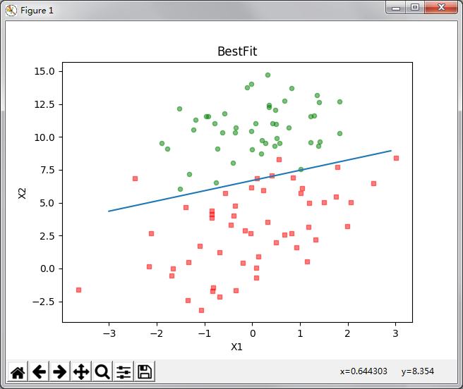](https://cuijiahua.com/wp-content/uploads/2017/11/ml_6_32.png)

这个分类结果相当不错，从上图可以看出，只分错了几个点而已。但是，尽管例子简单切数据集很小，但是这个方法却需要大量的计算(300次乘法)。因此下篇文章将对改算法稍作改进，从而减少计算量，使其可以应用于大数据集上。

## 四、总结

**Logistic回归的一般过程：**

- 收集数据：采用任意方法收集数据。
- 准备数据：由于需要进行距离计算，因此要求数据类型为数值型。另外，结构化数据格式则最佳。
- 分析数据：采用任意方法对数据进行分析。
- 训练算法：大部分时间将用于训练，训练的目的是为了找到最佳的分类回归系数。
- 测试算法：一旦训练步骤完成，分类将会很快。
- 使用算法：首先，我们需要输入一些数据，并将其转换成对应的结构化数值；接着，基于训练好的回归系数，就可以对这些数值进行简单的回归计算，判定它们属于哪个类别；在这之后，我们就可以在输出的类别上做一些其他分析工作。

**其他：**

- Logistic回归的目的是寻找一个非线性函数Sigmoid的最佳拟合参数，求解过程可以由最优化算法完成。