**前言**

> **本文为《**An overview of gradient descent optimization algorithms**》译文，自己在读完此文后收获很多，所以翻译过来，推荐大家阅读，对于英文能力不错的读者也可直接看原文。文章比较长，需要一定的耐心才能看完，但能受益不少。全文为本人逐字校对翻译，再者自己能力有限，难免理解偏差，还望指正。**


**摘要**

尽管梯度下降（Gradient descent）算法变得越来越受欢迎，但经常被看着做一个黑箱（black-box）优化器，同时也很难对其优点和缺点做一个有实际意义的解释。本文旨在让读者对不同的算法的执行流程有直观的认识，然后更好的去使用它们。在这篇综述中，我们可以了解到梯度下降算法的不同变体，总结这些算法面临的挑战，介绍最常使用的优化算法，回顾了并行和分布式（parallel and distributed）架构，并且调研了用于优化梯度下降的其他一些策略。

# **1 引言**

梯度下降法是最受欢迎的优化算法之一，也是目前优化神经网络（neural networks）最常使用的方法。同时，在每一个成熟的深度学习库中都包含了各种优化的梯度下降法的实现。然而，这些算法通常是作为黑箱优化器使用，因此，很难对其优点和缺点的进行实际的解释。

本文旨在让读者对不同的算法的执行流程有直观的认识，然后更好的去使用它们。在第二部分，我们首先介绍了梯度下降法的不同变体。在第三部分，我们将简要总结在训练的过程中所面临的挑战。在第四部分，我们将介绍最常用的优化算法，包括这些算法在解决以上挑战时所做的改进以及如何得到更新规则的推导形式。在第五部分，我们将简单介绍在并行和分布式环境中优化梯度下降的算法和框架。在第六部分，我们思考了对优化梯度下降有用的一些策略。

梯度下降法是使得目标函数$J(\theta)$ 最小化的一种方法，其中，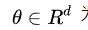为模型参数，梯度下降法利用目标函数关于参数的梯度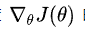 的反方向来更新参数。学习率决定达到全局最小值或者局部最小值的步长。换句话说，我们沿着目标函数的斜面下降的方向，直到到达谷底。

# **2 梯度下降法的变体**

下面介绍三种梯度下降法，它们的区别在于我们使用多少数据量去计算目标函数参数的梯度。根据数据量的不同，我们在参数更新的精度和更新所需要的时间两个方面做出平衡。

**2.1 批梯度下降法**

Vanilla梯度下降法，又称为批梯度下降法（batch gradient descent），在整个训练数据集上计算损失函数关于参数θ的梯度：

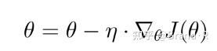

行每次更新时，我们需要先在整个数据集上计算完关于每个参数的所有梯度**（**一个参数在一个数据样本上会得到一个梯度（导数），所以数据集有多少个样本，每个参数就得计算多少个梯度，这些梯度最终决定该参数的更新梯度），所以其速度很慢，同时，批梯度下降法无法处理超出内存容量限制的数据集。批梯度下降法同样也不能在线更新模型。批梯度下降法的代码类似如下：

```text
for i in range(nb_epochs):
    params_grad = evaluate_gradient(loss_function, data, params)
    params = params - learning_rate * params_grad
```

给定迭代次数（epochs），我们首先利用整个数据集计算损失函数关于参数向量params的梯度向量params_grad。成熟的深度学习库中提供了自动求导的功能，可以有效地计算参数梯度。如果你自己求梯度，梯度检查是一个好习惯。

然后，我们利用梯度（一般沿梯度反方向）和学习率更新参数，学习率决定我们将以多大的步长更新参数。对于凸误差函数（convex error surfaces）批梯度下降法能够保证收敛到全局最小值（global minimum），对于非凸函数（non-convex surfaces），则收敛到一个局部最小值（local minimum）。

**2.2 随机梯度下降法**

相对于批梯度下降法，随机梯度下降法（stochastic gradient descent, SGD）根据每一条训练样本x(i)和标签y(i)更新参数：

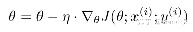

对于大的数据集，批梯度下降法会有很多冗余计算，在每一个参数更新之前，它会对相似的样本都计算梯度。而SGD在每一次更新中不会出现冗余计算。因而，通常SGD的运行速度更快，同时可以用于在线学习。SGD以高方差（high variance）且频繁地更新，这导致目标函数出现如图1所示的剧烈波动。

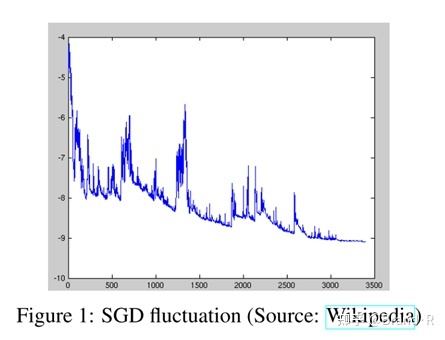

批梯度下降法会收敛到盆地（basin）最小值然后一直困于此（相当于陷入局部最小）。一方面，由于SGD的波动性其可以跳到一个新的或者潜在更好的局部最优。另一方面，这使得最终收敛到准确的最小值的过程变得复杂，因为SGD会一直持续波动。然而，已经证明当我们缓慢减小学习率，SGD与批梯度下降法具有相同的收敛行为，对于非凸优化和凸优化，可以分别收敛到局部最小值和全局最小值。与批梯度下降的代码相比，SGD的代码仅仅多加了一层循环来遍历每个样本求得对应梯度。注意，在每一次循环中，我们会打乱训练样本（6.1会有解释）。

```text
for i in range(nb_epochs):
    np.random.shuffle(data)
    for example in data:
        params_grad = evaluate_gradient(loss_function, example, params)
        params = params - learning_rate * params_grad
```

**2.3 小批量梯度下降法**

小批量梯度下降法（Mini-batch gradient descent）最终结合了上述两种方法的优点，在每次更新时使用n个小批量训练样本（现在我们通常使用的SGD就是小批量梯度下降法）：

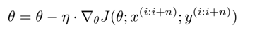

这种方法，a)减小了参数更新的方差，这样可以使得收敛更加稳定；b)可以利用成熟的深度学习库中高度优化的矩阵优化方法，高效地根据每个小批量数据求解参数的梯度。通常，小批量数据的大小在50到256之间，当然不同的应用有所变化。当训练神经网络模型时，小批量梯度下降法是典型的选择算法，小批量梯度下降法也直接称为SGD。注意：在下文的改进的SGD中，为了简洁，我们省略了参数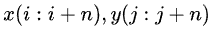 。在代码中，我们不会每个样本迭代一次，而是在每50个的小批量数据上进行迭代：

```text
for i in range(nb_epochs):
    np.random.shuffle(data)
    for batch in get_batches(data, batch_size=50):
        params_grad = evaluate_gradient(loss_function, batch, params)
        params = params - learning_rate * params_grad
```

# **3 挑战（Challenges）**

Vanilla小批量梯度下降法并不能保证较好的收敛性，但这也提出了一些挑战需要去处理：

1）选择一个合适的学习率通常比较困难。学习率太小会导致收敛很慢，学习率太大也会阻碍收敛并且导致损失函数在最小值附近波动甚至发散。

2）学习率调整策略试图在训练的过程中通过例如退火（annealing）的方法调整学习率，即根据预定义的策略或者当相邻两代之间的目标（损失）下降值小于某个阈值时减小学习率。然而，策略和阈值需要预先设定好，这也无法适应数据集的特点。

3）此外，对所有的参数更新使用同样的学习率。如果数据是稀疏的并且特征的频率差异很大时，我们也许不想以同样的学习率更新所有的参数，对于出现次数较少的特征，我们对其执行更大的学习率。

4）最小化神经网络中的高度非凸误差函数（highly non-convex error functions）的关键的挑战是使函数避免陷入无数个次优（suboptimal）的局部最小值。Dauphin等人[5]指出出现这种困难实际上并不是来自局部最小值，而是来自鞍点（saddle points），即那些在一个维度上是递增的，而在另一个维度上是递减的。这些鞍点通常位于一块平坦（plateau）的区域里，这个区域的点具有相似的误差且在任意维度上的梯度都近似为0，所以SGD很难从这些鞍点中逃离。

------

# **4 梯度下降优化算法**

接下来，我们将列举一些算法，这些算法被深度学习社区广泛用来处理前面提到的挑战。我们不会讨论那些在实际情况中不适合在高维数据集中计算的算法，例如诸如牛顿法的二阶方法。

## **4.1 动量法（Momentum）**

SGD很难通过峡谷（ravines），例如在一个维度上的表面弯曲程度远大于另一个维度[20]，这种情况通常出现在局部最优点附近。在这种情况下，SGD波动地通过陡谷的斜坡，同时，沿着底部到局部最优点的路径上只是缓慢地前进，这个过程如图2a所示。


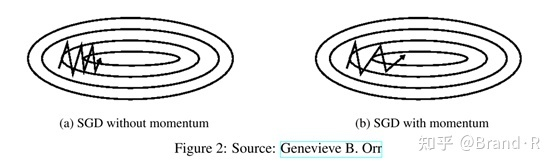

如图2b所示，动量法[17]是一种帮助SGD在相关方向上加速并抑制抖动的一种方法。它通过在当前更新向量中的历史更新向量增加一个分量γ来实现。

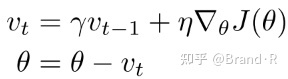

γ通常设置为0.9或者类似的值。

从本质上说，使用动量法，就像我们从山上推下一个球，球在滚下来的过程中累积动量，变得越来越快（直到达到终极速度，如果有空气阻力的存在，则γ<1）。以上过程就是对参数的更新过程一种直观描述：在那些与上一步梯度具有相同的方向的维度，其动量增大，相对于上一步梯度方向改变的维度，其动量减小。因此，我们可以得到更快的收敛速度，同时可以抑制抖动。

## **4.2 Nesterov加速梯度**

然而，球从山上滚下的时候，盲目地沿着斜坡方向，往往并不能令人满意。我们希望有一个更加聪明的球，这个球能够知道它将要去哪，以便于再一次遇到斜率（slopes）上升时能够知道减速。

Nesterov加速梯度下降法（Nesterov accelerated gradient，NAG）[14]能够给我们的动量项这样的意识。我们知道，我们利用动量项 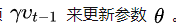 通过计算 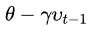能够对参数接下来的位置做一个估计（梯度此时并不参与整个更新），这也告诉我们参数大致更新为多少。我们可以有效的向前看，通过计算关于参数 ![[公式]](https://www.zhihu.com/equation?tex=%5Ctheta) 未来近似位置的梯度，而不是计算参数 ![[公式]](https://www.zhihu.com/equation?tex=%5Ctheta) 当前的梯度 ：

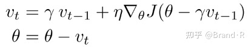

同时，我们设置γ大约为0.9。动量法首先计算参数当前的梯度值（图3中的小的蓝色向量），然后在过去的累积梯度（大的蓝色向量，这里的累计梯度应该是指 ![[公式]](梯度下降算法.assets/upsilon_{t-1}-16588264110954.svg+xml) ）方向上前进一大步，Nesterov加速梯度下降法首先在先前累积梯度（棕色的向量）方向上前进一大步，计算梯度值，然后做一个修正（红色的向量）。这个具有预见性的更新防止我们前进得太快，同时增强了算法的响应能力。这一点在很多的任务中对于RNN的性能提升有着重要的意义[2]。

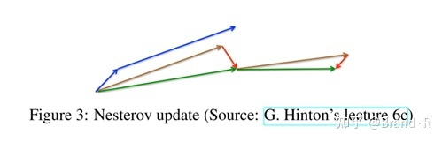

既然我们能够使得我们的更新适应误差函数的斜率以相应地加速SGD，我们同样也想要使得我们的更新能够适应每一个参数，以根据每个参数的重要性决定大的或者小的更新。

## **4.3 Adagrad**

Adagrad[8]是一种基于梯度的优化算法：可以让学习率适应参数，对于出现频率较低的特征对应的参数，我们对其采用更大的更新步长，对于出现频率较高的特征对应的参数，我们对其采用较小的更新步长。因此，Adagrad非常适合处理稀疏数据（sparse data）。Dean等人[6]发现Adagrad能够极大提高了SGD的鲁棒性（robustness）并将其应用于Google的大规模神经网络的训练，其中包含了YouTube视频中的猫的识别。此外，Pennington等人[16]利用Adagrad训练Glove词向量（word embeddings），因为低频词比高频词需要更大的更新步长以前我们每次更新所有的参数 ![[公式]](https://www.zhihu.com/equation?tex=%5Ctheta) 时，对每一个参数 ![[公式]](梯度下降算法.assets/theta_{i}.svg+xml) 都使用的是相同的学习率。由于Adagrad在第t步更新中对每一个参数 ![[公式]](https://www.zhihu.com/equation?tex=%5Ctheta_%7Bi%7D) 使用了不同的学习率，我们首先介绍Adagrad对每一个参数的更新，然后我们对其向量化。为了简洁，令 ![[公式]](梯度下降算法.assets/equation-16588264110955.svg+xml) 为在第t步目标函数关于参数 ![[公式]](https://www.zhihu.com/equation?tex=%5Ctheta_%7Bi%7D) 的梯度：

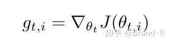

在第t步，对每个参数 ![[公式]](https://www.zhihu.com/equation?tex=%5Ctheta_%7Bi%7D) 的更新过程变为：

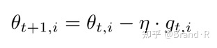

对于上述的更新规则，在第t步，基于 ![[公式]](https://www.zhihu.com/equation?tex=%5Ctheta_%7Bi%7D) 过去计算得到的历史梯度，Adagrad修正了原来的通用学习率去适应每一个参数 ![[公式]](https://www.zhihu.com/equation?tex=%5Ctheta_%7Bi%7D) ：

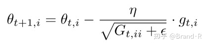

其中， ![[公式]](梯度下降算法.assets/equation-16588264110956.svg+xml) ∈Rd×d是一个对角矩阵（diagonal matrix），对角线上的元素i，i是从开始到t时刻为止所有关于 ![[公式]](https://www.zhihu.com/equation?tex=%5Ctheta_%7Bi%7D) 的梯度的平方和。ϵ是平滑项，用于防止除数为0（通常大约设置为1e-8）。比较有意思的是，如果没有平方根操作，算法的效果会变得很差。

由于 ![[公式]](梯度下降算法.assets/equation-16588264110956.svg+xml) 的对角线上元素包含了关于所有参数 ![[公式]](https://www.zhihu.com/equation?tex=%5Ctheta) 的历史梯度的平方和，现在，我们可以通过 ![[公式]](https://www.zhihu.com/equation?tex=G_%7Bt%7D) 和 ![[公式]](梯度下降算法.assets/equation-16588264110957.svg+xml) 之间的元素向量乘法⊙向量化上述的操作：

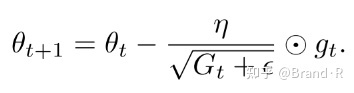

Adagrad算法的一个主要优点是无需手动调整学习率。大多数情况采用0.01的默认值。

Adagrad的一个主要缺点是分母中梯度平方的累积：由于平方的原因，每次累加都是加上一个正值（而非负值），在整个训练过程中，累加的结果会持续增长。这会导致学习率快速变小以至于最终变得无限小，这种情况下，算法将无法再学习到额外的新知识。接下来的算法旨在解决这个不足。

## **4.4 Adadelta**

Adadelta[22]是对Adagrad的一种改进算法，主要为了处理Adagrad学习速率单调递减（monotonically decreasing）的问题。相对于Adagrad会累积过去所有的梯度平方导致学习率无限变小，Adadelta将累积的梯度平方限制在值为w的固定窗口内。

在Adadelta中，不会像Adagrad那样低效率的存储先前的w个平方梯度，而是将梯度平方递归地表示成所有历史梯度平方的均值（decaying average of all past squared gradients）。在t时刻的均值E[g2]t只取决于先前的均值和当前的梯度（分量γ类似于动量项）：

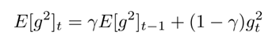

我们将γ设置成与动量相似的值，即0.9左右。为了简单起见，我们利用参数更新向量 ![[公式]](梯度下降算法.assets/equation-16588264110958.svg+xml) 重新表示SGD的更新过程：

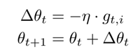

我们先前求导得到的Adagrad参数更新向量形式为：

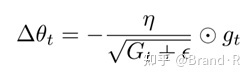

现在，我们用历史梯度的均值E[g2]t替换对角矩阵Gt：

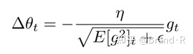

由于分母仅仅是梯度的均方根（root mean squared，RMS）误差，我们可以简写为：

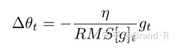

作者指出上述更新公式中的每个部分（SGD，动量或者Adagrad中也类似如此）并不匹配，即更新规则中必须与参数具有相似的假设部分。为了实现如此，作者首次定义了另一个指数衰减均值（exponentially decaying average），这次不是梯度平方，而是参数更新部分的平方：

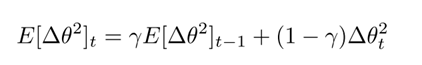

因此，参数更新的均方根误差为：

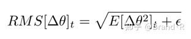

由于 ![[公式]](梯度下降算法.assets/equation-16588264110969.svg+xml) 是未知的，我们利用参数更新部分前一步的均方根来近似表示它。即用 ![[公式]](梯度下降算法.assets/theta]_{t-1}.svg+xml) 替换先前的更新规则中的学习率 ![[公式]](梯度下降算法.assets/eta.svg+xml) ,最终得到Adadelta的更新规则：

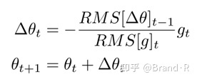

使用Adadelta算法，我们甚至都无需设置默认的学习率，因为更新规则中已经移除了学习率。

## **4.5 RMSprop**

RMSprop是一个未被发表的自适应学习率的算法，该算法由Geoff Hinton在其Coursera课堂的课程6e中提出。

RMSprop和Adadelta在相同的时间里被各自独立的提出，都是为了解决Adagrad学习率极速递减问题。实际上，RMSprop是先前我们得到的Adadelta的第一个更新向量的特例：

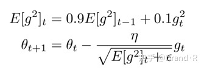

同样，RMSprop将学习率分解成一个平方梯度的指数衰减的平均。Hinton建议将γ设置为0.9，学习率η设置为固定值0.001。

## **4.6 Adam**

自适应矩估计（Adaptive Moment Estimation，Adam）[10]是另一种自适应学习率的算法，Adam对每一个参数都计算自适应的学习率。除了像Adadelta和RMSprop一样存储一个指数衰减的历史平方梯度的平均vt，Adam同时还保存一个历史梯度的指数衰减均值mt，类似于动量：

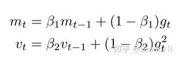

正如该算法的名称，mt和vt分别是对梯度的（first moment）一阶矩（均值）和（second moment）二阶矩（非中心方差）的估计。当mt和vt初始化为0向量时，Adam的作者发现它们都偏向于0，尤其是在初始化的步骤和当衰减率很小的时候（例如β1和β2趋向于1）。

通过对一阶矩估计和二阶矩估计的偏差校正来抵消偏差：

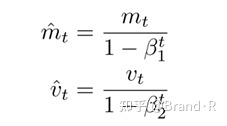

正如我们在Adadelta和RMSprop中看到的那样，他们利用上述的公式更新参数，由此生成了Adam的更新规则：

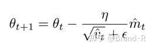

作者建议β1取默认值为0.9，β2为0.999，ϵ为10e-8，他们从经验上表明Adam在实际中表现很好，同时，与其他的自适应学习算法相比，其更有优势。

## **4.7 AdaMax**

Adam更新规则中的 ![[公式]](梯度下降算法.assets/equation-165882641109610.svg+xml) 因子与过去的梯度（ ![[公式]](梯度下降算法.assets/upsilon_{t-1}-16588264110954.svg+xml) ）和当前的梯度的 ![[公式]](梯度下降算法.assets/equation-165882641109611.svg+xml) 的![[公式]](梯度下降算法.assets/equation-165882641109612.svg+xml) 规范化成反比的缩放。

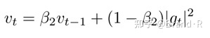

这个更新可以推广为 ![[公式]](梯度下降算法.assets/equation-165882641109613.svg+xml) 规范化，注意：Kingma和Ba也参数化 ![[公式]](梯度下降算法.assets/equation-165882641109614.svg+xml) 为 ![[公式]](梯度下降算法.assets/beta_{2}^{p}.svg+xml) :

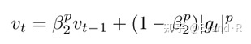

规范化使用更大的p值通常数值上变得不稳定，这也就是为什么在实际中 ![[公式]](梯度下降算法.assets/equation-165882641109615.svg+xml) 规范化使用最为广泛。然而， ![[公式]](梯度下降算法.assets/equation-165882641109716.svg+xml) 通常表现也很稳定。正是这个原因，作者提出了AdaMax[10]并且表明 ![[公式]](梯度下降算法.assets/equation-165882641109610.svg+xml) 加上 ![[公式]](https://www.zhihu.com/equation?tex=l_%E2%88%9E) 规范化能够收敛到一个更加稳定的值。为了避免和Adam混淆，我们使用 ![[公式]](梯度下降算法.assets/equation-165882641109717.svg+xml)来表示无穷规范化约束的 ![[公式]](https://www.zhihu.com/equation?tex=%CF%85_t) :


插入到Adam的更新等式中，用 ![[公式]](梯度下降算法.assets/equation-165882641109717.svg+xml) 代替 ![[公式]](梯度下降算法.assets/sqrt{υ+̂_t}%2Bϵ.svg+xml) 来得到AdaMax的更新规则：

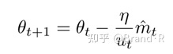

注意： ![[公式]](梯度下降算法.assets/equation-165882641109717.svg+xml) 依赖于max操作，它不像Adam中的 ![[公式]](梯度下降算法.assets/equation-165882641109718.svg+xml) 和 ![[公式]](https://www.zhihu.com/equation?tex=%CF%85_t) 会隐含的趋向于0，这也是为什么我们不需要为 ![[公式]](https://www.zhihu.com/equation?tex=%CE%BC_t) 计算一个偏差纠正（bias correction）。比较好的默认值为η=0.002 , β1=0.9, β2=0.999。

## **4.8 Nadam**

正如我们前面了解到，Adam可以看成是RMSprop和动量的结合，受RMSprop启发得到了（exponentially decaying average of past squared gradients）历史梯度平方的指数衰减平均 ![[公式]](https://www.zhihu.com/equation?tex=%CF%85_t)，而历史梯度的指数衰减平均 ![[公式]](梯度下降算法.assets/equation-165882641109718.svg+xml) 类似于动量。我们也可以看到 Nesterov accelerated gradient (NAG) 优于vanilla momentum。

Nadam (Nesterov-accelerated Adaptive Moment Estimation) [7]因此结合Adam和NAG。为了把NAG融入到Adam，我们需要修正他的动量项 ![[公式]](梯度下降算法.assets/equation-165882641109718.svg+xml) 。

首先，让我们回忆一下动量的更新规则，这里使用我们当前的符号来表示：

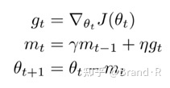

这里J是目标函数，γ是动量衰减项，η是我们的步长。展开上面第三个等式得到如下式子：

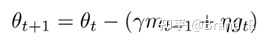

这个式子再一次证明了动量包含在前面动量向量 ![[公式]](梯度下降算法.assets/equation-165882641109719.svg+xml) 的方向上走一步加上在当前梯度方向上走一步。

在计算梯度之前，NAG利用动量可使我们在即将更新的参数的梯度方向上的步子迈的更加精准。因此我们仅需要修正梯度 ![[公式]](梯度下降算法.assets/equation-165882641109720.svg+xml) 为NAG中的形式：

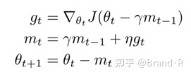

Dozat 提出通过如下方法来修正NAG：不像NAG中使用动量（momentum step）两次，一次是用于更新梯度 ![[公式]](梯度下降算法.assets/equation-165882641109720.svg+xml) ，另一次用于更新参数 ![[公式]](梯度下降算法.assets/theta_{t%2B1}.svg+xml) 。我们仅仅利用未来的动量向量直接更新当前的参数：

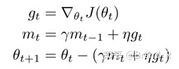

注意：我们这里不像NAG中利用以前的动量向量 ![[公式]](梯度下降算法.assets/equation-165882641109719.svg+xml) 来更新，而是使用当前的动量向量 ![[公式]](梯度下降算法.assets/equation-165882641109718.svg+xml) 来更新。为了把NAG加到Adam中，我们相似的用当前的动量向量替换之前的动量向量。我们首先回忆下Adam的更新规则如下（需要注意的是我们不用修正 ![[公式]](梯度下降算法.assets/equation-165882641109721.svg+xml) ）:

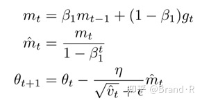

利用第一和第二个等式 ![[公式]](梯度下降算法.assets/equation-165882641109722.svg+xml) ， ![[公式]](梯度下降算法.assets/equation-165882641109718.svg+xml) 来展开上式第三个等式得：

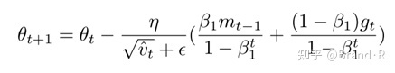

可以看到 ![[公式]](梯度下降算法.assets/beta_{1}^{t}}.svg+xml) 为上一步动量向量的偏差纠正（bias-corrected）估计。所以我们可以用 ![[公式]](梯度下降算法.assets/equation-165882641109723.svg+xml) 来代替：

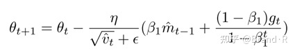

上式看上去和 ![[公式]](梯度下降算法.assets/theta_{t}+−+(γm_{t-1}+%2B+ηg_{t}).svg+xml) 很像。所以我们进行之前的操作使用当前的偏差纠正估计动量向量 ![[公式]](梯度下降算法.assets/equation-165882641109722.svg+xml) 代替 ![[公式]](梯度下降算法.assets/equation-165882641109723.svg+xml) 就得到了Nadam更新规则：

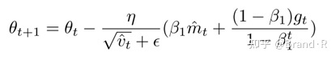

## **4.9 AMSGrad**

在神经网络训练中，自适应学习率方法已经成为一种常态化方法，但在一些情况下，实践者们发现：例如对于目标识别和机器翻译，自适应学习率方法很难收敛到理想状态，然而带动量的SGD却表现优异。

Reddi等人提出这个问题并且详细描述了导致自适应学习率方法泛化能力较差的原因在于历史梯度平方的指数移动平均（exponential moving average of past squared gradients）。指数平均（exponential average）概念的引入自然是一件好事，它能够有效的阻止随着训练的进行学习率变得无限小的情况，这也是Adagrad算法的主要缺点。然而，在其它一些场景下，这种短期的梯度记忆变成了一个障碍。

在一些场景中，Adam收敛到一个次优解，观察发现一些minibatches产生大的且信息丰富的梯度，但是这些minibatches却很少出现，指数平均（exponential averaging）削弱了他们带来的影响，因此导致收敛效果不好。作者也提供了一个简单的凸优化问题示例，这里可以看到Adam类似的表现行为。

为了修正这种行为，作者提出了一种新算法- AMSGrad。该算法使用历史梯度平方 ![[公式]](https://www.zhihu.com/equation?tex=%CF%85_t) 的最大值来更新参数而不是利用指数平均。 ![[公式]](https://www.zhihu.com/equation?tex=%CF%85_t) 的定义与Adam中一样。

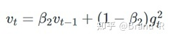

不像之前那样直接使用 ![[公式]](https://www.zhihu.com/equation?tex=%CF%85_t) （或者它的偏差纠正版本 ![[公式]](梯度下降算法.assets/equation-165882641109721.svg+xml) ）。现在来说，如果之前的 ![[公式]](梯度下降算法.assets/upsilon_{t-1}-16588264110954.svg+xml) 大于当前的 ![[公式]](https://www.zhihu.com/equation?tex=%CF%85_t)，那我们就用较大者 ![[公式]](https://www.zhihu.com/equation?tex=%5Cupsilon_%7Bt-1%7D) 。

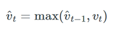

通过如此，AMSGrad使得步幅不增长，这就避免了Adam在一些情况中的问题。简单来说，作者去掉了Adam中的纠偏步骤。完整的不带偏差纠正估计的AMSGrad更新算法如下：

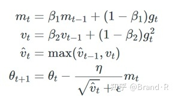

作者注意到，在一些小的数据集和CIFAR-10中，AMSGrad效果比Adam更好。然而，在其它实验中，要么效果和Adam相当，要么更差。让我们未来看看实际中AMSGrad是否表现会超越Adam。

## **4.10 其它一些优化器**

在AMSGrad之后，其它很多优化器相继被提出，包括AdamW，它修正了Adam的权重衰减，还有如QHAdam，AggMo等等。

## **4.11 算法可视化**

下面两张图给出了上述优化算法的优化行为的直观理解。在图4a中，我们看到不同算法在损失曲面的等高线上走的不同路线（Beale函数）。所有的算法都是从同一个点出发并选择不同路径到达最优点。注意：Adagrad，Adadelta和RMSprop能够立即转移到正确的移动方向上并以类似的速度收敛，而动量法和NAG会导致偏离，想象一下球从山上滚下的画面。然而，NAG能够在偏离之后快速修正其路线，因为NAG通过对最优点的预见增强其响应能力。

图4b中展示了不同算法在鞍点（saddle point）出的行为，鞍点即为一个点在一个维度上的斜率为正，而在其他维度上的斜率为负，正如我们前面提及的，鞍点对SGD是一个大的挑战。这里注意，SGD，动量法和NAG在鞍点处很难打破对称性，尽管后面两个算法最终设法逃离了鞍点。而Adagrad，RMSprop和Adadelta能够快速想着梯度为负的方向移动，其中Adadelta冲锋在前。

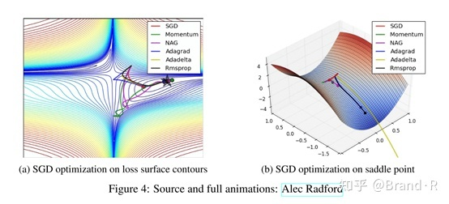

正如我们所看到的，自适应学习率方法如Adagrad，Adadelta，RMSprop和Adam，非常适合这些场景并取得最好的收敛性。

**4.12 如何选择优化器？**

那么，我们应该选择使用哪种优化器呢？如果输入数据是稀疏（sparse）的，选择任一自适应学习率算法都可能会得到最好的效果。选用这类算法的另一个好处是无需调整学习率，设置一个默认值就可能达到最好的结果。

总的来说，RMSprop是Adagrad的扩展形式，用于处理在Adagrad中快速递减的学习率问题。RMSprop与Adadelta比较类似，不同的是Adadelta在更新规则中使用参数更新的均方根RMS进行分子（numerator）更新。最后，Adam是将偏差校正和动量加入到RMSprop中。在这样的情况下，RMSprop、Adadelta和Adam是很相似的算法并且在相似的环境中性能都不错。Kingma等人[10]指出在优化后期由于梯度变得越来越稀疏，偏差校正能够帮助Adam微弱地胜过RMSprop。综合看来，Adam可能是最佳的选择。

有趣的是，最近许多论文中采用不带动量的SGD和一种简单的学习率退火策略。已表明，通常SGD能够找到最小值，但是比其他优化器需要花费更多的时间，与其他算法相比，SGD依赖更具鲁棒性的初始化和退火策略，同时，SGD可能会陷入鞍点，而不是局部极小值点。因此，如果你更需要快速收敛和训练一个深层的或者复杂的神经网络，你应该选择一个自适应学习率的方法。

# **5 并行和分布式SGD（Parallelizing and distributing SGD）**

当存在普遍的大规模数据和廉价的集群时，利用分布式SGD来加速是一个显然的选择。SGD本身有固有的序列：一步一步到达最小。SGD提供了良好的收敛性，但对于大型数据集运行缓慢。相反，SGD异步运行速度更快，但进程之间非最理想的通信会导致收敛不好。此外，我们也可以在一台机器上并行SGD，这样就无需大的计算集群。以下提出的算法和框架能够优化并行和分布式的SGD。

**5.1 Hogwild!**

Niu等人[15]提出称为Hogwild!的更新机制，Hogwild!允许在多个CPU上并行执行SGD更新。在无需对参数加锁的情况下，处理器可以访问共享的内存。这种方法只适用于稀疏的输入数据，因为每一次更新只会修改一部分参数。在这种情况下，该更新策略几乎可以达到一个最优的收敛速率，因为CPU之间不可能重写有用的信息。

**5.2 Downpour SGD**

Downpour SGD是SGD的一种异步的变形形式，在Google，Dean等人[6]在他们的DistBelief框架（TensorFlow的前身）中使用了该方法。Downpour SGD在训练集的子集上并行运行多个模型的副本。这些模型将各自的更新发送给一个参数服务器，参数服务器跨越了多台机器。每一台机器负责存储和更新模型的一部分参数。然而，因为副本之间是彼此不互相通信的，即通过共享权重或者更新，因此可能会导致参数发散而不利于收敛。

**5.3 延迟容忍SGD**

通过容忍延迟算法的开发，McMahan和Streeter[11]将AdaGraad扩展成并行的模式，该方法不仅适应于历史梯度，同时适应于更新延迟。该方法已经在实践中被证实是有效的。

**5.4 TensorFlow**

TensorFlow[1]是Google近期开源的框架，该框架用于实现和部署大规模机器学习模型。TensorFlow是基于DistBelief开发，同时TensorFlow已经在内部用来在大量移动设备和大规模分布式系统的执行计算。在2016年4月发布的分布式版本依赖于图计算，图计算即是对每一个设备将图划分成多个子图，同时，通过发送、接收节点对完成节点之间的通信。

**5.5 弹性平均SGD**

Zhang等人[22]提出的弹性平均SGD（Elastic Averaging SGD，EASGD）连接了异步SGD的参数客户端和一个弹性力，即参数服务器存储的一个中心变量。EASGD使得局部变量能够从中心变量震荡得更远，这在理论上使得在参数空间中能够得到更多的探索。经验表明这种增强的探索能力通过发现新的局部最优点，能够提高整体的性能。

# **6 优化SGD的其他策略**

最后，我们介绍可以与前面提及到的任一算法配合使用的其他的一些策略，以进一步提高SGD的性能。对于其他的一些常用技巧的概述可以参见[11]。

**6.1 数据集打乱和课程式学习（Shuffling and Curriculum Learning）**

总的来说，我们希望避免向我们的模型中以一定意义的顺序提供训练数据，因为这样会使得优化算法产生偏差。因此，在每一轮迭代后对训练数据洗牌是一个不错的主意。

另一方面，在很多情况下，我们是逐步解决问题的，而将训练集按照某个有意义的顺序排列会提高模型的性能和SGD的收敛性，如何将训练集建立一个有意义的排列被称为课程学习[3]。

Zaremba and Sutskever[20]只能使用课程学习训练LSTM来评估简单程序，并表明组合或混合策略比单一的策略更好，通过增加难度来排列示例。

**6.2 批量归一化（Batch normalization）**

为了便于学习，我们通常用0均值和单位方差初始化我们的参数的初始值来归一化。 随着不断训练，参数得到不同的程度的更新，我们失去了这种归一化，随着网络变得越来越深，这种现象会降低训练速度，且放大参数变化。

批量归一化[9]在每次小批量数据反向传播之后重新对参数进行0均值单位方差标准化。通过将模型架构的一部分归一化，我们能够使用更高的学习率，更少关注初始化参数。批量归一化还充当正则化的作用，减少（有时甚至消除）Dropout的必要性。

**6.3 提前停止（Early stopping）**

如Geoff Hinton所说：“Early Stopping是美丽的免费午餐”（NIPS 2015 Tutorial slides）。你因此必须在训练的过程中时常在验证集上监测误差，在验证集上如果损失函数不再显著地降低，那么应该提前结束训练。

**6.4 梯度噪音**

Neelakantan等人[12]在每个梯度更新中增加满足高斯分布N(0,σ2t)的噪音：

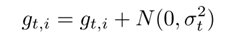

高斯分布的方差需要根据如下的策略退火（anneal）：

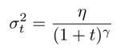

他们指出增加了噪音，使得网络对不好的初始化更加鲁棒，同时对深层的和复杂的网络的训练特别有益。他们猜测增加的噪音使得模型更优机会逃离当前的局部最优点，以发现新的局部最优点，这在更深层的模型中更加常见。

# **7 总结**

在这篇文章中，我们刚开始研究了梯度下降的三种形式，其中小批量梯度下降是最受欢迎的。然后我们研究了最常用于优化SGD的算法：动量法，Nesterov加速梯度，Adagrad，Adadelta，RMSprop，Adam以及不同的优化异步SGD的算法。 最后，我们考虑了其他一些改善SGD的策略，如洗牌和课程学习，批量归一化和提前停止。

**参考文献**

[1] Martin Abadi, Ashish Agarwal, Paul Barham, Eugene Brevdo, Zhifeng Chen, Craig Citro, Greg Corrado, Andy Davis, Jeffrey Dean, Matthieu Devin, Sanjay Ghemawat, Ian Goodfellow, Andrew Harp, Geoffrey Irving, Michael Isard, Yangqing Jia, Lukasz Kaiser, Manjunath Kudlur, Josh Levenberg, Dan Man, Rajat Monga, Sherry Moore, Derek Murray, Jon Shlens, Benoit Steiner, Ilya Sutskever, Paul Tucker, Vincent Vanhoucke, Vijay Vasudevan, Oriol Vinyals, Pete Warden, Martin Wicke, Yuan Yu, and Xiaoqiang Zheng. TensorFlow: Large-Scale Machine Learning on Heterogeneous Distributed Systems. 2015.

[2] Yoshua Bengio, Nicolas Boulanger-Lewandowski, and Razvan Pascanu. Advances in Optimizing Recurrent Networks. 2012.

[3] Yoshua Bengio, Jérôme Louradour, Ronan Collobert, and Jason Weston. Curriculum learning. Proceedings ofthe 26th annual international conference on machine learning, pages 41–48, 2009.

[4] C. Darken, J. Chang, and J. Moody. Learning rate schedules for faster stochastic gradient search. Neural Networks for Signal Processing II Proceedings of the 1992 IEEE Workshop, (September):1–11, 1992.

[5] Yann N. Dauphin, Razvan Pascanu, Caglar Gulcehre, Kyunghyun Cho, Surya Ganguli, and Yoshua Bengio. Identifying and attacking the saddle point problem in high-dimensional nonconvex optimization. arXiv, pages 1–14, 2014.

[6] Jeffrey Dean, Greg S. Corrado, Rajat Monga, Kai Chen, Matthieu Devin, Quoc V. Le, Mark Z. Mao, Marc Aurelio Ranzato, Andrew Senior, Paul Tucker, Ke Yang, and Andrew Y. Ng. Large Scale Distributed Deep Networks. NIPS 2012: Neural Information Processing Systems, pages 1–11, 2012.

[7] Timothy Dozat. Incorporating Nesterov Momentum into Adam. ICLRWorkshop, (1):2013–2016, 2016.

[8] John Duchi, Elad Hazan, and Yoram Singer. Adaptive Subgradient Methods for Online Learning and Stochastic Optimization. Journal ofMachine Learning Research, 12:2121–2159, 2011.

[9] Sergey Ioffe and Christian Szegedy. Batch Normalization: Accelerating Deep Network Training by Reducing Internal Covariate Shift. arXiv preprint arXiv:1502.03167v3, 2015.

[10] Diederik P. Kingma and Jimmy Lei Ba. Adam: a Method for Stochastic Optimization. International Conference on Learning Representations, pages 1–13, 2015.

[11] Yann LeCun, Leon Bottou, Genevieve B. Orr, and Klaus Robert Müller. Efficient BackProp. Neural Networks: Tricks ofthe Trade, 1524:9–50, 1998.

[12] H. Brendan Mcmahan and Matthew Streeter. Delay-Tolerant Algorithms for Asynchronous Distributed Online Learning. Advances in Neural Information Processing Systems (Proceedings ofNIPS), pages 1–9, 2014.

[13] Arvind Neelakantan, Luke Vilnis, Quoc V. Le, Ilya Sutskever, Lukasz Kaiser, Karol Kurach, and James Martens. Adding Gradient Noise Improves Learning for Very Deep Networks. pages 1–11, 2015.

[14] Yurii Nesterov. A method for unconstrained convex minimization problem with the rate of convergence o(1/k2). Doklady ANSSSR (translated as Soviet.Math.Docl.), 269:543–547.

[15] Feng Niu, Benjamin Recht, R Christopher, and Stephen J Wright. Hogwild!: A Lock-Free Approach to Parallelizing Stochastic Gradient Descent. pages 1–22, 2011.

[16] Jeffrey Pennington, Richard Socher, and Christopher D. Manning. Glove: Global Vectors for Word Representation. Proceedings ofthe 2014 Conference on Empirical Methods in Natural Language Processing, pages 1532–1543, 2014.

[17] Ning Qian. On the momentum term in gradient descent learning algorithms. Neural networks : the official journal ofthe International Neural Network Society, 12(1):145–151, 1999.

[18] Herbert Robbins and Sutton Monro. A Stochastic Approximation Method. The Annals of Mathematical Statistics, 22(3):400–407, 1951.

[19] Ilya Sutskever. Training Recurrent neural Networks. PhD thesis, page 101, 2013. 13[20] Richard S. Sutton. Two problems with backpropagation and other steepest-descent learning procedures for networks, 1986.

[21] Wojciech Zaremba and Ilya Sutskever. Learning to Execute. pages 1–25, 2014.

[22] Matthew D. Zeiler. ADADELTA: An Adaptive Learning Rate Method. arXiv preprint arXiv:1212.5701, 2012.

[23] Sixin Zhang, Anna Choromanska, and Yann LeCun. Deep learning with Elastic Averaging SGD. Neural Information Processing Systems Conference (NIPS 2015), pages 1–24, 2015.