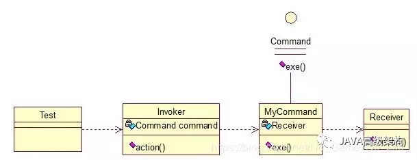

# 命令模式

命令模式很好理解，举个例子，司令员下令让士兵干件事情，从整个事情的角度来考虑，司令员的作用是，发出口令，口令经过传递，传到了士兵耳朵里，士兵去执行。这个过程好在，三者相互解耦，任何一方都不用去依赖其他人，只需要做好自己的事儿就行，司令员要的是结果，不会去关注到底士兵是怎么实现的。我们看看关系图：




Invoker是调用者（司令员），Receiver是被调用者（士兵），MyCommand是命令，实现了Command接口，持有接收对象，看实现代码：


```
public interface Command {  
    public void exe();  
}  
public class MyCommand implements Command {  

    private Receiver receiver;  

    public MyCommand(Receiver receiver) {  
        this.receiver = receiver;  
    }  

    @Override  
    public void exe() {  
        receiver.action();  
    }  
}  
public class Receiver {  
    public void action(){  
        System.out.println("command received!");  
    }  
}  
public class Invoker {  

    private Command command;  

    public Invoker(Command command) {  
        this.command = command;  
    }  

    public void action(){  
        command.exe();  
    }  
}  
public class Test {  

    public static void main(String[] args) {  
        Receiver receiver = new Receiver();  
        Command cmd = new MyCommand(receiver);  
        Invoker invoker = new Invoker(cmd);  
        invoker.action();  
    }  
}  
```

这个很好理解，命令模式的目的就是达到命令的发出者和执行者之间解耦，实现请求和执行分开，熟悉Struts的同学应该知道，Struts其实就是一种将请求和呈现分离的技术，其中必然涉及命令模式的思想！


**介绍**

**意图**：将一个请求封装成一个对象，从而使您可以用不同的请求对客户进行参数化。


**主要解决**：在软件系统中，行为请求者与行为实现者通常是一种紧耦合的关系，但某些场合，比如需要对行为进行记录、撤销或重做、事务等处理时，这种无法抵御变化的紧耦合的设计就不太合适。


**何时使用**：在某些场合，比如要对行为进行"记录、撤销/重做、事务"等处理，这种无法抵御变化的紧耦合是不合适的。在这种情况下，如何将"行为请求者"与"行为实现者"解耦？将一组行为抽象为对象，可以实现二者之间的松耦合。


**如何解决**：通过调用者调用接受者执行命令，顺序：调用者→接受者→命令。


**关键代码**：定义三个角色：1、received 真正的命令执行对象 2、Command 3、invoker 使用命令对象的入口


**应用实例**：struts 1 中的 action 核心控制器 ActionServlet 只有一个，相当于 Invoker，而模型层的类会随着不同的应用有不同的模型类，相当于具体的 Command。


**优点**： 1、降低了系统耦合度。 2、新的命令可以很容易添加到系统中去。


**缺点**：使用命令模式可能会导致某些系统有过多的具体命令类。


**使用场景**：认为是命令的地方都可以使用命令模式，比如： 1、GUI 中每一个按钮都是一条命令。 2、模拟 CMD。


**注意事项**：系统需要支持命令的撤销(Undo)操作和恢复(Redo)操作，也可以考虑使用命令模式，见命令模式的扩展。